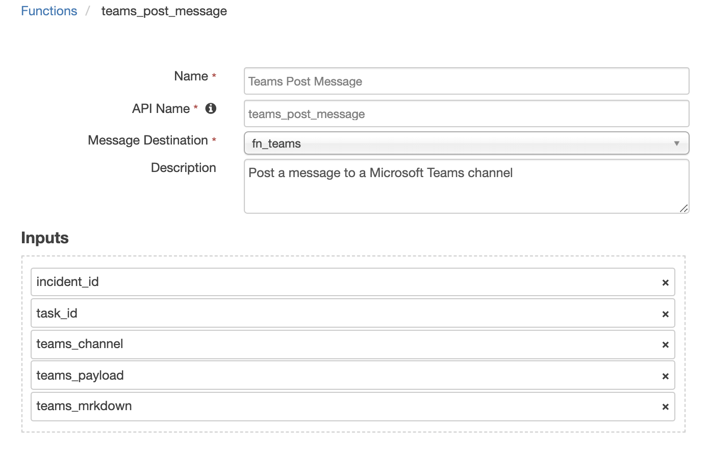

<!--
  This User README.md is generated by running:
  "resilient-circuits docgen -p fn_teams --only-user-guide"

  It is best edited using a Text Editor with a Markdown Previewer. VS Code
  is a good example. Checkout https://guides.github.com/features/mastering-markdown/
  for tips on writing with Markdown

  If you make manual edits and run docgen again, a .bak file will be created

  Store any screenshots in the "doc/screenshots" directory and reference them like:
  
-->

# **User Guide:** fn_teams_v1.0.0

## Table of Contents
- [Key Features](#key-features)
- [Function - Teams Post Message](#function---teams-post-message)
- [Rules](#rules)

---

## Key Features
<!--
  List the Key Features of the Integration
-->
* Post Incident data to an existing Microsoft Teams channel
* Utilizes the Teams' MessageCard format for message formatting
* Includes example rules and workflows to post incident and task information to a channel

---

## Function - Teams Post Message
Post a message to a Microsoft Teams channel. This function is used for all communications to Teams. The `teams_payload` is used to define the data to post. 
See the pre-processing script below for an example of formatting incident data for posting.

```
format of a payload. * = optional
{ "title"*: xx, 
  "summary": xx, 
  "sections": [
                { "title"*: yy, 
                  "text"*: yy, 
                  "facts"*: [{"name": zz, "value": zz}]
                }
              ]
}
```

 

<details><summary>Inputs:</summary>
<p>

| Name | Type | Required | Example | Tooltip |
| ---- | :--: | :------: | ------- | ------- |
| `incident_id` | `number` | Yes | `-` | - |
| `task_id` | `number` | No | `-` | - |
| `teams_channel` | `text` | Yes | `-` | Lookup label to channel to post a message |
| `teams_mrkdown` | `boolean` | Yes | `-` | Yes / No |
| `teams_payload` | `text` | Yes | `-` | json of teams conversation message: title, text, sections, facts |

</p>
</details>

<details><summary>Outputs:</summary>
<p>
No output is available.
</p>
</details>

<details><summary>Example Pre-Process Script:</summary>
<p>

```python
from java.util import Date

inputs.incident_id = incident.id

"""
format of a payload. * = optional
{ "title"*: xx, 
  "summary": xx, 
  "sections": [{ "title"*: yy, "text"*: yy, 
                        "facts"*: [{"name": zz, "value": zz}]
              }]
}
"""

payload = u"""{{ "summary": "Resilient Incident", "sections": [ 
  {{ "facts": [ 
    {{ "name": "Name", "value": "{}" }}, 
    {{ "name": "Description", "value": "{}" }}, 
    {{ "name": "Id", "value": "{}" }}, 
    {{ "name": "Owner", "value": "{}" }}, 
    {{ "name": "Types", "value": "{}" }}, 
    {{ "name": "NIST Attack Vectors", "value": "{}" }}, 
    {{ "name": "Create Date", "value": "{}" }}, 
    {{ "name": "Date Occurred", "value": "{}" }}, 
    {{ "name": "Discovered Date", "value": "{}" }}, 
    {{ "name": "Confirmed", "value": "{}" }}, 
    {{ "name": "Severity", "value": "{}" }} 
   ]
  }}
 ] 
}} 
""".format(incident.name, incident.description.content.replace('"', '\\"') if incident.description else "-", incident.id,
   incident.owner_id if incident.owner_id else "-",
   ", ".join(str(x) for x in incident.incident_type_ids), ", ".join(str(x) for x in incident.nist_attack_vectors),
   Date(incident.create_date), Date(incident.start_date) if incident.start_date else "-", Date(incident.discovered_date),
   "True" if incident.confirmed else "False",
   "-" if not incident.severity_code else incident.severity_code
   )

inputs.teams_payload = payload
```

</p>
</details>

<details><summary>Example Post-Process Script:</summary>
<p>

```python
None
```

</p>
</details>

---


## Rules
| Rule Name | Object | Workflow Triggered |
| --------- | ------ | ------------------ |
| Example: Post an Incident to Microsoft Teams | incident | `example_post_incident_to_ms_teams` |
| Example: Post a Task to Microsoft Teams | task | `example_post_task_to_microsoft_teams` |

---

<!--
## Inform Resilient Users
  Use this section to optionally provide additional information so that Resilient playbook 
  designer can get the maximum benefit of your integration.
-->