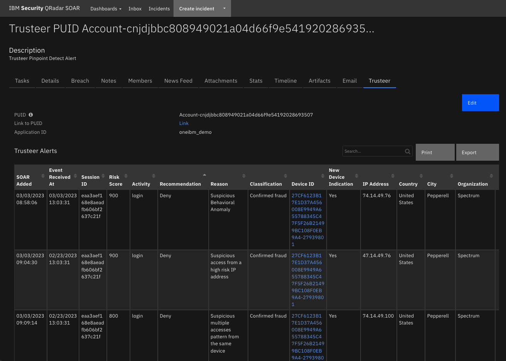
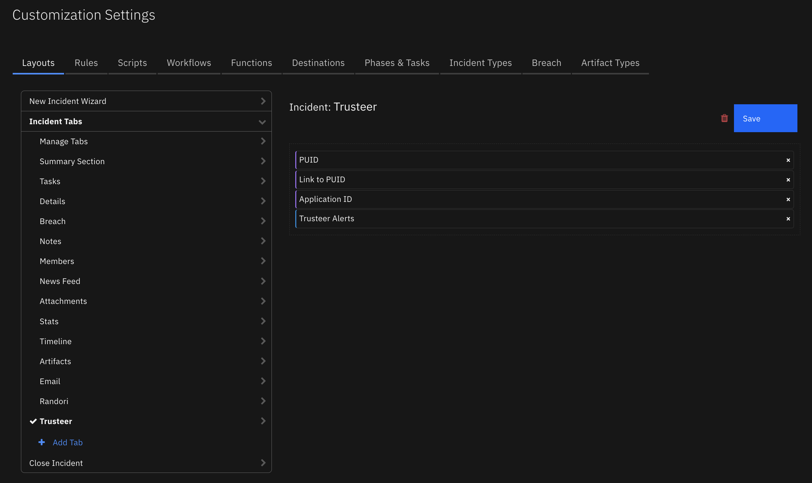
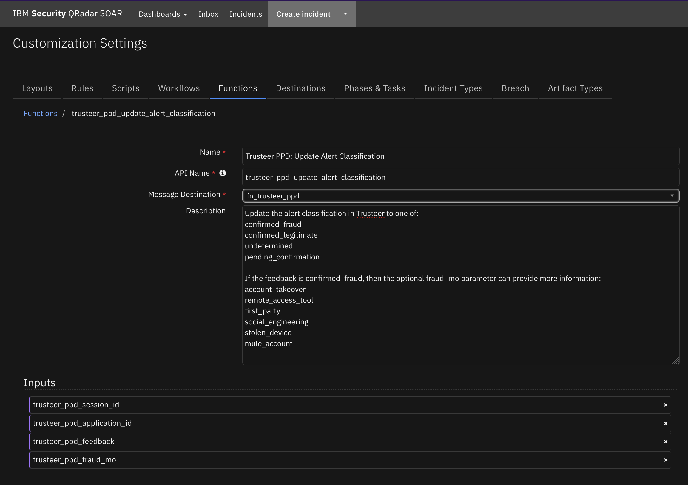
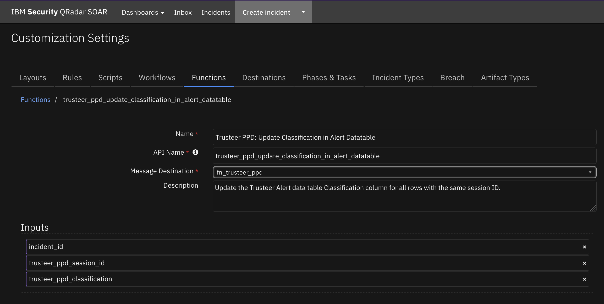
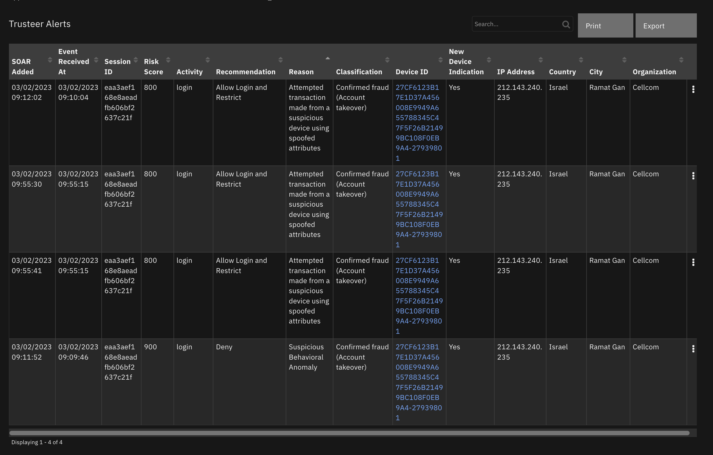

<!--
  This README.md is generated by running:
  "resilient-sdk docgen -p fn_trusteer_ppd"

  This file was generated with resilient-sdk v48.1.0

  It is best edited using a Text Editor with a Markdown Previewer. VS Code
  is a good example. Checkout https://guides.github.com/features/mastering-markdown/
  for tips on writing with Markdown

  All fields followed by "::CHANGE_ME::"" should be manually edited

  If you make manual edits and run docgen again, a .bak file will be created

  Store any screenshots in the "doc/screenshots" directory and reference them like:
  

  NOTE: If your app is available in the container-format only, there is no need to mention the integration server in this readme.
-->

# Trusteer Pinpoint Detect

## Table of Contents
- [Release Notes](#release-notes)
- [Overview](#overview)
  - [Key Features](#key-features)
- [Requirements](#requirements)
  - [SOAR platform](#soar-platform)
  - [Cloud Pak for Security](#cloud-pak-for-security)
  - [Proxy Server](#proxy-server)
  - [Python Environment](#python-environment)
- [Installation](#installation)
  - [Install](#install)
  - [App Configuration](#app-configuration)
  - [Custom Layouts](#custom-layouts)
- [Function - Trusteer PPD: Get URL Links to Trusteer](#function---trusteer-ppd-get-url-links-to-trusteer)
- [Function - Trusteer PPD: Update Alert Classification](#function---trusteer-ppd-update-alert-classification)
- [Function - Trusteer PPD: Update Classification in Alert Datatable](#function---trusteer-ppd-update-classification-in-alert-datatable)
- [Script - Trusteer PPD: Create Artifacts](#script---trusteer-ppd-create-artifacts)
- [Script - Trusteer PPD: Create Case from Email](#script---trusteer-ppd-create-case-from-email)
- [Data Table - Trusteer Alerts](#data-table---trusteer-alerts)
- [Custom Fields](#custom-fields)
- [Custom Artifact Types](#custom-artifact-types)
- [Rules](#rules)
- [Playbooks](#playbooks)
- [Troubleshooting & Support](#troubleshooting--support)

---

## Release Notes
<!--
  Specify all changes in this release. Do not remove the release 
  notes of a previous release
-->
| Version | Date | Notes |
| ------- | ---- | ----- |
| 1.0.0 | 03/2023 | Initial Release |

---

## Overview
<!--
  Provide a high-level description of the function itself and its remote software or application.
  The text below is parsed from the "description" and "long_description" attributes in the setup.py file
-->
**IBM SOAR app for Trusteer Pinpoint Detect**

  <!-- ::CHANGE_ME:: -->

Bi-directional App for Trusteer Pinpoint Detect. Parse emails from Trusteer Pinpoint Detect 
        and create cases in SOAR and send classification information back to Trusteer.<br>


        <ul><a target='blank' href='https://ibm.com/mysupport'>Support</a></ul>

        <ul><a target='blank' href='https://ideas.ibm.com/'>Enhancement Requests</a></ul>

### Key Features
<!--
  List the Key Features of the Integration
-->
* Key Feature 1 <!-- ::CHANGE_ME:: -->
* Key Feature 2 <!-- ::CHANGE_ME:: -->
* Key Feature 3 <!-- ::CHANGE_ME:: -->

---

## Requirements
<!--
  List any Requirements 
--> 
<!-- ::CHANGE_ME:: -->
This app supports the IBM Security QRadar SOAR Platform and the IBM Security QRadar SOAR for IBM Cloud Pak for Security.

### SOAR platform
The SOAR platform supports two app deployment mechanisms, Edge Gateway (formerly App Host) and integration server.

If deploying to a SOAR platform with an Edge Gateway, the requirements are:
* SOAR platform >= `45.0.7899`.
* The app is in a container-based format (available from the AppExchange as a `zip` file).

If deploying to a SOAR platform with an integration server, the requirements are:
* SOAR platform >= `45.0.7899`.
* The app is in the older integration format (available from the AppExchange as a `zip` file which contains a `tar.gz` file).
* Integration server is running `resilient-circuits>=47.1.0`.
* If using an API key account, make sure the account provides the following minimum permissions: 
  | Name | Permissions |
  | ---- | ----------- |
  | Org Data | Read |
  | Function | Read |
  | Incidents | Read |
  | Edit Incidents | Fields |
  | Layouts | Read, Edit |

The following SOAR platform guides provide additional information: 
* _Edge Gateway Deployment Guide_ or _App Host Deployment Guide_: provides installation, configuration, and troubleshooting information, including proxy server settings. 
* _Integration Server Guide_: provides installation, configuration, and troubleshooting information, including proxy server settings.
* _System Administrator Guide_: provides the procedure to install, configure and deploy apps. 

The above guides are available on the IBM Documentation website at [ibm.biz/soar-docs](https://ibm.biz/soar-docs). On this web page, select your SOAR platform version. On the follow-on page, you can find the _Edge Gateway Deployment Guide_, _App Host Deployment Guide_, or _Integration Server Guide_ by expanding **Apps** in the Table of Contents pane. The System Administrator Guide is available by expanding **System Administrator**.

### Cloud Pak for Security
If you are deploying to IBM Cloud Pak for Security, the requirements are:
* IBM Cloud Pak for Security >= `1.8`.
* Cloud Pak is configured with an Edge Gateway.
* The app is in a container-based format (available from the AppExchange as a `zip` file).

The following Cloud Pak guides provide additional information: 
* _Edge Gateway Deployment Guide_ or _App Host Deployment Guide_: provides installation, configuration, and troubleshooting information, including proxy server settings. From the Table of Contents, select Case Management and Orchestration & Automation > **Orchestration and Automation Apps**.
* _System Administrator Guide_: provides information to install, configure, and deploy apps. From the IBM Cloud Pak for Security IBM Documentation table of contents, select Case Management and Orchestration & Automation > **System administrator**.

These guides are available on the IBM Documentation website at [ibm.biz/cp4s-docs](https://ibm.biz/cp4s-docs). From this web page, select your IBM Cloud Pak for Security version. From the version-specific IBM Documentation page, select Case Management and Orchestration & Automation.

### Proxy Server
The app **does/does not** <!-- ::CHANGE_ME:: --> support a proxy server.

### Python Environment
Python 3.6 and Python 3.9 are supported.
Additional package dependencies may exist for each of these packages:
* resilient-circuits>=47.1.0

### IBM Trusteer Development Version

This app has been implemented using:
| Product Name | Product Version | API URL | API Version |
| ------------ | --------------- | ------- | ----------- |
| IBM Trusteer | 11.7 | https://orgname-api.trusteer.com/api/v1/ (Feedback Loop API)| v1 |

#### Prerequisites
<!--
List any prerequisites that are needed to use with this endpoint solution. Remove any section that is unnecessary.
-->
* Prereq A <!-- ::CHANGE_ME:: -->
* Prereq B <!-- ::CHANGE_ME:: -->
* Prereq C <!-- ::CHANGE_ME:: -->

#### Configuration
<!--
List any steps that are needed to configure the endpoint to use this app.
-->
* Config A <!-- ::CHANGE_ME:: -->
* Config B <!-- ::CHANGE_ME:: -->
* Config C <!-- ::CHANGE_ME:: -->

#### Permissions
<!--
List any user permissions that are needed to use this endpoint. For example, list the API key permissions.
-->
* Permission A <!-- ::CHANGE_ME:: -->
* Permission B <!-- ::CHANGE_ME:: -->
* Permission C <!-- ::CHANGE_ME:: -->


---

## Installation

### Install
* To install or uninstall an App or Integration on the _SOAR platform_, see the documentation at [ibm.biz/soar-docs](https://ibm.biz/soar-docs).
* To install or uninstall an App on _IBM Cloud Pak for Security_, see the documentation at [ibm.biz/cp4s-docs](https://ibm.biz/cp4s-docs) and follow the instructions above to navigate to Orchestration and Automation.

### App Configuration
The following table provides the settings you need to configure the app. These settings are made in the app.config file. See the documentation discussed in the Requirements section for the procedure.

| Config | Required | Example | Description |
| ------ | :------: | ------- | ----------- |
| **api_token** | Yes | `xxx` | *Trusteer token used to make REST API call.* |
| **api_version** | Yes | `v1` | *Trusteer REST API version.* |
| **client_auth_cert** | Yes | `<path_to_cert.pem>` | *Path to client authorization certificate file used to make REST API call.* |
| **client_auth_key** | Yes | `<path_to_key.pem>` | *Path to client authorization key file used to make REST API call.* |
| **customer_name** | Yes | `` | *Trusteer customer name. Used to form URL for links back to Trusteer and to call feedback REST API endpoint.* |

### Custom Layouts
<!--
  Use this section to provide guidance on where the user should add any custom fields and data tables.
  You may wish to recommend a new incident tab.
  You should save a screenshot "custom_layouts.png" in the doc/screenshots directory and reference it here
-->
* Import the Data Tables and Custom Fields like the screenshot below:

   <!-- ::CHANGE_ME:: -->


---

## Function - Trusteer PPD: Get URL Links to Trusteer
Return the URL links to the Trusteer session PUIDs and the devices.

  <!-- ::CHANGE_ME:: -->

<details><summary>Inputs:</summary>
<p>

| Name | Type | Required | Example | Tooltip |
| ---- | :--: | :------: | ------- | ------- |
| `trusteer_ppd_device_id` | `text` | No | `-` | - |
| `trusteer_ppd_puid` | `text` | No | `-` | - |

</p>
</details>

<details><summary>Outputs:</summary>
<p>

> **NOTE:** This example might be in JSON format, but `results` is a Python Dictionary on the SOAR platform.

```python
results = {
  "content": {
    "link_url_device_id": null,
    "link_url_puid": "https://customer-name.trusteer.com/search-results?puid=PUID-808949021a04d66f9e54192028693507"
  },
  "inputs": {
    "trusteer_ppd_puid": "PUID-808949021a04d66f9e54192028693507"
  },
  "metrics": {
    "execution_time_ms": 1,
    "host": "laptop.local",
    "package": "fn-trusteer-ppd",
    "package_version": "1.0.0",
    "timestamp": "2023-02-27 14:24:00",
    "version": "1.0"
  },
  "raw": null,
  "reason": null,
  "success": true,
  "version": 2.0
}
```

</p>
</details>

<details><summary>Example Pre-Process Script:</summary>
<p>

```python
None
```

</p>
</details>

<details><summary>Example Post-Process Script:</summary>
<p>

```python
None
```

</p>
</details>

---
## Function - Trusteer PPD: Update Alert Classification
Update the alert classification in Trusteer to : confirmed_fraud, confirmed_legitimate, undetermined, or pending_confirmation.  If the feedback is confirmed_fraud, then the optional fraud_mo parameter can provide more information.

  <!-- ::CHANGE_ME:: -->

<details><summary>Inputs:</summary>
<p>

| Name | Type | Required | Example | Tooltip |
| ---- | :--: | :------: | ------- | ------- |
| `trusteer_ppd_application_id` | `text` | Yes | `-` | - |
| `trusteer_ppd_feedback` | `select` | Yes | `-` | - |
| `trusteer_ppd_fraud_mo` | `select` | No | `-` | If you set feedback to confirmed_fraud and confirm that the session was fraudulent, you can also set the specific type of fraud that occurred. If you are not sure of the type of fraud, do not set the fraud_mo field. |
| `trusteer_ppd_session_id` | `text` | Yes | `-` | - |

</p>
</details>

<details><summary>Outputs:</summary>
<p>

> **NOTE:** This example might be in JSON format, but `results` is a Python Dictionary on the SOAR platform.

```python
results = {
  "content": {
    "data": {
      "api_request_id": "82825B58-70CA-4B04-9BD2-E65E112AA417"
    },
    "message": "OK",
    "status": "success"
  },
  "inputs": {
    "trusteer_ppd_application_id": "demo_app",
    "trusteer_ppd_feedback": "pending_confirmation",
    "trusteer_ppd_fraud_mo": null,
    "trusteer_ppd_session_id": "eaa3aef168e8aeadfb606bf2637c21f"
  },
  "metrics": {
    "execution_time_ms": 3517,
    "host": "laptop.local",
    "package": "fn-trusteer-ppd",
    "package_version": "1.0.0",
    "timestamp": "2023-02-28 16:57:36",
    "version": "1.0"
  },
  "raw": null,
  "reason": null,
  "success": true,
  "version": 2.0
}
```

</p>
</details>

<details><summary>Example Pre-Process Script:</summary>
<p>

```python
None
```

</p>
</details>

<details><summary>Example Post-Process Script:</summary>
<p>

```python
None
```

</p>
</details>

---
## Function - Trusteer PPD: Update Classification in Alert Datatable
Update the Trusteer Alert data table Classification column for all rows with the same session ID.

  <!-- ::CHANGE_ME:: -->

<details><summary>Inputs:</summary>
<p>

| Name | Type | Required | Example | Tooltip |
| ---- | :--: | :------: | ------- | ------- |
| `incident_id` | `number` | Yes | `-` | - |
| `trusteer_ppd_classification` | `text` | Yes | `-` | - |
| `trusteer_ppd_session_id` | `text` | Yes | `-` | - |

</p>
</details>

<details><summary>Outputs:</summary>
<p>

> **NOTE:** This example might be in JSON format, but `results` is a Python Dictionary on the SOAR platform.

```python
results = {
  "content": {
    "num_rows_updated": 5
  },
  "inputs": {
    "incident_id": 3326,
    "trusteer_ppd_classification": "Confirmed fraud (Stolen device)",
    "trusteer_ppd_session_id": "xxx3aef168e8aeadfb606bf2637cxxx"
  },
  "metrics": {
    "execution_time_ms": 5647,
    "host": "laptop.local",
    "package": "fn-trusteer-ppd",
    "package_version": "1.0.0",
    "timestamp": "2023-03-01 10:23:36",
    "version": "1.0"
  },
  "raw": null,
  "reason": null,
  "success": true,
  "version": 2.0
}
```

</p>
</details>

<details><summary>Example Pre-Process Script:</summary>
<p>

```python
None
```

</p>
</details>

<details><summary>Example Post-Process Script:</summary>
<p>

```python
None
```

</p>
</details>

---

## Script - Trusteer PPD: Create Artifacts
This script will create artifacts from the items in a row of the Trusteer Alerts data table.

**Object:** incident

<details><summary>Script Text:</summary>
<p>

```python
artifact_value = row.trusteer_ppd_dt_user_ip_address
if artifact_value:
  incident.addArtifact("IP Address", artifact_value, "Created by Trusteer PPD.")
  
device_link = row.trusteer_ppd_dt_device_id_and_link.content
if device_link:
  # Parse the device ID out of the HTML text link
  parsed_device_id = device_link.split('">')
  if parsed_device_id[1]:
    device_id = parsed_device_id[1].split('</a>')
    if device_id[0]:
      incident.addArtifact("trusteer_ppd_device_id", device_id[0], "Created by Trusteer PPD.")
```

</p>
</details>

---
## Script - Trusteer PPD: Create Case from Email
Parse an email from Trusteer Pinpoint Detect and create a case if there is not an Active case with the PUID already in SOAR.

**Object:** __emailmessage

<details><summary>Script Text:</summary>
<p>

```python
# (c) Copyright IBM Corp. 2010, 2023. All Rights Reserved.
import re
import time
import calendar
from datetime import datetime

# The new incident owner - the email address of a user or the name of a group and cannot be blank.
# Change this value to reflect who will be the owner of the incident before running the script.
new_case_owner = "admin@example.com"

# Change to True if you have Outbound Email 2.0+ installed and wish to capture the inbound email as a conversation 
SAVE_CONVERSATION = False

# pattern used to find and extract the email message-id
MESSAGE_PATTERN = re.compile(r"([^<>]+)")
# check for any combination of upper/lowercase http/https/news/telnet/file. Characters repeated for readability
DEFANG_PATTERN = re.compile(r"(https|http|ftps|ftp|mailto|news|file|mailto):", re.IGNORECASE)
# possible message-id names
MESSAGE_ID_LIST =  ["message-id", "x-original-message-id", "x-microsoft-original-message-id", "x-google-original-message-id"]
# Supported Feed type from Trusteer
TRUSTEER_PPD_FEED_ITEM_TYPE_SUPPORTED = "Pinpoint Criminal Detection suspicious access detected"

# Trusteer PPD email key names
ACTIVITY = "Activity"
APPLICATION_ID = "Application ID"
EVENT_RECEIVED_AT = "Event received at"
FEED_ITEM_TYPE = "Feed item type"
CITY_NAME = "City name"
COUNTRY_NAME = "Country name"
DETECTED_AT = "Detected at"
GLOBAL_DEVICE_ID = "Global Device ID"
IS_TARGETED = "Is Targeted"
MALWARE = "Malware"
NEW_DEVICE_INDICATION = "New Device Indication"
ORGANIZATION = "Organization"
PERMANENT_USER_ID = "Permanent User ID"
REASON = "Reason"
REASON_ID = "Reason ID"
RECOMMENDATION = "Recommendation"
RESOLUTION_ID = "Resolution ID"
RISK_SCORE = "Risk Score"
SESSION_ID = "Session ID"
TRUSTEER_ENDPOINT_PROTECTION_DEVICE_ID = "Trusteer Endpoint Protection Device ID"
USER_IP_ADDRESS = "User IP Address"
USER_AGENT_STRING = "User Agent String"

COUNTRY_NAMES = {
    "N/A": "-",
    "AFG": "Afghanistan",
    "ALA": "Åland Islands",
    "ALB": "Albania",
    "DZA": "Algeria",
    "ASM": "American Samoa",
    "AND": "Andorra",
    "AGO": "Angola",
    "AIA": "Anguilla",
    "ATA": "Antarctica",
    "ATG": "Antigua and Barbuda",
    "ARG": "Argentina",
    "ARM": "Armenia",
    "ABW": "Aruba",
    "AUS": "Australia",
    "AUT": "Austria",
    "AZE": "Azerbaijan",
    "BHS": "Bahamas",
    "BHR": "Bahrain",
    "BGD": "Bangladesh",
    "BRB": "Barbados",
    "BLR": "Belarus",
    "BEL": "Belgium",
    "BLZ": "Belize",
    "BEN": "Benin",
    "BMU": "Bermuda",
    "BTN": "Bhutan",
    "BOL": "Plurinational State of Bolivia",
    "BES": "Sint Eustatius and Saba Bonaire",
    "BIH": "Bosnia and Herzegovina",
    "BWA": "Botswana",
    "BVT": "Bouvet Island",
    "BRA": "Brazil",
    "IOT": "British Indian Ocean Territory",
    "VGB": "British Virgin Islands",
    "BRN": "Brunei Darussalam",
    "BGR": "Bulgaria",
    "BFA": "Burkina Faso",
    "BDI": "Burundi",
    "KHM": "Cambodia",
    "CMR": "Cameroon",
    "CAN": "Canada",
    "CPV": "Cape Verde",
    "CYM": "Cayman Islands",
    "CAF": "Central African Republic",
    "TCD": "Chad",
    "CHL": "Chile",
    "CHN": "China",
    "CXR": "Christmas Island",
    "CCK": "Cocos (Keeling) Islands",
    "COL": "Colombia",
    "COM": "Comoros",
    "COK": "Cook Islands",
    "CRI": "Costa Rica",
    "HRV": "Croatia",
    "CUB": "Cuba",
    "CUW": "Curaçao",
    "CYP": "Cyprus",
    "CZE": "Czech Republic",
    "COD": "The Democratic Republic of the Congo",
    "DNK": "Denmark",
    "DJI": "Djibouti",
    "DMA": "Dominica",
    "DOM": "Dominican Republic",
    "TLS": "Timor-Leste",
    "ECU": "Ecuador",
    "EGY": "Egypt",
    "SLV": "El Salvador",
    "GNQ": "Equatorial Guinea",
    "ERI": "Eritrea",
    "EST": "Estonia",
    "ETH": "Ethiopia",
    "FLK": "Falkland Islands (Malvinas)",
    "FRO": "Faroe Islands",
    "FJI": "Fiji",
    "FIN": "Finland",
    "FRA": "France",
    "GUF": "French Guiana",
    "PYF": "French Polynesia",
    "ATF": "French Southern Territories",
    "GAB": "Gabon",
    "GMB": "Gambia",
    "GEO": "Georgia (Country)",
    "DEU": "Germany",
    "GHA": "Ghana",
    "GIB": "Gibraltar",
    "GRC": "Greece",
    "GRL": "Greenland",
    "GRD": "Grenada",
    "GLP": "Guadeloupe",
    "GUM": "United States",
    "GTM": "Guatemala",
    "GGY": "Guernsey",
    "GIN": "Guinea",
    "GNB": "Guinea-Bissau",
    "GUY": "Guyana",
    "HTI": "Haiti",
    "HMD": "Heard Island and McDonald Islands",
    "HND": "Honduras",
    "HKG": "Hong Kong S.A.R. of the PRC",
    "HUN": "Hungary",
    "ISL": "Iceland",
    "IND": "India",
    "IDN": "Indonesia",
    "IRN": "Iran",
    "IRQ": "Iraq",
    "IRL": "Ireland",
    "IMN": "Isle of Man",
    "ISR": "Israel",
    "ITA": "Italy",
    "CIV": "The Republic of Côte d'Ivoire,",
    "JAM": "Jamaica",
    "JPN": "Japan",
    "JEY": "Jersey",
    "JOR": "Jordan",
    "KAZ": "Kazakhstan",
    "KEN": "Kenya",
    "KIR": "Kiribati",
    "XXK": "Kosovo",
    "KWT": "Kuwait",
    "KGZ": "Kyrgyzstan",
    "LAO": "Laos People's Democratic Republic",
    "LVA": "Latvia",
    "LBN": "Lebanon",
    "LSO": "Lesotho",
    "LBR": "Liberia",
    "LBY": "Libya",
    "LIE": "Liechtenstein",
    "LTU": "Lithuania",
    "LUX": "Luxembourg",
    "MAC": "Macao S.A.R. of the PRC",
    "MKD": "Republic of Macedonia",
    "MDG": "Madagascar",
    "MWI": "Malawi",
    "MYS": "Malaysia",
    "MDV": "Maldives",
    "MLI": "Mali",
    "MLT": "Malta",
    "MHL": "Marshall Islands",
    "MTQ": "Martinique",
    "MRT": "Mauritania",
    "MUS": "Mauritius",
    "MYT": "Mayotte",
    "MEX": "Mexico",
    "FSM": "Federated States of Micronesia",
    "MDA": "Republic of Moldova",
    "MCO": "Monaco",
    "MNG": "Mongolia",
    "MNE": "Montenegro",
    "MSR": "Montserrat",
    "MAR": "Morocco",
    "MOZ": "Mozambique",
    "MMR": "Myanmar",
    "NAM": "Namibia",
    "NRU": "Nauru",
    "NPL": "Nepal",
    "NLD": "Netherlands",
    "NCL": "New Caledonia",
    "NZL": "New Zealand",
    "NIC": "Nicaragua",
    "NER": "Niger",
    "NGA": "Nigeria",
    "NIU": "Niue",
    "NFK": "Norfolk Island",
    "PRK": "Democratic People's Republic of Korea",
    "MNP": "Northern Mariana Islands",
    "NOR": "Norway",
    "OMN": "Oman",
    "PAK": "Pakistan",
    "PLW": "Palau",
    "PSE": "State of Palestine",
    "PAN": "Panama",
    "PNG": "Papua New Guinea",
    "PRY": "Paraguay",
    "PER": "Peru",
    "PHL": "Philippines",
    "PCN": "Pitcairn",
    "POL": "Poland",
    "PRT": "Portugal",
    "PRI": "Puerto Rico",
    "QAT": "Qatar",
    "COG": "Congo",
    "REU": "Réunion",
    "ROU": "Romania",
    "RUS": "Russia Federation",
    "RWA": "Rwanda",
    "BLM": "Saint Barthélemy",
    "SHN": "Ascension and Tristan Da Cunha Saint Helena",
    "KNA": "Saint Kitts and Nevis",
    "LCA": "Saint Lucia",
    "MAF": "Saint Martin (French Part)",
    "SPM": "Saint Pierre and Miquelon",
    "VCT": "Saint Vincent and the Grenadines",
    "WSM": "Samoa",
    "SMR": "San Marino",
    "STP": "Sao Tome and Principe",
    "SAU": "Saudi Arabia",
    "SEN": "Senegal",
    "SRB": "Serbia",
    "SCG": "Serbia and Montenegro",
    "SYC": "Seychelles",
    "SLE": "Sierra Leone",
    "SGP": "Singapore",
    "SXM": "Sint Maarten (Dutch Part)",
    "SVK": "Slovakia",
    "SVN": "Slovenia",
    "SLB": "Solomon Islands",
    "SOM": "Somalia",
    "ZAF": "South Africa",
    "SGS": "South Georgia and the South Sandwich Islands",
    "KOR": "Republic of Korea",
    "SSD": "South Sudan",
    "ESP": "Spain",
    "LKA": "Sri Lanka",
    "SDN": "Sudan",
    "SUR": "Suriname",
    "SJM": "Svalbard and Jan Mayen",
    "SWZ": "Swaziland",
    "SWE": "Sweden",
    "CHE": "Switzerland",
    "SYR": "Syrian Arab Republic",
    "TWN": "Taiwan",
    "TJK": "Tajikistan",
    "TZA": "Tanzania",
    "THA": "Thailand",
    "TGO": "Togo",
    "TKL": "Tokelau",
    "TON": "Tonga",
    "TTO": "Trinidad and Tobago",
    "TUN": "Tunisia",
    "TUR": "Turkey",
    "TKM": "Turkmenistan",
    "TCA": "Turks and Caicos Islands",
    "TUV": "Tuvalu",
    "VIR": "U.S. Virgin Islands",
    "UGA": "Uganda",
    "UKR": "Ukraine",
    "ARE": "United Arab Emirates",
    "GBR": "United Kingdom",
    "USA": "United States",
    "UMI": "United States Minor Outlying Islands",
    "URY": "Uruguay",
    "UZB": "Uzbekistan",
    "VUT": "Vanuatu",
    "VAT": "Holy See (Vatican City State)",
    "VEN": "Bolivarian Republic of Venezuela",
    "VNM": "Viet Nam",
    "WLF": "Wallis and Futuna",
    "ESH": "Western Sahara",
    "YEM": "Yemen",
    "ZMB": "Zambia",
    "ZWE": "Zimbabwe"
}
class EmailProcessor(object):
    """ A class that facilitates processing the body contents of an email message.
    Once the EmailProcessor class has been instantiated, the other methods can be used to add artifacts to the
    incident.
    """

    # The body of the email - the plaintext and html versions of the same email, if present
    email_contents = []
    email_contents_json = {}

    def __init__(self):
        """The EmailProcessor constructor.
        As initialization it retrieves the email body as both text and HTML.
        """
        if (emailmessage.body.content is not None):
            self.email_contents = emailmessage.body.content
        if (len(self.email_contents) == 0):
            log.error("Email message has no contents!")
        else:
            self.email_contents_json = self.build_dict(self.email_contents)

    def add_info_to_case(self):
        # Make sure the feed type is correct.
        if self.email_contents_json.get(FEED_ITEM_TYPE) != TRUSTEER_PPD_FEED_ITEM_TYPE_SUPPORTED:
            log.error("Only Feed item type: %s is supported!", TRUSTEER_PPD_FEED_ITEM_TYPE_SUPPORTED)

        # Fill in case fields with info from the Trusteer Pinpoint Detect email
        newReporterInfo = emailmessage.sender.address
        if hasattr(emailmessage.sender, "name") and emailmessage.sender.name is not None:
            newReporterInfo = u"{0} <{1}>".format(
                emailmessage.sender.name, emailmessage.sender.address)
            log.info(u"Adding reporter field \"{0}\"".format(newReporterInfo))
            incident.reporter = newReporterInfo

        # Fill in incident data
        incident.description = "Trusteer Pinpoint Detect Alert"
        incident.discovered_date = self.soar_datetimeformat(self.email_contents_json.get(EVENT_RECEIVED_AT))
        incident.start_date = self.soar_datetimeformat(self.email_contents_json.get(EVENT_RECEIVED_AT))
        incident.plan_status = "A"
        incident.severity_code = self.soar_severity(self.email_contents_json.get(RISK_SCORE))
        incident.properties.trusteer_ppd_puid = self.email_contents_json.get(PERMANENT_USER_ID)
        incident.properties.trusteer_ppd_application_id = self.email_contents_json.get(APPLICATION_ID)

    def update_alert_data_table(self):
        # Add a new row to the Trusteer Alert data table
        alert_row = incident.addRow('trusteer_ppd_dt_trusteer_alerts')
        alert_row.trusteer_ppd_dt_date_added = int(datetime.now().timestamp()*1000) 
        alert_row.trusteer_ppd_dt_session_id = self.email_contents_json.get(SESSION_ID)
        alert_row.trusteer_ppd_dt_activity = self.email_contents_json.get(ACTIVITY)
        alert_row.trusteer_ppd_dt_event_received_at = self.soar_datetimeformat(self.email_contents_json.get(EVENT_RECEIVED_AT))
        alert_row.trusteer_ppd_dt_user_ip_address = self.email_contents_json.get(USER_IP_ADDRESS)
        alert_row.trusteer_ppd_dt_device_id_and_link = {'format':'html', 'content': self.email_contents_json.get(GLOBAL_DEVICE_ID)}
        alert_row.trusteer_ppd_dt_new_device_indication = bool(self.email_contents_json.get(NEW_DEVICE_INDICATION))
        alert_row.trusteer_ppd_dt_organization = self.email_contents_json.get(ORGANIZATION)
        alert_row.trusteer_ppd_dt_reason = self.email_contents_json.get(REASON)
        alert_row.trusteer_ppd_dt_recommendation = self.email_contents_json.get(RECOMMENDATION)
        if self.email_contents_json.get(COUNTRY_NAME) != 'N/A':
            alert_row.trusteer_ppd_dt_country = COUNTRY_NAMES.get(self.email_contents_json.get(COUNTRY_NAME), "-")
        alert_row.trusteer_ppd_dt_city = self.email_contents_json.get(CITY_NAME)
        if self.email_contents_json.get(RISK_SCORE) != 'N/A':
            alert_row.trusteer_ppd_dt_risk_score = int(self.email_contents_json.get(RISK_SCORE))

    def add_artifacts(self):
        # Add any Trusteer information (not in the data table) as artifacts here.
        artifact_description = "Trusteer PPD created artifact."
        if self.email_contents_json.get(USER_AGENT_STRING) and (self.email_contents_json.get(USER_AGENT_STRING) != 'N/A'):
            artifact_value = self.email_contents_json.get(USER_AGENT_STRING)
            incident.addArtifact("User Agent", artifact_value, artifact_description)
        if self.email_contents_json.get(MALWARE) and (self.email_contents_json.get(MALWARE) != 'N/A'):
            artifact_value = self.email_contents_json.get(MALWARE)
            incident.addArtifact("Malware Family/Variant", artifact_value, artifact_description)
        if self.email_contents_json.get(DETECTED_AT) and (self.email_contents_json.get(DETECTED_AT) != 'N/A'):
            artifact_value = self.email_contents_json.get(DETECTED_AT)
            incident.addArtifact("URL", artifact_value, artifact_description)
            
    def add_incident_note(self):
        # Add a note containing the email contents
        incident.addNote("Email from Trusteer Pinpoint Detect:<br> {0}".format(self.email_contents))

    def get_trusteer_ppd_puid(self):
        trusteer_ppd_puid = self.email_contents_json.get(PERMANENT_USER_ID, None)
        if trusteer_ppd_puid is None:
            log.error("Email message has no  Pinpoint Detect Permanent User ID!")
        return trusteer_ppd_puid

    @staticmethod
    def build_dict(content):
        """
        Builds a dictionary from either the key, value pairs in the email
        One key, value pair per line, so split on end of line character.
        :param content: email plain text content
        :return: Dictionary
        """
        temp_dict = {}
        if content is not None:
            lines = content.split("\n")
            for line in lines:
                keyval = line.strip().split(": ", 1)
                if len(keyval) == 2:
                    temp_dict[keyval[0].strip()] = keyval[1].strip()
        return temp_dict

    def processAttachments(self):
        """ A method to process the email attachments, if present. Each non-inline email attachment is added as an
        attachment to the incident, and its name is added as an artifact. Inline attachments are assumed to be unimportant.
        No return value.
        """
        for attachment in emailmessage.attachments:
            if not attachment.inline:
                incident.addEmailAttachment(attachment.id)
                incident.addArtifact(
                    "Email Attachment Name", attachment.suggested_filename, "")

    @staticmethod
    def soar_severity(risk_score):
        if risk_score and risk_score != 'N/A':
            risk_score = int(risk_score)
            if risk_score <= 200:
                return 'Low'
            elif risk_score >= 201 and risk_score <= 499:
                return 'Medium'
            else:
                return 'High'
        else: 
            return None

    @staticmethod
    def soar_datetimeformat(value, date_format="%Y-%m-%d %H:%M:%S UTC", split_at=None):
        if not value:
            return value

        if split_at:
            utc_time = time.strptime(value[:value.rfind(split_at)], date_format)
        else:
            utc_time = time.strptime(value, date_format)
        return calendar.timegm(utc_time) * 1000

    @staticmethod
    def get_message_id(headers):
        msg_id = None
        #represent the header keys as lower case for matching
        header_keys = {k.lower(): k for k in headers.keys()}

        # looks for the headers in order of importance
        for msg_hdr in MESSAGE_ID_LIST:
            if msg_hdr in header_keys:
                msg_id = headers[header_keys[msg_hdr]][0]
                break

        # remove brackets <>
        match = MESSAGE_PATTERN.findall(msg_id.strip()) if msg_id else None 
        if match:
            return match[0]
            
    @staticmethod
    def save_message_id(headers):
        # extract the message ID and retain
        msg_id = processor.get_message_id(headers)
        if msg_id and hasattr(incident.properties, 'email_message_id'):
            incident.properties.email_message_id = msg_id

    @staticmethod
    def add_email_conversation(headers, msg_body, msg_attachments):
        # attempt to add to incident datatable, if present
      
        def handle_list(value):
            # convert a list to comma separate list, if neccessary
            if value and isinstance(value, list):
                return ", ".join(value)
        
            return value
        
        try:
            row = incident.addRow('email_conversations')
            row['date_sent'] = int(time.time()*1000) # TODO ts from headers.get("Date")
            row['source'] = "inbound"
            row['inbound_id'] = emailmessage.id
            row['recipients'] = helper.createRichText("To: {}<br>Cc: {}<br>Bcc: {}".format(handle_list(headers.get("To")), handle_list(headers.get("CC", '')), handle_list(headers.get("BCC", ''))))
            row['from'] = handle_list(headers.get("From"))
            row['subject'] = handle_list(headers.get("Subject"))
            row['body'] = DEFANG_PATTERN.sub(r"x_\1_x:", msg_body)
            row['attachments'] = ", ".join(msg_attachments)
            row['message_id'] = processor.get_message_id(headers)
            row['in_reply_to'] = handle_list(headers.get("References"))
            row['importance'] = handle_list((headers.get("Importance") or {"1": "high", "2": "normal", "3": "low"}.get(headers.get("X-Priority"), "normal")))
        except Exception as err:
            log.warn(str(err))

###
# Mainline starts here
###

# Create the email processor object, loading it with the email message body content.
processor = EmailProcessor()

# Check to see if a similar incident already exists
# We will search for an incident which has the same name as we would give a new incident
trusteer_ppd_puid = processor.get_trusteer_ppd_puid()
query_builder.equals(fields.incident.plan_status, "A")
query_builder.equals(fields.incident.trusteer_ppd_puid, trusteer_ppd_puid)
query = query_builder.build()
cases = helper.findIncidents(query)

if len(cases) == 0:
  # Create a suitable title for an incident based on the email
    new_case_title = "Trusteer PUID {0} via mailbox {1}".format(trusteer_ppd_puid, emailmessage.inbound_mailbox)
    
    # A similar case does not already exist. Create a new case and associate the email with it.
    log.info(u"Creating new case {0}".format(new_case_title))

    # Create an incident with a title based on the email subject, owned identified by variable newIncidentOwner
    emailmessage.createAssociatedIncident(new_case_title, new_case_owner)

    # Add PUID as aa User Account artifact
    incident.addArtifact("User Account", trusteer_ppd_puid, "Permanent User ID from Trusteer")

    # Update custom fields of the new case
    processor.add_info_to_case()

    # add message-id for easy tracking
    processor.save_message_id(emailmessage.headers)
else:
    # A similar case already exists. Associate the email with this preexisting case.
    log.info(u"Associating with existing case {0}".format(cases[0].id))
    emailmessage.associateWithIncident(cases[0])

# Update the alert data table
processor.update_alert_data_table()

# Add any artifacts from the email
processor.add_artifacts()

# Add incident note with contents of the email
processor.add_incident_note()

# Add email message attachments to incident
processor.processAttachments()

if SAVE_CONVERSATION:
    processor.add_email_conversation(emailmessage.headers, 
        emailmessage.getBodyHtmlRaw() if emailmessage.getBodyHtmlRaw() else emailmessage.body.content, 
        [attachment.suggested_filename for attachment in emailmessage.attachments])
```

</p>
</details>

---

## Data Table - Trusteer Alerts

  <!-- ::CHANGE_ME:: -->

#### API Name:
trusteer_ppd_dt_trusteer_alerts

#### Columns:
| Column Name | API Access Name | Type | Tooltip |
| ----------- | --------------- | ---- | ------- |
| Activity | `trusteer_ppd_dt_activity` | `text` | - |
| City | `trusteer_ppd_dt_city` | `text` | - |
| Classification | `trusteer_ppd_dt_classification` | `text` | - |
| Country | `trusteer_ppd_dt_country` | `text` | - |
| SOAR Added | `trusteer_ppd_dt_date_added` | `datetimepicker` | - |
| Device ID | `trusteer_ppd_dt_device_id_and_link` | `textarea` | - |
| Event Received At | `trusteer_ppd_dt_event_received_at` | `datetimepicker` | - |
| IP Address | `trusteer_ppd_dt_user_ip_address` | `text` | - |
| New Device Indication | `trusteer_ppd_dt_new_device_indication` | `boolean` | - |
| Organization | `trusteer_ppd_dt_organization` | `text` | - |
| Reason | `trusteer_ppd_dt_reason` | `text` | - |
| Recommendation | `trusteer_ppd_dt_recommendation` | `text` | - |
| Risk Score | `trusteer_ppd_dt_risk_score` | `number` | - |
| Session ID | `trusteer_ppd_dt_session_id` | `text` | - |

---

## Custom Fields
| Label | API Access Name | Type | Prefix | Placeholder | Tooltip |
| ----- | --------------- | ---- | ------ | ----------- | ------- |
| Application ID | `trusteer_ppd_application_id` | `text` | `properties` | - | - |
| Link to PUID | `trusteer_ppd_link_to_puid` | `textarea` | `properties` | - | - |
| PUID | `trusteer_ppd_puid` | `text` | `properties` | - | Permanent User ID |

---

## Custom Artifact Types
| Display Name | API Access Name | Description |
| ------------ | --------------- | ----------- |
| Trusteer Device ID | `trusteer_ppd_device_id` | Device ID from Trusteer Pinpoint Detect Alert |

---

## Rules
| Rule Name | Object | Workflow Triggered |
| --------- | ------ | ------------------ |
| Trusteer PPD: Parse Trusteer Email | __emailmessage | `-` |

---

## Playbooks
| Playbook Name | Description | Object | Status |
| ------------- | ----------- | ------ | ------ |
| Trusteer PPD: Create Artifacts | Create artifacts from the columns of the Trusteer Alerts data table. | trusteer_ppd_dt_trusteer_alerts | `enabled` |
| Trusteer PPD: Update Classification in Trusteer | None | trusteer_ppd_dt_trusteer_alerts | `enabled` |
| Trusteer PPD: Update Device URL Link | None | trusteer_ppd_dt_trusteer_alerts | `enabled` |
| Trusteer PPD: Update PUID URL Link | None | incident | `enabled` |

---

## Troubleshooting & Support
Refer to the documentation listed in the Requirements section for troubleshooting information.

### For Support
This is an IBM supported app. Please search [ibm.com/mysupport](https://ibm.com/mysupport) for assistance.
