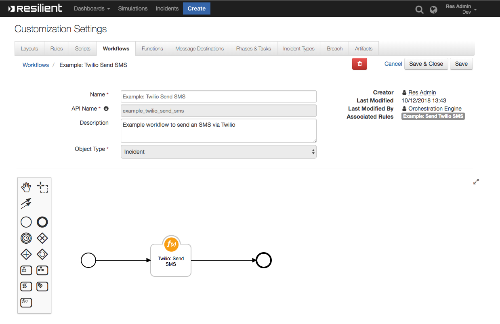

# Resilient Function - Twilio Send SMS

## Table of Contents
  - [Prerequisites](#prerequisites)
  - [app.config settings](#appconfig-settings)
  - [Function Inputs](#function-inputs)
  - [Function Output](#function-output)
  - [Pre-Process Script](#pre-process-script)
  - [Post-Process Script](#post-process-script)
  - [Rules](#rules)

**This Resilient Function package can be used to send an SMS via Twilio from a workflow using the Functions feature of the Resilient Circuits integration framework.**

 

## Prerequisites:
```
resilient version 30 or later
resilient_circuits version 33 or later
twilio version 6.21.0 or later
```

## app.config settings
This package requires that it is installed on a RHEL platform and that the resilient-circuits application is running.
Install this package with 'pip', or `python setup.py install`.
To set the config values in the app.config file with a new resilient instance run `resilient-circuits config -c`.
To set the config values in the app.config file with an existing resilient instance run `resilient-circuits config -u`.

Config values example:
The parameters twilio_account_sid and twilio_auth_token are as defined in your Twilio account.
The parameter twilio_src_address should be set to the Twilio number you wish to use.
```
[fn_twilio_send_sms]
twilio_account_sid=
twilio_auth_token=
# This is the number that will originate the SMS and must be an active SMS phone number on your Twilio Account 
# The format should be as per the Twilio console properties for your number, e.g. +1234567890
twilio_src_address=
```

Run with: `resilient-circuits run`.

## Function Inputs
| Function Name | Type | Required | Example | Info |
| ------------- | :--: | :-------:| ------- | ---- |
| `twilio_sms_destination` | `String` | Yes | `"+353861234567,+1234567"` | A comma delimited (CSV) list of destination numbers in international format. |
| `twilio_sms_message` | `String` | Yes | `"An incident has been created!"` | The message you wish to send |

## Function Output
```
{
  'twilio_status': [
  {
    'phone_number': u'+1234', 
    'error_message': "Unable to create record: The 'To' number  is not a valid phone number.", 
    'success': False 
    },{
    'phone_number': u'+353834463164', 
    'success': True
    }
  ], 
  'inputs': {
    'twilio_sms_message': u'An incident test (2096) with Low priority may require your attention', 
    'twilio_sms_destination': u'1234,353834463164'
    }
  , 'success': True
}
```

## Pre-Process Script
The following is an example of setup of each parameter using a simple workflow pre-processing script.
The message can be customised to suit your own use case.
```
inputs.twilio_sms_destination = rule.properties.twilio_sms_destination
inputs.twilio_sms_message = 'An incident ' + incident.name + ' (' + `incident.id` + ') with ' + incident.severity_code + ' priority may require your attention'
```

## Post-Process Script
The results returned to Resilient can be used to determine the status for each destination.
Below is an example post process script which adds a note for each destination.
```
for entry in results["twilio_status"]:
  if(entry.success == True):
    note_text = """<b>Twilio SMS Message:</b> {0}
              </br><b>sent to:</b> {1}""".format(results.twilio_sms_message,
                                            entry.phone_number)
                                          
    incident.addNote(helper.createRichText(note_text))
  else: 
    note_text = """<b>Unable to send Twilio SMS Message:</b> {0}
              </br><b> to:</b> {1} ({2})""".format(results.twilio_sms_message,
                                            entry.phone_number, entry.error_message)
                                          
    incident.addNote(helper.createRichText(note_text))
```
## Rules

| Rule Name | Object Type | Workflow Triggered |
| --------- | :---------: | ------------------ |
| Example: Send Twilio SMS | `Incident` | `Example: Twilio Send SMS` |
