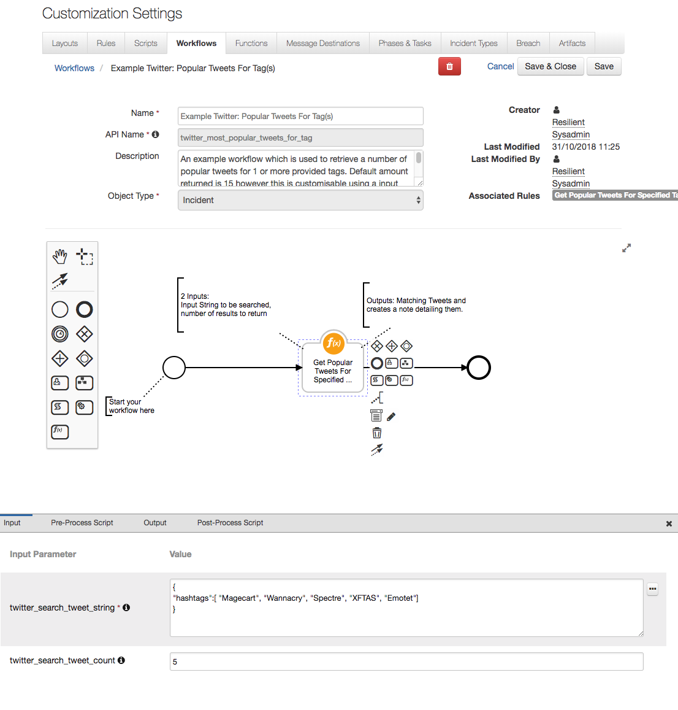

# Resilient Integration with Twitter Search API
**This package contains one function which targets the Twitter Search API. Takes in an input of a multiple possible hashtags and a number of Tweets to be returned and contacts the Twitter Search API to return the results. Requires Twitter Access Key and Secret to obtain a OAuth2 read-only token.**
 


## app.config settings:
```python
twitter_api_key = <API_KEY>
twitter_api_secret = <API_SECRET>
```

## Function Inputs:
| Function Name | Type | Required | Example |
| ------------- | :--: | :-------:| ------- |
| `twitter_search_tweet_string` | `String Representation of JSON` | Yes | `'{"hashtags":[ "Malware", "Ransomware", "Phishing"]}'` |
| `twitter_search_tweet_count` | `Number` | Yes | `10` |


## Function Output:
```python

results = {
  success = True,
  inputs :{
    twitter_search_tweet_string: '{"hashtags":[ "Malware", "Ransomware", "Phishing"]}',
    twitter_search_tweet_count: 10
  }
  tweets: {
    statuses: [{
      text: "Hello World",
      entities: {
          urls:[{
            url : "https://twitter.com/i/web/status/hello-world"id_str
          }]
        },
        ...OtherAttributes
      }
    }]
  }
}

```


Review the [Twitter API documentation](https://developer.twitter.com/en/docs/tweets/search/api-reference/get-search-tweets.html) for more info on all the attributes returned.

The [Twython documentation](https://twython.readthedocs.io/en/latest/) has details specific to the Twython package used by this integration


## Pre-Process Script:
Rather than manipulating potential inputs in the Pre-Processing script, this integration uses inputs taken from the Inputs tab. See screenshot for example.


## Post-Process Script:
This example **adds a Note to the Incident.**
```python

#Prepare the start of the note text
noteText = u"""<br>Twitter search: 
              Successful : {0}
              <b>Searched Tags:<b>{1}</b>""".format("True" if results["success"] is True else False, results["inputs"]["twitter_search_tweet_string"])

if (results.success):
  # For each returned tweet add the text and URL of the tweet to the noteText
  for tweet in results.tweets["statuses"]:
    noteText += u"""<br><br>Tweet Text: <br><b>{0}</b>
    <b>Tweet URL</b> :<a>{1}</a>""".format(tweet["text"],tweet["entities"]["urls"][0]["url"]) 
else:
  noteText += u"""<b>No Results found</b>"""
# Now add the note to our incident
incident.addNote(helper.createRichText(noteText))
```

## Rules
| Rule Name | Object Type | Workflow Triggered |
| --------- | :---------: | ------------------ |
| Get Popular Tweets For Specified Tag(s) | `Incident` | `Example Twitter: Popular Tweets For Tag(s)` |
