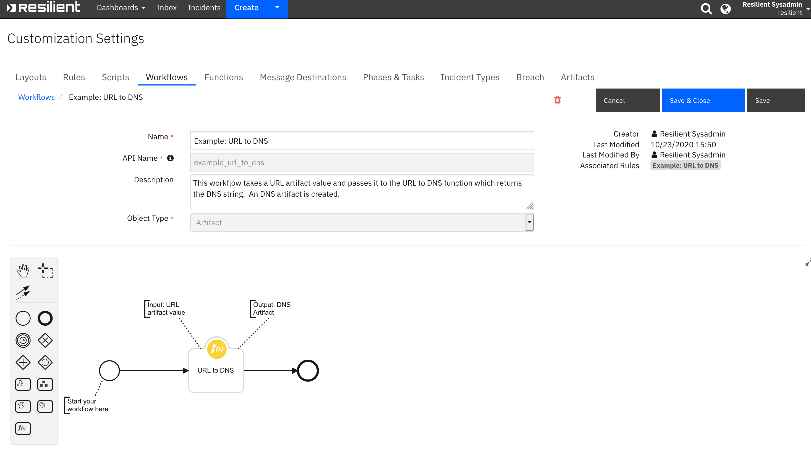
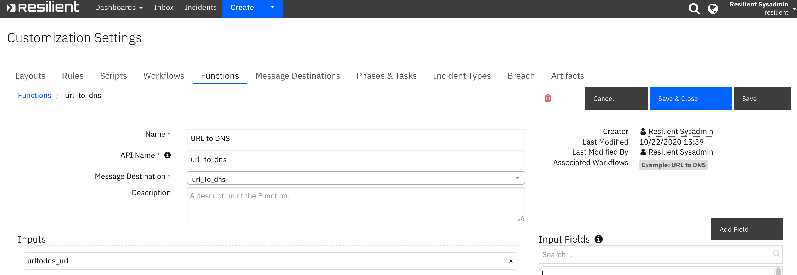
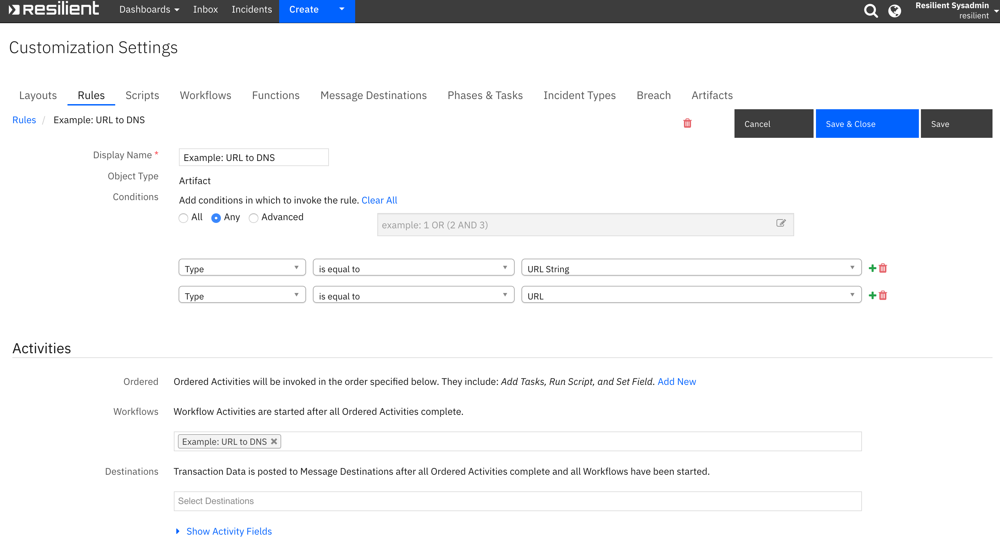

<!--
  This README.md is generated by running:
  "resilient-sdk docgen -p fn_url_to_dns"

  It is best edited using a Text Editor with a Markdown Previewer. VS Code
  is a good example. Checkout https://guides.github.com/features/mastering-markdown/
  for tips on writing with Markdown

  If you make manual edits and run docgen again, a .bak file will be created

  Store any screenshots in the "doc/screenshots" directory and reference them like:
  
-->

# URL to DNS

## Table of Contents
- [Release Notes](#release-notes)
- [Overview](#overview)
  - [Key Features](#key-features)
- [Installation](#installation)
  - [Requirements](#requirements)
  - [Install](#install)
  - [App Configuration](#app-configuration)
- [Function - URL to DNS](#function---url-to-dns)
- [Rules](#rules)
- [Troubleshooting & Support](#troubleshooting-&-support)
---

## Release Notes
| Version | Date | Notes |
| ------- | ---- | ----- |
| 1.1.1 | 03/2025 | Converted example workflows to python3 |
| 1.1.0 | 10/2020 | App Host Support|
| 1.0.0 | 12/2018 | Initial Release |

---

## Overview
<!--
  Provide a high-level description of the function itself and its remote software or application.
  The text below is parsed from the "description" and "long_description" attributes in the setup.py file
-->
**Resilient Circuits Components for 'fn_url_to_dns'**

 

Resilient Circuits Components for 'fn_url_to_dns'

### Key Features
<!--
  List the Key Features of the Integration
-->
* Function parses a URL string and returns the DNS component of the string.
* Workflow and rule are triggered off an URL artifact and a DNS artifact is created.

---

## Installation

### Requirements
<!--
  List any Requirements
-->
* Resilient platform >= `51.0.0`
* An App Host or an Integration Server:
  * To setup up an App Host see:  [ibm.biz/res-app-host-setup](https://ibm.biz/res-app-host-setup)
  * An Integration Server running `resilient_circuits>=51.0.0` (if using an Integration Server)
    * To set up an Integration Server see: [ibm.biz/res-int-server-guide](https://ibm.biz/res-int-server-guide)
    * If using an API key account, minimum required permissions are:
      | Name | Permissions |
      | ---- | ----------- |
      | Org Data | Read |
      | Function | Read |
      | Edit Incidents | Fields |
* Proxy supported: No (not needed)

---

### Install
* To install or uninstall an App using the App Host see [ibm.biz/res-install-app](https://ibm.biz/res-install-app)

* To install or uninstall an Integration using the Integration Server see the [ibm.biz/res-install-int](https://ibm.biz/res-install-int)
---

### App Configuration
* No app.config file settings are needed for this integration.
---


## Function - URL to DNS
None

 

<details><summary>Inputs:</summary>
<p>

| Name | Type | Required | Example | Tooltip |
| ---- | :--: | :------: | ------- | ------- |
| `urltodns_url` | `text` | No | `-` | - |

</p>
</details>

<details><summary>Outputs:</summary>
<p>

```python
results = {
    {
    "version": "1.0",
    "success": true,
    "reason": "",
    "content": {
      "dns": "www.example.com"
    },
    "raw": "",
    "inputs": {
      "urltodns_url": "https://www.example.com/page.html"
    },
    "metrics": {
      "version": "1.0",
      "package": "fn-url-to-dns",
      "package_version": "1.1.1",
      "host": "li-b6f3814c-2cf7-11b2-a85c-95da948e58bf.ibm.com",
      "execution_time_ms": 2,
      "timestamp": "2025-03-25 17:33:50"
    }
  }
}
```

</p>
</details>

<details><summary>Example Pre-Process Script:</summary>
<p>

```python
inputs.urltodns_url = artifact.value
```

</p>
</details>

<details><summary>Example Post-Process Script:</summary>
<p>

```python
if results.success:
  content = results.get('content')
  dns_name = content.get('dns')

  incident.addArtifact("DNS Name", dns_name, "Created from URL")
else:
  incident.addNote("URL to DNS function failed.")
```

</p>
</details>

---


## Rules
| Rule Name | Object | Workflow Triggered |
| --------- | ------ | ------------------ |
| Example: URL to DNS | artifact | `example_url_to_dns` |

<p>
The screenshot below shows the provided example rule:


---

## Troubleshooting & Support
If using the app with an App Host, see the Resilient System Administrator Guide and the App Host Deployment Guide for troubleshooting procedures. You can find these guides on the [IBM Knowledge Center](https://www.ibm.com/support/knowledgecenter/SSBRUQ), where you can select which version of the Resilient platform you are using.

If using the app with an integration server, see the [Integration Server Guide](https://ibm.biz/res-int-server-guide)

### For Support
This is a IBM Community Provided App. Please search the Community https://ibm.biz/resilientcommunity for assistance.
