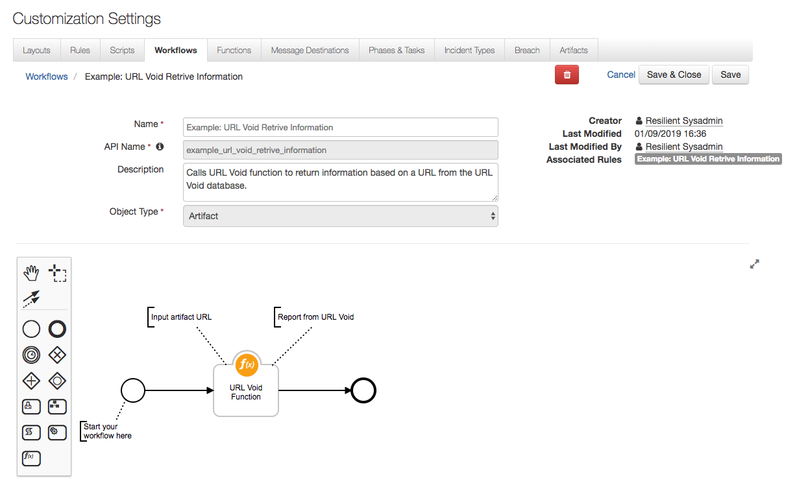
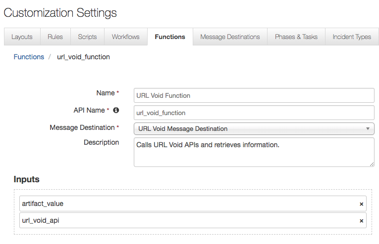

# Resilient Integration with URL Void
**This package contains one function that allows you to call different URL Void APIs based on a given URL as an input.**

==

This function comes with three workflows and rules which retrieves information from a URL, scans a URL, and rescans a URL. An example one is shown below.



The function included in this package is shown below:



## URL Void Function Inputs:
| Function inputs | Type | Required | Example |
| ------------- | :--: | :-------:| ------- |
| `artifact_value` | `String` | Yes | `"https://google.com"` |
| `url_void_api` | `Select` | Yes | `Retrieve/Scan/Rescan` |


## URL Void Function Outputs:
```
{  
   "inputs":{  
      "artifact_value":"https://urlvoid.com",
      "url_void_api":{  
         "name":"Retrieve",
         "id":500
      }
   },
   "metrics":{  
      "package":"fn-url-void",
      "timestamp":"2019-01-11 11:30:31",
      "package_version":"1.0.0",
      "host":"brians-mbp.cambridge.ibm.com",
      "version":"1.0",
      "execution_time_ms":437
   },
   "success":true,
   "content":{  
      "response":{  
         "details":{  
            "host":"urlvoid.com",
            "updated":"1547221345",
            "updated_datetime":"2019-01-11 10:42:25",
            "domain_age":"1242424800",
            "domain_age_date":"2009-05-15",
            "ip":{  
               "addr":"195.154.84.63",
               "hostname":"195-154-84-63.rev.poneytelecom.eu",
               "asn":"12876",
               "asname":"Online S.a.s.",
               "country_code":"FR",
               "country_name":"France",
               "region_name":null,
               "city_name":null,
               "continent_code":"EU",
               "continent_name":"Europe",
               "latitude":"48.8582",
               "longitude":"2.3387"
            }
         },
         "page_load":"0.01"
      }
   },
   "raw":'{  
      "response":{  
         "details":{  
            "host":"urlvoid.com",
            "updated":"1547221345",
            "updated_datetime":"2019-01-11 10:42:25",
            "domain_age":"1242424800",
            "domain_age_date":"2009-05-15",
            "ip":{  
               "addr":"195.154.84.63",
               "hostname":"195-154-84-63.rev.poneytelecom.eu",
               "asn":"12876",
               "asname":"Online S.a.s.",
               "country_code":"FR",
               "country_name":"France",
               "region_name":null,
               "city_name":null,
               "continent_code":"EU",
               "continent_name":"Europe",
               "latitude":"48.8582",
               "longitude":"2.3387"
            }
         }',
         "page_load":"0.01"
      }
   },
   "reason":null,
   "version":"1.0"
}

```


## Pre-Process Scripts:
This example sets the artifact value **to the value of the Incident's Artifact.**

```python
inputs.artifact_value = artifact.value
```

## Post-Process Script:
This example adds a notes to the incident stating how many detections were found on the URL and provides a link to URL Void which contains a graphical display of the information.

```python
url = results.inputs.artifact_value

if results.content.response.details:
  if results.content.response.detections:
    count = results.content.response.detections.count
  else:
    count = "0"
  host = results.content.response.details.host
  link = "https://www.urlvoid.com/scan/{}/".format(host)

  note = helper.createRichText("<b>{}</b> detections were found on {}. <a href=\"{}\">Link to URL Void</a>".format(count, url, link))
else:
  note = "No information returned on {}".format(url)

incident.addNote(note)
```

## Rules:
| Rule Name | Object Type | Workflow Triggered | Conditions |
| --------- | :---------: | ------------------ | ---------- |
| Example: URL Void Retrive | `Artifact` | `Example: URL Void Retrieve Information` | `Type` is equal to `URL`|
| Example: URL Void Scan | `Artifact` | `Example: URL Void Scan` | `Type` is equal to `URL`|
| Example: URL Void Rescan | `Artifact` | `Example: URL Void Rescan` | `Type` is equal to `URL`|


To install in "development mode"

    pip install -e ./fn_url_void/


To uninstall,

    pip uninstall fn_url_void


To package for distribution,

    python ./fn_url_void/setup.py sdist

The resulting .tar.gz file can be installed using

    pip install <filename>.tar.gz

To run the integration:

	resilient-circuits run
