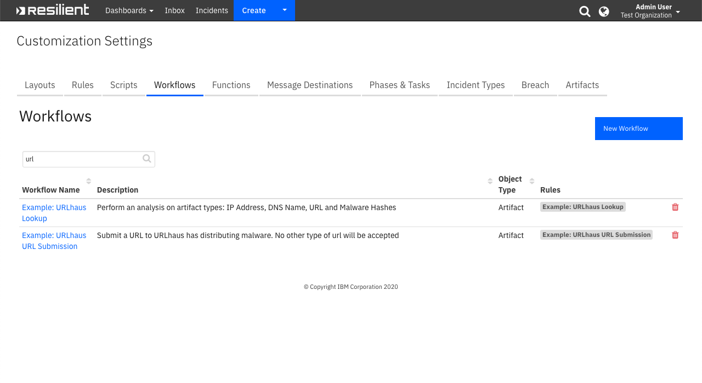

<!--
  This Install README.md is generated by running:
  "resilient-sdk docgen -p fn_urlhaus --install-guide"

  It is best edited using a Text Editor with a Markdown Previewer. VS Code
  is a good example. Checkout https://guides.github.com/features/mastering-markdown/
  for tips on writing with Markdown

  If you make manual edits and run docgen again, a .bak file will be created

  Store any screenshots in the "doc/screenshots" directory and reference them like:
  
-->

# URLhaus Lookup + Submission

- [Release Notes](#release-notes)
- [Overview](#overview)
- [Requirements](#requirements)
- [Installation (App Host)](#installation-app-host)
- [Installation (Integration Server)](#installation-integration-server)
- [Uninstall](#uninstall)
- [Troubleshooting](#troubleshooting)
- [Support](#support)

---

## Release Notes
<!--
  Specify all changes in this release. Do not remove the release 
  notes of a previous release
-->
### v1.0.2
* Added App Host support

### v1.0.1
* Minor bug fix

### v1.0.0
* Initial Release

---

## Overview
<!--
  Provide a high-level description of the function itself and its remote software or application.
  The text below is parsed from the "description" and "long_description" attributes in the setup.py file
-->
**Look up artifacts in URLhaus and submit malicious URLs**

 

Look up supported artifacts in URLhaus to get more enrichment information and submit a malicious URL to the security community

---

## Requirements
<!--
  List any Requirements 
-->
* Resilient platform >= `v35.0.0`
* An Integration Server running `resilient_circuits>=33.0.0`
  * To set up an Integration Server see: [ibm.biz/res-int-server-guide](https://ibm.biz/res-int-server-guide)
  * If using API Keys, minimum required permissions are:
      * Org Data: Read, Edit
      * Function: Read
---

## Installation (App Host)
With App Host, all the run-time components are pre-built. Perform the following steps to install and configure:
* Download the `app-fn_urlhaus-x.x.x.zip`.
* In Resilient navigate to **Adiminstrator Settings > Apps**
* Click the Install button and select the downloaded `app-fn_urlhaus-x.x.x.zip`. This will install the associated customizations.
* Once installed, navigate to the app's Configuration tab and edit the app.config file updating the `[resilient]` section as necessary and updating the `[fn_urlhaus]` section as necessary.
---

## Installation (Integration Server)
* Download the `app-fn_urlhaus-x.x.x.zip`.
* Copy the `.zip` to your Integration Server and SSH into it.
* **Unzip** the package:
  ```
  $ unzip app-fn_urlhaus-x.x.x.zip
  ```
* **Change Directory** into the unzipped directory:
  ```
  $ cd app-fn_urlhaus-x.x.x
  ```
* **Install** the package:
  ```
  $ pip install fn_urlhaus-x.x.x.tar.gz
  ```
* Import the **configurations** into your app.config file:
  ```
  $ resilient-circuits config -u -l fn-urlhaus
  ```
* Import the fn_urlhaus **customizations** into the Resilient platform:
  ```
  $ resilient-circuits customize -y -l fn-urlhaus
  ```
* Open the config file, scroll to the bottom and edit your fn_urlhaus configurations:
  ```
  $ nano ~/.resilient/app.config
  ```
  | Config | Required | Example | Description |
  | ------ | :------: | ------- | ----------- |
  | **url** | Yes | `https://urlhaus-api.abuse.ch/v1` | The URL for URLhaus Lookup |
  | **submit_url** | Yes | `https://urlhaus.abuse.ch/api/` | The URL for URLhaus Submissions |
  | **submit_api_key** | Yes | `xxxxxxxxxxx` | The API Key that you get when you authorize URLhaus in your twitter account |

* **Save** and **Close** the app.config file.
* [Optional]: Run selftest to test the Integration you configured:
  ```
  $ resilient-circuits selftest -l fn-urlhaus
  ```
* **Run** resilient-circuits or restart the Service on Windows/Linux:
  ```
  $ resilient-circuits run
  ```


---

## Uninstall (Integration Server)
* SSH into your Integration Server.
* **Uninstall** the package:
  ```
  $ pip uninstall fn-urlhaus
  ```
* Open the config file, scroll to the [fn_urlhaus] section and remove the section or prefix `#` to comment out the section.
* **Save** and **Close** the app.config file.

---

## Troubleshooting
There are several ways to verify the successful operation of a function.

### Resilient Action Status
* When viewing an incident, use the Actions menu to view **Action Status**.
* By default, pending and errors are displayed.
* Modify the filter for actions to also show Completed actions.
* Clicking on an action displays additional information on the progress made or what error occurred.

### Resilient Scripting Log
* A separate log file is available to review scripting errors.
* This is useful when issues occur in the pre-processing or post-processing scripts.
* The default location for this log file is: `/var/log/resilient-scripting/resilient-scripting.log`.

### Resilient Logs
* By default, Resilient logs are retained at `/usr/share/co3/logs`.
* The `client.log` may contain additional information regarding the execution of functions.

### Resilient-Circuits
* The log is controlled in the `.resilient/app.config` file under the section [resilient] and the property `logdir`.
* The default file name is `app.log`.
* Each function will create progress information.
* Failures will show up as errors and may contain python trace statements.

---

<!--
  If necessary, use this section to describe how to configure your security application to work with the integration.
  Delete this section if the user does not need to perform any configuration procedures on your product.

## Configure <Product_Name>

* Step One
* Step Two
* Step Three

---
-->

## Support
| Name | Version | Author | Support URL |
| ---- | ------- | ------ | ----------- |
| fn_urlhaus | 1.0.2 | Resilient Labs | https://ibm.biz/resilientcommunity |
