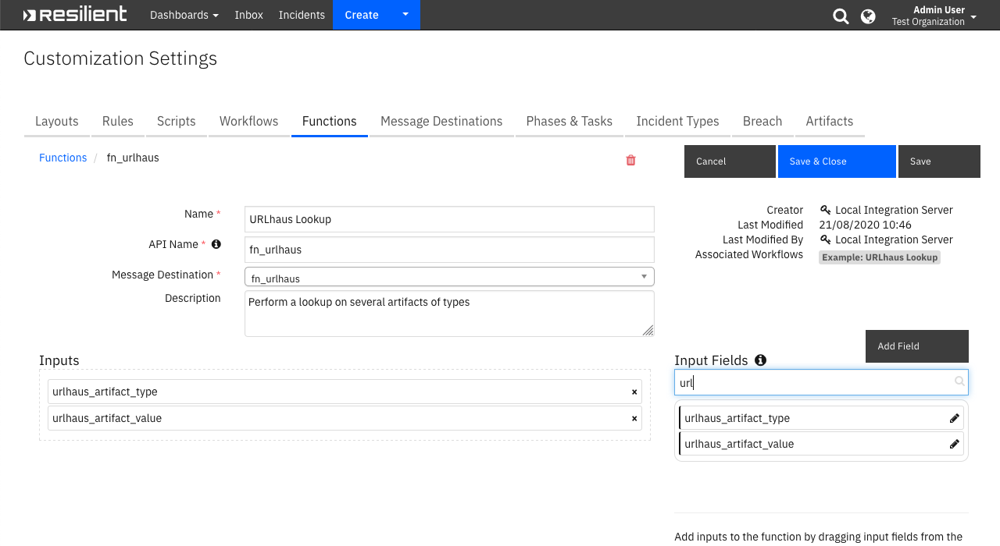

<!--
  This User README.md is generated by running:
  "resilient-sdk docgen -p fn_urlhaus --user-guide"

  It is best edited using a Text Editor with a Markdown Previewer. VS Code
  is a good example. Checkout https://guides.github.com/features/mastering-markdown/
  for tips on writing with Markdown

  If you make manual edits and run docgen again, a .bak file will be created

  Store any screenshots in the "doc/screenshots" directory and reference them like:
  
-->

# **User Guide:** fn_urlhaus_v1.0.2

## Table of Contents
- [Key Features](#key-features)
- [Function - URLhaus Lookup](#function---urlhaus-lookup)
- [Function - URLhaus Submission](#function---urlhaus-submission)
- [Rules](#rules)

---

## Key Features
<!--
  List the Key Features of the Integration
-->
* Incorporates APIs available from URLhaus (https://urlhaus.abuse.ch/) to enrich 
data on:
  * urls
  * domains
  * IP Addresses
  * MD5 and SHA-256 Hash
  * tags (ex. Troldesh)
* Includes the capability to submit a url as distributing malware to a public searchable database.

---

## Function - URLhaus Lookup
Perform a lookup on several artifacts of types

 

<details><summary>Inputs:</summary>
<p>

| Name | Type | Required | Example | Tooltip |
| ---- | :--: | :------: | ------- | ------- |
| `urlhaus_artifact_type` | `text` | Yes | `-` | - |
| `urlhaus_artifact_value` | `text` | Yes | `-` | - |

</p>
</details>

<details><summary>Outputs:</summary>
<p>

```python
results = {
    # TODO: Copy and paste an example of the Function Output within this code block.
    # To view the output of a Function, run resilient-circuits in DEBUG mode and invoke the Function. 
    # The Function results will be printed in the logs: "resilient-circuits run --loglevel=DEBUG"
}
```

</p>
</details>

<details><summary>Workflows</summary>

  <details><summary>Example Pre-Process Script:</summary>
  <p>

  ```python
  inputs.urlhaus_artifact_type = artifact.type
inputs.urlhaus_artifact_value = artifact.value
  ```

  </p>
  </details>

  <details><summary>Example Post-Process Script:</summary>
  <p>

  ```python
  incident.addNote(u"Artifact: {}\n{}".format(artifact.value, results.content))
  ```

  </p>
  </details>

</details>

---
## Function - URLhaus Submission
Submit a url to URLhaus as distributing malware

 

<details><summary>Inputs:</summary>
<p>

| Name | Type | Required | Example | Tooltip |
| ---- | :--: | :------: | ------- | ------- |
| `urlhaus_artifact_value` | `text` | Yes | `-` | - |

</p>
</details>

<details><summary>Outputs:</summary>
<p>

```python
results = {
    # TODO: Copy and paste an example of the Function Output within this code block.
    # To view the output of a Function, run resilient-circuits in DEBUG mode and invoke the Function. 
    # The Function results will be printed in the logs: "resilient-circuits run --loglevel=DEBUG"
}
```

</p>
</details>

<details><summary>Workflows</summary>

  <details><summary>Example Pre-Process Script:</summary>
  <p>

  ```python
  inputs.urlhaus_artifact_value = artifact.value
  ```

  </p>
  </details>

  <details><summary>Example Post-Process Script:</summary>
  <p>

  ```python
  incident.addNote(u"Artifact {} submitted to URLhaus\n{}".format(artifact.value, results.content))
  ```

  </p>
  </details>

</details>

---


## Rules
| Rule Name | Object | Workflow Triggered |
| --------- | ------ | ------------------ |
| Example: URLhaus Lookup | artifact | `example_urlhaus_lookup` |
| Example: URLhaus URL Submission | artifact | `example_urlhaus_url_submission` |

---

<!--
## Inform Resilient Users
  Use this section to optionally provide additional information so that Resilient playbook 
  designer can get the maximum benefit of your integration.
-->