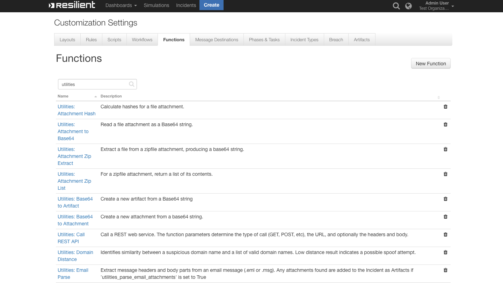

<!--
  This Install README.md is generated by running:
  "resilient-circuits docgen -p fn_utilities --only-install-guide"

  It is best edited using a Text Editor with a Markdown Previewer. VS Code
  is a good example. Checkout https://guides.github.com/features/mastering-markdown/
  for tips on writing with Markdown

  If you make manual edits and run docgen again, a .bak file will be created

  Store any screenshots in the "doc/screenshots" directory and reference them like:
  
-->

# Utility Functions for IBM Resilient

- [Release Notes](#release-notes)
- [Overview](#overview)
- [Requirements](#requirements)
- [Installation](#installation)
- [Uninstall](#uninstall)
- [Troubleshooting](#troubleshooting)
- [Support](#support)

---

## Release Notes
<!--
  Specify all changes in this release. Do not remove the release 
  notes of a previous release
-->
### v1.0.10
* Update utilities_email_parse Function to use `mail-parser>=3.9.3`: https://github.com/SpamScope/mail-parser.
* Remove dependency of `MailtoJson` from utilities_email_parse function.
* utilities_email_parse now supports parsing `.eml` and `.msg` files.
* utilities_email_parse can now be invoked from Artifacts or Attachment Manual Rules.
* FunctionResult of utilities_email_parse has changed. See the User Guide in `/doc` for more.
* Added updated documentation.

### v1.0.9
* Updated the Function utilities_attachment_to_base64.
* utilities_attachment_to_base64 now supports both Resilient Attachments and Resilient Artifacts that are of type File.

### v1.0.8
* Bug fix for attachment_to_hash on Python 3.6.

### v1.0.7
* A Timer function is new in this release of the Utility Functions. The function will allow a workflow to pause for a specified amount of time.

### v1.0.6
* Bug fix for Call Rest API function.
### v1.0.5
* Pushed a fix related to some functions firing twice.

---

## Overview
<!--
  Provide a high-level description of the function itself and its remote software or application.
  The text below is parsed from the "description" and "long_description" attributes in the setup.py file
-->
**Useful workflow functions for common automation and integration activities in Resilient**

 

Resilient Functions simplify development of integrations by wrapping each external activity into an individual workflow component. These components can be easily installed, then used and combined in Resilient workflows. The Resilient platform sends data to the function component that performs an activity then returns the results to the workflow. The results can be acted upon by scripts, rules, and workflow decision points to dynamically orchestrate the security incident response activities

---

## Requirements
<!--
  List any Requirements 
-->
* IBM Resilient >= `v31.0.4254`
* An Integration Server running `resilient_circuits>=30.0.0`
  * To setup an Integration Server see: [ibm.biz/res-int-server-guide](https://ibm.biz/res-int-server-guide)

---

## Installation
* Download the `fn_utilities.zip`.
* Copy the `.zip` to your Integration Server and SSH into it.
* **Unzip** the package:
  ```
  $ unzip fn_utilities-x.x.x.zip
  ```
* **Change Directory** into the unzipped directory:
  ```
  $ cd fn_utilities-x.x.x
  ```
* **Install** the package:
  ```
  $ pip install fn_utilities-x.x.x.tar.gz
  ```
* Import the **configurations** into your app.config file:
  ```
  $ resilient-circuits config -u
  ```
* Import the fn_utilities **customizations** into the Resilient platform:
  ```
  $ resilient-circuits customize -y -l fn-utilities
  ```
* Open the config file, scroll to the bottom and edit your fn_utilities configurations:
  ```
  $ nano ~/.resilient/app.config
  ```
  | Config | Required | Example | Description |
  | ------ | :------: | ------- | ----------- |
  | **shell_escaping** | No | `sh` | For safety, shell_command parameter values are escaped. Set this to `sh` (Bash) or `ps` (PowerShell). |
  | **remote_powershell_extensions** | No | `ps1, psm1` | A CSV list of extensions a remote PowerShell is trusted to run. |
  | **remote_auth_transport** | No | `ntlm` | Transport authentication method for a remote PowerShell. Can be NTLM or basic. |
  | **max_timer** | No | `30d` | Max Timer sleep time. The input string is of format “time value” concatenated with a “time unit” character, where character is: ‘s’ for seconds, ‘m’ for minutes, ‘h’ for hours ‘d’ for days.  For example: '30s' = 30 seconds; '40m' = 40 minutes; |

* **Save** and **Close** the app.config file.
* [Optional]: Run selftest to test the Integration you configured:
  ```
  $ resilient-circuits selftest -l fn-utilities
  ```
* **Run** resilient-circuits or restart the Service on Windows/Linux:
  ```
  $ resilient-circuits run
  ```


---

## Uninstall
* SSH into your Integration Server.
* **Uninstall** the package:
  ```
  $ pip uninstall fn-utilities
  ```
* Open the config file, scroll to the [fn_utilities] section and remove the section or prefix `#` to comment out the section.
* **Save** and **Close** the app.config file.

---

## Troubleshooting
There are several ways to verify the successful operation of a function.

### Resilient Action Status
* When viewing an incident, use the Actions menu to view **Action Status**.
* By default, pending and errors are displayed.
* Modify the filter for actions to also show Completed actions.
* Clicking on an action displays additional information on the progress made or what error occurred.

### Resilient Scripting Log
* A separate log file is available to review scripting errors.
* This is useful when issues occur in the pre-processing or post-processing scripts.
* The default location for this log file is: `/var/log/resilient-scripting/resilient-scripting.log`.

### Resilient Logs
* By default, Resilient logs are retained at `/usr/share/co3/logs`.
* The `client.log` may contain additional information regarding the execution of functions.

### Resilient-Circuits
* The log is controlled in the `.resilient/app.config` file under the section [resilient] and the property `logdir`.
* The default file name is `app.log`.
* Each function will create progress information.
* Failures will show up as errors and may contain python trace statements.

---

<!--
  If necessary, use this section to describe how to configure your security application to work with the integration.
  Delete this section if the user does not need to perform any configuration procedures on your product.

## Configure <Product_Name>

* Step One
* Step Two
* Step Three

---
-->

## Support
| Name | Version | Author | Support URL |
| ---- | ------- | ------ | ----------- |
| fn_utilities | 1.0.10 | IBM Resilient | http://ibm.biz/resilientcommunity |