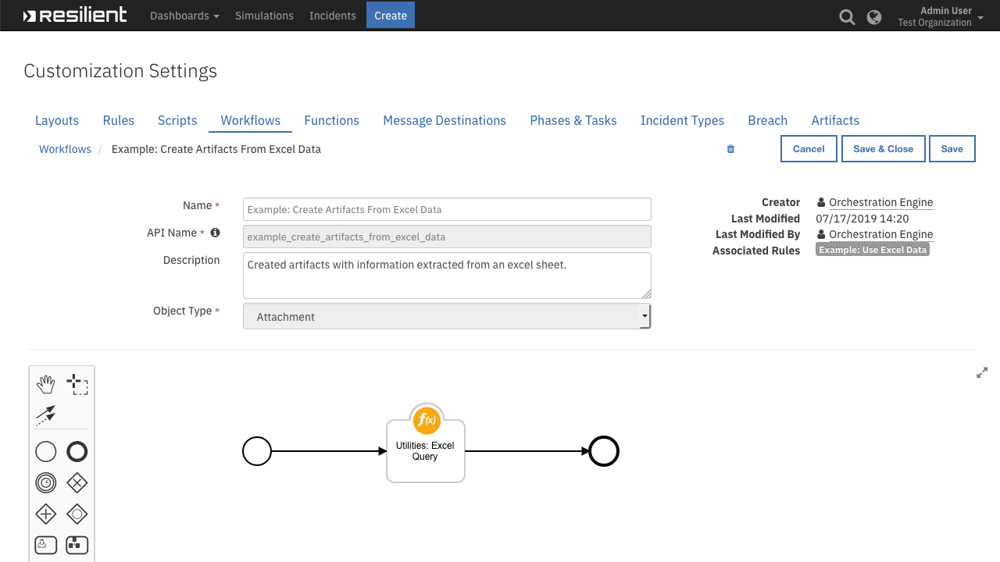

<!--
  This User README.md is generated by running:
  "resilient-circuits docgen -p fn_utilities --only-user-guide"

  It is best edited using a Text Editor with a Markdown Previewer. VS Code
  is a good example. Checkout https://guides.github.com/features/mastering-markdown/
  for tips on writing with Markdown

  If you make manual edits and run docgen again, a .bak file will be created

  Store any screenshots in the "doc/screenshots" directory and reference them like:
  
-->

# **User Guide:** fn_utilities_v1.0.10

## Table of Contents
- [Function - Utilities: Attachment Hash](#function---utilities-attachment-hash)
- [Function - Utilities: Attachment to Base64](#function---utilities-attachment-to-base64)
- [Function - Utilities: Attachment Zip Extract](#function---utilities-attachment-zip-extract)
- [Function - Utilities: Attachment Zip List](#function---utilities-attachment-zip-list)
- [Function - Utilities: Base64 to Artifact](#function---utilities-base64-to-artifact)
- [Function - Utilities: Base64 to Attachment](#function---utilities-base64-to-attachment)
- [Function - Utilities: Call REST API](#function---utilities-call-rest-api)
- [Function - Utilities: Domain Distance](#function---utilities-domain-distance)
- [Function - Utilities: Email Parse](#function---utilities-email-parse)
- [Function - Utilities: Excel Query](#function---utilities-excel-query)
- [Function - Utilities: Expand URL](#function---utilities-expand-url)
- [Function - Utilities: Extract SSL Cert From Url](#function---utilities-extract-ssl-cert-from-url)
- [Function - Utilities: Get Contact Info](#function---utilities-get-contact-info)
- [Function - Utilities: JSON2HTML](#function---utilities-json2html)
- [Function - Utilities: Parse SSL Certificate](#function---utilities-parse-ssl-certificate)
- [Function - Utilities: PDFiD](#function---utilities-pdfid)
- [Function - Utilities: Resilient Search](#function---utilities-resilient-search)
- [Function - Utilities: Shell Command](#function---utilities-shell-command)
- [Function - Utilities: String to Attachment](#function---utilities-string-to-attachment)
- [Function - Utilities: Timer](#function---utilities-timer)
- [Function - Utilities: XML Transformation](#function---utilities-xml-transformation)
- [Rules](#rules)

---

## Function - Utilities: Attachment Hash
Calculate hashes for a file attachment. Returns `md5`, `sha1`, `sha256` and other hashes of the file content. Those hashes can then be used as artifacts or in other parts of your workflows.

 

<details><summary>Inputs:</summary>
<p>

| Name | Type | Required | Example | Tooltip |
| ---- | :--: | :------: | ------- | ------- |
| `attachment_id` | `number` | No | `-` | - |
| `incident_id` | `number` | Yes | `-` | - |
| `task_id` | `number` | No | `-` | - |

</p>
</details>

<details><summary>Outputs:</summary>
<p>

```python
results = {
  'sha1': '6c97644ea50f922b8bb2671c772d006b2abf4c87',
  'created': 1563376076661,
  'sha224': 'fc76d04a9c02b99e72fd0ec519c1a713ebf4d1ac451cf2542d6c1f9b',
  'filename': 'sample_ioc.pdf',
  'sha256': '578711d047bbce6542b5c4f17224d2042ae4ae93a045e0a7b27765f7be226be2',
  'content_type': 'application/pdf',
  'sha384': 'e6b21c2c6a7bd3e0143bfb8d16e354ccbbbe39df6a586bf6d28443319b4e432816c7a931790f264ac167de6cfd53444e',
  'size': 123852,
  'sha512': '74150483cc49014ff7a83caa2afb71dad62fdb0ec567e4a34fd4fa87a1037b2c5373cc06df0c6ac18e6d399f5bf498e4643c216ad6c7d6b51ab1e506d6768b2a',
  'md5': 'fd83928b1530399aa355301ccab3620c'
}
```

</p>
</details>

<details><summary>Example Pre-Process Script:</summary>
<p>

```python
# Required inputs are: the incident id and attachment id
inputs.incident_id = incident.id
inputs.attachment_id = attachment.id

# If this is a "task attachment" then we will additionally have a task-id
if task is not None:
  inputs.task_id = task.id
```

</p>
</details>

<details><summary>Example Post-Process Script:</summary>
<p>

```python
# The result contains at least these three hashes

incident.addArtifact("Malware SHA-256 Hash", results.sha256, u"SHA-256 hash of '{}'".format(attachment.name))
incident.addArtifact("Malware SHA-1 Hash", results.sha1, u"SHA-1 hash of '{}'".format(attachment.name))
incident.addArtifact("Malware MD5 Hash", results.md5, u"MD5 hash of '{}'".format(attachment.name))
```

</p>
</details>

---
## Function - Utilities: Attachment to Base64
Reads a file attachment in the incident, and produces a base64-encoded string with the file attachment content. This content can then be used in combination with other workflow functions to create an artifact, a new file attachment, or to analyze the contents using various tools.

 

<details><summary>Inputs:</summary>
<p>

| Name | Type | Required | Example | Tooltip |
| ---- | :--: | :------: | ------- | ------- |
| `artifact_id` | `number` | No | `-` | - |
| `attachment_id` | `number` | No | `-` | - |
| `incident_id` | `number` | Yes | `-` | - |
| `task_id` | `number` | No | `-` | - |

</p>
</details>

<details><summary>Outputs:</summary>
<p>

```python
results = {
    'content': 'JVBERi0xLjcNCiW1tbW1DQoxIDAgb2JqDQo8PC9UeXBlL0NhdG...',
    'size': 123852,
    'created': 1563376076661,
    'content_type': u 'application/pdf',
    'filename': u 'sample_ioc.pdf'
}
```

</p>
</details>

<details><summary>Example Pre-Process Script:</summary>
<p>

```python
# Required inputs are: incident_id artifact_id
inputs.incident_id = incident.id
inputs.artifact_id = artifact.id
```

</p>
</details>

<details><summary>Example Post-Process Script:</summary>
<p>

```python
if results.get("content", None) is not None:
  
  file_name = unicode(results.get("filename", ""))
  note_text = u"File {0} converted to Base64 Format".format( file_name )

  incident.addNote(note_text)
```

</p>
</details>

---
## Function - Utilities: Attachment Zip Extract
Extracts a file from a ZIP file attachment, producing a base64 string.

That string can then be used as input to subsequent functions that might write it as a file attachment, as a malware sample artifact, or in other ways.

 

<details><summary>Inputs:</summary>
<p>

| Name | Type | Required | Example | Tooltip |
| ---- | :--: | :------: | ------- | ------- |
| `attachment_id` | `number` | No | `-` | - |
| `file_path` | `text` | No | `-` | - |
| `incident_id` | `number` | Yes | `-` | - |
| `task_id` | `number` | No | `-` | - |
| `zipfile_password` | `text` | No | `-` | - |

</p>
</details>

<details><summary>Outputs:</summary>
<p>

```python
results = {
     'info': {
        'comment': '',
        'external_attr': 2175025152,
        'create_version': 21,
        'extract_version': 20,
        'header_offset': 110334,
        'volume': 0,
        'CRC': 1976166170,
        'compress_type': 8,
        'file_size': 123852,
        'date_time': 1562684228000,
        'filename': 'sample_ioc_1.pdf',
        'compress_size': 109933,
        'flag_bits': 8,
        'create_system': 3,
        'internal_attr': 0
    },
    'content': 'JVBERi0xLjcNCiW1tbW1DQoxIDAgb2JqDQo8PC9UeXBlL0NhdGFsb2cvUGFnZXMgMiAwIFIvTGFuZyhlbi1VUyk...'
}
```

</p>
</details>

<details><summary>Example Pre-Process Script:</summary>
<p>

```python
# Required inputs are: the incident id and attachment id
inputs.incident_id = incident.id
inputs.attachment_id = attachment.id

# If this is a "task attachment" then we will additionally have a task-id
if task is not None:
  inputs.task_id = task.id

# The path within the zip that we want to extract
inputs.file_path = "docProps/thumbnail.jpeg"

# If the zipfile is password protected, specify here
# inputs.zipfile_password = 
```

</p>
</details>

<details><summary>Example Post-Process Script:</summary>
<p>

```python
None
```

</p>
</details>

---
## Function - Utilities: Attachment Zip List
Reads a ZIP file and produces a list of the file paths, and a list with detailed information about each file.

 

<details><summary>Inputs:</summary>
<p>

| Name | Type | Required | Example | Tooltip |
| ---- | :--: | :------: | ------- | ------- |
| `attachment_id` | `number` | No | `-` | - |
| `incident_id` | `number` | Yes | `-` | - |
| `task_id` | `number` | No | `-` | - |

</p>
</details>

<details><summary>Outputs:</summary>
<p>

```python
results = {
  'namelist': ['sample_ioc_2.pdf', 'sample_ioc_1.pdf'],
  'infolist': [{
    'comment': '',
    'external_attr': 2175025152,
    'create_version': 21,
    'extract_version': 20,
    'header_offset': 0,
    'volume': 0,
    'CRC': 1976166170,
    'compress_type': 8,
    'file_size': 123852,
    'date_time': 1562684228000,
    'filename': 'sample_ioc_2.pdf',
    'compress_size': 109933,
    'flag_bits': 8,
    'create_system': 3,
    'internal_attr': 0
  }, {
    'comment': '',
    'external_attr': 2175025152,
    'create_version': 21,
    'extract_version': 20,
    'header_offset': 110334,
    'volume': 0,
    'CRC': 1976166170,
    'compress_type': 8,
    'file_size': 123852,
    'date_time': 1562684228000,
    'filename': 'sample_ioc_1.pdf',
    'compress_size': 109933,
    'flag_bits': 8,
    'create_system': 3,
    'internal_attr': 0
  }]
}
```

</p>
</details>

<details><summary>Example Pre-Process Script:</summary>
<p>

```python
# Required inputs are: the incident id and attachment id
inputs.incident_id = incident.id
inputs.attachment_id = attachment.id

# If this is a "task attachment" then we will additionally have a task-id
if task is not None:
  inputs.task_id = task.id
```

</p>
</details>

<details><summary>Example Post-Process Script:</summary>
<p>

```python
# The output contains two lists:
# - "namelist", which is just a list of the filenames (paths) within the zip file,
# - "infolist", which has full information for each file, including its name, size, and so on.

# For this example, let's create two notes

# One with a list of the namelist
html = u"<div><p>Contents of {}:</p>".format(attachment.name)
for filename in results.namelist:
  html = html + u"{}<br>".format(filename)
html = html + "</div>"
incident.addNote(helper.createRichText(html))

# Another with more detailed information
html = u"<div><p>Contents of {}:</p>".format(attachment.name)
for fileinfo in results.infolist:
  html = html + u"{} ({} bytes, {} compressed) {}<br>".format(fileinfo.filename, fileinfo.file_size, fileinfo.compress_size, fileinfo.comment)
html = html + "</div>"
incident.addNote(helper.createRichText(html))

```

</p>
</details>

---
## Function - Utilities: Base64 to Artifact
Creates a new artifact from a Base64 string. You can  specify the artifact type and description.

 

<details><summary>Inputs:</summary>
<p>

| Name | Type | Required | Example | Tooltip |
| ---- | :--: | :------: | ------- | ------- |
| `artifact_file_type` | `select` | No | `-` | - |
| `base64content` | `text` | No | `-` | - |
| `content_type` | `text` | No | `-` | - |
| `description` | `textarea` | No | `-` | - |
| `file_name` | `text` | No | `-` | - |
| `incident_id` | `number` | Yes | `-` | - |

</p>
</details>

<details><summary>Outputs:</summary>
<p>

```python
results = {
  'hits': [],
  'hash': '8ed1d04c56843f357af60e98f6178c5b19e89306bc7f132e49a0951326d90bb9',
  'description': 'Test description',
  'creator': {
    'status': 'A',
    'password_changed': False,
    'display_name': 'Orchestration Engine',
    'is_external': False,
    'email': 'integrations@example.com',
    'lname': 'Engine',
    'create_date': 1542400059674,
    'last_login': 1563536472570,
    'fname': 'Orchestration',
    'last_modified_time': 1563536472571,
    'locked': False,
    'id': 38
  },
  'inc_owner': 71,
  'perms': None,
  'created': 1563536572548,
  'relating': None,
  'value': 'tmptpFuFK',
  'properties': None,
  'parent_id': None,
  'attachment': {
    'task_at_id': None,
    'vers': 4,
    'name': 'tmptpFuFK',
    'task_id': None,
    'created': 1563536572692,
    'inc_owner': 71,
    'task_members': None,
    'task_custom': None,
    'task_name': None,
    'inc_name': 'Test fn_utilities',
    'creator_id': 38,
    'content_type': 'application/pdf',
    'inc_id': 2095,
    'type': 'artifact',
    'id': 2,
    'size': 220184
  },
  'inc_name': 'Test fn_utilities',
  'creator_principal': {
    'display_name': 'Orchestration Engine',
    'type': 'user',
    'id': 38,
    'name': 'integrations@example.com'
  },
  'inc_id': 2095,
  'type': 16,
  'id': 1,
  'actions': [],
  'pending_sources': []
}
```

</p>
</details>

<details><summary>Example Pre-Process Script:</summary>
<p>

```python
None
```

</p>
</details>

<details><summary>Example Post-Process Script:</summary>
<p>

```python
None
```

</p>
</details>

---
## Function - Utilities: Base64 to Attachment
Creates a new attachment from a base64 string.

 

<details><summary>Inputs:</summary>
<p>

| Name | Type | Required | Example | Tooltip |
| ---- | :--: | :------: | ------- | ------- |
| `base64content` | `text` | No | `-` | - |
| `content_type` | `text` | No | `-` | - |
| `file_name` | `text` | No | `-` | - |
| `incident_id` | `number` | Yes | `-` | - |
| `task_id` | `number` | No | `-` | - |

</p>
</details>

<details><summary>Outputs:</summary>
<p>

```python
results = {
  "task_at_id": null,
  "vers": 9,
  "name": "thumbnail.jpeg",
  "task_id": null,
  "created": 1563376723766,
  "inc_owner": 71,
  "task_members": null,
  "task_custom": null,
  "task_name": null,
  "inc_name": "Get example outputs fn-utilities",
  "creator_id": 38,
  "content_type": "image/jpeg",
  "inc_id": 2095,
  "size": 123852,
  "type": "incident",
  "id": 7,
  "uuid": "5a31ce96-954a-4d3f-a193-a83618055d22"
}
```

</p>
</details>

<details><summary>Example Pre-Process Script:</summary>
<p>

```python
#
inputs.base64content = workflow.properties.extracted_file.content


inputs.incident_id = incident.id

inputs.file_name = "thumbnail.jpeg"
inputs.content_type = "image/jpeg"

```

</p>
</details>

<details><summary>Example Post-Process Script:</summary>
<p>

```python
None
```

</p>
</details>

---
## Function - Utilities: Call REST API
This function calls a REST web service. It supports the standard REST methods: GET, HEAD, POST, PUT, DELETE and OPTIONS.

The function parameters determine the type of call, the URL, and optionally the headers and body. The results include the text or structured (JSON) result from the web service, and additional information including the elapsed time.

 

<details><summary>Inputs:</summary>
<p>

| Name | Type | Required | Example | Tooltip |
| ---- | :--: | :------: | ------- | ------- |
| `rest_body` | `textarea` | No | `-` | - |
| `rest_cookies` | `textarea` | No | `-` | - |
| `rest_headers` | `textarea` | No | `-` | - |
| `rest_method` | `select` | No | `-` | - |
| `rest_url` | `text` | No | `-` | - |
| `rest_verify` | `boolean` | Yes | `-` | Verify SSL certificate? |

</p>
</details>

<details><summary>Outputs:</summary>
<p>

```python
results = {
    'cookies': {
        '__cfduid': 'df6a42088e8cb3550f4b3266137fdea731563377650'
    },
    'links': {},
    'text': u '{\n  "userId": 1,\n  "id": 1,\n  "title": "delectus aut autem",\n  "completed": false\n}',
    'elapsed': 263,
    'apparent_encoding': 'ascii',
    'reason': 'OK',
    'ok': True,
    'url': 'https://jsonplaceholder.typicode.com/todos/1',
    'headers': {
        'Expires': 'Wed, 17 Jul 2019 19:34:11 GMT',
        'X-Content-Type-Options': 'nosniff',
        'X-Powered-By': 'Express',
        'Transfer-Encoding': 'chunked',
        'Set-Cookie': '__cfduid=df6a42088e8cb3550f4b3266137fdea731563377650; expires=Thu, 16-Jul-20 15:34:10 GMT; path=/; domain=.typicode.com; HttpOnly',
        'CF-Cache-Status': 'HIT',
        'Cache-Control': 'public, max-age=14400',
        'Vary': 'Origin, Accept-Encoding',
        'Content-Encoding': 'gzip',
        'Server': 'cloudflare',
        'Connection': 'keep-alive',
        'Etag': 'W/"53-hfEnumeNh6YirfjyjaujcOPPT+s"',
        'Pragma': 'no-cache',
        'Access-Control-Allow-Credentials': 'true',
        'Date': 'Wed, 17 Jul 2019 15:34:11 GMT',
        'CF-RAY': '4f7d474ebce8ce2b-LHR',
        'Content-Type': 'application/json; charset=utf-8',
        'Age': '791',
        'Via': '1.1 vegur'
    },
    'json': {
        'completed': False,
        'userId': 1,
        'id': 1,
        'title': 'delectus aut autem'
    },
    'status_code': 200
}
```

</p>
</details>

<details><summary>Example Pre-Process Script:</summary>
<p>

```python
inputs.rest_method = "POST"

# Let's post a URL that includes the artifact value
inputs.rest_url = u"http://httpbin.org/post?value={}".format(artifact.value)

# For POST requests, the body is text
inputs.rest_body = '{"and": "json can be written as a string"}'

# HTTP headers can be specified as a multi-line string
inputs.rest_headers = """
Content-Type: application/json
X-Frooble: Baz
"""

# The 'rest_verify' parameter (Boolean) indicates whether to verify SSL certificates.
# This should be True unless you need to connect to a self-signed or other invalid cert.
inputs.rest_verify = True

```

</p>
</details>

<details><summary>Example Post-Process Script:</summary>
<p>

```python
# Set the artifact description to the Response (in plain text) of the REST call

artifact.description = results.text

```

</p>
</details>

---
## Function - Utilities: Domain Distance
Identifies similarity between a suspicious domain name and a list of valid domain names.  Low distance result indicates a possible spoof attempt.

 

<details><summary>Inputs:</summary>
<p>

| Name | Type | Required | Example | Tooltip |
| ---- | :--: | :------: | ------- | ------- |
| `domain_list` | `text` | No | `-` | - |
| `domain_name` | `text` | No | `-` | - |

</p>
</details>

<details><summary>Outputs:</summary>
<p>

```python
results = {
  'distances': {
    'resilientsystems.com': 6,
    'ibmcloud.com': 11,
    'ibm.com': 9,
    'bluemix.com': 9
  },
  'domain_name': 'ressystems.com',
  'closest': {
    'distance': 6,
    'name': 'resilientsystems.com'
  }
}
```

</p>
</details>

<details><summary>Example Pre-Process Script:</summary>
<p>

```python
# The domain name being tested
inputs.domain_name = artifact.value

# The list of domains to test against
inputs.domain_list = "ibm.com, resilientsystems.com, ibmcloud.com, bluemix.com"
```

</p>
</details>

<details><summary>Example Post-Process Script:</summary>
<p>

```python
# The result includes:
#   "domain_name" - the name being tested
#   "distances" - a dicctionary of all the distances
#   "closest" - the closest match from the list.
# If the match distance is only 1 or 0, the domain name is very easily confused with one on the list!

if results.closest.distance <= 1:
  html = u"<div>Warning!  Domain {} is easily confused with {}!</div>".format(results.domain_name, results.closest.name)
  incident.addNote(helper.createRichText(html))

```

</p>
</details>

---
## Function - Utilities: Email Parse
Extracts message headers and body parts from an email message (.eml or .msg).

Any attachments found are added to the incident as artifacts if `utilities_parse_email_attachments` is set to True.

 

### Supporting Outlook .msg files
* This function relies on `mail-parser>=3.9.3`
* To support parsing of Outlook email files (`.msg`), you need to install the `msgconvert` tool
* `msgconvert` is a tool written in Perl and can be found in `libemail-outlook-message-perl` (Debian) or `Email::Outlook::Message` (Linux).
* See https://github.com/SpamScope/mail-parser for more

#### Install `msgconvert` on Debian based systems:
```
$ apt-get install libemail-outlook-message-perl
```
#### Install `msgconvert` on CentOS/Linux based systems:
```
$ sudo yum install cpan
$ sudo cpan install Email::Outlook::Message
```

<details><summary>Inputs:</summary>
<p>

| Name | Type | Required | Example | Tooltip |
| ---- | :--: | :------: | ------- | ------- |
| `artifact_id` | `number` | No | `-` | - |
| `attachment_id` | `number` | No | `-` | - |
| `base64content` | `text` | No | `-` | - |
| `incident_id` | `number` | Yes | `-` | - |
| `task_id` | `number` | No | `-` | - |
| `utilities_parse_email_attachments` | `boolean` | No | `-` | If set to True, attachments found in the email file will be attached as Artifacts |

</p>
</details>

<details><summary>Outputs:</summary>
<p>

```python
results = {
    'inputs': {
        'incident_id': 2095,
        'attachment_id': 8,
        'utilities_parse_email_attachments': True
    },
    'metrics': {
        'package': 'unknown',
        'timestamp': '2019-07-17 16:38:18',
        'package_version': 'unknown',
        'host': 'xxx.ie.ibm.com',
        'version': '1.0',
        'execution_time_ms': 2132
    },
    'success': True,
    'content': {
        'body': 'After reviewing your profile with our management, we are pleased to...',
        'received': [{
            'from': 'info@example.com',
            'by': 'exmaple.com Postfix',
            'delay': 0,
            'date_utc': '2017-11-16T05:48:58',
            'hop': 1,
            'date': 'Thu, 16 Nov 2017 13:48:58 +0800 SGT',
            'with': 'ESMTPSA',
            'id': '80EABD601B2'
        }, {
            'from': 'example.com unknown x.x.x.x',
            'by': 'secure1.example.com Postfix',
            'delay': 78.0,
            'date_utc': '2017-11-16T05:50:16',
            'hop': 2,
            'date': 'Thu, 16 Nov 2017 13:50:16 +0800 SGT',
            'with': 'ESMTP',
            'id': '4A2A41561A55'
        }, {
            'from': '103.15.233.228',
            'delay': 474.0,
            'date_utc': '2017-11-16T05:58:10',
            'hop': 3,
            'date': 'Thu, 16 Nov 2017 05:58:10 +0000',
            'by': 'removed'
        }],
        'from': [
            ['Monika Bakun', 'admin@example.com']
        ],
        'attachments': [{
            'binary': True,
            'mail_content_type': 'application/msword',
            'charset': None,
            'filename': 'SKMBT_C201711xxxx.doc',
            'content-id': '',
            'content_transfer_encoding': 'base64',
            'payload': 'e1xydGZIMigxMS0xMyksSHVhbm...'
        }],
        'plain_body': '["After reviewing your profile with our management, we are pleased to..."]',
        'content-type': 'multipart/mixed; boundary="===============1876313359=="',
        'x-sf-rx-return-path': '<admin@example.com>',
        'to_domains': ['ibm.com'],
        'to': [
            ['Recipients', 'joe.bloggs@ibm.com']
        ],
        'html_body': '["<HTML><head><meta charset=iso-8859-1\\"/></head><BODY><P>After reviewing your profile with our management, we are pleased to ...</BODY></HTML>"]',
        'x-sf-helo-domain': 'secure1.example.com',
        'x-sf-originating-ip': '0.0.0.0',
        'date': '2017-11-16T05:49:54',
        'timezone': '+0',
        'mime-version': '1.0',
        'has_defects': False,
        'subject': 'Request For Quotation'
    },
    'reason': None,
    'version': '1.0'
}
```

</p>
</details>

<details><summary>Example Pre-Process Script:</summary>
<p>

```python
# Define incident_id and artifact_id
inputs.incident_id = incident.id
inputs.artifact_id = artifact.id

# Setting this to True will add any found attachments as an Email Attachment Artifact
inputs.utilities_parse_email_attachments = True
```

</p>
</details>

<details><summary>Example Post-Process Script:</summary>
<p>

```python
import re

if not results.success:
  note_text = u"""Workflow 'Example: Email Parsing (Artifact)' Failed<br>
                  <b>Reason:</b> {0}""".format(unicode(results.reason))
  
  incident.addNote(helper.createRichText(note_text))

else:
  email = results.content
  
  # Get Email Subject
  eml_subject = email.get("subject", "BLANK SUBJECT LINE")

  #########################################
  # Add Artifacts for Email Recipient: to #
  #########################################
  for eml_addr in email.get("to", []):
    incident.addArtifact("Email Recipient", eml_addr[1], eml_addr[0])
  
  #########################################
  # Add Artifacts for Email Recipient: cc #
  #########################################
  for eml_addr in email.get("cc", []):
    incident.addArtifact("Email Recipient", eml_addr[1], eml_addr[0])
  
  ########################################
  # Add Artifacts for Email Sender: from #
  ########################################
  for eml_addr in email.get("from", []):
    incident.addArtifact("Email Sender", eml_addr[1], eml_addr[0])

  ################################################
  # Add Artifacts for IPs found in Email Headers #
  ################################################
  for eml_header in email.get("received", []):
    
    the_header = eml_header.get("from", None)
    
    if the_header:
      ips = re.findall('(?:(?:25[0-5]|2[0-4][0-9]|[01]?[0-9][0-9]?)\.){3}(?:25[0-5]|2[0-4][0-9]|[01]?[0-9][0-9]?)', the_header)
      unique_ips = set(ips)
  
      for an_ip in unique_ips:
        incident.addArtifact("IP Address", an_ip, u"Hop {0} at {1}\n\nHeader: {2}".format(eml_header.get("hop", ""), eml_header.get("date_utc", ""), the_header))

  ##############################################
  # Add Artifacts for URLs found in Email Body #
  ##############################################
  urls = []
  for eml_body_content in [email.get("plain_body", ""), email.get("html_body", "")]:
    urls.extend(re.findall('http[s]?://(?:[a-zA-Z]|[0-9]|[$-_@.&+]|[!*\(\),]|(?:%[0-9a-fA-F][0-9a-fA-F]))+', eml_body_content))

  uniq_urls = set(urls)

  for a_url in uniq_urls:
    # Remove any backslash as regex can add
    a_url = a_url.replace('\\',"")
    incident.addArtifact("URL", a_url, "Found in parsed Email")
  
  ################################################
  # Add the Email Body as a Note to the Incident #
  ################################################
  if email.get("body"):
    note_text = u"""<b>Parsed Email::</b><br>
                    <b>Subject:</b><br>{0}<br>
                    <b>From:</b><br>{1}<br>
                    <b>To:</b><br>{2}<br>
                    <b>Body:</b><br>{3}""".format(unicode(eml_subject),
                                  unicode(email.get("from", "N/A")),
                                  unicode(email.get("to", "N/A")), 
                                  unicode(email.get("body", "N/A")))

    incident.addNote(helper.createRichText(note_text))
  
  '''Uncomment this if you would like to add a (safer) plain_text only Note
  if email.get("plain_body"):
    note_text = u"""Parsed Email::\n\nSubject:\n{0}\n\nFrom:\n{1}\n\nTo:\n{2}\n\nBody:\n{3}""".format(unicode(eml_subject),
      unicode(email.get("from", "N/A")), unicode(email.get("to", "N/A")), unicode(email.get("body", "N/A")))

    incident.addNote(helper.createPlainText(note_text))
  '''
```

</p>
</details>

---
## Function - Utilities: Excel Query
Extracts ranges of data or named ranges specified by the user from a Microsoft Excel document.

The function uses a Python library called openpyxl (http://openpyxl.readthedocs.io/en/stable/) to interface with Excel files.

 

<details><summary>Inputs:</summary>
<p>

| Name | Type | Required | Example | Tooltip |
| ---- | :--: | :------: | ------- | ------- |
| `attachment_id` | `number` | No | `-` | - |
| `excel_defined_names` | `text` | No | `-` | Accepts a list of comma separated names of defined ranges, e.g.: test1, test2 |
| `excel_ranges` | `text` | No | `-` | Accepts a list of ranges in Excel notation, e.g.: "Shee1"!A1:B2, 'Sheet2'!C3 |
| `incident_id` | `number` | Yes | `-` | - |
| `task_id` | `number` | No | `-` | - |

</p>
</details>

<details><summary>Outputs:</summary>
<p>

```python
results = {
    'titles': ['Sheet1'], 
    'sheets': {
        '_keys': ['Sheet1'],
        'Sheet1': {
            '_keys': ['A3:B5'],
            'A3:B5': [
                ['user one', 'one@example.com'],
                ['user two', 'two@example.com'],
                ['user three', 'three@example.com']
            ]
        }
    }
}
```

</p>
</details>

<details><summary>Example Pre-Process Script:</summary>
<p>

```python
inputs.incident_id = incident.id
inputs.attachment_id = attachment.id
if task is not None:
  inputs.task_id = task.id
```

</p>
</details>

<details><summary>Example Post-Process Script:</summary>
<p>

```python
# This example shows how to iterate over the sheets and create artifacts from the returned data
'''
keys = results.sheets["_keys"]
for sheet in keys:
  ranges = results.sheets[sheet]["_keys"]
  for range_name in ranges:
    rng = results.sheets[sheet][range_name]
    for row in rng:
      incident.addArtifact("IP Address", row[0], "Sheet Region {0}  Priority {1}".format(row[1], row[2]))
'''

# This example shows how to iterate through the named ranges and create artifacts from them
# It is pretty much the same as the previous example, with an exception of extra layer of iterating through the named ranges
'''
keys = results.named_ranges["_keys"]
for named_range in keys:
  sheets = results.named_ranges[named_range]["_keys"]
  for sheet in sheets:
    range_names = results.named_ranges[named_range][sheet]["_keys"]
    for range_name in range_names:
      rng = results.named_ranges[named_range][sheet][range_name]
      for row in rng:
        incident.addArtifact("IP Address", row[0], "Named Range Region {0}  Priority {1}".format(row[1], row[2]))
'''
```

</p>
</details>

---
## Function - Utilities: Expand URL
Takes a URL (mostly shortened) and follows it through redirects as it expands. The results include each URL, which are added to a new artifact.

 

<details><summary>Inputs:</summary>
<p>

| Name | Type | Required | Example | Tooltip |
| ---- | :--: | :------: | ------- | ------- |
| `resilient_url` | `text` | No | `-` | - |

</p>
</details>

<details><summary>Outputs:</summary>
<p>

```python
results = {
  'urllist': ['https://example-domain-one.com', 'https://example-domain-two.com']
}
```

</p>
</details>

<details><summary>Example Pre-Process Script:</summary>
<p>

```python
inputs.resilient_url = artifact.value
```

</p>
</details>

<details><summary>Example Post-Process Script:</summary>
<p>

```python
# Add the url expansions to the Artifact Description
expansions = results.get("urllist", [])

artifact.description = "Expansions:\n\n{0}".format("\n\n".join(expansions))
```

</p>
</details>

---
## Function - Utilities: Extract SSL Cert From Url
This function takes in a HTTPS URL or DNS input, establishes a connection and then attempts to acquire the SSL certificate. If successful, the function then saves the certificate as an artifact of type ‘X509 Certificate File’. Works on most URLs including those with self-signed or expired certificates.

The output of this function is a string representation of the certificate saved in PEM format.

 

<details><summary>Inputs:</summary>
<p>

| Name | Type | Required | Example | Tooltip |
| ---- | :--: | :------: | ------- | ------- |
| `https_url` | `text` | Yes | `-` | - |

</p>
</details>

<details><summary>Outputs:</summary>
<p>

```python
results = {
  'successful': True,
  'certificate': '"-----BEGIN CERTIFICATE-----\\nMIIGjTCCBXxxxxxx==\\n-----END CERTIFICATE-----\\n"'
}
```

</p>
</details>

<details><summary>Example Pre-Process Script:</summary>
<p>

```python
inputs.https_url = artifact.value
```

</p>
</details>

<details><summary>Example Post-Process Script:</summary>
<p>

```python
incident.addArtifact('X509 Certificate File', results.certificate, 'A certificate file gathered from provided the provided URL')

```

</p>
</details>

---
## Function - Utilities: Get Contact Info
Retrieves contact information of the owner and members of an incident or task.

 

<details><summary>Inputs:</summary>
<p>

| Name | Type | Required | Example | Tooltip |
| ---- | :--: | :------: | ------- | ------- |
| `incident_id` | `number` | Yes | `-` | - |
| `task_id` | `number` | No | `-` | - |

</p>
</details>

<details><summary>Outputs:</summary>
<p>

```python
results = {
  'owner': {
    'cell': None,
    'display_name': 'Admin User',
    'title': None,
    'lname': 'User',
    'phone': None,
    'fname': 'Admin',
    'email': 'admin@example.com'
  },
  'members': []
}
```

</p>
</details>

<details><summary>Example Pre-Process Script:</summary>
<p>

```python
inputs.incident_id = incident.id
```

</p>
</details>

<details><summary>Example Post-Process Script:</summary>
<p>

```python
# {'owner': {'fname': 'Resilient', 'lname': 'Sysadmin', 'title': '', 'display_name': 'Resilient Sysadmin', 'email': 'b@a.com', 'phone': '781 838 4848', 'cell': '978 373 2839'}, 'members': []}
# {'owner': None, 'members': [{'fname': 'Resilient', 'lname': 'Sysadmin', 'title': '', 'display_name': 'Resilient Sysadmin', 'email': 'b@a.com', 'phone': '781 838 4848', 'cell': '978 373 2839'}]}

```

</p>
</details>

---
## Function - Utilities: JSON2HTML
Produces an HTML representation of JSON data. All data is converted into tables of key / value pairs or lists.

Provide an optional parameter `json2html_keys` to limit the JSON data to display.

For the example below, specifying `key1.key2.key3` will only convert the JSON data associated with that key path.

 

<details><summary>Inputs:</summary>
<p>

| Name | Type | Required | Example | Tooltip |
| ---- | :--: | :------: | ------- | ------- |
| `json2html_data` | `text` | Yes | `-` | json data to convert to html |
| `json2html_keys` | `text` | No | `-` | Limit portion of json to render. Example: key1[.key2[...]] |

</p>
</details>

<details><summary>Outputs:</summary>
<p>

```python
results = {
  'content': u'<ul><li>1</li><li>2</li><li>3</li><li><table border="1"><tr><th>keen1n</th><td>m1ch</td></tr><tr><th>ibm</th><td>None</td></tr></table></li></ul>'
}
```

</p>
</details>

<details><summary>Example Pre-Process Script:</summary>
<p>

```python
#data = { "data": artifact.value, "data_type": artifact.type, "description": artifact.description if artifact.description is not None else ""}
#inputs.json2html_data = str(data).replace("'", '"').replace('u"', '"') # remove unicode references
#inputs.json2html_data = str(inputs.json2html_data).replace("'", '"').replace('u"', '"') # remove unicode references
```

</p>
</details>

<details><summary>Example Post-Process Script:</summary>
<p>

```python
# example output
# {'content': '<ul><li>1</li><li>2</li><li>3</li><li><table border="1"><tr><th>keen1n</th><td>m1ch</td></tr><tr><th>ibm</th><td>None</td></tr></table></li></ul>'}
```

</p>
</details>

---
## Function - Utilities: Parse SSL Certificate
This function produces the structured data from a provided SSL certificate. Three inputs are accepted by the function. There are 2 defined ways to use this function for parsing certificates.

Option 1 involves providing a JSON-encoded representation of a certificate. In this case the certificate input parameter should be this JSON string.

Option 2 involves providing a certificate file for parsing. When the rule is triggered on an artifact, both the incident_id for that incident and the artifact_id for the specified certificate file must be provided.

NOTE: The Parse SSL Certificate function expects a certificate of type PEM. If you require a way to get a PEM formatted certificate from a URL consider using this in conjunction with the Extract SSL Cert from URL function.

 

<details><summary>Inputs:</summary>
<p>

| Name | Type | Required | Example | Tooltip |
| ---- | :--: | :------: | ------- | ------- |
| `artifact_id` | `number` | No | `-` | - |
| `incident_id` | `number` | Yes | `-` | - |
| `utilities_certificate` | `text` | No | `-` | - |

</p>
</details>

<details><summary>Outputs:</summary>
<p>

```python
results = {
  'public_key': '-----BEGIN PUBLIC KEY-----\nMIIBIjANBgkqhkiGxxxxx-----END PUBLIC KEY-----\n',
  'version': 2,
  'signature_algorithm': 'sha256WithRSAEncryption',
  'extensions': {
    'issuerAltNames': '[]',
    'subjectAltNames': '["*.ibm.com", "ibm.com"]',
    'basicConstraints': 'false'
  },
  'notBefore': '2018-03-16 00:00:00',
  'issuer': '"xxxx"',
  'expiration_status': 'Valid',
  'notAfter': '2020-03-15 12:00:00',
  'subject': '"[(\'C\', \'US\'), (\'ST\', \'New York\'), (\'L\', \'Armonk\'), (\'O\', \'International Business Machines Corporation\'), (\'CN\', \'*.ibm.com\')]"'
}
```

</p>
</details>

<details><summary>Example Pre-Process Script:</summary>
<p>

```python
inputs.utilities_certificate = artifact.value
inputs.artifact_id = artifact.id
inputs.incident_id = incident.id
```

</p>
</details>

<details><summary>Example Post-Process Script:</summary>
<p>

```python
color = "#45bc27"

if (results.expiration_status != "Valid"):
  color = "#ff402b"
noteText = """<br>Certificate Subject :<b>{0}</b>
              <b>Certificate Expiry After :</b>{1}</a>
              <b>Expiration Status:</b> <b style="color: {2}">{3}</b>
              <br>Issuer Details :<b>{4}</b>""".format(results.subject, results.notAfter, color, results.expiration_status,results.issuer)

incident.addNote(helper.createRichText(noteText))
```

</p>
</details>

---
## Function - Utilities: PDFiD
Produces summary information about the structure of a PDF file, using Didier Stevens' pdfid (https://blog.didierstevens.com/programs/pdf-tools/). Provide the PDF file content as a base64-encoded string, for example the output from the “Attachment to Base64” function.

This function is useful in initial triage of suspicious email attachments and other files. It allows you to identify PDF documents that contain (for example) JavaScript or that execute an action when opened. PDFiD also handles name obfuscation. The combination of PDF automatic action and JavaScript makes a document very suspicious.

 

<details><summary>Inputs:</summary>
<p>

| Name | Type | Required | Example | Tooltip |
| ---- | :--: | :------: | ------- | ------- |
| `base64content` | `text` | No | `-` | - |

</p>
</details>

<details><summary>Outputs:</summary>
<p>

```python
results = {
  '/JS': 0,
  'stream': 9,
  '/ObjStm': 1,
  'header': '%PDF-1.7',
  '/AcroForm': 0,
  'xref': 2,
  'endobj': 34,
  '/JavaScript': 0,
  '/XFA': 0,
  '/Page': 1,
  '/Colors > 2^24': 0,
  '/OpenAction': 0,
  'endstream': 9,
  'startxref': 2,
  '/EmbeddedFile': 0,
  '/Encrypt': 0,
  'isPdf': 'True',
  '/Launch': 0,
  'obj': 34,
  '/AA': 0,
  '/RichMedia': 0,
  '/JBIG2Decode': 0,
  'trailer': 2
}
```

</p>
</details>

<details><summary>Example Pre-Process Script:</summary>
<p>

```python
# The input is the base64-encoded content that was read in a previous component
# That object has properties:
#  - filename
#  - content_type
#  - size
#  - created
#  - content (the base64-encoded data)
inputs.base64content = workflow.properties.attachment_content.content
```

</p>
</details>

<details><summary>Example Post-Process Script:</summary>
<p>

```python
# The output of PDFiD is a dictionary with the fundamental elements of the PDF file.
# These include,
#  - "isPdf" (True or False)
#  - "header" (the PDF version header)
#  - "obj", "endobj" and so on: the count of each element.
# More documentation can be found at https://blog.didierstevens.com/programs/pdf-tools/

# Some sections of interest
interesting_sections = [
  'obj', 'endobj', 'stream', 'endstream', 'startxref', 'xref', 'trailer',
  '/AA', '/AcroForm', '/EmbeddedFile', '/Encrypt', '/JBIG2Decode', '/JS', '/JavaScript', '/Launch', '/ObjStm', '/OpenAction', '/Page', '/RichMedia', '/XFA'
  ]

if not results.isPdf:
  incident.addNote(helper.createRichText("Not a PDF file: {}".format(attachment.name)))
else:
  # In this example we just write them to a note in the incident
  note_data = ["PDFiD report for {} ({}):".format(attachment.name, results.header)]

  for section in interesting_sections:
    value = results.getValue(section)
    if value is not None:
      note_data.append("{}: {}".format(section, value))

  text = helper.createPlainText("\n".join(note_data))
  incident.addNote(text)
  
  # Maybe extend this to alert if (/JS or /JavaScript) and (/AA or /OpenAction)

```

</p>
</details>

---
## Function - Utilities: Resilient Search
This function searches the Resilient platform for incident data according to the criteria specified, and returns the results to your workflow. It can be used to find incidents containing data that matches any string, or incidents currently assigned to a given user, or a very wide range of other search conditions.

**NOTE:** The search results may include data from incidents that the current Resilient user (the person who triggered the workflow) cannot access. Often your Resilient users have the `Default` role that allows them to only see incidents where they are members. This function runs with the permissions of your integration account, which typically may have much wider access privileges. **Use with caution, to avoid information disclosure.**

 

<details><summary>Inputs:</summary>
<p>

| Name | Type | Required | Example | Tooltip |
| ---- | :--: | :------: | ------- | ------- |
| `resilient_search_query` | `text` | No | `-` | - |
| `resilient_search_template` | `textarea` | No | `-` | - |

</p>
</details>

<details><summary>Outputs:</summary>
<p>

```python
results = {
  'results': [{
    'match_field_value': 'application/<ResilientHighlight>pdf</ResilientHighlight>',
    'inc_name': 'incident with same attachment 2',
    'task_id': None,
    'type_id': 'attachment',
    'obj_creator_id': 71,
    'inc_owner_id': 71,
    'obj_id': 12,
    'org_id': 201,
    'task_name': None,
    'score': 2.1267257,
    'match_highlights': [{
      'match_field_name': 'Content Type',
      'match_field_value': 'application/<ResilientHighlight>pdf</ResilientHighlight>'
    }, {
      'match_field_name': 'Name',
      'match_field_value': '<ResilientHighlight>sample_ioc_1</ResilientHighlight>.<ResilientHighlight>pdf</ResilientHighlight>'
    }],
    'obj_create_date': 1563445289222,
    'obj_name': 'sample_ioc_1.pdf',
    'match_field_name': 'Content Type',
    'inc_id': 2097,
    'result': {
      'task_at_id': None,
      'uuid': 'ffb6bee8-7cef-47fa-a2cc-2daf57bd28a2',
      'vers': 4,
      'inc_name': 'incident with same attachment 2',
      'task_id': None,
      'created': 1563445289222,
      'task_members': None,
      'task_custom': None,
      'task_name': None,
      'actions': [],
      'inc_owner': {
        'type': 'user',
        'display_name': 'Admin User',
        'id': 71,
        'name': 'admin@example.com'
      },
      'creator_id': {
        'type': 'user',
        'display_name': 'Admin User',
        'id': 71,
        'name': 'admin@example.com'
      },
      'content_type': 'application/pdf',
      'inc_id': 2097,
      'size': 123852,
      'type': 'incident',
      'id': 12,
      'name': 'sample_ioc_1.pdf'
    }
  }, {
    'match_field_value': 'application/<ResilientHighlight>pdf</ResilientHighlight>',
    'inc_name': 'Get example outputs fn-utilities',
    'task_id': None,
    'type_id': 'attachment',
    'obj_creator_id': 71,
    'inc_owner_id': 71,
    'obj_id': 13,
    'org_id': 201,
    'task_name': None,
    'score': 1.7914013,
    'match_highlights': [{
      'match_field_name': 'Content Type',
      'match_field_value': 'application/<ResilientHighlight>pdf</ResilientHighlight>'
    }, {
      'match_field_name': 'Name',
      'match_field_value': '<ResilientHighlight>sample_ioc_1</ResilientHighlight>.<ResilientHighlight>pdf</ResilientHighlight>'
    }],
    'obj_create_date': 1563445301367,
    'obj_name': 'sample_ioc_1.pdf',
    'match_field_name': 'Content Type',
    'inc_id': 2095,
    'result': {
      'task_at_id': None,
      'uuid': 'e8537737-1887-486f-92f5-76ea5091e970',
      'vers': 14,
      'inc_name': 'Get example outputs fn-utilities',
      'task_id': None,
      'created': 1563445301367,
      'task_members': None,
      'task_custom': None,
      'task_name': None,
      'actions': [],
      'inc_owner': {
        'type': 'user',
        'display_name': 'Admin User',
        'id': 71,
        'name': 'admin@example.com'
      },
      'creator_id': {
        'type': 'user',
        'display_name': 'Admin User',
        'id': 71,
        'name': 'admin@example.com'
      },
      'content_type': 'application/pdf',
      'inc_id': 2095,
      'size': 123852,
      'type': 'incident',
      'id': 13,
      'name': 'sample_ioc_1.pdf'
    }
  }, {
    'match_field_value': 'application/<ResilientHighlight>pdf</ResilientHighlight>',
    'inc_name': 'incident with same attachment 1',
    'task_id': None,
    'type_id': 'attachment',
    'obj_creator_id': 71,
    'inc_owner_id': 71,
    'obj_id': 11,
    'org_id': 201,
    'task_name': None,
    'score': 1.3419329,
    'match_highlights': [{
      'match_field_name': 'Content Type',
      'match_field_value': 'application/<ResilientHighlight>pdf</ResilientHighlight>'
    }, {
      'match_field_name': 'Name',
      'match_field_value': '<ResilientHighlight>sample_ioc_1</ResilientHighlight>.<ResilientHighlight>pdf</ResilientHighlight>'
    }],
    'obj_create_date': 1563445261781,
    'obj_name': 'sample_ioc_1.pdf',
    'match_field_name': 'Content Type',
    'inc_id': 2096,
    'result': {
      'task_at_id': None,
      'uuid': '034199ca-f3d2-4e4f-8542-886753bd859e',
      'vers': 4,
      'inc_name': 'incident with same attachment 1',
      'task_id': None,
      'created': 1563445261781,
      'task_members': None,
      'task_custom': None,
      'task_name': None,
      'actions': [],
      'inc_owner': {
        'type': 'user',
        'display_name': 'Admin User',
        'id': 71,
        'name': 'admin@example.com'
      },
      'creator_id': {
        'type': 'user',
        'display_name': 'Admin User',
        'id': 71,
        'name': 'admin@example.com'
      },
      'content_type': 'application/pdf',
      'inc_id': 2096,
      'size': 123852,
      'type': 'incident',
      'id': 11,
      'name': 'sample_ioc_1.pdf'
    }
  }, {
    'match_field_value': 'application/<ResilientHighlight>pdf</ResilientHighlight>',
    'inc_name': 'Get example outputs fn-utilities',
    'task_id': None,
    'type_id': 'attachment',
    'obj_creator_id': 71,
    'inc_owner_id': 71,
    'obj_id': 1,
    'org_id': 201,
    'task_name': None,
    'score': 0.517004,
    'match_highlights': [{
      'match_field_name': 'Content Type',
      'match_field_value': 'application/<ResilientHighlight>pdf</ResilientHighlight>'
    }],
    'obj_create_date': 1563376076661,
    'obj_name': 'sample_ioc.pdf',
    'match_field_name': 'Content Type',
    'inc_id': 2095,
    'result': {
      'task_at_id': None,
      'uuid': '3fc6114e-6465-4fc0-a150-1e961869d34b',
      'vers': 13,
      'inc_name': 'Get example outputs fn-utilities',
      'task_id': None,
      'created': 1563376076661,
      'task_members': None,
      'task_custom': None,
      'task_name': None,
      'actions': [],
      'inc_owner': {
        'type': 'user',
        'display_name': 'Admin User',
        'id': 71,
        'name': 'admin@example.com'
      },
      'creator_id': {
        'type': 'user',
        'display_name': 'Admin User',
        'id': 71,
        'name': 'admin@example.com'
      },
      'content_type': 'application/pdf',
      'inc_id': 2095,
      'size': 123852,
      'type': 'incident',
      'id': 1,
      'name': 'sample_ioc.pdf'
    }
  }]
}
```

</p>
</details>

<details><summary>Example Pre-Process Script:</summary>
<p>

```python
# Search for other occurrences of the same file attachment in Resilient.

# The search template determines the type(s) of object to search, and the filter conditions.
# This can be used to search within a specific incident field, or to search only incidents that meet other criteria.
# Refer to SearchExInputDTO in the REST API documentation for additional details of this data structure.

# The search query can be a simple string.
inputs.resilient_search_query = attachment.name
```

</p>
</details>

<details><summary>Example Post-Process Script:</summary>
<p>

```python
# Search results include "results", which is a list of the search hits.
# There might be lots of results!

# In this example we add a note with information about each result.
result_info = []
for result in results.results:
  link = u'<a href="https:///#incidents/{}">{}</a>'.format(result.inc_id, result.inc_name)
  result_info.append(u"<p>{} - {}</p>".format(link, result.obj_name))
  
if len(result_info)==0:
  html = "<div>No results</div>"
else:
  html = u"<div>{}</div>".format("".join(result_info))

incident.addNote(helper.createRichText(html))
```

</p>
</details>

---
## Function - Utilities: Shell Command
This function allows your workflows to execute shell-scripts locally or remotely, and return the result into the workflow. The results include the `stdout` and `stderr` streams, the return code, and information about the execution time. If the output of the shell script is JSON, it is returned as structured data. Results can then be added to the incident as file attachments, artifacts, data tables, or any other uses.

These functions can be run on any platform. If you install and run the resilient-circuits framework on Windows, this allows you to configure this function to run PowerShell scripts.

 

* Remote commands must specify a target Windows machine that has Windows Remote Management (WinRM) enabled. This can be done by running `winrm qc` in the remote computer’s command prompt.
* Remote shells have a max memory that may not be sufficient to run your script; to change this value you must set `MaxMemoryPerShellMB`.
* For security, the list of available shell commands must be **configured explicitly by the administrator**. To do this, edit the [fn_utilities] section of the `app.config` file.
* **NOTE:** The parameter values `{{shell_param1}}`, `{{shell_param2}}`, `{{shell_param3}}` may contain spaces, dashes and other characters. In your command configuration, they must be surrounded with double-quotes. Failure to properly quote your command parameters creates a security risk, since the parameter values usually come from artifacts and other untrusted data.
For remote powershell scripts the, `shell_param2`, and `shell_param3` values map `$args[0]`, `$args[1]`, and `$args[2]` respectively in the Powershell script.

### app.config examples:
* Unix Operating Systems basic examples:
  ```
  nslookup=nslookup "{{shell_param1}}"
  dig=dig "{{shell_param1}}" traceroute=traceroute -m 15 "{{shell_param1}}"
  ```

* In these examples using the Volatility forensics framework, the first parameter is filename of the memory image, assuming $VOLATILITY_LOCATION is set in the environment (such as in the system unit configuration). The second parameter is the Volatility profile ("Win7SP0x64" etc).
  ```
  imageinfo=python /path/to/vol.py -f "{{shell_param1}}" imageinfo -- output=json
  kdbgscan=python /path/to/vol.py -f "{{shell_param1}}" -- profile="{{shell_param2}}" kdbgscan --output=json
  psscan=python /pathto/vol.py -f "{{shell_param1}}" -- profile="{{shell_param2}}" psscan --output=json
  dlllist=python /path/to/vol.py -f "{{shell_param1}}" -- profile="{{shell_param2}}" dlllist --output=json
  ```

### Running Scripts Remotely:
To configure running scripts remotely, the user must make these changes to the config file:
- Specify acceptable powershell compatible extensions of script files:
  - `remote_powershell_extensions=ps1`
- Specify the transport authentication method
  - `remote_auth_transport=ntlm`
- Specify remote commands in the config file wrapped in square brackets []
  - `remote_command=[C:\remote_directory\remote_script.ps1]`
- Specify a remote computer in the config file to run the script wrapped in parentheses ()
  - `remote_computer=(username:password@server)`


### Examples of remote commands:
```
# Remote commands
remote_command1=[C:\scripts\remote_script.ps1]
remote_command2=[C:\scripts\another_script.ps1]

# Remote computers
remote_computer1=(domain\administrator:password@server1)
remote_computer2=(domain\admin:P@ssw0rd@server2)
```

- These remote commands can then be run in the workflow using the syntax `remote_command:remote_computer` as the input for shell_command. Examples:
  - `remote_command1:remote_computer1` runs `remote_command1` remotely on `remote_computer1`
  - `remote_command2:remote_computer1` runs `remote_command2` remotely on `remote_computer1`
  - `remote_command1:remote_computer2` runs `remote_command1` remotely on `remote_computer2`
  - `remote_command2:remote_computer2` runs `remote_command2` remotely on `remote_computer2`

<details><summary>Inputs:</summary>
<p>

| Name | Type | Required | Example | Tooltip |
| ---- | :--: | :------: | ------- | ------- |
| `shell_command` | `text` | Yes | `-` | shell_command if  shell_remote false. remote_shell_command:remote_machine if shell remote true. |
| `shell_param1` | `text` | No | `-` | - |
| `shell_param2` | `text` | No | `-` | - |
| `shell_param3` | `text` | No | `-` | - |
| `shell_remote` | `boolean` | Yes | `-` | Yes if running a remote powershell script. No otherwise. |

</p>
</details>

<details><summary>Outputs:</summary>
<p>

```python
results = {
  'start': 1563446215136,
  'stderr_json': None,
  'end': 1563446215476,
  'stderr': '',
  'stdout': 'Server:\t\t9.0.138.50\nAddress:\t9.0.138.50#53\n\nName:\tibm.com\nAddress: 129.42.38.10\n\n',
  'stdout_json': None,
  'commandline': 'nslookup "ibm.com"',
  'exitcode': 0,
  'elapsed': 339
}
```

</p>
</details>

<details><summary>Example Pre-Process Script:</summary>
<p>

```python
# You can set the command on the "Input" panel or dynamically
# NOTE: The administrator must configure each command before you can run it!
inputs.shell_command = "traceroute"

# True if running a Remote Powershell, otherwise False
inputs.shell_remote = False

# Parameters to the command.  In this case we run traceroute to the artifact
inputs.shell_param1 = artifact.value

```

</p>
</details>

<details><summary>Example Post-Process Script:</summary>
<p>

```python
# Outputs are:
#  - "commandline": the command that ran
#  - "start": timestamp, epoch milliseconds
#  - "end": timestamp, epoch milliseconds
#  - "elapsed": milliseconds
#  - "exitcode": nonzero indicates that the command failed
#  - "stdout": text output from the command
#  - "stderr": error text output from the command
#  - "stdout_json": object parsed from JSON output from the command
#  - "stderr_json": object parsed from JSON error output from the command

if results.exitcode == 0:
  note_text = u"Command succeeded: {}\nStandard Out: {}\nStandard Error: {}".format(results.commandline, results.stdout, results.stderr)
else:
  note_text = u"Command failed: {}\nStandard Out: {}\nStandard Error: {}".format(results.commandline, results.stdout, results.stderr)

incident.addNote(helper.createPlainText(note_text))

```

</p>
</details>

---
## Function - Utilities: String to Attachment
Creates a new file (.txt) attachment in the incident or task from a string that your workflow provides as input.

 

<details><summary>Inputs:</summary>
<p>

| Name | Type | Required | Example | Tooltip |
| ---- | :--: | :------: | ------- | ------- |
| `attachment_name` | `text` | Yes | `-` | - |
| `incident_id` | `number` | Yes | `-` | - |
| `string_to_convert_to_attachment` | `text` | Yes | `-` | - |
| `task_id` | `number` | No | `-` | - |

</p>
</details>

<details><summary>Outputs:</summary>
<p>

```python
results = {
  'attachment_id': 14
}
```

</p>
</details>

<details><summary>Example Pre-Process Script:</summary>
<p>

```python
# Required inputs are: the string to convert, the incident id and the attachment name
inputs.string_to_convert_to_attachment = artifact.value
inputs.incident_id = incident.id
inputs.attachment_name = "A Test Attachment Name"

# If this is a "task attachment" then we will additionally have a task-id
if task is not None:
  inputs.task_id = task.id
```

</p>
</details>

<details><summary>Example Post-Process Script:</summary>
<p>

```python
None
```

</p>
</details>

---
## Function - Utilities: Timer
This function implements a timer (sleep) function that when called from a workflow will cause the workflow to pause for the specified amount of time. The function takes one of two parameters as input: `utilities_time` or `utilities_epoch`.

The utilities_time parameter is a string that specifies the total amount of time to pause. The input string is of format `time value` concatenated with a `time unit` character, where character is:
• `s` for seconds
• `m` for minutes
• `h` for hours
• `d` for days

For example: `30s` = 30 seconds; `20m` = 20 minutes; `5h` = 5 hours; `6d` = 6 days

The `utilities_epoch` parameter is the epoch time that the timer function should stop sleeping. An epoch time value is returned from the date time picker UI widget.

The timer function will break down the total amount of time to pause into smaller sleep time intervals and check in between sleep time whether the workflow has been terminated while the function is running. If the workflow has been terminated, the function will end execution.

 

<details><summary>Inputs:</summary>
<p>

| Name | Type | Required | Example | Tooltip |
| ---- | :--: | :------: | ------- | ------- |
| `utilities_epoch` | `datetimepicker` | No | `-` | Epoch specifying the time the timer should end |
| `utilities_time` | `text` | No | `60s` | Specify time to wait as a string value/units where units is 's' for seconds, 'm' for minutes 'h' for hours and 'd' for days. For example: 60 seconds : "60s"; 45 minutes : "45m"; 12 hours : 12h |

</p>
</details>

<details><summary>Outputs:</summary>
<p>

```python
results = {
  'inputs': {
    'utilities_epoch': 1563446488000
  },
  'metrics': {
    'package': 'fn-utilities',
    'timestamp': '2019-07-18 11:41:27',
    'package_version': '1.0.10',
    'host': 'xxx.ibm.com',
    'version': '1.0',
    'execution_time_ms': 105319
  },
  'success': False,
  'content': {
    'status': 'running',
    'end_date': None,
    'is_terminated': False,
    'instance_id': 33,
    'reason': None,
    'start_date': 1563446381032
  },
  'raw': '{"status": "running", "end_date": null, "is_terminated": false, "instance_id": 33, "reason": null, "start_date": 1563446381032}',
  'reason': None,
  'version': '1.0'
}
```

</p>
</details>

<details><summary>Example Pre-Process Script:</summary>
<p>

```python
# Get the input date/time for timer end from the rule activity field
inputs.utilities_epoch = rule.properties.utilities_timer_end_time
```

</p>
</details>

<details><summary>Example Post-Process Script:</summary>
<p>

```python
None
```

</p>
</details>

---
## Function - Utilities: XML Transformation
Transforms an XML document using a preexisting `xsl` stylesheet. The resulting content is returned.

 

<details><summary>Inputs:</summary>
<p>

| Name | Type | Required | Example | Tooltip |
| ---- | :--: | :------: | ------- | ------- |
| `xml_source` | `text` | No | `-` | xml document to transform or empty when using attachments |
| `xml_stylesheet` | `text` | Yes | `transform.xslt` | name of stylesheet to use for the transformation |

</p>
</details>

<details><summary>Outputs:</summary>
<p>

```python
results = {
  'content': '<html><body><h2>My CD Collection</h2><table border="1"><tr bgcolor="#9acd32"><th style="text-align:left">Title</th><th style="text-align:left">Artist</th></tr><tr><td>Empire Burlesque</td><td>Bob Dylan</td></tr><tr><td>Hide your heart</td><td>Bonnie Tyler</td></tr><tr><td>Greatest Hits</td><td>Dolly Parton</td></tr><tr><td>Still got the blues</td><td>Gary Moore</td></tr></table></body></html>'
}
```

</p>
</details>

<details><summary>Example Pre-Process Script:</summary>
<p>

```python
inputs.xml_stylesheet = "cdcatalog.xslt"
# In most cases, the xml_soure will come from other sources. 
# If need be, use fn_utilities to capture data from attachments
inputs.xml_source = """
<?xml version="1.0" encoding="UTF-8"?>
<catalog>
  <cd>
    <title>Empire Burlesque</title>
    <artist>Bob Dylan</artist>
    <country>USA</country>
    <company>Columbia</company>
    <price>10.90</price>
    <year>1985</year>
  </cd>
  <cd>
    <title>Hide your heart</title>
    <artist>Bonnie Tyler</artist>
    <country>UK</country>
    <company>CBS Records</company>
    <price>9.90</price>
    <year>1988</year>
  </cd>
  <cd>
    <title>Greatest Hits</title>
    <artist>Dolly Parton</artist>
    <country>USA</country>
    <company>RCA</company>
    <price>9.90</price>
    <year>1982</year>
  </cd>
  <cd>
    <title>Still got the blues</title>
    <artist>Gary Moore</artist>
    <country>UK</country>
    <company>Virgin records</company>
    <price>10.20</price>
    <year>1990</year>
  </cd>
</catalog>
"""
```

</p>
</details>

<details><summary>Example Post-Process Script:</summary>
<p>

```python
# results.content is the string representation of the transformed xml document
content = helper.createPlainText(results.content)
incident.addNote(content)
```

</p>
</details>

---


## Rules
| Rule Name | Object | Workflow Triggered |
| --------- | ------ | ------------------ |
| Example: (Artifact) Attachment to Base64 | artifact | `example_artifact_attachment_to_base64` |
| Example: Attachment Hash | attachment | `example_attachment_hash` |
| Example: Attachment to Base64 | attachment | `example_attachment_to_base64` |
| Example: Call REST API | artifact | `example_call_rest_api` |
| Example: Domain Distance | artifact | `example_domain_distance` |
| Example: Email Parsing (Artifact) | artifact | `example_email_parsing_artifact` |
| Example: Email Parsing (Attachment) | attachment | `example_email_parsing_attachment` |
| Example: Expand URL | artifact | `utilities_expand_url` |
| Example: Extract SSL Certificate | artifact | `example_extract_ssl_cert_from_url` |
| Example: Get Incident Contact Info | incident | `example_get_incident_contact_info` |
| Example: JSON2HTML | artifact | `example_json2html` |
| Example: Parse SSL Certificate | artifact | `example_parse_ssl_certificate` |
| Example: PDFiD | attachment | `example_pdfid` |
| Example: Resilient Search | attachment | `example_resilient_search` |
| Example: Shell Command | artifact | `example_shell_command` |
| Example: String to Attachment | artifact | `example_string_to_attachment` |
| Example: Timer Epoch | incident | `example_timer` |
| Example: Timers in Parallel | incident | `example_timer_parallel` |
| Example: Use Excel Data | attachment | `example_create_artifacts_from_excel_data` |
| Example: XML Transformation | artifact | `example_xml_transformation` |
| Example: Zip Extract | attachment | `example_zip_to_artifact` |
| Example: Zip List | attachment | `example_zip_list` |

---

<!--
## Inform Resilient Users
  Use this section to optionally provide additional information so that Resilient playbook 
  designer can get the maximum benefit of your integration.
-->