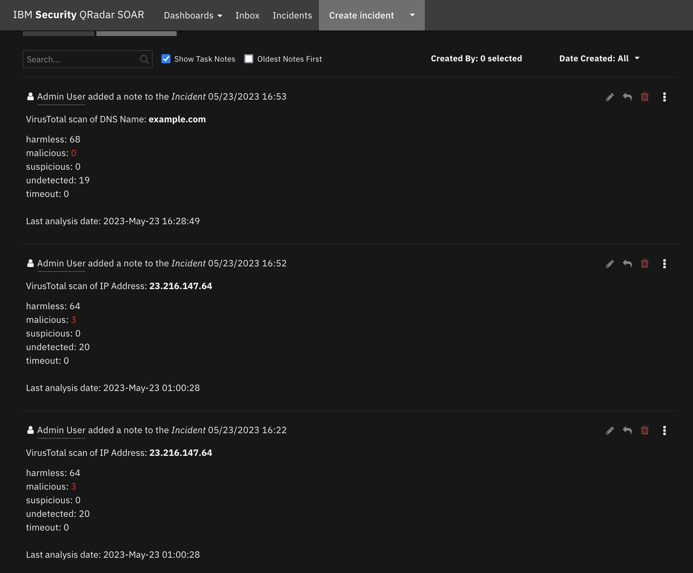

<!--
  This Install README.md is generated by running:
  "resilient-sdk docgen -p fn_virustotal --install-guide"

  It is best edited using a Text Editor with a Markdown Previewer. VS Code
  is a good example. Checkout https://guides.github.com/features/mastering-markdown/
  for tips on writing with Markdown

  If you make manual edits and run docgen again, a .bak file will be created

  Store any screenshots in the "doc/screenshots" directory and reference them like:
  
-->

# fn-virustotal Functions for IBM Resilient

- [Release Notes](#release-notes)
- [Overview](#overview)
- [Requirements](#requirements)
- [App Host Installation](#app-host-installation)
- [Integration Server Installation](#integration-server-installation)
- [Rules and Workflows](#rules-and-workflows)
- [Customoizations](#customizations)
- [Troubleshooting](#troubleshooting)
- [Support](#support)

---

## Release Notes
<!--
  Specify all changes in this release. Do not remove the release 
  notes of a previous release
-->
### History
| Version| Comment |
| ------- | ------ |
| 1.0.6 | Enhanced Rules and Workflows |
| 1.0.5 | Bugfixes and Documentation updates |
| 1.0.4 | No longer requires proxies field in configuration settings. Added unicode support for attachment scan |
| 1.0.3 | Compatibility with older versions of resilient-circuits |
| 1.0.2 | Support for App Host |
| 1.0.1 | Proxy support added |

---

## Overview
<!--
  Provide a high-level description of the function itself and its remote software or application.
  The text below is parsed from the "description" and "long_description" attributes in the setup.py file
-->
**Resilient Circuits Components for 'fn_virustotal'**

 
 
VirusTotal is an artifact enrichment solution. 
Queries are possible for:

 * IP Addresses,
 * URLs, 
 * hashes, 
 * domains and 
 * files

Files and URLs may require additional time to complete their scans, so a link is returned to review the results at a later time.

---

## App Host Installation
All the components for running VirusTotal in a container already exist when using the App Host app. 

To install, 
* Navigate to Administrative Settings and then the Apps tab. 
* Click the `Install` button and select the downloaded file: app-fn_virustotal-x.x.x.zip. 
* Go to the Configuration tab and edit the app.config file, 
editing the API key for VirusTotal and making any additional setting changes. 

```
[fn_virustotal]
api_token = xxxxxxxxx
proxies =
polling_interval_sec = 60
max_polling_wait_sec = 600
```

## Integration Server Installation
<!--
  List any Requirements 
-->
* Resilient platform >= `v35.2.32`
* An Integration Server running `resilient_circuits>=30.0.0`
  * To set up an Integration Server see: [ibm.biz/res-int-server-guide](https://ibm.biz/res-int-server-guide)
  * If using API Keys, minimum required permissions are:
      * Org Data: Read, Edit
      * Function: Read
      * Incidents: Read
---

### Installation
* Download the `app-fn_virustotal-x.x.x.zip`.
* Copy the `.zip` to your Integration Server and SSH into it.
* **Unzip** the package:
  ```
  $ unzip app-fn_virustotal-x.x.x.zip
  ```
* **Install** the package:
  ```
  $ pip install fn_virustotal-x.x.x.tar.gz
  ```
* Import the **configurations** into your app.config file:
  ```
  $ resilient-circuits config -u -l fn-virustotal
  ```
* Import the fn_virustotal **customizations** into the Resilient platform:
  ```
  $ resilient-circuits customize -y -l fn-virustotal
  ```
* Open the config file, scroll to the bottom and edit your fn_virustotal configurations:
  ```
  $ nano ~/.resilient/app.config
  ```
  | Config | Required | Example | Description |
  | ------ | :------: | ------- | ----------- |
  | **api_token** | Yes | `` | *Enter a description of the config here* |
  | **polling_interval_sec** | Yes | `60` | *Enter a description of the config here* |
  | **max_polling_wait_sec** | Yes | `600` | *Enter a description of the config here* |
  | **https_proxy** | No | https://myproxy.com | *Enter a proxy for https access* |
  | **http_proxy** | No | http://myproxy.com | *Enter a proxy for http access* |

* **Save** and **Close** the app.config file.
* [Optional]: Run selftest to test the Integration you configured:
  ```
  $ resilient-circuits selftest -l fn-virustotal
  ```
* **Run** resilient-circuits or restart the Service on Windows/Linux:
  ```
  $ resilient-circuits run
  ```

---

### Uninstall
* SSH into your Integration Server.
* **Uninstall** the package:
  ```
  $ pip uninstall fn-virustotal
  ```
* Open the config file, scroll to the [fn_virustotal] section and remove the section or prefix `#` to comment out the section.
* **Save** and **Close** the app.config file.

---
## Rules and Workflows
Two example rules and workflows are available to run VirusTotal scans against artifacts and attachments.

### Example: Virus Total 
This rule runs the `Example: VirusTotal Scan` workflow against an artifact. The results of a scan
are added to a note for review. In some cases, the scan results may not be available immediately. 
In those cases, a link to the VirusTotal report is provided for review when complete.


### Example: VirusTotal Scan (Attachment) 
This rule runs the `Example: Virus Total for Attachments ` workflow for VirusTotal scanning against attachments or artifact file uploads.
Similar to the `Example: VirusTotal Scan` workflow, the results of the VirusTotal scan is returned as a incident note.

## Customizations
Each of the rules and workflows are provided as examples of how to parse and present the results.
Your use of the VirusTotal function may require different processing with additional 
workflow components such as scripts, task management and additional functions. 
It's best to create your own rules and workflows for production operations.  
Refer to the example workflow post-processing scripts for sample script logic and VirusTotal results to use in your own workflows.

## Troubleshooting
There are several ways to verify the successful operation of a function.

### Resilient Action Status
* When viewing an incident, use the Actions menu to view **Action Status**.
* By default, pending and errors are displayed.
* Modify the filter for actions to also show Completed actions.
* Clicking on an action displays additional information on the progress made or what error occurred.

### Resilient Scripting Log
* A separate log file is available to review scripting errors.
* This is useful when issues occur in the pre-processing or post-processing scripts.
* The default location for this log file is: `/var/log/resilient-scripting/resilient-scripting.log`.

### Resilient Logs
* By default, Resilient logs are retained at `/usr/share/co3/logs`.
* The `client.log` may contain additional information regarding the execution of functions.

### Resilient-Circuits
* The log is controlled in the `.resilient/app.config` file under the section [resilient] and the property `logdir`.
* The default file name is `app.log`.
* Each function will create progress information.
* Failures will show up as errors and may contain python trace statements.

---

<!--
  If necessary, use this section to describe how to configure your security application to work with the integration.
  Delete this section if the user does not need to perform any configuration procedures on your product.

## Configure <Product_Name>

* Step One
* Step Two
* Step Three

---
-->

## Support
| Name | Version | Author | Support URL |
| ---- | ------- | ------ | ----------- |
| fn_virustotal | 1.0.6 | Resilient Labs | https://ibm.biz/resilientcommunity |
