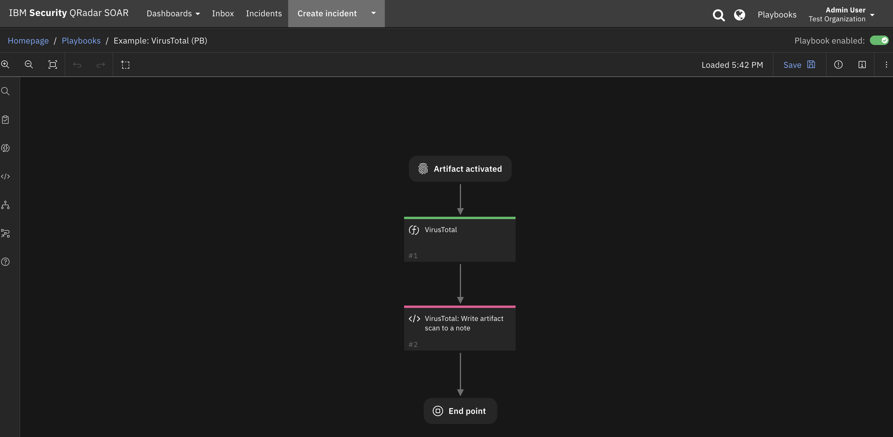
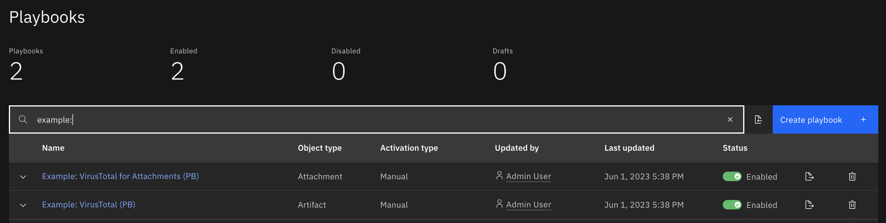

<!--
  This README.md is generated by running:
  "resilient-sdk docgen -p fn_virustotal"

  This file was generated with resilient-sdk v49.0.4368

  It is best edited using a Text Editor with a Markdown Previewer. VS Code
  is a good example. Checkout https://guides.github.com/features/mastering-markdown/
  for tips on writing with Markdown

  All fields followed by "::CHANGE_ME::"" should be manually edited

  If you make manual edits and run docgen again, a .bak file will be created

  Store any screenshots in the "doc/screenshots" directory and reference them like:
  

  NOTE: If your app is available in the container-format only, there is no need to mention the integration server in this readme.
-->

# VirusTotal

## Table of Contents
- [Release Notes](#release-notes)
- [Overview](#overview)
  - [Key Features](#key-features)
- [Requirements](#requirements)
  - [SOAR platform](#soar-platform)
  - [Cloud Pak for Security](#cloud-pak-for-security)
  - [Proxy Server](#proxy-server)
  - [Python Environment](#python-environment)
- [Installation](#installation)
  - [Install](#install)
  - [App Configuration](#app-configuration)
- [Function - VirusTotal](#function---virustotal)
- [Playbooks](#playbooks)
- [Troubleshooting & Support](#troubleshooting--support)

---

## Release Notes
<!--
  Specify all changes in this release. Do not remove the release 
  notes of a previous release
-->
| Version | Date | Notes |
| ------- | ---- | ----- |
| 1.1.0 | Playbook support. Task attachment analysis support. |
| 1.0.7 | Add Support for Custom Headers |
| 1.0.6 | Enhanced Rules and Workflows |
| 1.0.5 | Bugfixes and Documentation updates |
| 1.0.4 | No longer requires proxies field in configuration settings. Added unicode support for attachment scan |
| 1.0.3 | Compatibility with older versions of resilient-circuits |
| 1.0.2 | Support for App Host |
| 1.0.1 | Proxy support added |

---
### 1.1 Changes
In v1.1, the existing rules and workflows have been replaced with playbooks.
This change is made to support the ongoing, newer capabilities of playbooks.
Each playbook has the same functionality as the previous, corresponding rule/workflow. 

If upgrading from a previous release, notice that the previous release's rules/workflows remain in place. Both sets of rules and playbooks are active. For manual actions, playbooks have the same name as it's corresponding rule, but with "(PB)" added at the end.

You can continue to use the rules/workflows, but migrating to playbooks will provide greater functionality along with future app enhancements and bug fixes. 

## Overview
<!--
  Provide a high-level description of the function itself and its remote software or application.
  The text below is parsed from the "description" and "long_description" attributes in the setup.py file
-->
**IBM SOAR app for VirusTotal**

 

The VirusTotal app for SOAR performs VirusTotal analysis on IP Addresses, URLs, hashes, domain and file artifacts and on file attachments.

### Key Features
<!--
  List the Key Features of the Integration
-->
* Perform VirusTotal analysis scan on the following SOAR artifact types:
  * DNS Name
  * Email Attachment
  * IP Address
  * File
  * File Name
  * Malware Sample
  * Malware MD5 Hash
  * Malware SHA-1
  * Malware SHA-256 Hash
  * Other File
  * RFC 822 Email Message File
  * URL
* Provide a link back to the VirusTotal report in a SOAR case note. 

---

## Requirements
<!--
  List any Requirements 
--> 
This app supports the IBM Security QRadar SOAR Platform and the IBM Security QRadar SOAR for IBM Cloud Pak for Security.

### SOAR platform
The SOAR platform supports two app deployment mechanisms, Edge Gateway (formerly App Host) and integration server.

If deploying to a SOAR platform with an Edge Gateway, the requirements are:
* SOAR platform >= `45.2.0`.
* The app is in a container-based format (available from the AppExchange as a `zip` file).

If deploying to a SOAR platform with an integration server, the requirements are:
* SOAR platform >= `45.2.0`.
* The app is in the older integration format (available from the AppExchange as a `zip` file which contains a `tar.gz` file).
* Integration server is running `resilient-circuits>=48.0.0`.
* If using an API key account, make sure the account provides the following minimum permissions: 
  | Name | Permissions |
  | ---- | ----------- |
  | Org Data | Read |
  | Function | Read |
  | Incidents | Read |
  | Incident fields | Edit |

The following SOAR platform guides provide additional information: 
* _Edge Gateway Deployment Guide_ or _App Host Deployment Guide_: provides installation, configuration, and troubleshooting information, including proxy server settings. 
* _Integration Server Guide_: provides installation, configuration, and troubleshooting information, including proxy server settings.
* _System Administrator Guide_: provides the procedure to install, configure and deploy apps. 

The above guides are available on the IBM Documentation website at [ibm.biz/soar-docs](https://ibm.biz/soar-docs). On this web page, select your SOAR platform version. On the follow-on page, you can find the _Edge Gateway Deployment Guide_, _App Host Deployment Guide_, or _Integration Server Guide_ by expanding **Apps** in the Table of Contents pane. The System Administrator Guide is available by expanding **System Administrator**.

### Cloud Pak for Security
If you are deploying to IBM Cloud Pak for Security, the requirements are:
* IBM Cloud Pak for Security >= `1.8`.
* Cloud Pak is configured with an Edge Gateway.
* The app is in a container-based format (available from the AppExchange as a `zip` file).

The following Cloud Pak guides provide additional information: 
* _Edge Gateway Deployment Guide_ or _App Host Deployment Guide_: provides installation, configuration, and troubleshooting information, including proxy server settings. From the Table of Contents, select Case Management and Orchestration & Automation > **Orchestration and Automation Apps**.
* _System Administrator Guide_: provides information to install, configure, and deploy apps. From the IBM Cloud Pak for Security IBM Documentation table of contents, select Case Management and Orchestration & Automation > **System administrator**.

These guides are available on the IBM Documentation website at [ibm.biz/cp4s-docs](https://ibm.biz/cp4s-docs). From this web page, select your IBM Cloud Pak for Security version. From the version-specific IBM Documentation page, select Case Management and Orchestration & Automation.

### Proxy Server
The app **does** support a proxy server.

### Python Environment
Python 3.6 and Python 3.9 are supported.
Additional package dependencies may exist for each of these packages:
* bs4==0.0.1
* resilient-circuits>=48.0.0

### VirusTotal Development Version

This app has been implemented using:
| Product Name | Product Version| API URL | API Version |
| ------------ | --------------- | ------- | ----------- |
| VirusTotal | N/A | https://virustotal.com/api/v3 | v3 |

#### Prerequisites
<!--
List any prerequisites that are needed to use with this endpoint solution. Remove any section that is unnecessary.
-->
* VirusTotal API token

#### Configuration
<!--
List any steps that are needed to configure the endpoint to use this app.
-->
* Generate a VirusTotal API token for use with IBM SOAR. Use this value in the app.config `api_token` setting.

---

## Installation

### Install
* To install or uninstall an App or Integration on the _SOAR platform_, see the documentation at [ibm.biz/soar-docs](https://ibm.biz/soar-docs).
* To install or uninstall an App on _IBM Cloud Pak for Security_, see the documentation at [ibm.biz/cp4s-docs](https://ibm.biz/cp4s-docs) and follow the instructions above to navigate to Orchestration and Automation.

### App Configuration
The following table provides the settings you need to configure the app. These settings are made in the app.config file. See the documentation discussed in the Requirements section for the procedure.

| Config | Required | Example | Description |
| ------ | :------: | ------- | ----------- |
| **api_token** | Yes | `` | *VirusTotal API token.* |
| **max_polling_wait_sec** | Yes | `600` | *Max polling time in seconds to wait for a scan analysis to complete.* |
| **polling_interval_sec** | Yes | `60` | *Interval time in seconds to check if a scan analysis is complete.*  |


---

## Function - VirusTotal
Perform VirusTotal scans and return reports on ip addresses, URLs, domains, hashes and files.

  

<p>
Sample playbook using the VirusTotal function:

  

Sample note created by scanning a hash artifact:

   

<details><summary>Inputs:</summary>
<p>

| Name | Type | Required | Example | Tooltip |
| ---- | :--: | :------: | ------- | ------- |
| `artifact_id` | `number` | No | `-` | - |
| `attachment_id` | `number` | No | `-` | - |
| `incident_id` | `number` | Yes | `-` | - |
| `vt_data` | `text` | No | `-` | data field for virusTotal lookup |
| `vt_type` | `text` | No | `-` | descriptor for the type of virusTotal lookup to perform |

</p>
</details>

<details><summary>Outputs:</summary>
<p>

> **NOTE:** This example might be in JSON format, but `results` is a Python Dictionary on the SOAR platform.

```python
results = {
  "scan": {
    "data": {
      "attributes": {
        "last_dns_records": [
          {
            "type": "NS",
            "value": "b.iana-servers.net",
            "ttl": 16570
          },
          {
            "priority": 0,
            "type": "MX",
            "value": "",
            "ttl": 20693
          },
          {
            "type": "AAAA",
            "value": "2606:2800:220:1:248:1893:25c8:1946",
            "ttl": 21556
          },
          {
            "type": "TXT",
            "value": "wgyf8z8cgvm2qmxpnbnldrcltvk4xqfn",
            "ttl": 21600
          },
          {
            "type": "A",
            "value": "93.184.216.34",
            "ttl": 11480
          },
          {
            "rname": "noc.dns.icann.org",
            "retry": 3600,
            "refresh": 7200,
            "minimum": 3600,
            "value": "ns.icann.org",
            "expire": 1209600,
            "ttl": 3600,
            "serial": 2022091285,
            "type": "SOA"
          },
          {
            "type": "TXT",
            "value": "v=spf1 -all",
            "ttl": 21600
          },
          {
            "type": "NS",
            "value": "a.iana-servers.net",
            "ttl": 16570
          }
        ],
        "jarm": "29d29d15d29d29d21c42d42d0000003014e6e1a0bc19438ed392b132659e77",
        "whois": "Creation Date: 1995-08-14T04:00:00Z\nDNSSEC: signedDelegation\nDomain Name: EXAMPLE.COM\nDomain Status: clientDeleteProhibited https://icann.org/epp#clientDeleteProhibited\nDomain Status: clientTransferProhibited https://icann.org/epp#clientTransferProhibited\nDomain Status: clientUpdateProhibited https://icann.org/epp#clientUpdateProhibited\nName Server: A.IANA-SERVERS.NET\nName Server: B.IANA-SERVERS.NET\nRegistrar IANA ID: 376\nRegistrar URL: http://res-dom.iana.org\nRegistrar WHOIS Server: whois.iana.org\nRegistrar: RESERVED-Internet Assigned Numbers Authority\nRegistry Domain ID: 2336799_DOMAIN_COM-VRSN\nRegistry Expiry Date: 2023-08-13T04:00:00Z\nUpdated Date: 2022-08-14T07:01:31Z\ncreated: 1992-01-01\ndomain: EXAMPLE.COM\norganisation: Internet Assigned Numbers Authority\nsource: IANA",
        "last_https_certificate_date": 1684856030,
        "tags": [],
        "popularity_ranks": {
          "Majestic": {
            "timestamp": 1684861082,
            "rank": 333
          },
          "Statvoo": {
            "timestamp": 1684169881,
            "rank": 12875
          },
          "Alexa": {
            "timestamp": 1684083481,
            "rank": 12875
          },
          "Cisco Umbrella": {
            "timestamp": 1684861081,
            "rank": 11545
          }
        },
        "last_analysis_date": 1684855729,
        "last_dns_records_date": 1684856030,
        "last_analysis_stats": {
          "harmless": 68,
          "malicious": 0,
          "suspicious": 0,
          "undetected": 19,
          "timeout": 0
        },
        "creation_date": 808372800,
        "whois_date": 1682950996,
        "reputation": -6,
        "registrar": "RESERVED-Internet Assigned Numbers Authority",
        "last_analysis_results": {
          "Bkav": {
            "category": "undetected",
            "result": "unrated",
            "method": "blacklist",
            "engine_name": "Bkav"
          },
          "CMC Threat Intelligence": {
            "category": "harmless",
            "result": "clean",
            "method": "blacklist",
            "engine_name": "CMC Threat Intelligence"
          },
          "Snort IP sample list": {
            "category": "harmless",
            "result": "clean",
            "method": "blacklist",
            "engine_name": "Snort IP sample list"
          },
          "0xSI_f33d": {
            "category": "undetected",
            "result": "unrated",
            "method": "blacklist",
            "engine_name": "0xSI_f33d"
          },
          "ViriBack": {
            "category": "harmless",
            "result": "clean",
            "method": "blacklist",
            "engine_name": "ViriBack"
          },
          "PhishLabs": {
            "category": "undetected",
            "result": "unrated",
            "method": "blacklist",
            "engine_name": "PhishLabs"
          },
          "K7AntiVirus": {
            "category": "harmless",
            "result": "clean",
            "method": "blacklist",
            "engine_name": "K7AntiVirus"
          },
          "CINS Army": {
            "category": "harmless",
            "result": "clean",
            "method": "blacklist",
            "engine_name": "CINS Army"
          },
          "Quttera": {
            "category": "harmless",
            "result": "clean",
            "method": "blacklist",
            "engine_name": "Quttera"
          },
          "PrecisionSec": {
            "category": "undetected",
            "result": "unrated",
            "method": "blacklist",
            "engine_name": "PrecisionSec"
          },
          "OpenPhish": {
            "category": "harmless",
            "result": "clean",
            "method": "blacklist",
            "engine_name": "OpenPhish"
          },
          "VX Vault": {
            "category": "harmless",
            "result": "clean",
            "method": "blacklist",
            "engine_name": "VX Vault"
          },
          "ArcSight Threat Intelligence": {
            "category": "undetected",
            "result": "unrated",
            "method": "blacklist",
            "engine_name": "ArcSight Threat Intelligence"
          },
          "Scantitan": {
            "category": "harmless",
            "result": "clean",
            "method": "blacklist",
            "engine_name": "Scantitan"
          },
          "AlienVault": {
            "category": "harmless",
            "result": "clean",
            "method": "blacklist",
            "engine_name": "AlienVault"
          },
          "Sophos": {
            "category": "harmless",
            "result": "clean",
            "method": "blacklist",
            "engine_name": "Sophos"
          },
          "Phishtank": {
            "category": "harmless",
            "result": "clean",
            "method": "blacklist",
            "engine_name": "Phishtank"
          },
          "Cyan": {
            "category": "undetected",
            "result": "unrated",
            "method": "blacklist",
            "engine_name": "Cyan"
          },
          "Spam404": {
            "category": "harmless",
            "result": "clean",
            "method": "blacklist",
            "engine_name": "Spam404"
          },
          "SecureBrain": {
            "category": "harmless",
            "result": "clean",
            "method": "blacklist",
            "engine_name": "SecureBrain"
          },
          "CRDF": {
            "category": "harmless",
            "result": "clean",
            "method": "blacklist",
            "engine_name": "CRDF"
          },
          "Fortinet": {
            "category": "harmless",
            "result": "clean",
            "method": "blacklist",
            "engine_name": "Fortinet"
          },
          "alphaMountain.ai": {
            "category": "harmless",
            "result": "clean",
            "method": "blacklist",
            "engine_name": "alphaMountain.ai"
          },
          "Lionic": {
            "category": "harmless",
            "result": "clean",
            "method": "blacklist",
            "engine_name": "Lionic"
          },
          "Cyble": {
            "category": "harmless",
            "result": "clean",
            "method": "blacklist",
            "engine_name": "Cyble"
          },
          "Seclookup": {
            "category": "harmless",
            "result": "clean",
            "method": "blacklist",
            "engine_name": "Seclookup"
          },
          "Xcitium Verdict Cloud": {
            "category": "harmless",
            "result": "clean",
            "method": "blacklist",
            "engine_name": "Xcitium Verdict Cloud"
          },
          "Google Safebrowsing": {
            "category": "harmless",
            "result": "clean",
            "method": "blacklist",
            "engine_name": "Google Safebrowsing"
          },
          "SafeToOpen": {
            "category": "undetected",
            "result": "unrated",
            "method": "blacklist",
            "engine_name": "SafeToOpen"
          },
          "ADMINUSLabs": {
            "category": "harmless",
            "result": "clean",
            "method": "blacklist",
            "engine_name": "ADMINUSLabs"
          },
          "ESTsecurity": {
            "category": "harmless",
            "result": "clean",
            "method": "blacklist",
            "engine_name": "ESTsecurity"
          },
          "Juniper Networks": {
            "category": "harmless",
            "result": "clean",
            "method": "blacklist",
            "engine_name": "Juniper Networks"
          },
          "Heimdal Security": {
            "category": "harmless",
            "result": "clean",
            "method": "blacklist",
            "engine_name": "Heimdal Security"
          },
          "AutoShun": {
            "category": "undetected",
            "result": "unrated",
            "method": "blacklist",
            "engine_name": "AutoShun"
          },
          "Trustwave": {
            "category": "undetected",
            "result": "unrated",
            "method": "blacklist",
            "engine_name": "Trustwave"
          },
          "AICC (MONITORAPP)": {
            "category": "harmless",
            "result": "clean",
            "method": "blacklist",
            "engine_name": "AICC (MONITORAPP)"
          },
          "CyRadar": {
            "category": "harmless",
            "result": "clean",
            "method": "blacklist",
            "engine_name": "CyRadar"
          },
          "Dr.Web": {
            "category": "harmless",
            "result": "clean",
            "method": "blacklist",
            "engine_name": "Dr.Web"
          },
          "Emsisoft": {
            "category": "harmless",
            "result": "clean",
            "method": "blacklist",
            "engine_name": "Emsisoft"
          },
          "Abusix": {
            "category": "harmless",
            "result": "clean",
            "method": "blacklist",
            "engine_name": "Abusix"
          },
          "Webroot": {
            "category": "harmless",
            "result": "clean",
            "method": "blacklist",
            "engine_name": "Webroot"
          },
          "Avira": {
            "category": "harmless",
            "result": "clean",
            "method": "blacklist",
            "engine_name": "Avira"
          },
          "securolytics": {
            "category": "harmless",
            "result": "clean",
            "method": "blacklist",
            "engine_name": "securolytics"
          },
          "Antiy-AVL": {
            "category": "harmless",
            "result": "clean",
            "method": "blacklist",
            "engine_name": "Antiy-AVL"
          },
          "AlphaSOC": {
            "category": "undetected",
            "result": "unrated",
            "method": "blacklist",
            "engine_name": "AlphaSOC"
          },
          "Acronis": {
            "category": "harmless",
            "result": "clean",
            "method": "blacklist",
            "engine_name": "Acronis"
          },
          "Quick Heal": {
            "category": "harmless",
            "result": "clean",
            "method": "blacklist",
            "engine_name": "Quick Heal"
          },
          "URLQuery": {
            "category": "harmless",
            "result": "clean",
            "method": "blacklist",
            "engine_name": "URLQuery"
          },
          "Viettel Threat Intelligence": {
            "category": "harmless",
            "result": "clean",
            "method": "blacklist",
            "engine_name": "Viettel Threat Intelligence"
          },
          "DNS8": {
            "category": "harmless",
            "result": "clean",
            "method": "blacklist",
            "engine_name": "DNS8"
          },
          "benkow.cc": {
            "category": "harmless",
            "result": "clean",
            "method": "blacklist",
            "engine_name": "benkow.cc"
          },
          "EmergingThreats": {
            "category": "harmless",
            "result": "clean",
            "method": "blacklist",
            "engine_name": "EmergingThreats"
          },
          "Chong Lua Dao": {
            "category": "harmless",
            "result": "clean",
            "method": "blacklist",
            "engine_name": "Chong Lua Dao"
          },
          "Yandex Safebrowsing": {
            "category": "harmless",
            "result": "clean",
            "method": "blacklist",
            "engine_name": "Yandex Safebrowsing"
          },
          "Lumu": {
            "category": "undetected",
            "result": "unrated",
            "method": "blacklist",
            "engine_name": "Lumu"
          },
          "zvelo": {
            "category": "harmless",
            "result": "clean",
            "method": "blacklist",
            "engine_name": "zvelo"
          },
          "Kaspersky": {
            "category": "harmless",
            "result": "clean",
            "method": "blacklist",
            "engine_name": "Kaspersky"
          },
          "Segasec": {
            "category": "undetected",
            "result": "unrated",
            "method": "blacklist",
            "engine_name": "Segasec"
          },
          "Sucuri SiteCheck": {
            "category": "harmless",
            "result": "clean",
            "method": "blacklist",
            "engine_name": "Sucuri SiteCheck"
          },
          "desenmascara.me": {
            "category": "harmless",
            "result": "clean",
            "method": "blacklist",
            "engine_name": "desenmascara.me"
          },
          "CrowdSec": {
            "category": "undetected",
            "result": "unrated",
            "method": "blacklist",
            "engine_name": "CrowdSec"
          },
          "Cluster25": {
            "category": "undetected",
            "result": "unrated",
            "method": "blacklist",
            "engine_name": "Cluster25"
          },
          "URLhaus": {
            "category": "harmless",
            "result": "clean",
            "method": "blacklist",
            "engine_name": "URLhaus"
          },
          "PREBYTES": {
            "category": "harmless",
            "result": "clean",
            "method": "blacklist",
            "engine_name": "PREBYTES"
          },
          "StopForumSpam": {
            "category": "harmless",
            "result": "clean",
            "method": "blacklist",
            "engine_name": "StopForumSpam"
          },
          "Blueliv": {
            "category": "harmless",
            "result": "clean",
            "method": "blacklist",
            "engine_name": "Blueliv"
          },
          "Netcraft": {
            "category": "undetected",
            "result": "unrated",
            "method": "blacklist",
            "engine_name": "Netcraft"
          },
          "ZeroCERT": {
            "category": "harmless",
            "result": "clean",
            "method": "blacklist",
            "engine_name": "ZeroCERT"
          },
          "Phishing Database": {
            "category": "harmless",
            "result": "clean",
            "method": "blacklist",
            "engine_name": "Phishing Database"
          },
          "MalwarePatrol": {
            "category": "harmless",
            "result": "clean",
            "method": "blacklist",
            "engine_name": "MalwarePatrol"
          },
          "IPsum": {
            "category": "harmless",
            "result": "clean",
            "method": "blacklist",
            "engine_name": "IPsum"
          },
          "Malwared": {
            "category": "harmless",
            "result": "clean",
            "method": "blacklist",
            "engine_name": "Malwared"
          },
          "BitDefender": {
            "category": "harmless",
            "result": "clean",
            "method": "blacklist",
            "engine_name": "BitDefender"
          },
          "GreenSnow": {
            "category": "harmless",
            "result": "clean",
            "method": "blacklist",
            "engine_name": "GreenSnow"
          },
          "G-Data": {
            "category": "harmless",
            "result": "clean",
            "method": "blacklist",
            "engine_name": "G-Data"
          },
          "VIPRE": {
            "category": "undetected",
            "result": "unrated",
            "method": "blacklist",
            "engine_name": "VIPRE"
          },
          "SCUMWARE.org": {
            "category": "harmless",
            "result": "clean",
            "method": "blacklist",
            "engine_name": "SCUMWARE.org"
          },
          "PhishFort": {
            "category": "undetected",
            "result": "unrated",
            "method": "blacklist",
            "engine_name": "PhishFort"
          },
          "malwares.com URL checker": {
            "category": "harmless",
            "result": "clean",
            "method": "blacklist",
            "engine_name": "malwares.com URL checker"
          },
          "Forcepoint ThreatSeeker": {
            "category": "harmless",
            "result": "clean",
            "method": "blacklist",
            "engine_name": "Forcepoint ThreatSeeker"
          },
          "Criminal IP": {
            "category": "undetected",
            "result": "unrated",
            "method": "blacklist",
            "engine_name": "Criminal IP"
          },
          "Certego": {
            "category": "harmless",
            "result": "clean",
            "method": "blacklist",
            "engine_name": "Certego"
          },
          "ESET": {
            "category": "harmless",
            "result": "clean",
            "method": "blacklist",
            "engine_name": "ESET"
          },
          "Threatsourcing": {
            "category": "harmless",
            "result": "clean",
            "method": "blacklist",
            "engine_name": "Threatsourcing"
          },
          "ThreatHive": {
            "category": "harmless",
            "result": "clean",
            "method": "blacklist",
            "engine_name": "ThreatHive"
          },
          "Bfore.Ai PreCrime": {
            "category": "harmless",
            "result": "clean",
            "method": "blacklist",
            "engine_name": "Bfore.Ai PreCrime"
          }
        },
        "last_update_date": 1660460491,
        "last_modification_date": 1684875206,
        "tld": "com",
        "last_https_certificate": {
          "size": 1870,
          "public_key": {
            "rsa": {
              "key_size": 2048,
              "modulus": "c280778959b8456fba4ad911fa7badc757d07afbb6fadd05bba28171bbe17f21d25f2ef0d2724e7534f88d62e34ada5190d4013d9c0cc071f7e62fb6d6076726d0deff17cef085fd31c166ca876505472a5fc0abb88cc3bfd0177f63a35cf046fb86aafb4dd72a5e7f9ae013977dbefb7d35570d5d5e819835ea1642a2d3b074f7592ded38e7fe7a1bb336e67eae3f9ea61683de53014e8100aebb42f51f752934cde9848038ae3c3714c0f027ce3052b98adc5f22a079f84f4e4904e2757caa2f2a1e03ec714ca32a61fc6fca911e935a2e780858f6eebb34205d9ae6afc6d7f2bf0a7bfa8e9277e36c7b0c4086644a15ec70d7728e6330e10bef5a30972e25",
              "exponent": "10001"
            },
            "algorithm": "RSA"
          },
          "thumbprint_sha256": "5ef2f214260ab8f58e55eea42e4ac04b0f171807d8d1185fddd67470e9ab6096",
          "cert_signature": {
            "signature": "59e44ad8a982ba9a4af1630c6d762675b33c74bec5f73da79192f8cf062d5810edf3b8d6fc6cff139632cd4fe98724850b74a2c2f60ff5a7d87d768aaee9c9582b6e006fb9cd24eec442c54c16859d34613923bfc68e95c984a9b2e5410f4478d795b9cfd974bf584fe716ff7c4030c46c4e224dcb83673a93bf2bc5c59c1af243a1253b84f6f7536ea885aede14749130060df207d4c408ba4364c5e23fdaacc541afa437e8427674f713bb4a7d3659819bc744df8973b93342e860c24d615d125a10f6efff33891450e8d69fc6b95c2b35dbadeddd36b625f2958aac693f9afe1af815286dea185ac2d26218af4078b5fa5e098f53f9ccf823a1833123f4c6",
            "signature_algorithm": "sha256RSA"
          },
          "validity": {
            "not_after": "2024-02-13 23:59:59",
            "not_before": "2023-01-13 00:00:00"
          },
          "version": "V3",
          "extensions": {
            "certificate_policies": [
              "2.23.140.1.2.2"
            ],
            "extended_key_usage": [
              "serverAuth",
              "clientAuth"
            ],
            "authority_key_identifier": {
              "keyid": "b76ba2eaa8aa848c79eab4da0f98b2c59576b9f4"
            },
            "subject_alternative_name": [
              "www.example.org",
              "example.net",
              "example.edu",
              "example.com",
              "example.org",
              "www.example.com",
              "www.example.edu",
              "www.example.net"
            ],
            "subject_key_identifier": "b0933fe81782fd6cb2b61787cbe380fe829b019e",
            "crl_distribution_points": [
              "http://crl3.digicert.com/DigiCertTLSRSASHA2562020CA1-4.crl",
              "http://crl4.digicert.com/DigiCertTLSRSASHA2562020CA1-4.crl"
            ],
            "key_usage": [
              "digitalSignature",
              "keyEncipherment"
            ],
            "1.3.6.1.4.1.11129.2.4.2": "0482016b0169007600eecdd064d5db1acec55cb79db4cd13a23287467cbcecde",
            "CA": false,
            "ca_information_access": {
              "CA Issuers": "http://cacerts.digicert.com/DigiCertTLSRSASHA2562020CA1-1.crt",
              "OCSP": "http://ocsp.digicert.com"
            }
          },
          "thumbprint": "f2aad73d32683b716d2a7d61b51c6d5764ab3899",
          "serial_number": "c1fcb184518c7e3866741236d6b73f1",
          "issuer": {
            "C": "US",
            "CN": "DigiCert TLS RSA SHA256 2020 CA1",
            "O": "DigiCert Inc"
          },
          "subject": {
            "C": "US",
            "L": "Los Angeles",
            "CN": "www.example.org",
            "O": "Internet\u00a0Corporation\u00a0for\u00a0Assigned\u00a0Names\u00a0and\u00a0Numbers",
            "ST": "California"
          }
        },
        "categories": {
          "Forcepoint ThreatSeeker": "information technology",
          "Sophos": "information technology",
          "Xcitium Verdict Cloud": "mobile communications",
          "BitDefender": "computersandsoftware"
        },
        "total_votes": {
          "harmless": 22,
          "malicious": 5
        }
      },
      "type": "domain",
      "id": "example.com",
      "links": {
        "self": "https://virustotal.com/api/v3/domains/example.com"
      }
    }
  },
  "code": "success"
}
```

</p>
</details>

<details><summary>Example Pre-Process Script:</summary>
<p>

```python
typeLookup = { 'Email Attachment': 'file', 'Malware Sample': 'file', 'Malware MD5 Hash': 'hash', 'Malware SHA-1 Hash': 'hash', 'Malware SHA-256 Hash': 'hash', 'Other File': 'file', 'RCF 822 Email Message File': 'file', 'File Name': 'filename',
 'URL': 'url', 'IP Address': 'ip', 'DNS Name':'domain'}
if artifact.type in typeLookup:
  inputs.vt_type = typeLookup.get(artifact.type, artifact.type)
else:
  inputs.vt_type = artifact.type

inputs.incident_id = incident.id
inputs.artifact_id = artifact.id
inputs.vt_data = artifact.value
```

</p>
</details>

<details><summary>Example Post-Process Script:</summary>
<p>

```python
import datetime
import json

VIRUSTOTAL_GUI_URL = "https://www.virustotal.com/gui"

results = playbook.functions.results.vt_scan_results

# Uncomment the following line to have the results json printed formatted to a note.
#pretty_results = json.dumps(results, indent=4, sort_keys=True)
#incident.addNote(helper.createRichText(u"<p>VirusTotal scan of {0}: {1}</p><div>{2}</div>".format(artifact.type, artifact.value, pretty_results)))

msg = u"<p>VirusTotal scan of {0}: <b>{1}</b></p>".format(artifact.type, artifact.value)
scan = results.get("scan",  {})
if not scan:
  raise Exception("No scan data returned VirusTotal scan {0}: {1}".format(artifact.type, artifact.value))   

data = scan.get("data", {})
scan_error = scan.get("error", {})
if scan_error:
  msg = "{0}Error returned: {1}".format(msg, scan_error)
  #helper.fail("Error returned from VirusTotal scan {0}: {1}: {2}".format(artifact.type, artifact.value, scan_error))

stats = {}
attributes = {}
if data:
  attributes = data.get("attributes", {})
  if attributes:
    # If this a report the stats are in last_analysis_stats otherwise they are in stats
    stats = attributes.get("last_analysis_stats", {})
    if stats == {}:
	    stats = attributes.get("stats", {})

# Write statistics to the note
for k,v in stats.items():
  if k.lower() == "malicious":
    msg = "{0}{1}: <span style='color:red'>{2}</span><br>".format(msg, k, v)
  else:
    msg = "{0}{1}: {2}<br>".format(msg, k, v)

# Write the last analysis time to the note
last_analysis_date = attributes.get("last_analysis_date", None)
if last_analysis_date:
  last_analysis_date_str = datetime.datetime.fromtimestamp(last_analysis_date).strftime('%Y-%b-%d %H:%M:%S')
  msg = "{0}<br>Last analysis date: {1}".format(msg, last_analysis_date_str)

# Add VirusTotal Report link to the note
if data:
  uriLookup = { 'Email Attachment': 'file', 
                'Malware Sample': 'file', 
                'Malware MD5 Hash': 'file', 
                'Malware SHA-1 Hash': 'file', 
                'Malware SHA-256 Hash': 'file', 
                'Other File': 'file',
                'RCF 822 Email Message File': 'file', 
                'File Name': 'file',
                'URL': 'url', 
                'IP Address': 'ip-address', 
                'DNS Name':'domain'}
  uri_fragment = uriLookup.get(artifact.type, None)
  vt_id = data.get("id", None)
  if vt_id and uri_fragment:
    link_back = "<a href='{0}/{1}/{2}'>VirusTotal Report</a>".format(VIRUSTOTAL_GUI_URL, uri_fragment, vt_id)
    msg = "{0}<br>{1}".format(msg, link_back)
  
if not stats:
  msg = "{0}No stats returned from scan {1}: {2}".format(msg, artifact.type, artifact.value)  

incident.addNote(helper.createRichText("<div>{0}</div>".format(msg)))

# Create artifacts from results
last_http_response_content_sha256 = attributes.get("last_http_response_content_sha256", None)
if last_http_response_content_sha256:
    incident.addArtifact('Malware SHA-256 Hash', last_http_response_content_sha256, "Created by VirusTotal scan of artifact type: {0} value: {1}".format(artifact.type, artifact.value))

sha256 = attributes.get("sha256", None) 
if sha256:
    incident.addArtifact('Malware SHA-256 Hash', sha256, "Created by VirusTotal scan of artifact type: {0} value: {1}".format(artifact.type, artifact.value))

md5 = attributes.get("md5", None)
if md5:
    incident.addArtifact('Malware MD5 Hash', md5, "Created by VirusTotal scan of artifact type: {0} value: {1}".format(artifact.type, artifact.value))

sha1 = attributes.get("sha1", None)
if sha1:
    incident.addArtifact('Malware SHA-1 Hash', sha1, "Created by VirusTotal scan of artifact type: {0} value: {1}".format(artifact.type, artifact.value))
```

</p>
</details>

---


## Playbooks
  

| Playbook Name | Description | Object | Status |
| ------------- | ----------- | ------ | ------ |
| Example: VirusTotal (PB) | Perform a VirusTotal scan on an artifact and write the results to a note for review.  | artifact | `enabled` |
| Example: VirusTotal for Attachments (PB) | Perform a VirusTotal scan on an attachment.  Write the results to a note. | attachment | `enabled` |

**NOTE:**The playbooks `Example: VirusTotal (PB)` and `Example: VirusTotal for Attachments (PB)` contain the following lines of code in the post script which can be uncomment to write the complete JSON object returned from a VirusTotal scan to a formatted note.
<p>

```python
# Uncomment the following 2 lines to have the results json printed formatted to a note.
#pretty_results = json.dumps(results, indent=4, sort_keys=True)
#incident.addNote(helper.createRichText(u"<p>VirusTotal scan of {0}: {1} artifact_id: {2}</p><div>{3}</div>".format(artifact.type, artifact.value, artifact.id, pretty_results)))
```

---

## Troubleshooting & Support
Refer to the documentation listed in the Requirements section for troubleshooting information.

### For Support
This is a IBM Community provided App. Please search the Community [ibm.biz/soarcommunity](https://ibm.biz/soarcommunity) for assistance.
