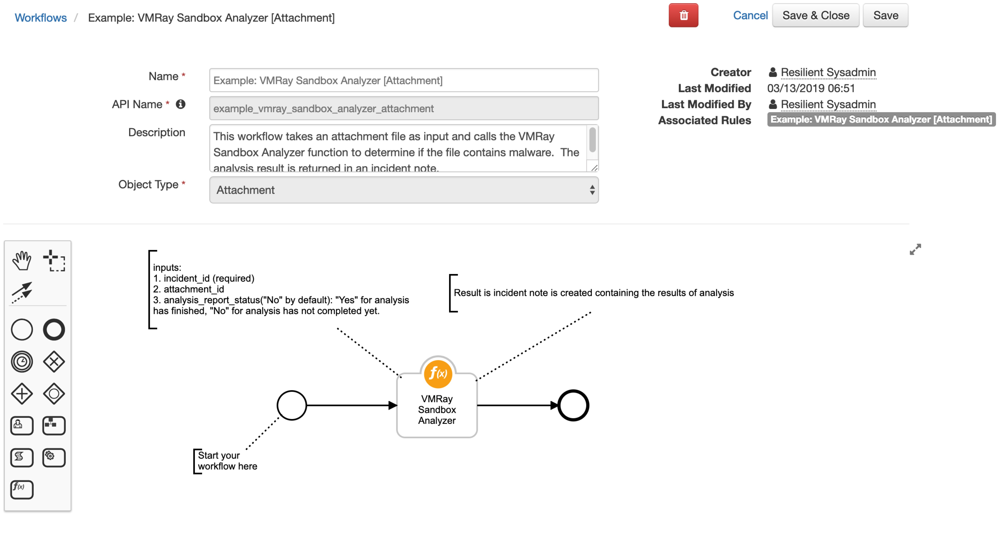
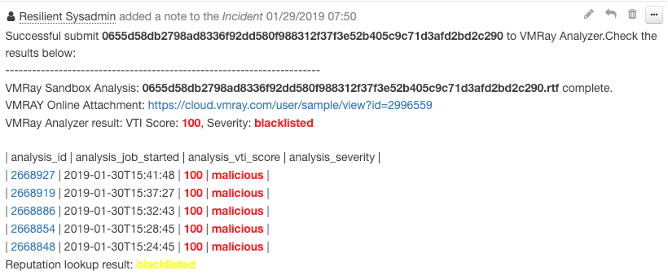
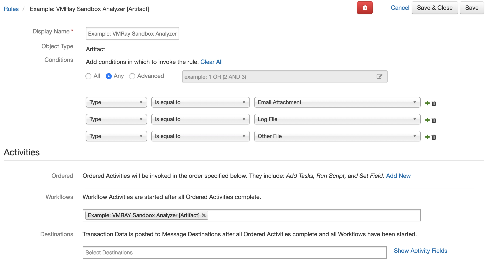
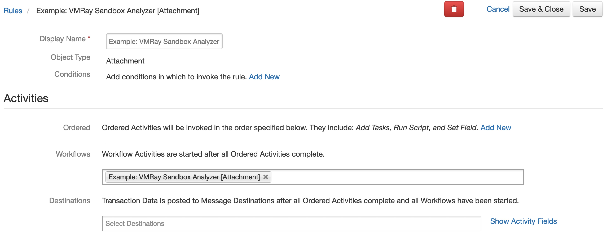

# VMRay Sandbox Analyzer Function for IBM Resilient

## Table of Contents
  - [app.config settings](#appconfig-settings)
  - [Function Inputs](#function-inputs)
  - [Function Output](#function-output)
  - [Pre-Process Script](#pre-process-script)
  - [Post-Process Script](#post-process-script)
  - [Rules](#rules)
  
--- 
 
**This package contains a function that executes a VMRay Malware Sandbox Analysis using VMRay Cloud APIs, also included are two example workflows and two example rules that demonstrate how to use this function.**


 

* an attachment or artifact must be a file.
* The report only supports Type of JSON. HTML and PDF are not supported
* Supports a proxy. Just add your proxy details to the `proxy` section in `app.config` file.

## app.config settings:  
---               
```                                                                         
# Your VMRay Analyzer API Key                                                         
vmray_api_key=

# Your VMRay Server URL, using https://cloud.vmray.com if empty.
vmray_analyzer_url=https://cloud.vmray.com
             
# Amount of time in seconds to wait until checking if the report is ready again.
vmray_analyzer_report_request_timeout=60 
```
---                                               

## Function Inputs:

| Function Name | Type | Required | Example  | Info |
| --------- | :---------: | ------------------ | ------| ----|
| `incident_id` | `Number` | Yes | `1001` | The ID of the current Incident|            
| `attachment_id` | `Number` | No | `5` | The ID of the Attachment to be analyzed|
| `artifact_id` | `Number` | No | `6` | The ID of the Artifact to be analyzed 
| `analyzer_report_status` | `Boolean` | Yes | `No` | Has the analysis report generated successfully. Options are: `Yes` or `No` |
---

## Function Output:
```python                                    
results = {
                "analysis_report_status": analysis_report_status,
                "incident_id": incident_id,
                "artifact_id": artifact_id,
                "attachment_id": attachment_id,
                "sample_final_result": sample_final_result
            }

```
---

## Pre-Process Script:
Example: VMRAY Sandbox Analyzer [Attachment]

```
inputs.incident_id = incident.id
inputs.attachment_id = attatchment.id
```
Example: VMRAY Sandbox Analyzer [Artifact]

```
inputs.incident_id = incident.id
inputs.artifact_id = artifact.id
```

---

## Post-Process Script:
This example adds a Note to the Incident and color codes the `analysis_status` depending if it was **malicious** or **clean**

```
def  font_color(vti_score,sample_severity):
  color = "green"
  try:
    if sample_severity in ["malicious"] or int(vti_score) >= 75:
      color = "red"
    elif sample_severity in ["blacklisted","suspicious"] or int(vti_score) >= 50:
      color = "yellow"
  except:
      pass
  return color

if not results.analysis_report_status:
 noteText = u"""Successful submit <b>{}</b> to VMRay Cloud Analyzer.However it will take time to generate an analysis report, please submit it again later. <br>""".format(attachment.name)
 
else:
 noteText = u"""Successful submit <b>{}</b> to VMRay Analyzer.Check the results below: <br>""".format(attachment.name)
 
 for sample in results.sample_final_result:
   noteText += u"""-----------------------------------------------------------------------"""
   color = font_color(sample["sample_report"]["sample_score"],sample["sample_report"]["sample_last_reputation_severity"])
   noteText += u"""<br>VMRay Sandbox Analysis: <b>{sample_filename}</b> complete.<br>
                   VMRAY Online Attachment: <a href={sample_online_report}>{sample_online_report}</a><br>
                   VMRay Analyzer result:  VTI Score: <b style= "color:{color}">{sample_vti_score}</b>,  Severity: <b style= "color:{color}">{sample_severity}</b> <br>
               """.format(sample_filename=sample["sample_report"]["sample_filename"],
                           sample_online_report=sample["sample_report"]["sample_webif_url"],
                           color = color,
                           sample_vti_score = sample["sample_report"]["sample_score"],
                           sample_severity = sample["sample_report"]["sample_last_reputation_severity"])
 
   noteText += u"""<br>| analysis_id | analysis_job_started | analysis_vti_score | analysis_severity |<br>"""
   
   for analysis in sample["sample_analysis_report"]:
     color = font_color(analysis["analysis_vti_score"],analysis["analysis_severity"])
     noteText += u"""| <a href={analysis_link}>  {analysis_id} </a> | {analysis_job_started} |  <b style= "color:{color}"> {analysis_vti_score}</b>  | <b style= "color:{color}">{analysis_severity}</b> |<br>
                 """.format(analysis_link=analysis["analysis_webif_url"],
                           analysis_id=analysis["analysis_id"],
                           analysis_job_started=analysis["analysis_job_started"],
                           analysis_vti_score=analysis["analysis_vti_score"],
                           analysis_severity=analysis["analysis_severity"],
                           color=color)
 
   reputations = [str(reputation["reputation_lookup_severity"]) for reputation in sample["sample_reputation_report"]]
   
   if "malicious" in reputations:
     color = "red"
     reputation_lookup_severity = "malicious"
   elif "suspicious" in reputations:
     color = "yellow"
     reputation_lookup_severity = "suspicious"
   elif "blacklisted" in reputations:
     color = "yellow"
     reputation_lookup_severity = "blacklisted"
   elif "not_suspicious" in reputations:
     color = "green"
     reputation_lookup_severity = "not_suspicious"
   elif "whitelisted" in reputations:
     color = "green"
     reputation_lookup_severity = "whitelisted"
   else:
     color = "green"
     reputation_lookup_severity = "unknown"
     
   noteText += u"""Reputation lookup result:  <b style= "color:{color}">{reputation_lookup_severity} </b> <br>""".format(color=color, reputation_lookup_severity=reputation_lookup_severity)
   
incident.addNote(helper.createRichText(noteText))
```

<b>Example of adding a incident note from post-processing scripts:</b><br>
 
---

## Rules
| Rule Name | Object Type | Workflow Triggered |
| --------- | :---------: | ------------------ |
| Example: VMRay Sandbox Analysis [Artifact]| `Artifact` | `Example: VMRay Sandbox Analyzer [Artifact]` |



---
| Rule Name | Object Type | Workflow Triggered |
| --------- | :---------: | ------------------ |
| Example: VMRay Sandbox Analyzer [Attachment]| `Attachment` | `Example: VMRay Sandbox Analyzer [Attachment]` |





---
                                                                               