<!--
  This README.md is generated by running:
  "resilient-sdk docgen -p fn_vmware_cbc"

  This file was generated with resilient-sdk v52.0.0.0.927

  It is best edited using a Text Editor with a Markdown Previewer. VS Code
  is a good example. Checkout https://guides.github.com/features/mastering-markdown/
  for tips on writing with Markdown

  All fields followed by "::CHANGE_ME::"" should be manually edited

  If you make manual edits and run docgen again, a .bak file will be created

  Store any screenshots in the "doc/screenshots" directory and reference them like:
  

  NOTE: If your app is available in the container-format only, there is no need to mention the integration server in this readme.
-->

# VMware Carbon Black Cloud


## Table of Contents
- [VMware Carbon Black Cloud](#vmware-carbon-black-cloud)
  - [Table of Contents](#table-of-contents)
  - [Release Notes](#release-notes)
  - [Overview](#overview)
    - [Key Features](#key-features)
  - [Requirements](#requirements)
    - [SOAR platform](#soar-platform)
    - [Cloud Pak for Security](#cloud-pak-for-security)
    - [Proxy Server](#proxy-server)
    - [Python Environment](#python-environment)
    - [VMware Carbon Black Cloud Development Version](#vmware-carbon-black-cloud-development-version)
      - [Prerequisites](#prerequisites)
      - [Permissions](#permissions)
  - [](#)
  - [Installation](#installation)
    - [Install](#install)
    - [App Configuration](#app-configuration)
    - [Custom Layouts](#custom-layouts)
    - [Poller Considerations](#poller-considerations)
      - [Poller Templates for SOAR Cases](#poller-templates-for-soar-cases)
    - [Alert Filtering](#alert-filtering)
  - [Similar to alert search "criteria", a search alert "exclusions" filter can be specified for each polling\_filter\_criteria\_(1,2,3).](#similar-to-alert-search-criteria-a-search-alert-exclusions-filter-can-be-specified-for-each-polling_filter_criteria_123)
  - [Function - VMware CBC: Get Alert By ID](#function---vmware-cbc-get-alert-by-id)
  - [Function - VMware CBC: Get CBC Notes](#function---vmware-cbc-get-cbc-notes)
  - [Function - VMware CBC: Get Device By ID](#function---vmware-cbc-get-device-by-id)
  - [Function - VMware CBC: Post Alert Workflow Data](#function---vmware-cbc-post-alert-workflow-data)
  - [Function - VMware CBC: Post Device Action](#function---vmware-cbc-post-device-action)
  - [Function - VMware CBC: Post Note to CBC Alert](#function---vmware-cbc-post-note-to-cbc-alert)
  - [Function - VMware CBC: Post Observations Detail Job](#function---vmware-cbc-post-observations-detail-job)
  - [Function - VMware CBC: Post Reputation Override](#function---vmware-cbc-post-reputation-override)
  - [Function - VMware CBC: Post Tags](#function---vmware-cbc-post-tags)
  - [Function - VMware: CBC Kill Process](#function---vmware-cbc-kill-process)
  - [Script - Convert JSON to rich text v1.3](#script---convert-json-to-rich-text-v13)
  - [Script - VMware CBC: Populate CBC Device Row from Alert](#script---vmware-cbc-populate-cbc-device-row-from-alert)
  - [Script - VMware CBC: Populate CBC Device Row from Device](#script---vmware-cbc-populate-cbc-device-row-from-device)
  - [Script - VMware CBC: Populate Observations Data Table](#script---vmware-cbc-populate-observations-data-table)
  - [Playbooks](#playbooks)
  - [Custom Layouts](#custom-layouts-1)
  - [Data Table - CBC Device](#data-table---cbc-device)
      - [API Name:](#api-name)
      - [Columns:](#columns)
  - [Data Table - Observations](#data-table---observations)
      - [API Name:](#api-name-1)
      - [Columns:](#columns-1)
  - [Data Table - Processes](#data-table---processes)
      - [API Name:](#api-name-2)
      - [Columns:](#columns-2)
  - [Custom Fields](#custom-fields)
  - [Templates for SOAR Cases](#templates-for-soar-cases)
    - [soar\_create\_case.jinja](#soar_create_casejinja)
    - [soar\_close\_case.jinja](#soar_close_casejinja)
    - [soar\_update\_case.jinja](#soar_update_casejinja)
  - [Troubleshooting \& Support](#troubleshooting--support)
    - [For Support](#for-support)

---

## Release Notes
<!--
  Specify all changes in this release. Do not remove the release
  notes of a previous release
-->
| Version | Date | Notes |
| ------- | ---- | ----- |
| 1.0.0 | 06/2024 | Initial Release |

---

## Overview
<!--
  Provide a high-level description of the function itself and its remote software or application.
  The text below is parsed from the "description" and "long_description" attributes in the setup.py file
-->
**IBM SOAR app bidirectional synchronization and functions for VMware Carbon Black Cloud**

 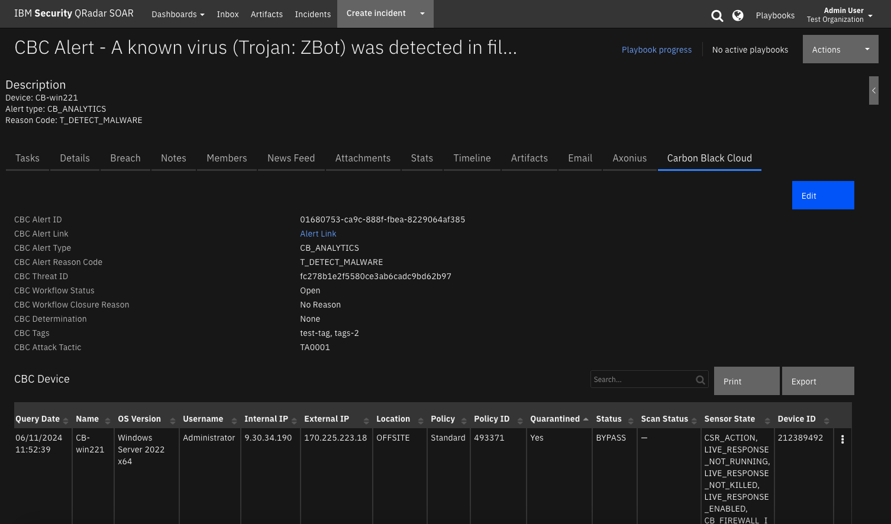

Provide bidirectional synchronization and functions for VMware Carbon Black Cloud<br>

### Key Features
<!--
  List the Key Features of the Integration
-->
* Poll Carbon Black Cloud alerts and create and update the corresponding cases in SOAR
* Set the Carbon Black Cloud alert workflow information (determination, status, closure reason) from the corresponding case in SOAR
* Create artifacts from an alert in the corresponding case in SOAR
* Synchronize notes between Carbon Black Cloud alert and corresponding SOAR case
* View alert device details in the CBC Device data table
* View alert proceses details in the Processes data table
* Perform the following remediation task from the CBC Device data table:
    * Quarantine ON/OFF
    * Bypass ON/OFF
    * Background Scan ON/OFF
* Post tags on the alert from SOAR
* Write the alert and device full JSON data from Carbon Black Cloud to a note in SOAR
* Kill a running process on the device from the Processes data table
* Override the reputation of an application to approve or ban it for an organization from the Processes data table or a SHA256 artifact
* Get alert observations from Carbon Black Cloud and write the JSON to a note in SOAR 

---

## Requirements
<!--
  List any Requirements
-->
This app supports the IBM Security QRadar SOAR Platform and the IBM Security QRadar SOAR for IBM Cloud Pak for Security.

### SOAR platform
The SOAR platform supports two app deployment mechanisms, Edge Gateway (also known as App Host) and integration server.

If deploying to a SOAR platform with an App Host, the requirements are:
* SOAR platform >= `50.0.9097`.
* The app is in a container-based format (available from the AppExchange as a `zip` file).

If deploying to a SOAR platform with an integration server, the requirements are:
* SOAR platform >= `50.0.9097`.
* The app is in the older integration format (available from the AppExchange as a `zip` file which contains a `tar.gz` file).
* Integration server is running `resilient-circuits>=51.0.1.1.0`.
* If using an API key account, make sure the account provides the following minimum permissions:
  | Name | Permissions |
  | ---- | ----------- |
  | Org Data | Read |
  | Function | Read |
  | Incidents | Read, Create |
  | Edit Incidents | Fields, Status |
  | Layouts | Read, Edit |

The following SOAR platform guides provide additional information:
* _Edge Gateway Deployment Guide_ or _App Host Deployment Guide_: provides installation, configuration, and troubleshooting information, including proxy server settings.
* _Integration Server Guide_: provides installation, configuration, and troubleshooting information, including proxy server settings.
* _System Administrator Guide_: provides the procedure to install, configure and deploy apps.

The above guides are available on the IBM Documentation website at [ibm.biz/soar-docs](https://ibm.biz/soar-docs). On this web page, select your SOAR platform version. On the follow-on page, you can find the _Edge Gateway Deployment Guide_, _App Host Deployment Guide_, or _Integration Server Guide_ by expanding **Apps** in the Table of Contents pane. The System Administrator Guide is available by expanding **System Administrator**.

### Cloud Pak for Security
If you are deploying to IBM Cloud Pak for Security, the requirements are:
* IBM Cloud Pak for Security >= `1.10.15`.
* Cloud Pak is configured with an Edge Gateway.
* The app is in a container-based format (available from the AppExchange as a `zip` file).

The following Cloud Pak guides provide additional information:
* _Edge Gateway Deployment Guide_ or _App Host Deployment Guide_: provides installation, configuration, and troubleshooting information, including proxy server settings. From the Table of Contents, select Case Management and Orchestration & Automation > **Orchestration and Automation Apps**.
* _System Administrator Guide_: provides information to install, configure, and deploy apps. From the IBM Cloud Pak for Security IBM Documentation table of contents, select Case Management and Orchestration & Automation > **System administrator**.

These guides are available on the IBM Documentation website at [ibm.biz/cp4s-docs](https://ibm.biz/cp4s-docs). From this web page, select your IBM Cloud Pak for Security version. From the version-specific IBM Documentation page, select Case Management and Orchestration & Automation.

### Proxy Server
The app **does** support a proxy server.

### Python Environment
Python 3.9 and 3.11 are officially supported. When deployed as an app, the app runs on Python 3.11.
Additional package dependencies may exist for each of these packages:
* resilient-circuits>=51.0.1.1.0

### VMware Carbon Black Cloud Development Version

This app has been implemented using:
| Product Name | Product Version | API URL | API Version |
| ------------ | --------------- | ------- | ----------- |
| VMware Carbon Black Cloud | NA | Alerts | v7 |
| VMware Carbon Black Cloud | NA | Devices | v6 |
| VMware Carbon Black Cloud | NA | Observations | v2 |
| VMware Carbon Black Cloud | NA | Job Service | v1 |
| VMware Carbon Black Cloud | NA | Live Response | v6 |
#### Prerequisites
<!--
List any prerequisites that are needed to use with this endpoint solution. Remove any section that is unnecessary.
-->
* A Carbon Black Cloud account with and API key and secret.


#### Permissions
<!--
List any user permissions that are needed to use this endpoint. For example, list the API key permissions.
-->
The following Carbon Black Cloud Access Level API Key Permissions must be granted to run this SOAR app:

  | Name | Permissions |
  | ---- | ----------- |
  | org.alerts.tags | CREATE, READ, DELETE |
  | org.xdr.metadata| READ |
  | org.alerts.notes | CREATE, READ, UPDATE, DELETE |
  | org.alerts | READ |
  | org.alerts.close | EXECUTE |
  | org.mdr.threathunts | READ |
  | org.reputations | CREATE |
  | org.liveresponse.session | CREATE, READ, DELETE |
  | org.liveresponse.process | READ, DELETE, EXECUTE |
  | org.search.events | READ, CREATE |
  | device | READ |
  | device.quarantine | EXECUTE |
  | device.bypass | EXECUTE |
  | device.bg-scan | EXECUTE |
  | jobs.status | READ |
  
---
<p>
Create a custom access levels by going to Settings->API Access and selecting the Access Levels tab and hit the Add Access Level.  Edit the Access Level as shown below.  Then create an API key/secret with the created custom access level.

 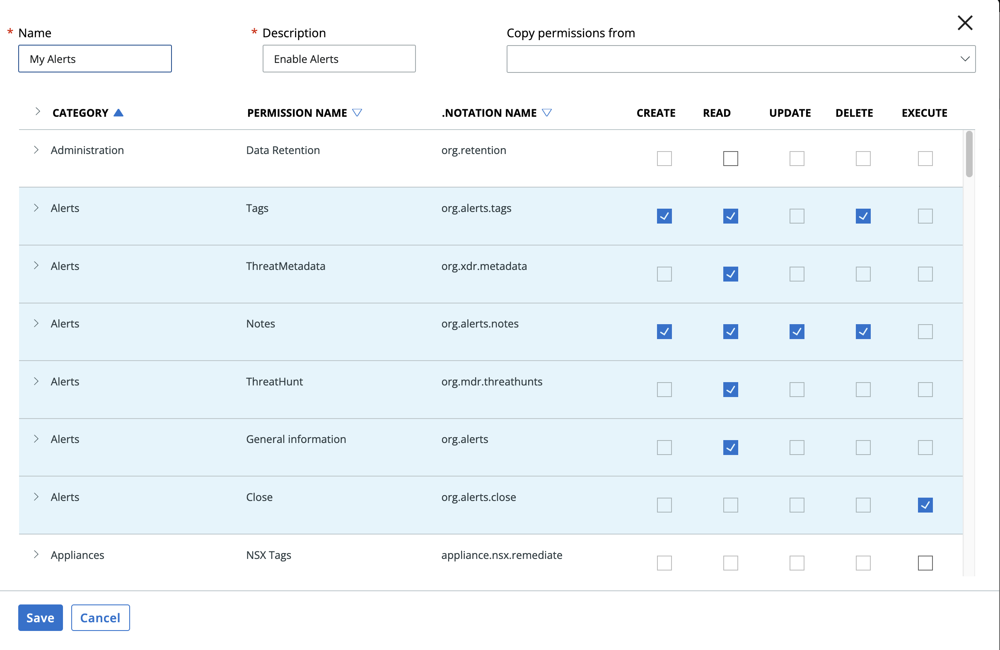

 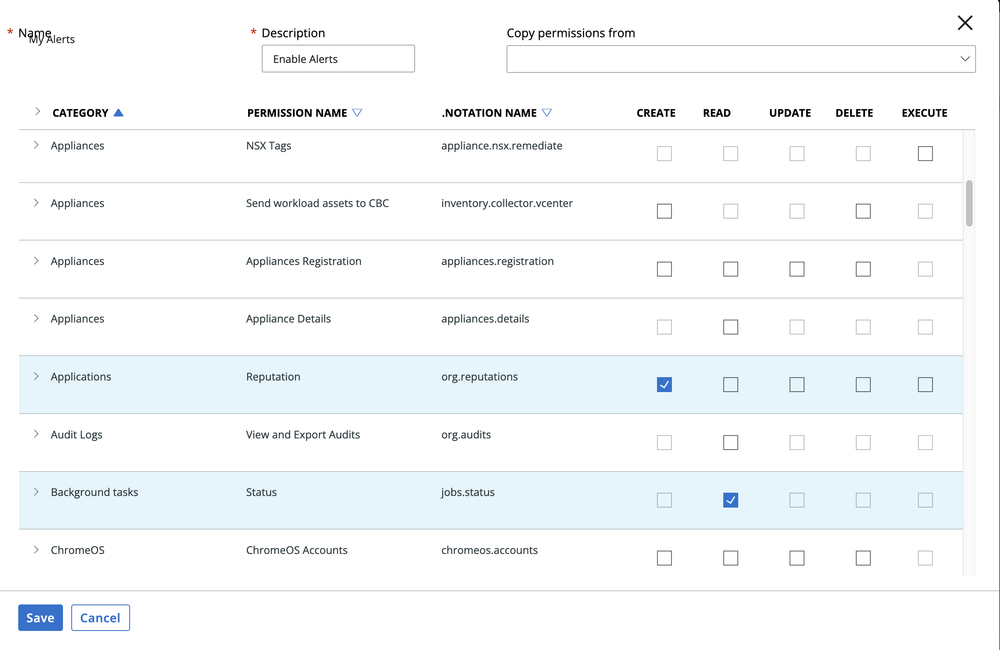
 
 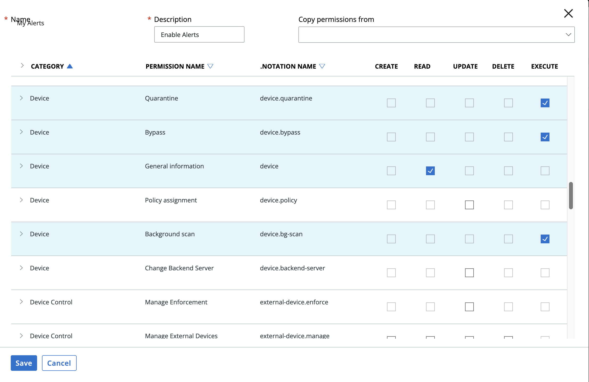

 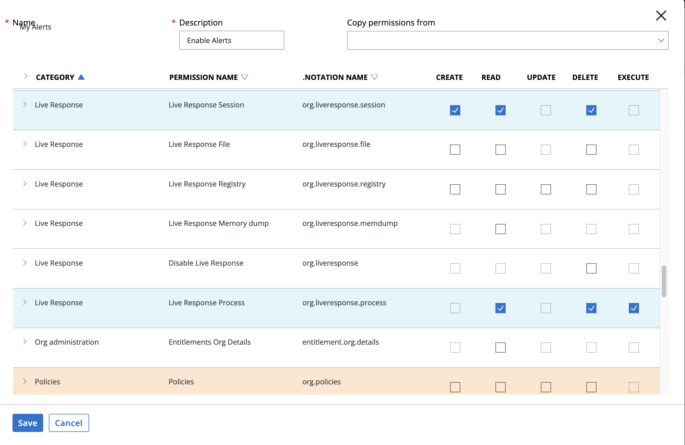

 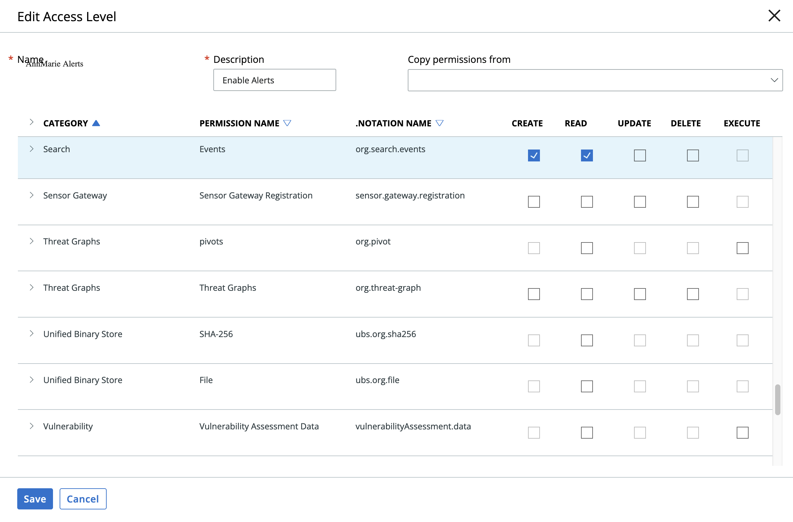
---

## Installation

### Install
* To install or uninstall an App or Integration on the _SOAR platform_, see the documentation at [ibm.biz/soar-docs](https://ibm.biz/soar-docs).
* To install or uninstall an App on _IBM Cloud Pak for Security_, see the documentation at [ibm.biz/cp4s-docs](https://ibm.biz/cp4s-docs) and follow the instructions above to navigate to Orchestration and Automation.

### App Configuration
The following table provides the settings you need to configure the app. These settings are made in the app.config file. See the documentation discussed in the Requirements section for the procedure.

| Config | Required | Example | Description |
| ------ | :------: | ------- | ----------- |
| **api_id** | Yes | `xxx` | *VMware Carbon Black Cloud API ID.* |
| **api_secret** | Yes | `xxx` | *VMware Carbon Black Cloud API secret.* |
| **hostname** | Yes | `https://xxx` | *VMware Carbon Black Cloud host name.*|
| **org_key** | Yes | `xxx` | *VMware Carbon Black Cloud organization key.* |
| **polling_filters_criteria_1** | No | `("minimum_severity",3),("workflow_status",["OPEN","IN_PROGRESS","CLOSED"])` | *First polling filter.* |
| **polling_filters_criteria_2** | No | `("minimum_severity",4),("workflow_status",["OPEN","IN_PROGRESS","CLOSED"])` | *Second polling filter.*|
| **polling_filters_criteria_3** | No | `("minimum_severity",1),("workflow_status",["OPEN","IN_PROGRESS","CLOSED"])` | *Third polling filter. |
| **polling_interval** | Yes | `60` | *Poller interval time in seconds. Value of zero turns poller off.* |
| **polling_lookback** | Yes | `230400` | *Number of minutes to lookback for queries the first time the poller runs.* |
| **soar_create_case_template** | No | `/var/rescircuits/create_case.jinja` | *Path to override template for automatic case creation. See [Poller Considerations](#poller-considerations).* |
| **soar_update_case_template** | No | `/var/rescircuits/update_case.jinja` | *Path to override template for automatic case updating. See [Poller Considerations](#poller-considerations).* |
| **soar_close_case_template** | No | `/var/rescircuits/close_case.jinja` | *Path to override template for automatic case closing. See [Poller Considerations](#poller-considerations).* |

 ---
---
### Custom Layouts

The app automatically creates a custom `Carbon Black Cloud` tab on first run after installation:

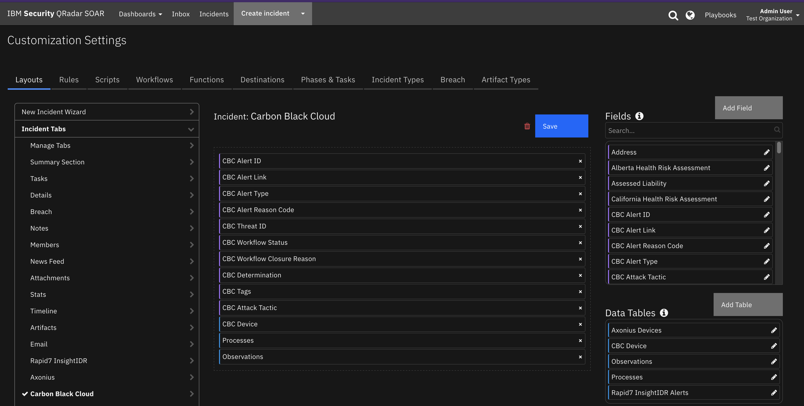


### Poller Considerations
The poller is just one way to escalate Carbon Black Cloud alerts to SOAR cases. It's also possible to send Carbon Black Cloud alert information to another SIEM, such as IBM QRadar, which would then correlate cases into Offenses. With the QRadar Plugin for SOAR, offenses can then be escalated to SOAR cases. As long as the Carbon Black Cloud alert is preserved in the custom case field `vmware_cbc_alert_id`, then all the remaining details about the case synchronize to the SOAR case. In the case of the QRadar Plugin for SOAR, you would modify the escalation templates to reference this custom field with the VMware Carbon Black Cloud Alert ID.

When using another source of Carbon Black Cloud alert escalation to IBM SOAR, disable the poller by changing the app.config setting to `poller_interval=0`.

#### Poller Templates for SOAR Cases
It may be necessary to modify the templates used to create, update, or close SOAR cases based on your required custom fields in SOAR.

This is especially relevant if you have required custom `close` fields that need to be filled when closing a case in SOAR. If that is the case, be sure to implement a custom `close_case_template` and reference those required close fields in the template.

When overriding the template in App Host, specify the file path for each file as `/var/rescircuits`.

Below are the default templates used which can be copied, modified, and used with app_config's
`soar_create_case_template`, `soar_update_case_template`, and `soar_close_case_template` settings to override the default templates.

### Alert Filtering
To limit the number of alerts escalated to SOAR, consider using the optional `polling_filters` parameter in the app configuration file. Each filter is a tuple in the following format: ("field","values"),
Where:
* "field" is the Carbon Black Cloud alert field to be queried
* "values" is a comma separated string of values to include in the query results returned
<p>
If more than one filter is needed, separate each tuple with a comma.
<p>
Denote lists enclosed in square brackets [].
<p>
NOTE: See Carbon Black Cloud documentation here 

[Carbon Black Alert Search Fields](https://developer.carbonblack.com/reference/carbon-black-cloud/platform/latest/alert-search-fields) for all possible searchable alert fields.

<p>
Here are 3 polling filter criteria examples that add or update CBC alerts in SOAR 

`polling_filters_criteria_1 = ("group_results",False),("minimum_severity",4),("target_value",["LOW","MEDIUM"]),("alert_type",["CB_ANALYTICS","WATCHLIST"]),("workflow_status",["OPEN","IN_PROGRESS","CLOSED"])`

`polling_filters_criteria_2 = ("group_results",False),("minimum_severity",1),("target_value",["LOW","MEDIUM","HIGH","MISSION_CRITICAL"]),("alert_type",["CB_ANALYTICS"]),("reputation",["KNOWN_MALWARE","PUP","SUSPECT_MALWARE","COMPANY_BLACK_LIST"]),("workflow_status",["OPEN","IN_PROGRESS","CLOSED"])`

`polling_filters_criteria_3 = ("group_results",False),("minimum_severity",1),("target_value",["LOW","MEDIUM","HIGH","MISSION_CRITICAL"]),("alert_type",["CB_ANALYTICS"]),("reason_code",["T_DETECT_SUSPECT","T_RUN_MALWARE","T_REP_VIRUS","T_RUN_VIRUS"]),("workflow_status",["OPEN","IN_PROGRESS","CLOSED"])`


**NOTE:** Each individual polling filter is first constructed by joining together the field and the desired values using OR statements. Each individual filter is then combined using AND.  In the example above, only alerts with target_value LOW,MEDIUM, HIGH, MISSION_CRITICAL AND those with workflow statuses OPEN, IN_PROGRESS,or CLOSED are pulled into SOAR as cases. 

Similar to alert search "criteria", a search alert "exclusions" filter can be specified for each polling_filter_criteria_(1,2,3).
 ---

## Function - VMware CBC: Get Alert By ID
Get the alert JSON from VMware Carbon Black Cloud by alert ID.

 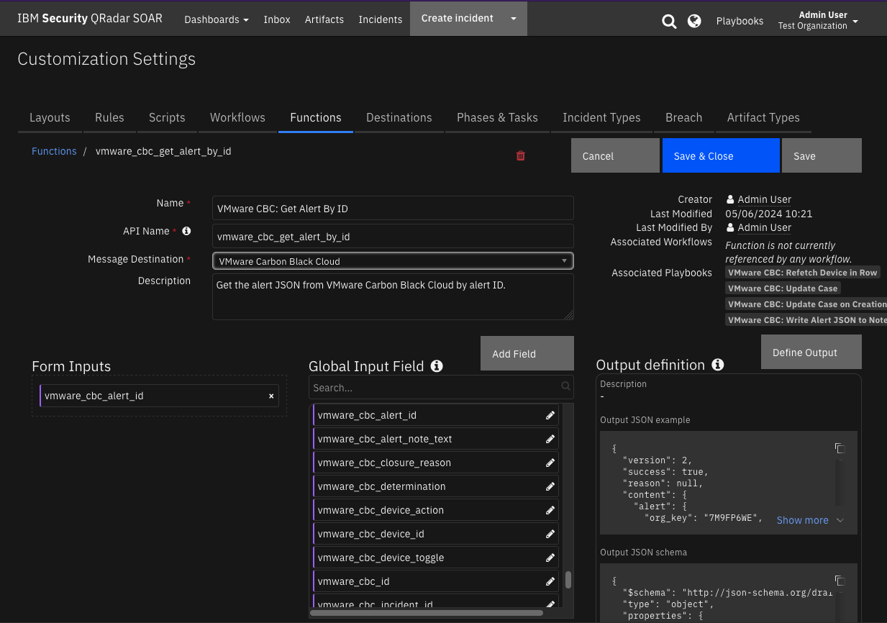

<details><summary>Inputs:</summary>
<p>

| Name | Type | Required | Example | Tooltip |
| ---- | :--: | :------: | ------- | ------- |
| `vmware_cbc_alert_id` | `text` | Yes | `-` | - |

</p>
</details>

<details><summary>Outputs:</summary>
<p>

> **NOTE:** This example might be in JSON format, but `results` is a Python Dictionary on the SOAR platform.

```python
results = {
  "content": {
    "alert": {
      "alert_notes_present": false,
      "alert_url": "my-cbc.net/alerts?s[c][query_string]=id:0730b7bc-7d51-9d64-68b1-d3e01d28a716\u0026orgKey=XXXXYYYY",
      "asset_group": [],
      "attack_tactic": "TA0001",
      "backend_timestamp": "2024-04-18T17:16:50.606Z",
      "backend_update_timestamp": "2024-04-18T17:17:48.151Z",
      "childproc_cmdline": "",
      "childproc_guid": "",
      "childproc_username": "",
      "detection_timestamp": "2024-04-18T17:15:47.419Z",
      "determination": {
        "change_timestamp": "2024-04-18T17:16:50.606Z",
        "changed_by": "ALERT_CREATION",
        "changed_by_type": "SYSTEM",
        "value": "NONE"
      },
      "device_external_ip": "170.225.223.20",
      "device_id": 206046519,
      "device_internal_ip": "9.30.87.128",
      "device_location": "OFFSITE",
      "device_name": "winserver221",
      "device_os": "WINDOWS",
      "device_os_version": "Windows Server 2022 x64",
      "device_policy": "Standard",
      "device_policy_id": 493371,
      "device_target_value": "MEDIUM",
      "device_uem_id": "",
      "device_username": "Administrator",
      "first_event_timestamp": "2024-04-18T17:15:45.021Z",
      "id": "0730b7bc-7d51-9d64-68b1-d3e01d28a716",
      "is_updated": true,
      "last_event_timestamp": "2024-04-18T17:15:45.398Z",
      "mdr_alert": false,
      "mdr_alert_notes_present": false,
      "mdr_threat_notes_present": false,
      "org_key": "7M9FP6WE",
      "parent_cmdline": "",
      "parent_effective_reputation": "TRUSTED_WHITE_LIST",
      "parent_guid": "7M9FP6WE-0c480537-00000344-00000000-1da8f6c97aa305d",
      "parent_md5": "",
      "parent_name": "c:\\windows\\system32\\services.exe",
      "parent_pid": 836,
      "parent_reputation": "TRUSTED_WHITE_LIST",
      "parent_sha256": "854780206e7abbf5a4*******5075881e4e914c7b44bea45fac1677781096",
      "parent_username": "NT AUTHORITY\\SYSTEM",
      "policy_applied": "APPLIED",
      "primary_event_id": "6f09730*******eb0bd491bae9facb0",
      "process_cmdline": "\"C:\\Program Files\\Confer\\RepMgr.exe\"",
      "process_effective_reputation": "IGNORE",
      "process_guid": "7M9FP6WE-0c480537-000008e8-00000000-1da8f6c9a23e47a",
      "process_issuer": [
        "Sectigo RSA Code Signing CA 2"
      ],
      "process_md5": "8a87acebc21e2cc5eeb24af602b32b30",
      "process_name": "c:\\program files\\confer\\repmgr.exe",
      "process_pid": 2280,
      "process_publisher": [
        "Carbon Black, Inc."
      ],
      "process_reputation": "TRUSTED_WHITE_LIST",
      "process_sha256": "f6ec44f025c67ab18170da47c1c610a94a9c84741f3cdfceb20cee565579868a",
      "process_username": "NT AUTHORITY\\SYSTEM",
      "reason": "A file (340s.exe) with a reputation of known malware was found on disk.",
      "reason_code": "T_DETECT_MALWARE",
      "run_state": "RAN",
      "sensor_action": "ALLOW",
      "severity": 3,
      "tags": null,
      "threat_id": "32120969c*******fd587417e23e1c",
      "threat_notes_present": false,
      "ttps": [
        "DETECTED_MALWARE_APP",
        "UNKNOWN_APP",
        "POLICY_DENY"
      ],
      "type": "CB_ANALYTICS",
      "user_update_timestamp": null,
      "workflow": {
        "change_timestamp": "2024-04-18T17:16:50.606Z",
        "changed_by": "ALERT_CREATION",
        "changed_by_type": "SYSTEM",
        "closure_reason": "NO_REASON",
        "status": "OPEN"
      }
    }
  },
  "inputs": {
    "vmware_cbc_alert_id": "0730b7bc-7d51-9d64-68b1-d3e01d28a716"
  },
  "metrics": {
    "execution_time_ms": 213,
    "host": "myhost",
    "package": "fn-vmware-cbc",
    "package_version": "1.0.0",
    "timestamp": "2024-04-19 10:53:10",
    "version": "1.0"
  },
  "raw": null,
  "reason": null,
  "success": true,
  "version": 2.0
}
```

</p>
</details>

<details><summary>Example Function Input Script:</summary>
<p>

```python
inputs.vmware_cbc_alert_id = incident.properties.vmware_cbc_alert_id
```

</p>
</details>

<details><summary>Example Function Post Process Script:</summary>
<p>

```python
from urllib.parse import quote as url_encode

# Map VMware CBC workflow closure_reason values SOAR resolution id values.
MAPPING_CLOSURE_REASON = {
  "Resolved" : "Resolved",
  "No Reason": "Resolved",
  "Resolved Benign Known Good": "Resolved",
  "Duplicate Cleanup" : "Duplicate",
  "Other": "Resolved"
}

# Map VMware CBC determination values to SOAR resolution id values.
MAPPING_DETERMINATION_ON_CLOSE = {
  "None": "Resolved",
  "False positive": "Not an Issue",
  "True positive": "Resolved"
}

results = playbook.functions.results.get_alert_by_id_results

if not results.success:
    incident.addNote("<b>VMware CBC: Update Case Manual:</b> Write Alert Custom Fields did NOT complete.")
else:
    content = results.get("content", {})
    if content:
        alert = content.get("alert")
        alert_url = alert.get("alert_url", None)
        if alert_url:
          # url encode the bracket characters [] 
          alert_url_urlencoded = alert_url.replace("[", "%5B").replace("]", "%5D")
          incident.properties.vmware_cbc_alert_link = "<a target='_blank' href='https://{0}'>Alert Link</a>".format(alert_url_urlencoded)
        incident.properties.vmware_cbc_alert_type = alert.get("type", None)
        incident.properties.vmware_cbc_alert_reason_code = alert.get("reason_code", None)
        incident.properties.vmware_cbc_threat_id = alert.get("threat_id", None)
        workflow = alert.get("workflow", None) or None
        status = workflow.get("status", None) if workflow.get("status", None) else None
        closure_reason = workflow.get("closure_reason") if workflow.get("closure_reason") else None
        incident.properties.vmware_cbc_workflow_status = status.replace("_", " ").title() if status else None
        incident.properties.vmware_cbc_workflow_closure_reason = closure_reason.replace("_", " ").title() if status else None
        determination = alert.get("determination", None)
        determination_value = determination.get("value") if determination.get("value", None) else None
        incident.properties.vmware_cbc_determination_value = determination_value.replace("_", " ").title() if determination_value else None
        tags = alert.get("tags", None)
        incident.properties.vmware_cbc_tags = ", ".join(tags) if isinstance(tags, list) else None
        incident.properties.vmware_cbc_attack_tactic = alert.get("attack_tactic", None)
        incident.addNote("<b>VMware CBC: Update Case Manual:</b> Write Alert Custom Fields completed.")
        
        if incident.properties.vmware_cbc_workflow_status.lower() == "closed":
            incident.plan_status = "C"
            incident.resolution_id = MAPPING_CLOSURE_REASON.get(incident.properties.vmware_cbc_workflow_closure_reason, "Resolved")
            incident.resolution_summary = "Case {0} Closed in SOAR".format(incident.id)

    else: 
        incident.addNote("<b>VMware CBC: Update Case Manual:</b> Write Alert Custom Fields did NOT complete.")
```

</p>
</details>

---
## Function - VMware CBC: Get CBC Notes
Get the alert or threat notes of the specified Carbon Black Cloud alert or threat id.

 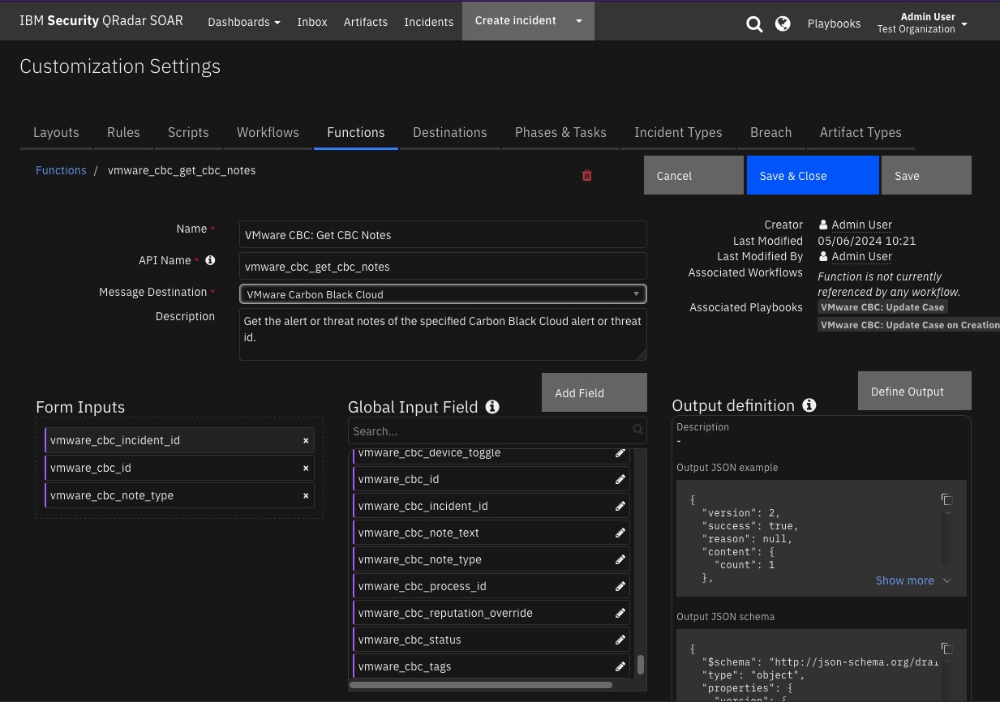

<details><summary>Inputs:</summary>
<p>

| Name | Type | Required | Example | Tooltip |
| ---- | :--: | :------: | ------- | ------- |
| `vmware_cbc_id` | `text` | Yes | `-` | Can be a CBC alert or threat ID |
| `vmware_cbc_incident_id` | `number` | Yes | `-` | - |
| `vmware_cbc_note_type` | `text` | Yes | `-` | - |

</p>
</details>

<details><summary>Outputs:</summary>
<p>

> **NOTE:** This example might be in JSON format, but `results` is a Python Dictionary on the SOAR platform.

```python
results = {
  "content": {
    "count": 1
  },
  "inputs": {
    "vmware_cbc_id": "0730b7bc-7d51-9d64-68b1-d3e01d28a716",
    "vmware_cbc_incident_id": 2186,
    "vmware_cbc_note_type": "alert"
  },
  "metrics": {
    "execution_time_ms": 56753,
    "host": "myapphost.com",
    "package": "fn-vmware-cbc",
    "package_version": "1.0.0",
    "timestamp": "2024-04-24 16:15:57",
    "version": "1.0"
  },
  "raw": null,
  "reason": null,
  "success": true,
  "version": 2.0
}
```

</p>
</details>

<details><summary>Example Function Input Script:</summary>
<p>

```python
inputs.vmware_cbc_id = incident.properties.vmware_cbc_alert_id
inputs.vmware_cbc_incident_id = incident.id
inputs.vmware_cbc_note_type = "alert"
```

</p>
</details>

<details><summary>Example Function Post Process Script:</summary>
<p>

```python
results = playbook.functions.results.get_alert_notes_results


if results.get("success"):
  content = results.get("content")
  if content:
    note_text = "<b>VMware CBC: Get Alert Notes</b> playbook created {0} notes in SOAR".format(content.get("count"))
  else:
    note_text = "<b>VMware CBC: Get Alert Notes</b> function failed to get notes from Carbon Black Cloud"
else:
  note_text = "<b>VMware CBC: Get Alert Notes</b> function failed to get notes from Carbon Black Cloud"
  
incident.addNote(note_text)
```

</p>
</details>

---
## Function - VMware CBC: Get Device By ID
Get the device information from Carbon Black Cloud by the specified device ID.

 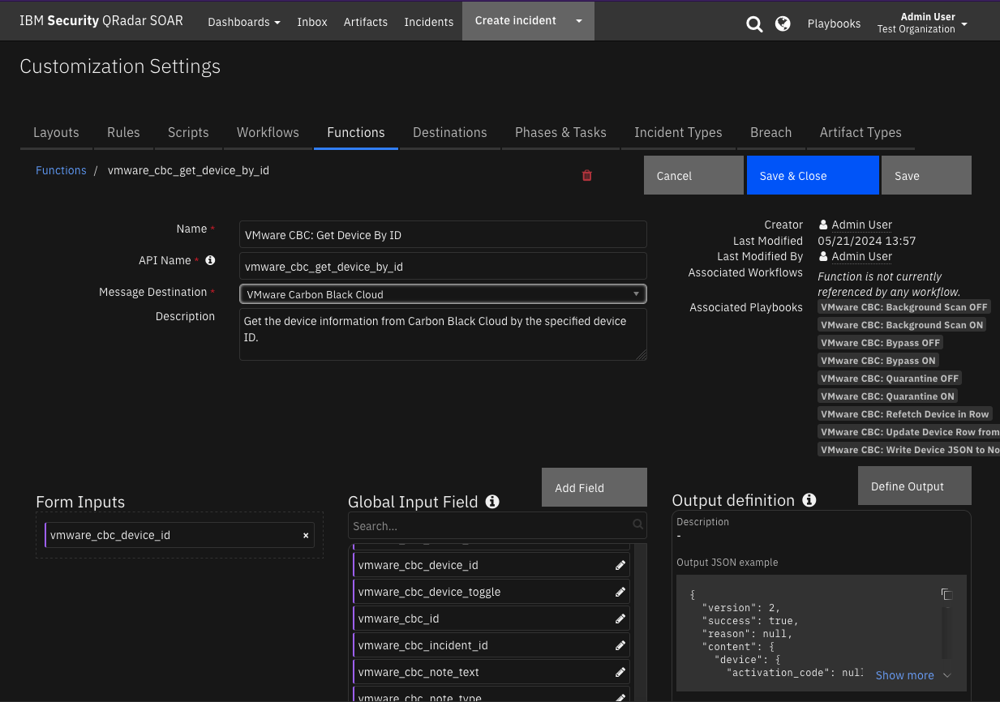

<details><summary>Inputs:</summary>
<p>

| Name | Type | Required | Example | Tooltip |
| ---- | :--: | :------: | ------- | ------- |
| `vmware_cbc_device_id` | `text` | Yes | `-` | - |

</p>
</details>

<details><summary>Outputs:</summary>
<p>

> **NOTE:** This example might be in JSON format, but `results` is a Python Dictionary on the SOAR platform.

```python
results = {
  "content": {
    "device": {
      "activation_code": null,
      "activation_code_expiry_time": "2024-04-22T19:31:18.358Z",
      "ad_group_id": 0,
      "appliance_name": null,
      "appliance_uuid": null,
      "asset_group": [],
      "auto_scaling_group_name": null,
      "av_ave_version": null,
      "av_engine": null,
      "av_last_scan_time": null,
      "av_master": false,
      "av_pack_version": null,
      "av_product_version": null,
      "av_status": [
        "AV_ACTIVE",
        "ONDEMAND_SCAN_DISABLED"
      ],
      "av_update_servers": null,
      "av_vdf_version": null,
      "base_device": null,
      "cloud_provider_account_id": null,
      "cloud_provider_resource_id": null,
      "cloud_provider_tags": [],
      "cluster_name": null,
      "compliance_status": "NOT_ASSESSED",
      "current_sensor_policy_name": "Standard",
      "datacenter_name": null,
      "deployment_type": "ENDPOINT",
      "deregistered_time": null,
      "device_meta_data_item_list": [
        {
          "key_name": "OS_MAJOR_VERSION",
          "key_value": "Windows 11",
          "position": 0
        },
        {
          "key_name": "SUBNET",
          "key_value": "9.30.43.0",
          "position": 0
        }
      ],
      "device_owner_id": 16421859,
      "email": "Administrator",
      "esx_host_name": null,
      "esx_host_uuid": null,
      "first_name": null,
      "golden_device": null,
      "golden_device_id": null,
      "id": 210476652,
      "infrastructure_provider": "NONE",
      "last_contact_time": "2024-05-10T17:31:19.521Z",
      "last_device_policy_changed_time": null,
      "last_device_policy_requested_time": "2024-05-10T17:06:42.474Z",
      "last_external_ip_address": "70.25.23.23",
      "last_internal_ip_address": "9.35.43.10",
      "last_location": "OFFSITE",
      "last_name": null,
      "last_policy_updated_time": "2023-12-13T07:03:23.711Z",
      "last_reported_time": "2024-05-10T17:11:52.177Z",
      "last_reset_time": null,
      "last_shutdown_time": "2024-05-10T17:06:03.515Z",
      "login_user_name": "WINSERVER2022\\Administrator",
      "mac_address": "00000a0b67eb",
      "middle_name": null,
      "name": "winserver2022",
      "nsx_distributed_firewall_policy": null,
      "nsx_enabled": null,
      "organization_id": 72676,
      "organization_name": "myorg.com",
      "os": "WINDOWS",
      "os_version": "Windows Server 2022 x64",
      "passive_mode": false,
      "policy_id": 493371,
      "policy_name": "Standard",
      "policy_override": false,
      "quarantined": false,
      "registered_time": "2024-05-10T16:59:59.563Z",
      "scan_last_action_time": null,
      "scan_last_complete_time": null,
      "scan_status": null,
      "sensor_gateway_url": null,
      "sensor_gateway_uuid": null,
      "sensor_kit_type": "WINDOWS",
      "sensor_out_of_date": false,
      "sensor_pending_update": false,
      "sensor_states": [
        "ACTIVE",
        "LIVE_RESPONSE_NOT_RUNNING",
        "LIVE_RESPONSE_NOT_KILLED",
        "LIVE_RESPONSE_DISABLED",
        "CB_FIREWALL_INACTIVE"
      ],
      "sensor_version": "4.0.1.1428",
      "status": "REGISTERED",
      "target_priority": "MEDIUM",
      "uninstall_code": "XXXX",
      "vcenter_host_url": null,
      "vcenter_name": null,
      "vcenter_uuid": null,
      "vdi_base_device": null,
      "vdi_provider": "NONE",
      "virtual_machine": false,
      "virtual_private_cloud_id": null,
      "virtualization_provider": "OTHER",
      "vm_ip": null,
      "vm_name": null,
      "vm_uuid": null,
      "vulnerability_score": 8.8,
      "vulnerability_severity": "IMPORTANT",
      "windows_platform": null
    }
  },
  "inputs": {
    "vmware_cbc_device_id": "210476652"
  },
  "metrics": {
    "execution_time_ms": 15881,
    "host": "my.app.host",
    "package": "fn-vmware-cbc",
    "package_version": "1.0.0",
    "timestamp": "2024-05-10 13:34:09",
    "version": "1.0"
  },
  "raw": null,
  "reason": null,
  "success": true,
  "version": 2.0
}
```

</p>
</details>

<details><summary>Example Function Input Script:</summary>
<p>

```python
inputs.vmware_cbc_device_id = row.cbc_device_id
```

</p>
</details>

<details><summary>Example Function Post Process Script:</summary>
<p>

```python
results = playbook.functions.results.get_device_by_id_results

if results.get("success", False):
  content = results.get("content", {})
  if content:
    device = content.get("device", None)
    if device:
      row.cbc_device_quarantined = device.get("quarantined", None)
      row.cbc_device_status = device.get("status", None)
      sensor_states =  device.get("sensor_states", None) 
      row.cbc_sensor_state = ", ".join(sensor_states) if isinstance(sensor_states, list) else None
      note_text = f"<b>VMware CBC: Populate Device Row from Device:</b> Update complete."
    else:
      note_text = f"<b>VMware CBC: Populate Device Row from Device:</b> Unable to get device data to update CBC Device data table."
  else:
    note_text = f"<b>VMware CBC: Populate Device Row from Device:</b> Unable to get device data to update CBC Device data table - no content."
else:
  reason = results.get("reason", None)
  note_text = f"<b>VMware CBC: Populate Device Row from Device:</b> Unable to get device data to update CBC Device data table.<br> reason: {reason}"
  
incident.addNote(note_text)

```

</p>
</details>

---
## Function - VMware CBC: Post Alert Workflow Data
Update the alert workflow information in VMware Carbon Black Cloud.

 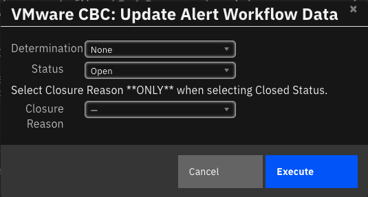

<details><summary>Inputs:</summary>
<p>

| Name | Type | Required | Example | Tooltip |
| ---- | :--: | :------: | ------- | ------- |
| `vmware_cbc_alert_id` | `text` | Yes | `-` | - |
| `vmware_cbc_closure_reason` | `text` | No | `-` |  Reason code for why the alert is being updated. Optional |
| `vmware_cbc_determination` | `text` | No | `-` | - |
| `vmware_cbc_note_text` | `text` | No | `-` |  	Custom message to add to the note added to modified alert |
| `vmware_cbc_status` | `text` | No | `-` | Alert workflow status in CBC |

</p>
</details>

<details><summary>Outputs:</summary>
<p>

> **NOTE:** This example might be in JSON format, but `results` is a Python Dictionary on the SOAR platform.

```python
results = {
  "content": {
    "connector_id": "FRIYZADN2K",
    "create_time": "2024-05-29T15:09:30.535479Z",
    "id": 14374209,
    "job_parameters": {
      "job_parameters": {
        "request": {
          "criteria": {
            "id": [
              "35081d68-29d0-7592-f408-33939ed01882"
            ]
          },
          "determination": "TRUE_POSITIVE",
          "status": "IN_PROGRESS"
        },
        "userWorkflowDto": {
          "change_timestamp": "2024-05-29T15:09:30.461Z",
          "changed_by": "FRZADN2KIK",
          "changed_by_type": "API",
          "closure_reason": "NO_REASON",
          "status": "IN_PROGRESS"
        }
      }
    },
    "last_update_time": "2024-05-29T15:09:31.340546Z",
    "org_key": "7M9FP6WE",
    "progress": {
      "message": "Dismissal completed",
      "num_completed": 1,
      "num_total": 1
    },
    "status": "COMPLETED",
    "type": "user_workflow_update"
  },
  "inputs": {
    "vmware_cbc_alert_id": "35081d68-29d0-7592-f408-33939ed01882",
    "vmware_cbc_closure_reason": null,
    "vmware_cbc_determination": "TRUE_POSITIVE",
    "vmware_cbc_note_text": null,
    "vmware_cbc_status": "IN_PROGRESS"
  },
  "metrics": {
    "execution_time_ms": 1599,
    "host": "my.app.host",
    "package": "fn-vmware-cbc",
    "package_version": "1.0.0",
    "timestamp": "2024-05-29 11:09:31",
    "version": "1.0"
  },
  "raw": null,
  "reason": null,
  "success": true,
  "version": 2.0
}
```

</p>
</details>

<details><summary>Example Function Input Script:</summary>
<p>

```python
STATUS_MAPPING = {
  "Unresolved": "CLOSED",   # Unresolved
  "Duplicate": "CLOSED",    # Duplicate
  "Not an Issue": "CLOSED", # Not an Issue
  "Resolved": "CLOSED"      # Resolved
}

CLOSURE_REASON_MAPPING = {
  "Unresolved": "NO_REASON",   # Unresolved
  "Duplicate": "DUPLICATE_CLEANUP",    # Duplicate
  "Not an Issue": "RESOLVED_BENIGN_KNOWN_GOOD", # Not an Issue
  "Resolved": "RESOLVED"      # Resolved
}


inputs.vmware_cbc_alert_id = incident.properties.vmware_cbc_alert_id
inputs.vmware_cbc_status = STATUS_MAPPING.get(incident.resolution_id, "CLOSED")
inputs.vmware_cbc_closure_reason = CLOSURE_REASON_MAPPING.get(incident.resolution_id, "NO_REASON")
inputs.vmware_cbc_note_text = incident.resolution_summary.content if incident.resolution_summary.content else f"Case {incident.id} was closed in IBM QRadar SOAR"

# Note determination is set to the custom field value.  Make sure to set determination before closing the case in SOAR
inputs.vmware_cbc_determination = incident.properties.vmware_cbc_determination_value.replace(" ", "_").upper() if incident.properties.vmware_cbc_determination_value else "NONE"

# Set custom fields in SOAR with values sent to CBC.
incident.properties.vmware_cbc_workflow_status = inputs.vmware_cbc_status
if incident.properties.vmware_cbc_workflow_status == "CLOSED" and inputs.vmware_cbc_closure_reason:
  incident.properties.vmware_cbc_workflow_closure_reason = inputs.vmware_cbc_closure_reason.replace(" ", "_").title()

```

</p>
</details>

<details><summary>Example Function Post Process Script:</summary>
<p>

```python
results = playbook.functions.results.close_alert_results

if results.get("success"):
  note_text = "<b>VMware CBC: Close Alert on Case Close:</b> Closed alert in Carbon Black Cloud."
else:
  reason = results.get("reason", None)
  note_text = "<b>VMware CBC: Close Alert on Case Close:</b> Failed function to set status. Reason = {reason}"
  
incident.addNote(note_text)
```

</p>
</details>

---
## Function - VMware CBC: Post Device Action
Post an action to the device monitored by Carbon Black Cloud.

 

<details><summary>Inputs:</summary>
<p>

| Name | Type | Required | Example | Tooltip |
| ---- | :--: | :------: | ------- | ------- |
| `vmware_cbc_device_action` | `text` | Yes | `-` | - |
| `vmware_cbc_device_id` | `text` | Yes | `-` | - |
| `vmware_cbc_device_toggle` | `text` | No | `-` | - |

</p>
</details>

<details><summary>Outputs:</summary>
<p>

> **NOTE:** This example might be in JSON format, but `results` is a Python Dictionary on the SOAR platform.

```python
results = {
  "content": {
    "device_status": "success"
  },
  "inputs": {
    "vmware_cbc_device_action": "QUARANTINE",
    "vmware_cbc_device_id": "212389492",
    "vmware_cbc_device_toggle": "OFF"
  },
  "metrics": {
    "execution_time_ms": 54545,
    "host": "my.app.host",
    "package": "fn-vmware-cbc",
    "package_version": "1.0.0",
    "timestamp": "2024-05-31 12:31:34",
    "version": "1.0"
  },
  "raw": null,
  "reason": null,
  "success": true,
  "version": 2.0
}
```

</p>
</details>

<details><summary>Example Function Input Script:</summary>
<p>

```python
inputs.vmware_cbc_device_id = row.cbc_device_id
inputs.vmware_cbc_device_action = "QUARANTINE"
inputs.vmware_cbc_device_toggle = "OFF"
```

</p>
</details>

<details><summary>Example Function Post Process Script:</summary>
<p>

```python
results = playbook.functions.results.post_device_action_results


if results.get("success"):
    note_text = f"<b>VMware CBC: Quarantine OFF:</b> Post action to device successful."
else:
    reason = results.get("reason")
    note_text = f"<b>VMware CBC: Quarantine OFF:</b> Failed to post action Quarantine OFF: {reason}."
  
incident.addNote(note_text)
```

</p>
</details>

---
## Function - VMware CBC: Post Note to CBC Alert
Post a note to the specified Carbon Black Cloud alert in CBC.

 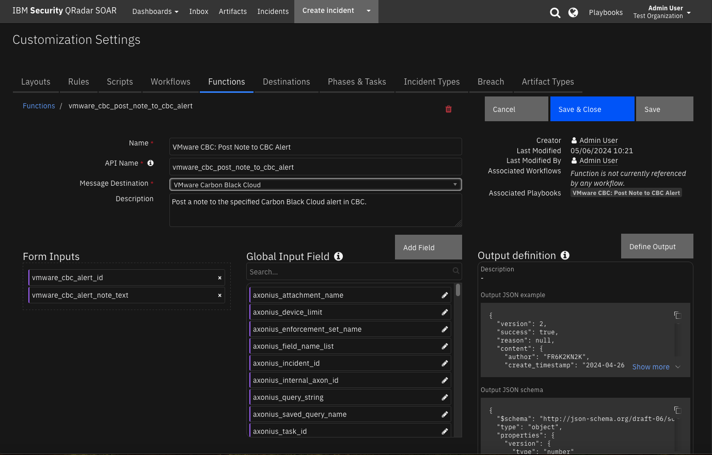

<details><summary>Inputs:</summary>
<p>

| Name | Type | Required | Example | Tooltip |
| ---- | :--: | :------: | ------- | ------- |
| `vmware_cbc_alert_id` | `text` | Yes | `-` | - |
| `vmware_cbc_alert_note_text` | `text` | Yes | `Note text body to send to CBC alert.` | - |

</p>
</details>

<details><summary>Outputs:</summary>
<p>

> **NOTE:** This example might be in JSON format, but `results` is a Python Dictionary on the SOAR platform.

```python
results = {
  "content": {
    "author": "FR6K2KN2K",
    "create_timestamp": "2024-04-26T20:30:03.905Z",
    "id": "50c323c1-8495-4fe4-815f-7bc411976ec9",
    "last_update_timestamp": "2024-04-26T20:30:03.905Z",
    "note": "Created by IBM SOAR:  VMware CBC Update Case on Creation:  populated Process data table 2  artifact(s) added to the case.",
    "note_json_format": null,
    "source": "CUSTOMER"
  },
  "inputs": {
    "vmware_cbc_alert_id": "0730b7bc-7d51-9d64-68b1-d3e01d28a716",
    "vmware_cbc_alert_note_text": "\u003cb\u003eVMware CBC Update Case on Creation:\u003c/b\u003e populated Process data table\u003cbr /\u003e\u003cb\u003e2\u003c/b\u003e artifact(s) added to the case."
  },
  "metrics": {
    "execution_time_ms": 19794,
    "host": "myapphost",
    "package": "fn-vmware-cbc",
    "package_version": "1.0.0",
    "timestamp": "2024-04-26 16:30:04",
    "version": "1.0"
  },
  "raw": null,
  "reason": null,
  "success": true,
  "version": 2.0
}
```

</p>
</details>

<details><summary>Example Function Input Script:</summary>
<p>

```python
inputs.vmware_cbc_alert_id = incident.properties.vmware_cbc_alert_id
inputs.vmware_cbc_alert_note_text = note.text.content
```

</p>
</details>

<details><summary>Example Function Post Process Script:</summary>
<p>

```python
from datetime import datetime

results = playbook.functions.results.post_note_to_alert_results

# Edit note in SOAR to indicate it was sent to CBC alert
if results.get("success"):
  # Get the current time
  now = datetime.now()
  note.text = u"<b>Post note to CBC alert at {0}</b><br>{1}".format(now, note.text.content)
  
```

</p>
</details>

---
## Function - VMware CBC: Post Observations Detail Job
Creates an Observations details job and returns the result of the job. The details include information about the given event that’s not normally accessible during a search. The observations parameter is a JSON object converted to a string.  See the Carbon Black Cloud documentation on the Observation Detail Job: Create Detail Job request body.  The full JSON is defined :
{
  "alert_id": "<string>",
  "observation_ids": ["<string>"],
  "process_hash": "<string>",
  "device_id": <integer>,
  "count_unique_devices": <boolean>,
  "max_rows": <integer>
}

 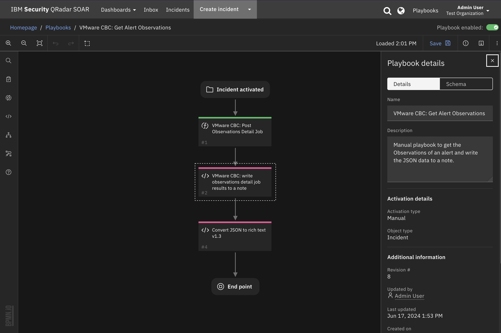

<details><summary>Inputs:</summary>
<p>

| Name | Type | Required | Example | Tooltip |
| ---- | :--: | :------: | ------- | ------- |
| `vmware_cbc_observation` | `text` | Yes | `-` | JSON value dumped to a string. |

</p>
</details>

<details><summary>Outputs:</summary>
<p>

> **NOTE:** This example might be in JSON format, but `results` is a Python Dictionary on the SOAR platform.

```python
results = {
  "version": 2.0,
  "success": true,
  "reason": null,
  "content": {
    "results": [
      {
        "alert_category": [
          "THREAT"
        ],
        "alert_id": [
          "3680c6ba-c645-6779-3976-f9ed69326ca1"
        ],
        "backend_timestamp": "2024-06-12T14:35:37.015Z",
        "device_external_ip": "170.225.223.22",
        "device_group_id": 0,
        "device_id": 212389492,
        "device_installed_by": "Administrator",
        "device_internal_ip": "9.30.34.190",
        "device_location": "OFFSITE",
        "device_name": "cb-win221",
        "device_os": "WINDOWS",
        "device_os_version": "Windows Server 2022 x64",
        "device_policy": "standard",
        "device_policy_id": 493371,
        "device_sensor_version": "4.0.0.1292",
        "device_target_priority": "MEDIUM",
        "device_timestamp": "2024-06-12T14:32:57.641Z",
        "document_guid": "djeE5vZFSoS1Xar6Gn_S1A",
        "enriched": true,
        "enriched_event_type": "FILE_CREATE",
        "event_attack_stage": [
          "DELIVER_EXPLOIT"
        ],
        "event_description": "The file \"<share><link hash=\"761de33e1c3d08865f5f2d0cfc84c3b5401c7915a2953ca6b8c2fddbb007556b\">c:\\users\\administrator\\downloads\\temp4\\340s.exe\\340s.exe</link></share>\" was first detected on a local disk. The device was off the corporate network using the public address 170.225.223.22 (located in San Jose CA, United States). The file is not signed. The file was created by the application \"<share><link hash=\"f6ec44f025c67ab18170da47c1c610a94a9c84741f3cdfceb20cee565579868a\">c:\\program files\\confer\\repmgr.exe</link></share>\".",
        "event_id": "cda5cca328c811efb47ec103488c1130",
        "event_threat_score": [
          3
        ],
        "event_type": "filemod",
        "file_scan_result": "/ZBot",
        "filemod_action": "ACTION_FILE_CREATE",
        "filemod_hash": [
          "48cd898279*******976d9bb0993bc338",
          "761de33e1c3d*******f2d0cfc84c3b5401c7915a2953ca6b8c2fddbb007556b"
        ],
        "filemod_issuer": [
          "jhjkkkaaaaaaaaaaa"
        ],
        "filemod_name": "c:\\users\\administrator\\downloads\\temp4\\340s.exe\\340s.exe",
        "filemod_publisher": [
          "jhjkkkaaaaaaaaaaa"
        ],
        "filemod_publisher_state": [
          "FILE_SIGNATURE_STATE_SIGNED"
        ],
        "filemod_reputation": "KNOWN_MALWARE",
        "ingress_time": 1718202925831,
        "legacy": true,
        "observation_description": "A known virus (Trojan: ZBot) was detected in file c:\\users\\administrator\\downloads\\temp4\\340s.exe\\340s.exe.",
        "observation_id": "cda5cca328c811efb47ec103488c1130:3680c6ba-c645-6779-3976-f9ed69326ca1",
        "observation_type": "CB_ANALYTICS",
        "org_id": "7M9FP6WE",
        "parent_effective_reputation": "TRUSTED_WHITE_LIST",
        "parent_effective_reputation_source": "CLOUD",
        "parent_guid": "7M9FP6WE-0ca8ce74-00000318-00000000-1daac4e9610e992",
        "parent_hash": [
          "7477c64706110f4*******6618b8b83d27fef94ca9d112965f8c9a62ca3d7e"
        ],
        "parent_issuer": [
          "Microsoft Windows Production PCA 2011"
        ],
        "parent_name": "c:\\windows\\system32\\services.exe",
        "parent_pid": 792,
        "parent_publisher": [
          "Microsoft Windows Publisher"
        ],
        "parent_publisher_state": [
          "FILE_SIGNATURE_STATE_VERIFIED",
          "FILE_SIGNATURE_STATE_SIGNED"
        ],
        "parent_reputation": "TRUSTED_WHITE_LIST",
        "parent_user_id": "S-1-5-18",
        "parent_username": "NT AUTHORITY\\SYSTEM",
        "process_cmdline": [
          "\"C:\\Program Files\\Confer\\RepMgr.exe\""
        ],
        "process_cmdline_length": [
          36
        ],
        "process_effective_reputation": "IGNORE",
        "process_effective_reputation_source": "IGNORE",
        "process_guid": "7M9FP6WE-0ca8ce74-00000460-00000000-1daac5135bc76a4",
        "process_hash": [
          "8a87acebc*******eeb24af602b32b30",
          "f6ec44f025c*******0da47c1c610a94a9c84741f3cdfceb20cee565579868a"
        ],
        "process_issuer": [
          "Sectigo RSA Code Signing CA 2"
        ],
        "process_name": "c:\\program files\\confer\\repmgr.exe",
        "process_pid": [
          1120
        ],
        "process_publisher": [
          "Carbon Black, Inc."
        ],
        "process_publisher_state": [
          "FILE_SIGNATURE_STATE_VERIFIED",
          "FILE_SIGNATURE_STATE_SIGNED"
        ],
        "process_reputation": "TRUSTED_WHITE_LIST",
        "process_sha256": "f6ec44f025c67ab18170da47c1c610a94a9c84741f3cdfceb20cee565579868a",
        "process_start_time": "2024-05-22T14:06:15.472Z",
        "process_user_id": "S-1-5-18",
        "process_username": [
          "NT AUTHORITY\\SYSTEM"
        ],
        "ttp": [
          "DETECTED_MALWARE_APP"
        ]
      }
    ],
    "num_found": 1,
    "num_available": 1,
    "approximate_unaggregated": 1,
    "num_aggregated": 1,
    "contacted": 21,
    "completed": 21,
    "message": ""
  },
  "raw": null,
  "inputs": {
    "vmware_cbc_observations": "{\"alert_id\": \"3680c6ba-c645-6779-3976-f9ed69326ca1\"}"
  },
  "metrics": {
    "version": "1.0",
    "package": "fn-vmware-cbc",
    "package_version": "1.0.0",
    "host": "my.app.host",
    "execution_time_ms": 95538,
    "timestamp": "2024-06-17 11:25:10"
  }
}
```

</p>
</details>

<details><summary>Example Function Input Script:</summary>
<p>

```python
from json import dumps

if not incident.properties.vmware_cbc_alert_id:
  helper.fail("VMware CBC alert ID is required!")

# Note: Either observation_ids or alert_id is required however only one can be specified.
# This playbook specifies an alert_id.
observations ={
  "alert_id": incident.properties.vmware_cbc_alert_id
}

inputs.vmware_cbc_observations = dumps(observations)
```

</p>
</details>

<details><summary>Example Function Post Process Script:</summary>
<p>

```python
results = playbook.functions.results.observation_detail_job_results
inputs = results.get("inputs", None)
observation = inputs.get("vmware_cbc_observation", None)
  
header = u"<b>VMware CBC: Observation Detail Job:</b> {0}".format(observation)

json_note = {
              "version": "1.3",
              "header": header, 
              "json": results.content,
              "sort": False
            }
playbook.addProperty('convert_json_to_rich_text', json_note)

```

</p>
</details>

---
## Function - VMware CBC: Post Reputation Override
Override the reputation of an application by adding a SHA-256 hash, a certificate signer or a path to a known IT tool application or directory of IT tools to an Approved or Banned list. The reputation override parameter is a JSON object converted to a string. See the Carbon Black Cloud documentation on Configure Reputation Override.

 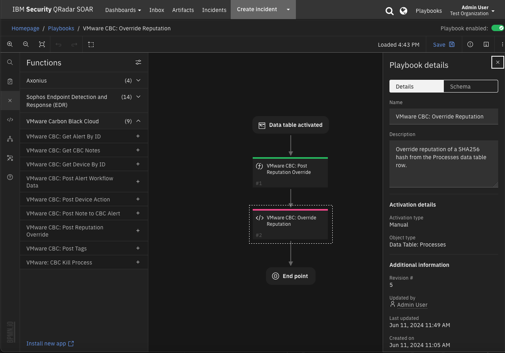

<details><summary>Inputs:</summary>
<p>

| Name | Type | Required | Example | Tooltip |
| ---- | :--: | :------: | ------- | ------- |
| `vmware_cbc_reputation_override` | `text` | Yes | `-` | JSON value dumped to a string. |

</p>
</details>

<details><summary>Outputs:</summary>
<p>

> **NOTE:** This example might be in JSON format, but `results` is a Python Dictionary on the SOAR platform.

```python
results = {
  "content": {
    "create_time": "2024-05-20T19:56:01.742Z",
    "created_by": "FRIYZADN2K",
    "description": null,
    "filename": null,
    "id": "fbf657a6*******af639b4554e04742",
    "override_list": "WHITE_LIST",
    "override_type": "SHA256",
    "sha256_hash": "8f7c9555176248ea*******c8df5a4b5e36ba43d2b02c153e3ee322970877e0",
    "source": "APP",
    "source_ref": null
  },
  "inputs": {
    "vmware_cbc_reputation_override": "{\"override_list\": \"WHITE_LIST\", \"override_type\": \"SHA256\", \"sha256_hash\": \"8f7c9555176248ea553d9ac4c8df5a4b5e36ba43d2b02c153e3ee322970877e0\"}"
  },
  "metrics": {
    "execution_time_ms": 6481,
    "host": "my.app.host",
    "package": "fn-vmware-cbc",
    "package_version": "1.0.0",
    "timestamp": "2024-05-20 15:56:01",
    "version": "1.0"
  },
  "raw": null,
  "reason": null,
  "success": true,
  "version": 2.0
}
```

</p>
</details>

<details><summary>Example Function Input Script:</summary>
<p>

```python
from json import dumps

if not row.cbc_process_sha256:
  helper.fail("SHA256 is required to override reputation")

SHA256 = row.cbc_process_sha256

override_list = playbook.inputs.vmware_cbc_override_list
description = playbook.inputs.vmware_cbc_description if playbook.inputs.vmware_cbc_description else None
filename = row.cbc_process_name if row.cbc_process_name else None

reputation = {
  "override_list": override_list,
  "override_type": "SHA256",
  "sha256_hash": SHA256,
  "description": description,
  "filename": filename
}

inputs.vmware_cbc_reputation_override = dumps(reputation)
```

</p>
</details>

<details><summary>Example Function Post Process Script:</summary>
<p>

```python
from json import dumps

results = playbook.functions.results.override_reputation_results

reason = results.get("reason")
if results.get("success"):
    content = results.get("content")
    if content:
        note_text = "<b>VMware CBC: Override Reputation:</b><br>  {0}.".format(dumps(content, indent=4))
    else:
        note_text = f"<b>VMware CBC: Override Reputation:</b> failed to post override_reputation - no content: {reason}."
else:

    note_text = f"<b>VMware CBC: Override Reputation:</b> failed to post override reputation: {reason}."
  
incident.addNote(note_text)
```

</p>
</details>

---
## Function - VMware CBC: Post Tags
Post a list of tags to a CBC alert.

 

<details><summary>Inputs:</summary>
<p>

| Name | Type | Required | Example | Tooltip |
| ---- | :--: | :------: | ------- | ------- |
| `vmware_cbc_tags` | `text` | Yes | `-` | - |
| `vmware_cbc_threat_id` | `text` | Yes | `-` | - |

</p>
</details>

<details><summary>Outputs:</summary>
<p>

> **NOTE:** This example might be in JSON format, but `results` is a Python Dictionary on the SOAR platform.

```python
results = {
  "content": {
    "tags": [
      "tag1",
      "tag2",
      "tag3"
    ]
  },
  "inputs": {
    "vmware_cbc_tags": "tag1, tag2, tag3",
    "vmware_cbc_threat_id": "88f5fb3b8c*******fbb4c8fa1c4ff4"
  },
  "metrics": {
    "execution_time_ms": 1784,
    "host": "my.app.host",
    "package": "fn-vmware-cbc",
    "package_version": "1.0.0",
    "timestamp": "2024-05-09 16:42:24",
    "version": "1.0"
  },
  "raw": null,
  "reason": null,
  "success": true,
  "version": 2.0
}
```

</p>
</details>

<details><summary>Example Function Input Script:</summary>
<p>

```python
inputs.vmware_cbc_threat_id = incident.properties.vmware_cbc_threat_id
inputs.vmware_cbc_tags = playbook.inputs.vmware_cbc_tags
```

</p>
</details>

<details><summary>Example Function Post Process Script:</summary>
<p>

```python
results = playbook.functions.results.post_tags_results

if results.get("success"):
    content = results.get("content")
    if content:
        note_text = f"<b>VMware CBC: Post Tags:</b>  {playbook.inputs.vmware_cbc_tags} added."
    else:
        note_text = "<b>VMware CBC: Post Tags</b> failed to post tag(s) - no content."
else:
    reason = results.get("reason")
    note_text = "<b>VMware CBC: Post Tags</b> failed to post tag(s) {reason}."
  
incident.addNote(note_text)
```

</p>
</details>

---
## Function - VMware: CBC Kill Process
Kill the process on the specified Carbon Black Cloud device, given the process ID (pid) on the device.

**NOTE:** This function uses the Carbon Black Live Response API to issue commands on a remote device.  All Live Response commands must be issued in the context of a session and the session must have an ACTIVE state. When using the **VMware CBC: Kill Process** playbook, there may be a delay when the session becomes ACTIVE and the resulting incident note instructs the user to "try again later". It may take a number of minutes for the session to become ACTIVE.

 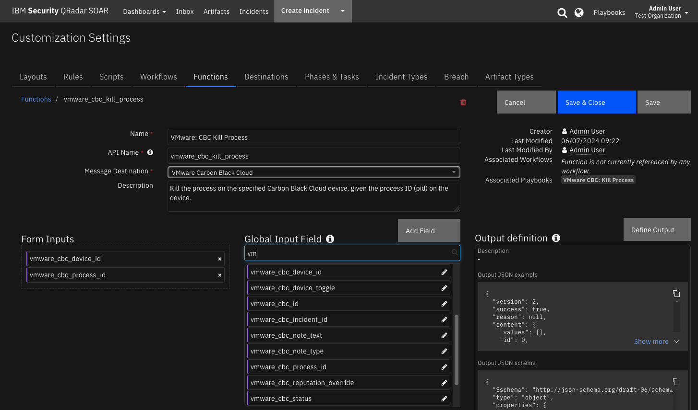

<details><summary>Inputs:</summary>
<p>

| Name | Type | Required | Example | Tooltip |
| ---- | :--: | :------: | ------- | ------- |
| `vmware_cbc_device_id` | `text` | Yes | `-` | - |
| `vmware_cbc_process_id` | `text` | Yes | `-` | - |

</p>
</details>

<details><summary>Outputs:</summary>
<p>

> **NOTE:** This example might be in JSON format, but `results` is a Python Dictionary on the SOAR platform.

```python
results = {
  "content": {
    "create_time": "2024-05-31T16:15:33Z",
    "files": [],
    "finish_time": "2024-05-31T16:15:33.377707Z",
    "id": 0,
    "input": {
      "name": "kill",
      "object": 2264
    },
    "name": "kill",
    "result_code": 0,
    "result_desc": "",
    "status": "PENDING",
    "sub_keys": [],
    "values": []
  },
  "inputs": {
    "vmware_cbc_device_id": "212389492",
    "vmware_cbc_process_id": "2264"
  },
  "metrics": {
    "execution_time_ms": 40888,
    "host": "my.app.host",
    "package": "fn-vmware-cbc",
    "package_version": "1.0.0",
    "timestamp": "2024-05-31 12:15:47",
    "version": "1.0"
  },
  "raw": null,
  "reason": null,
  "success": true,
  "version": 2.0
}
```

</p>
</details>

<details><summary>Example Function Input Script:</summary>
<p>

```python
inputs.vmware_cbc_device_id = row.cbc_device_id
inputs.vmware_cbc_process_id = row.cbc_process_pid
```

</p>
</details>

<details><summary>Example Function Post Process Script:</summary>
<p>

```python
results = playbook.functions.results.kill_process_results

reason = results.get("reason", None)
inputs = results.get("inputs", None)
pid = inputs.get("vmware_cbc_process_id") if inputs else None

if results.get("success"):
    content = results.get("content", None)
    if content:
        result = content.get("result", None)
        if result:
          status = result.get("status", None)
          result_code = result.get("result_code", None)
          if status == "COMPLETE" and result_code == 0:
              note_text = f"<b>VMware CBC: Kill Process:</b>  PID: {pid} was terminated:<br>{result}."
          else:
              note_text = f"<b>VMware CBC: Kill Process:</b>  ERROR: PID: {pid} was not terminated:<br>{result}<br>{reason}."
        else:
            note_text = f"<b>VMware CBC: Kill Process:</b> Failed to kill PID {pid} - no result: {reason}."
    else:
        note_text = f"<b>VMware CBC: Kill Process:</b> Failed to kill PID {pid} - no content: {reason}."
else:
    reason = results.get("reason")
    note_text = f"<b>VMware CBC: Kill Process:</b> Failed to kill PID {pid}: {reason}."
  
incident.addNote(note_text)
```

</p>
</details>

---

## Script - Convert JSON to rich text v1.3
This script converts a json object into a hierarchical display of rich text and adds the rich text to an incident's rich text (custom) field or an incident note. A workflow property is used to share the json to convert and identify parameters used on how to perform the conversion.
Typically, a function will create workflow property and this script will run after that function to perform the conversion.

Features:

* Display the hierarchical nature of json, presenting the json keys (sorted if specified) as bold labels
* Provide links to found URLs
* Create either an incident note or add results to an incident (custom) rich text field.

**Object:** incident

<details><summary>Script Text:</summary>
<p>

```python
# (c) Copyright IBM Corp. 2010, 2023. All Rights Reserved.
VERSION = 1.3
"""
  This script converts a json object into a hierarchical display of rich text and adds the rich text to an incident's rich text (custom) field or an incident note.
  A workflow property is used to define the json to convert and identify parameters used on how to perform the conversion.
  Typically, a function will create workflow property and this script will run after that function to perform the conversion.
  Features:
    * Display the hierarchical nature of json, presenting the json keys as bold labels
    * Provide links to found URLs
    * Create either an incident note or add results to an incident (custom) rich text field.
  
  In order to use this script, define a workflow property called: convert_json_to_rich_text, to define the json and parameters to use for the conversion.
  Workflow properties can be added using a command similar to this:
  workflow.addProperty('convert_json_to_rich_text', {
    "version": 1.3,
    "header": "Artifact scan results for: {}".format(artifact.value),
    "padding": 10,
    "separator": u"<br />",
    "sort": True,
    "json": results.content,
    "json_omit_list": ["omit"],
    "incident_field": None
  })
  
  Format of workflow.property.convert_json_to_rich_text:
  { 
    "version": 1.3, [this is for future compatibility]
    "header": str, [header line to add to converted json produced or None. Ex: Results from scanning artifact: xxx. The header may contain rich text tags]
    "padding": 10, [padding for nested json elements, or defaults to 10]
    "separator": u"<br />"|list such as ['<span>','</span>'], [html separator between json keys and lists or defaults to html break: '<br />'. 
                                                If a list, then the data is brackets by the pair specified]
    "sort": True|False, [sort the json keys at each level when displayed]
    "json": json, [required json to convert]
    "json_omit_list": [list of json keys to exclude or None]
    "incident_field": "<incident_field>" [indicates a builtin rich text incident field, such as 'description' 
                                          or a custom rich text field in the format: 'properties.<field>'. default: create an incident note]
  }

  For playbooks, use playbook.addProperty() with the same format as workflow.addProperty()

  Playbooks can also use playbook.functions.results.convert_json_to_rich_text using the standard function output which contains the 'content' json element.
  When using playbook.functions.results.convert_json_to_rich_text with standard function results, all the defaults for padding, separator, etc. are used.
"""

import re

# needed for python 3
try:
    unicode("abc") # fails in py3
    py2 = True
except:
    unicode = str
    py2 = False


rc = re.compile(r'http[s]?://(?:[a-zA-Z]|[0-9]|[$-_@.&+#\?]|[!*\(\),]|(?:%[0-9a-fA-F][0-9a-fA-F]))+')

class ConvertJson:
    """Class to hold the conversion parameters and perform the conversion"""

    def __init__(self, omit_keys=[], padding=10, separator=u"<br />", sort_keys=False):
        self.omit_keys = omit_keys
        self.padding = padding
        self.separator = separator
        self.sort_keys = sort_keys


    def format_link(self, item):
        """[summary]
          Find embedded urls (http(s)) and add html anchor tags to display as links
          Args:
              item ([string])

          Returns:
              [str]: None|original text if no links|text with html links
        """
        formatted_item = item
        if py2:
            num_type = bool(item and isinstance(item, (int, long, bool, float)))
        else:
            num_type = bool(item and isinstance(item, (int, bool, float)))

        if item and not num_type:
            list = rc.findall(item)
            if list:
                for link in list:
                    formatted_item = formatted_item.replace(link, u"<a target='blank' href='{0}'>{0}</a>".format(link))

        return formatted_item

    def expand_list(self, list_value, is_list=False):
        """[summary]
          convert items to html, adding indents to nested dictionaries.
          Args:
              list_value ([dict|list]): json element

          Returns:
              [str]: html converted code
        """
        if not isinstance(list_value, list):
            return self.format_link(list_value)
        elif not list_value:
            return u"None<br>"

        try:
            items_list = []  # this will ensure list starts on second line of key label
            for item in list_value:
                if isinstance(item, dict):
                    result = self.convert_json_to_rich_text(item)
                    if is_list:
                        items_list.append(u"<li>{}</li>".format(result))
                    else:
                        items_list.append(result)
                elif isinstance(item, list):
                    items_list.append(self.expand_list(item, is_list=True))
                elif is_list:
                    items_list.append(u"<li>{}</li>".format(self.format_link(unicode(item))))
                else:
                    items_list.append(self.format_link(unicode(item)))

            expand_list_result = self.add_separator(self.separator if not is_list else u"",
                                                    items_list,
                                                    is_list=is_list)

            if is_list:
                return u"<ul>{}</ul>".format(expand_list_result)
            else:
                return u"<div style='padding:5px'>{}</div>".format(expand_list_result)
        except Exception as err:
            return str(err)

    def convert_json_to_rich_text(self, sub_dict):
        """[summary]
          Walk dictionary tree and convert to html for better display
          Args:
              sub_dict ([type]): [description]

          Returns:
              [type]: [description]
        """
        notes = []
        if sub_dict and isinstance(sub_dict, (list, dict)):
            if isinstance(sub_dict, list):
                expanded_list = self.expand_list(sub_dict, is_list=True)
                notes.append(self.add_separator(self.separator, expanded_list))
            else:
                keys = sorted (sub_dict.keys()) if self.sort_keys else sub_dict.keys()

                for key in keys:
                    if key not in self.omit_keys:
                        value = sub_dict[key]
                        is_list = isinstance(value, list)
                        item_list = [u"<strong>{0}</strong>: ".format(key)]
                        if isinstance(value, dict):
                            convert_result = self.convert_json_to_rich_text(value)
                            if convert_result:
                                item_list.append(u"<div style='padding:{}px'>{}</div>".format(self.padding, convert_result))
                            else:
                                item_list.append(u"None<br>")
                        else:
                            item_list.append(self.expand_list(value, is_list=is_list))

                        notes.append(self.add_separator(self.separator, u"".join(make_unicode(v) for v in item_list), is_list=is_list))

        result_notes = u"".join(notes)
        if isinstance(self.separator, list):
            return result_notes
        else:
            return result_notes.replace(
                u"</div>{0}".format(self.separator), u"</div>").replace(
                u"{0}</div>".format(self.separator), u"</div>"
            )  # tighten up result

    def add_separator(self, separator, items, is_list=False):
        """
        apply the separator to the data
        :param separator: None, str or list such as ['<span>', '</span>']
        :param items: str or list to add separator
        :return: text with separator applied
        """
        _items = items

        if not _items:
            return "<br>"

        if not isinstance(_items, list):
            _items = [_items]

        if isinstance(separator, list):
            return u"".join([u"{}{}{}".format(separator[0], item, separator[1]) for item in _items])

        return u"{}{}".format(separator.join(_items), separator if not is_list else u"")

def make_unicode(value):
    if value is None:
        return 'None'

    return unicode(value)

def get_results(property_name):
    if playbook and playbook.functions.results[property_name] is not None:
        return playbook.functions.results[property_name]
    elif playbook and playbook.properties[property_name] is not None:
        return playbook.properties[property_name]
    elif workflow and workflow.properties[property_name] is not None:
        return workflow.properties[property_name]

    return None

def get_properties(property_name):
    """
    Logic to collect the json and parameters from a workflow property.
    Args:
      property_name: workflow property to reference
    Returns:
      padding, separator, header, json_omit_list, incident_field, json, sort_keys
    """
    result_properties = get_results(property_name)
    if not result_properties:
        helper.fail("Playbook/workflow property not found: {}".format(property_name))

    padding = int(result_properties.get("padding", 10))
    separator = result_properties.get("separator", u"<br />")
    if isinstance(separator, list) and len(separator) != 2:
        helper.fail("list of separators should be specified as a pair such as ['<div>', '</div>']: {}".format(separator))

    header = result_properties.get("header")
    sort_keys = bool(result_properties.get("sort", False))
    json_omit_list = result_properties.get("json_omit_list")
    if not json_omit_list:
        json_omit_list = []
    incident_field = result_properties.get("incident_field")
    
    # workflow formatted content is 'json'. Standard functions is 'content'
    json = result_properties.get("json") if result_properties.get("json") else result_properties.get("content")
    json_err = None
    # is there an issue we need handle now?
    if not json and \
        result_properties.get("success") == False and result_properties.get("reason"):
        json_err = result_properties.get("reason")
    
    return padding, separator, header, json_omit_list, incident_field, json, json_err, sort_keys


## S T A R T
padding, separator, header, json_omit_list, incident_field, json, json_err, sort_keys = get_properties('convert_json_to_rich_text')
if json_err:
    result = "Result error: {}".format(json_err)
else:
    if header:
        if isinstance(separator, list):
            hdr = u"{0}{1}{2}".format(separator[0], header, separator[1])
        else:
            hdr = u"{0}{1}".format(header, separator)
    else:
        hdr = u""

    convert = ConvertJson(omit_keys=json_omit_list, padding=padding, separator=separator, sort_keys=sort_keys)
    converted_json = convert.convert_json_to_rich_text(json)
    result = u"{}{}".format(hdr, converted_json if converted_json else "\nNone")

rich_text_note = helper.createRichText(result)
if incident_field:
    incident[incident_field] = rich_text_note
else:
    incident.addNote(rich_text_note)

```

</p>
</details>

---
## Script - VMware CBC: Populate CBC Device Row from Alert
Write the function results of get device into the data table in a new row.

**Object:** incident

<details><summary>Script Text:</summary>
<p>

```python
from datetime import datetime

results = playbook.functions.results.get_alert_by_id_results

if results.get("success", False):
  content = results.get("content", {})
  if content:

    alert = content.get("alert", [])
    device_row = incident.addRow("vmware_cbc_device_dt")
    device_row.cbc_query_date = datetime.now()
    device_row.cbc_device_id = alert.get("device_id", None)
    device_row.cbc_device_name = alert.get("device_name", None)
    device_row.cbc_device_policy = alert.get("device_policy", None)
    device_row.cbc_device_policy_id = alert.get("device_policy_id", None)
    device_row.cbc_device_os_version = alert.get("device_os_version", None)
    device_row.cbc_device_username = alert.get("device_username", None)
    device_row.cbc_device_external_ip = alert.get("device_external_ip", None)
    device_row.cbc_device_internal_ip = alert.get("device_internal_ip", None)
    device_row.cbc_device_location = alert.get("device_location", None)

    note_text = "<b>VMware CBC: Populate CBC Device Row from Alert:</b> Update complete."
  else:
    note_text = "<b>VMware CBC: Populate CBC Device Row from Alert:</b> No alert found (no content)."
else:
  note_text = "<bVMware CBC: Populate CBC Device Row from Alert:</b> Update did not complete. Reason = {0}".format(results.get("reason", None))
    
incident.addNote(note_text)
```

</p>
</details>

---
## Script - VMware CBC: Populate CBC Device Row from Device
Write the results of get device by ID function to the Device data table.

**Object:** vmware_cbc_device_dt

<details><summary>Script Text:</summary>
<p>

```python
results = playbook.functions.results.get_device_by_id_results

if results.get("success", False):
  content = results.get("content", {})
  if content:
    device = content.get("device", None)
    if device:
      row.cbc_device_quarantined = device.get("quarantined", None)
      row.cbc_device_status = device.get("status", None)
      sensor_states =  device.get("sensor_states", None) 
      row.cbc_sensor_state = ", ".join(sensor_states) if isinstance(sensor_states, list) else None
      note_text = f"<b>VMware CBC: Populate Device Row from Device:</b> Update complete."
    else:
      note_text = f"<b>VMware CBC: Populate Device Row from Device:</b> Unable to get device data to update CBC Device data table."
  else:
    note_text = f"<b>VMware CBC: Populate Device Row from Device:</b> Unable to get device data to update CBC Device data table - no content."
else:
  reason = results.get("reason", None)
  note_text = f"<b>VMware CBC: Populate Device Row from Device:</b> Unable to get device data to update CBC Device data table.<br> reason: {reason}"
  
incident.addNote(note_text)

```

</p>
</details>

---
## Script - VMware CBC: Populate Observations Data Table
Write observations function results to the Observations data table and create hash artifacts.

**Object:** Incident

<details><summary>Script Text:</summary>
<p>

```python
from datetime import datetime

def hash_is_sha256(_hash) -> bool:
    return len(_hash) == 64

def hash_is_sha1(_hash) -> bool:
    return len(_hash) == 40

def hash_is_md5(_hash) -> bool:
    return len(_hash) == 32


results = playbook.functions.results.observation_detail_job_results

if results.get("success", False):
  content = results.get("content", {})
  if content:
    observations = content.get("results", [])
    num_rows = 0
    num_observations = len(observations)
    num_artifacts = 0
    for observation in observations:
      file_scan_result = observation.get("file_scan_result", None)
      # To limit results only add to the data table observations that have file scan results.
      if file_scan_result:
        row = incident.addRow("vmware_cbc_observations_dt")
        num_rows += 1
        row.cbc_query_date = datetime.now()
        row.cbc_device_time = observation.get("device_timestamp", None)
        row.cbc_filemod_name = observation.get("filemod_name", None)
        row.cbc_filemod_reputation = observation.get("filemod_reputation", None)
        row.cbc_file_scan_result = file_scan_result
      
        filemod_hash = observation.get("filemod_hash", [])
        if filemod_hash:
          row.filemod_hash =', '.join(str(f_hash) for f_hash in filemod_hash)
          for f_hash in filemod_hash:
            if hash_is_md5(f_hash):
              incident.addArtifact("Malware MD5 Hash", f_hash, f"VMware Carbon Black Observations: MD5 hash from from file {row.cbc_filemod_name}.")
              num_artifacts += 1
            elif hash_is_sha256(f_hash):
              incident.addArtifact("Malware SHA-256 Hash", f_hash, f"VMware Carbon Black Observations: SHA-256 hash from file {row.cbc_filemod_name}.")
              num_artifacts += 1
            elif hash_is_sha1(f_hash):
              incident.addArtifact("Malware SHA-1 Hash", f_hash, f"VMware Carbon Black Observations: SHA-1 hash from file {row.cbc_filemod_name}.")
              num_artifacts += 1
            
    note_text = f"<b>VMware CBC: Update Observation DT:</b> Update complete:<br> {num_observations} observations found, {num_rows} rows added to data table and {num_artifacts} artifacts added."
  else:
    note_text = "<bVMware CBC: Update Observation DT:</b> Failed function to get observations for Observations data table - no content."
else:
  reason = results.get("reason", None)
  note_text = f"<bVMware CBC: Update Observation DT:</b> Failed function to get observations for Observations data table.<br>Reason = {reason}"
  
incident.addNote(note_text)
```

</p>
</details>

---
## Playbooks
| Playbook Name | Description | Activation Type | Object | Status | Condition | 
| ------------- | ----------- | --------------- | ------ | ------ | --------- | 
| VMware CBC: Background Scan OFF | Manual playbook to turn off background scan on a device from the CBC Device data table. | Manual | vmware_cbc_device_dt | `enabled` | `vmware_cbc_device_dt.cbc_device_id has_a_value | 
| VMware CBC: Background Scan ON | Manual playbook to enable background scan on a device from the CBC Device data table. | Manual | vmware_cbc_device_dt | `enabled` | `vmware_cbc_device_dt.cbc_device_id has_a_value` | 
| VMware CBC: Bypass OFF | Manual playbook to turn OFF BYPASS on the device from the CBC Device data table. | Manual | vmware_cbc_device_dt | `enabled` | `vmware_cbc_device_dt.cbc_device_id has_a_value AND vmware_cbc_device_dt.cbc_device_status contains BYPASS` | 
| VMware CBC: Bypass ON | Manual playbook to turn ON BYPASS on the device from the CBC Device data table. | Manual | vmware_cbc_device_dt | `enabled` | `vmware_cbc_device_dt.cbc_device_id has_a_value AND vmware_cbc_device_dt.cbc_device_status not_contains BYPASS` | 
| VMware CBC: Close Alert on Case Close | Automatic playbook that updates the Workflow Status and Determination of the associated alert in VMware Carbon Black Cloud when the case is closed in SOAR.  The SOAR case resolution summary is written as a note to the Carbon Black Cloud alert. | Automatic | incident | `enabled` | `incident.properties.vmware_cbc_alert_id has_a_value AND incident.resolution_id changed AND incident.resolution_summary not_contains Closed by VMware Carbon Black Cloud` | 
| VMware CBC: Kill Process | Kill the specified process from the row in the Processes data table. Write the results to a note. | Manual | vmware_cbc_processes_dt | `enabled` | `incident.properties.vmware_cbc_alert_id has_a_value` | 
| VMware CBC: Override Reputation | Override reputation of a SHA256 hash from the Processes data table row. | Manual | vmware_cbc_processes_dt | `enabled` | `-` | 
| VMware CBC: Override Reputation Artifact | Override reputation of a SHA256 hash from a SHA256 artifact. | Manual | artifact | `enabled` | `-` | 
| VMware CBC: Post Note to CBC Alert | Manual playbook to post a note to CBC alert in Carbon Black Cloud. | Manual | note | `enabled` | `incident.plan_status equals Active AND incident.properties.vmware_cbc_alert_id has_a_value AND note.text not_contains Created by VMware CBC: AND note.text not_contains Post note to CBC alert at` | 
| VMware CBC: Post Tags | Manual playbook to add a list of tags to a Carbon Black Cloud alert in CBC. | Manual | incident | `enabled` | `incident.properties.vmware_cbc_alert_id has_a_value AND incident.properties.vmware_cbc_threat_id has_a_value` | 
| VMware CBC: Quarantine OFF | Manual playbook to remove a device from  Quarantine from the CBC Device data table. | Manual | vmware_cbc_device_dt | `enabled` | `vmware_cbc_device_dt.cbc_device_id has_a_value AND vmware_cbc_device_dt.cbc_device_quarantined equals True` | 
| VMware CBC: Quarantine ON | Manual playbook to Quarantine a device from the CBC Device data table. | Manual | vmware_cbc_device_dt | `enabled` | `vmware_cbc_device_dt.cbc_device_id has_a_value AND (vmware_cbc_device_dt.cbc_device_quarantined equals No OR vmware_cbc_device_dt.cbc_device_quarantined equals Unknown)` | 
| VMware CBC: Refetch Device in Row | Get the device data on the device in this row and add to a new row in the data table.  Use to compare device query results over time. | Manual | vmware_cbc_device_dt | `enabled` | `-` | 
| VMware CBC: Update Alert Workflow Data | Update the alert workflow information in VMware Carbon Black Cloud. | Manual | incident | `enabled` | `-` | 
| VMware CBC: Update Case | Manual playbook to update a VMware Carbon Black Cloud case. Custom fields and comments are updated in SOAR. | Manual | incident | `enabled` | `incident.properties.vmware_cbc_alert_id has_a_value` | 
| VMware CBC: Update Case on Creation | Automatic playbook to update VMware Carbon Black Cloud case when the case is created. Custom fields, data tables and comments are updated in the SOAR case. | Automatic | incident | `enabled` | `incident.properties.vmware_cbc_alert_id has_a_value AND object_added` | 
| VMware CBC: Update Device Row from Device | Automatic playbook to populate the columns of the CBC Device data table that from the devices endpoint. Note: Other columns of the CBC Device data table are populated from fields of the alert. | Automatic | vmware_cbc_device_dt | `enabled` | `vmware_cbc_device_dt.cbc_device_id has_a_value AND object_added` | 
| VMware CBC: Update Observations DT | Manual playbook to get the Observations of an alert and update the Observations data table. | Manual | incident | `enabled` | `incident.properties.vmware_cbc_alert_id has_a_value` | 
| VMware CBC: Write Alert JSON to Note | Write the VMware Carbon Black Cloud alert JSON to an incident note in SOAR. | Manual | incident | `enabled` | `-` | 
| VMware CBC: Write Device JSON to Note | Write the VMware Carbon Black Cloud device JSON to an incident note in SOAR. | Manual | vmware_cbc_device_dt | `enabled` | `-` | 
| VMware CBC: Write Observations JSON to Note | Write the VMware Carbon Black Cloud Observations of an alert JSON to an incident note in SOAR. | Manual | incident | `enabled` | `incident.properties.vmware_cbc_alert_id has_a_value` | 

---

## Custom Layouts
<!--
  Use this section to provide guidance on where the user should add any custom fields and data tables.
  You may wish to recommend a new incident tab.
  You should save a screenshot "custom_layouts.png" in the doc/screenshots directory and reference it here
-->
* Import the Data Tables and Custom Fields like the screenshot below:

  


## Data Table - CBC Device

 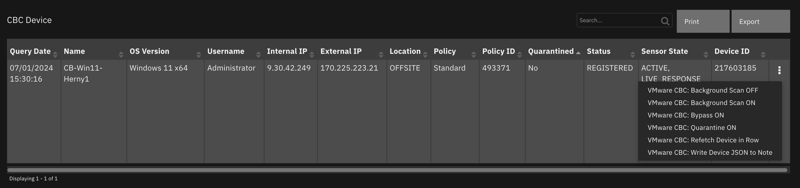

#### API Name:
vmware_cbc_device_dt

#### Columns:
| Column Name | API Access Name | Type | Tooltip |
| ----------- | --------------- | ---- | ------- |
| Device ID | `cbc_device_id` | `text` | - |
| External IP | `cbc_device_external_ip` | `text` | - |
| Internal IP | `cbc_device_internal_ip` | `text` | - |
| Location | `cbc_device_location` | `text` | - |
| Name | `cbc_device_name` | `text` | - |
| OS Version | `cbc_device_os_version` | `text` | - |
| Policy | `cbc_device_policy` | `text` | - |
| Policy ID | `cbc_device_policy_id` | `text` | - |
| Quarantined | `cbc_device_quarantined` | `boolean` | - |
| Query Date | `cbc_query_date` | `datetimepicker` | - |
| Sensor State | `cbc_sensor_state` | `text` | - |
| Status | `cbc_device_status` | `text` | - |
| Username | `cbc_device_username` | `text` | - |

---
## Data Table - Observations

 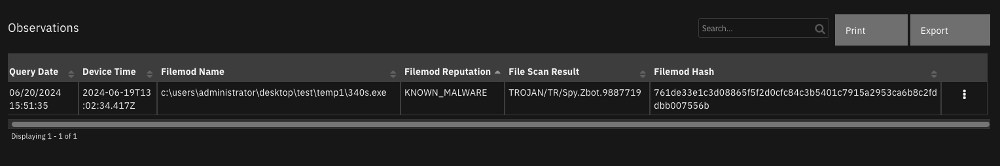

#### API Name:
vmware_cbc_observations_dt

#### Columns:
| Column Name | API Access Name | Type | Tooltip |
| ----------- | --------------- | ---- | ------- |
| Device Time | `cbc_device_time` | `text` | - |
| File Scan Result | `cbc_file_scan_result` | `text` | - |
| Filemod Hash | `filemod_hash` | `text` | - |
| Filemod Name | `cbc_filemod_name` | `text` | - |
| Filemod Reputation | `cbc_filemod_reputation` | `text` | - |
| Query Date | `cbc_query_date` | `datetimepicker` | - |

---
## Data Table - Processes

 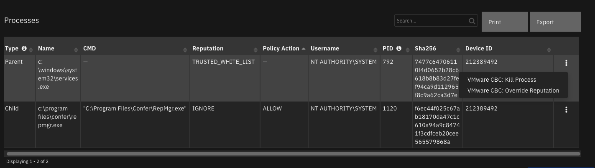

#### API Name:
vmware_cbc_processes_dt

#### Columns:
| Column Name | API Access Name | Type | Tooltip |
| ----------- | --------------- | ---- | ------- |
| CMD | `cbc_process_cmd` | `text` | - |
| Device ID | `cbc_device_id` | `text` | - |
| Name | `cbc_process_name` | `text` | - |
| PID | `cbc_process_pid` | `text` | Process ID |
| Policy Action | `cbc_process_policy_action` | `text` | - |
| Reputation | `cbc_process_effective_reputation` | `text` | - |
| Sha256 | `cbc_process_sha256` | `text` | - |
| Type | `cbc_process_type` | `text` | Process type: Parent or Child |
| Username | `cbc_process_username` | `text` | - |

---

## Custom Fields
| Label | API Access Name | Type | Prefix | Placeholder | Tooltip |
| ----- | --------------- | ---- | ------ | ----------- | ------- |
| CBC Alert ID | `vmware_cbc_alert_id` | `text` | `properties` | - | - |
| CBC Alert Link | `vmware_cbc_alert_link` | `textarea` | `properties` | - | - |
| CBC Alert Reason Code | `vmware_cbc_alert_reason_code` | `text` | `properties` | - | - |
| CBC Alert Type | `vmware_cbc_alert_type` | `text` | `properties` | - | - |
| CBC Attack Tactic | `vmware_cbc_attack_tactic` | `text` | `properties` | - | - |
| CBC Determination | `vmware_cbc_determination_value` | `text` | `properties` | - | - |
| CBC Tags | `vmware_cbc_tags` | `text` | `properties` | - | - |
| CBC Threat ID | `vmware_cbc_threat_id` | `text` | `properties` | - | - |
| CBC Workflow Closure Reason | `vmware_cbc_workflow_closure_reason` | `text` | `properties` | - | - |
| CBC Workflow Status | `vmware_cbc_workflow_status` | `text` | `properties` | - | - |

---
---
## Templates for SOAR Cases
It may necessary to modify the templates used to create or close SOAR cases based on a customer's required custom fields. Below are the default templates used which can be copied, modified and used with app_config's
`soar_create_case_template` and `soar_close_case_template` settings to override the default templates.

### soar_create_case.jinja
When overriding the template in App Host, specify the file path as `/var/rescircuits`.

```jinja
{
  {# JINJA template for creating a new SOAR incident from an endpoint #}
  {# See https://ibmresilient.github.io/resilient-python-api/pages/resilient-lib/resilient-lib.html#module-resilient_lib.components.templates_common
     for details on available jinja methods. Examples for `soar_substitute` and more are included below.
  #}
  {# modify to specify your specific **data** fields #}
  "name": "CBC Alert - {{ reason | replace('"', '\'') | replace('\\', '\\\\') }}",
  "description": "Device: {{ device_name | replace('\\', '\\\\') }}<br>Alert type: {{ type }}<br>Reason Code: {{ reason_code }}",
  {# start_date cannot be after discovered_date #}
  
  "discovered_date": {{ detection_timestamp | soar_datetimeformat(split_at='.') }},
  "start_date": {{ start_date | soar_datetimeformat(split_at='.') }},
  {# if alert users are different than SOAR users, consider using a mapping table using soar_substitute: #}
  {# "owner_id": "{{ **assignedTo** |soar_substitute('{"Automation": "soar_user1@example.com", "default_user@example.com": "soar_user2@example.com", "DEFAULT": "default_user@example.com" }') }}", #}
  "plan_status": "A",
  
    "severity_code": "Low",
  
    "severity_code": "Medium",
  
    "severity_code": "High",
  
  {# specify your custom fields for your endpoint solution #}
  "properties": {
    "vmware_cbc_alert_id": "{{ id }}",
    "vmware_cbc_alert_link": "<a target='_blank' href='https://{{ alert_url.replace("[", "%5B").replace("]", "%5D") }}'>Link</a>"
  }
}
```

### soar_close_case.jinja
When overriding the template in App Host, specify the file path as `/var/rescircuits`.

```jinja
{
  {# JINJA template for closing a SOAR incident using endpoint data #}
  
  "plan_status": "C",
  "resolution_id": "{{ workflow.closure_reason | soar_substitute(closure_reason_mapping) }}",
  "resolution_summary": "Closed by VMware Carbon Black Cloud, Alert Determination: {{ determination.value.replace('_', ' ')|title }}"
  {# add additional fields based on your 'on close' field requirements #}
  ,"properties": {
    "vmware_cbc_workflow_status": "{{ workflow.status.replace('_', ' ')|title }}",
    "vmware_cbc_workflow_closure_reason": "{{ workflow.closure_reason.replace('_', ' ')|title }}",
    "vmware_cbc_determination_value": "{{ determination.value.replace('_', ' ')|title }}"
  }
}
```

### soar_update_case.jinja
When overriding the template in App Host, specify the file path as `/var/rescircuits`.

```jinja
{
  {# JINJA template for updating a new SOAR incident from an endpoint #}
  
    "severity_code": "Low",
  
    "severity_code": "Medium",
  
    "severity_code": "High",
  
  {# specify your custom fields for your endpoint solution #}
  "properties": {
    "vmware_cbc_alert_id": "{{ id }}",
    "vmware_cbc_alert_type": "{{ type }}",
    "vmware_cbc_alert_reason_code" : "{{ reason_code }}",
    "vmware_cbc_alert_link": "<a target='_blank' href='https://{{ alert_url.replace("[", "%5B").replace("]", "%5D") }}'>Link</a>",
    "vmware_cbc_attack_tactic": "{{ attack_tactic }}",
    "vmware_cbc_threat_id": "{{ threat_id }}",
    "vmware_cbc_workflow_status": "{{ workflow.status.replace('_', ' ') |lower|title }}",
    "vmware_cbc_workflow_closure_reason": "{{ workflow.closure_reason.replace('_', ' ') |lower|title }}",
    "vmware_cbc_determination_value": "{{ determination.value.replace('_', ' ') |lower|title}}"
    
    ,"vmware_cbc_tags": "{{ tags | join(', ') }}"
    
  }
}
```
---


## Troubleshooting & Support
Refer to the documentation listed in the Requirements section for troubleshooting information.
 
### For Support
This is an IBM supported app. Please search [ibm.com/mysupport](https://ibm.com/mysupport) for assistance.
