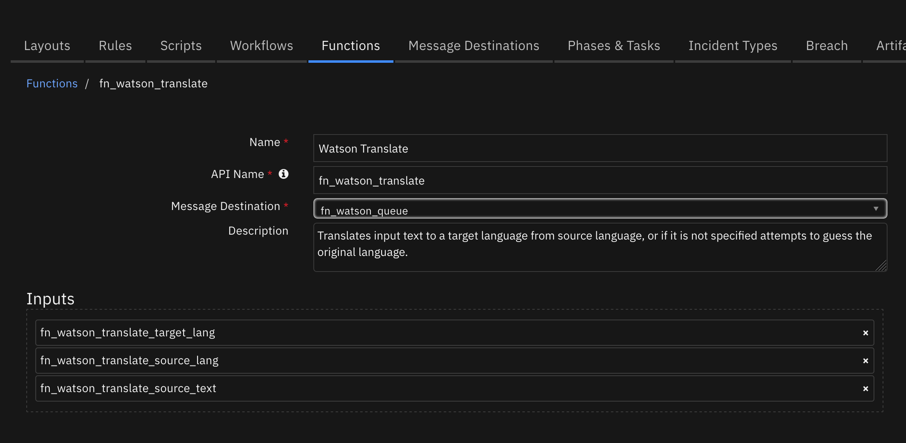

<!--
  This README.md is generated by running:
  "resilient-sdk docgen -p fn_watson_translate"

  It is best edited using a Text Editor with a Markdown Previewer. VS Code
  is a good example. Checkout https://guides.github.com/features/mastering-markdown/
  for tips on writing with Markdown

  If you make manual edits and run docgen again, a .bak file will be created

  Store any screenshots in the "doc/screenshots" directory and reference them like:
  

  NOTE: If your app is available in the container-format only, there is no need to mention the integration server in this readme.
-->

# fn_watson_translate

## Table of Contents
- [Release Notes](#release-notes)
- [Overview](#overview)
  - [Key Features](#key-features)
- [Requirements](#requirements)
  - [Resilient platform](#resilient-platform)
  - [Cloud Pak for Security](#cloud-pak-for-security)
  - [Proxy Server](#proxy-server)
  - [Python Environment](#python-environment)
- [Installation](#installation)
  - [Install](#install)
  - [App Configuration](#app-configuration)
- [Function - Watson Translate](#function---watson-translate)
- [Rules](#rules)
- [Troubleshooting & Support](#troubleshooting--support)
---

## Release Notes
<!--
  Specify all changes in this release. Do not remove the release
  notes of a previous release
-->
| Version | Date | Notes |
| ------- | ---- | ----- |
| 1.1.0 | 09/2021 | App Host support |
| 1.0.0 | 02/2019 | Initial Release |

---

## Overview
<!--
  Provide a high-level description of the function itself and its remote software or application.
  The text below is parsed from the "description" and "long_description" attributes in the setup.py file
-->
**Resilient Circuits Components for 'fn_watson_translate'**


This function integrates Watson Translator with the IBM SOAR platform to provide translation services.
The Watson Translation service supports multiple languages, uses Neural Networks for processing and allows building custom models.
The Watson Translate function accepts text to be translated, targets language and optionally source language (in its absence Watson will attempt to identify the language) and returns translated text and its confidence percentage.
Find out more at: https://www.ibm.com/watson/services/language-translator/.

### Key Features
<!--
  List the Key Features of the Integration
-->
* Multiple language translation
* Machine learning identification of source language

---

## Requirements
<!--
  List any Requirements
-->
This app supports the IBM Resilient SOAR Platform and the IBM Cloud Pak for Security.

### Resilient platform
The Resilient platform supports two app deployment mechanisms, App Host and integration server.

If deploying to a Resilient platform with an App Host, the requirements are:
* Resilient platform >= `39.0.6328`.
* The app is in a container-based format (available from the AppExchange as a `zip` file).

If deploying to a Resilient platform with an integration server, the requirements are:
* Resilient platform >= `39.0.6328`.
* The app is in the older integration format (available from the AppExchange as a `zip` file which contains a `tar.gz` file).
* Integration server is running `resilient_circuits>=39.0.0`.
* If using an API key account, make sure the account provides the following minimum permissions:
  | Name | Permissions |
  | ---- | ----------- |
  | Org Data | Read |
  | Function | Read |

The following Resilient platform guides provide additional information:
* _App Host Deployment Guide_: provides installation, configuration, and troubleshooting information, including proxy server settings.
* _Integration Server Guide_: provides installation, configuration, and troubleshooting information, including proxy server settings.
* _System Administrator Guide_: provides the procedure to install, configure and deploy apps.

The above guides are available on the IBM Knowledge Center at [ibm.biz/resilient-docs](https://ibm.biz/resilient-docs). On this web page, select your Resilient platform version. On the follow-on page, you can find the _App Host Deployment Guide_ or _Integration Server Guide_ by expanding **Resilient Apps** in the Table of Contents pane. The System Administrator Guide is available by expanding **System Administrator**.

### Cloud Pak for Security
If you are deploying to IBM Cloud Pak for Security, the requirements are:
* IBM Cloud Pak for Security >= 1.4.
* Cloud Pak is configured with an App Host.
* The app is in a container-based format (available from the AppExchange as a `zip` file).

The following Cloud Pak guides provide additional information:
* _App Host Deployment Guide_: provides installation, configuration, and troubleshooting information, including proxy server settings. From the Table of Contents, select Case Management and Orchestration & Automation > **Orchestration and Automation Apps**.
* _System Administrator Guide_: provides information to install, configure, and deploy apps. From the IBM Cloud Pak for Security Knowledge Center table of contents, select Case Management and Orchestration & Automation > **System administrator**.

These guides are available on the IBM Knowledge Center at [ibm.biz/cp4s-docs](https://ibm.biz/cp4s-docs). From this web page, select your IBM Cloud Pak for Security version. From the version-specific Knowledge Center page, select Case Management and Orchestration & Automation.

### Proxy Server
The app **does not** support a proxy server.

### Python Environment
Both Python 2.7 and Python 3.6 are supported.
Additional package dependencies may exist for each of these packages:
* bs4
* resilient_circuits>=39.0.0
* ibm-watson
* ibm_cloud_sdk_core

---

## Installation

### Install
* To install or uninstall an App or Integration on the _Resilient platform_, see the documentation at [ibm.biz/resilient-docs](https://ibm.biz/resilient-docs).
* To install or uninstall an App on _IBM Cloud Pak for Security_, see the documentation at [ibm.biz/cp4s-docs](https://ibm.biz/cp4s-docs) and follow the instructions above to navigate to Orchestration and Automation.

### App Configuration
The following table provides the settings you need to configure the app. These settings are made in the app.config file. See the documentation discussed in the Requirements section for the procedure.

| Config | Required | Example | Description |
| ------ | :------: | ------- | ----------- |
| **fn_watson_translate_api** | Yes | `aaaa-bbb_ccc` | *Your API key for REST calls* |
| **fn_watson_translate_version** | Yes | `2018-05-01` | *Version of Watson service to use.* |
| **fn_watson_translate_url** | Yes | `https://api.us-south.language-translator.watson.cloud.ibm.com/instances/aaa-bbb-ccc` | *URL and instance to the Watson service.* |

---

## Function - Watson Translate
Translates input text to a target language from source language, or if it is not specified attempts to guess the original language.

 

<details><summary>Inputs:</summary>
<p>

| Name | Type | Required | Example | Tooltip |
| ---- | :--: | :------: | ------- | ------- |
| `fn_watson_translate_source_lang` | `text` | No | `fr` | Source language's 2 character ID |
| `fn_watson_translate_source_text` | `text` | Yes | `lorem impsum` | Text to be translated |
| `fn_watson_translate_target_lang` | `text` | Yes | `en` | Target language's 2 character ID |

</p>
</details>

<details><summary>Outputs:</summary>
<p>

```python
results = {
    "value": "translated text",
    "confidence": 80,
    "language": 'fr',
    "source_lang": 'en'
}
```

</p>
</details>

<details><summary>Example Pre-Process Script:</summary>
<p>

```python
inputs.fn_watson_translate_source_text = note.text.content
```

</p>
</details>

<details><summary>Example Post-Process Script:</summary>
<p>

```python
note.addNote("Translated by Watson: \n" + results.value)
```

</p>
</details>

---

## Rules
| Rule Name | Object | Workflow Triggered |
| --------- | ------ | ------------------ |
| Example: Watson Translate Note | note | `watson_translate_note` |

---

## Languages Supported:

Use the two character representation for your source and target language:

```
af:Afrikaans
ar:Arabic
az:Azerbaijani
ba:Bashkir
be:Belarusian
bg:Bulgarian
bn:Bengali
ca:Catalan
cs:Czech
cv:Chuvash
cy:Welsh
da:Danish
de:German
el:Greek
en:English
eo:Esperanto
es:Spanish
et:Estonian
eu:Basque
fa:Persian
fi:Finnish
fr:French
ga:Irish
gu:Gujarati
he:Hebrew
hi:Hindi
hr:Croatian
ht:Haitian
hu:Hungarian
hy:Armenian
is:Icelandic
it:Italian
ja:Japanese
ka:Georgian
kk:Kazakh
km:Central Khmer
ko:Korean
ku:Kurdish
ky:Kirghiz
lo:Lao
lt:Lithuanian
lv:Latvian
ml:Malayalam
mn:Mongolian
mr:Marathi
ms:Malay
mt:Maltese
my:Burmese
nb:Norwegian Bokmal
ne:Nepali
nl:Dutch
nn:Norwegian Nynorsk
pa:Punjabi
pa-PK:Punjabi (Shahmukhi script, Pakistan)
pl:Polish
ps:Pushto
pt:Portuguese
ro:Romanian
ru:Russian
si:Sinhala
sk:Slovakian
sl:Slovenian
so:Somali
sq:Albanian
sr:Serbian
sv:Swedish
ta:Tamil
te:Telugu
th:Thai
tl:Tagalog
tr:Turkish
uk:Ukrainian
ur:Urdu
vi:Vietnamese
zh:Simplified Chinese
zh-TW:Traditional Chinese
```

## Troubleshooting & Support
Refer to the documentation listed in the Requirements section for troubleshooting information.

### For Support
This is a IBM Community provided App. Please search the Community https://ibm.biz/resilientcommunity for assistance.
