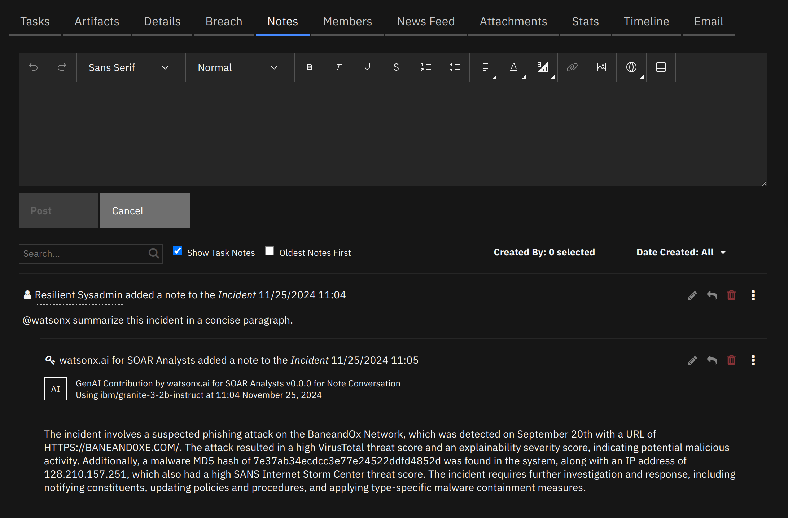
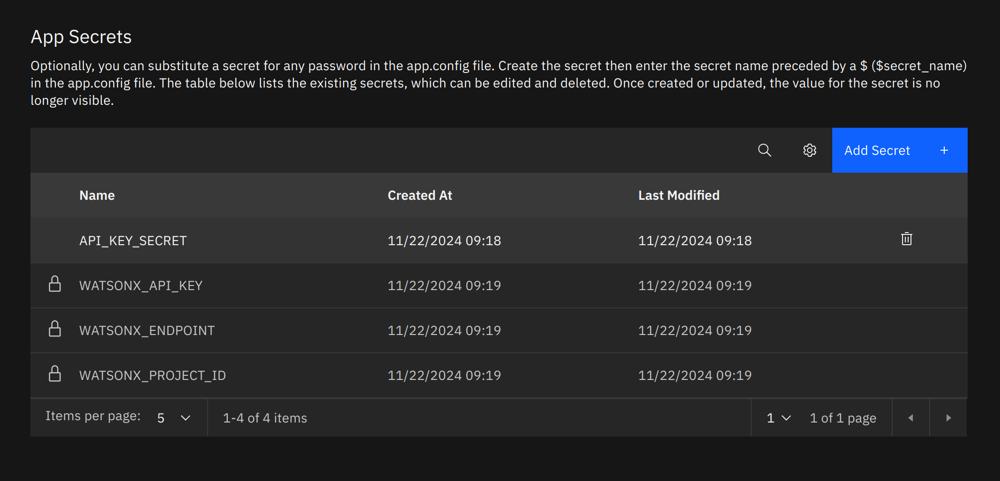
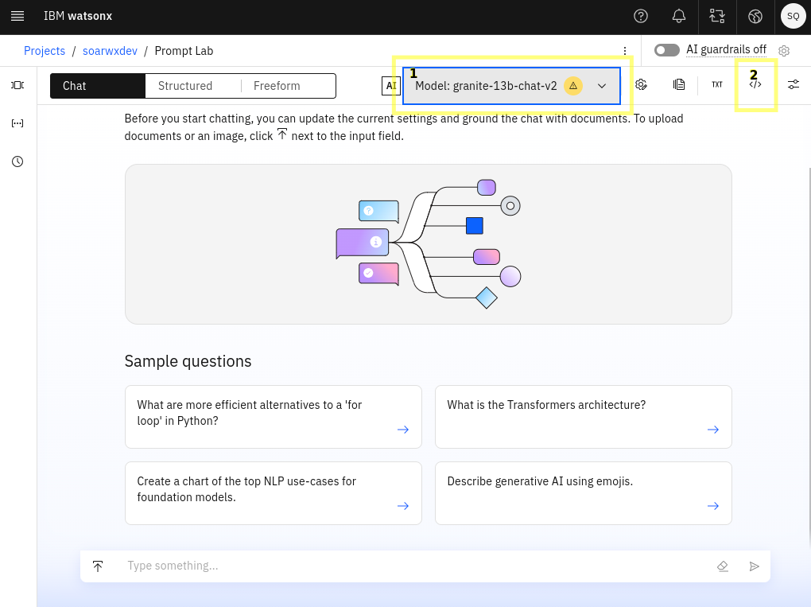
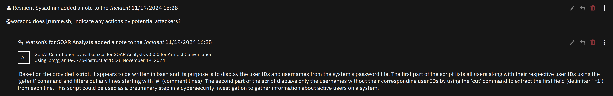

# watsonx.ai for SOAR Analysts<!-- omit in toc -->

## Table of Contents<!-- omit in toc -->
- [Release Notes](#release-notes)
- [Overview](#overview)
  - [Key Features](#key-features)
- [Requirements](#requirements)
  - [Watsonx.ai Subscription and Project](#watsonxai-subscription-and-project)
    - [1. Watsonx.ai Project ID](#1-watsonxai-project-id)
    - [2. IBM Cloud IAM API Key](#2-ibm-cloud-iam-api-key)
    - [3. Watsonx.ai Endpoint URL](#3-watsonxai-endpoint-url)
  - [SOAR platform](#soar-platform)
  - [QRadar Suite](#qradar-suite)
  - [Proxy Server](#proxy-server)
  - [Python Environment](#python-environment)
- [Installing the App](#installing-the-app)
  - [Install](#install)
  - [Configuring the App](#configuring-the-app)
    - [Adding the secrets to the App Configuration](#adding-the-secrets-to-the-app-configuration)
  - [Custom Field Label Replacing](#custom-field-label-replacing)
- [How to use](#how-to-use)
  - [Note Conversation](#note-conversation)
    - [Data made available to the LLM](#data-made-available-to-the-llm)
  - [Scan Artifact](#scan-artifact)
  - [Extending watsonx.ai](#extending-watsonxai)
    - [Using other models](#using-other-models)
    - [Create your own AI Solution](#create-your-own-ai-solution)
  - [Prompting Guide](#prompting-guide)
    - [Response Quality](#response-quality)
    - [Conversations in the Notes tab](#conversations-in-the-notes-tab)
- [Function - watsonx.ai Converse via Notes](#function---watsonxai-converse-via-notes)
- [Function - watsonx.ai Scan Artifact](#function---watsonxai-scan-artifact)
- [Function - watsonx.ai Text Generation](#function---watsonxai-text-generation)
- [Script - watsonx.ai Respond to note](#script---watsonxai-respond-to-note)
- [Script - watsonx.ai Update Artifact Description with Assessment](#script---watsonxai-update-artifact-description-with-assessment)
- [Playbooks](#playbooks)
- [Feedback](#feedback)
- [Troubleshooting \& Support](#troubleshooting--support)
  - [For Support](#for-support)


---

## Release Notes

| Version | Date    | Notes                                                                   |
|---------|---------|-------------------------------------------------------------------------|
| 1.0.0   | 12/2024 | Initial "**Early Access**" release. Uses watsonx.ai SaaS Version `2023-05-29` |

---

## Overview

**Leverage generative AI with watsonx.ai for artifact scanning, incident summarization and Q&A, and generic watsonx.ai text generation.**

### Key Features
- Incident question and answers: ask watsonx.ai questions about incidents. Ask it to summarise and analyse incidents and artifacts.
- Artifact analysis: Use watsonx.ai powered playbooks to quickly generate a report on an artifact, as a preliminary assessment.



## Requirements
- Either [SOAR Platform](#soar-platform) or [IBM QRadar Suite](#qradar-suite) installed.
- A subscription to watsonx.ai.
  - A watsonx.ai Project ID
  - An IBM Cloud IAM API Key
  - A watsonx.ai [Endpoint URL](https://cloud.ibm.com/apidocs/watsonx-ai#endpoint-url)


### Watsonx.ai Subscription and Project

- You will need to sign up to a watsonx subscription. 
- You can do so at https://dataplatform.cloud.ibm.com/registration/stepone?context=wx.  
- For testing in a non-production environment you can use a free trial subscription to watsonx.ai.
- Using this account, create a project on the watsonx.ai platform.

> [!IMPORTANT]
> These instructions work as of 2024-11-25. These steps may become outdated due to changes made outside of this app.

#### 1. Watsonx.ai Project ID
Navigate to the Projects page 


If you have not created a project yet, you can create one now, using the `New Project +` button on the top-right.


Navigate to your project.

Under the `Manage` tab, on the `General` section, copy the Project ID, you will need this later when configuring the app.


#### 2. IBM Cloud IAM API Key

To use watsonx.ai from the _watsonx.ai for SOAR_ app, you'll need an IBM Cloud IAM API Key. To generate an API key, click on the menu icon in the top left of the watsonx.ai dashboard and open *Access (IAM)* under the *Administration* menu.


The *Access IAM* dashboard will open... 

1. Choose *API Keys* from the navigation section then...
2. Click the *Create +* button to create a new API key.


Take note of the API key as this will also be used during app configuration.

#### 3. Watsonx.ai Endpoint URL

The endpoint will depend on which region your watsonx.ai project was created in. You can see which region you're using in the watsonx.ai dashboard in the dropdown at the top-right, next to the user icon.

Find the relevant Endpoint for your region at https://cloud.ibm.com/apidocs/watsonx-ai#endpoint-url.
> [!IMPORTANT]
> Don't use the prompt and/or notebooks endpoint.


### SOAR platform
The SOAR platform supports two app deployment mechanisms, Edge Gateway (also known as App Host) and integration server.

If deploying to a SOAR platform with an App Host, the requirements are:
* SOAR platform >= `50.0.0`.
* The app is in a container-based format (available from the AppExchange as a `zip` file).

If deploying to a SOAR platform with an integration server, the requirements are:
* SOAR platform >= `50.0.0`.
* The app is in the older integration format (available from the AppExchange as a `zip` file which contains a `tar.gz` file).
* Integration server is running `resilient-circuits>=51.0.2.0.0`.
* If using an API key account, make sure the account provides the following minimum permissions:

| Name     | Permissions |
|----------|-------------|
| Org Data | Read        |
| Function | Read        |
| Incident | Read        |
| Playbook | Read        |


The following SOAR platform guides provide additional information:
* _Edge Gateway Deployment Guide_ or _App Host Deployment Guide_: provides installation, configuration, and troubleshooting information, including proxy server settings.
* _Integration Server Guide_: provides installation, configuration, and troubleshooting information, including proxy server settings.
* _System Administrator Guide_: provides the procedure to install, configure and deploy apps.

The above guides are available on the IBM Documentation website at [ibm.biz/soar-docs](https://ibm.biz/soar-docs). On this web page, select your SOAR platform version. On the follow-on page, you can find the _Edge Gateway Deployment Guide_, _App Host Deployment Guide_, or _Integration Server Guide_ by expanding **Apps** in the Table of Contents pane. The System Administrator Guide is available by expanding **System Administrator**.

### QRadar Suite
If you are deploying to IBM QRadar Suite, the requirements are:
* IBM QRadar Suite >= `1.10.16`.
* QRadar Suite is configured with an Edge Gateway.
* The app is in a container-based format (available from the AppExchange as a `zip` file).

The following QRadar Suite guides provide additional information:
* _Edge Gateway Deployment Guide_ or _App Host Deployment Guide_: provides installation, configuration, and troubleshooting information, including proxy server settings. From the Table of Contents, select Case Management and Orchestration & Automation > **Orchestration and Automation Apps**.
* _System Administrator Guide_: provides information to install, configure, and deploy apps. From the IBM QRadar Suite Documentation table of contents, select Case Management and Orchestration & Automation > **System administrator**.

These guides are available on the IBM Documentation website at [ibm.biz/cp4s-docs](https://ibm.biz/cp4s-docs). From this web page, select your IBM QRadar Suite version. From the version-specific IBM Documentation page, select Case Management and Orchestration & Automation.

### Proxy Server
The app **does not** support a proxy server.

### Python Environment
This app runs on Python 3.12.
Additional package dependencies may exist for each of these packages:
* tiktoken==0.8.0 
* resilient-circuits>=51.0.2.0.0
* scikit-learn==1.5.2

## Installing the App

### Install
* To install or uninstall an app or Integration on the _SOAR platform_, see the documentation at [ibm.biz/soar-docs](https://ibm.biz/soar-docs).
* To install or uninstall an app on _IBM Qradar Suite_, see the documentation at [ibm.biz/cp4s-docs](https://ibm.biz/cp4s-docs) and follow the instructions above to navigate to Orchestration and Automation.

### Configuring the App
The following table provides the settings you need to configure the app. These settings are made in the app.config file. See the documentation discussed in the Requirements section for the procedure.

| Config                 | Required | Example                             | Description                                                                        |
|------------------------|:--------:|-------------------------------------|------------------------------------------------------------------------------------|
| **watsonx_api_key**    |   Yes    | 0123-4567-89ab-cdef                 | Your watsonx.ai API key - see [IBM Cloud IAM API Key](#2-ibm-cloud-iam-api-key)    |
| **watsonx_endpoint**   |   Yes    | `https://us-south.ml.cloud.ibm.com` | The watsonx.ai API URL - see [watsonx.ai Endpoint URL](#3-watsonxai-endpoint-url)  |
| **watsonx_project_id** |   Yes    | 0123-4567-89ab-cdef                 | The watsonx.ai project id - see [watsonx.ai Project ID](#3-watsonxai-endpoint-url) |


#### Adding the secrets to the App Configuration

After installing the app, you must configure it as follows: 

Under the `Configuration` tab in App Details, you can add the following watsonx secrets using the values you got in the [Requirements](#requirements) section. (`API_KEY_SECRET` is the API key being used to authenticate the app. You don't need to change this.) 




### Custom Field Label Replacing
- This integration recognises Incident data via their API names. If a custom incident field's API name doesn't adequately explain the purpose of the field, an LLM may not be able to interpret the data very well.
- To help address this, you can configure the app to replace these fields with other labels you provide at the bottom of the app.config:
>
>App.config
>```
>[watsonx_property_labels]
>fn_something_custom_field_report="Incident report"
>```


## How to use

### Note Conversation
- Use `@watsonx` at the start of an incident note to query watsonx.ai. (e.g., `@watsonx summarize this incident`).
- If you want to investigate an artifact's contents, enclose its name in square brackets in your query (e.g., `@watsonx tell me whether [artifact name] seems like it could be malicious`).
  - If this artifact has an attachment, the attachment's contents will also be added to context. If looking for specific information in the contents, provide the **actual words** that will be in the contents to get the best output. E.g.:
  - `@watsonx do the warnings in [app.log] seem to indicate security issues?`.
  - `@watsonx Are there any associated Indicators of Compromise (IOCs) with [bad_script.sh]?`
  
#### Data made available to the LLM

Incident:
- Name
- Description
- Start date
- Discovered date
- Address (address, city, state, country, zip)
- Incident workspace
- Incident creator
- Incident reporter
- Incident members
- Negative PR likelihood
- Regulatory assessments
- Incident disposition (confirmed / unconfirmed)
- Custom incident properties

Artifacts:
- Value (name)
- Description
- Date added
- Date updated
- Number of related incidents
- \*Artifact contents
  
Playbook Executions:
- Playbook name
- Playbook description
- Elapsed time
- Execution state (running, error, completed, canceled, suspended)
- Object name (e.g. incident's name)

Phases & Tasks:
- Phase name
- Task name
- Task description
- Task status (complete or incomplete)
- Task status (active or inactive)
- Task required or not

\*Only in note conversations with an artifact name in square brackets.


### Scan Artifact

- On the artifacts tab, from the Actions menu, choose watsonx.ai Scan Artifact. This may be used to check what is in a particular file, and whether the file contains evidence of malicous activity.

> [!WARNING]
> Scanning artifacts with large files will use many tokens. Because of this, use Scan Artifact *sparingly* on a trial watsonx.ai account.

### Extending watsonx.ai

#### Using other models

- We supply watsonx.ai for SOAR analysts with a selection of models we’ve found to work well for this use-case.
- To use a different model, available to your region and project, you can modify the Function Field `fn_watsonx_analyst_model_id` and you can add additional Model IDs to choose from in your playbooks.
  - To add a model ID, under Customization Settings, in the Functions tab, enter a function's edit page. Under the `Global Input Field` section, click the pencil icon on the field `fn_watsonx_analyst_model_id`. Click on `Add/Edit Values`, then add a new line with the model ID at the bottom, before clicking the green check mark at the top. Then hit save, the new model should be available in the watsonx.ai functions.
  - To find Model IDs, you can follow the documentation to fetch models from the API [here](https://cloud.ibm.com/apidocs/watsonx-ai#list-foundation-model-specs).
  - Alternatively, when using the Prompt Lab in watsonx.ai, you can use the dropdown to choose a different model (1 in the below screenshot). When satisified with the model choice, you can click the button to show the `cURL` request. In the JSON body of this request will be a `model_id` field. Copy the value for that field.
  - 

#### Create your own AI Solution

- Using the [watsonx.ai Text Generation Playbook](#function---watsonxai-text-generation), you can pass any system prompt, and user prompt to watsonx.ai, and get a response in a playbook. Using this, you can use playbook logic to create automations using artificial intelligence.


### Prompting Guide

- When querying, you should try to use words that will appear in the data, so that the search will find good matches. See the Note Conversation examples above in [Note Conversation](#note-conversation).
- When replying to a note and querying watsonx, all parent notes in the reply chain will be added to the LLM's context. Text from notes in other root note reply chains, or 
- Also, when querying watsonx in a reply note, previous notes **in the reply chain** will be added to the context, which can help when getting more detail on specific topics. 
  - If the previous notes in the reply chain derail the conversation, you can start a new Note conversation by creating a new "root" Note.

#### Response Quality

- Quality of response can differ between LLMs specifically when the input context is larger than 4KB limit. There are some models that cannot exceed the limit of 4KB context size.
- Most of the Note Conversation answers are returned in about ~6 seconds. However, it's also important to note that large artifacts would also take more time to process.

#### Conversations in the Notes tab

- Asking very specific and clearly defined questions can improve the quality of the generated responses. When querying LLMs, it's essential to be as clear and specific as possible about the information or task you want the model to address. This will help the model to generate more accurate and relevant responses.
  - For example, summarizing an incident for a CTO would be a different response than summarizing an incident for a Security analyst.
  - Another example would be if you do not want to include some artifact types in your queries then it should be specifically mentioned.
  - Another example would be finding names of libraries in a python artifact.
  - `@watsonx what python libraries have been imported in [artifact_name.py]? Do not share the code but only the names of the libraries that have been imported. Do not share the methods or functions of those libraries. Generally, libraries are imported with the syntax ```import <library name>`
- If the initial results are unsatisfactory, consider refining your question.
  - You can refine your query by continuing the conversation in replies.
- Only *English* is supported in the early access release.
  - Prompts can be written in other languages, and responses can be generated in other languages, like for example; German, French, Spanish, and Portuguese.
  - **This behavior is sporadic and is highly dependent on the LLM you pick for the [Converse via Notes Function](#function---watsonxai-converse-via-notes)**.
  - Through prompting, this behavior can be encouraged more - `@watsonx ... et répond en français`.

---

## Function - watsonx.ai Converse via Notes

Allow conversation in an incident's Notes tab. Previous notes in a reply chain will be included as context to the LLM.

 
 

**You can click on the dropdowns below to see more details.**
<details><summary>Inputs:</summary>
<p>

| Name                             |   Type   | Required | Example                     | Tooltip                                                          |
|----------------------------------|:--------:|----------|-----------------------------|------------------------------------------------------------------|
| `fn_watsonx_analyst_incident_id` | `number` | Yes      | `2095`                      | You can use Data Navigator for this                              |
| `fn_watsonx_analyst_model_id`    | `select` | Yes      | `ibm/granite-3-2b-instruct` | Which watsonx.ai generative AI model to use to perform the task? |
| `fn_watsonx_analyst_note_id`     | `number` | Yes      | `225`                       | ID for the Incident note to respond to.                          |

</p>
</details>

<details><summary>Outputs:</summary>
<p>

> **NOTE:** This example might be in JSON format, but `results` is a Python Dictionary on the SOAR platform.

```python
results = {
  "generated_text": "Output from watsonx.ai will be here",
  "tag": "<p>the HTML tag used as a disclosure for AI-generated content</p>",
  "metadata":  {
    "model_id": "ibm/granite-3-2b-instruct",
    "stop_reason": "EOS token",
    "created_at": "2023-07-21T16:52:32.190Z",
    "generated_token_count": 8,
    "input_token_count": 10
  }
}
```

</p>
</details>

<details><summary>Example Function Input Script:</summary>
<p>

```python

inputs.fn_watsonx_analyst_incident_id = incident.id
inputs.fn_watsonx_analyst_model_id = "ibm/granite-3-2b-instruct"
inputs.fn_watsonx_analyst_note_id = note.id

```

</p>
</details>

<details><summary>Example Function Post Process Script:</summary>
<p>

```python

generated_text = playbook.functions.results.ai_response["content"]["generated_text"]
tag = playbook.functions.results.ai_response["content"]["tag"]

if generated_text != "":
  note.addNote(tag + generated_text)

```

</p>
</details>

---
## Function - watsonx.ai Scan Artifact
Use watsonx.ai to scan an artifact, and assess whether the artifact indicates any malicious activity. Design to work with log files, scripts (e.g. Bash, Python, Lua, Powershell, Perl).


<details><summary>Inputs:</summary>
<p>

| Name                             |   Type   | Required | Example                     | Tooltip                                                          |
|----------------------------------|:--------:|:--------:|-----------------------------|------------------------------------------------------------------|
| `fn_watsonx_analyst_artifact_id` | `number` |   Yes    | `3`                         | You can use data navigator to add this.                          |
| `fn_watsonx_analyst_incident_id` | `number` |   Yes    | `2095`                      | You can use Data Navigator for this                              |
| `fn_watsonx_analyst_model_id`    | `select` |   Yes    | `ibm/granite-3-2b-instruct` | Which watsonx.ai generative AI model to use to perform the task? |

</p>
</details>

<details><summary>Outputs:</summary>
<p>

> **NOTE:** This example might be in JSON format, but `results` is a Python Dictionary on the SOAR platform.

```python
results = {
  "generated_text": "Output from watsonx.ai will be here",
  "tag": "<p>the HTML tag used as a disclosure for AI-generated content</p>",
  "metadata":  {
    "model_id": "ibm/granite-3-2b-instruct",
    "stop_reason": "EOS token",
    "created_at": "2023-07-21T16:52:32.190Z",
    "generated_token_count": 8,
    "input_token_count": 10
  }
}
```

</p>
</details>

<details><summary>Example Function Input Script:</summary>
<p>

```python

inputs.fn_watsonx_analyst_model_id = "ibm/granite-3-2b-instruct"
inputs.fn_watsonx_incident_id = incident.id
inputs.fn_watsonx_artifact_id = artifact.id

```

</p>
</details>

<details><summary>Example Function Post Process Script:</summary>
<p>

```python

generated_text = playbook.functions.results.ai_response["content"]["generated_text"]
tag = playbook.functions.results.ai_response["content"]["tag"]

isHtml = False

if generated_text:
  generated_text = generated_text.strip()
  incident.addNote(tag + generated_text)
  
else:
  incident.addNote(tag + "Failed to generate artifact summary, please check app logs for more details.")
 
```

</p>
</details>

---
## Function - watsonx.ai Text Generation
Perform Text Generation against watsonx.ai. Can replace '{}' in prompts with comma-separated strings in `fn_watsonx_analyst_arguments`.


<details><summary>Inputs:</summary>
<p>

| Name                               |   Type   | Required | Example                                                                                                                    | Tooltip                                                          |
|------------------------------------|:--------:|:--------:|----------------------------------------------------------------------------------------------------------------------------|------------------------------------------------------------------|
| `fn_watsonx_analyst_arguments`     |  `text`  |    No    | `foo,bar,foobar`                                                                                                           | Comma-separated arguments to replace '{}'s in the prompt         |
| `fn_watsonx_analyst_model_id`      | `select` |   Yes    | `ibm/granite-3-2b-instruct`                                                                                                | Which watsonx.ai generative AI model to use to perform the task? |
| `fn_watsonx_analyst_prompt`        |  `text`  |   Yes    | `Tell me about this incident.`                                                                                             | What you are asking the LLM                                      |
| `fn_watsonx_analyst_system_prompt` |  `text`  |    No    | `You are a helpful AI assistant knowledgeable in cyber security. You are inoffensive, and respond clearly, and concisely.` | Optional grounding prompt                                        |

</p>
</details>

<details><summary>Outputs:</summary>
<p>

> **NOTE:** This example might be in JSON format, but `results` is a Python Dictionary on the SOAR platform.

```python
results = {
  "generated_text": "Output from watsonx.ai will be here",
  "tag": "<p>the HTML tag used as a disclosure for AI-generated content</p>",
  "metadata":  {
    "model_id": "ibm/granite-3-2b-instruct",
    "stop_reason": "EOS token",
    "created_at": "2023-07-21T16:52:32.190Z",
    "generated_token_count": 8,
    "input_token_count": 10
  }
}
```

</p>
</details>

<details><summary>Example Function Input Script:</summary>
<p>

```python
inputs.fn_watsonx_analyst_model_id = "ibm/granite-3-2b-instruct"
inputs.fn_watsonx_analyst_system_prompt = "You are watsonx, an experienced cybersecurity analyst with over 25 years' experience resolving incidents. You are helpful, and do not stray into off-topic conversations."
inputs.fn_watsonx_analyst_prompt = "What remediation steps should be followed for a {} incident? Explain your reasoning for each remediation step."
inputs.fn_watsonx_analyst_arguments = "DDOS Attack"
```

</p>
</details>

<details><summary>Example Function Post Process Script:</summary>
<p>

```python

generated_text = playbook.functions.results.ai_response["content"]["generated_text"]
tag = playbook.functions.results.ai_response["content"]["tag"]

isHtml = False

if generated_text:
  generated_text = generated_text.strip()
  incident.addNote(tag + generated_text)
  
else:
  incident.addNote(tag + "Failed to generate artifact summary, please check app logs for more details.")
 
```

</p>
</details>

---

## Script - watsonx.ai Respond to note


**Object:** note

<details><summary>Script Text:</summary>
<p>

```python

generated_text = playbook.functions.results.ai_response["content"]["generated_text"]
tag = playbook.functions.results.ai_response["content"]["tag"]

if generated_text != "":
  note.addNote(tag + generated_text)

```

</p>
</details>

---
## Script - watsonx.ai Update Artifact Description with Assessment


**Object:** artifact

<details><summary>Script Text:</summary>
<p>

```python

generated_text = playbook.functions.results.ai_response["content"]["generated_text"]
tag = playbook.functions.results.ai_response["content"]["tag"]

isHtml = False

if generated_text:
  generated_text = generated_text.strip()
  incident.addNote(tag + generated_text)
  
else:
  incident.addNote(tag + "Failed to generate artifact summary, please check app logs for more details.")

```

</p>
</details>

---

## Playbooks
| Playbook Name                      | Description                                                                                                                                                                                                | Activation Type | Object   | Status    | Condition                                      | 
|------------------------------------|------------------------------------------------------------------------------------------------------------------------------------------------------------------------------------------------------------|-----------------|----------|-----------|------------------------------------------------| 
| watsonx.ai Note Conversation       | This playbook is triggered when a user writes a note that contains "@watsonx" at the start of the note. A reply will be generated by IBM watsonx.ai generative AI, and added as a reply to the first note. | Automatic       | note     | `enabled` | `note.text contains @watsonx AND object_added` | 
| watsonx.ai Retry Note Conversation | If a response fails to be generated, you can use this playbook on a note with a query for `@watsonx` to try again.                                                                                         | Manual          | note     | `enabled` | `-`                                            | 
| watsonx.ai Scan Artifact           | watsonx.ai reads the contents of the provided artifact if an attachment is supplied.  Then, watsonx.ai gives a summary of the contents, and threat scores.                                                 | Manual          | artifact | `enabled` | `-`                                            | 

## Feedback

- While every effort has been made to ensure the quality of this initial release we do appreciate that our customers have modified the data model that is shipped ootb with SOAR. A lot of your most important data may be in fields we know nothing about and so have not been able to test against. Its in this context we're releasing this app as "early access" rather than intended for immediate production usage.

- We have further work we wish to do to support your custom data, but we would greatly appreciate any feedback you can provide on where it works and where it doesn't. Please provide feedback through any IBM contact you have, or reach out via the [Community Site](https://ibm.biz/soarcommunity).


## Troubleshooting & Support

If one of the actions fails, the following steps may help:

- Check the playbook progress on the incident - the playbook may have failed. If so, the error message in the function's response may help you interpret the problem.
- If the error message does not provide enough information, you can download the apps' logs from Administrator Settings -> Apps page. Go to the details of the app, and click "Download Logs."
- Additionally, SOAR's `client.log` log file may give some extra information.

Otherwise, refer to watsonx.ai's [Troubleshooting Docs](https://dataplatform.cloud.ibm.com/docs/content/wsj/troubleshoot/troubleshoot.html?context=wx&audience=wdp)
 
### For Support
This is an IBM Community provided app. Please search the Community [ibm.biz/soarcommunity](https://ibm.biz/soarcommunity) for assistance.
