# watsonx.ai for SOAR Analysts

<!-- TOC -->
- [watsonx.ai for SOAR Analysts](#watsonxai-for-soar-analysts)
  - [Release Notes](#release-notes)
  - [Overview](#overview)
    - [Key Features](#key-features)
  - [Requirements](#requirements)
    - [Watsonx.ai Subscription and Project](#watsonxai-subscription-and-project)
      - [Watsonx.ai Project ID](#watsonxai-project-id)
      - [IBM Cloud IAM API Key](#ibm-cloud-iam-api-key)
      - [Watsonx.ai Endpoint URL](#watsonxai-endpoint-url)
    - [Watsonx.ai Free Credits](#watsonxai-free-credits)
    - [SOAR platform](#soar-platform)
    - [Cloud Pak for Security](#cloud-pak-for-security)
    - [Proxy Server](#proxy-server)
    - [Python Environment](#python-environment)
  - [Installation](#installation)
    - [Installing the App](#installing-the-app)
    - [App Configuration](#app-configuration)
- [App usage](#app-usage)
  - [Note Conversation](#note-conversation)
  - [Artifact and Attachment Scan](#artifact-and-attachment-scan)
      - [What file formats can be scanned?](#what-file-formats-can-be-scanned)
  - [Text Generation](#text-generation)
  - [Incident Summarization](#incident-summarization)
      - [What type of summaries are available?](#what-type-of-summaries-are-available)
- [How to get the best out of the app](#how-to-get-the-best-out-of-the-app)
    - [Model quality](#model-quality)
    - [Background on how a note conversation response is generated](#background-on-how-a-note-conversation-response-is-generated)
    - [Prompting Guide](#prompting-guide)
      - [Response Quality](#response-quality)
      - [Reply chain prompts](#reply-chain-prompts)
- [Data selection](#data-selection)
  - [Creating the override config](#creating-the-override-config)
  - [Setting up the dropdown](#setting-up-the-dropdown)
- [SOAR Customizations](#soar-customizations)
  - [Function - watsonx.ai Converse via Notes](#function---watsonxai-converse-via-notes)
  - [Function - watsonx.ai Scan Artifact](#function---watsonxai-scan-artifact)
  - [Function - watsonx.ai Scan Attachment](#function---watsonxai-scan-attachment)
  - [Function - watsonx.ai Text Generation](#function---watsonxai-text-generation)
  - [Script - watsonx.ai Add Artifact Report to Notes](#script---watsonxai-add-artifact-report-to-notes)
  - [Script - watsonx.ai Respond to note](#script---watsonxai-respond-to-note)
  - [Playbooks](#playbooks)
  - [Troubleshooting \& Support](#troubleshooting--support)
    - [For Support](#for-support)
<!-- TOC -->

---

## Release Notes
<!--
  Specify all changes in this release. Do not remove the release
  notes of a previous release
-->

| Version | Date    | Notes                                                                                                                                                                                             |
|---------|---------|---------------------------------------------------------------------------------------------------------------------------------------------------------------------------------------------------|
| 1.2.0   | 06/2025 | Incident summary playbook, support for artifact/attachment scans on images and non-file artifacts, token usage & estimated cost (in USD cents) in all scans and summaries, data ingestion optimisation and user-customization feature, japanese language inclusion and prompt optimisations. |
| 1.1.1   | 06/2025 | Updated model list, rich text whitespace fixes, playbook execution API fixes, improved stability in generating embeddings, minor change to scan playbooks' activation form.                       |
| 1.1.0   | 02/2025 | Semantic context retrieval (embeddings), multilingual prompts, artifact scans can handle more file types, attachment scanning (equivalent to artifact scan), organization type ID resolution[^1]. |
| 1.0.2   | 12/2024 | Rich text output, request ID in logs, and a data processing fix for incidents with larger data.                                                                                                   |
| 1.0.1   | 12/2024 | Bugfix for SOAR versions <= 51.0.2.1 and >= 51.0.4.1 for Note Conversation Function.                                                                                                              |
| 1.0.0   | 12/2024 | Initial "**Early Access**" release. Uses watsonx.ai SaaS Version `2023-05-29`                                                                                                                     |

---

## Overview

**Leverage generative AI with watsonx.ai for artifact scanning, incident summarization and Q&A, and generic watsonx.ai text generation.**

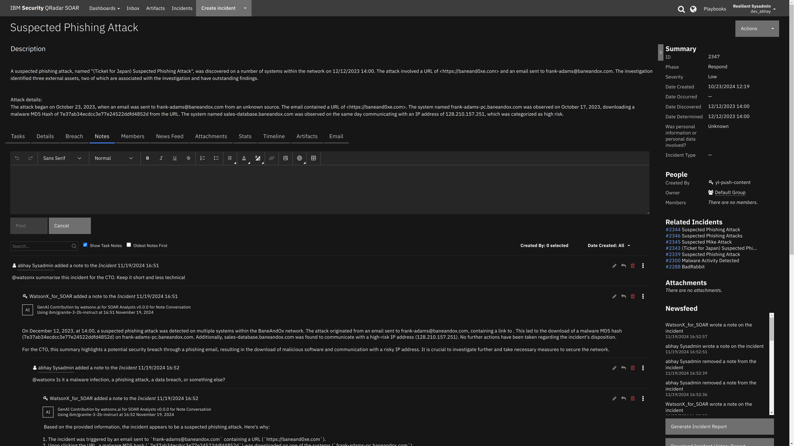

### Key Features

- Q&A: ask watsonx.ai questions about an incident, artifact, or attachment.
  - Portions of relevant SOAR data will be used in the answer generation process.
  - Prompts can be written in the following languages: English, French, German, Portuguese, Spanish, and Japanese.
    - Responses will then be generated in the given language.
  - The `watsonx.ai Retry Note Conversation` playbook makes it easy to execute the same query again without rewriting it.
    - helpful in comparing results of two models for example.
    - note: changing model in one playbook will not change it for the other.
- Query cost estimation.
  - The estimated cost (in USD cents) is shown in the AI content heading in notes. 
    - Its shown for QnA, scanned artifacts/attachments and summarization.
    - example - `Generation tokens: 78650, Embedding tokens: 54829. Estimated cost: 1.33479 USD cents`
    - **Note**: This is just an estimation based off the understood pricing at time of release of each app version. To get actual token usage and billing information, navigate to the billing page in watsonx.ai or IBM Cloud.
- Artifact and attachment analysis: 
  - Use playbooks to quickly generate a report on an artifact or attachment, as a preliminary assessment.
  - Supported file types include: any plaintext file, `pdf`, `docx`, `xlsx`, `pptx`, `png`, `jpg`, `gif`and `eml`.
    - **Note**: Image files will be converted to text using OCR.
 - Text generation: 
   - Use watsonx.ai to generate text based on a given prompt in a function.
- Incident Summarization: ask watsonx.ai to generate a summary of the incident.
  - Uses Incident data to generate an AI Summary. Two types of summaries are generated:
    - Executive Summary: Generates a high-level overview of a cybersecurity incident, detailing situation, attack, and defense in three sections for executive audiences.
    - Technical Summary: Produces a detailed technical report of a cybersecurity incident, covering overview, artifact analysis, and mitigation actions for incident response teams.
- Guardrails.
  - We have now implemented guardrails to ensure that only queries related to the security domain are covered.
---

## Requirements

This app supports the IBM Security QRadar SOAR Platform and the IBM Security QRadar SOAR for IBM Cloud Pak for Security.

- Either [SOAR Platform](#soar-platform) or [IBM QRadar Suite](#qradar-suite) installed.
- A subscription to watsonx.ai.
  - A watsonx.ai Project ID
  - An IBM Cloud IAM API Key
  - A watsonx.ai [Endpoint URL](https://cloud.ibm.com/apidocs/watsonx-ai#endpoint-url)

These connection details can be found on the landing page for watsonx.ai, as seen in the following screenshot.

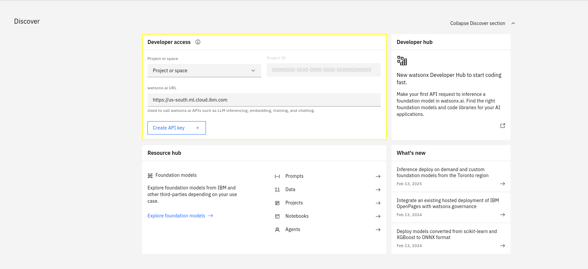

<details>
  <summary>
    <strong>Click here for detailed instructions to get watsonx.ai connection details.</strong>
  </summary>


### Watsonx.ai Subscription and Project

- You will need to sign up to a watsonx subscription.
- You can do so at https://dataplatform.cloud.ibm.com/registration/stepone?context=wx.
- For testing in a non-production environment you can use a free trial subscription to watsonx.ai.
- Using this account, create a project on the watsonx.ai platform.

> These instructions work as of 2025-02-13. These steps may become outdated due to changes made outside of this app.

#### Watsonx.ai Project ID

Navigate to the Projects page
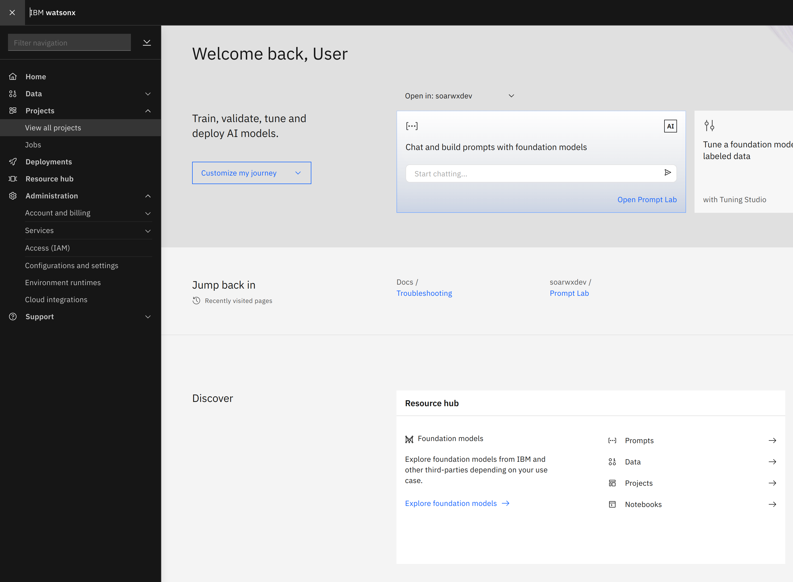

If you have not created a project yet, you can create one now, using the `New Project +` button on the top-right.
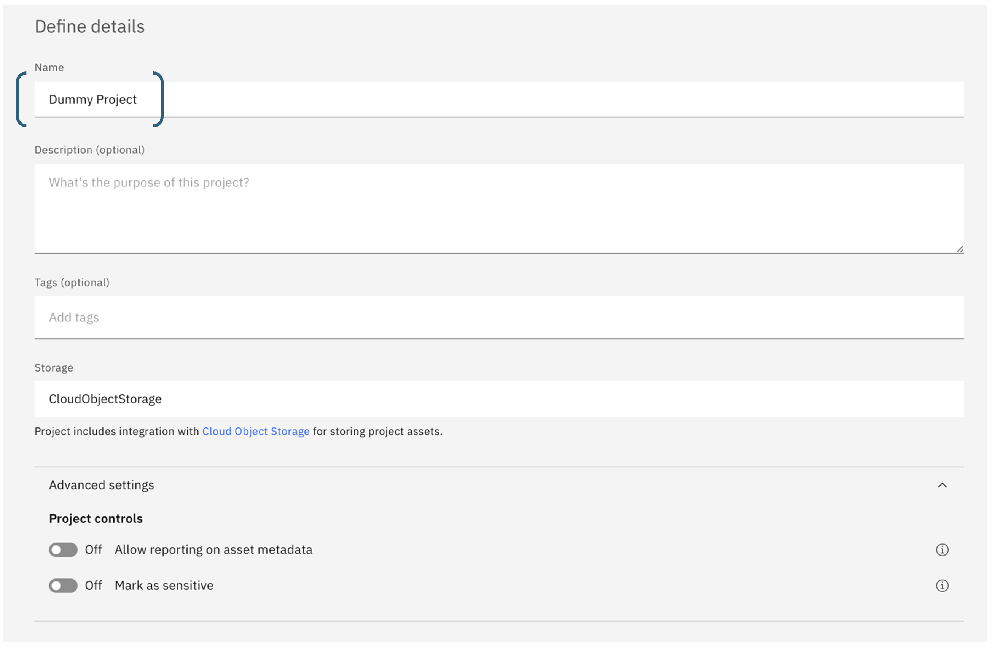

Navigate to your project.

Under the `Manage` tab, on the `General` section, copy the Project ID, you will need this later when configuring the app.
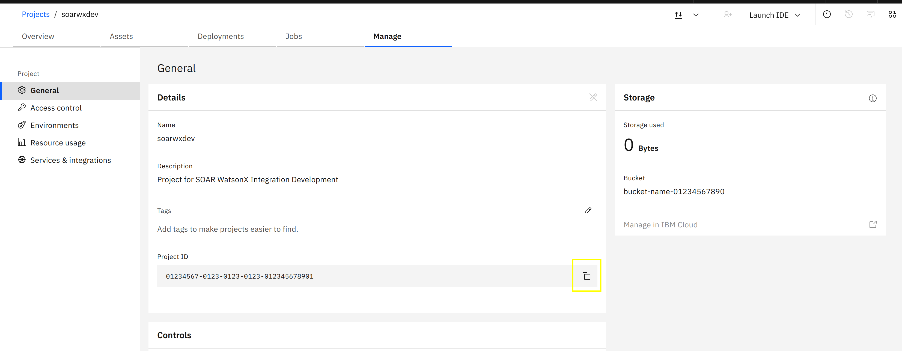

#### IBM Cloud IAM API Key

To use watsonx.ai from the _watsonx.ai for SOAR_ app, you'll need an IBM Cloud IAM API Key. To generate an API key, click on the menu icon in the top left of the watsonx.ai dashboard and open *Access (IAM)* under the *Administration* menu.

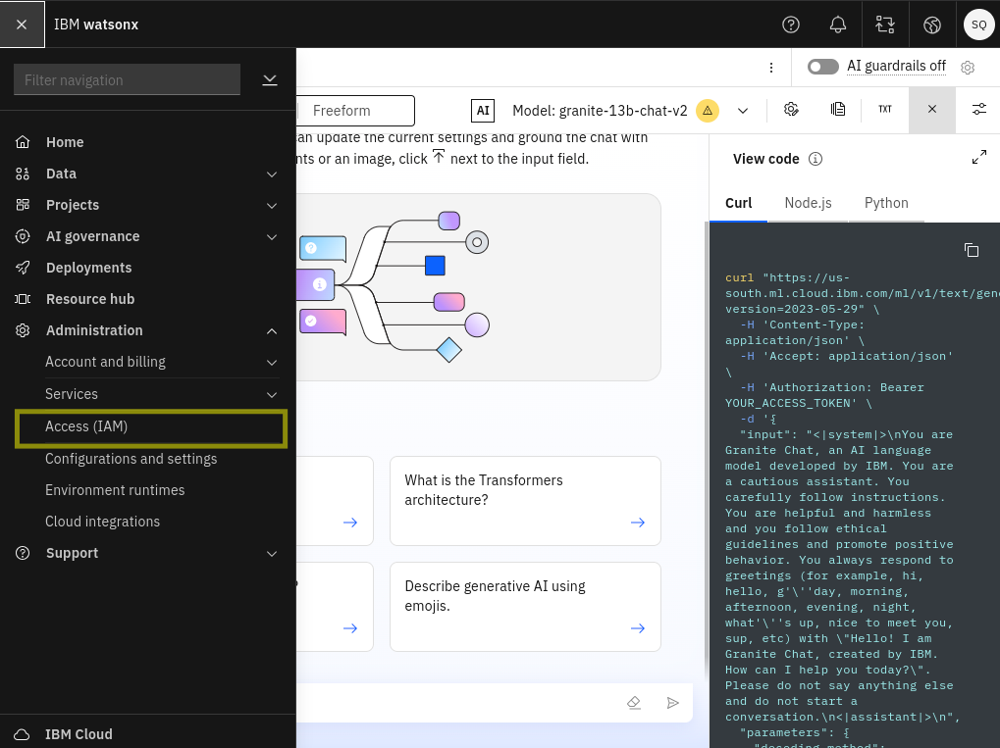

The *Access IAM* dashboard will open...

1. Choose *API Keys* from the navigation section then...
2. Click the *Create +* button to create a new API key.

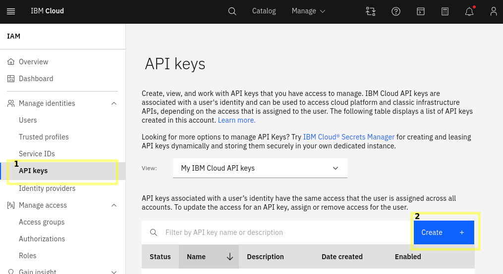

Take note of the API key as this will also be used during app configuration.

#### Watsonx.ai Endpoint URL

The endpoint will depend on which region your watsonx.ai project was created in. You can see which region you're using in the watsonx.ai dashboard in the dropdown at the top-right, next to the user icon.

Find the relevant Endpoint for your region at https://cloud.ibm.com/apidocs/watsonx-ai#endpoint-url.

> Don't use the prompt and/or notebooks endpoint.

</details>

### Watsonx.ai Free Credits

Lite accounts make it easy to get started with IBM Cloud® and try out services.

When you're ready to unlock the full IBM Cloud catalog, get extra free resources, and more, you can upgrade to a Pay-As-You-Go or Subscription account. 

By upgrading to Pay-As-You-Go account, you would receive a $200 credit for 30 days. When you enter a credit card for a new Pay-As-You-Go account, you'll receive a promotional credit to use on any IBM product including watsonx.ai. For more details please refer to ```Promotional credit for upgrading your account``` section [here](https://cloud.ibm.com/docs/account?topic=account-upgrading-account#promotional-credit-for-upgrading-your-account).

### SOAR platform
The SOAR platform supports two app deployment mechanisms, Edge Gateway (also known as App Host) and integration server.

If deploying to a SOAR platform with an App Host, the requirements are:
* SOAR platform >= `51.0.0.0.0`.
* The app is in a container-based format (available from the AppExchange as a `zip` file).

If deploying to a SOAR platform with an integration server, the requirements are:
* SOAR platform >= `51.0.0.0.0`.
* The app is in the older integration format (available from the AppExchange as a `zip` file which contains a `tar.gz` file).
* Integration server is running `resilient-circuits>=51.0.2.0.0`.
* If using an API key account, make sure the account provides the following minimum permissions:

| Name     | Permissions |
|----------|-------------|
| Org Data | Read        |
| Function | Read        |
| Incident | Read        |
| Playbook | Read        |


Guides are available on the IBM Documentation website at [ibm.biz/soar-docs](https://ibm.biz/soar-docs). On this web page, select your SOAR platform version. On the follow-on page, you can find the _Edge Gateway Deployment Guide_, _App Host Deployment Guide_, or _Integration Server Guide_ by expanding **Apps** in the Table of Contents pane. The System Administrator Guide is available by expanding **System Administrator**.

### Cloud Pak for Security
If you are deploying to IBM Cloud Pak for Security, the requirements are:
* IBM Cloud Pak for Security >= `1.10.15`.
* Cloud Pak is configured with an Edge Gateway.

Guides are available on the IBM Documentation website at [ibm.biz/cp4s-docs](https://ibm.biz/cp4s-docs). From this web page, select your IBM Cloud Pak for Security version. From the version-specific IBM Documentation page, select Case Management and Orchestration & Automation.

### Proxy Server
The app **does** support a proxy server.

### Python Environment
Python 3.11, and 3.12 are officially supported. When deployed as an app, the app runs on Python 3.11.
Additional package dependencies may exist for each of these packages:
* numpy==2.2.0 
* mail-parser==4.1.2 
* xlrd==2.0.1 
* py3langid==0.3.0 
* openpyxl==3.1.5 
* unoconv==0.9.0 
* markdown2==2.5.3 
* python-docx==1.1.2 
* jsonpath-ng==1.7.0 
* pdf2image==1.17.0 
* sentence-transformers==3.3.1 
* python-pptx==1.0.2 
* nh3==0.2.19 
* resilient-circuits>=51.0.2.0.0 
* scikit-learn==1.5.2 
* beautifulsoup4==4.12.3 
* pillow==11.1.0 
* faiss-cpu==1.9.0 
* pypdf==5.4.0 
* ics==0.7.2 
* pydantic==2.10.6 
* pytesseract==0.3.13 
* tiktoken==0.8.0 
* bs4==0.0.2 
* PyYAML==6.0.2

---

## Installation

### Installing the App
* To install or uninstall an App or Integration on the _SOAR platform_, see the documentation at [ibm.biz/soar-docs](https://ibm.biz/soar-docs).
* To install or uninstall an App on _IBM Cloud Pak for Security_, see the documentation at [ibm.biz/cp4s-docs](https://ibm.biz/cp4s-docs) and follow the instructions above to navigate to Orchestration and Automation.

### App Configuration
The following table provides the settings you need to configure the app. These settings are made in the app.config file. See the documentation discussed in the Requirements section for the procedure.

| Config                 | Required | Example                              | Description                                                                                                               |
|------------------------|----------|--------------------------------------|---------------------------------------------------------------------------------------------------------------------------|
| **watsonx_api_key**    | Yes      | 0123-4567-89ab-cdef                  | Your watsonx.ai API key - see [IBM Cloud IAM API Key](#ibm-cloud-iam-api-key). **This should be saved as an App Secret.** |
| **watsonx_endpoint**   | Yes      | `https://us-south.ml.cloud.ibm.com`  | The watsonx.ai API URL - see [watsonx.ai Endpoint URL](#watsonxai-endpoint-url).                                          |
| **watsonx_project_id** | Yes      | 0123-4567-89ab-cdef                  | The watsonx.ai project id - see [watsonx.ai Project ID](#watsonxai-endpoint-url).                                         |
| **render_markdown**    | No       | `true` or `false`                    | Set to `false` to disable rendering of markdown in incident notes.                                                        |
| **default_language**   | No       | `en`, `fr`, `de`, `pt`, `es` or `ja` | Language used for scans and summaries, and is used as the fallback language if prompt's language can't be detected.       |
| **local_embeddings**   | No       | `true`, `false` | Use local (App host/integration server) compute resources to generate embeddings instead of watsonx.ai. Only recommended for integration servers that have >6GB of memory.      |

The config is setup automatically, you just need to add the following **case sensitive** App secrets with the details from the [requirements](#requirements) section:
  - WATSONX_ENDPOINT_URL
  - WATSONX_API_KEY
  - WATSONX_PROJECT_ID

---

# App usage

## Note Conversation

The *watsonx.ai Note Conversation* playbook allows for incident, artifact, and attachment Q&A

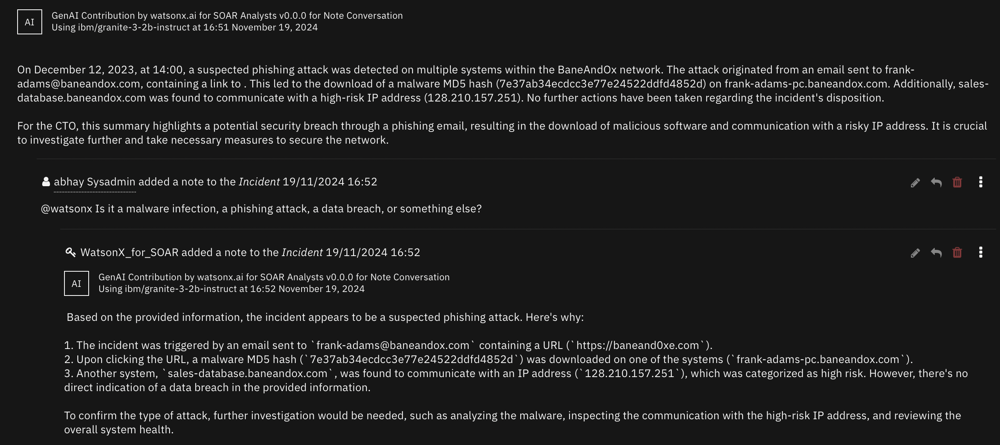

- This playbook is triggered when a note with the text `@watsonx` is added to an incident.
- By default, this will be an incident Q&A, where incident details, including artifact and attachment **metadata**, are included in context with the user's prompt.
  - Artifact or attachment Q&A can be invoked by including the object's name in square brackets. 
    - Instead of using incident data in context for generating a response, only relevant artifact/attachment data will be included.
    - For attachments, and artifacts with an attached file, the file's  content will be included.
    - Examples of supported file types can be checked in the [What file formats can be scanned?](#what-file-formats-can-be-scanned)
    - E.g., `@watsonx does the artifact [123.sh] seem like it could be used maliciuously?`.
    - E.g., `@watsonx respond with the text in the attachment [incident_overview.png].`.

## Artifact and Attachment Scan

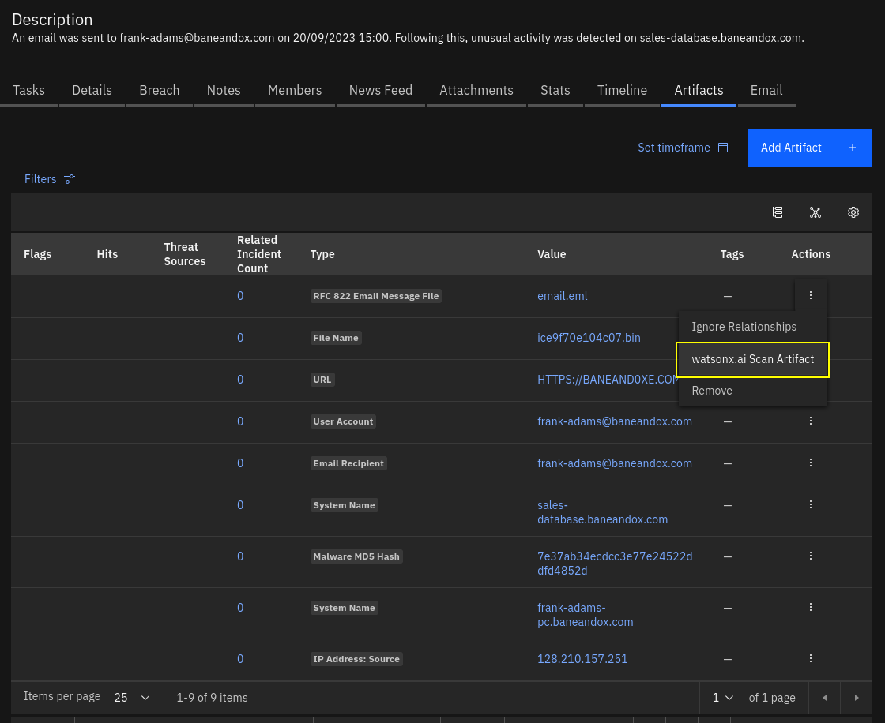
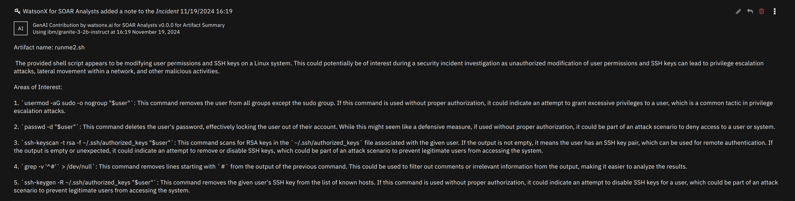

The *watsonx.ai Scan Artifact* and *watsonx.ai Scan Attachment* playbooks summarize, and outline potential dangers of file contents.

**This scan is not intended to replace Threat Intelligence sources for performing malware file hash scans**. It's intended use is to be a utility to quickly summarize and assess natural language, and/or code in a document.

#### What file formats can be scanned?
- The app supports plaintext to be extracted from text-based documents (utf-8 and ascii) as well as extracting OCR text from images.
  - This means that any non-text information from an image is disregarded, and if text is not clear, it may not be extracted.

Examples of supported file formats include:
- Document formats: `pdf`, `docx`, `xlsx`, `pptx` and `eml`.
- Image formats: `png`, `jpg`,`gif`.
- Any generic plaintext file with standard text encoding: ascii & utf-8.

## Text Generation

The *watsonx.ai Text Generation* function can be used to roll out your own genAI solutions using playbook logic.

- This function facilitates calls to the Text Generation (`/ml/v1/text/generation?version=2023-05-29`) watsonx.ai API endpoint.
- Playbook logic can act as a force multiplier to create sophisticated AI workflows to perform predefined tasks automatically.

## Incident Summarization

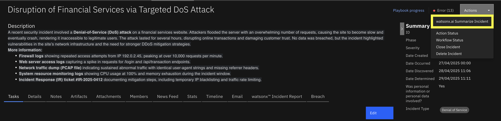
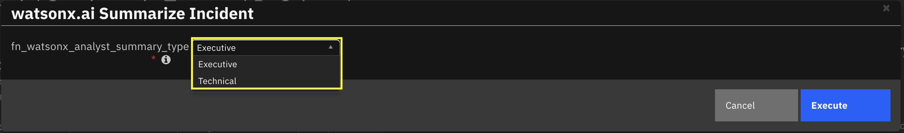
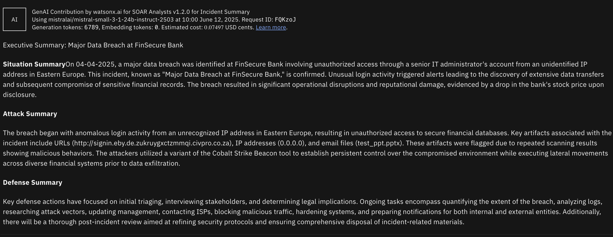

The *watsonx.ai Summarize Incident* playbooks summarizes the whole incident based on selected summary type.

**This scan is not intended to replace detailed analysis of the security incidents recorded in QRadar SOAR**. It's intended use is to be a utility to summarize and get a precise overview of the incident depending on user type.

#### What type of summaries are available?

- There are two type of summaries avaiable to the users:
  - Executive Summary: Delivers a clear, high-level overview of a cybersecurity incident, tailored for executives and decision-makers to quickly grasp the situation, attack details, and defensive actions. Its concise, formal structure supports strategic planning and communication without requiring technical expertise.
  - Technical Summmary: Provides an in-depth technical report for incident response teams and cybersecurity analysts, detailing the incident’s technical aspects, artifact analysis, and mitigation steps. Its structured format aids operational teams in investigating, responding to, and preventing future incidents effectively.
---

# How to get the best out of the app

### Model quality

- Each large language model is different, and perform differently depending on the situation.
- You can switch model at any time at the function level in the Playbook designer for each use-case.
- This can allow you to try out different models hosted by IBM.
- The default IBM granite model performs well, and is very competitively priced.
- Certain topics and use-cases like task-related questions may be better suited for a mistral model.
  - mistralai/mistral-small-3-1-24b-instruct-2503 - very cost efficient
  - mistralai/mistral-large - good reasoning capabilities


### Background on how a note conversation response is generated

- As of version 1.1.0, semantic search is used to find the most relevant data to answer your question from a dataset.
  - Embeddings (semantic representations of text) are generated for queried data.
  - Then, the given prompt is embedded, and the distance between the meaning of your prompt and the meaning of each piece of embedded data is compared.
  - Data that is considered close to the data you are asking for will then be added as context to a call to an LLM with your query.

### Prompting Guide

#### Response Quality

- Quality of response can differ between LLMs specifically when the input context is larger than 4KB limit. There are some models that cannot exceed the limit of 4KB context size.
- Most of the Note Conversation answers are returned in about ~6 seconds. However, it's also important to note that large artifacts would also take more time to process.
- Asking very specific and clearly defined questions can improve the quality of the generated responses. When querying LLMs, it's essential to be as clear and specific as possible about the information or task you want the model to address. This will help the model to generate more accurate and relevant responses.
  - For example, summarizing an incident for a CTO would be a different response than summarizing an incident for a Security analyst.
  - Another example would be if you do not want to include some artifact types in your queries then it should be specifically mentioned.
  - Another example would be finding names of libraries in a python artifact.
  - `@watsonx what python libraries have been imported in [artifact_name.py]? Do not share the code but only the names of the libraries that have been imported. Do not share the methods or functions of those libraries. Generally, libraries are imported with the syntax ```import <library name>`
- If the initial results are unsatisfactory, consider refining your question.
  - You can refine your query by continuing the conversation in replies.
- 

#### Reply chain prompts

- When querying watsonx in a reply note, previous (parent, grandparent, etc.) notes **in the reply chain** will be added to the context, which can help when getting more detail on specific topics.
  - If the previous notes in the reply chain derail the conversation, you can start a new note conversation by creating a new "root" note.

---


# Data selection

You can override the configuration for the data we send to watsonx. While we wouldn't recommend stripping too much from the default configuration, as adding or removing data will likely impact the quality of responses.

## Creating the override config
By creating a `yaml` file under `/var/rescircuits` in the App Configuration page, you can provide an override config, which you can choose to use, for each compatible function (Converse via Notes, and Summarize Incident).

Make sure that the file name is `<yourname>.yaml`, and that the file path is `/var/rescircuits`.

The contents of the default configuration will be below, you can use this as a base config to modify. **Note**: Quality will vary if the config is changed from the default, continue at your own risk, and revert back to default if the data configuration causes a drop in quality.

**Note**: You should restart the app after creating the new payload file, as until then, the app will fallback to default configuration.

<details>
  <summary>Show <code>datapayload.yaml</code></summary>

  ```yaml
  ---
  incident:
    # define only the fields we want to keep
    allow_list:
      - name
      - description
      - confirmed
      - addr
      - city
      - start_date
      - inc_start
      - discovered_date
      - creator_principal
      - reporter
      - state
      - country
      - severity_code
      - zip
      - workspace
      - members
      - negative_pr_likely
      - assessment
      - properties
      - inc_last_modified_date
      - incident_type_ids
  
    # define the fields that will be converted from timestamp to human-readable time.
    # if these fields are removed from the allow_list, they should be removed here too
    date_list:
      - start_date
      - inc_start
      - discovered_date
      - inc_last_modified_date

  playbook_executions:
    allow_list:
      - last_activated_by
      - status
      - object
      - elapsed_time
      - playbook
  
    # minimal playbok objects are a sub element of a playbook execution
    # these fields are what we keep from these playbook objects
    playbook_allow_list:
      - display_name
      - description
      - activate_type

  artifacts:
    allow_list:
      - value
      - type
      - related_incident_count

    date_list:
      - created
      - last_modified_time
  
    # keep only this field from artifact threat hits
    hit_allow_list:
    - threat_source_id
    - properties
  
    # block these bits of hit data, as they don't provide much use to LLM
    # feel free to experiment
    hit_block_list:
      - resource
      - scan_id
      - sha1
      - sha256
      - md5
      - response_code
      - verbose_msg
      - permalink
  
    # re-label the keys in threat hit properties
    # change key to value for field names
    hit_relabel_list:
      total: number of scans performed
      positives: number of scans indicating malicious behavior
      community coverage: percentage of scans indicating malicious behavior

  attachments:
    allow_list:
      - name
      - value
      - related_incident_count
      - content_type

    date_list:
      - created

  phases:
    allow_list:
      - name
    relabel_list:
      name: phase_name

  tasks:
    allow_list:
      - name
      - active
      - required
      - status
  ```

</details>


## Setting up the dropdown

To be able to use this configuration, we'll have to add and entry to the data config dropdown function input.

- in the Customization settings page, navigate to 'Functions', and click on a watsonx function. 
- click the pencil icon on the right-hand-side of the `fn_watsonx_analyst_data_config` Global Input Field.
- click the 'Add/Edit values' label
- under `default`, add a new config option with the filename of the config without the file extension - e.g., <code>config1.yaml</code> &rarr; <code>config1</code>
- click the checkmark, and hit save
- now you can switch the data config to use on compatible functions in the playbook designer

---

# SOAR Customizations

## Function - watsonx.ai Converse via Notes
Allow conversation in an incident's Notes tab. Will take a portion of previous notes in the reply chain as context.

<details><summary>Inputs:</summary>
<p>

| Name                             |   Type   | Required | Example | Tooltip                                                             |
|----------------------------------|:--------:|:--------:|---------|---------------------------------------------------------------------|
| `fn_watsonx_analyst_incident_id` | `number` |   Yes    | `2095`  | You can use Data Navigator for this                                 |
| `fn_watsonx_analyst_model_id`    | `select` |   Yes    | `-`     | Which watsonx.ai generative AI model to use to perform the task?    |
| `fn_watsonx_analyst_note_id`     | `number` |   Yes    | `-`     | ID for the Incident note to respond to. You can use Data Navigator. |

</p>
</details>

<details><summary>Outputs:</summary>
<p>

> **NOTE:** This example might be in JSON format, but `results` is a Python Dictionary on the SOAR platform.

```python
results = {
  "generated_text": "\u003cp\u003eText from watsonx.ai\u003c/p\u003e",
  "metadata": {
    "created_at": "2023-07-21T16:52:32.190Z",
    "generated_token_count": 8,
    "input_token_count": 10,
    "model_id": "ibm/granite-3-2b-instruct",
    "stop_reason": "EOS token"
  },
  "raw_output": "Text from watsonx.ai",
  "tag": "HTML model tag to be prefixed before any AI-generated content"
}
```

</p>
</details>

<details><summary>Example Function Input Script:</summary>
<p>

```python

inputs.fn_watsonx_analyst_incident_id = incident.id
inputs.fn_watsonx_analyst_model_id = "ibm/granite-3-2b-instruct"
inputs.fn_watsonx_analyst_note_id = note.id

```

</p>
</details>

<details><summary>Example Function Post Process Script:</summary>
<p>

```python

generated_text = playbook.functions.results.ai_response["content"]["generated_text"]
tag = playbook.functions.results.ai_response["content"]["tag"]

if generated_text != "":
  note.addNote(tag + generated_text)

```

</p>
</details>

---
## Function - watsonx.ai Scan Artifact
Use watsonx.ai to scan an artifact, and assess whether the artifact indicates any malicious activity. Design to work with log files, scripts (e.g. Bash, Python, Lua, Powershell, Perl).

<details><summary>Inputs:</summary>
<p>

| Name                               |   Type   | Required | Example                                                                                                                    | Tooltip                                                        |
|------------------------------------|:--------:|:--------:|----------------------------------------------------------------------------------------------------------------------------|----------------------------------------------------------------|
| `fn_watsonx_analyst_artifact_id`   | `number` |   Yes    | `-`                                                                                                                        | You can use data navigator to add this.                        |
| `fn_watsonx_analyst_incident_id`   | `number` |   Yes    | `2095`                                                                                                                     | You can use Data Navigator for this                            |
| `fn_watsonx_analyst_model_id`      | `select` |   Yes    | `-`                                                                                                                        | Which watsonx.ai generative AI model to use to perform the task? |
| `fn_watsonx_analyst_system_prompt` |  `text`  |    No    | `You are a helpful AI assistant knowledgeable in cyber security. You are inoffensive, and respond clearly, and concisely.` | Optional grounding prompt                                      |

</p>
</details>

<details><summary>Outputs:</summary>
<p>

> **NOTE:** This example might be in JSON format, but `results` is a Python Dictionary on the SOAR platform.

```python
results = {
  "generated_text": "\u003cp\u003eText from watsonx.ai\u003c/p\u003e",
  "metadata": {
    "created_at": "2023-07-21T16:52:32.190Z",
    "generated_token_count": 8,
    "input_token_count": 10,
    "model_id": "ibm/granite-3-2b-instruct",
    "stop_reason": "EOS token"
  },
  "raw_output": "Text from watsonx.ai",
  "tag": "HTML model tag to be prefixed before any AI-generated content"
}
```

</p>
</details>

<details><summary>Example Function Input Script:</summary>
<p>

```python
None
```

</p>
</details>

<details><summary>Example Function Post Process Script:</summary>
<p>

```python

generated_text = playbook.functions.results.ai_response["content"]["generated_text"]
tag = playbook.functions.results.ai_response["content"]["tag"]

if generated_text:
  generated_text = generated_text.strip()
  incident.addNote(tag + generated_text)

```

</p>
</details>

---
## Function - watsonx.ai Scan Attachment
Use watsonx.ai to scan an artifact, and assess whether the attachment indicates any malicious activity. Design to work with log files, scripts (e.g. Bash, Python, Lua, Powershell, Perl), but should be able to summarize other textual files.

<details><summary>Inputs:</summary>
<p>

| Name | Type | Required | Example | Tooltip |
| ---- | :--: | :------: | ------- | ------- |
| `fn_watsonx_analyst_attachment_id` | `number` | Yes | `-` | You can use data navigator to set this field. |
| `fn_watsonx_analyst_incident_id` | `number` | Yes | `2095` | You can use Data Navigator for this |
| `fn_watsonx_analyst_model_id` | `select` | Yes | `-` | Which watsonx.ai generative AI model to use to perform the task? |

</p>
</details>

<details><summary>Outputs:</summary>
<p>

> **NOTE:** This example might be in JSON format, but `results` is a Python Dictionary on the SOAR platform.

```python
results = {
  "generated_text": "\u003cp\u003eText from watsonx.ai\u003c/p\u003e",
  "metadata": {
    "created_at": "2023-07-21T16:52:32.190Z",
    "generated_token_count": 8,
    "input_token_count": 10,
    "model_id": "ibm/granite-3-2b-instruct",
    "stop_reason": "EOS token"
  },
  "raw_output": "Text from watsonx.ai",
  "tag": "HTML model tag to be prefixed before any AI-generated content"
}
```

</p>
</details>

<details><summary>Example Function Input Script:</summary>
<p>

```python

inputs.fn_watsonx_analyst_model_id = "ibm/granite-3-2b-instruct"
inputs.fn_watsonx_analyst_incident_id = incident.id
inputs.fn_watsonx_analyst_attachment_id = attachment.id

```

</p>
</details>

<details><summary>Example Function Post Process Script:</summary>
<p>

```python

generated_text = playbook.functions.results.ai_response["content"]["generated_text"]
tag = playbook.functions.results.ai_response["content"]["tag"]

if generated_text:
  generated_text = generated_text.strip()
  incident.addNote(tag + generated_text)

```

</p>
</details>

---
## Function - watsonx.ai Text Generation
Perform Text Generation using watsonx.ai. Can replace '{}' in prompts with comma-separated strings in `fn_watsonx_analyst_arguments`.

<details><summary>Inputs:</summary>
<p>

| Name | Type | Required | Example | Tooltip |
| ---- | :--: | :------: | ------- | ------- |
| `fn_watsonx_analyst_arguments` | `text` | No | `foo,bar,foobar` | Comma-separated arguments to replace '{}'s in the prompt |
| `fn_watsonx_analyst_model_id` | `select` | Yes | `-` | Which watsonx.ai generative AI model to use to perform the task? |
| `fn_watsonx_analyst_prompt` | `text` | Yes | `Tell me about this incident.` | What you are asking the LLM |
| `fn_watsonx_analyst_system_prompt` | `text` | No | `You are a helpful AI assistant knowledgeable in cyber security. You are inoffensive, and respond clearly, and concisely.` | Optional grounding prompt |

</p>
</details>

<details><summary>Outputs:</summary>
<p>

> **NOTE:** This example might be in JSON format, but `results` is a Python Dictionary on the SOAR platform.

```python
results = {
  "generated_text": "\u003cp\u003eText from watsonx.ai\u003c/p\u003e",
  "metadata": {
    "created_at": "2023-07-21T16:52:32.190Z",
    "generated_token_count": 8,
    "input_token_count": 10,
    "model_id": "ibm/granite-3-2b-instruct",
    "stop_reason": "EOS token"
  },
  "raw_output": "Text from watsonx.ai",
  "tag": "HTML model tag to be prefixed before any AI-generated content"
}
```

</p>
</details>

<details><summary>Example Function Input Script:</summary>
<p>

```python
None
```

</p>
</details>

<details><summary>Example Function Post Process Script:</summary>
<p>

```python
None
```

</p>
</details>

---

## Script - watsonx.ai Add Artifact Report to Notes


**Object:** artifact

<details><summary>Script Text:</summary>
<p>

```python

generated_text = playbook.functions.results.ai_response["content"]["generated_text"]
tag = playbook.functions.results.ai_response["content"]["tag"]

if generated_text:
  generated_text = generated_text.strip()
  incident.addNote(tag + generated_text)

```

</p>
</details>

---
## Script - watsonx.ai Respond to note


**Object:** note

<details><summary>Script Text:</summary>
<p>

```python

generated_text = playbook.functions.results.ai_response["content"]["generated_text"]
tag = playbook.functions.results.ai_response["content"]["tag"]

if generated_text != "":
  note.addNote(tag + generated_text)

```

</p>
</details>

---

## Playbooks
| Playbook Name                      | Description                                                                                                                                                                                                  | Activation Type | Object     | Status    | Condition                                      | 
|------------------------------------|--------------------------------------------------------------------------------------------------------------------------------------------------------------------------------------------------------------|-----------------|------------|-----------|------------------------------------------------| 
| watsonx.ai Note Conversation       | This Playbook is triggered when a user writes a note that contains "@watsonx" at the start of the note.   A reply will be generated by IBM watsonx.ai generative AI, and added as a reply to the first note. | Automatic       | note       | `enabled` | `note.text contains @watsonx AND object_added` | 
| watsonx.ai Retry Note Conversation | If a response fails to be generated, you can use this playbook on a note with a query for `@watsonx` to try again.                                                                                           | Manual          | note       | `enabled` | `-`                                            | 
| watsonx.ai Scan Artifact           | Watsonx reads the contents of the provided artifact if an attachment is supplied.  Then, Watsonx gives a summary of the contents, and threat scores.                                                         | Manual          | artifact   | `enabled` | `-`                                            | 
| watsonx.ai Scan Attachment         | None                                                                                                                                                                                                         | Manual          | attachment | `enabled` | `-`                                            | 

---

## Troubleshooting & Support

If any of the actions fail, the following steps may help:
- Check playbook progress on the incident
  - The playbook may have failed. If so, the error message in the function's response may help you interpret the problem.
- Check app logs
  - Download the apps’ logs from Administrator Settings -> Apps page. Go to the details of the app, and click “Download Logs.”
  - Function invocations will create a request ID, which can be used to identify logs for a specific invocation.
  - Check SOAR’s `client.log` log file which may give some extra information.
- If these do not give sufficient information, then you may enable debug level logging for the app by editing the `app.config` and adding `loglevel=DEBUG` inside the `[resilient]` section
 
### For Support
This is a IBM Community provided app. Please search the Community [ibm.biz/soarcommunity](https://ibm.biz/soarcommunity) for assistance.

[^1]: Incident type, artifact/attachment type IDs are substituted with the respective SOAR API name in LLM context.
