# IBM QRadar SOAR Response Assistant 

<!-- TOC -->
- [IBM QRadar SOAR Response Assistant](#ibm-qradar-soar-response-assistant)
  - [Release Notes](#release-notes)
  - [Overview](#overview)
    - [Key Features](#key-features)
  - [Requirements](#requirements)
    - [Watsonx.ai Subscription and Project](#watsonx-ai-subscription-and-project)
      - [Watsonx.ai Project ID](#watsonx-ai-project-id)
      - [IBM Cloud IAM API Key](#ibm-cloud-iam-api-key)
      - [Watsonx.ai Endpoint URL](#watsonx-ai-endpoint-url)
    - [Watsonx.ai Free Credits](#watsonx-ai-free-credits)
    - [SOAR platform](#soar-platform)
    - [Cloud Pak for Security](#cloud-pak-for-security)
    - [Proxy Server](#proxy-server)
    - [Python Environment](#python-environment)
  - [Installation](#installation)
    - [Installing the App](#installing-the-app)
    - [App Configuration](#app-configuration)
- [App usage](#app-usage)
  - [Artifact and Attachment Analysis](#artifact-and-attachment-analysis)
      - [What file formats can be scanned?](#what-file-formats-can-be-scanned)
  - [Incident Summarization](#incident-summarization)
      - [What type of summaries are available?](#what-type-of-summaries-are-available)
  - [Playbook Execution Summary](#playbook-execution-summary)
  - [Text Generation](#text-generation)
- [How to get the best out of the app](#how-to-get-the-best-out-of-the-app)
    - [Model quality](#model-quality)
    - [Prompting Guide](#prompting-guide)
      - [Response Quality](#response-quality)
- [Data selection](#data-selection)
  - [Custom incident properties](#custom-incident-properties)
  - [Creating the override config](#creating-the-override-config)
  - [Setting up the dropdown](#setting-up-the-dropdown)
- [Troubleshooting \& Support](#troubleshooting--support)
  - [For Support](#for-support)
<!-- TOC -->

---

## Release Notes

| Version | Date    | Notes                                                                                                                                                                                             |
|---------|---------|---------------------------------------------------------------------------------------------------------------------------------------------------------------------------------------------------|
| 2.0.0   | 08/2026 | <ul><li>Changed name to IBM QRadar SOAR Response Assistant.</li><li>Compatibility is tied to minimum SOAR 51.0.11.0+.</li><li>Note conversations have been replaced with an integrated User Interface, Playbooks now add AI insights directly to the object.</li><li>Test Configuration action saves configured watsonx API connection details to SOAR backend.</li><li>Playbook Execution Summary feature has been added.</li> |  
| 1.2.3   | 06/2026 | Updated model list, improved security safeguards by limiting text extraction from binary file types.                                                                                       |
| 1.2.2   | 02/2026 | Support for new chat models (e.g., IBM's granite-4-h-small, OpenAI's gpt-oss, etc.). Embedding model now configurable. Fix for mistral models outputting [INST]. Workspace names will be known to the assistant in incident Q&A, and incident summary. |  
| 1.2.1   | 01/2026 | Data payload config can control individual incident properties. Fix for failing to extract contents from plaintext files.                                                                         |
| 1.2.0   | 06/2025 | Incident summary playbook, support for artifact/attachment scans on images and non-file artifacts, token usage & estimated cost (in USD cents) in all scans and summaries, data ingestion optimisation and user-customization feature, japanese language inclusion and prompt optimisations. |
| 1.1.1   | 06/2025 | Updated model list, rich text whitespace fixes, playbook execution API fixes, improved stability in generating embeddings, minor change to scan playbooks' activation form.                       |
| 1.1.0   | 02/2025 | Semantic context retrieval (embeddings), multilingual prompts, artifact scans can handle more file types, attachment scanning (equivalent to artifact scan), organization type ID resolution[^1]. |
| 1.0.2   | 12/2024 | Rich text output, request ID in logs, and a data processing fix for incidents with larger data.                                                                                                   |
| 1.0.1   | 12/2024 | Bugfix for SOAR versions <= 51.0.2.1 and >= 51.0.4.1 for Note Conversation Function.                                                                                                              |
| 1.0.0   | 12/2024 | Initial "**Early Access**" release. Uses watsonx.ai SaaS Version `2023-05-29`                                                                                                                     |

---

## Overview

**Leverage generative AI with watsonx.ai for artifact analysis, incident and playbook execution summarization**

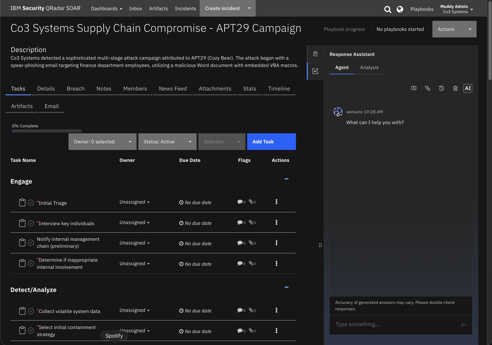

### Key Features

- Incident Summarization: ask watsonx.ai to generate a summary of the incident.
  - Uses incident data to generate an AI Summary. Two types of summaries are generated:
    - Executive Summary generates a high-level overview of a cybersecurity incident, detailing situation, attack, and defense in three sections for executive audiences.
    - Technical Summary produces a detailed technical report of a cybersecurity incident, covering overview, artifact analysis, and mitigation actions for incident response teams.
- Artifact and Attachment Analysis: 
  - Use playbooks to quickly generate a report on an artifact or attachment, as a preliminary assessment.
  - Supported file types include: any plaintext file and `.eml` files.
- Playbook Execution Summary:
  - Summarize the execution flow of an executed playbook, explain phases of the playbooks' progress and why certain pathways were taken.
- Text Generation: 
  - Use watsonx.ai to generate text based on a given prompt in a function.
- Guardrails:
  - Only queries related to the security domain are covered.

---

## Requirements

This app supports the IBM Security QRadar SOAR Platform operating on an App Host/Edge Gateway.

- [SOAR Platform](#soar-platform) version 51.0.11.0+ installed.
- A subscription to watsonx.ai with **watsonx.ai Runtime Service**.
  - A watsonx.ai Project ID
  - An IBM Cloud IAM API Key
  - A watsonx.ai [Endpoint URL](https://cloud.ibm.com/apidocs/watsonx-ai#endpoint-url)

These connection details can be found on the landing page for watsonx.ai, as seen in the following screenshot.

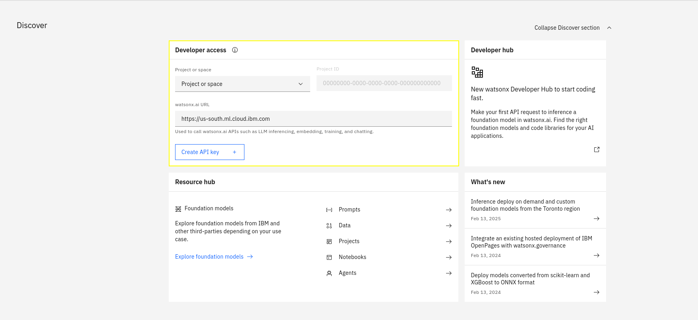

<details>
  <summary>
    <strong>Click here for detailed instructions to get watsonx.ai connection details.</strong>
  </summary>


### Watsonx.ai Subscription and Project

- You will need to sign up to a watsonx subscription.
- You can do so at https://dataplatform.cloud.ibm.com/registration/stepone?context=wx.
- For testing in a non-production environment you can use a free trial subscription to watsonx.ai.
- Using this account, create a project on the watsonx.ai platform.

> These instructions work as of 2026-08-25. These steps may become outdated due to changes made outside of this app.

#### Watsonx.ai Project ID

Navigate to the Projects page
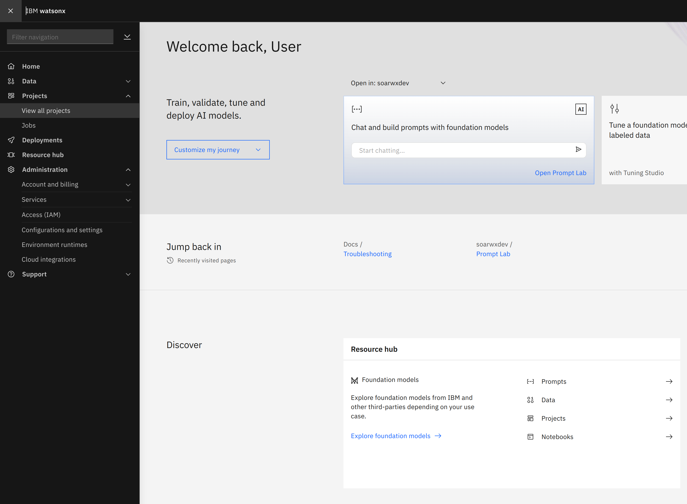

If you have not created a project yet, you can create one now, using the `New Project +` button on the top-right.
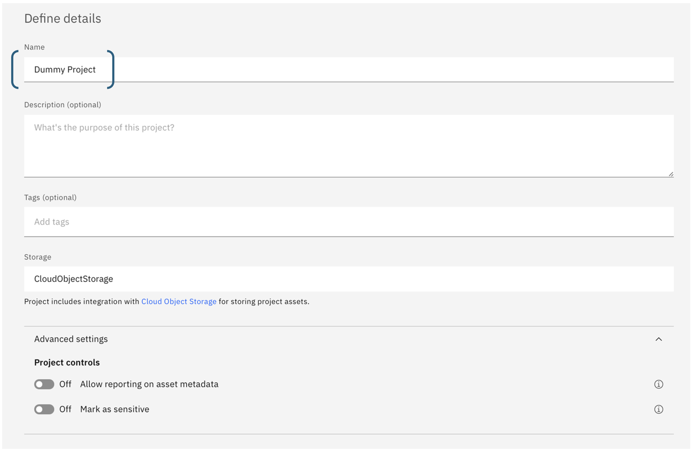

Navigate to your project.

Under the `Manage` tab, on the `General` section, copy the Project ID, you will need this later when configuring the app.
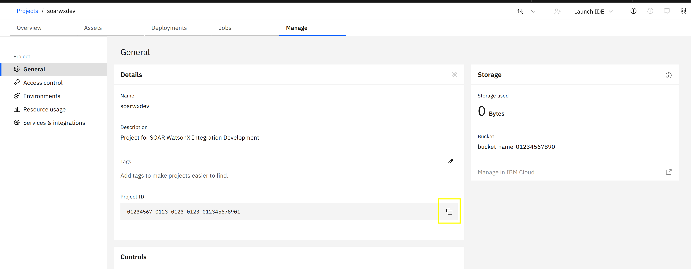

#### IBM Cloud IAM API Key

To use watsonx.ai from the app, you'll need an IBM Cloud IAM API Key. To generate an API key, click on the menu icon in the top left of the watsonx.ai dashboard and open *Access (IAM)* under the *Administration* menu.

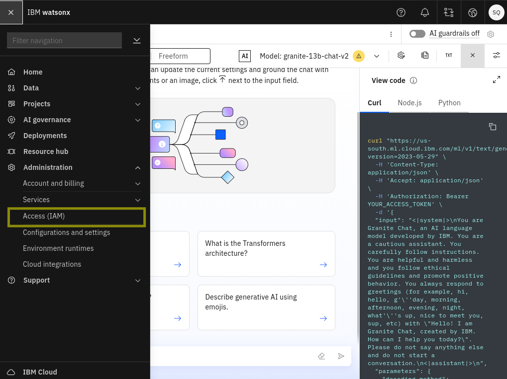

The *Access IAM* dashboard will open...

1. Choose *API Keys* from the navigation section then...
2. Click the *Create +* button to create a new API key.

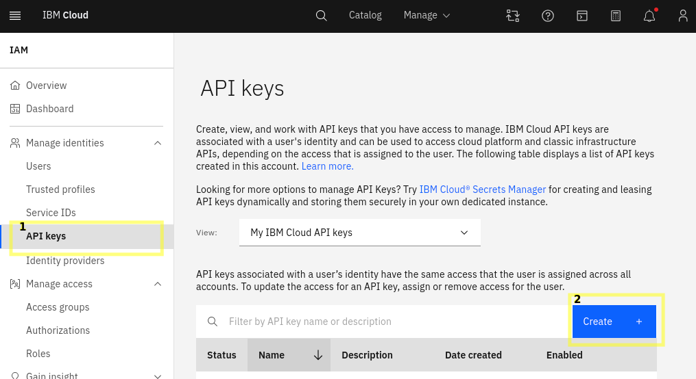

Take note of the API key as this will also be used during app configuration.

#### Watsonx.ai Endpoint URL

The endpoint will depend on which region your watsonx.ai project was created in. You can see which region you're using in the watsonx.ai dashboard in the dropdown at the top-right, next to the user icon.

Find the relevant Endpoint for your region at https://cloud.ibm.com/apidocs/watsonx-ai#endpoint-url.

> Don't use the prompt and/or notebooks endpoint.

</details>

### Watsonx.ai Free Credits

Lite accounts make it easy to get started with IBM Cloud® and try out services.

When you're ready to unlock the full IBM Cloud catalogue, get extra free resources, and more, you can upgrade to a Pay-As-You-Go or Subscription account. 

By upgrading to Pay-As-You-Go account, you would receive a $200 credit for 30 days. When you enter a credit card for a new Pay-As-You-Go account, you'll receive a promotional credit to use on any IBM product including watsonx.ai. For more details please refer to ```Promotional credit for upgrading your account``` section [here](https://cloud.ibm.com/docs/account?topic=account-upgrading-account#promotional-credit-for-upgrading-your-account).

### SOAR platform
The SOAR platform supports App Host/Edge Gateway.

* The app is in a container-based format (available from the AppExchange as a `zip` manifest file, that the App Host/Edge Gateway will deploy).

Guides are available on the IBM Documentation website at [ibm.biz/soar-docs](https://ibm.biz/soar-docs). On this web page, select your SOAR platform version. On the follow-on page, you can find the _Edge Gateway Deployment Guide_ or _App Host Deployment Guide_ by expanding **SOAR Apps and App Host** in the Table of Contents panel. The System Administrator Guide is available by expanding **SOAR System Administrator**, where you can find **Managing SOAR Apps**.

### Cloud Pak for Security

Cloud Pak for Security is currently not supported.

### Proxy Server
The app **does not** support a proxy server.

### Python Environment
The app runs on Python 3.12.
Additional package dependencies may exist for each of these packages:

* numpy==2.2.0 
* mail-parser==4.1.2 
* xlrd==2.0.1 
* py3langid==0.3.0 
* openpyxl==3.1.5 
* unoconv==0.9.0 
* markdown2==2.5.3 
* python-docx==1.1.2 
* jsonpath-ng==1.7.0 
* sentence-transformers==5.5.1
* nh3==0.2.19 
* resilient-circuits>=51.0.2.0.0 
* scikit-learn==1.5.2 
* beautifulsoup4==4.12.3 
* faiss-cpu==1.9.0 
* pydantic==2.10.6 
* tiktoken==0.8.0 
* bs4==0.0.2 
* PyYAML==6.0.2
* ibm_watsonx_ai==1.5.1

---

## Installation

### Installing the App
* To install or uninstall an App on the _SOAR platform_, see the [IBM QRadar SOAR documentation](https://www.ibm.com/docs/en/sqsp/51.0.0?topic=soar-apps-app-host).

### App Configuration
The following table provides the settings you need to configure the app. These settings are made in the app.config file. See the documentation discussed in the Requirements section for the procedure.

| Config                 | Required | Example                                  | Description                                                                                                               |
|------------------------|----------|------------------------------------------|---------------------------------------------------------------------------------------------------------------------------|
| **watsonx_api_key**    | Yes      | 0123-4567-89ab-cdef                      | Your watsonx.ai API key - see [IBM Cloud IAM API Key](#ibm-cloud-iam-api-key). **This should be saved as an App Secret.** |
| **watsonx_endpoint**   | Yes      | `https://us-south.ml.cloud.ibm.com`      | The watsonx.ai API URL - see [watsonx.ai Endpoint URL](#watsonxai-endpoint-url).                                          |
| **watsonx_project_id** | Yes      | 0123-4567-89ab-cdef                      | The watsonx.ai project id - see [watsonx.ai Project ID](#watsonxai-project-id).                                         |
| **watsonx_model**      | No       | openai/gpt-oss-120b                      | The model to use for Agent conversations in Response Assistant Assistant. |
| **render_markdown**    | No       | `true` or `false`                        |  This setting must be set to `true` for the Response Assistant to work.                                                       |
| **embedding_model**    | No       | `ibm/granite-278m-multilingual-embedding` | Watsonx model to generate embeddings. [See options](https://dataplatform.cloud.ibm.com/docs/content/wsj/analyze-data/fm-models-embed.html?context=wx#ibm-provided)|
<!-- | **default_language**   | No       | `en`, `fr`, `de`, `pt`, `es` or `ja`     | Language used for artifiact/attachment analyses.       | -->
<!-- | **local_embeddings**   | No       | `true`, `false`                          | Use local (App host) compute resources to generate embeddings for artifact analysis instead of watsonx.ai. This is not recommended, as App Host containers are limited to 2GB of memory. | -->

**Note**: The watsonx embedding model needs to support at least 500 input tokens (`sentence-transformers/all-minilm-l6-v2` will not work)

The config is setup automatically, you just need to add the following **case sensitive** App secrets with the details from the [requirements](#requirements) section:
  - WATSONX_ENDPOINT_URL
  - WATSONX_API_KEY
  - WATSONX_PROJECT_ID

---

## App usage

### Artifact and Attachment Analysis

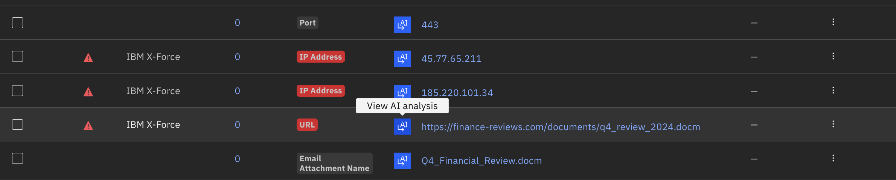
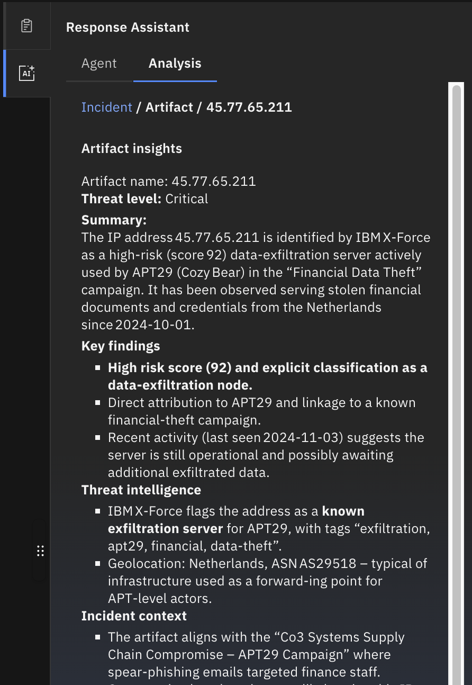

The *watsonx.ai Scan Artifact* and *watsonx.ai Scan Attachment* playbooks summarize, and outline potential dangers of file contents.

**This analysis is not intended to replace Threat Intelligence sources for performing malware file hash scans**. It's intended use is to be a utility to quickly summarize and assess existing insights from threat sources, natural language contents, and/or code in a document.

#### What file formats can be scanned?
- The app supports text to be extracted from only plain text-based documents (utf-8 and ascii).

Examples of supported file formats include:
- Document formats: `md`, `txt`, `rtf`, and `eml`.

Examples of files **not supported**:
- `pdf`, `pptx`, `docx`, `png`


## Incident Summarization

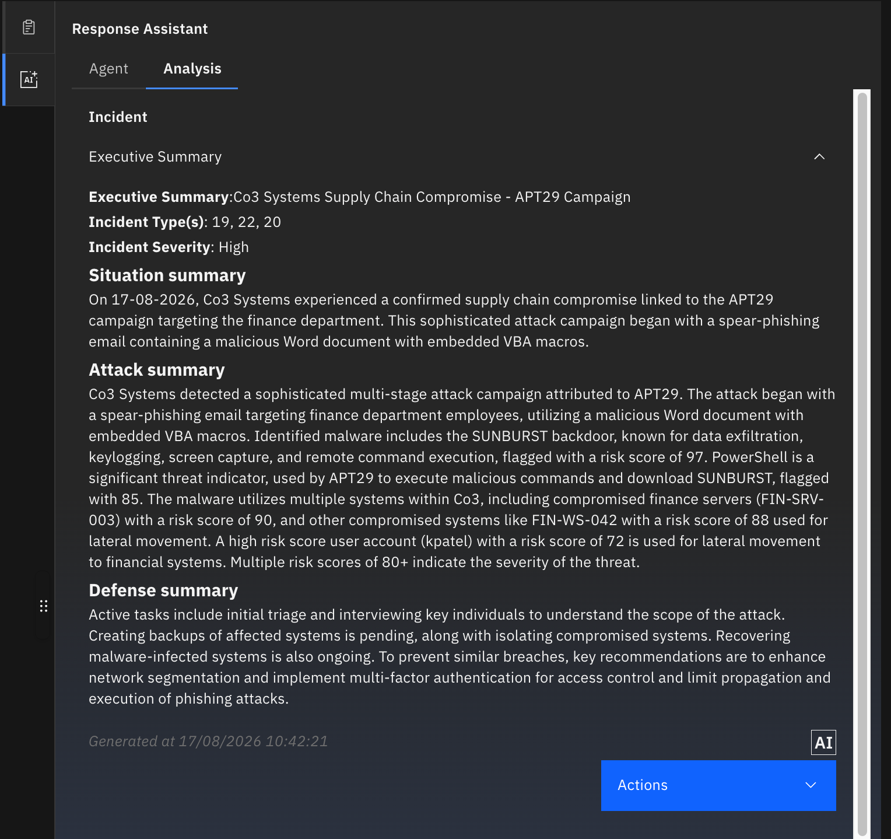

The *watsonx.ai Summarize Incident* playbooks summarizes the incident based on the selected summary type.

**This analysis is not intended to replace detailed analysis of the security incidents recorded in QRadar SOAR by SOC Analysts.**. It's intended use is to be a utility to summarize and get a precise overview of the incident depending on user type.

#### What type of summaries are available?

- There are two type of summaries available to the users:
  - Executive Summary delivers a clear, high-level overview of a cybersecurity incident, tailored for executives and decision-makers to quickly grasp the situation, attack details, and defensive actions. Its concise, formal structure supports strategic planning and communication without requiring technical expertise.
  - Technical Summary provides an in-depth technical report for incident response teams and cybersecurity analysts, detailing the incident’s technical aspects, artifact analysis, and mitigation steps. Its structured format aids operational teams in investigating, responding to, and preventing future incidents effectively.

## Playbook Execution Summary

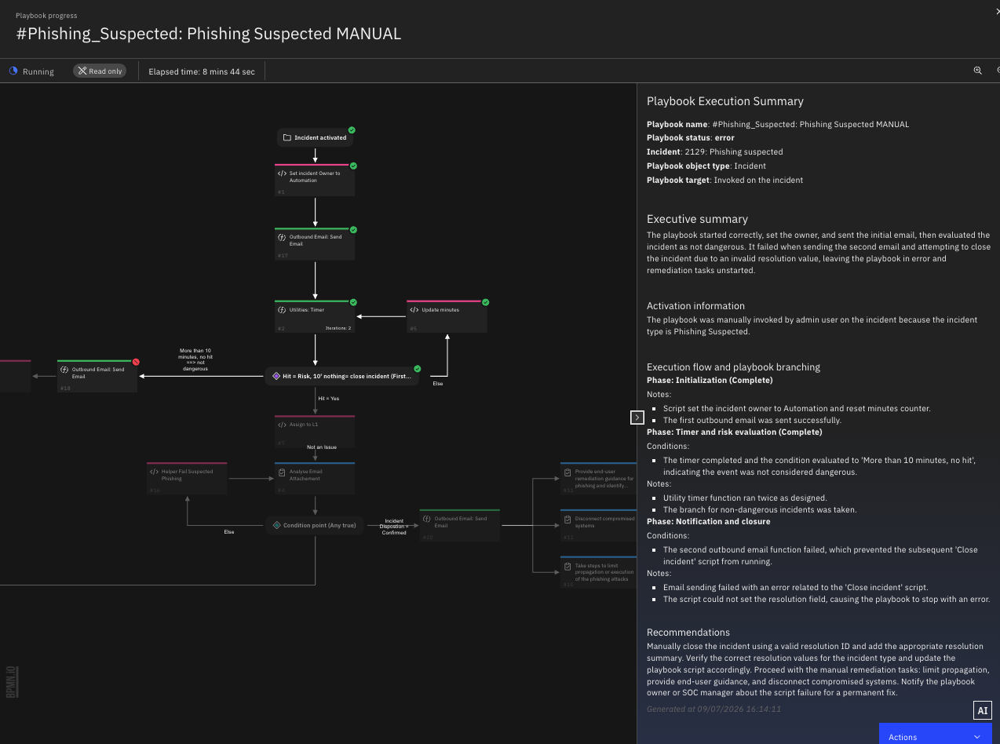

- The flow of an executed playbook can be summarized, to show an analyst what paths the execution took, and describe certain conditions that changed the flow.
- Can help indicate why a playbook may have failed, and give recommendations for analyst actions to take to workaround failing playbooks.

## Text Generation

The *watsonx.ai Text Generation* function can be used to roll out your own genAI solutions using playbook logic.

- This function facilitates calls to the Text Generation (`/ml/v1/text/generation?version=2023-05-29`) watsonx.ai API endpoint.
- Playbook logic can act as a force multiplier to create sophisticated AI workflows to perform predefined tasks automatically.

---

## How to get the best out of the app

### Model quality

- For each use-case, we have set the best model for the task in the playbooks that ship with this app.
- Other models are available for you to test by updating the playbook, and changing the `fn_watsonx_analyst_model_id` function input for the relative playbook's function.
- To change the model used by the Response Assistant agent, change the `watsonx_model` field in the `app.config` - see [App Configuration](#app-configuration) for more details.
- Refer to [Regional availability of services and features](https://dataplatform.cloud.ibm.com/docs/content/wsj/getting-started/regional-datactr.html?context=wx&pos=2) to see what models are available in your watsonx region.
- Current model list on watsonx.ai:
  - ibm/granite-4-h-small
  - meta-llama/llama-3-3-70b-instruct
  - meta-llama/llama-4-maverick-17b-128e-instruct-fp8
  - mistralai/mistral-small-3-1-24b-instruct-2503
  - openai/gpt-oss-120b


### Prompting Guide

#### Response Quality

- Quality of response can differ between LLMs specifically when the input context is larger than the model's context limit.
- Asking very specific and clearly defined questions can improve the quality of the generated responses. When querying LLMs, it's essential to be as clear and specific as possible about the information or task you want the model to address. This will help the model to generate more accurate and relevant responses.
  - For example, summarizing an incident for a CTO would be a different response than summarizing an incident for a Security analyst.
  - Another example would be if you do not want to include some artifact types in your queries then it should be specifically mentioned.
- If the initial results are unsatisfactory, consider refining your prompt.

---

## Data selection

You can override the configuration for the data we send to watsonx for **incident summaries**. It is not recommended to remove too much from the default configuration, as removing data will likely impact the quality of responses. Adding additional data is not supported.

## Custom incident properties

The default configuration allows all custom properties to be sent to watsonx, if you want to limit which properties are sent, you can do so by modifying the `properties` field in an override config below, remove the `"*"` item under properties, and specify each property key you want to keep.

**Note**: Use the API Name property from the Customization settings -> Layouts page for the properties' field names.


## Creating the override config
By creating a `yaml` file under `/var/rescircuits` in the App Configuration page, you can provide an override config, which you can choose to use for Summarize Incident.


Make sure that the file name is `<override-name>.yaml`, and that the file path is `/var/rescircuits` (the file path in the UI should not include the file's name).

The contents of the default configuration will be below, you can use this as a base config to modify. **Note**: Quality will vary if the config is changed from the default, continue at your own risk, and revert back to default if the data configuration causes a drop in quality.

**Note**: **You must restart the app after creating the new payload file, as until then, the app will fallback to default configuration.**

<details>
  <summary>Show <code>datapayload.yaml</code></summary>

  ```yaml
  ---

  incident:
    allow_list:
      # only the fields being kept and shown to LLM
      - name
      - description
      - confirmed
      - addr
      - city
      - start_date
      - inc_start
      - discovered_date
      - owner_id
      - creator_id
      - reporter
      - state
      - country
      - severity_code
      - zip
      - workspace
      - members
      - negative_pr_likely
      - assessment
      - properties
      - inc_last_modified_date
      - incident_type_ids

    date_list:
      # define the fields that will be converted from timestamp to human-readable time.
      # if these fields are removed from the allow_list, they should be removed here too
      - start_date
      - inc_start
      - discovered_date
      - inc_last_modified_date
    
    properties:
      - "*"

  playbook_executions:
    allow_list:
      - last_activated_by
      - status
      - object
      - elapsed_time
      - playbook
      - start_time
    
    date_list:
      - start_time

    playbook_allow_list:
      - display_name
      - description
      - activate_type

  artifacts:
    allow_list:
      - value
      - type
      - related_incident_count

    date_list:
      - created
      - last_modified_time

    hit_allow_list:
    - created
    - properties

    hit_block_list:
      # block these bits of hit data, as they don't provide much use to LLM
      # feel free to experiment
      - resource
      - scan_id
      - sha1
      - sha256
      - md5
      - response_code
      - verbose_msg
      - permalink

    hit_relabel_list:
      # re-label the keys in threat hit properties
      # change key to value for field names
      total: number of scans performed
      positives: number of scans indicating malicious behavior
      community coverage: percentage of scans indicating malicious behavior

  attachments:
    allow_list:
      - name
      - value
      - related_incident_count
      - content_type

    date_list:
      - created

  phases:
    allow_list:
      - name
    relabel_list:
      name: phase_name

  tasks:
    allow_list:
      - name
      - active
      - required
      - status
      - owner_id
      - due_date
      - required
      - description

  ```

</details>


## Setting up the dropdown

To be able to use this configuration, we'll have to add and entry to the data config dropdown function input.

- in the Customization settings page, navigate to 'Functions', and click on a watsonx function. 
- click the pencil icon on the right-hand-side of the `fn_watsonx_analyst_data_config` Global Input Field.
- click the 'Add/Edit values' label
- under `default`, add a new config option with the filename of the config without the file extension - e.g., <code>config1.yaml</code> &rarr; <code>config1</code>
- click the checkmark, and hit save
- now to set the config on Summarize Incident, open the relevant playbooks, edit the watsonx function's input script and set the `fn_watsonx_analyst_data_config` value to the file name (without extension) that you set in the Customization settings.


## Troubleshooting & Support

If any of the actions fail, the following steps may help:
- Check playbook progress on the incident
  - The playbook may have failed. If so, the error message in the function's response may help you interpret the problem.
- Check app logs
  - Download the apps’ logs from Administrator Settings -> Apps page. Go to the details of the app, and click “Download Logs.”
  - Function invocations will create a request ID, which can be used to identify logs for a specific invocation.
  - Check SOAR’s `client.log` log file which may give some extra information.
- If these do not give sufficient information, then you may enable debug level logging for the app by editing the `app.config` and adding `loglevel=DEBUG` inside the `[resilient]` section
 
## For Support
This is an IBM Community provided app. Please search the Community [ibm.biz/soarcommunity](https://ibm.biz/soarcommunity) for assistance.

[^1]: Incident type, artifact/attachment type IDs are substituted with the respective SOAR API name in LLM context.
