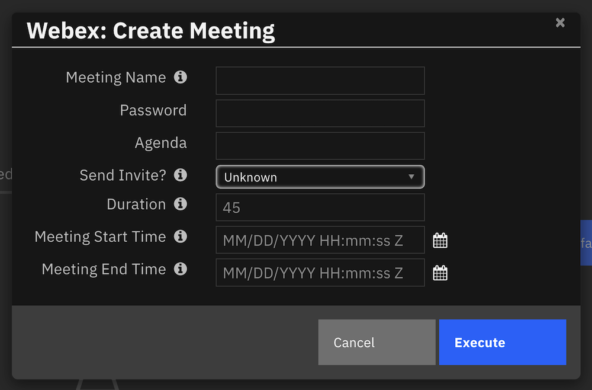
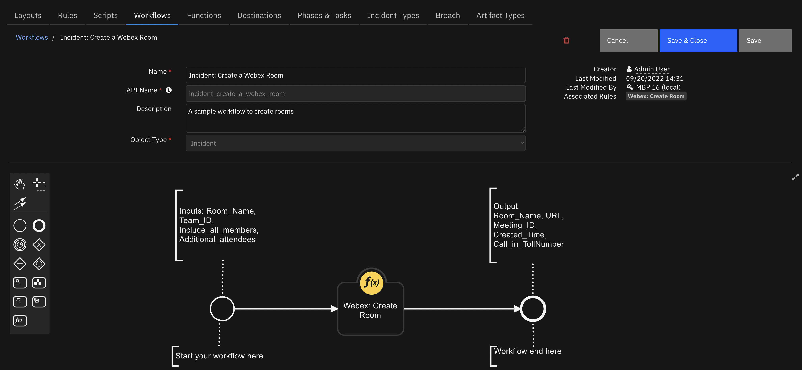

# Cisco Webex

## Table of Contents
- [Cisco Webex](#cisco-webex)
  - [Table of Contents](#table-of-contents)
  - [Release Notes](#release-notes)
  - [Overview](#overview)
    - [Key Features](#key-features)
  - [Requirements](#requirements)
    - [SOAR platform](#soar-platform)
    - [Cloud Pak for Security](#cloud-pak-for-security)
    - [Proxy Server](#proxy-server)
    - [Python Environment](#python-environment)
  - [Installation](#installation)
    - [Webex Configuration](#webex-configuration)
    - [OAuth Authentication](#oauth-authentication)
    - [App Configuration](#app-configuration)
  - [Function - Webex: Create Meeting](#function---webex-create-meeting)
  - [Function - Webex: Create Room](#function---webex-create-room)
  - [Function - Webex: Create Team](#function---webex-create-team)
  - [Function - Webex: Delete Room](#function---webex-delete-room)
  - [Function - Webex: Delete Team](#function---webex-delete-team)
  - [Troubleshooting & Support](#troubleshooting--support)
    - [For Support](#for-support)
---

## Release Notes
| Version | Date | Notes |
| ------- | ---- | ----- |
| 2.0.0 | 7/2022 | Migrated to REST api and added the ability to create rooms and teams for incidents |
| 1.1.1 | 8/2021 | Rebuild app.zip |
| 1.1.0 | 2/2021 | App Host Support|
| 1.0.0 | 8/2018 | Initial Release |

---

## Overview

**SOAR Components for Cisco Webex**

This package extends the meeting and collaboration functionality of Webex to IBM Security QRadar SOAR Platform. This package provides SOAR platform with the ability to interface with Cisco Webex and create rooms, teams and meetings. The user now can create Meeitngs, Rooms and teams from within a SOAR incident and assign its members to it.

 

### Key Features
* This package provdes with a function that allows for creating one or more Webex Teams and add incident and other specified members to it.
* It also provides with a function that allows for creating one or more Webex Rooms for an incident and to add incident members or existing teams to it.
* It also has the ability to create instant meetings or to schedule Webex meetings.
* An example workflow is included that writes the host URL and attendee URL to an incident note as live links to access the meeting.
* An example rule is included that activates an menu popup that prompts the user for a meeting start and end time and an optional meeting agenda and password.

---

## Requirements
This app supports the IBM Security QRadar SOAR Platform and the IBM Security QRadar SOAR for IBM Cloud Pak for Security.

### SOAR platform
The SOAR platform supports two app deployment mechanisms, App Host and integration server.

If deploying to a SOAR platform with an App Host, the requirements are:
* SOAR platform >= `43.1`.
* The app is in a container-based format (available from the AppExchange as a `zip` file).

If deploying to a SOAR platform with an integration server, the requirements are:
* SOAR platform >= `43.1`.
* The app is in the older integration format (available from the AppExchange as a `zip` file which contains a `tar.gz` file).
* Integration server is running `resilient-circuits>=45.0.0`.
* If using an API key account, make sure the account provides the following minimum permissions: 
  
  | Name | Permissions |
  | ---- | ----------- |
  | Org Data | Read |
  | Function | Read |

The following SOAR platform guides provide additional information: 
* _App Host Deployment Guide_: provides installation, configuration, and troubleshooting information, including proxy server settings. 
* _Integration Server Guide_: provides installation, configuration, and troubleshooting information, including proxy server settings.
* _System Administrator Guide_: provides the procedure to install, configure and deploy apps. 

The above guides are available on the IBM Documentation website at [ibm.biz/soar-docs](https://ibm.biz/soar-docs). On this web page, select your SOAR platform version. On the follow-on page, you can find the _App Host Deployment Guide_ or _Integration Server Guide_ by expanding **Apps** in the Table of Contents pane. The System Administrator Guide is available by expanding **System Administrator**.

### Cloud Pak for Security
If you are deploying to IBM Cloud Pak for Security, the requirements are:
* IBM Cloud Pak for Security >= 1.9.
* Cloud Pak is configured with an App Host.
* The app is in a container-based format (available from the AppExchange as a `zip` file).

The following Cloud Pak guides provide additional information: 
* _App Host Deployment Guide_: provides installation, configuration, and troubleshooting information, including proxy server settings. From the Table of Contents, select Case Management and Orchestration & Automation > **Orchestration and Automation Apps**.
* _System Administrator Guide_: provides information to install, configure, and deploy apps. From the IBM Cloud Pak for Security IBM Documentation table of contents, select Case Management and Orchestration & Automation > **System administrator**.

These guides are available on the IBM Documentation website at [ibm.biz/cp4s-docs](https://ibm.biz/cp4s-docs). From this web page, select your IBM Cloud Pak for Security version. From the version-specific IBM Documentation page, select Case Management and Orchestration & Automation.

### Proxy Server
The app **does** support a proxy server.

### Python Environment
Python 3.6 is supported.
Additional package dependencies may exist for each of these packages:
* resilient-circuits>=45.0.0

## Installation

* To install or uninstall an App or Integration on the _SOAR platform_, see the documentation at [ibm.biz/soar-docs](https://ibm.biz/soar-docs).
* To install or uninstall an App on _IBM Cloud Pak for Security_, see the documentation at [ibm.biz/cp4s-docs](https://ibm.biz/cp4s-docs) and follow the instructions above to navigate to Orchestration and Automation.

### Webex Configuration
For this application to perform the above-mentioned functions, a Webex app integration must be created at [Webex Developer](https://developer.webex.com/my-apps/new) using the user's organization account. This Integrations is how the _SOAR platform_ requests permission to invoke the Webex REST API from _SOAR platform_. To do this in a secure way, OAuth 2 standard is used, which allows third-party integrations to get a temporary access token for authenticating API calls. The [OAuth Utilities package](https://exchange.xforce.ibmcloud.com/hub/extension/44aaa4fd44c75e22ec979d994ff9948a) developed for IBM SOAR apps is to be used to perform this Authentication.

 

The following steps can be followed to create an app integration:
* Navigate to [Webex Developer](https://developer.webex.com/my-apps/new) and click on *Create an Integration*
* The webesite will then present the user with a series of questions. The three primary field that is required for this integratio to work would be Mobile SDK, Redirect URI and Scopes.
* Select *No* for using Mobile SDk.
* Redirect URI is required for completing the OAuth grant flow. In this case : `https://localhost:8080/callback`
* Scopes define the level of access that your integration requires. All meetings related scopes are to be selected.
* Upon completion, the user will be provided with a Client ID, Client Secret and an OAuth Authorization URL, which is then used for authentication.

 

### OAuth Authentication
To establish a secure connection between the Webex integration and  _SOAR platform_, the [OAuth Utilities Documentation](https://exchange.xforce.ibmcloud.com/api/hub/extensionsNew/504c896aa38087ba897fa054bc79e598/README.pdf) is to be used. 

* The tool is used to generate a unique *Refresh token*, which is then used by the app.
* There are several ways to generate this *Refresh token* using the OAuth Utilities tool, please refer to the documentation [OAuth Utilities Documentation](https://exchange.xforce.ibmcloud.com/api/hub/extensionsNew/504c896aa38087ba897fa054bc79e598/README.pdf)
* Once such method would be using the CLI. A sample command has been provided below:

```
oauth-utils oauth2_generate_refresh_token \
-tu https://webexapis.com/v1/access_token \
-au https://webexapis.com/v1/authorize \
-ci <CLIENT_ID> \
-cs <CLIENT_SECRET> \
-sc "meeting:recordings_read meeting:schedules_read"
```
This generates the required _Refresh Token_ for app configuration.

### App Configuration
The following table provides the settings you need to configure the app. These settings are made in the app.config file. See the documentation discussed in the Requirements section for the procedure.

| Config | Required | Example | Description |
| ------ | :------: | ------- | ----------- |
| **webex_site_url** | Yes | `https://webexapis.com` | Webex endpoint URL |
| **webex_timezone** | Yes | `GMT -05:00` | Reference Timezone for the meeting |
| **client_id** | Yes | `Cf7f235XXXXXXXXXXddXXXX930ae68d377754b971XXXXXXXXX` | Issued while creating the integration |
| **client_secret** | Yes | `dca551c7dXXXX930aeXXXXddXXXX930ae68d54b971XXXXXXXXX` | Issued while creating the integration |
| **refresh_token** | Yes | `mRhMXXXXXXXXXXmNjI53-864e-xxxxxxxxxxx` | Generated using the OAuth Utilities Tool |
| **scope** | Yes | `meeting:schedules_write meeting:schedules_read` | Issued while creating the integration |

---

## Function - Webex: Create Meeting
A function to schedule meetings. This function takes in Meeting Name, password, Agenda, Start and End time as inputs and schedules meetings aaccordingly.


<p align="center">

</p>

<details><summary>Inputs:</summary>
<p>

| Name | Type | Required | Example | Tooltip |
| ---- | :--: | :------: | ------- | ------- |
| `webex_meeting_name` | `text` | No | `Incident Meeting` | Meeting name |
| `webex_meeting_password` | `text` | No | `abcd1234` | Meeting password |
| `webex_meeting_agenda` | `text` | No | `Sample meeting` | Meeting agenda |
| `webex_meeting_start_time` | `datetimepicker` | No | `05/16/2022 11:08:09 +01:00` | Meeting start date and time |
| `webex_meeting_end_time` | `datetimepicker` | No | `05/16/2022 12:08:09 +01:00` | Meeting end date and time |


</p>
</details>

<details><summary>Outputs:</summary>
<p>

> **NOTE:** This example might be in JSON format, but `results` is a Python Dictionary on the SOAR platform.

```python
results = {
  "content": {
    "agenda": "Sample meeting",
    "allowAnyUserToBeCoHost": "false",
    "allowAuthenticatedDevices": "true",
    "allowFirstUserToBeCoHost": "false",
    "callInNumber": "+1-000-000-0000",
    "callInNumbers": "label:United States Toll",
    "dialInIpAddress": "173.000.0.00",
    "end": "2022-08-11T14:18:00Z",
    "excludePassword": "false",
    "hostDisplayName": "admin@admin.ai",
    "hostEmail": "admin@admin.ai",
    "hostKey": "100001",
    "hostUserId": "hostuserid123",
    "href": "/v1/meetings/hostuserid123/globalCallinNumbers",
    "id": "7abca37c1c124cb2a4e74661f4a8c47e",
    "joinBeforeHostMinutes": "0",
    "links": "rel:globalCallinNumbers",
    "meetingNumber": "11111112222222",
    "meetingOptions": "enabledChat:true",
    "meetingType": "meetingSeries",
    "method": "GET",
    "noteType": "allowAll",
    "password": "abcd1234",
    "phoneAndVideoSystemPassword": "22231234",
    "publicMeeting": "false",
    "scheduledType": "meeting",
    "sessionTypeId": "3",
    "simultaneousInterpretation": "enabled:false",
    "sipAddress": "25967357926@example.com",
    "siteUrl": "example-ex.webex.com",
    "start": "2022-08-11T13:33:00Z",
    "state": "active",
    "status": true,
    "telephony": "accessCode:25967357926",
    "timezone": "UTC",
    "title": "Soar Sample Instant Meeting",
    "tollType": "toll",
    "unlockedMeetingJoinSecurity": "allowJoin",
    "webLink": "https://example.com/php?MTID=m4a809400de110cbedaa89ff5e55b3d73"
  },
  "inputs": {
    "webex_meeting_name": "Incident Meeting",
    "webex_meeting_password": "abcd1234",
    "webex_meeting_agenda": "Sample meeting",
    "webex_meeting_start_time" : "05/16/2022 11:08:09 +01:00",
    "webex_meeting_end_time" : "05/16/2022 12:08:09 +01:00"
  },
  "metrics": {
    "execution_time_ms": 5448,
    "host": "AppHost",
    "package": "fn-webex",
    "package_version": "2.0.0",
    "timestamp": "2022-08-11 13:31:40",
    "version": "1.0"
  },
  "raw": null,
  "reason": null,
  "success": true,
  "version": 2.0
}
```

</p>
</details>

<details><summary>Example Pre-Process Script:</summary>
<p>

```python
inputs.webex_meeting_name = incident.name if rule.properties.webex_meeting_name is None else rule.properties.webex_meeting_name

if rule.properties.webex_meeting_agenda is None:
  if incident.description is not None and incident.description.content is not None:
    inputs.webex_meeting_agenda = incident.description.content
  else:
    inputs.webex_meeting_agenda = ""
else:
  inputs.webex_meeting_agenda = rule.properties.webex_meeting_agenda

inputs.webex_meeting_password = inputs.webex_meeting_password if rule.properties.webex_meeting_password is None else rule.properties.webex_meeting_password

```

</p>
</details>

<details><summary>Example Post-Process Script:</summary>
<p>

```python
content = results.get("content")

if not results.success:
  text = u"Unable to create Cisco WebEx Meeting"

  fail_reason = content.get("fail_reason")
  if fail_reason:
    text = u"{0}:\n\tFailure reason: {1}".format(text, fail_reason)
else:
  ref_html_room = u"""<a href='{0}'>Link</a>""".format(content.get("webLink"))

  text = u"<b>Cisco WebEx Meeting:</b><br />Webex Room URL: {0}".format(ref_html_room)
  text += u"<br />Meeting Name: {}".format(content.get("title"))
  text += u"<br />Password: {}".format(content.get("password"))
  text += u"<br />Agenda: {}".format(content.get("agenda"))
  text += u"<br />Start Time: {}".format(content.get("start"))
  text += u"<br />End Time: {}".format(content.get("end"))
  text += u"<br />Timezone: {}".format(content.get("timezone"))
  text += u"<br />Meeting Id: {}".format(content.get("id"))
  
note = helper.createRichText(text)
incident.addNote(note)
```

</p>
</details>

---
## Function - Webex: Create Room
Creates a Webex Room with incident members and adds additional members or teams to the room.



<p align="center">

</p>

<details><summary>Inputs:</summary>
<p>

| Name | Type | Required | Example | Tooltip |
| ---- | :--: | :------: | ------- | ------- |
| `webex_room_name` | `text` | No | `Incident Room` | Name of the Room |
| `webex_team_id` | `text` | No | `Ydca551c7dXXXd54b971XXXXXXXXX` | If a Webex team is already available, the entire team can be directly added by specifying its ID. |
| `webex_add_all_members` | `boolean` | Yes | `Yes` | Select this option to include all incident members to this Webex room |
| `webex_meeting_attendees` | `text` | No | `sara@example.com, mathew@example.com` | The list of email address of the attendees in a comma-separated format|

</p>
</details>

<details><summary>Outputs:</summary>
<p>

> **NOTE:** This example might be in JSON format, but `results` is a Python Dictionary on the SOAR platform.

```python
results = {
  "content": {
    "attendees": "",
    "callInTollFreeNumber": "",
    "callInTollNumber": "+1-650-479-3208",
    "meetingId": "725c8064c775432fb85ea16d7b7c85c7",
    "meetingLink": "https://5xth.webex.com/m/a9a09646-9c84-4c9b-92f3-142faa4598ba",
    "meetingNumber": "25923177804",
    "roomId": "Y2lzY29zcGFyazovL3VybjpURUFNOnVzLXdlc3QtMl9yL1JPT00vZmU4ZjFmNTAtMWEwMy0xMWVkLWJiZDktMzcwMDcyNTIyMGJl",
    "roomName": "Incident Room",
    "sipAddress": "25923177804@5xth.webex.com",
    "status": true
  },
  "inputs": {
    "webex_add_all_members": true,
    "webex_incident_id": "2096",
    "webex_meeting_attendees": "sara@example.com, mathew@example.com",
    "webex_room_name": "Incident Room",
    "webex_team_id": "Ydca551c7dXXXX930aeXXXX509cda551c7ddXXXX930ae68d54b971XXXXXXXXX"
  },
  "metrics": {
    "execution_time_ms": 9591,
    "host": "AppHost",
    "package": "fn-webex",
    "package_version": "2.0.0",
    "timestamp": "2022-08-12 07:00:17",
    "version": "1.0"
  },
  "raw": null,
  "reason": null,
  "success": true,
  "version": 2.0
}
```

</p>
</details>

<details><summary>Example Pre-Process Script:</summary>
<p>

```python
inputs.webex_incident_id = str(incident.id)
inputs.webex_room_name = "Incident {}: {}".format(str(incident.id),  incident.name) if rule.properties.webex_room_name is None else rule.properties.webex_room_name

if rule.properties.webex_team_id is not None:
    inputs.webex_team_id = rule.properties.webex_team_id
    
if rule.properties.webex_meeting_attendees.content is not None:
    inputs.webex_meeting_attendees = rule.properties.webex_meeting_attendees.content
    
if rule.properties.webex_add_all_members is not None:
    inputs.webex_add_all_members = rule.properties.webex_add_all_members
```

</p>
</details>

<details><summary>Example Post-Process Script:</summary>
<p>

```python
content = results.get("content")

if not results.success:
  text = u"Unable to create Cisco WebEx Room"
  fail_reason = content.get("fail_reason")
  if fail_reason:
    text = u"{0}:\n\tFailure reason: {1}".format(text, fail_reason)
    
else:
  ref_html_room = u"""<a href='{0}'>Link</a>""".format(content.get("meetingLink"))
  text  = u"<b>Cisco Webex Room Details:</b><br />"
  text += u"<br />Room Name: {}".format(content.get("roomName"))
  text += u"<br />Room URL: {}".format(ref_html_room)
  text += u"<br />Room ID: {}".format(content.get("roomId"))
  text += u"<br />Meeting ID: {}".format(content.get("meetingId"))
  text += u"<br />Created Time: {}".format(content.get("created"))
  text += u"<br />Call in TollNumber: {}".format(content.get("callInTollNumber"))

note = helper.createRichText(text)
incident.addNote(note)


```

</p>
</details>

---
## Function - Webex: Create Team
A function to create Webex teams


<p align="center">

</p>

<details><summary>Inputs:</summary>
<p>

| Name | Type | Required | Example | Tooltip |
| ---- | :--: | :------: | ------- | ------- |
| `webex_team_name` | `text` | Yes | `SOAR Team` | Name of the team being created |
| `webex_add_all_members` | `boolean` | Yes | `Yes` | Select this option to add all members to the webex meeting. If only selected members are to be added, specify their email address below. |
| `webex_incident_id` | `text` | No | `Leave blank` | Incident Number |
| `webex_meeting_attendees` | `text` | No | `sara@example.com, mathew@example.com` | The list of email address of the attendees in a comma-seperated format. Leave blank to select all attendees |

</p>
</details>

<details><summary>Outputs:</summary>
<p>

> **NOTE:** This example might be in JSON format, but `results` is a Python Dictionary on the SOAR platform.

```python
results = {
  "content": {
    "attendees": "sara@example.com, mathew@example.com, soaruser@example.com",
    "created": "2022-08-12T05:59:57.637Z",
    "creatorId": "Y2lzY29zcGFyazovL3VzL1BFT1BMRS85ODM0YjBlYi1mZmY1LTRjY2YtYTcwOC04Nzk1YmFjYjQ3NzU",
    "id": "Y2lzY29zcGFyazovL3VybjpURUFNOnVzLXdlc3QtMl9yL1RFQU0vZmU4ZjFmNTAtMWEwMy0xMWVkLWJiZDktMzcwMDcyNTIyMGJl",
    "name": "SOAR Team",
    "status": true
  },
  "inputs": {
    "webex_team_name": "SOAR Team",
    "webex_incident_id": "2096",
    "webex_add_all_members": true,
    "webex_meeting_attendees" : "sara@example.com, mathew@example.com"
  },
  "metrics": {
    "execution_time_ms": 13623,
    "host": "AppHost",
    "package": "fn-webex",
    "package_version": "2.0.0",
    "timestamp": "2022-08-12 07:00:05",
    "version": "1.0"
  },
  "raw": null,
  "reason": null,
  "success": true,
  "version": 2.0
}
```

</p>
</details>

<details><summary>Example Pre-Process Script:</summary>
<p>

```python
# To set meeting name to the workflow inputs, uncomment the following lines
inputs.webex_incident_id = str(incident.id)
inputs.webex_team_name = "Incident {}: {}".format(str(incident.id),  incident.name) if rule.properties.webex_team_name is None else rule.properties.webex_team_name

if rule.properties.webex_meeting_attendees.content is not None:
    inputs.webex_meeting_attendees = rule.properties.webex_meeting_attendees.content
    
if rule.properties.webex_add_all_members is not None:
    inputs.webex_add_all_members = rule.properties.webex_add_all_members
```

</p>
</details>

<details><summary>Example Post-Process Script:</summary>
<p>

```python
content = results.get("content")

if not results.success:
  text = u"Unable to create Cisco WebEx Meeting"

  fail_reason = content.get("fail_reason")
  if fail_reason:
    text = u"{0}:\n\tFailure reason: {1}".format(text, fail_reason)
    
    
else:

  text  = u"<b>Cisco Webex Team Details:</b><br />"
  text += u"<br />Team Name: {}".format(content.get("name"))
  text += u"<br />Created Time: {}".format(content.get("created"))
  text += u"<br />Team ID: {}".format(content.get("id"))
  text += u"<br />Team Members: {}".format(content.get("attendees"))

note = helper.createRichText(text)
incident.addNote(note)


```

</p>
</details>

---
## Function - Webex: Delete Room
Function to delete a Webex Room from an incident or task. For this function to work,
either the Room ID or Room Name must be provided. In order to avoid any accidental 
deletion, it is strongly recommended to use the Room  ID to delete a Room.

  <!-- ::CHANGE_ME:: -->

<details><summary>Inputs:</summary>
<p>

| Name | Type | Required | Example | Tooltip |
| ---- | :--: | :------: | ------- | ------- |
| `webex_room_id` | `text` | No | `-` | - |
| `webex_room_name` | `text` | No | `-` | - |

</p>
</details>

<details><summary>Outputs:</summary>
<p>

> **NOTE:** This example might be in JSON format, but `results` is a Python Dictionary on the SOAR platform.

```python
results = {
  "content": {
    "message": "Successfully deleted room : Incident 2096 Task 102: Webex Initial Test",
    "status_code": 204
  },
  "inputs": {
    "webex_room_name": "Incident 2096 Task 102: Webex Initial Test"
  },
  "metrics": {
    "execution_time_ms": 3383,
    "host": "AppHost",
    "package": "fn-webex",
    "package_version": "2.0.0",
    "timestamp": "2022-09-19 11:29:54",
    "version": "1.0"
  },
  "raw": null,
  "reason": null,
  "success": true,
  "version": 2.0
}
```

</p>
</details>

<details><summary>Example Pre-Process Script:</summary>
<p>

```python
if rule.properties.webex_room_id:
  inputs.webex_room_id = rule.properties.webex_room_id

if rule.properties.webex_room_name:
  inputs.webex_room_name = rule.properties.webex_room_name
```

</p>
</details>

<details><summary>Example Post-Process Script:</summary>
<p>

```python
content = results.get("content")

if not results.success:
  text = u"Unable to delete the room"
  fail_reason = results.reason
  if fail_reason:
    text = u"{0}:\n\tFailure reason: {1}".format(text, fail_reason)
    
else:
  text  = u"<b>Cisco Webex:</b><br />"
  text += content.get("message")

note = helper.createRichText(text)
incident.addNote(note)
```

</p>
</details>

---
## Function - Webex: Delete Team
Function to delete a Webex team from an incident or task. For this function to work,
either the Team ID or Team Name must be provided. In order to avoid any accidental 
deletion, it is strongly recommended to use the Team ID to delete a Team.

  <!-- ::CHANGE_ME:: -->

<details><summary>Inputs:</summary>
<p>

| Name | Type | Required | Example | Tooltip |
| ---- | :--: | :------: | ------- | ------- |
| `webex_team_id` | `text` | No | `-` | ID of the team to be deleted |
| `webex_team_name` | `text` | Yes | `-` | Name of the team to be deleted |

</p>
</details>

<details><summary>Outputs:</summary>
<p>

> **NOTE:** This example might be in JSON format, but `results` is a Python Dictionary on the SOAR platform.

```python
results = {
  "content": {
    "message": "Successfully deleted team : Incident 2096 task 102: Webex Initial Test",
    "status_code": 204
  },
  "inputs": {
    "webex_team_name": "Incident 2096 task 102: Webex Initial Test"
  },
  "metrics": {
    "execution_time_ms": 4362,
    "host": "AppHost",
    "package": "fn-webex",
    "package_version": "2.0.0",
    "timestamp": "2022-09-19 11:31:16",
    "version": "1.0"
  },
  "raw": null,
  "reason": null,
  "success": true,
  "version": 2.0
}
```

</p>
</details>

<details><summary>Example Pre-Process Script:</summary>
<p>

```python
if rule.properties.webex_team_id:
  inputs.webex_team_id = rule.properties.webex_team_id

if rule.properties.webex_team_name:
  inputs.webex_team_name = rule.properties.webex_team_name
```

</p>
</details>

<details><summary>Example Post-Process Script:</summary>
<p>

```python
content = results.get("content")

if not results.success:
  text = u"Unable to delete the team"
  fail_reason = results.reason
  if fail_reason:
    text = u"{0}:\n\tFailure reason: {1}".format(text, fail_reason)
    
else:
  text  = u"<b>Cisco Webex:</b><br />"
  text += content.get("message")

note = helper.createRichText(text)
incident.addNote(note)
```

</p>
</details>

---


## Troubleshooting & Support
Refer to the documentation listed in the Requirements section for troubleshooting information.

### For Support
This is a IBM Community provided App. Please search the Community [ibm.biz/soarcommunity](https://ibm.biz/soarcommunity) for assistance.
