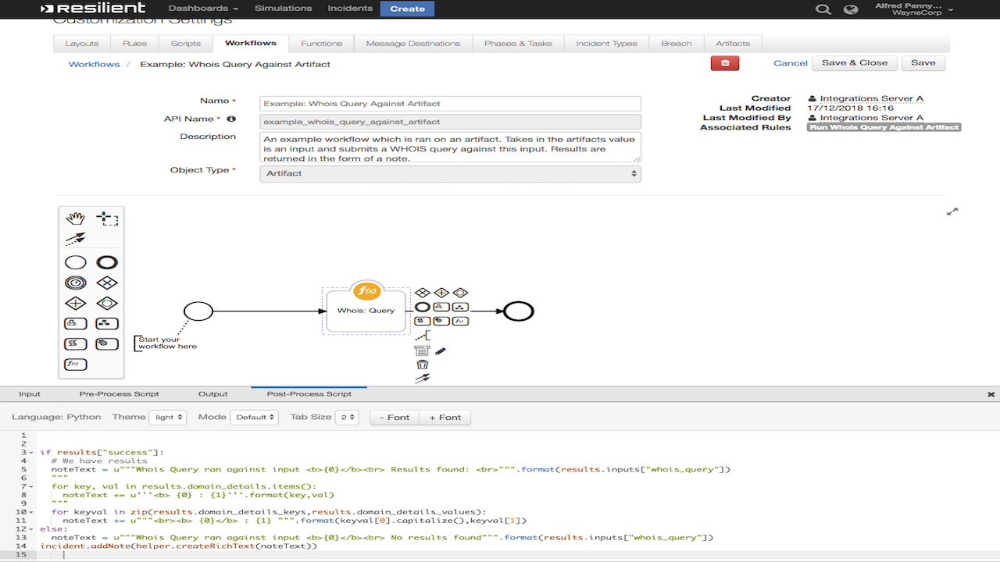

# Resilient Integration with WHOIS
**This package contains one function which provides enrichment information about a domains WHOIS information. Takes in an input of an IP address or URL and then queries for WHOIS info related to this input. Results are saved in a rich text note.**


## Table of Contents 
  - [app.config settings:](#appconfig-settings)
  - [Function Inputs:](#function-inputs)
  - [Function Output:](#function-output)
  - [Pre-Process Script:](#pre-process-script)
  - [Post-Process Script:](#post-process-script)
  - [Rules](#rules)




## app.config settings:
If you wish to use the integration with a proxy, this will need to be set in the app.config, otherwise no config values are needed.
```python
whois_https_proxy=http://0.0.0.0:3128/
```

## Function Inputs:
| Function Name | Type | Required | Example |
| ------------- | :--: | :-------:| ------- |
| `whois_query` | `String` | Yes | `'https://www.ibm.com'` |


## Function Output:
```python

results = {
    'inputs': {'whois_query': 'https://www.ibm.com'},
    'success': True,
    'domain_details': {'creation_date': '03/19/1986',
                    'expiration_date': '03/20/2019',
                    'last_updated': '09/18/2018',
                    'name': 'ibm.com',
                    'name_servers': ['ns1-206.akam.net',
                                     'usc3.akam.net',
                                     'eur5.akam.net',
                                     'asia3.akam.net',
                                     'usc2.akam.net',
                                     'usw2.akam.net',
                                     'ns1-99.akam.net',
                                     'eur2.akam.net'],
                    'registrar': 'CSC Corporate Domains, Inc.'},
    'domain_details_keys': ['name',
                         'registrar',
                         'creation_date',
                         'expiration_date',
                         'last_updated',
                         'name_servers'],
    'domain_details_values': ['ibm.com',
                           'CSC Corporate Domains, Inc.',
                           '03/19/1986',
                           '03/20/2019',
                           '09/18/2018',
                           ['ns1-206.akam.net',
                            'usc3.akam.net',
                            'eur5.akam.net',
                            'asia3.akam.net',
                            'usc2.akam.net',
                            'usw2.akam.net',
                            'ns1-99.akam.net',
                            'eur2.akam.net']]
 }

```


## Pre-Process Script:
```python
inputs.whois_query = artifact.value
```

## Post-Process Script:
This example **adds a Note to the Incident.**
```python
if results["success"]:
  # We have results
  noteText = u"""Whois Query ran against input <b>{0}</b><br> Results found: <br>""".format(results.inputs["whois_query"])
  """
  for key, val in results.domain_details.items():
    noteText += u'''<b> {0} : {1}'''.format(key,val)
  """
  for keyval in zip(results.domain_details_keys,results.domain_details_values):
    noteText += u"""<br><b> {0}</b> : {1} """.format(keyval[0].capitalize(),keyval[1])
else:
  noteText = u"""Whois Query ran against input <b>{0}</b><br> No results found""".format(results.inputs["whois_query"])
incident.addNote(helper.createRichText(noteText))
```

## Rules
| Rule Name | Object Type | Workflow Triggered |
| --------- | :---------: | ------------------ |
| 	Run Whois Query Against Artifact | `Artifact` | `Example: Whois Query Against Artifact` |
