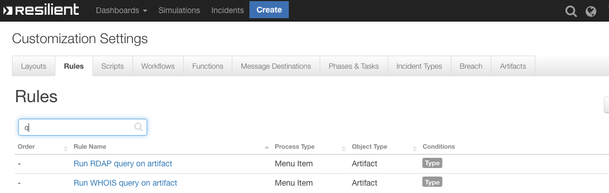

# fn-whois-rdap Functions for IBM Resilient

- [fn-whois-rdap Functions for IBM Resilient](#fn-whois-rdap-functions-for-ibm-resilient)
  - [Release Notes](#release-notes)
    - [v1.0.0](#v100)
  - [Overview](#overview)
  - [Requirements](#requirements)
  - [Installation](#installation)
  - [Uninstall](#uninstall)
  - [Troubleshooting](#troubleshooting)
    - [Resilient Action Status](#resilient-action-status)
    - [Resilient Scripting Log](#resilient-scripting-log)
    - [Resilient Logs](#resilient-logs)
    - [Resilient-Circuits](#resilient-circuits)
  - [Support](#support)

---

## Release Notes

### v1.0.0
* Initial Release

---

## Overview

**Retrieving registry information for IP, URL or DNS Artifacts**

 

This integration retrieves registry information (via legacy WHOIS or new RDAP protocol) for IP, URL or DNS Artifacts that provides enrichment and threat intelligence on suspicious address. The information is added directly to artifact description and can include dns-zone, asn and asn description & other useful metadata. 

---

## Requirements

* IBM Resilient >= `v31.0.4254`
* An Integration Server running `resilient_circuits>=31.0.0`
  * To setup an Integration Server see: [ibm.biz/res-int-server-guide](https://ibm.biz/res-int-server-guide)

---

## Installation
* Download the `fn_whois_rdap.zip`.
* Copy the `.zip` to your Integration Server and SSH into it.
* **Unzip** the package:
  ```
  $ unzip fn_whois_rdap-x.x.x.zip
  ```
* **Change Directory** into the unzipped directory:
  ```
  $ cd fn_whois_rdap-x.x.x
  ```
* **Install** the package:
  ```
  $ pip install fn_whois_rdap-x.x.x.tar.gz
  ```
* Import the fn_whois_rdap **customizations** into the Resilient platform:
  ```
  $ resilient-circuits customize -y -l fn-whois-rdap
  ```
* **Run** resilient-circuits or restart the Service on Windows/Linux:
  ```
  $ resilient-circuits run
  ```


---

## Uninstall
* SSH into your Integration Server.
* **Uninstall** the package:
  ```
  $ pip uninstall fn-whois-rdap
  ```

---

## Troubleshooting
There are several ways to verify the successful operation of a function.

### Resilient Action Status
* When viewing an incident, use the Actions menu to view **Action Status**.
* By default, pending and errors are displayed.
* Modify the filter for actions to also show Completed actions.
* Clicking on an action displays additional information on the progress made or what error occurred.

### Resilient Scripting Log
* A separate log file is available to review scripting errors.
* This is useful when issues occur in the pre-processing or post-processing scripts.
* The default location for this log file is: `/var/log/resilient-scripting/resilient-scripting.log`.

### Resilient Logs
* By default, Resilient logs are retained at `/usr/share/co3/logs`.
* The `client.log` may contain additional information regarding the execution of functions.

### Resilient-Circuits
* The log is controlled in the `.resilient/app.config` file under the section [resilient] and the property `logdir`.
* The default file name is `app.log`.
* Each function will create progress information.
* Failures will show up as errors and may contain python trace statements.

---

## Support
| Name | Version | Author | Support URL |
| ---- | ------- | ------ | ----------- |
| fn_whois_rdap | 1.0.0 | Resilient Labs | https://github.com/ibmresilient/resilient-community-apps |