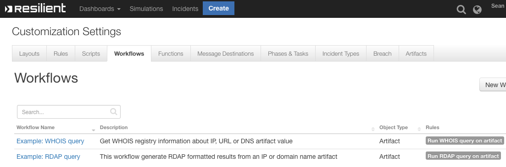

# fn-whois-rdap Functions for IBM Resilient

- [fn-whois-rdap Functions for IBM Resilient](#fn-whois-rdap-functions-for-ibm-resilient)
  - [Release Notes](#release-notes)
  - [Overview](#overview)
  - [Requirements](#requirements)
  - [Installation](#installation)
  - [Function - RDAP: Query](#function---RDAP:-query)
  - [Function - WHOIS: Query](#function---whois:-query)
  - [Troubleshooting](#troubleshooting)
    - [Resilient Action Status](#resilient-action-status)
    - [Resilient Scripting Log](#resilient-scripting-log)
    - [Resilient Logs](#resilient-logs)
    - [Resilient-Circuits](#resilient-circuits)
  - [Support](#support)

---

## Release Notes

### History

| Version| Date |Comment |
| -------: | ---: | ------ |
| 1.0.4 | 6/2021 |Bug fix ipwhois version pin |
| 1.0.3 | 8/2020 | Updated examples, proxy support added |
| 1.0.2 | 4/2020 | bug fixes |
| 1.0.1 | 4/2020 | Support for App Host |
| 1.0.0 | 12/2019 | Initial release |

---
## Overview

**Retrieve registry information for IP, URL or DNS Artifacts**

 

This integration retrieves registry information (via legacy WHOIS or new RDAP protocol) for IP, URL or DNS Artifacts that provides enrichment and threat intelligence on suspicious address. The information is added directly to artifact description and can include dns-zone, asn and asn description & other useful metadata.

### Key Features
<!--
  List the Key Features of the Integration
-->
* Retrieves Registry information for IP's, DNS or URL's
* Either the RDAP or WHOIS format of data can be returned
* Information is sent directly to the Artifact Description

---

## Requirements

* IBM Resilient >= `v35.0.5468`
* An App Host environment or an Integration Server running `resilient_circuits>=32.0.0`
  * To setup an Integration Server see [the Integration Server setup documentation](https://www.ibm.com/support/knowledgecenter/SSBRUQ_37.0.0/doc/container_apps.html)

---
## Installation
### App Host Installation
All the components for running Whois in a container already exist when using the App Host app. Once installed, review the app.config file in the Customizations tab.
```
[fn_whois_rdap]
# uncomment to include proxy support
#http_proxy=https://some_proxy.com
#https_proxy=http://some_proxy.com
```

### Integration Server Installation

* Download the `app-fn_whois_rdap-x.x.x-nnnn.zip`.
* Copy the `.zip` to your Integration Server and SSH into it.
* **Unzip** the package:
  ```
  $ unzip app-fn_whois_rdap-x.x.x-nnnn.zip
  ```
* **Install** the package:
  ```
  $ pip install fn_whois_rdap-x.x.x.tar.gz
  ```
* Import the fn_whois_rdap **customizations** into the Resilient platform:
  ```
  $ resilient-circuits customize -y -l fn-whois-rdap
  ```
* **Run** resilient-circuits or restart the Service on Windows/Linux:
  ```
  $ resilient-circuits run
  ```
* **Uninstall** the package:
  ```
  $ pip uninstall fn-whois-rdap
  ```
---

 

## Function - RDAP: Query
Using ipwhois library to make general queries in RDAP format

 

<details><summary>Inputs:</summary>
<p>

| Name | Type | Required | Example | Tooltip |
| ---- | :--: | :------: | ------- | ------- |
| `rdap_depth` | `number` | Yes | `0` | 0, 1 or 2 |
| `rdap_query` | `text` | Yes | `ibm.com` | IP, URL or DNS |

</p>
</details>

<details><summary>Outputs:</summary>
<p>

```python
results = {'content': {'asn': '16807',
             'asn_cidr': '129.42.38.0/24',
             'asn_country_code': 'US',
             'asn_date': '1987-07-29',
             'asn_description': 'IBM-EI - IBM - Events Infrastructure, US',
             'asn_registry': 'arin',
             'display_content': '{ '
                                '"nir":false,"asn_registry":"arin","asn":"16807","asn_cidr":"129.42.38.0/24","asn_country_code":"US","asn_date":"1987-07-29","asn_description":"IBM-EI '
                                '- IBM - Events Infrastructure, '
                                'US","query":"129.42.38.10","network":{ '
                                '"handle":"NET-129-42-0-0-1","remarks":false,"raw":false,"start_address":"129.42.0.0","end_address":"129.42.255.255","cidr":"129.42.0.0/16","ip_version":"v4","type":"DIRECT '
                                'ASSIGNMENT","name":"IBM-RSCH-NET2","country":false,"parent_handle":"NET-129-0-0-0-0" '
                                '},"objects":{ "IBM-1":{ '
                                '"handle":"IBM-1","status":false,"remarks":false,"notices":false,"raw":false,"contact":{ '
                                '"name":"IBM","kind":"org","phone":false,"email":false,"role":false,"title":false '
                                '},"events_actor":false } '
                                '},"raw":false,"dns_zone":"10.38.42.129.origin.asn.cymru.com" '
                                '}',
             'dns_zone': '10.38.42.129.origin.asn.cymru.com',
             'entities': ['IBM-1'],
             'network': {'cidr': '129.42.0.0/16',
                         'country': None,
                         'end_address': '129.42.255.255',
                         'events': [{'action': 'last changed',
                                     'actor': None,
                                     'timestamp': '2015-10-20T16:09:08-04:00'},
                                    {'action': 'registration',
                                     'actor': None,
                                     'timestamp': '1987-07-28T23:00:00-04:00'}],
                         'handle': 'NET-129-42-0-0-1',
                         'ip_version': 'v4',
                         'links': ['https://rdap.arin.net/registry/ip/129.42.0.0',
                                   'https://whois.arin.net/rest/net/NET-129-42-0-0-1'],
                         'name': 'IBM-RSCH-NET2',
                         'notices': [{'description': 'By using the ARIN '
                                                     'RDAP/Whois service, you '
                                                     'are agreeing to the '
                                                     'RDAP/Whois Terms of Use',
                                      'links': ['https://www.arin.net/resources/registry/whois/tou/'],
                                      'title': 'Terms of Service'},
                                     {'description': 'If you see inaccuracies '
                                                     'in the results, please '
                                                     'visit: ',
                                      'links': ['https://www.arin.net/resources/registry/whois/inaccuracy_reporting/'],
                                      'title': 'Whois Inaccuracy Reporting'},
                                     {'description': 'Copyright 1997-2019, '
                                                     'American Registry for '
                                                     'Internet Numbers, Ltd.',
                                      'links': None,
                                      'title': 'Copyright Notice'}],
                         'parent_handle': 'NET-129-0-0-0-0',
                         'raw': None,
                         'remarks': None,
                         'start_address': '129.42.0.0',
                         'status': ['active'],
                         'type': 'DIRECT ASSIGNMENT'},
             'nir': None,
             'objects': {'IBM-1': {'contact': {'address': [{'type': None,
                                                            'value': '3039 '
                                                                     'Cornwallis '
                                                                     'Road\n'
                                                                     'Research '
                                                                     'Triangle '
                                                                     'Park\n'
                                                                     'NC\n'
                                                                     '27709-2195\n'
                                                                     'United '
                                                                     'States'}],
                                               'email': None,
                                               'kind': 'org',
                                               'name': 'IBM',
                                               'phone': None,
                                               'role': None,
                                               'title': None},
                                   'entities': ['RAIN-ARIN'],
                                   'events': [{'action': 'last changed',
                                               'actor': None,
                                               'timestamp': '2017-11-30T14:46:26-05:00'},
                                              {'action': 'registration',
                                               'actor': None,
                                               'timestamp': '1992-02-08T00:00:00-05:00'}],
                                   'events_actor': None,
                                   'handle': 'IBM-1',
                                   'links': ['https://rdap.arin.net/registry/entity/IBM-1',
                                             'https://whois.arin.net/rest/org/IBM-1'],
                                   'notices': None,
                                   'raw': None,
                                   'remarks': None,
                                   'roles': ['registrant'],
                                   'status': None}},
             'query': '129.42.38.10',
             'raw': None},
 'inputs': {'rdap_depth': 0, 'rdap_query': 'https://www.ibm.com'},
 'metrics': {'execution_time_ms': 337,
             'host': 'your@hostname.com',
             'package': 'fn-whois-rdap',
             'package_version': '1.0.0',
             'timestamp': '2019-09-26 15:52:48',
             'version': '1.0'},
 'raw': '{"nir": null, "asn_registry": "arin", "asn": "16807", "asn_cidr": '
        '"129.42.38.0/24", "asn_country_code": "US", "asn_date": "1987-07-29", '
        '"asn_description": "IBM-EI - IBM - Events Infrastructure, US", '
        '"query": "129.42.38.10", "network": {"handle": "NET-129-42-0-0-1", '
        '"status": ["active"], "remarks": null, "notices": [{"title": "Terms '
        'of Service", "description": "By using the ARIN RDAP/Whois service, '
        'you are agreeing to the RDAP/Whois Terms of Use", "links": '
        '["https://www.arin.net/resources/registry/whois/tou/"]}, {"title": '
        '"Whois Inaccuracy Reporting", "description": "If you see inaccuracies '
        'in the results, please visit: ", "links": '
        '["https://www.arin.net/resources/registry/whois/inaccuracy_reporting/"]}, '
        '{"title": "Copyright Notice", "description": "Copyright 1997-2019, '
        'American Registry for Internet Numbers, Ltd.", "links": null}], '
        '"links": ["https://rdap.arin.net/registry/ip/129.42.0.0", '
        '"https://whois.arin.net/rest/net/NET-129-42-0-0-1"], "events": '
        '[{"action": "last changed", "timestamp": "2015-10-20T16:09:08-04:00", '
        '"actor": null}, {"action": "registration", "timestamp": '
        '"1987-07-28T23:00:00-04:00", "actor": null}], "raw": null, '
        '"start_address": "129.42.0.0", "end_address": "129.42.255.255", '
        '"cidr": "129.42.0.0/16", "ip_version": "v4", "type": "DIRECT '
        'ASSIGNMENT", "name": "IBM-RSCH-NET2", "country": null, '
        '"parent_handle": "NET-129-0-0-0-0"}, "entities": ["IBM-1"], '
        '"objects": {"IBM-1": {"handle": "IBM-1", "status": null, "remarks": '
        'null, "notices": null, "links": '
        '["https://rdap.arin.net/registry/entity/IBM-1", '
        '"https://whois.arin.net/rest/org/IBM-1"], "events": [{"action": "last '
        'changed", "timestamp": "2017-11-30T14:46:26-05:00", "actor": null}, '
        '{"action": "registration", "timestamp": "1992-02-08T00:00:00-05:00", '
        '"actor": null}], "raw": null, "roles": ["registrant"], "contact": '
        '{"name": "IBM", "kind": "org", "address": [{"type": null, "value": '
        '"3039 Cornwallis Road\\nResearch Triangle '
        'Park\\nNC\\n27709-2195\\nUnited States"}], "phone": null, "email": '
        'null, "role": null, "title": null}, "events_actor": null, "entities": '
        '["RAIN-ARIN"]}}, "raw": null, "dns_zone": '
        '"10.38.42.129.origin.asn.cymru.com", "display_content": "{ '
        '\\"nir\\":false,\\"asn_registry\\":\\"arin\\",\\"asn\\":\\"16807\\",\\"asn_cidr\\":\\"129.42.38.0/24\\",\\"asn_country_code\\":\\"US\\",\\"asn_date\\":\\"1987-07-29\\",\\"asn_description\\":\\"IBM-EI '
        '- IBM - Events Infrastructure, '
        'US\\",\\"query\\":\\"129.42.38.10\\",\\"network\\":{ '
        '\\"handle\\":\\"NET-129-42-0-0-1\\",\\"remarks\\":false,\\"raw\\":false,\\"start_address\\":\\"129.42.0.0\\",\\"end_address\\":\\"129.42.255.255\\",\\"cidr\\":\\"129.42.0.0/16\\",\\"ip_version\\":\\"v4\\",\\"type\\":\\"DIRECT '
        'ASSIGNMENT\\",\\"name\\":\\"IBM-RSCH-NET2\\",\\"country\\":false,\\"parent_handle\\":\\"NET-129-0-0-0-0\\" '
        '},\\"objects\\":{ \\"IBM-1\\":{ '
        '\\"handle\\":\\"IBM-1\\",\\"status\\":false,\\"remarks\\":false,\\"notices\\":false,\\"raw\\":false,\\"contact\\":{ '
        '\\"name\\":\\"IBM\\",\\"kind\\":\\"org\\",\\"phone\\":false,\\"email\\":false,\\"role\\":false,\\"title\\":false '
        '},\\"events_actor\\":false } '
        '},\\"raw\\":false,\\"dns_zone\\":\\"10.38.42.129.origin.asn.cymru.com\\" '
        '}"}',
 'reason': None,
 'success': True,
 'version': '1.0'}
```

</p>
</details>

<details><summary>Example Pre-Process Script:</summary>
<p>

```python
inputs.rdap_query = artifact.value
inputs.rdap_depth = 0
```

</p>
</details>

<details><summary>Example Post-Process Script:</summary>
<p>

```python
try:
  des = artifact.description.content
except Exception:
  des = None

if results["success"]:
  if des is None:
    note = u"""<div><p><br><b>RDAP threat intelligence at {2}:</b></br>\n\n
    <br><b>{0}</b></br></div></p>\n\n
    <div><p><br><b> Possible accessible keys:</b></br>\n\n
    <br><b>{1}</b></br>\n\n""".format(results["content"]["display_content"],results["content"].keys(),results["metrics"]["timestamp"])
    artifact.description = helper.createRichText(note)
  else:
    note =des +u"""<div><p><br><b>RDAP threat intelligence at {2}:</b></br>\n\n
    <br><b>{0}</b></br></div></p>\n\n
    <div><p><br><b> Possible accessible keys:</b></br>\n\n
    <br><b>{1}</b></br>\n\n""".format(results["content"]["display_content"],results["content"].keys(),results["metrics"]["timestamp"])
    artifact.description = helper.createRichText(note)
else:
  note = u"""RDAP threat intelligence at {}:\n\n  This Artifact has no ans registry information, \n\n so no intelligence was gathered.  \n\n""".format(results["metrics"]["timestamp"])
  artifact.description = helper.createRichText(note)
```

</p>
</details>

---
## Function - WHOIS: Query
Using ipwhois library to make general queries in whois format

 

<details><summary>Inputs:</summary>
<p>

| Name | Type | Required | Example | Tooltip |
| ---- | :--: | :------: | ------- | ------- |
| `whois_query` | `text` | Yes | `ibm.com` | IP, URL or DNS value |

</p>
</details>

<details><summary>Outputs:</summary>
<p>

```python
results = {'content': {'asn': '16807',
             'asn_cidr': '129.42.38.0/24',
             'asn_country_code': 'US',
             'asn_date': '1987-07-29',
             'asn_description': 'IBM-EI - IBM - Events Infrastructure, US',
             'asn_registry': 'arin',
             'display_content': '{ '
                                '"nir":false,"asn_registry":"arin","asn":"16807","asn_cidr":"129.42.38.0/24","asn_country_code":"US","asn_date":"1987-07-29","asn_description":"IBM-EI '
                                '- IBM - Events Infrastructure, '
                                'US","query":"129.42.38.10","raw":false,"referral":false,"raw_referral":false,"dns_zone":"10.38.42.129.origin.asn.cymru.com" '
                                '}',
             'dns_zone': '10.38.42.129.origin.asn.cymru.com',
             'nets': [{'address': '3039 Cornwallis Road',
                       'cidr': '129.42.0.0/16',
                       'city': 'Research Triangle Park',
                       'country': 'US',
                       'created': '1987-07-28',
                       'description': 'IBM',
                       'emails': ['ipreg@us.ibm.com'],
                       'handle': 'NET-129-42-0-0-1',
                       'name': 'IBM-RSCH-NET2',
                       'postal_code': '27709-2195',
                       'range': '129.42.0.0 - 129.42.255.255',
                       'state': 'NC',
                       'updated': '2015-10-20'}],
             'nir': None,
             'query': '129.42.38.10',
             'raw': None,
             'raw_referral': None,
             'referral': None},
 'inputs': {'whois_query': 'https://www.ibm.com'},
 'metrics': {'execution_time_ms': 2362,
             'host': 'your@hostname.com',
             'package': 'fn-whois-rdap',
             'package_version': '1.0.0',
             'timestamp': '2019-09-26 15:57:35',
             'version': '1.0'},
 'raw': '{"nir": null, "asn_registry": "arin", "asn": "16807", "asn_cidr": '
        '"129.42.38.0/24", "asn_country_code": "US", "asn_date": "1987-07-29", '
        '"asn_description": "IBM-EI - IBM - Events Infrastructure, US", '
        '"query": "129.42.38.10", "nets": [{"cidr": "129.42.0.0/16", "name": '
        '"IBM-RSCH-NET2", "handle": "NET-129-42-0-0-1", "range": "129.42.0.0 - '
        '129.42.255.255", "description": "IBM", "country": "US", "state": '
        '"NC", "city": "Research Triangle Park", "address": "3039 Cornwallis '
        'Road", "postal_code": "27709-2195", "emails": ["ipreg@us.ibm.com"], '
        '"created": "1987-07-28", "updated": "2015-10-20"}], "raw": null, '
        '"referral": null, "raw_referral": null, "dns_zone": '
        '"10.38.42.129.origin.asn.cymru.com", "display_content": "{ '
        '\\"nir\\":false,\\"asn_registry\\":\\"arin\\",\\"asn\\":\\"16807\\",\\"asn_cidr\\":\\"129.42.38.0/24\\",\\"asn_country_code\\":\\"US\\",\\"asn_date\\":\\"1987-07-29\\",\\"asn_description\\":\\"IBM-EI '
        '- IBM - Events Infrastructure, '
        'US\\",\\"query\\":\\"129.42.38.10\\",\\"raw\\":false,\\"referral\\":false,\\"raw_referral\\":false,\\"dns_zone\\":\\"10.38.42.129.origin.asn.cymru.com\\" '
        '}"}',
 'reason': None,
 'success': True,
 'version': '1.0'}
```

</p>
</details>

<details><summary>Example Pre-Process Script:</summary>
<p>

```python
inputs.whois_query = artifact.value
```

</p>
</details>

<details><summary>Example Post-Process Script:</summary>
<p>

```python
try:
  des = artifact.description.content
except Exception:
  des = None

if results["success"]:
  if des is None:
    note = u"""<div><p><br><b>WHOIS threat intelligence at {2}:</b></br>\n\n
    <br><b>{0}</b></br></div></p>\n\n
    <div><p><br><b> Possible accessible keys:</b></br>\n\n
    <br><b>{1}</b></br>\n\n""".format(results["content"]["display_content"],results["content"].keys(),results["metrics"]["timestamp"])
    artifact.description = helper.createRichText(note)
  else:
    note =des +u"""<div><p><br><b>WHOIS threat intelligence at {2}:</b></br>\n\n
    <br><b>{0}</b></br></div></p>\n\n
    <div><p><br><b> Possible accessible keys:</b></br>\n\n
    <br><b>{1}</b></br>\n\n""".format(results["content"]["display_content"],results["content"].keys(),results["metrics"]["timestamp"])
    artifact.description = helper.createRichText(note)
else:
  note = u"""WHOIS threat intelligence at {}:\n\n  This Artifact has no ans registry information, \n\n so no intelligence was gathered.  \n\n""".format(results["metrics"]["timestamp"])
  artifact.description = helper.createRichText(note)
```

</p>
</details>

---

## Troubleshooting
There are several ways to verify the successful operation of a function.

### Resilient Action Status
* When viewing an incident, use the Actions menu to view **Action Status**.
* By default, pending and errors are displayed.
* Modify the filter for actions to also show Completed actions.
* Clicking on an action displays additional information on the progress made or what error occurred.

### Resilient Scripting Log
* A separate log file is available to review scripting errors.
* This is useful when issues occur in the pre-processing or post-processing scripts.
* The default location for this log file is: `/var/log/resilient-scripting/resilient-scripting.log`.

### Resilient Logs
* By default, Resilient logs are retained at `/usr/share/co3/logs`.
* The `client.log` may contain additional information regarding the execution of functions.

### Resilient-Circuits
* The log is controlled in the `.resilient/app.config` file under the section [resilient] and the property `logdir`.
* The default file name is `app.log`.
* Each function will create progress information.
* Failures will show up as errors and may contain python trace statements.

---

## Support
View the [community forums](https://ibm.biz/soarcommunity) for help with this app.