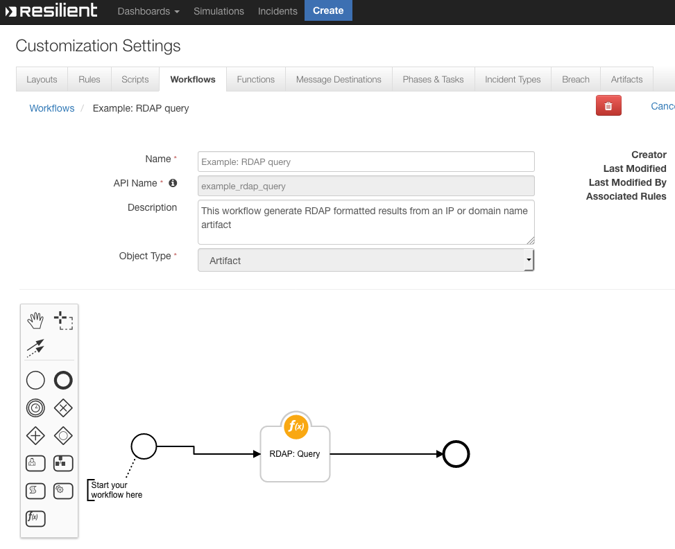

<!--
    DO NOT MANUALLY EDIT THIS FILE
    THIS FILE IS AUTOMATICALLY GENERATED WITH resilient-circuits codegen
-->

# Example: RDAP query


## Function - RDAP: Query

### API Name
`rdap_query`

### Workflow
 

### Message Destination
`fn_whois_rdap`

### Pre-Processing Script
```python
inputs.rdap_query = artifact.value
inputs.rdap_depth = 0
```

### Post-Processing Script
```python
try:
  des = artifact.description.content
except Exception:
  des = None
dummy ={}
dummy = results["content"]

if des is None:
  note =u"""<div><p>RDAP threat intelligence:\n\n <br> Possible dictonary keys: <br> \n {0} \n\n <br> Associated objects <br> \n {1} \n\n <br> DNS zone: <br> \n {2}<div><p> \n\n""".format(dummy.keys(), dummy.get(u'objects'),dummy.get('dns_zone'))
  artifact.description = helper.createRichText(note)
else:
  note = des + u"""<div><p>RDAP threat intelligence:\n\n <br> Possible dictonary keys: <br> \n {0} \n\n <br> Associated objects <br> \n {1} \n\n <br> DNS zone: <br> \n {2}<div><p> \n\n""".format(dummy.keys(), dummy.get(u'objects'),dummy.get('dns_zone'))
  artifact.description = helper.createRichText(note)

#incident.addNote(helper.createRichText(noteText))
```

---

