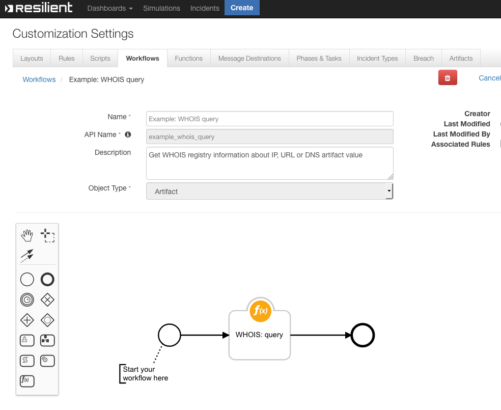

<!--
    DO NOT MANUALLY EDIT THIS FILE
    THIS FILE IS AUTOMATICALLY GENERATED WITH resilient-circuits codegen
-->

# Example: WHOIS query


## Function - WHOIS: Query

### API Name
`whois_query`

### Workflow
 

### Message Destination
`fn_whois_rdap`

### Pre-Processing Script
```python
inputs.whois_query = artifact.value
```

### Post-Processing Script
```python
try:
    des = artifact.description.content
except Exception:
  des = None
dummy ={}
dummy = results["content"]

if des is None:
  note =u"""<div><p>WHOIS threat intelligence: \n\n {}""".format(dummy)
  artifact.description = helper.createRichText(note)
else:
  note = des + u"""<div><p>WHOIS threat intelligence:\n\n {}""".format(dummy)
  artifact.description = helper.createRichText(note)
```

---

