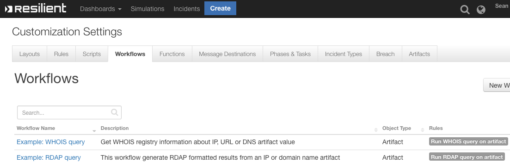
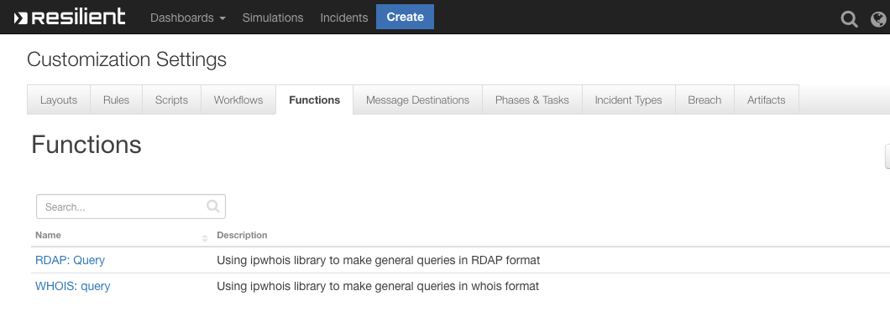

<!--
  This User README.md is generated by running:
  "resilient-circuits docgen -p fn_whois_rdap --only-user-guide"

  It is best edited using a Text Editor with a Markdown Previewer. VS Code
  is a good example. Checkout https://guides.github.com/features/mastering-markdown/
  for tips on writing with Markdown

  If you make manual edits and run docgen again, a .bak file will be created

  Store any screenshots in the "doc/screenshots" directory and reference them like:
  
-->

# **User Guide:** fn_whois_rdap_v1.0.0

## Table of Contents
- [**User Guide:** fn_whois_rdap_v1.0.0](#user-guide-fnwhoisrdapv100)
  - [Table of Contents](#table-of-contents)
  - [Key Features](#key-features)
  - [Workflows - See "./data/" directory for further details](#workflows---see-%22data%22-directory-for-further-details)
  - [Function - RDAP: Query](#function---rdap-query)
  - [Function - WHOIS: query](#function---whois-query)
  - [Inform Resilient Users](#inform-resilient-users)

---

## Key Features
<!--
  List the Key Features of the Integration
-->
* Retrieves Registry information for IP's, DNS or URL's
* Either the RDAP or WHOIS format of data can be returned
* Information is sent directly to the Artifact Description

---

## Workflows - See "./data/" directory for further details

 

## Function - RDAP: Query
Using ipwhois library to make general queries in RDAP format

 

<details><summary>Inputs:</summary>
<p>

| Name | Type | Required | Example | Tooltip |
| ---- | :--: | :------: | ------- | ------- |
| `rdap_depth` | `number` | Yes | `0` | 0, 1 or 2 |
| `rdap_query` | `text` | Yes | `ibm.com` | IP, URL or DNS |

</p>
</details>

<details><summary>Outputs:</summary>
<p>

```python
results = {
    'inputs': {u'rdap_depth': 0, u'rdap_query': u'ibm.com'}, 'metrics': {'package': 'fn-whois-rdap', 'timestamp': '2019-09-12 14:08:57', 'package_version': '1.0.0', 'host': 'seanogomcomsmbp.galway.ie.ibm.com', 'version': '1.0', 'execution_time_ms': 4128}, 'success': True, 'content': {'raw': None, 'entities': [u'IBM-1'], 'asn_registry': 'arin', 'network': {'status': [u'active'], 'handle': u'NET-129-42-0-0-1', 'name': u'IBM-RSCH-NET2', 'links': [u'https://rdap.arin.net/registry/ip/129.42.0.0', u'https://whois.arin.net/rest/net/NET-129-42-0-0-1'], 'raw': None, 'country': None, 'ip_version': u'v4', 'start_address': '129.42.0.0', 'notices': [{'description': u'By using the ARIN RDAP/Whois service, you are agreeing to the RDAP/Whois Terms of Use', 'links': [u'https://www.arin.net/resources/registry/whois/tou/'], 'title': u'Terms of Service'}, {'description': u'If you see inaccuracies in the results, please visit: ', 'links': [u'https://www.arin.net/resources/registry/whois/inaccuracy_reporting/'], 'title': u'Whois Inaccuracy Reporting'}, {'description': u'Copyright 1997-2019, American Registry for Internet Numbers, Ltd.', 'links': None, 'title': u'Copyright Notice'}], 'end_address': '129.42.255.255', 'remarks': None, 'parent_handle': u'NET-129-0-0-0-0', 'cidr': '129.42.0.0/16', 'type': u'DIRECT ASSIGNMENT', 'events': [{'action': u'last changed', 'timestamp': u'2015-10-20T16:09:08-04:00', 'actor': None}, {'action': u'registration', 'timestamp': u'1987-07-28T23:00:00-04:00', 'actor': None}]}, 'objects': {u'IBM-1': {'status': None, 'roles': [u'registrant'], 'handle': u'IBM-1', 'entities': [u'RAIN-ARIN'], 'links': [u'https://rdap.arin.net/registry/entity/IBM-1', u'https://whois.arin.net/rest/org/IBM-1'], 'raw': None, 'notices': None, 'contact': {'kind': u'org', 'name': u'IBM', 'title': None, 'phone': None, 'role': None, 'address': [{'type': None, 'value': u'3039 Cornwallis Road\nResearch Triangle Park\nNC\n27709-2195\nUnited States'}], 'email': None}, 'events_actor': None, 'remarks': None, 'events': [{'action': u'last changed', 'timestamp': u'2017-11-30T14:46:26-05:00', 'actor': None}, {'action': u'registration', 'timestamp': u'1992-02-08T00:00:00-05:00', 'actor': None}]}}, 'asn_country_code': 'US', 'dns_zone': '10.38.42.129.origin.asn.cymru.com', 'asn_date': '1987-07-29', 'asn_cidr': '129.42.38.0/24', 'nir': None, 'query': '129.42.38.10', 'asn': '16807', 'asn_description': 'IBM-EI - IBM - Events Infrastructure, US'}, 'raw': '{"raw": null, "entities": ["IBM-1"], "asn_registry": "arin", "network": {"status": ["active"], "handle": "NET-129-42-0-0-1", "name": "IBM-RSCH-NET2", "links": ["https://rdap.arin.net/registry/ip/129.42.0.0", "https://whois.arin.net/rest/net/NET-129-42-0-0-1"], "raw": null, "country": null, "ip_version": "v4", "start_address": "129.42.0.0", "notices": [{"description": "By using the ARIN RDAP/Whois service, you are agreeing to the RDAP/Whois Terms of Use", "links": ["https://www.arin.net/resources/registry/whois/tou/"], "title": "Terms of Service"}, {"description": "If you see inaccuracies in the results, please visit: ", "links": ["https://www.arin.net/resources/registry/whois/inaccuracy_reporting/"], "title": "Whois Inaccuracy Reporting"}, {"description": "Copyright 1997-2019, American Registry for Internet Numbers, Ltd.", "links": null, "title": "Copyright Notice"}], "end_address": "129.42.255.255", "remarks": null, "parent_handle": "NET-129-0-0-0-0", "cidr": "129.42.0.0/16", "type": "DIRECT ASSIGNMENT", "events": [{"action": "last changed", "timestamp": "2015-10-20T16:09:08-04:00", "actor": null}, {"action": "registration", "timestamp": "1987-07-28T23:00:00-04:00", "actor": null}]}, "objects": {"IBM-1": {"status": null, "roles": ["registrant"], "handle": "IBM-1", "entities": ["RAIN-ARIN"], "links": ["https://rdap.arin.net/registry/entity/IBM-1", "https://whois.arin.net/rest/org/IBM-1"], "raw": null, "notices": null, "contact": {"kind": "org", "name": "IBM", "title": null, "phone": null, "role": null, "address": [{"type": null, "value": "3039 Cornwallis Road\\nResearch Triangle Park\\nNC\\n27709-2195\\nUnited States"}], "email": null}, "events_actor": null, "remarks": null, "events": [{"action": "last changed", "timestamp": "2017-11-30T14:46:26-05:00", "actor": null}, {"action": "registration", "timestamp": "1992-02-08T00:00:00-05:00", "actor": null}]}}, "asn_country_code": "US", "dns_zone": "10.38.42.129.origin.asn.cymru.com", "asn_date": "1987-07-29", "asn_cidr": "129.42.38.0/24", "nir": null, "query": "129.42.38.10", "asn": "16807", "asn_description": "IBM-EI - IBM - Events Infrastructure, US"}', 'reason': None, 'version': '1.0'}
```

</p>
</details>

<details><summary>Example Pre-Process Script:</summary>
<p>

```python
inputs.rdap_query = artifact.value
inputs.rdap_depth = 0
```

</p>
</details>

<details><summary>Example Post-Process Script:</summary>
<p>

```python
try:
    des = artifact.description.content
except Exception:
  des = None
dummy ={}
dummy = results["content"]

if des is None:
  note =u"""<div><p>RDAP threat intelligence:\n\n <br> Possible dictonary keys: <br> \n {0} \n\n <br> Associated objects <br> \n {1} \n\n <br> DNS zone: <br> \n {2}<div><p>""".format(dummy.keys(), dummy.get(u'objects'),dummy.get('dns_zone'))
  artifact.description = helper.createRichText(note)
else:
  note = des + u"""<div><p>RDAP threat intelligence:\n\n <br> Possible dictonary keys: <br> \n {0} \n\n <br> Associated objects <br> \n {1} \n\n <br> DNS zone: <br> \n {2}<div><p>""".format(dummy.keys(), dummy.get(u'objects'),dummy.get('dns_zone'))
  artifact.description = helper.createRichText(note)

#incident.addNote(helper.createRichText(noteText))
```

</p>
</details>

---
## Function - WHOIS: query
Using ipwhois library to make general queries in whois format

 

<details><summary>Inputs:</summary>
<p>

| Name | Type | Required | Example | Tooltip |
| ---- | :--: | :------: | ------- | ------- |
| `whois_query` | `text` | Yes | `ibm.com` | IP, URL or DNS value |

</p>
</details>

<details><summary>Outputs:</summary>
<p>

```python
results = {
    'inputs': {u'whois_query': u'ibm.com'}, 'metrics': {'package': 'fn-whois-rdap', 'timestamp': '2019-09-12 14:05:35', 'package_version': '1.0.0', 'host': 'seanogomcomsmbp.galway.ie.ibm.com', 'version': '1.0', 'execution_time_ms': 958}, 'success': True, 'content': {'raw': None, 'asn_registry': 'arin', 'asn_country_code': 'US', 'dns_zone': '10.38.42.129.origin.asn.cymru.com', 'asn_date': '1987-07-29', 'asn_cidr': '129.42.38.0/24', 'raw_referral': None, 'nir': None, 'query': '129.42.38.10', 'referral': None, 'nets': [{'updated': '2015-10-20', 'handle': 'NET-129-42-0-0-1', 'description': 'IBM', 'postal_code': '27709-2195', 'address': '3039 Cornwallis Road', 'cidr': '129.42.0.0/16', 'emails': ['ipreg@us.ibm.com'], 'city': 'Research Triangle Park', 'name': 'IBM-RSCH-NET2', 'created': '1987-07-28', 'country': 'US', 'state': 'NC', 'range': '129.42.0.0 - 129.42.255.255'}], 'asn': '16807', 'asn_description': 'IBM-EI - IBM - Events Infrastructure, US'}, 'raw': '{"raw": null, "asn_registry": "arin", "asn_country_code": "US", "dns_zone": "10.38.42.129.origin.asn.cymru.com", "asn_date": "1987-07-29", "asn_cidr": "129.42.38.0/24", "raw_referral": null, "nir": null, "query": "129.42.38.10", "referral": null, "nets": [{"updated": "2015-10-20", "handle": "NET-129-42-0-0-1", "description": "IBM", "postal_code": "27709-2195", "address": "3039 Cornwallis Road", "cidr": "129.42.0.0/16", "emails": ["ipreg@us.ibm.com"], "city": "Research Triangle Park", "name": "IBM-RSCH-NET2", "created": "1987-07-28", "country": "US", "state": "NC", "range": "129.42.0.0 - 129.42.255.255"}], "asn": "16807", "asn_description": "IBM-EI - IBM - Events Infrastructure, US"}', 'reason': None, 'version': '1.0'}
```

</p>
</details>

<details><summary>Example Pre-Process Script:</summary>
<p>

```python
inputs.whois_query = artifact.value
```

</p>
</details>

<details><summary>Example Post-Process Script:</summary>
<p>

```python
try:
    des = artifact.description.content
except Exception:
  des = None
dummy ={}
dummy = results["content"]

if des is None:
  note =u"""<div><p>WHOIS threat intelligence: \n\n {}""".format(dummy)
  artifact.description = helper.createRichText(note)
else:
  note = des + u"""<div><p>WHOIS threat intelligence:\n\n {}""".format(dummy)
  artifact.description = helper.createRichText(note)
```

</p>
</details>

---


<!--
## Inform Resilient Users
  Use this section to optionally provide additional information so that Resilient playbook 
  designer can get the maximum benefit of your integration.
-->