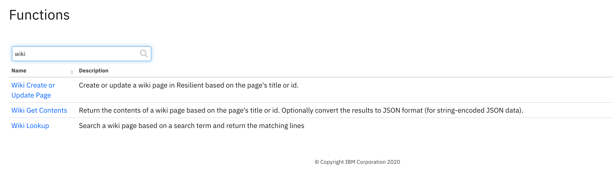

<!--
  This README.md is generated by running:
  "resilient-sdk docgen -p fn_wiki"

  It is best edited using a Text Editor with a Markdown Previewer. VS Code
  is a good example. Checkout https://guides.github.com/features/mastering-markdown/
  for tips on writing with Markdown

  If you make manual edits and run docgen again, a .bak file will be created

  Store any screenshots in the "doc/screenshots" directory and reference them like:
  
-->

# fn-wiki for IBM Resilient

## Table of Contents
- [Release Notes](#release-notes)
- [Overview](#overview)
  - [Key Features](#key-features)
- [Installation](#installation)
  - [Requirements](#requirements)
  - [Install](#install)
  - [App Configuration](#app-configuration)
- [Function - Wiki Get Contents](#function---wiki-get-contents)
- [Function - Wiki Create or Update Page](#function---wiki-create-or-update-page)
- [Function - Wiki Lookup](#function---wiki-lookup)
- [Rules](#rules)
- [Troubleshooting & Support](#troubleshooting-&-support)
---

## Release Notes
<!--
  Specify all changes in this release. Do not remove the release 
  notes of a previous release
-->
### v1.0.0
* Initial Release

---

## Overview
<!--
  Provide a high-level description of the function itself and its remote software or application.
  The text below is parsed from the "description" and "long_description" attributes in the setup.py file
-->
Perform operations against the Resilient wiki: create or update pages, read wiki contents and perform lookups of content.

 


### Key Features
<!--
  List the Key Features of the Integration
-->
* Create or update a wiki page, including child pages
* Get the contents of a wiki page
* Lookup content in a specific page

---

## Installation

### Requirements
<!--
  List any Requirements 
-->
* Resilient platform >= `v36.0.5634`
* An App Host or an Integration Server:
  * To setup up an App Host see:  [ibm.biz/res-app-host-setup](https://ibm.biz/res-app-host-setup)
  * An Integration Server running `resilient_circuits>=30.0.0` (if using an Integration Server)
    * To set up an Integration Server see: [ibm.biz/res-int-server-guide](https://ibm.biz/res-int-server-guide)
    * If using an API key account, minimum required permissions are:
      | Name | Permissions |
      | ---- | ----------- |
      | Org Data | Read |
      | Function | Read |
* Proxy supported: n/a.

---

### Install
* To install or uninstall an App using the App Host see [ibm.biz/res-install-app](https://ibm.biz/res-install-app)

* To install or uninstall an Integration using the Integration Server see the [ibm.biz/res-install-int](https://ibm.biz/res-install-int)
---

### App Configuration
This app has no settings in app.config.

---


## Function - Wiki Get Contents
Return the contents of a wiki page based on the page's title or id. Optionally convert the results to JSON format (for string-encoded JSON data).


<details><summary>Inputs:</summary>
<p>

| Name | Type | Required | Example | Tooltip |
| ---- | :--: | :------: | ------- | ------- |
| `wiki_contents_as_json` | `boolean` | No | `-` | - |
| `wiki_title_or_id` | `text` | Yes | `-` | Either wiki page title or numeric id |

</p>
</details>

<details><summary>Outputs:</summary>
<p>

```python
results = {
    # TODO: Copy and paste an example of the Function Output within this code block.
    # To view the output of a Function, run resilient-circuits in DEBUG mode and invoke the Function. 
    # The Function results will be printed in the logs: "resilient-circuits run --loglevel=DEBUG"
}
```

</p>
</details>

<details><summary>Example Pre-Process Script:</summary>
<p>

```python
None
```

</p>
</details>

<details><summary>Example Post-Process Script:</summary>
<p>

```python
note = u"Page/Id: '{}'".format(results.inputs.get('wiki_title') if results.inputs.get('wiki_title') else results.inputs.get('wiki_id'))
if results.content:
    note = u"{} contents:\n\n{}".format(note, results.content['text'])
    if results.content.get('json'):
        note = u"{} \nJSON contents:\n\n{}".format(note, results.content['json'])
else:
    note = u"{} not found".format(note)
    
incident.addNote(note)
```

</p>
</details>

---
## Function - Wiki Create or Update Page
Create or update a wiki page in Resilient based on the page's title or id. Optionally create a page as a child page.


<details><summary>Inputs:</summary>
<p>

| Name | Type | Required | Example | Tooltip |
| ---- | :--: | :------: | ------- | ------- |
| `wiki_body` | `text` | Yes | `-` | - |
| `wiki_create_if_missing` | `boolean` | Yes | `-` | Specify 'No' to only update |
| `wiki_parent_title_or_id` | `text` | No | `-` | Either wiki page title or numeric id |
| `wiki_title_or_id` | `text` | Yes | `-` | Either wiki page title or numeric id |

</p>
</details>

<details><summary>Outputs:</summary>
<p>

```python
results = {
    # TODO: Copy and paste an example of the Function Output within this code block.
    # To view the output of a Function, run resilient-circuits in DEBUG mode and invoke the Function. 
    # The Function results will be printed in the logs: "resilient-circuits run --loglevel=DEBUG"
}
```

</p>
</details>

<details><summary>Example Pre-Process Script:</summary>
<p>

```python
None
```

</p>
</details>

<details><summary>Example Post-Process Script:</summary>
<p>

```python
note = u"Page/Id: '{}'".format(results.inputs.get('wiki_title') if results.inputs.get('wiki_title') else results.inputs.get('wiki_id'))
if results.content:
    incident.addNote(u"{} created/updated\n\n{}".format(note, results.content['text']))
```

</p>
</details>

---
## Function - Wiki Lookup
Search a wiki page based on a search term and return the matching lines. The search term can be a regular expression (regex) for generalized lookup.


<details><summary>Inputs:</summary>
<p>

| Name | Type | Required | Example | Tooltip |
| ---- | :--: | :------: | ------- | ------- |
| `wiki_search_term` | `text` | No | `-` | text or regular expression format |
| `wiki_title_or_id` | `text` | Yes | `-` | Either wiki page title or numeric id |

</p>
</details>

<details><summary>Outputs:</summary>
<p>

```python
results = {
    # TODO: Copy and paste an example of the Function Output within this code block.
    # To view the output of a Function, run resilient-circuits in DEBUG mode and invoke the Function. 
    # The Function results will be printed in the logs: "resilient-circuits run --loglevel=DEBUG"
}
```

</p>
</details>

<details><summary>Example Pre-Process Script:</summary>
<p>

```python
None
```

</p>
</details>

<details><summary>Example Post-Process Script:</summary>
<p>

```python
note = u"Page/Id: '{}'".format(results.inputs.get('wiki_title') if results.inputs.get('wiki_title') else results.inputs.get('wiki_id'))
if results.content:
    incident.addNote(u"{}\n\n{}".format(note, "\n".join(results.content)))
else:
    incident.addNote(u"{} not found".format(note))
```

</p>
</details>

---


## Rules
Use the example rules and workflows to understand how to use the inputs and parse the resulting content. Design your own rules and workflows based on your business requirements. 

| Rule Name | Object | Workflow Triggered |
| --------- | ------ | ------------------ |
| Example: Wiki Get Contents | incident | `example_wiki_get_contents` |
| Example: Wiki Create Page | incident | `example_wiki_create_page` |
| Example: Wiki Lookup | incident | `example_wiki_lookup` |

---

## Troubleshooting & Support
If using the app with an App Host, see the Resilient System Administrator Guide and the App Host Deployment Guide for troubleshooting procedures. You can find these guides on the [IBM Knowledge Center](https://www.ibm.com/support/knowledgecenter/SSBRUQ), where you can select which version of the Resilient platform you are using.

If using the app with an integration server, see the [Integration Server Guide](https://ibm.biz/res-int-server-guide)

### For Support
This is a IBM Community Provided App. Please search the Community https://ibm.biz/resilientcommunity for assistance.
