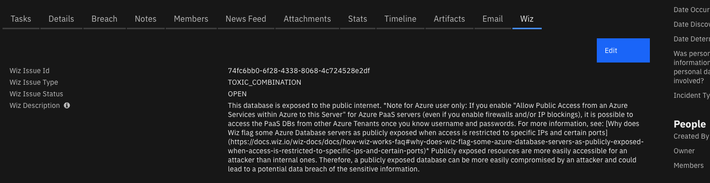
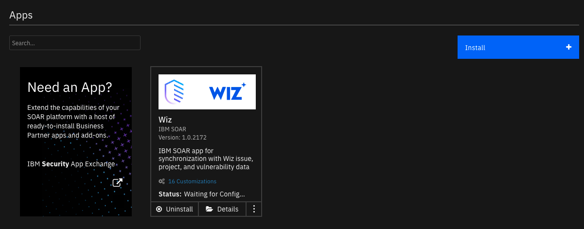
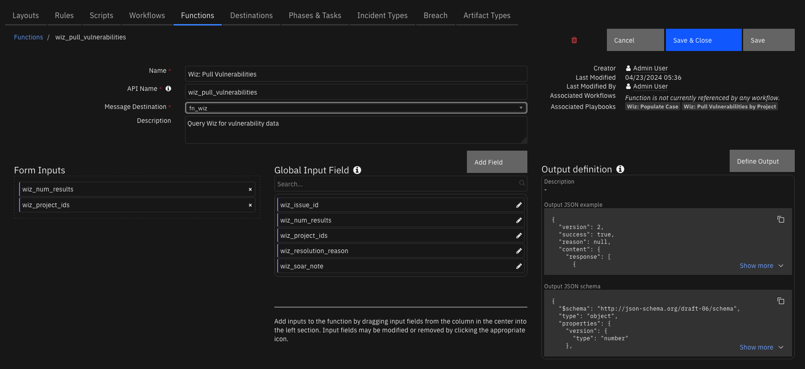
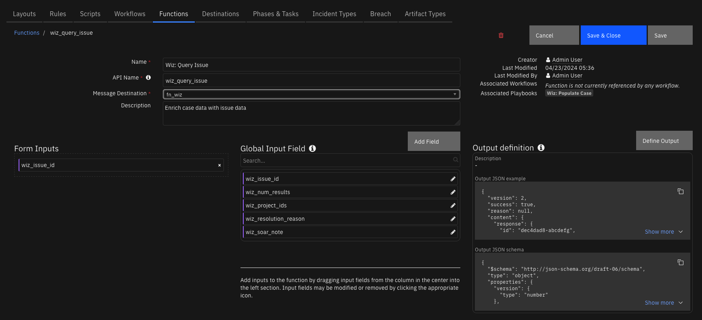
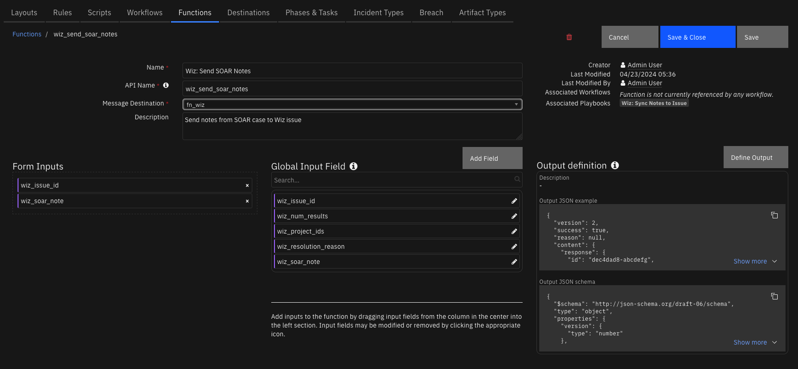
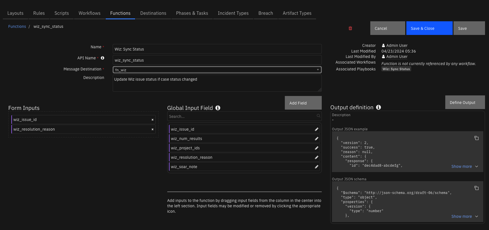
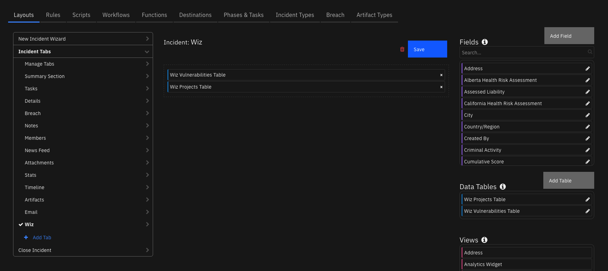
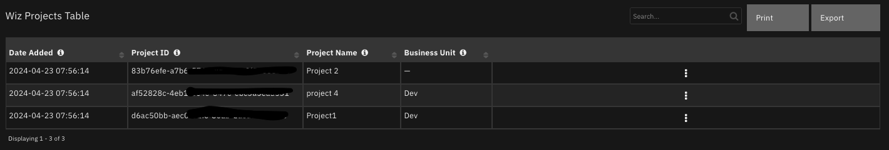
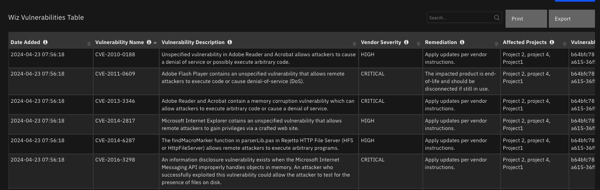

# Wiz


## Table of Contents
- [Release Notes](#release-notes)
- [Overview](#overview)
  - [Key Features](#key-features)
- [Requirements](#requirements)
  - [SOAR platform](#soar-platform)
  - [Cloud Pak for Security](#cloud-pak-for-security)
  - [Proxy Server](#proxy-server)
  - [Python Environment](#python-environment)
- [Installation](#installation)
  - [Install](#install)
  - [App Configuration](#app-configuration)
  - [Poller Considerations](#poller-considerations)
    - [Poller Templates for SOAR Cases](#poller-templates-for-soar-cases)
- [Function - Wiz: Pull Vulnerabilities](#function---wiz-pull-vulnerabilities)
- [Function - Wiz: Query Issue](#function---wiz-query-issue)
- [Function - Wiz: Send SOAR Notes](#function---wiz-send-soar-notes)
- [Function - Wiz: Sync Status](#function---wiz-sync-status)
  - [Custom Layouts](#custom-layouts)
- [Data Table - Wiz Projects Table](#data-table---wiz-projects-table)
- [Data Table - Wiz Vulnerabilities Table](#data-table---wiz-vulnerabilities-table)
- [Custom Fields](#custom-fields)
- [Playbooks](#playbooks)
- [Troubleshooting & Support](#troubleshooting--support)

---

## Release Notes
<!--
  Specify all changes in this release. Do not remove the release 
  notes of a previous release
-->
| Version | Date | Notes |
| ------- | ---- | ----- |
| 1.1.0, 1.1.1 | 11/2024 | Added wiz_issue_type incident field |
| 1.0.1 | 08/2024 | Optimize pulling vulnerabilities |
| 1.0.0 | 04/2024 | Initial Release |

### Version 1.1.0, 1.1.1 
The Wiz issue type will now display on the Wiz incident tab in SOAR. Upgrading from 
previous versions of this app may not update the SOAR tab and may require the tab to be 
edited manually to display the Wiz issue type. In this case, use the SOAR Customization Settings to edit the Wiz tab to include the `wiz_issue_type` incident field. 

 
---

## Overview
<!--
  Provide a high-level description of the function itself and its remote software or application.
  The text below is parsed from the "description" and "long_description" attributes in the setup.py file
-->
**IBM SOAR app for synchronization with Wiz issue, project, and vulnerability data**

 

Wiz is a cloud security platform that scans and monitors cloud resources for vulnerabilities and affected assets.

This app polls Wiz Issues to create, update, or close corresponding cases in IBM QRadar SOAR and enriches the cases with Wiz project and vulnerability data for investigation. The app also updates Wiz issues based on changes to corresponding SOAR cases.


### Key Features
<!--
  List the Key Features of the Integration
-->
* Create, update, close IBM SOAR cases based on updates from Wiz Issues
* Synchronize statuses and notes between SOAR cases and Wiz issues
* Pull data on projects and vulnerabilities associated with Wiz Issue into SOAR case
---

## Requirements
<!--
  List any Requirements 
--> 
This app supports the IBM Security QRadar SOAR Platform and the IBM Security QRadar SOAR for IBM Cloud Pak for Security.

### SOAR platform
The SOAR platform supports two app deployment mechanisms, Edge Gateway (also known as App Host) and integration server.

If deploying to a SOAR platform with an App Host, the requirements are:
* SOAR platform >= `50.0.9097`.
* The app is in a container-based format (available from the AppExchange as a `zip` file).

If deploying to a SOAR platform with an integration server, the requirements are:
* SOAR platform >= `50.0.9097`.
* The app is in the older integration format (available from the AppExchange as a `zip` file which contains a `tar.gz` file).
* Integration server is running `resilient-circuits>=51.0.1.0.0`.
* If using an API key account, make sure the account provides the following minimum permissions: 
  | Name | Permissions |
  | ---- | ----------- |
  | Org Data | Read |
  | Function | Read |
  | Incidents | Read, Create |
  | Edit Incidents | Fields, Status, Notes |
  | Layouts | Read, Edit |

The following SOAR platform guides provide additional information: 
* _Edge Gateway Deployment Guide_ or _App Host Deployment Guide_: provides installation, configuration, and troubleshooting information, including proxy server settings. 
* _Integration Server Guide_: provides installation, configuration, and troubleshooting information, including proxy server settings.
* _System Administrator Guide_: provides the procedure to install, configure and deploy apps. 

The above guides are available on the IBM Documentation website at [ibm.biz/soar-docs](https://ibm.biz/soar-docs). On this web page, select your SOAR platform version. On the follow-on page, you can find the _Edge Gateway Deployment Guide_, _App Host Deployment Guide_, or _Integration Server Guide_ by expanding **Apps** in the Table of Contents pane. The System Administrator Guide is available by expanding **System Administrator**.

### Cloud Pak for Security
If you are deploying to IBM Cloud Pak for Security, the requirements are:
* IBM Cloud Pak for Security >= `1.10`.
* Cloud Pak is configured with an Edge Gateway.
* The app is in a container-based format (available from the AppExchange as a `zip` file).

The following Cloud Pak guides provide additional information: 
* _Edge Gateway Deployment Guide_ or _App Host Deployment Guide_: provides installation, configuration, and troubleshooting information, including proxy server settings. From the Table of Contents, select Case Management and Orchestration & Automation > **Orchestration and Automation Apps**.
* _System Administrator Guide_: provides information to install, configure, and deploy apps. From the IBM Cloud Pak for Security IBM Documentation table of contents, select Case Management and Orchestration & Automation > **System administrator**.

These guides are available on the IBM Documentation website at [ibm.biz/cp4s-docs](https://ibm.biz/cp4s-docs). From this web page, select your IBM Cloud Pak for Security version. From the version-specific IBM Documentation page, select Case Management and Orchestration & Automation.

### Proxy Server
The app **does** support a proxy server.

### Python Environment
Python 3.6 and Python 3.9 are supported.
Additional package dependencies may exist for each of these packages:
* resilient-circuits>=51.0.1.0.0

### Development Version

This app has been implemented using:
| Product Name | API URL | API Version |
| ------------ | ------- | ----------- |
| Wiz | https://api.{region}.app.wiz.io/graphql | v1 |

#### Prerequisites
<!--
List any prerequisites that are needed to use with this endpoint solution. Remove any section that is unnecessary.
-->
* An active Wiz service account
* Client ID and secret

#### Permissions
<!--
List any user permissions that are needed to use this endpoint. For example, list the API key permissions.
-->
Your Wiz service account should have the following permissions:
* `read:issues`
* `update:issues`
* `read:projects`
* `read:vulnerabilities`

---

## Installation

### Install
* To install or uninstall an App or Integration on the _SOAR platform_, see the documentation at [ibm.biz/soar-docs](https://ibm.biz/soar-docs).
* To install or uninstall an App on _IBM Cloud Pak for Security_, see the documentation at [ibm.biz/cp4s-docs](https://ibm.biz/cp4s-docs) and follow the instructions above to navigate to Orchestration and Automation.

### App Configuration
The following table provides the settings you need to configure the app. These settings are made in the app.config file. See the documentation discussed in the Requirements section for the procedure.

| Config | Required | Example | Description |
| ------ | :------: | ------- | ----------- |
| **api_url** | Yes | `https://api.us1.app.wiz.io/graphql` | URL to query Wiz GraphQL API. The region may be us1, us2, eu1, or eu2, update to your account specifications. |
| **client_id** | Yes | `xxx` | Client ID for service account |
| **client_secret** | Yes | `xxx` | Client secret token for service account |
| **endpoint_url** | Yes | `https://app.wiz.io` | Base URL for Wiz to generate links back to Wiz issues. For almost all deployments, it will be https://app.wiz.io |
| **polling_interval** | Yes | `86400` | Number of seconds between poller cycles |
| **polling_lookback** | Yes | `120` | Number of minutes to lookback when querying for issues the first time the poller runs |
| **token_url** | Yes | `https://auth.app.wiz.io/oauth/token` | Wiz token URL for generating a Authentication Bearer token. For government tenants, set to the token URL to https://auth.gov.wiz.io/oauth/token |


### Poller Considerations
When the poller is enabled, Wiz issues are automatically escalated from this app to be created as cases in SOAR. Any updates are checked at the cadence defined by the value set for `poller_interval`. Updates for this app are classified as any changes in a Wiz issue status. If a Wiz issue status is updated, the poller will reflect this change in the corresponding SOAR case.
It is possible to escalate cases from other sources. In this scenario, the poller would be disabled by setting `poller_interval=0` and a separate source might capture a case from the endpoint and in turn create a case in SOAR. This app can still be useful for enrichment of that
newly created case even though it was not directly escalated from this app. As long as the reference ID (i.e. Issue ID) for each case is preserved, all remaining details will synchronize to the SOAR case through this app automatically.
Note: Any Wiz issues that are marked as "resolved" in Wiz *before* they have been created as cases in SOAR will not be processed by the poller.
*New in v1.0.1*: To reduce number of outgoing API calls to Wiz API when requesting vulnerability data, a cache has been implemented. On each iteration of the poller, the cache is refreshed with the most recent 500 OPEN vulnerabilities that have a vendorSeverity of CRITICAL or HIGH. This is used to populate the vulnerabilities data table. If you would like to customize this query, consider utilizing the Pull Vulnerabilities playbook, where you can enter a custom query to provide as the `variables` for the Wiz GraphQL query.

#### Poller Templates for SOAR Cases
It may be necessary to modify the templates used to create, update, or close SOAR cases based on your required custom fields in SOAR.

This is especially relevant if you have required custom _close_ fields that need to be filled when closing a case in SOAR. If that is the case, be sure to implement a custom `close_case_template` and reference those required close fields in the template.

When overriding the template in App Host, specify the file path for each file as `/var/rescircuits`.

Below are the default templates used which can be copied, modified, and used with app_config's
`soar_create_case_template`, `soar_update_case_template`, and `soar_close_case_template` settings to override the default templates.

<details><summary>soar_create_case.jinja</summary>

```jinja
{
  {# JINJA template for creating a new SOAR incident from an endpoint #}
  
  "name": "Wiz Issue - {{ sourceRule.name }}: {{ id }}",
  "description": "{{ sourceRule.controlDescription | replace('"', '\\"') }}",
  "discovered_date": {{ createdAt| soar_datetimeformat(split_at='.') }},
  "start_date": {{ createdAt| soar_datetimeformat(split_at='.') }},
  "plan_status": "A",
  "severity_code": "{{ severity | soar_substitute(severity_mapping) }}",
  "properties": {
    "wiz_issue_id": "{{ id }}",
    "wiz_issue_status": "{{ status }}",
    "wiz_description": "{{ sourceRule.controlDescription | replace('"', '\\"') }}"
  },

  {# add comments as necessary #}
  "comments": [
    {
      "text": {
        "format": "html",
        "content": "<b>Created by Wiz:</b> {{ entity_url }}"
      }
    }
  ]
}
```
</details>

<details><summary>soar_update_case.jinja</summary>

```jinja
{
  {# JINJA template for updating a new SOAR incident from an endpoint #}
  
  "severity_code": "{{ severity | soar_substitute(severity_mapping) }}",
  {# specify your custom fields for your endpoint solution #}
  "properties": {
      "wiz_issue_status": "{{ status }}"
  }
}

```
</details>

<details><summary>soar_close_case.jinja</summary>

```jinja
{
  {# JINJA template for closing a SOAR incident using endpoint data #}
  

  

  "plan_status": "C",
  "resolution_id": "{{ status | soar_substitute(resolution_mapping) }}",
  "resolution_summary": "{{close_message}} {{ status }}",
  {# add additional fields based on your 'on close' field requirements #}
  "properties": {
      "wiz_issue_status": "{{ status }}"
  }
}
```
</details>


 ---

## Function - Wiz: Pull Vulnerabilities
Query Wiz for vulnerability data

 

<details><summary>Inputs:</summary>
<p>

| Name | Type | Required | Example | Tooltip |
| ---- | :--: | :------: | ------- | ------- |
| `wiz_num_results` | `number` | No | `-` | - |
| `wiz_project_ids` | `text` | No | `-` | - |
| `wiz_query_filter` | `text` | No | `{ "first": 5, "filterBy": { "vendorSeverity": [ "CRITICAL" ] } }` | Dictionary that represents 'variables' object that gets passed with the Wiz query to filter results. Required 'first' parameter. |

</p>
</details>

<details><summary>Outputs:</summary>
<p>

> **NOTE:** This example might be in JSON format, but `results` is a Python Dictionary on the SOAR platform.

```python
results = {
  "content": {
    "projects": [
      "1234567-abcdefg1",
      "1234567-abcdefg2",
      "1234567-abcdefg3"
    ],
    "response": [
      {
        "CVEDescription": "The software constructs all or part of an SQL command using externally-influenced input from an upstream component, but it does not neutralize or incorrectly neutralizes special elements that could modify the intended SQL command when it is sent to a downstream component.",
        "CVSSSeverity": "NONE",
        "dataSourceName": "Wiz Demo",
        "description": "The vulnerability `CWE-89`  was found in the  `GET /WebGoat/SqlInjectionMitigations/servers?column=id` with  severity of `Critical`.The vulnerability can be remediated by \u0027use an Object-Relational Mapping (ORM) like Hibernate that safely handles database interaction`.",
        "detailedName": "GET /WebGoat/SqlInjectionMitigations/servers?column=id",
        "detectionMethod": "EXTERNAL_NETWORK_SCAN",
        "epssPercentile": 0,
        "epssProbability": 0,
        "epssSeverity": null,
        "exploitabilityScore": 0,
        "firstDetectedAt": "2024-04-15T11:12:05.228481Z",
        "fixedVersion": null,
        "hasCisaKevExploit": false,
        "hasExploit": null,
        "id": "1234567-abcdefg",
        "ignoreRules": null,
        "impactScore": 0,
        "lastDetectedAt": "2024-04-15T11:12:05.228481Z",
        "layerMetadata": null,
        "link": "https:/test/com",
        "locationPath": null,
        "name": "CWE-89",
        "portalUrl": "https://app.wiz.io/explorer/vulnerability-findings#~(entity~(~\u0027ID))",
        "projects": [
          {
            "businessUnit": "",
            "id": "1234567-abcdefg",
            "name": "Project 2",
            "riskProfile": {
              "businessImpact": "MBI"
            },
            "slug": "project-2"
          },
          {
            "businessUnit": "Dev",
            "id": "1234567-abcdefg",
            "name": "project 4",
            "riskProfile": {
              "businessImpact": "MBI"
            },
            "slug": "project-4"
          },
          {
            "businessUnit": "Dev",
            "id": "1234567-abcdefg",
            "name": "Project1",
            "riskProfile": {
              "businessImpact": "MBI"
            },
            "slug": "project1"
          }
        ],
        "remediation": "The most effective method of stopping SQL injection attacks is to only use an Object-Relational Mapping (ORM) like Hibernate...",
        "resolutionReason": null,
        "resolvedAt": null,
        "score": 0,
        "status": "OPEN",
        "validatedInRuntime": null,
        "vendorSeverity": "CRITICAL",
        "version": null,
        "vulnerableAsset": {
          "cloudPlatform": "AWS",
          "cloudProviderURL": "https://test-console.aws.amazon.com/ec2/v2/home?#instanceDetailsid=0",
          "hasLimitedInternetExposure": true,
          "hasWideInternetExposure": true,
          "id": "1234567-abcdefg",
          "ipAddresses": [
            "1.1.1.1",
            "2.2.2.2"
          ],
          "isAccessibleFromOtherSubscriptions": null,
          "isAccessibleFromOtherVnets": null,
          "isAccessibleFromVPN": null,
          "name": "Demo vulns findings",
          "operatingSystem": "Linux",
          "providerUniqueId": "arn:aws:instance/abcedefg",
          "region": "us-east-2",
          "status": "Active",
          "subscriptionExternalId": "998231069301",
          "subscriptionId": "abcdefg-12345",
          "subscriptionName": "wiz-integrations",
          "tags": {
            "Name": "Demo vulns findings"
          },
          "type": "VIRTUAL_MACHINE"
        }
      },
      {
        "CVEDescription": "The software constructs all or part of an SQL command using externally-influenced input from an upstream component, but it does not neutralize or incorrectly neutralizes special elements that could modify the intended SQL command when it is sent to a downstream component.",
        "CVSSSeverity": "NONE",
        "dataSourceName": "Wiz Demo",
        "description": "The vulnerability `CWE-89`  was found in the  `GET /WebGoat/SqlInjectionMitigations/servers?column=id` with  severity of `Critical`.The vulnerability can be remediated by \u0027use an Object-Relational Mapping (ORM) like Hibernate that safely handles database interaction`.",
        "detailedName": "GET /WebGoat/SqlInjectionMitigations/servers?column=id",
        "detectionMethod": "EXTERNAL_NETWORK_SCAN",
        "epssPercentile": 0,
        "epssProbability": 0,
        "epssSeverity": null,
        "exploitabilityScore": 0,
        "firstDetectedAt": "2024-04-15T11:12:05.226955Z",
        "fixedVersion": null,
        "hasCisaKevExploit": false,
        "hasExploit": null,
        "id": "1234567-abcdefg",
        "ignoreRules": null,
        "impactScore": 0,
        "lastDetectedAt": "2024-04-15T11:12:05.226955Z",
        "layerMetadata": null,
        "link": "https:/test/com",
        "locationPath": null,
        "name": "CWE-89",
        "portalUrl": "https://app.wiz.io/explorer/vulnerability-findings#~(entity~(~\u0027ID))",
        "projects": [
          {
            "businessUnit": "",
            "id": "1234567-abcdefg",
            "name": "Project 2",
            "riskProfile": {
              "businessImpact": "MBI"
            },
            "slug": "project-2"
          },
          {
            "businessUnit": "Dev",
            "id": "1234567-abcdefg",
            "name": "project 4",
            "riskProfile": {
              "businessImpact": "MBI"
            },
            "slug": "project-4"
          },
          {
            "businessUnit": "Dev",
            "id": "1234567-abcdefg",
            "name": "Project1",
            "riskProfile": {
              "businessImpact": "MBI"
            },
            "slug": "project1"
          }
        ],
        "remediation": "The most effective method of stopping SQL injection attacks is to only use an Object-Relational Mapping (ORM) like Hibernate...",
        "resolutionReason": null,
        "resolvedAt": null,
        "score": 0,
        "status": "OPEN",
        "validatedInRuntime": null,
        "vendorSeverity": "CRITICAL",
        "version": null,
        "vulnerableAsset": {
          "cloudPlatform": "AWS",
          "cloudProviderURL": null,
          "hasLimitedInternetExposure": null,
          "hasWideInternetExposure": null,
          "id": "1234567-abcdefg",
          "imageId": "sha256:7d1eabcdefg",
          "isAccessibleFromOtherSubscriptions": null,
          "isAccessibleFromOtherVnets": null,
          "isAccessibleFromVPN": null,
          "name": "test-aws.amazonaws.com/eks/kube-proxy@sha256:7d1eabcdefg",
          "providerUniqueId": "",
          "region": "us-east-1",
          "status": "Active",
          "subscriptionExternalId": "6024000000000",
          "subscriptionId": "e644fdd8-abcdefg",
          "subscriptionName": null,
          "tags": {
            "io.cri-containerd.image": "managed"
          },
          "type": "CONTAINER_IMAGE"
        }
      }
    ]
  },
  "inputs": {
    "wiz_project_ids": "83b76efe-a7b6-5762-8a53-8e8f59e68bd8,af52828c-4eb1-5c4e-847c-ebc3a5ead531,d6ac50bb-aec0-52fc-80ab-bacd7b02f178"
  },
  "metrics": {
    "execution_time_ms": 3713,
    "host": "e35c5a28-689e-4f7f-b84e-4eced01ba15f-55b865fcb6-pnkfz",
    "package": "fn-wiz",
    "package_version": "1.0.1982",
    "timestamp": "2024-04-15 11:57:40",
    "version": "1.0"
  },
  "raw": null,
  "reason": null,
  "success": true,
  "version": 2.0
}
```

</p>
</details>

<details><summary>Example Function Input Script:</summary>
<p>

```python
"""
Pull out project ids associated with the given issue. We can use this to query Wiz for vulnerabilities data.
"""

results = playbook.functions.results.query_issue_results

project_ids = []
if not results.success:
  incident.addNote("<b>Wiz: Populate Case:</b> Unable to get issue data to retrieve projects.")
else:
  projects = results.get("content", {}).get("response", {}).get("projects", [])
  if projects:
    inputs.wiz_project_ids = ",".join([p.get("id") for p in projects])    
# OPTIONAL: Specify the maximum desired number of results, returns max of 50 results by default
# inputs.wiz_num_results = 

```

</p>
</details>

<details><summary>Example Function Post Process Script:</summary>
<p>

```python
from datetime import datetime

def get_projects(vuln):
  """
  Get a string of the project names affected by this vulnerability 
  :param vuln (dict): vulnerability object
  """
  projects = vuln.get('projects', [])
  if projects:
    project_names = [p.get('name') for p in projects]
    return ", ".join(project_names)
  
  return "-"
  
results = playbook.functions.results.vulnerability_results

if not results.success:
    incident.addNote(f"<b>Wiz: Populate Case:</b> Unable to get vulnerability data to update Wiz Vulnerabilities data table: {results.reason}")
else:
  content = results.get('content', {})
  if content:
    vulnerabilities = content.get('response', [])
    for vuln in vulnerabilities:
      row = incident.addRow("wiz_vulnerabilities_table")
      row["date_added"] = datetime.now().strftime("%Y-%m-%d %H:%M:%S")
      row["vulnerability_description"] = vuln.get('description', '')
      row["vulnerability_name"] = vuln.get('name', '')
      row["affected_projects"] = get_projects(vuln)
      row["vendor_severity"] = vuln.get('vendorSeverity', '')
      row["remediation"] = vuln.get('remediation', '')
      row["vulnerable_asset_id"] = vuln.get('vulnerableAsset', {}).get('id', '')
      row["vulnerable_asset_type"] = vuln.get('vulnerableAsset', {}).get('type', '')
      row["vulnerable_asset_os"] = vuln.get('vulnerableAsset', {}).get('operatingSystem', '')
      
    incident.addNote(f"<b>Wiz: Populate Case:</b> Added {len(vulnerabilities)} vulnerabilities to Wiz Vulnerabilities data table")
  else:
    incident.addNote("<b>Wiz: Populate Case:</b> No content found to add to vulnerabilities data table")

```

</p>
</details>

---
## Function - Wiz: Query Issue
Enrich case data with issue data

 

<details><summary>Inputs:</summary>
<p>

| Name | Type | Required | Example | Tooltip |
| ---- | :--: | :------: | ------- | ------- |
| `wiz_issue_id` | `text` | Yes | `-` | - |

</p>
</details>

<details><summary>Outputs:</summary>
<p>

> **NOTE:** This example might be in JSON format, but `results` is a Python Dictionary on the SOAR platform.

```python
results = {
  "content": {
    "response": {
      "createdAt": "2024-04-15T10:16:14.443631Z",
      "dueAt": null,
      "entitySnapshot": {
        "cloudPlatform": null,
        "cloudProviderURL": "",
        "createdAt": null,
        "externalId": "vulnerability##592f0bdc-ab9b##",
        "id": "fa059989-abcdefg",
        "name": "CVE-2023-5528",
        "nativeType": "",
        "providerId": "vulnerability##592f0bdc-ab9b##",
        "region": "",
        "resourceGroupExternalId": "",
        "status": null,
        "subscriptionExternalId": "",
        "subscriptionName": "",
        "subscriptionTags": null,
        "tags": {},
        "type": "SECURITY_TOOL_FINDING"
      },
      "id": "dec4dad8-abcdefg",
      "notes": [
        {
          "createdAt": "2024-04-15T11:55:20.461314Z",
          "serviceAccount": {
            "name": "ibm-soar"
          },
          "text": "Note from SOAR: test note",
          "updatedAt": "2024-04-15T11:55:20.46232Z",
          "user": null
        }
      ],
      "projects": [
        {
          "businessUnit": "",
          "id": "83b76efe-abcdefg",
          "name": "Project 2",
          "riskProfile": {
            "businessImpact": "MBI"
          },
          "slug": "project-2"
        },
        {
          "businessUnit": "Dev",
          "id": "af52828c-abcdefg",
          "name": "project 4",
          "riskProfile": {
            "businessImpact": "MBI"
          },
          "slug": "project-4"
        },
        {
          "businessUnit": "Dev",
          "id": "d6ac50bb-abcdefg",
          "name": "Project1",
          "riskProfile": {
            "businessImpact": "MBI"
          },
          "slug": "project1"
        }
      ],
      "resolvedAt": null,
      "serviceTickets": [],
      "severity": "INFORMATIONAL",
      "sourceRule": {
        "__typename": "Control",
        "controlDescription": "",
        "id": "60873d6d-abcdefg",
        "name": "All Findings",
        "resolutionRecommendation": "",
        "securitySubCategories": null
      },
      "status": "OPEN",
      "statusChangedAt": "2024-04-15T10:14:50.891007Z",
      "type": "TOXIC_COMBINATION",
      "updatedAt": "2024-04-15T11:55:20.484648Z"
    }
  },
  "inputs": {
    "wiz_issue_id": "dec4dad8-abcdefg"
  },
  "metrics": {
    "execution_time_ms": 668,
    "host": "e35c5a28-abcdefg",
    "package": "fn-wiz",
    "package_version": "1.0.1982",
    "timestamp": "2024-04-15 11:57:34",
    "version": "1.0"
  },
  "raw": null,
  "reason": null,
  "success": true,
  "version": 2.0
}
```

</p>
</details>

<details><summary>Example Function Input Script:</summary>
<p>

```python
inputs.wiz_issue_id = incident.properties.wiz_issue_id
```

</p>
</details>

<details><summary>Example Function Post Process Script:</summary>
<p>

```python
results = playbook.functions.results.query_issue_results
if not results.success:
    incident.addNote(f"<b>Wiz: Populate Case:</b> Unable to get issue data to update custom fields: {results.reason}")
else:
  projects = results.get("content", {}).get("response", {}).get("projects", [])
  if projects:
    for p in projects:
      incident.addArtifact('Observed Data', p.get('name') , 'Found project in Wiz')
    incident.addNote(f"<b>Wiz: Populate Case:</b> Added {len(projects)} projects as artifacts")
  else:
    incident.addNote("<b>Wiz: Populate Case:</b> No projects found in Wiz to add as artifacts")
      
```

</p>
</details>

---
## Function - Wiz: Send SOAR Notes
Send notes from SOAR case to Wiz issue

 

<details><summary>Inputs:</summary>
<p>

| Name | Type | Required | Example | Tooltip |
| ---- | :--: | :------: | ------- | ------- |
| `wiz_issue_id` | `text` | Yes | `-` | - |
| `wiz_soar_note` | `text` | Yes | `-` | - |

</p>
</details>

<details><summary>Outputs:</summary>
<p>

> **NOTE:** This example might be in JSON format, but `results` is a Python Dictionary on the SOAR platform.

```python
results = {
  "content": {
    "message": "Successfully updated issue.",
    "response": {
      "dueAt": null,
      "id": "dec4dad8-abcdefg",
      "note": "",
      "resolutionReason": null,
      "status": "OPEN"
    }
  },
  "inputs": {
    "wiz_issue_id": "dec4dad8-abcdefg",
    "wiz_soar_note": "\u003cdiv class=\"soar-rte-content\"\u003e\u003cp\u003etest\u003c/p\u003e\u003c/div\u003e"
  },
  "metrics": {
    "execution_time_ms": 2034,
    "host": "e35c5a28-abcdefg",
    "package": "fn-wiz",
    "package_version": "1.0.1982",
    "timestamp": "2024-04-15 11:58:17",
    "version": "1.0"
  },
  "raw": null,
  "reason": null,
  "success": true,
  "version": 2.0
}
```

</p>
</details>

<details><summary>Example Function Input Script:</summary>
<p>

```python
inputs.wiz_issue_id = incident.properties.wiz_issue_id
inputs.wiz_soar_note = note.text.content
```

</p>
</details>

<details><summary>Example Function Post Process Script:</summary>
<p>

```python
results = playbook.functions.results.notes_result

if not results.success:
  incident.addNote(f"<b>Wiz: Sync Notes to Issue:</b> Failed to add note to Wiz issue: {results.reason}")
```

</p>
</details>

---
## Function - Wiz: Sync Status
Update Wiz issue status if case status changed

 

<details><summary>Inputs:</summary>
<p>

| Name | Type | Required | Example | Tooltip |
| ---- | :--: | :------: | ------- | ------- |
| `wiz_issue_id` | `text` | Yes | `-` | - |
| `wiz_resolution_reason` | `text` | Yes | `-` | - |
| `wiz_resolution_summary` | `text` | No | `-` | - |

</p>
</details>

<details><summary>Outputs:</summary>
<p>

> **NOTE:** This example might be in JSON format, but `results` is a Python Dictionary on the SOAR platform.

```python
results = {
  "content": {
    "message": "Successfully updated issue.",
    "response": {
      "dueAt": null,
      "id": "dec4dad8-abcdefg",
      "note": "",
      "resolutionReason": "WONT_FIX",
      "status": "REJECTED"
    }
  },
  "inputs": {
    "wiz_issue_id": "dec4dad8-abcdefg",
    "wiz_resolution_reason": "Not an Issue",
    "wiz_resolution_summary": "nan"
  },
  "metrics": {
    "execution_time_ms": 1383,
    "host": "e35c5a28-4eabcdefg",
    "package": "fn-wiz",
    "package_version": "1.0.1982",
    "timestamp": "2024-04-15 11:58:34",
    "version": "1.0"
  },
  "raw": null,
  "reason": null,
  "success": true,
  "version": 2.0
}
```

</p>
</details>

<details><summary>Example Function Input Script:</summary>
<p>

```python
inputs.wiz_issue_id = incident.properties.wiz_issue_id
inputs.wiz_resolution_reason = incident.resolution_id
inputs.wiz_resolution_summary = incident.resolution_summary.content
```

</p>
</details>

<details><summary>Example Function Post Process Script:</summary>
<p>

```python
results = playbook.functions.results.status_results
if not results.success:
  incident.addNote(f"<b>Wiz: Sync Status:</b> Unable to sync issue status: {results.reason}")
else:
  content = results.get('content', {})
  if content:
    issue = content.get('response', None)
    if issue:
      new_status = "REJECTED"
      incident.properties.wiz_issue_status = new_status
      incident.addNote(f"<b>Wiz: Sync Status:</b> Successfully closed Wiz issue with status {new_status}")
    else:
      incident.addNote("<b>Wiz: Sync Status:</b> Unable to sync issue status because Wiz Issue not found")
```

</p>
</details>

---


## Playbooks
| Playbook Name | Description | Activation Type | Object | Status | Condition | 
| ------------- | ----------- | --------------- | ------ | ------ | --------- | 
| Wiz: Populate Case | Add Wiz issue details to SOAR case: Get Issue data, create artifacts for projects, populate a data table for project details. Continue to get relevant vulnerabilities that affect the projects related to the issue. Use this data to populate a vulnerabilities data table. | Automatic | incident | `enabled` | `incident.properties.wiz_issue_id has_a_value AND object_added` | 
| Wiz: Pull Vulnerabilities | Query for vulnerabilities based on provided variables filter that gets passed to Wiz query. | Manual | incident | `enabled` | `incident.properties.wiz_issue_id has_a_value` | 
| Wiz: Pull Vulnerabilities by Project | Pull vulnerabilities associated with a given project ID and add to vulnerabilities data table | Manual | wiz_projects_table | `enabled` | `-` | 
| Wiz: Sync Notes to Issue | Add notes from SOAR Case to Wiz Issue | Automatic | note | `enabled` | `incident.properties.wiz_issue_id has_a_value AND note.text not_contains Wiz:  AND object_added` | 
| Wiz: Sync Status | Update Wiz issue status if case status changes | Automatic | incident | `enabled` | `incident.plan_status changed_to Closed AND incident.properties.wiz_issue_id has_a_value AND incident.resolution_summary not_contains Closed by Wiz:` | 

---

## Custom Layouts
<!--
  Use this section to provide guidance on where the user should add any custom fields and data tables.
  You may wish to recommend a new incident tab.
  You should save a screenshot "custom_layouts.png" in the doc/screenshots directory and reference it here
-->
* Import the Data Tables and Custom Fields like the screenshot below:

  


## Data Table - Wiz Projects Table

 

#### API Name:
wiz_projects_table

#### Columns:
| Column Name | API Access Name | Type | Tooltip |
| ----------- | --------------- | ---- | ------- |
| Business Unit | `business_unit` | `text` | Business unit related to project |
| Date Added | `date_added` | `text` | Timestamp of date when row was added to data table |
| Project ID | `project_id` | `text` | ID hash of a project |
| Project Name | `project_name` | `text` | Name of project |

---
## Data Table - Wiz Vulnerabilities Table

 

#### API Name:
wiz_vulnerabilities_table

#### Columns:
| Column Name | API Access Name | Type | Tooltip |
| ----------- | --------------- | ---- | ------- |
| Affected Projects | `affected_projects` | `text` | Project names where vulnerability has been identified |
| Date Added | `date_added` | `text` | Timestamp that the row was added to the data table |
| Remediation | `remediation` | `text` | Suggested remediation by Wiz |
| Vendor Severity | `vendor_severity` | `text` | Vendor Severity Score |
| Vulnerability Description | `vulnerability_description` | `text` | Description of identified vulnerability |
| Vulnerability Name | `vulnerability_name` | `text` | Name of identified vulnerability |
| Vulnerable Asset ID | `vulnerable_asset_id` | `text` | Vulnerable asset affected by vulnerability |
| Vulnerable Asset Operating System | `vulnerable_asset_os` | `text` | Operating system of asset affected by vulnerability |
| Vulnerable Asset Type | `vulnerable_asset_type` | `text` | Type of asset affected by vulnerability |

---

## Custom Fields
| Label | API Access Name | Type | Prefix | Placeholder | Tooltip |
| ----- | --------------- | ---- | ------ | ----------- | ------- |
| Wiz Issue Id | `wiz_issue_id` | `text` | `properties` | - | - |
| Wiz Issue Status | `wiz_issue_status` | `text` | `properties` | - | - |
| Wiz Description | `wiz_description` | `textArea` | `properties` | - | Source control description from Wiz Issue |

---


## Troubleshooting & Support
Refer to the documentation listed in the Requirements section for troubleshooting information.
 
### For Support
This is an IBM supported app. Please search [ibm.com/mysupport](https://ibm.com/mysupport) for assistance.
