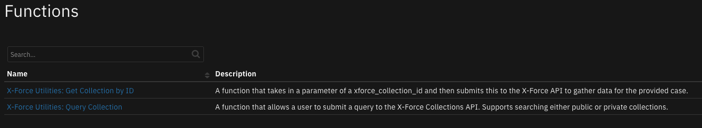
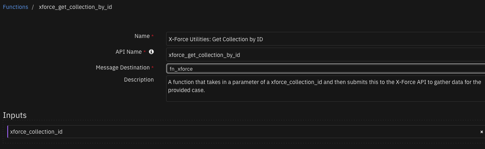

# IBM XForce Collections

## Table of Contents
- [Release Notes](#release-notes)
- [Overview](#overview)
  - [Key Features](#key-features)
- [Requirements](#requirements)
  - [SOAR platform](#soar-platform)
  - [Cloud Pak for Security](#cloud-pak-for-security)
  - [Proxy Server](#proxy-server)
  - [Python Environment](#python-environment)
- [Installation](#installation)
  - [Install](#install)
  - [App Configuration](#app-configuration)
- [Function - X-Force Utilities: Get Collection by ID](#function---x-force-utilities-get-collection-by-id)
- [Function - X-Force Utilities: Query Collection](#function---x-force-utilities-query-collection)
- [Playbooks](#playbooks)
- [Troubleshooting & Support](#troubleshooting--support)

---

## Release Notes
| Version | Date | Notes |
| ------- | ---- | ----- |
| 1.1.0 | 05/2023 | Updated code to latest template and added playbooks |
| 1.0.1 | 09/2020 | App Host support added and proxy support added |
| 1.0.0 | 12/2018 | Initial Release |

### 1.1.0 Changes
In v1.1, the existing rules and workflows have been replaced with playbooks.
This change is made to support the ongoing, newer capabilities of playbooks.
Each playbook has the same functionality as the previous, corresponding rule/workflow.

If upgrading from a previous release, you'll noticed that the previous release's rules/workflows remain in place. Both sets of rules and playbooks are active. For manual actions, playbooks will have the same name as it's corresponding rule, but with "(PB)" added at the end.
For automatic actions, the playbooks will be disabled by default.

You can continue to use the rules/workflows.
But migrating to playbooks will provide greater functionality along with future app enhancements and bug fixes.

---

## Overview

**IBM SOAR Components for the IBM XForce Collections API**

 

The fn_xforce integration provides the ability to query the IBM XForce Collections API. Collections can be queried either by matching a provided search term or by Collection ID. Additionally, it is possible to query both public and private Collections. Information gathered from X-Force can be used for incident and artifact enrichment.

### Key Features
* Query Xforce for collections
* Get Xforce collection by ID

---

## Requirements
This app supports the IBM Security QRadar SOAR Platform and the IBM Security QRadar SOAR for IBM Cloud Pak for Security.

### SOAR platform
The SOAR platform supports two app deployment mechanisms, Edge Gateway (formerly App Host) and integration server.

If deploying to a SOAR platform with an Edge Gateway, the requirements are:
* SOAR platform >= `45.0.0`.
* The app is in a container-based format (available from the AppExchange as a `zip` file).

If deploying to a SOAR platform with an integration server, the requirements are:
* SOAR platform >= `45.0.0`.
* The app is in the older integration format (available from the AppExchange as a `zip` file which contains a `tar.gz` file).
* Integration server is running `resilient_circuits>=45.0.0`.
* If using an API key account, make sure the account provides the following minimum permissions:
  | Name | Permissions |
  | ---- | ----------- |
  | Org Data | Read |
  | Function | Read |

The following SOAR platform guides provide additional information:
* _Edge Gateway Deployment Guide_ or _App Host Deployment Guide_: provides installation, configuration, and troubleshooting information, including proxy server settings.
* _Integration Server Guide_: provides installation, configuration, and troubleshooting information, including proxy server settings.
* _System Administrator Guide_: provides the procedure to install, configure and deploy apps.

The above guides are available on the IBM Documentation website at [ibm.biz/soar-docs](https://ibm.biz/soar-docs). On this web page, select your SOAR platform version. On the follow-on page, you can find the _Edge Gateway Deployment Guide_, _App Host Deployment Guide_, or _Integration Server Guide_ by expanding **Apps** in the Table of Contents pane. The System Administrator Guide is available by expanding **System Administrator**.

### Cloud Pak for Security
If you are deploying to IBM Cloud Pak for Security, the requirements are:
* IBM Cloud Pak for Security >= `1.10`.
* Cloud Pak is configured with an Edge Gateway.
* The app is in a container-based format (available from the AppExchange as a `zip` file).

The following Cloud Pak guides provide additional information:
* _Edge Gateway Deployment Guide_ or _App Host Deployment Guide_: provides installation, configuration, and troubleshooting information, including proxy server settings. From the Table of Contents, select Case Management and Orchestration & Automation > **Orchestration and Automation Apps**.
* _System Administrator Guide_: provides information to install, configure, and deploy apps. From the IBM Cloud Pak for Security IBM Documentation table of contents, select Case Management and Orchestration & Automation > **System administrator**.

These guides are available on the IBM Documentation website at [ibm.biz/cp4s-docs](https://ibm.biz/cp4s-docs). From this web page, select your IBM Cloud Pak for Security version. From the version-specific IBM Documentation page, select Case Management and Orchestration & Automation.

### Proxy Server
The app does support a proxy server.

### Python Environment
Python 3.6 and Python 3.9 are supported.
Additional package dependencies may exist for each of these packages:
* resilient_circuits>=45.0.0

---

## Installation

### Install
* To install or uninstall an App or Integration on the _SOAR platform_, see the documentation at [ibm.biz/soar-docs](https://ibm.biz/soar-docs).
* To install or uninstall an App on _IBM Cloud Pak for Security_, see the documentation at [ibm.biz/cp4s-docs](https://ibm.biz/cp4s-docs) and follow the instructions above to navigate to Orchestration and Automation.

### App Configuration
The following table provides the settings you need to configure the app. These settings are made in the app.config file. See the documentation discussed in the Requirements section for the procedure.

| Config | Required | Example | Description |
| ------ | :------: | ------- | ----------- |
| **xforce_apikey** | Yes | `<YOUR_API_KEY>` | API key for Xforce. |
| **xforce_baseurl** | Yes | `https://api.xforce.ibmcloud.com` | Xforce base url. |
| **xforce_password** | Yes | `<YOUR_API_PASSWORD>` | Password for Xforce |


---

## Function - X-Force Utilities: Get Collection by ID
A function that takes in a parameter of a xforce_collection_id and then submits this to the X-Force API to gather data for the provided case.

 

<details><summary>Inputs:</summary>
<p>

| Name | Type | Required | Example | Tooltip |
| ---- | :--: | :------: | ------- | ------- |
| `xforce_collection_id` | `text` | Yes | `-` | A collection ID for use with the XForce API |

</p>
</details>

<details><summary>Outputs:</summary>
<p>

> **NOTE:** This example might be in JSON format, but `results` is a Python Dictionary on the SOAR platform.

```python
results = {
  "content": {
    "caseFileID": "7c551c65686c0866daafcee3d838f052",
    "coOwner": false,
    "contents": {
      "editorType": "draft",
      "plainText": "Threat Type\nDescribe the type of Collection being created\nOverview\nGive a succinct overview of the threat involved\nIndicators of Compromise\n 1.1.1.1 https://ru.wikipedia.org/wiki cf23df2207d99a74fbe169e3eba035e633b65d94 \n 108.177.16.0 CVE-2015-0313 poehali@namore.com stopspam.ru/tak/kak jorik.txt \nya.com 152c883836f1f3eec207395ac6f8e0c6 .ru50d858e0985ecc7f60418aaf0cc5ab587f42c2570a884095a9e8ccacd0f6545c \nProtection\nShare best practices for protection against this threat\nRecommendations\nRecommend a course of action, resources or applications to remediate this threat\nReferences\nAdd further resources and information about this threat",
      "rawContentState": {
        "blocks": [
          {
            "data": {},
            "depth": 0,
            "entityRanges": [],
            "inlineStyleRanges": [],
            "key": "1988j",
            "text": "Threat Type",
            "type": "header-one"
          },
          {
            "data": {},
            "depth": 0,
            "entityRanges": [],
            "inlineStyleRanges": [],
            "key": "f1988",
            "text": "Describe the type of Collection being created",
            "type": "unstyled"
          },
          {
            "data": {},
            "depth": 0,
            "entityRanges": [],
            "inlineStyleRanges": [],
            "key": "989eq",
            "text": "Overview",
            "type": "header-one"
          },
          {
            "data": {},
            "depth": 0,
            "entityRanges": [],
            "inlineStyleRanges": [],
            "key": "e6gah",
            "text": "Give a succinct overview of the threat involved",
            "type": "unstyled"
          },
          {
            "data": {},
            "depth": 0,
            "entityRanges": [],
            "inlineStyleRanges": [],
            "key": "73loq",
            "text": "Indicators of Compromise",
            "type": "header-one"
          },
          {
            "data": {},
            "depth": 0,
            "entityRanges": [
              {
                "key": 0,
                "length": 7,
                "offset": 1
              },
              {
                "key": 1,
                "length": 29,
                "offset": 9
              },
              {
                "key": 2,
                "length": 40,
                "offset": 39
              }
            ],
            "inlineStyleRanges": [],
            "key": "3ge65",
            "text": " 1.1.1.1 https://ru.wikipedia.org/wiki cf23df2207d99a74fbe169e3eba035e633b65d94 ",
            "type": "unstyled"
          },
          {
            "data": {},
            "depth": 0,
            "entityRanges": [
              {
                "key": 3,
                "length": 12,
                "offset": 1
              },
              {
                "key": 4,
                "length": 13,
                "offset": 14
              },
              {
                "key": 5,
                "length": 19,
                "offset": 47
              },
              {
                "key": 6,
                "length": 9,
                "offset": 67
              }
            ],
            "inlineStyleRanges": [],
            "key": "6efvp",
            "text": " 108.177.16.0 CVE-2015-0313 poehali@namore.com stopspam.ru/tak/kak jorik.txt ",
            "type": "unstyled"
          },
          {
            "data": {},
            "depth": 0,
            "entityRanges": [
              {
                "key": 7,
                "length": 6,
                "offset": 0
              },
              {
                "key": 8,
                "length": 32,
                "offset": 7
              },
              {
                "key": 9,
                "length": 64,
                "offset": 43
              }
            ],
            "inlineStyleRanges": [],
            "key": "a9563",
            "text": "ya.com 152c883836f1f3eec207395ac6f8e0c6 .ru50d858e0985ecc7f60418aaf0cc5ab587f42c2570a884095a9e8ccacd0f6545c ",
            "type": "unstyled"
          },
          {
            "data": {},
            "depth": 0,
            "entityRanges": [],
            "inlineStyleRanges": [],
            "key": "29es1",
            "text": "Protection",
            "type": "header-one"
          },
          {
            "data": {},
            "depth": 0,
            "entityRanges": [],
            "inlineStyleRanges": [],
            "key": "79k7",
            "text": "Share best practices for protection against this threat",
            "type": "unstyled"
          },
          {
            "data": {},
            "depth": 0,
            "entityRanges": [],
            "inlineStyleRanges": [],
            "key": "7ua1h",
            "text": "Recommendations",
            "type": "header-one"
          },
          {
            "data": {},
            "depth": 0,
            "entityRanges": [],
            "inlineStyleRanges": [],
            "key": "1fnn",
            "text": "Recommend a course of action, resources or applications to remediate this threat",
            "type": "unstyled"
          },
          {
            "data": {},
            "depth": 0,
            "entityRanges": [],
            "inlineStyleRanges": [],
            "key": "l9da",
            "text": "References",
            "type": "header-one"
          },
          {
            "data": {},
            "depth": 0,
            "entityRanges": [],
            "inlineStyleRanges": [],
            "key": "78bt3",
            "text": "Add further resources and information about this threat",
            "type": "unstyled"
          }
        ],
        "entityMap": {
          "0": {
            "data": {
              "id": "1.1.1.1",
              "type": "IP"
            },
            "mutability": "IMMUTABLE",
            "type": "OBSERVABLE"
          },
          "1": {
            "data": {
              "id": "https://ru.wikipedia.org/wiki",
              "type": "URL"
            },
            "mutability": "IMMUTABLE",
            "type": "OBSERVABLE"
          },
          "2": {
            "data": {
              "id": "cf23df2207d99a74fbe169e3eba035e633b65d94",
              "type": "MAL"
            },
            "mutability": "IMMUTABLE",
            "type": "OBSERVABLE"
          },
          "3": {
            "data": {
              "id": "108.177.16.0",
              "type": "IP"
            },
            "mutability": "IMMUTABLE",
            "type": "OBSERVABLE"
          },
          "4": {
            "data": {
              "id": "CVE-2015-0313",
              "type": "VUL"
            },
            "mutability": "IMMUTABLE",
            "type": "OBSERVABLE"
          },
          "5": {
            "data": {
              "id": "stopspam.ru/tak/kak",
              "type": "URL"
            },
            "mutability": "IMMUTABLE",
            "type": "OBSERVABLE"
          },
          "6": {
            "data": {
              "id": "jorik.txt",
              "type": "URL"
            },
            "mutability": "IMMUTABLE",
            "type": "OBSERVABLE"
          },
          "7": {
            "data": {
              "id": "ya.com",
              "type": "URL"
            },
            "mutability": "IMMUTABLE",
            "type": "OBSERVABLE"
          },
          "8": {
            "data": {
              "id": "152c883836f1f3eec207395ac6f8e0c6",
              "type": "MAL"
            },
            "mutability": "IMMUTABLE",
            "type": "OBSERVABLE"
          },
          "9": {
            "data": {
              "id": "50d858e0985ecc7f60418aaf0cc5ab587f42c2570a884095a9e8ccacd0f6545c",
              "type": "MAL"
            },
            "mutability": "IMMUTABLE",
            "type": "OBSERVABLE"
          }
        }
      },
      "reports": [],
      "wiki": "Threat Type\nDescribe the type of Collection being created\nOverview\nGive a succinct overview of the threat involved\nIndicators of Compromise\n 1.1.1.1 https://ru.wikipedia.org/wiki cf23df2207d99a74fbe169e3eba035e633b65d94 \n 108.177.16.0 CVE-2015-0313 poehali@namore.com stopspam.ru/tak/kak jorik.txt \nya.com 152c883836f1f3eec207395ac6f8e0c6 .ru50d858e0985ecc7f60418aaf0cc5ab587f42c2570a884095a9e8ccacd0f6545c \nProtection\nShare best practices for protection against this threat\nRecommendations\nRecommend a course of action, resources or applications to remediate this threat\nReferences\nAdd further resources and information about this threat"
    },
    "created": "2021-05-20T12:19:07.138Z",
    "deletable": false,
    "extensions": [],
    "links": [],
    "mine": false,
    "nGroups": 0,
    "nPeople": 0,
    "owner": {
      "isDisabled": false,
      "name": "QA RVision",
      "uuid": "http://www.ibm.com/55000AJ8RT"
    },
    "shared": "public",
    "tags": [],
    "title": "Test_Collection",
    "tlpColor": {
      "tlpColorCode": "white",
      "tlpColorName": "TLP_WHITE",
      "tlpIsUserDefined": true
    },
    "unconvertedContents": null,
    "writeable": false
  },
  "inputs": {
    "xforce_collection_id": "7c551c65686c0866daafcee3d838f052"
  },
  "metrics": {
    "execution_time_ms": 584,
    "host": "local",
    "package": "fn-xforce",
    "package_version": "1.1.0",
    "timestamp": "2023-05-09 09:11:51",
    "version": "1.0"
  },
  "raw": null,
  "reason": null,
  "success": true,
  "version": 2.0
}
```

</p>
</details>

<details><summary>Example Pre-Process Script:</summary>
<p>

```python
inputs.xforce_collection_id = artifact.value
```

</p>
</details>

<details><summary>Example Post-Process Script:</summary>
<p>

```python
results = playbook.functions.results.collection_results
if results.get("success"):
  content = results.get("content", {})
  if isinstance(content, str):
    incident.addNote(content)
  elif content.get("contents", {}):
    noteText = f"""<b>Title:</b> {content.get('title')}
    <b>Created:</b> {content.get('created')}
    <b>Tags:</b> {content.get('tags')}

    {content.get('contents', {}).get('wiki')}
    """
    incident.addNote(noteText)
```

</p>
</details>

---
## Function - X-Force Utilities: Query Collection
A function that allows a user to submit a query to the X-Force Collections API. Supports searching either public or private collections.

 

<details><summary>Inputs:</summary>
<p>

| Name | Type | Required | Example | Tooltip |
| ---- | :--: | :------: | ------- | ------- |
| `xforce_collection_type` | `select` | No | `-` | Which type of collections to search. Public or private collections available. |
| `xforce_query` | `text` | Yes | `-` | A query to submit for searching XForce Collections |

</p>
</details>

<details><summary>Outputs:</summary>
<p>

> **NOTE:** This example might be in JSON format, but `results` is a Python Dictionary on the SOAR platform.

```python
results = {
  "content": {
    "casefiles": [
      {
        "caseFileID": "7c551c65686c0866daafcee3d8061d6b",
        "created": "2021-10-14T10:28:28.741Z",
        "links": [],
        "owner": {
          "isDisabled": false,
          "name": "\u0414\u0430\u0440\u044c\u044f \u041b\u0430\u043d\u0433\u0438\u043d\u0430",
          "userid": "http://www.ibm.com/5500038YXJ"
        },
        "shared": true,
        "tags": [],
        "title": "\u0440\u043f\u043e\u043f",
        "writable": false
      },
      {
        "caseFileID": "7c551c65686c0866daafcee3d838f052",
        "created": "2021-05-20T12:19:07.138Z",
        "links": [],
        "owner": {
          "isDisabled": false,
          "name": "QA RVision",
          "userid": "http://www.ibm.com/55000AJ8RT"
        },
        "shared": true,
        "tags": [],
        "title": "Test_Collection",
        "writable": false
      },
      {
        "caseFileID": "2a58b28a880eab0ddc23d856e4871a69",
        "created": "2023-03-08T17:51:22.131Z",
        "links": [],
        "owner": {
          "isDisabled": false,
          "name": "First Last",
          "userid": "http://www.ibm.com/550001H8BT"
        },
        "shared": true,
        "tags": [],
        "title": "test2",
        "totalVotes": 0,
        "writable": true
      },
      {
        "caseFileID": "6db4c6bcafe3333fffaf5a754b7ae73d",
        "created": "2020-03-10T12:33:59.224Z",
        "links": [],
        "owner": {
          "isDisabled": false,
          "name": "sai Karthik",
          "userid": "http://www.ibm.com/55000126PG"
        },
        "shared": true,
        "tags": [],
        "title": "test1",
        "writable": false
      },
      {
        "caseFileID": "52adef79fe80b4958050c700a8b0da15",
        "created": "2019-07-22T17:20:40.817Z",
        "links": [],
        "owner": {
          "isDisabled": false,
          "name": "ZHENG LU",
          "userid": "http://www.ibm.com/550002YAE9"
        },
        "shared": true,
        "tags": [],
        "title": "Test Email",
        "writable": false
      },
      {
        "caseFileID": "7d889aac958a5dbebc01a16979140eb2",
        "created": "2023-01-23T11:34:04.800Z",
        "links": [],
        "owner": {
          "isDisabled": false,
          "name": "X-Force Research",
          "userid": "http://www.ibm.com/550004JMXN",
          "verified": "researcher"
        },
        "shared": true,
        "tags": [
          "phishing",
          "early-warning",
          "squatting",
          "x-location:all",
          "x-industry:media"
        ],
        "title": "Taobao Squatting Campaign",
        "writable": false
      },
      {
        "caseFileID": "e2fa5296f88a0c4ad37e4f4652c221db",
        "created": "2017-10-30T07:47:29.799Z",
        "links": [],
        "owner": {
          "isDisabled": false,
          "name": "Noah J, A",
          "userid": "http://www.ibm.com/50SKQTFFS2"
        },
        "shared": true,
        "tags": [
          "icloader",
          "fusioncore",
          "kryptik",
          "adware",
          "malware"
        ],
        "title": "Kryptik / FusionCore / ICLoader Malware Campaign via AWS IP",
        "writable": false
      },
      {
        "caseFileID": "383879eab7c4e0c5d38c1c2e9709ffe9",
        "created": "2018-04-10T13:05:35.686Z",
        "links": [],
        "owner": {
          "isDisabled": false,
          "name": "XFTAS Newsletter Admin",
          "userid": "http://www.ibm.com/50GHFD9JCW",
          "verified": "ibmexpert"
        },
        "shared": true,
        "tags": [
          "xftas"
        ],
        "title": "XFTAS Daily Threat Assessment for April 02, 2018",
        "writable": false
      }
    ],
    "num_of_casefiles": 8
  },
  "inputs": {
    "xforce_collection_type": "public",
    "xforce_query": "1.1.1.1"
  },
  "metrics": {
    "execution_time_ms": 556,
    "host": "local",
    "package": "fn-xforce",
    "package_version": "1.1.0",
    "timestamp": "2023-05-09 09:11:47",
    "version": "1.0"
  },
  "raw": null,
  "reason": null,
  "success": true,
  "version": 2.0
}
```

</p>
</details>

<details><summary>Example Pre-Process Script:</summary>
<p>

```python
inputs.xforce_query = artifact.value
inputs.xforce_collection_type = "private"
```

</p>
</details>

<details><summary>Example Post-Process Script:</summary>
<p>

```python
results = playbook.functions.results.query_collections_results
if results.get("success"):
  content = results.get("content", {})
  if isinstance(content, str):
    noteText = """<b>X-Force Query status</b><br>{}""".format(content)
    incident.addNote(helper.createRichText(noteText))
  elif content.get("num_of_casefiles") > 0:
    noteText = """<b>X-Force Query status</b><br>Total matched case files: <b>{}</b>""".format(content.get("num_of_casefiles", 0))
    incident.addNote(helper.createRichText(noteText))
```

</p>
</details>

---


## Playbooks
| Playbook Name | Description | Object | Status |
| ------------- | ----------- | ------ | ------ |
| X-Force Query Collection by ID - Example (PB) | Takes in a parameter of a xforce_collection_id and then attempts to gather enriching information for that collection via the X-Force API. | artifact | `enabled` |
| X-Force Query from Artifact - Example (PB) | takes in a provided artifact as a query and then submits this to the X-Force API searching collections for casefiles relevant to the query. | artifact | `enabled` |
| X-Force Return Top 3 from Collection(s) - Example (PB) | None | artifact | `enabled` |

---

## Troubleshooting & Support
Refer to the documentation listed in the Requirements section for troubleshooting information.

### For Support
This is an IBM supported app. Please search [ibm.com/mysupport](https://ibm.com/mysupport) for assistance.
