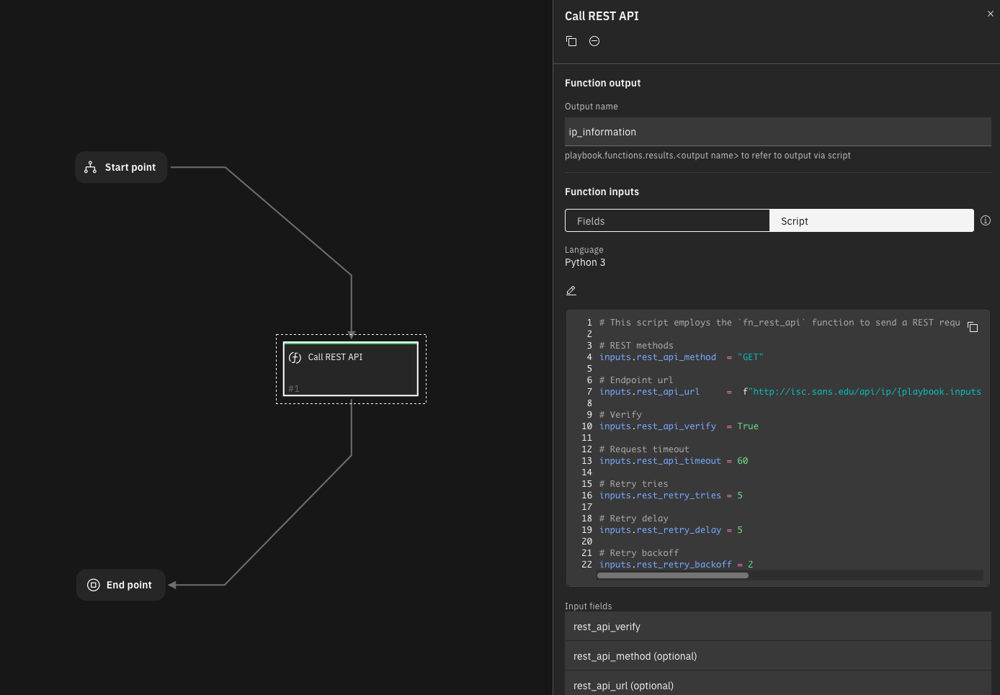
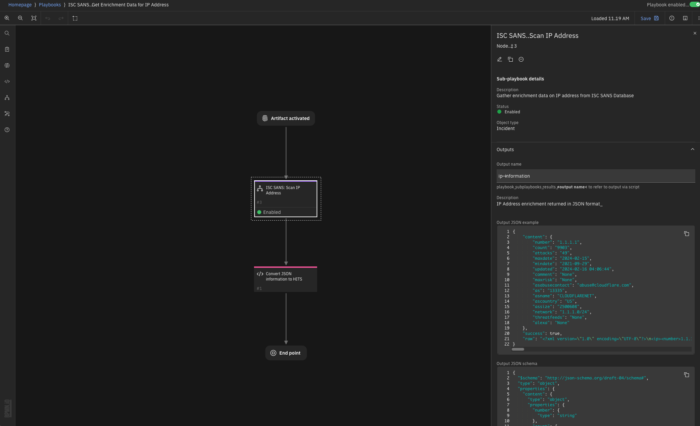

<!--
  This README.md is generated by running:
  "resilient-sdk docgen -e <list of export paths>"

  This file was generated with resilient-sdk v51.0.1.0.695

  It is best edited using a Text Editor with a Markdown Previewer. VS Code
  is a good example. Checkout https://guides.github.com/features/mastering-markdown/
  for tips on writing with Markdown

  All fields followed by "::CHANGE_ME::"" should be manually edited

  If you make manual edits and run docgen again, a .bak file will be created

  Store any screenshots in the "doc/screenshots" directory and reference them like:
  

  NOTE: If your app is available in the container-format only, there is no need to mention the integration server in this readme.
-->

# ISC_SANS_Get_Enrichment_Data_for_IP_Address

 ## Export Description

Minimum SOAR version required for this export: `49.0.8803` (NOTE: this may be higher than each app's minimum required version).

### Apps Included with Export
| App | Version | Minimum SOAR Version |
| --- | ------- | -------------------- |
| REST API Functions for SOAR | 1.2.0 | 48.2.16 |
 
 ---

## Function - Call REST API
This function calls a REST web service. It supports the standard REST methods: GET, HEAD, POST, PUT, DELETE, PATCH and OPTIONS.

The function parameters determine the type of call, the URL, and optionally the headers and body. The results include the text or structured (JSON) result from the web service, and additional information including the elapsed time.

<p align="center">

</p>


<details><summary>Inputs:</summary>
<p>

| Name | Type | Required | Example | Tooltip |
| ---- | :--: | :------: | ------- | ------- |
| `rest_api_headers` | `textarea` | No | `-` | - |
| `rest_api_method` | `select` | No | `-` | - |
| `rest_api_timeout` | `number` | No | `-` | - |
| `rest_api_url` | `text` | No | `-` | - |
| `rest_api_verify` | `boolean` | Yes | `-` | Verify SSL certificate |
| `rest_retry_backoff` | `number` | No | `3` | Multiplier applied to delay between attempts. Default: `1` (no backoff). Matches `backoff` parameter of retry.api.retry_call https://github.com/eSAMTrade/retry#retry_call |
| `rest_retry_delay` | `number` | No | `3` | Initial delay between attempts. Default: `1`. Matches `delay` parameter of retry.api.retry_call https://github.com/eSAMTrade/retry#retry_call |
| `rest_retry_tries` | `number` | No | `3` | The maximum number of attempts. Default: `1` (no retry). Use `-1` for unlimited retries.  Matches `tries` parameter of `retry.api.

</p>
</details>

<details><summary>Outputs:</summary>
<p>

> **NOTE:** This example might be in JSON format, but `results` is a Python Dictionary on the SOAR platform.

```python
{
    "content": {
        "number": "1.1.1.1",
        "count": "9903",
        "attacks": "49",
        "maxdate": "2024-02-15",
        "mindate": "2021-09-29",
        "updated": "2024-02-16 04:06:44",
        "comment": "None",
        "maxrisk": "None",
        "asabusecontact": "abuse@cloudflare.com",
        "as": "13335",
        "asname": "CLOUDFLARENET",
        "ascountry": "US",
        "assize": "2500608",
        "network": "1.1.1.0/24",
        "threatfeeds": "None",
        "alexa": "None"
    },
    "success": true,
    "raw": "<?xml version=\"1.0\" encoding=\"UTF-8\"?>\n<ip><number>1.1.1.1</number><count>9903</count><attacks>49</attacks><maxdate>2024-02-15</maxdate><mindate>2021-09-29</mindate><updated>2024-02-16 04:06:44</updated><comment></comment><maxrisk></maxrisk><asabusecontact>abuse@cloudflare.com</asabusecontact><as>13335</as><asname>CLOUDFLARENET</asname><ascountry>US</ascountry><assize>2500608</assize><network>1.1.1.0/24</network><threatfeeds><mastodon><lastseen>2024-02-16</lastseen><firstseen>2023-07-13</firstseen></mastodon><openresolver><lastseen>2024-02-15</lastseen><firstseen>2022-02-04</firstseen></openresolver></threatfeeds><alexa><lastrank>4585</lastrank><domains>2</domains><firstseen>2015-12-29</firstseen><lastseen>2015-12-29</lastseen><hostname>null.scientificamerican.com</hostname></alexa></ip>"
}
```

</p>
</details>

<details><summary>Example Function Input Script:</summary>
<p>

```python
# This script employs the `fn_rest_api` function to send a REST request to the SANS endpoint, using the value from the artifact if the artifact is an IP address.

# REST methods
inputs.rest_api_method  = "GET"

# Endpoint url
inputs.rest_api_url     =  f"http://isc.sans.edu/api/ip/{playbook.inputs.ip_address}"

# Verify 
inputs.rest_api_verify  = True

# Request timeout
inputs.rest_api_timeout = 60

# Retry tries
inputs.rest_retry_tries = 5

# Retry delay
inputs.rest_retry_delay = 5

# Retry backoff
inputs.rest_retry_backoff = 2
```

</p>
</details>

<details><summary>Example Function Endpoint Script:</summary>
<p>

```python
import xml.etree.ElementTree as ET

IP_INFO_UNAVAILABLE_TEMPLATE = {
  "as" : '0',
  "assize"  : '0',
  "count"   : "None",
  "attacks" : "None",
  "maxdate" : "None",
  "mindate" : "None",
  "updated" : "None",
  "comment" : "None",
  "maxrisk" : "None",
  "network" : "None",
  "asname"  : "not routed",
  "ascountry" : "XX",
  "asabusecontact" : "None"}

json_intel, success = {}, True

# Converting response to a XML Tree
raw_response = playbook.functions.results.ip_information.content.text

# Converting response from XML to JSON
for each_tag in ET.fromstring(raw_response):
    
    # Skipping process if the number tag has no value
    if each_tag.tag == "number" and not each_tag.text:
        success = False
        break

    # Certain tags tend to have nested values, these are flattened and added to `json_intel`
    if each_tag.tag in ["threatfeed", "ssh", "weblogs"]:
        json_intel = {}
        for sub_tag in each_tag:
            json_intel[f"{each_tag.tag} {sub_tag.tag}"] = sub_tag.text

    # Otherwise tag and it's value is directly added
    else:
        json_intel[each_tag.tag]  = str(each_tag.text)

if success:
    success = False
    for key in IP_INFO_UNAVAILABLE_TEMPLATE:
        if json_intel[key] != IP_INFO_UNAVAILABLE_TEMPLATE[key]:
            success = True
            break


playbook.results = {
    "content" : json_intel,
    "success" : success,
    "raw" : raw_response
}

```

</p>
</details>

---


<p align="center">

</p>


## Script - Convert JSON information to HITS
Script to process the endpoint response and add the result as HITS

**Object:** artifact

<details><summary>Script Text:</summary>
<p>

```python
import xml.etree.ElementTree as ET


def compile_section_by_dtype(value, name):
    """
    Complies received information into HIT Cards. The information can have varied datatype. This function
    automatically detects the data type and formats the information suitable for a SOAR artifact. The result
    is returned as a dictionary representing the subsection with its name, data type, and converted
    value (if applicable).

    Args:
    ----
        value (str): The value to be categorized into a specific data type.
        name  (str): The name or identifier for the subsection.

    Returns:
    -------
        dict: A dictionary representing the subsection with the following keys:
            - "name"  : The name or identifier passed as the 'name' parameter.
            - "type"  : The determined data type of the 'value' (either "string," "uri," or "number").
            - "value" : The 'value' converted to the appropriate data type (int for numbers).
    """
    info_type = "string"

    # if "http" found, the string is classified as an URL
    if "http" in value:
        info_type = "uri"

    # detects if the given string is a number
    elif value.isdigit():
        info_type = "number"
        value = int(value)

    # format required for a HIT card to compile within an artifact
    subsection = {
        "name"  : name,
        "type"  : info_type,
        "value" : value
    }
    return subsection


def dedup_section(section):
    """
    An HIT card exclusively accommodates distinct entries and cannot exhibit information in a nested
    structure. Consequently, data is condensed and organized within the HIT card. To prevent 
    redundancies, this function is employed to attach an index number to the names of recurring
    entries, ensuring their uniqueness

    Args:
    ----
        section (dict): The section to be de-duplicated

    Returns:
    -------
        dict : Similar dictionary with de-duplicated "name" value
    """
    unique_keys = {}
    for idx, each_item in enumerate(section):
        if each_item["name"] not in unique_keys:
            unique_keys[each_item["name"]] = 0
        else:
            unique_keys[each_item["name"]] += 1
            section[idx]["name"] = section[idx]["name"] + str(unique_keys[each_item["name"]])
    return section


def create_hits(success, response):
  """
  Wrapper function that creates a HIT. Dpendin on the result being returned from the sub-playbook
  this function uses `dedup_section` and `compile_section_by_dtype` functions to format the json results
  in the format required for HIT creation
  
  Args:
  -----
      success  (bool): Valid response returned
      response (dict): Response returned from the sub-playbook
  
  Returns:
  -------
      None
  """
    intel = []
    if success:
        for attribute in response:
            intel.append(compile_section_by_dtype(response[attribute], attribute))
        artifact.addHit("ISC SANS IP Information:", dedup_section(intel))

create_hits(playbook.subplaybooks.results.ip_information.success, playbook.subplaybooks.results.ip_information.content)

```

</p>
</details>

---

## Playbooks
| Playbook Name | Description | Activation Type | Object | Status | Condition |  Revision | 
| ------------- | ----------- | --------------- | ------ | ------ | --------- |  -------- | 
| ISC SANS: Get Enrichment Data for IP Address | Perform an IP address scan and gather all associated data from the Internet Storm Center database. | Automatic | artifact | `enabled` | `artifact.type equals IP Address AND object_added` |  #55 | 
| ISC SANS: Scan IP Address | Gather enrichment data on IP address from ISC SANS Database | Sub-playbook | incident | `enabled` | `-` |  #39 | 

---


 
### For Support
This is a IBM Community provided app. Please search the Community [ibm.biz/soarcommunity](https://ibm.biz/soarcommunity) for assistance.
