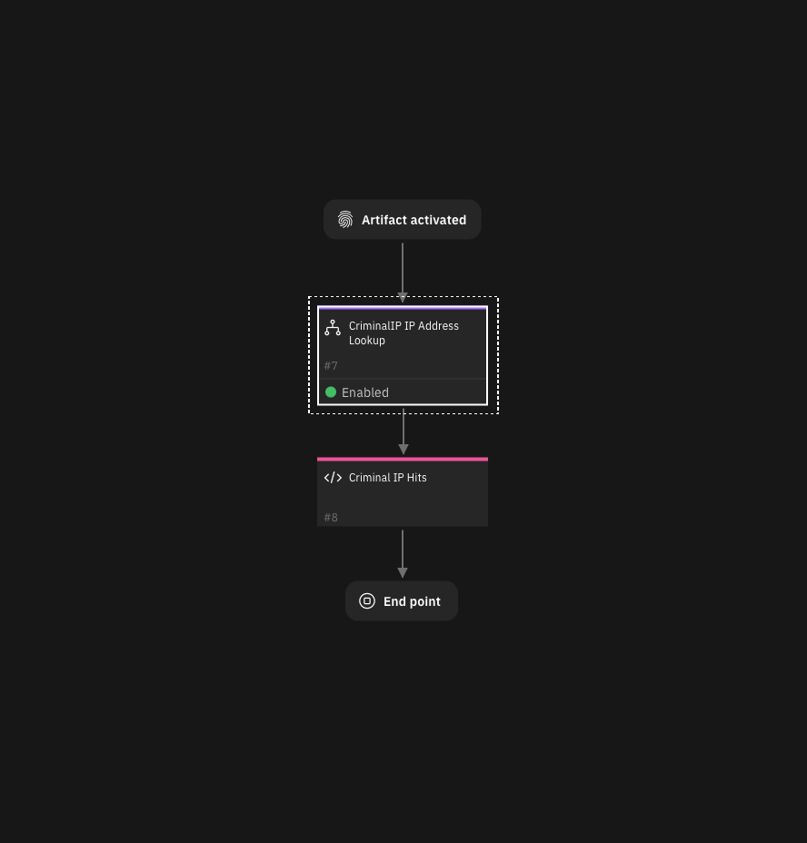
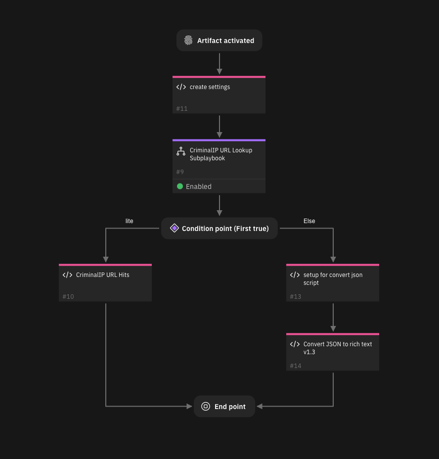
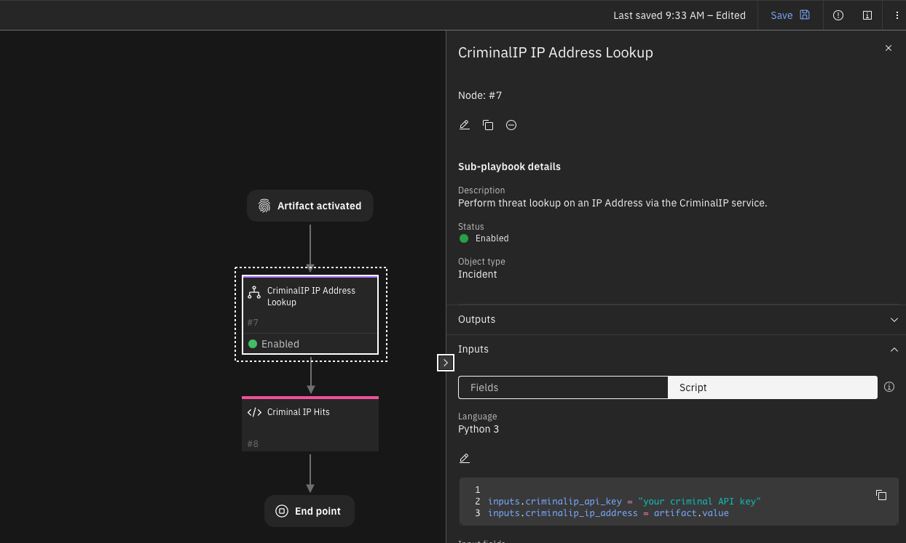
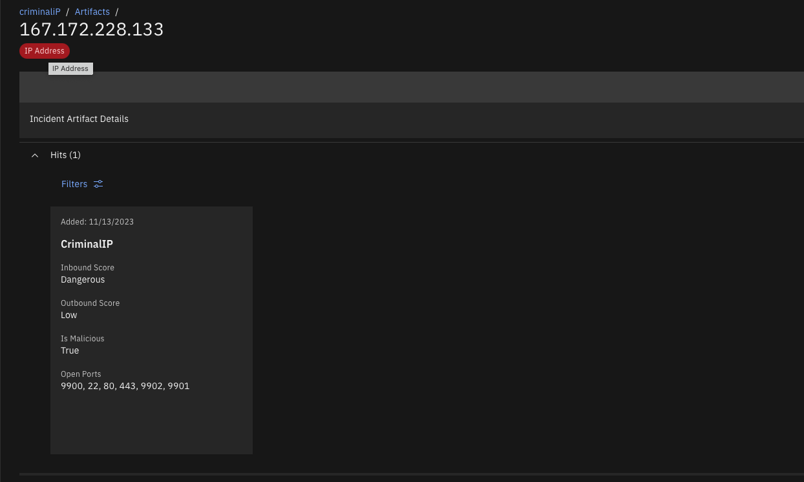
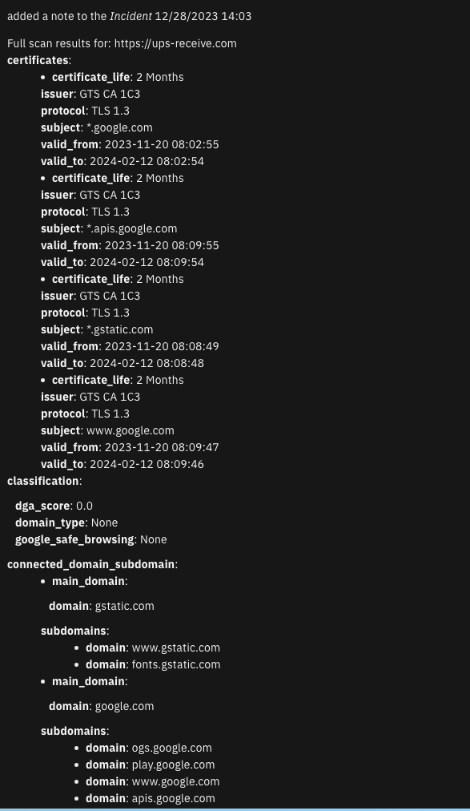

<!--
  This README.md is generated by running:
  "resilient-sdk docgen -e <list of export paths>"

  This file was generated with resilient-sdk v51.0.0.1.486

  It is best edited using a Text Editor with a Markdown Previewer. VS Code
  is a good example. Checkout https://guides.github.com/features/mastering-markdown/
  for tips on writing with Markdown

  All fields followed by "::CHANGE_ME::"" should be manually edited

  If you make manual edits and run docgen again, a .bak file will be created

  Store any screenshots in the "doc/screenshots" directory and reference them like:
  

  NOTE: If your app is available in the container-format only, there is no need to mention the integration server in this readme.
-->

# CriminalIP Threat Enrichment for IP Address and URL Artifacts
This package consists of two playbooks:

- Criminal IP: IP Threat Service
- Criminal IP: URL Threat Service

Theses playbooks will perform automatic threat enrichment when an IP Address or URL artifact is created based on capabilities exposed through (Criminal IP)[https://criminalip.io].




## Features:
  * Automatic threat enrichment for IP Address and URL artifacts
  * Results returned as artifact hits
  * URL Scans are either lite or full

## Playbooks
| Playbook Name | Description | Activation Type | Object | Status | Condition |  Revision | 
| ------------- | ----------- | --------------- | ------ | ------ | --------- |  -------- | 
| Criminal IP: IP Threat Service | Perform automatic threat data enrichment on IP addresses. Results are returned as hits to the artifact. | Automatic | artifact | `disabled` | `artifact.type equals IP Address AND object_added` |  #21 | 
| Criminal IP: URL Threat Service | Perform either 'lite' or 'full' automatic scans on URL artifacts. Lite results are returned as hits to the artifact. Full results are returned as an incident note. | Automatic | artifact | `disabled` | `artifact.type equals URL AND object_added` |  #60 | 
| CriminalIP URL Lookup Subplaybook | Perform threat lookup on a URL value via the CriminalIO service. | Sub-playbook | incident | `enabled` | `-` |  #59 | 
| CriminalIP IP Address Lookup | Perform threat lookup on an IP Address via the CriminalIP service. | Sub-playbook | incident | `enabled` | `-` |  #7 | 

## History
| Date | Version | Notes |
| ---- | ------- | ----- |
| 1/2024 | 1.0 | Initial Release |

## Export Description
Minimum SOAR version required for this export: `48.2.45` (NOTE: this may be higher than each app's minimum required version).

### Apps Included with Export
| App | Version | Minimum SOAR Version |
| --- | ------- | -------------------- |
| REST API Functions for SOAR | 1.2.0 | 46.0.8131 |
| Timer Function for SOAR | 1.0.0 | 43.1.49 |
 
---
## Installation instructions

Before installing, verify that your environment meets the following prerequisites:
* SOAR platform version 48.2 or later. 
* CP4S platform version 1.10 or later.
* You have a SOAR or CP4S account to use for the installation. This can be any account that has the permission to view and modify playbooks and apps.

### Steps

**Important:** Repeatedly importing the **.resz** files will overwrite any changes you have made to the playbooks. If modifications are necessary, duplicate the playbooks and use the new playbooks with your modifications.

1. Unzip the `CriminalIP_playbooks.zip` file. Two playbooks are extracted:
   - Criminal_IP_IP_Threat_Service.resz
   - Criminal_IP_URL_Threat_Service.resz
1. Logon to the SOAR/CP4S platform using a suitable account.
1. Navigate to **Playbooks**.
1. Click the **Import Playbook** icon link.
1. Import the playbooks one at a time.
1. Navigate to the **Apps** tab 
   - in SOAR, **Apps** is found under **Administrator Settings**
   - in CP4S, **Apps** is found under **Case Management -> Permissions and Access** 
1. Review the configuration settings for both **REST API Functions for SOAR** and 
**Timer Function for SOAR**. When ready, deploy each to an already setup App Host.
1. For each subplaybook, edit the input field (`inputs.criminalip_api_key`) with your own CriminalIP API key.
    - CriminalIP IP Address Lookup
    - CriminalIP URL Lookup Subplaybook
    - 
1. Enable each playbook for automatic enrichment. 
 
## Usage
Each playbook will trigger when an IP Address or URL based artifact is created. Enrichment will be in the form of:

Hits associated with an IP Address.


Hits associated with an URL for a `lite` scan and an incident note when a `full` scan is run.



---
## Imported Apps
### Function - Call REST API
This function calls a REST web service. It supports the standard REST methods: GET, HEAD, POST, PUT, DELETE, PATCH and OPTIONS.

The function parameters determine the type of call, the URL, and optionally the headers and body. The results include the text or structured (JSON) result from the web service, and additional information including the elapsed time.

<details><summary>Inputs:</summary>
<p>

| Name | Type | Required | Example | Tooltip |
| ---- | :--: | :------: | ------- | ------- |
| `client_auth_cert` | `text` | No | `-` | Client authentication certificate contents |
| `client_auth_key` | `text` | No | `-` | Client authentication certificate Private key contents |
| `client_auth_pem` | `text` | No | `-` | Client authentication certficate contents |
| `jwt_algorithm` | `text` | No | `-` | Algorithm required to encrypt jwt token |
| `jwt_headers` | `text` | No | `-` | - |
| `jwt_key` | `text` | No | `-` | JWT key required to encrypt token |
| `jwt_payload` | `text` | No | `-` | - |
| `jwt_token` | `text` | No | `-` | JWT token provided by the endpoint |
| `oauth_access_token` | `text` | No | `-` | The access token issued by the authorization server |
| `oauth_client_id` | `text` | No | `-` | The client identifier issued to the client during the registration process |
| `oauth_client_secret` | `text` | No | `-` | Client secret value |
| `oauth_code` | `text` | No | `-` | OAuth authentication code  |
| `oauth_redirect_uri` | `text` | No | `-` | After completing its interaction with the resource owner, the    authorization server directs the resource owner's user-agent back to  the client |
| `oauth_refresh_token` | `text` | No | `-` | Token required to refresh the access token |
| `oauth_scope` | `text` | No | `-` | Strings provided to APIs, so that they know whether to grant access to the type of data and operation requested |
| `oauth_token_type` | `text` | No | `-` | Type of token returned by the Authentication server, which is then used in every REST request being made |
| `oauth_token_url` | `text` | No | `-` | - |
| `rest_api_allowed_status_codes` | `text` | No | `-` | Comma separated list |
| `rest_api_body` | `textarea` | No | `key1:value\nkey2=value` | Parameters used for PUT, POST and PATCH API calls |
| `rest_api_cookies` | `textarea` | No | `-` | - |
| `rest_api_headers` | `textarea` | No | `-` | - |
| `rest_api_method` | `select` | No | `-` | - |
| `rest_api_query_parameters` | `textarea` | No | `key1:value\nkey2=value` | Parameters used for GET API calls added to the URL |
| `rest_api_timeout` | `number` | No | `-` | - |
| `rest_api_url` | `text` | No | `-` | - |
| `rest_api_verify` | `boolean` | Yes | `-` | Verify SSL certificate |

</p>
</details>

<details><summary>Example Function Input Script:</summary>
<p>

```python
URL_BASE = "https://api.criminalip.io"

URL_LOOKUP = {
  "Data": "v1/ip/data",
  "Summary": "/v1/ip/summary",
  "VPN": "v1/ip/vpn",
  "Hosting": "v1/ip/hosting",
  "Malicious Info": "v1/feature/ip/malicious-info",
  "Privacy Threat": "v1/feature/ip/privacy-threat",
  "Is Safe DNS Server": "v1/feature/ip/is_safe_dns_server",
  "Suspicious Info": "v1/feature/ip/suspicious-info"
}

inputs.rest_api_verify = True
inputs.rest_api_method = "GET"
inputs.rest_api_headers = f'{{"x-api-key":"{playbook.inputs.criminalip_api_key}"}}'

inputs.rest_api_url = f"{URL_BASE}/{URL_LOOKUP.get('Malicious Info')}"
inputs.rest_api_query_parameters = f'{{"ip":"{playbook.inputs.criminalip_ip_address}","full":true}}'

```

</p>
</details>

---
### Function - Timer
This function implements a timer (sleep) function that when called from a workflow will cause the workflow to pause for the specified amount of time. The function takes one of two parameters as input: `timer_time` or `timer_epoch`.

<details><summary>Inputs:</summary>
<p>

| Name | Type | Required | Example | Tooltip |
| ---- | :--: | :------: | ------- | ------- |
| `timer_epoch` | `datetimepicker` | No | `-` | Epoch specifying the time the timer should end |
| `timer_time` | `text` | No | `60s` | Specify time to wait as a string value/units where units is 's' for seconds, 'm' for minutes 'h' for hours and 'd' for days. For example: 60 seconds : "60s"; 45 minutes : "45m"; 12 hours : 12h |

</p>
</details>

<details><summary>Example Function Input Script:</summary>
<p>

```python
settings = playbook.properties.scan_properties
inputs.timer_time = f"{settings.get('wait_sec')}s"
```

</p>
</details>

---

### Script - Convert JSON to rich text v1.3
This script converts a json object into a hierarchical display of rich text and adds the rich text to an incident's rich text (custom) field or an incident note. A workflow property is used to share the json to convert and identify parameters used on how to perform the conversion.
Typically, a function will create workflow property and this script will run after that function to perform the conversion.

Features:

* Display the hierarchical nature of json, presenting the json keys (sorted if specified) as bold labels
* Provide links to found URLs
* Create either an incident note or add results to an incident (custom) rich text field.

**Object:** incident

---
## Troubleshooting
* The criminalIP API key is rate limited per month. Choose the correct licensing plan based on the number of artifact lookups you expect to make.

### For Support
This is a IBM Community provided app. Please search the Community [ibm.biz/soarcommunity](https://ibm.biz/soarcommunity) for assistance.
