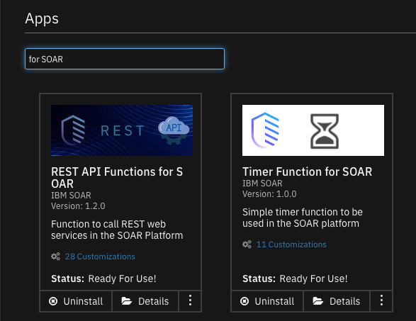

# CriminalIP Threat Enrichment for IP Address and URL Artifacts
This package consists of two playbooks:

- Criminal IP: IP Threat Service
- Criminal IP: URL Threat Service

Theses playbooks will perform automatic threat enrichment when an IP Address or URL artifact is created based on capabilities exposed through (Criminal IP)[https://criminalip.io]. Each playbook is based on two SOAR apps which are added when the playbooks are imported:

* fn_rest_api - an IBM supported app to perform ad-hoc REST API calls
* fn_timer - an IBM supported app to pause playbook execution

Each app will require deployment within an App Host as described below.

## History
| Date | Version | Notes |
| ---- | ------- | ----- |
| 1/2024 | 1.0 | Initial Release |

## Features:
  * Automatic threat enrichment for IP Address and URL artifacts
  * Results returned as artifact hits
  * URL Scans are either lite or full

## Installation instructions

Before installing, verify that your environment meets the following prerequisites:
* SOAR platform version 48.2 or later. 
* CP4S playform version 1.10 or later.
* You have a SOAR or CP4S account to use for the installation. This can be any account that has the permission to view and modify playbooks and apps.

### Steps

**Important:** Repeatedly importing the **.resz** files will overwrite any changes you have made to the playbooks. If modifications are necessary, duplicate the playbooks and use the new playbooks with your modifications.

1. Unzip the `CriminalIP_playbooks.zip` file. Two playbooks are extracted:
   - Criminal_IP_IP_Threat_Service.resz
   - Criminal_IP_URL_Threat_Service.resz
1. Logon to the SOAR/CP4S platform using a suitable account.
1. Navigate to **Playbooks**.
1. Click the **Import Playbook** icon link.
1. Import the playbooks one at a time.
1. Navigate to the **Apps** tab 
   - in SOAR, **Apps** is found under **Administrator Settings**
   - in CP4S, **Apps** is found under **Case Management -> Permissions and Access** 
1. Review the configuration settings for both **REST API Functions for SOAR** and 
**Timer Function for SOAR**. When ready, deploy each to an already setup App Host.
1. For each subplaybook, edit the input field (`inputs.criminalip_api_key`) with your own CriminalIP API key.
    - CriminalIP IP Address Lookup
    - CriminalIP URL Lookup Subplaybook
    - 
1. Enable each playbook for automatic enrichment. 
 
## Usage
Each playbook will trigger when an IP Address or URL based artifact is created. Enrichment will be in the form of 

IP Address results are returned as Hits.

URL results are either artifact `hits` for lite scans or an incident note for full scans.

## Troubleshooting
* The criminalIP API key is rate limited per month. Choose the correct licensing plan based on the number of artifact lookups you expect to make.
