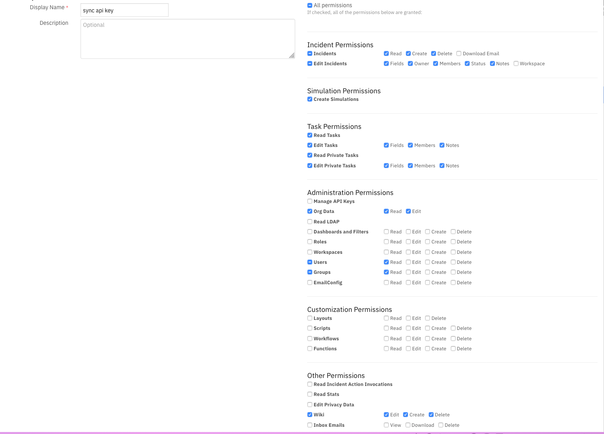
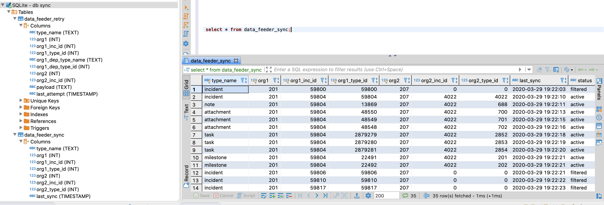

# Introduction
This package contains the Resilient plugin to the Data Feed extension. The Data Feed Extension allows you to maintain "replica" data for Resilient incidents artifacts, tasks, notes, and so on, in another Resilient organization in the same or different Resilient platform. The updates are performed in near real-time.

Refer to the documentation on the Data Feed extension for use cases supported and configuration options. Also refer to the other Data Feed plugins which can be used in combination.

## Features
* Transfer incident data between two instances of Resilient.
* Transfer incident data between two Organizations within the same Resilient instance.
* Transfer incident data to more than one Resilient instance at the same time.
* Synchronized incident data objects include: artifacts, attachments, notes, milestones, tasks and datatables.

# License

Unless otherwise specified, contents of this repository are published under the MIT open-source
[LICENSE](LICENSE).

# Installation
  The integration package contains Python components that are called by the Resilient platform. These components run in the Resilient Circuits integration framework. The package also includes Resilient customizations that will be imported into the platform later.
  You perform these installation procedures at the Resilient integration server.
  
## Install the Python Components
* Complete the setup and configuration of your Integration server as detailed in our [Integration Server Guide](https://developer.ibm.com/security/resilient/start/).
*	Run the following commands to install the package:
```
  unzip rc_data_feed_plugin_resilient-<version>.zip
  [sudo] pip install --upgrade rc_data_feed-plugin_resilient-<version>.tar.gz
```  
*	Configure Resilient-circuits

  The Resilient Circuits process runs as an unprivileged user, typically named `integration`. If you do not already have an integration user configured on your appliance, create it now. 
  Complete the following steps to configure and run the integration:
*	Using sudo, switch to the integration user, as follows:

`sudo su - integration`
*	Use one of the following commands to create or update the resilient-circuits configuration file. Use –c for new environments or –u for existing environments.
```
  resilient-circuits config -c
  or
  resilient-circuits config –u [-l rc-data-feed-plugin-resilientfeed]
```
* Import custom fields to retain source organization and incident ids:

```
resilient-circuits customize -l rc-data-feed-plugin-resilientfeed
```
Note: Perform an export and reimport of these customizatons into the target Resilient organization in order to use them. See app.config parameter: `sync_reference_fields`.

*	Edit the resilient-circuits configuration file, as follows:
    
     - In the `[resilient]` section, ensure that you provide all the information required to connect to the Resilient platform.
     - In the `[feeds]` section, define the feed(s) you intend to use and create separate sections for each feed. For example:
     `feed_names=resilient_feed`
     - In the [resilient_feed] section, configure the settings for your Resilient environment.
```
  [feeds]
  feed_names=resilient_feed
  reload=True
  # feed_data is the default queue that will be listened to
  queue=feed_data
  
  [resilient_feed]
  class=ResilientFeed
  # provide configuration information to the target Resilient and Organization
  host=localhost
  #proxy_host=
  api_key_id=
  api_key_secret=
  #email=
  #password=
  port=443
  org=
  cafile=false
  # identify a sqlite db file to retain mapping between resilient instances.
  db_sync_file=/path/to/file
  # optional comma separated list of fields to allow incidents to sync. ex. incident_type_ids in ['Phishing']
  matching_incident_fields=
  # when using matching_incident_fields, specify whether 'all' or 'any' field needs to match to accept
  matching_operator=all
  # optional comma separated list of fields to exclude from an incident. Sections of fields can be used: pii,gdpr,hipaa,cm
  exclude_incident_fields=
  # optionally include references within the incident to source org_id and incident_id. Values True/False
  sync_reference_fields=True
```

# ResilientFeed Class
This class allows you to write all incoming data to another Resilient Organization. Incidents, Artifacts, Attachments, Datatables, Notes, Milestones and Tasks (including task notes, and attachments) are copied. 
The following configuration items are supported:

| Key | Values | Description |
| :-- | :----- | :---------- |
| class | ResilientFeed | Indicates that the section is for an Resilient synchronization. |
| host, #proxy_host, api_key_id, api_key_secret, #email,  #password, port, org, cafile | | Specify the connection values similar to the `[resilient]` section for connection to the target resilient |
| db_sync_file | /path/to/file | Absolute path to a file to retain mapping information between the two Resilient instances |
| matching_incident_fields | plan_status == 'C', custom_field > 5 | Optional comma separated list of comparison tuples to determine the criteria for synchronizing an incident and it's tasks, artifacts, etc. Use the syntax: \<field\> \<operator\> \<value\>. Operator may be one of: ==, >=, <=, <, >, in, 'not in', is, and 'is not'. `None` can be used for \<value\>. Make sure to separate each \<field\> \<operator\> \<value\> with spaces. |
| matching_operator | any\|all | When using matching_incident_fields, either `all` fields or `any` field needs to match for incident synchronization | 
| exclude_incident_fields	| severity_code, date_started, custom_field, etc.| Optional comma separated list of fields and field sections to exclude when synchronizing an incident. | 
| sync_reference_fields | True\|False | Specify  `True` to add information to the target incident to maintain the orginal org id and incident id. Fields are `df_org_id` and `df_inc_id`, respectively |

## Requirements
* This functionality has been tested with Resilient instances >= v30. 
There is presently an issue with v37 restricting the live synchronization of a newly deleted artifact. If this capability is critical to your requirements, use Resilient version <v37.0.
* The target Resilient platform must be at the same version or greater than the source Resilient platform.
* The target Resilient organization must have the same set of custom fields, incident types, playbooks (tasks and phases) in order to synchronize incident data. Use the export/import functionality under `Adminstrator Settings`.
* The target Resilient organization should have the same users and groups defined. For any user or group not found, incident and task ownership as well as member lists will be left empty. 
* To synchronize datatables in real time, create rules specifying the `feed_data` message destination in order to changes.

## Setup Steps
1. Ensure Resilient version requirements are met for both the source and destination instances.
2. Perform the manual duplication of custom fields, incident types, phases and tasks, etc. by exporting these configurations from the Resilient source organization and importing them to the target Resilient organization.
3. Manually recreate the users and groups needed in the target Resilient organization.
4. Configure the app.config settings with the settings for the target Resilent organization and, optionally, the criteria for the types of incidents to synchronize and fields to exclude.
5. Run `resilient-circuits run` to confirm connectivity to both instances of Resilient (with `reload=False`).
6. The best way to test is to set `reload=False` under `[feeds]` in your app.config file, and in the source Resilient organization, run the `Data Feeder: Sync Incidents` rule to synchronize a small number of incidents.

## Considerations
* If real-time synchronization remains in place, changes in the source Resilient data will overwrite any changes made in the target Resilient organization data. 
* Deleting a source incident, task, artifact, etc. will also delete the matching target information.
* Synchronization of incidents may fail if newer required fields were created that were not present on these older incidents. Same is true for newer 'on close' created fields. This can be overcome by changing the fields from `required` to `optional`.
* Unoffical timing tests shows creating incident data can take .3-.5 seconds each data type. Consider the time it will take for all your incident data to synchronize when using `reload=True`.
* Review the permissions given to target resilient user or api_key. They must have the appropriate values to read and write incidents, artifacts, attachments, comments, milestones, tasks, and datatables. In addition, some incidents have wiki entries associated with them. Finally, older versions of Resilient also intermix simulation incidents. Provide the permission to create those as necessary.



## Limitations
* This solution is not intended for bidirectional synchronization.
* Unfortunately, the create date of the original incident is lost when the target incident is synchronized. 
* Timer data cannot be synchronized.
* Presently, artifacts with custom artifact types cannot synchronize.
* Deleting a source incident task attachment presently doesn't synchronize.
* Incident email messages (via the built-in Inbound Email Connectors) do not synchronize.
* It's presently not possible to restrict synchronization of incident elements such as tasks, artifacts, notes, etc.
when using `reload=all` and the action `Data Feeder: Sync Incidents`.

## Syncrhonization Methods
Three methods exist for synchronizing incident data:
* reload=True - This app.config setting will syncrhonize all incidents (including those closed) each time resilient-circuits is run. Review performance considerations above in [Considerations].
* real-time changes - If the automatic rules for incident, artifact, tasks, etc. are enabled, then any change to a object will perform the synchronization to the target organization. Note: Datatable rules need to be created in order to synchronize them in real-time.
* Data Feeder: Sync Incidents function - This function allows one to specify the range of incident data to synchronize. This is useful to limit the range of incidents to transmit.

## Behavior
Unexpected behaviors can occur and are detailed here.
* If an incident is originally filtered via the `matching_incident_fields` setting, all incident data are filtered. If in the future that incident changes so that the matching criteria passes, at the time the incicident is changed, only the incident is synchronized. To include all the other data elements such as tasks, artifact, attachments, etc., use the `Data Feeder: Sync Incidents` function. 
* Attachments cannot be updated.

## SQLite Database
A sqlite database is used to maintain a mapping of incident data between the source and target Resilient instances. Two tables are maintained for this purpose:

* data_feeder_sync - contains specific ids for source and target instances and status. The fields are as follows:

| type_name | org1 | org1_inc_id | org1_type_id | org2 | org2_inc_id | org2_type_id | last_sync | status |
| --------- | ---- | ----------- | ------------ | ---- | ----------- | ------------ | --------- | ----- |

Status can be one of `active`, `filtered`, `deleted`.

* data_feeder_retry - failures to create a data element are retried when the parent element is synchronized. For example, this is needed when tasks appear for synchronization before the incident. Once the incident is synchronized, all the dependent elements will be retried. The schema is as follows:

| type_name | org1 | org1_inc_id | org1_type_id | org1_dep_type_name | org1_dep_type_id | org2 | org2_inc_id | payload | last_attempt |
| --------- | ---- | ----------- | ------------ | ------------------ | ---------------- | ---- | ----------- | ------- | ------------ |

### Troubleshooting SQLite DB
There are many tools to view the db tables, including open-source solutions. DBeaver is one open-source application supporting many different database types including sqlite.

Use the following SQL statements for problem diagnostics:
* select * from data_feeder_sync where org2=<target organization>
* select * from data_feeder_retry where org2=<target organization>



## Troubleshooting Tips
Synchronization could fail for the following reasons: 
* Missing custom fields, custom incident_types, phases, etc. Ensure you have exported and re-imported these customizations into the target Resilient organization. Also check the permissions set on your target Resilient user account or api token associated with incident, artifact, task, etc. creation, including creating wiki pages.
* Artifacts with custom artifact types cannot be synchronized at this time.
* Older incident fields missing required fields defined at a later point in time. The only remedy is to modify the definition of the fields from `required` to `optional` and then resync the field using the rule `Data Feed: Sync Incidents`.
* Matching criteria filtered the incident. Review the values specified in `matching_incident_fields` and the value specified in `matching_operator`.
* Change the log level to debug to receive additional troubleshooting information on synchronization issues.
* Changes to tasks, artifacts, notes, etc. before the incident is synchronized.
  - If the log displays a message such as:
  `Incident not found. Queued to retry task:xxx->xxx to xxx`
  Run the incident action: `Data Feeder: Sync Incidents` to synchronize the incident and all it's related tasks, artifacts, notes, etc.
```
[resilient]
loglevel = DEBUG
``` 
