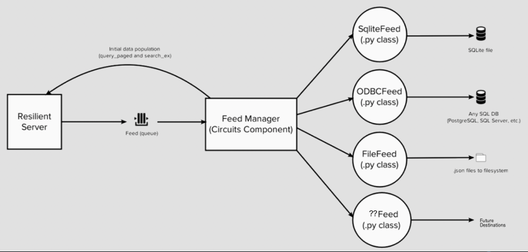
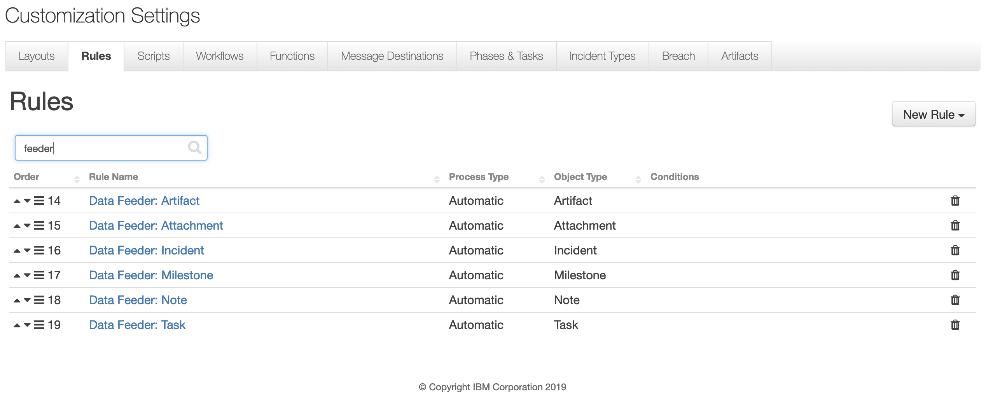
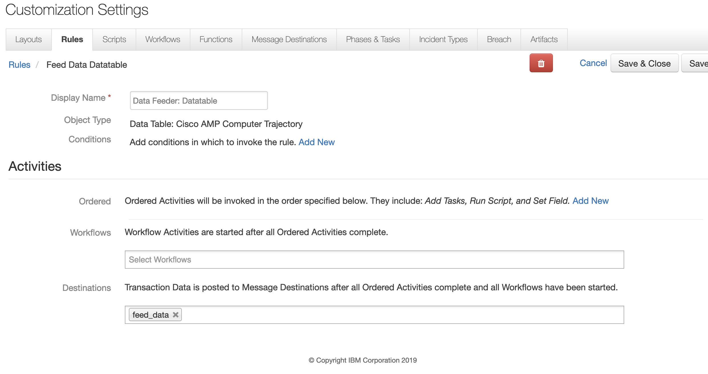

# Introduction
This package contains the Data Feed extension.  This extension allows you to maintain "replica" data for a Resilient system.  The updates are performed in near real-time.

The use case for this extension is for situations where you want to run business intelligence queries from other tools.  It overcomes the need to query the Resilient database directly (since the Resilient DB schema is not documented and can change at any time).

The data can be written to any or all of the following destinations:

- ODBC databases
  * PostgreSQL
  * MySQL (MariaDB)
  * Microsoft SQLServer
  * Oracle
- SQLite file/database
- Local directory (one file per object)

The extension was written to allow other destinations to be created with relative ease. The following diagram shows the overall data flow from Resilient to the existing feeds.



The content is consistent with the Resilient type/field semantic model and will include custom fields.  For SQL destinations, the table name is the same as the type name (e.g. incident, task, artifact, etc.) and the column names are the same as the field "programmatic name".

Data tables are supported (the programmatic name will be the same as the DB table name).

Newly added fields and data tables are created in the destination database (for ODBC/SQLite destinations).


# Configuration
There are two aspects to configuration of the Data Feed extension:  Resilient Server configuration and app.config configuration.

## Resilient Server Configuration
Run `resilient-circuits customize [-l rc_data_feed]` to import the message destination, functions, workflows and rules needed for this capability. Once loaded, rules are in place to automatically feed incidents, tasks, notes, artifacts, milstones and attachments. The automatic rules control what data gets sent to the extension. Additional rules to cover custom datatables are covered below.




###Rules for Datatables
Datatables are also supported by the Data Feeder. But because rules are written to specific datatables, they require a Resilient administrator to create them manually. The following screenshot shows a rule which references a datatable and it will trigger for any row change (insert, update, delete). Follow this procedure for all the datatables you need to include in the Data Feeder.



## app.config
Run `resilient-circuits config -u [-l rc_data_feed]`
to add the configuration to the standard app.config file.  There is one "feeds" section that contains a "feed_names" key, which is a comma separated list of feeds that you want to enable.  The names you use here represent the names of the subsequent sections that contain the actual feed configurations.  For example:

```
[feeds]
feed_names=my_postgresql_feed,my_file_feed,my_sqlite_feed
reload=True
# feed_data is the default queue that will be listend to
queue=feed_data

[my_postgresql_feed]
class=ODBCFeed
odbc_connect=Driver={PostgreSQL};Server=localhost;Port=5432;Database=feed
sql_dialect=PostgreSQL96Dialect
uid=mypguser
pwd=mypassword

[my_file_feed]
class=FileFeed
directory=/tmp/feed_data

[my_sqlite_feed]
class=SQLiteFeed
file_name=/tmp/feed.sqlite3
```

In this example `feed_names` references my\_postgresql\_feed which is the name of the "my\_postgresql\_feed" section of configuration settings.

This structure allows you to create as many feeds as you need, regardless of the "class" (meaning you can have, say, 3 different ODBC feeds so long as you give them all unique names).

### Initial Population
When you run the Data Feed extension against a Resilient server that has pre-existing data, it can optionally read all existing Resilient data and populate your feeds. 

This is currently done by setting `reload=True` in the app.config `[feeds]` section and then restarting resilient-circuits. 

Note: Be aware that **every** time resilient-circuits start with `reload=True`, the entire set of Resilient incidents, notes, artifacts, etc. will be refresh in your feeds. 

The following sections will explain the configuration options for each of the feed classes.

### FileFeed class
The FileFeed class allows you to write all the incoming data to a directory on your file system (one file per object).  The structure of the file names is either:

incident\_{inc_id}.json (for incident objects)

or

incident\_{inc_id}\_{type}\_{obj\_id}.json (for all other types of objects).  In this context, "type" can be:

* task
* artifact
* milestone
* note
* _data table programmatic name_

The following configuration keys are supported:

|Key|Values|Description|
|:--|:-----|:----------|
|class|FileFeed|This indicates that the section is for a FileFeed.|
|directory|Path for a directory on local system (must exist).|This is where the files will be written.|

Note: This directory can contain hundreds of files. Only the specifc file referencing a specific Resilient object is updated when changes are made in Resilient.

### SQLiteFeed class
The SQLiteFeed class allows you to write all the incoming data to a SQLite DB file.  SQLite is very useful for testing and in cases where you want to have the data stored in a single file that you can easy copy elsewhere.  Some tools may natively support SQLite as well.

SQLite also has pretty good CSV support, so you can easily export the data from the SQLite file into a CSV file, which can then be imported into something like Excel for further analysis.

The following configuration keys are supported:

|Key|Values|Description|
|:--|:-----|:----------|
|class|SQLiteFeed|This indicates that the section is for a SQLiteFeed.|
|file_name|Path for a local file on the system where the SQLite DB will reside.|This will be created if it doesn't yet exist.  If it does exist, it must be a SQLite database.|

### ODBCFeed class
The ODBCFeed class is probably the most flexible and useful of the feeds.  It allows you to write all the incoming data to an ODBC database (tested with PostgreSQL 9.6, MariaDB 10.3, MS SqlServer 2017, and Oracle 12.2). Other SQL dialects are straightforward to add).

The following configuration items are supported:

|Key|Values|Description|
|:--|:-----|:----------|
|class|ODBCFeed|This indicates that the section is for an ODBCFeed.|
|odbc_connect|The ODBC connect string.|Example for PostgreSQL:  Driver={PostgreSQL};Server=localhost;Port=5432;Database=feed|
|sql_dialect|PostgreSQL96Dialect, MariaDBDialect, SQLServerDialect, OracleDialect|The name of the SQL dialect.|
|uid|DB user name|Specify the database user name in this property and not in the connect string (most DBs support the uid in the connect string but you should specify in this property instead).|
|pwd|DB password|Specify the database user's password in this property and not in the connect string (most DBs support the pwd in the connect string but you should specify it in this property instead).  You can use the standard Resilient Circuits mechanism for secure password storage (i.e. res-keyring).|

###Additional Connection Strings
Here are additional databases connection strings for the other suported databases.

|Database|Connection String|
|:-------|:----------------|
|MariaDB| Driver={MariaDB ODBC 3.0 Driver};Server=127.0.0.1;DB=<DB>;Port=3306;connectTimeout=0|
|Oracle| Driver={Oracle 12c ODBC driver};DBQ=ORCLCDB|
|SQLServer| DRIVER={ODBC Driver 17 for SQL Server};SERVER=127.0.0.1;PORT=1443;DATABASE=<DB>;|

Note: The configuration of Oracle differs from other databases as you are defining configuration data in your `TNSNAMES.ORA` file.

###DataBase Field Length Considerations
Each database type has some limits to the size of data stored. Below is a excerpt of those limits for each database:

|Database|Field|Limit|
|:--|:-----|:-----|
|Postgres|text|1GB|
|MySQL/MariaDB|text|4GB|
|MS SQLServer|varchar(max)|2GB|
|MS SQLServer|varchar(xx)|4000|
|Oracle|varchar2(xx)|8000|

Some databases support `blobs` which can be supported specific cases. The disadvantage to blobs is that they are unsearchable.

###Additional Considerations
Some databases have reserve words which cannot be used in tables (i.e. date and size). If a Resilient (custom) field is found to be in a database reserve list, the name is altered to include a trailing '\_' (ex. the column name date becomes date\_).


# Useful Tools
Most "business intelligence" tools allow you to query data from SQL databases.  Here are some tools that you can use to run queries/reports against this data:

* Tableau
* Microsoft Power BI
* IBM Cognos
* Grafana
* Interactive SQL, for example:

```
  -- Number of artifacts for each incident
  select i.id, i.name, count(*) num_artifacts
  from incident i join artifact a on i.id = a.inc_id
  group by i.id, i.name;
```
  
# License

Unless otherwise specified, contents of this repository are published under the MIT open-source
[LICENSE](LICENSE).

Files and subdirectories within this repository may contain specific licenses that apply individually to that item.

# FAQ
## Resilient uses PostgreSQL.  Why can't I just open up access to the PostgreSQL and query the DB directly?
The primary reason is because IBM Resilient doesn't support direct database access.  Why's that?  The DB schema is not documented and has a different semantic model than is exposed by the Resilient REST API.  It would be confusing to document two separate models.  It'd also slow down the Resilient team if we had to be conerned with breaking code that we didn't write.  

The DB schema changes for almost every release, which could mean breaking anything that is accessing the database directly.

## You support PostgreSQL, can I create a new database on my Resilient appliance and connect to that?
This is not recommended.  It would be better to maintain the database on another system where queries won't impact your running Resilient instance.

Allowing access to the Resilient appliance PostgreSQL instance can also compromise security of the appliance itself.  It is possible to do it securely, but it would be somewhat complicated to configure properly.  For example, the Resilient appliance today doesn't support TLS connections to the PostgreSQL port because it isn't needed (all communication happens over localhost/loopback).

## Is historical data maintained?
Not at this time.  The data written represents the current snapshot.  It would be possible to have the extension maintain historical data, but doing so would be non-trivial.  If you have a need for historical data queries, we'd love to hear from you.  Please log a GitHub issue that explains your use case in as much detail as you can.

## Why isn't X supported as a "feed destination"?
We have some ideas about other feed destinations that can be added:

* Splunk
* ElasticSearch

Do you need others?  If so, we'd love to see a pull request from you!  If you can't do that, then maybe file an issue in GitHub and perhaps someone else can add it.

## How does this perform?
It performs reasonably well because after initial data population, all updates are performed by reading messages from message queues.

There are opportunities for improvement however:

* The queue processing is single threaded and would likely benefit from having multiple processor threads.
* Updates to SQL data feeds are currently done one at a time and may benefit from being done using "bulk" updates.
