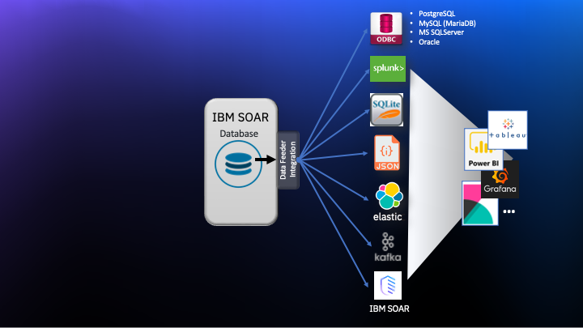

# Introduction
This package contains the Data Feed extension.  This extension allows you to maintain "replica" data for a Resilient system.  The updates are performed in near real-time.

The use case for this extension is for situations where you want to run business intelligence queries from other tools.  It overcomes the need to query the Resilient database directly (since the Resilient DB schema is not documented and can change at any time).

The data can be written to any or all of the following destinations:

- ODBC databases
  * PostgreSQL
  * MySQL (MariaDB)
  * Microsoft SQLServer
  * Oracle
- SQLite file/database
- Local directory (one file per object)
- ElasticSearch
- Splunk
- Kafka
- Resilient

Each of these destinations are available as separately installed packages to minimize the python libraries required for your Integrations Server. 

This extension was written to allow other destinations to be created with relative ease. The following diagram shows the overall data flow from Resilient to the existing feeds.

See the complete documentation in the doc/ folder for installation, configuration and operation information.



The content is consistent with the Resilient type/field semantic model and will include custom fields.  For SQL destinations, the table name is the same as the type name (e.g. incident, task, artifact, etc.) and the column names are the same as the field "programmatic name".

Data tables are supported (the programmatic name will be the same as the DB table name) but require rules to be added for data capture.

Newly added fields and data tables are created in the destination database (for ODBC/SQLite destinations) in real-time.


# Useful Tools
Most "business intelligence" tools allow you to query data from SQL databases.  Here are some tools that you can use to run queries/reports against this data:

* Tableau
* Microsoft Power BI
* IBM Cognos
* Grafana
* Interactive SQL, for example:

```
  -- Number of artifacts for each incident
  select i.id, i.name, count(*) num_artifacts
  from incident i join artifact a on i.id = a.inc_id
  group by i.id, i.name;
```
  
# License

Unless otherwise specified, contents of this repository are published under the MIT open-source
[LICENSE](LICENSE).

Files and subdirectories within this repository may contain specific licenses that apply individually to that item.

# FAQ
## Resilient uses PostgreSQL.  Why can't I just open up access to the PostgreSQL and query the DB directly?
The primary reason is because IBM Resilient doesn't support direct database access.  Why's that?  The DB schema is not documented and has a different semantic model than is exposed by the Resilient REST API.  It would be confusing to document two separate models.  It'd also slow down the Resilient team if we had to be conerned with breaking code that we didn't write.  

The DB schema changes for almost every release, which could mean breaking anything that is accessing the database directly.

## You support PostgreSQL, can I create a new database on my Resilient appliance and connect to that?
This is not recommended.  It would be better to maintain the database on another system where queries won't impact your running Resilient instance.

Allowing access to the Resilient appliance PostgreSQL instance can also compromise security of the appliance itself.  It is possible to do it securely, but it would be somewhat complicated to configure properly.  For example, the Resilient appliance today doesn't support TLS connections to the PostgreSQL port because it isn't needed (all communication happens over localhost/loopback).

## Is historical data maintained?
Not at this time.  The data written represents the current snapshot.  It would be possible to have the extension maintain historical data, but doing so would be non-trivial.  If you have a need for historical data queries, we'd love to hear from you.  Please log a GitHub issue that explains your use case in as much detail as you can.

## Why isn't "X" supported as a "feed destination"?
Do you need others?  If so, we'd love to see a pull request from you!  If you can't do that, then maybe file an issue in GitHub and perhaps someone else can add it.

## How does this perform?
It performs reasonably well because after initial data population, all updates are performed by reading messages from message queues.

There are opportunities for improvement however:

* The queue processing is single threaded and would likely benefit from having multiple processor threads.
* Updates to SQL data feeds are currently done one at a time and may benefit from being done using "bulk" updates.
