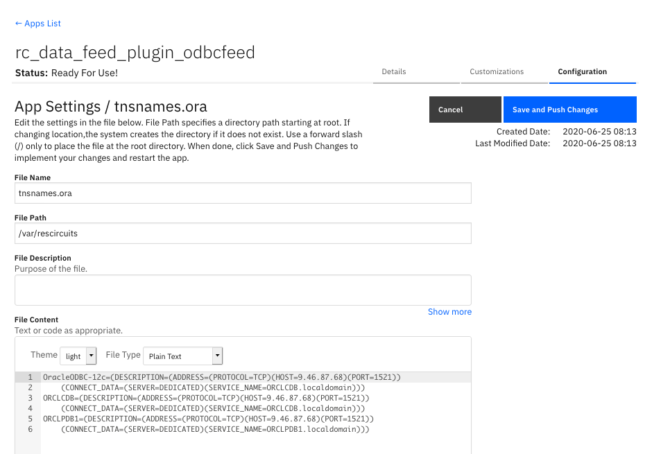

## Release Notes

* v1.0.6 Fixes for removed datatable columns, added caching for db schema updates - improving performance
* v1.0.5 Support for attachment content
* v1.0.4 Oracle definitions for AppHost
* v1.0.3 AppHost configurations for Postresql, MS SQL Server, MySql, SQLite
* v1.0.1 Duplication of incident id bug fix

## Notes:
* Issues exist deleting attachments and artifact attachments for IBM SOAR v39 and v40. A future release is expected to resolve this issue.
* Deleting an incident will not also delete the incident artifacts, notes, tasks, datatables, etc.
* Deleting a task will not also delete the task notes and attachments
# Introduction
This package contains the odbcfeed Plugin to the Data Feed extension.  This Data Feed extension allows one to maintain "replica" data for Resilient incidents, artifacts, tasks, notes, etc.  The updates are performed in near real-time.

This plugin allows this replica data to be maintained in a sql-based database.

Refer to the documentation on the Data Feed extension for uses cases support and configuration options. Also refer to the other Data Feed plugins which can be used in combination.

# License

Unless otherwise specified, contents of this repository are published under the MIT open-source
[LICENSE](LICENSE).

# Change log
## Version 1.0.5 changes
Version 1.0.5 introduces the ability to include attachment content. When `include_attachment_data=true` is added to `[feeds]`, an additional database column is added: `content`. This column is created to the `attachment` table in the equivalent database storage type as a blob:

| Database | content field |
| -------- | ------------- |
| Sqlite   | blob |
| Postgres | bytea |
| MySQL    | blob |
| SQLServer | varbinary(max) |
| Oracle | blob |

Attachment content can be to up 25mb. Plan your DB storage requirements for the `attachment` table accordingly.

Refer to the documentation for each database on how to read or process blob data.

Additionally, the connection string format of the app.config file for Oracle databases has changed. The format is now:
```
odbc_connect=<service_name> or (DESCRIPTION=(ADDRESS=(PROTOCOL=TCP)(HOST=<host>)(PORT=<port>))(CONNECT_DATA=(SID=<sid>)))
```

# Installation
  The integration package contains Python components that are called by the Resilient platform. These components run in the Resilient Circuits integration framework. The package also includes Resilient customizations that will be imported into the platform later.
  You perform these installation procedures at the Resilient integration server.

## Install the Python components
  Complete the following steps to install the Python components:
* Ensure that the environment is up-to-date, as follows:
```
  sudo pip install --upgrade pip
  sudo pip install --upgrade setuptools
  sudo pip install --upgrade resilient-circuits
```
* | Run the following commands to install the package:
```
  unzip rc_data_feed-plugin-odbcfeed-<version>.zip
  [sudo] pip install --upgrade rc_data_feed-plugin-odbcfeed-<version>.tar.gz
```
* | Configure Resilient-circuits

  The Resilient Circuits process runs as an unprivileged user, typically named integration. If you do not already have an integration user configured on your appliance, create it now.
  Complete the following steps to configure and run the integration:
* Using sudo, switch to the integration user, as follows:

`  sudo su - integration`
* Use one of the following commands to create or update the resilient-circuits configuration file. Use –c for new environments or –u for existing environments.
```
  resilient-circuits config -c
  or
  resilient-circuits config –u [-l rc-data-feed-plugin-odbcfeed]
```
* Edit the resilient-circuits configuration file, as follows:

     - In the [resilient] section, ensure that you provide all the information required to connect to the Resilient platform.
     - In the [postgres_feed] or similar sections, configure the settings for your database environment.
     - In the [feeds] section, define the feed(s) you intend to use and create separate sections for each feed. For example:
```

  [feeds]
  feed_names=postgres_feed
  reload=True
  # feed_data is the default queue that will be listened to
  queue=feed_data
  # new in v1.0.5 include attachment content. Default is false
  include_attachment_data=true

  [postgres_feed]
  class=ODBCFeed
  odbc_connect=Driver={PostresSQL};Server=127.0.0.1;DB=<db>;Port=5432;connectTimeout=0
  sql_dialect=PostgreSQL96Dialect
  uid=<acct>
  pwd=<pwd>

  #[oracle_feed]
  #class=ODBCFeed
  #odbc_connect=<service_name> or (DESCRIPTION=(ADDRESS=(PROTOCOL=TCP)(HOST=<host>)(PORT=<port>))(CONNECT_DATA=(SID=<sid>)))
  #sql_dialect=OracleDialect
  #uid=<acct>
  #pwd=<pwd>

  #[sqlserver_feed]
  #class=ODBCFeed
  #odbc_connect=DRIVER={FreeTNS};SERVER=127.0.0.1;PORT=1443;DATABASE=<db>
  #sql_dialect=SQLServerDialect
  #uid=<acct>
  #pwd=<pwd>

  #[mysql_feed]
  #class=ODBCFeed
  #odbc_connect=Driver={MySQL};Server=127.0.0.1;DB=<db>;Port=3306;connectTimeout=0
  #sql_dialect=MariaDBDialect
  #uid=<acct>
  #pwd=<pwd>

  #[my_sqlite_feed]
  #class=SQLiteFeed
  #file_name=/tmp/feed.sqlite3
```

# ODBCFeed Class
The ODBCFeed class is probably the most flexible and useful of the feeds. It allows you to write all the incoming data to an ODBC database.
The following configuration items are supported:

| Key | Values | Description |
| :-- | :----- | :---------- |
| class | ODBCFeed | Indicates that the section is for an ODBCFeed. |
| odbc_connect | ODBC connect string | Example for PostgreSQL:  Driver={PostgreSQL};Server=localhost;Port=5432;Database=feed |
| sql_dialect | PostgreSQL96Dialect, MariaDBDialect, SQLServerDialect, OracleDialect | Name of the SQL dialect. |
| uid | DB user name | Specify the database user name in this property and not in the connect string. Most DBs support the uid in the connect string but you should specify in this property instead. |
| pwd | DB password | Specify the database user's password in this property and not in the connect string. Most DBs support the pwd in the connect string but you should specify it in this property instead.  You can use the standard Resilient Circuits mechanism for secure password storage. |

When using a data feed database, IBM Resilient strongly recommends that you create and maintain the database on system separate from the Resilient platform, where queries cannot impact your running Resilient instance. Allowing access to the Resilient platform for a database instance can also compromise security of the platform itself.

## Additional connection strings
The following table lists additional database connection strings for the other supported databases.

| Database | Connection Strings |
| :------- | :----------------- |
| MariaDB | Driver={MySQL};Server=127.0.0.1;Port=3306; DB=<yourDB>;connectTimeout=0 |
| Oracle | <service_name> or (DESCRIPTION=(ADDRESS=(PROTOCOL=TCP)(HOST=127.0.0.1)(PORT=1521))(CONNECT_DATA=(SID=<youSID>))) |
| SQLServer | DRIVER={FreeTDS};SERVER=127.0.0.1;PORT=1433;DATABASE=<yourDB>; |

Your naming of the database drivers (Ex. `MySQL`) may vary and is specified in your `odbcinst.ini` file.

### Integration Server
Oracle has the further requirement of specifying the connection string references in a TNSNAMES.ORA file. Setting up the Oracle client environment will include the following environment variables (and may include others):

```
export LD_LIBRARY_PATH=/path/to/oracle/libraries/
export TNS_ADMIN=/path/to/tnsnames/
```

### App Host
For App Host deployments, the tnsnames.ora file should be added to your app in the configuration section specifying the
file name as `tnsnames.ora` and path `/var/rescircuits`. The contents should contain the definitions for your Oracle database. For example:

```
OracleODBC-12c=(DESCRIPTION=(ADDRESS=(PROTOCOL=TCP)(HOST=9.10.11.12)(PORT=1521))
    (CONNECT_DATA=(SERVER=DEDICATED)(SERVICE_NAME=ORCLCDB.localdomain)))
ORCLCDB=(DESCRIPTION=(ADDRESS=(PROTOCOL=TCP)(HOST=9.10.11.12)(PORT=1521))
    (CONNECT_DATA=(SERVER=DEDICATED)(SERVICE_NAME=ORCLCDB.localdomain)))
ORCLPDB1=(DESCRIPTION=(ADDRESS=(PROTOCOL=TCP)(HOST=9.10.11.12)(PORT=1521))
    (CONNECT_DATA=(SERVER=DEDICATED)(SERVICE_NAME=ORCLPDB1.localdomain)))
```



## Integration Server Requirements
All SQL database datastores are accessible via a python library (pyodbc) which further references a system library (unixodbc). Due to the complexity of the pyodbc package, you will either need an environment with the `gcc compiler` to install it or, for RHEL environments, you can use a .whl file packaged by IBM and available on the public github (https://github.com/ibmresilient/resilient-community-apps/tree/master/fn_odbc_query/lib).

Information about pyodbc and installing unixodbc can be found here: https://github.com/mkleehammer/pyodbc/wiki/Install.


# SQLiteFeed Class
The SQLiteFeed class allows you to write all the incoming data to a SQLite DB file. SQLite is very useful for testing and in cases where you want to have the data stored in a single file that you can easily share. Some tools may natively support SQLite as well.

SQLite supports CSV formatting, so you can easily export the data from the SQLite file into a CSV file, which can then be imported into another tool, such as Excel, for further analysis.

The following configuration items are supported:
| Key | Values | Description |
| :-- | :----- | :---------- |
| class | SQLiteFeed | Indicates that the section is for an SQLite.
| file_name | Path for a local file on the system where the SQLite DB resides. | This is created if it does not exist. If it does exist, it must be an SQLite database. |

# ODBC Database Considerations
*	All databases require their own set of drivers to be installed. This package does not install the libraries necessary as those operations are specific to the database used, Once the necessary driver(s) and installed, this information is captured in the odbcinst.ini file (for instance, found here: `/usr/local/etc/odbcinst.inifile`) similar to the following:
```
[PostgreSQL]
Description=ODBC for PostgreSQL
Driver=/usr/local/lib/psqlodbcw.la

[MariaDB ODBC 3.0 Driver]
Description=MariaDB Connector/ODBC v.3.0
Driver=/usr/local/lib64/mariadb/libmaodbc.so

[FreeTDS]
Description=Freetds v 0.95
Driver=/usr/lib64/libtdsodbc.so.0

[Oracle 12c ODBC driver]
Description     = Oracle ODBC driver for Oracle 12c
Driver          = /usr/lib/oracle/19.6/client64/lib/libsqora.so.19.1
CharacterSet    = AL32UTF8
Setup           =
FileUsage       =
CPTimeout       =
CPReuse         =
```

*	All data in Resilient is encoded as UTF-8. When creating the initial database, ensure that a similar encoding is specified.

* Each database type has limits to the size of data stored. The following table describes the limits for each database.

  | Database | Field | Limit |
  | :------- | :---- | :---- |
  | Postgres | text | 1GB |
  | MySQL/MariaDB | text | 4GB |
  | MS SQLServer | varchar(max) | 2GB |
  | MS SQLServer | varchar(xx) | 4000 |
  | Oracle | nvarchar2(xx) | 2000 |

*	When creating the database user account which will access the defined database, provide the necessary permissions to allow full access to create tables, alter tables by adding columns, and full capability to insert, update and delete records.

* These are the permissions granted when creating a user to reference a SQLServer database:

  ```
  CREATE LOGIN res_db WITH PASSWORD = '*****’;
  CREATE USER res_db FOR LOGIN res_db;
  GRANT UPDATE,INSERT,DELETE,SELECT,ALTER,CREATE TABLE TO res_db;
  ```

* Some databases have reserve words which cannot be used in tables (such as date and size). If a Resilient custom field is found to be in a database reserve list, the name (for example, the column name) is altered to include a trailing '_'.

*	Deleting a custom field in Resilient will not remove it from the Data Feed datastore.

*	A custom field changed between Text and TextArea will have no effect in the Data Feed process.

*	Python 2.7 with pyodbc 4.0.X will lose the millisecond precision on datetime fields. If this value is important to your environment, use Python 3.6.X or greater.

*	A custom field (or custom database column) deleted in Resilient and recreated as a different data type (for instance, a text field recreated as number) will break the feed process. It’s recommended one also delete the existing datastore table column so that it can be automatically recreated when resilient-circuits is restarted.

*	Renaming a custom datatable field’s api_name will create a new column in the database. The original field’s api_name column will remain.

*	No foreign keys are created between tables. However, each table contains the `inc_id` column which can be used to link tables together. Below is a sample SQL query linking an incident with its tasks.

```
SELECT * FROM incident
INNER JOIN task
ON incident.inc_id = task.inc_id
WHERE incident.inc_id=2095;
```

### Datetime Fields and Timezones
All Resilient datetime fields retain their data in the UTC timezone. When persisting this data to a datastore, the ISO date format is used such as: 2019-04-18T19:07:42+00:00.

Some databases, such as Postgres, convert query results with datetime fields into the timezone of the server system. To avoid this conversion, sql statements such SET TIMEZONE='UTC' should be used prior to any queries run.

For MySql and MariaDB, sql_mode needs to be set without STRICT_TRANS_TABLE. See the database documentation on this setting: https://mariadb.com/kb/en/library/server-system-variables/#sql_mode.

## Modifications
For some environments, it may be practical to modify the existing code to match your database environment. The sections below introduce the common aspects of this plugin which can be modified. In all cases, the changes will be made to `sqllib/sql_dialect.py`.

### Modify dialect encoding
Each SQL dialect modifies the database connection with the encoding used to read and write data. The configure_connection() function makes these changes and in all cases, sets the encoding to UTF-8. In some cases, the format of the encoding parameters may change between python environments and the following logic can be used to account for those different environments:

```
def configure_connection(self, connection):
    connection.setdecoding(pyodbc.SQL_WCHAR, encoding='utf-8')  # pylint: disable=c-extension-no-member
    if sys.version_info.major == 2: # to set encoding on python 2
        connection.setencoding(str, encoding='utf-8')
        connection.setencoding(unicode, encoding='utf-8')
    else: # an issue and try encoding without specifying fromtype
        connection.setencoding(encoding='utf-8')
```

### Modify data type mapping
Each SQL dialect contains a mapping table to convert Resilient data types to your dialect’s datastore. See the function get_column_type() for how mapping is presently done.

```
def get_column_type(self, input_type):  # pylint: disable=no-self-use
    """
    Gets the DB column type for the specified Resilient 'input type'

    :param input_type: The Resilient input type value (e.g. datepicker,
        boolean, number, text, text_area, etc.)

    :returns The DB type to use for this dialect.
    """
    type_dict = dict(
        number='BIGINT',
        datepicker='DATE',
        datetimepicker='TIMESTAMP',
        boolean='BOOLEAN',
        blob='blob'
    )

    if input_type in type_dict:
        return type_dict[input_type]

    return 'TEXT'
```

Text data types can be challenging for some databases based on the data length limits. In those cases, use a constant to define the limit and truncate your data using that value. Be aware that character limits do not account for Unicode characters which are double-byte. This means that a data limit of 64k characters actually translates to 32k Unicode characters.

```
MAX_MARIADB_TEXT = 32000

def get_parameters(self, parameter_names, parameters):
    # Need to get a list that contains all the values in the same order as parameter_names.
    bind_parameters = list()

    for name in parameter_names:
        bind_parameters.append(parameters[name][:MAX_MARIADB_TEXT] if isinstance(parameters[name], string_types) else parameters[name])
```

### Modifying dialect reserved words
Each SQL Dialect contains reserved words which cannot be used in database table and column definitions. To ensure all data fields in Resilient can be stored, a list of reserve words is maintained. When a conflict is found the resulting table or column name has an underscore added to the name. From time to time, new database releases add to this reserved word list. Just add those words to an existing list:
```
RESERVE_LIST = ['all', 'analyse', 'analyze', 'and', 'any', 'array', 'as',
                'asc', 'asymmetric', 'both', 'case', 'cast',
                'check', 'collate', 'column', 'constraint', 'create',
                'current_date', 'current_role', 'current_time',
                'current_timestamp', 'current_user', 'default',
                …
                ]
```
