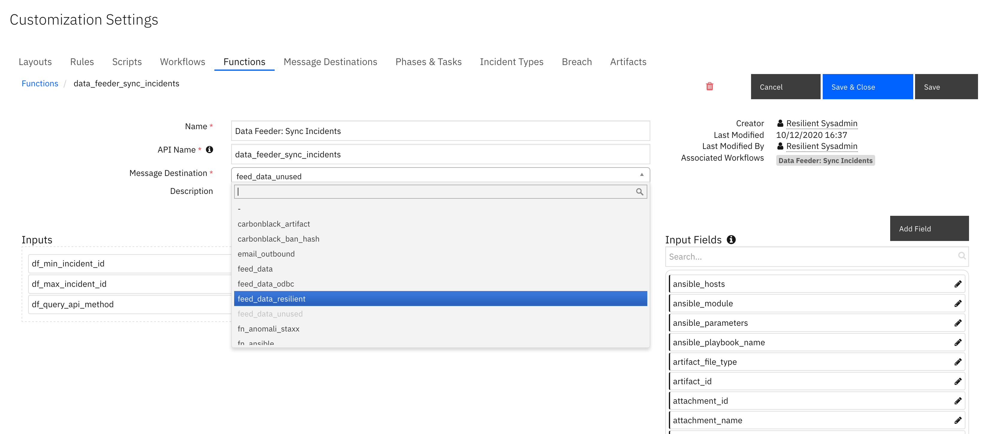
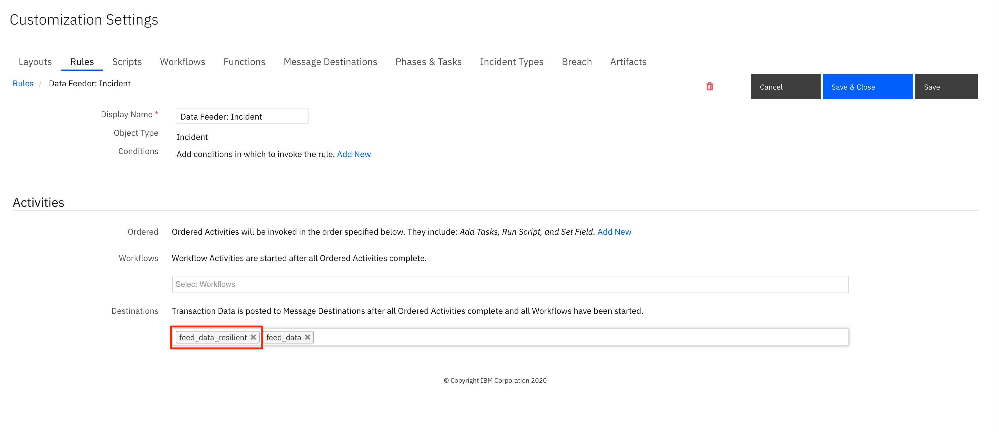
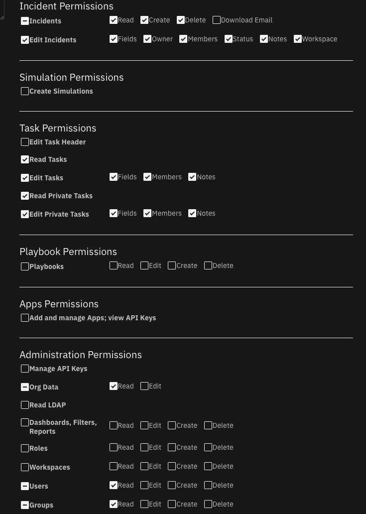
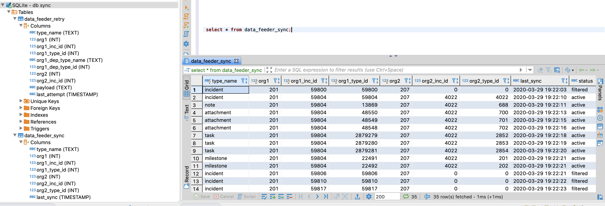

# Data Feeder for SOAR
This package contains the QRadar SOAR (Resilient) plugin to the Data Feed extension. The Data Feed Extension allows you to maintain "replica" data for QRadar SOAR incidents, artifacts, tasks, notes, attachments and so on, in another QRadar SOAR organization in the same or different QRadar SOAR platform, as well as another CP4S environment. The updates are performed in near real-time.

Refer to the documentation on the Data Feed extension for use cases supported and configuration options. Also refer to the other Data Feed plugins which can be used in combination.

## Features
* Transfer incident data between two instances of QRadar SOAR (or CP4S).
* Transfer incident data between two Organizations within the same QRadar SOAR instance.
* Transfer incident data to more than one QRadar SOAR instance at the same time.
* Synchronized incident data objects include: artifacts, attachments, notes, milestones, tasks and datatables.
* Choice of databases to retain synchronization information: SQLite or PostgreSQL.

## License
Unless otherwise specified, contents of this repository are published under the MIT open-source
[LICENSE](LICENSE).

## History
| Date | Version | Notes |
| ---: | ------: | ----: |
| 4/2024 | 1.1.0 | Enhancements for datatable select/multi-select fields. Fixes for synchronizing task attachments and notes. Threaded updates for better performance. |

## Installation
The integration package contains Python components that are called by the QRadar SOAR platform. These components run in the Resilient Circuits integration framework. 
The package also includes QRadar SOAR customizations that will be imported into the platform later.
You perform these installation procedures at the QRadar SOAR integration server.

Apps which are installed through the SOAR UI for App Host incorporate the UI components (rules and workflows) and no additional app installation is needed.
  
### App Host Installation
* To install or uninstall an App or Integration on the _IBM SOAR platform_, see the documentation at [ibm.biz/soar-docs](https://ibm.biz/soar-docs).
* To install or uninstall an App on _IBM Cloud Pak for Security_, see the documentation at [ibm.biz/cp4s-docs](https://ibm.biz/cp4s-docs) and follow the instructions above to navigate to Orchestration and Automation.

### Integration Server
If adding support for PostgreSQL, upgrade the package as:
```
  [sudo] pip install --upgrade rc_data_feed_plugin_resilientfeed-<version>.tar.gz[postgres]
```

### Configuration
*	Edit the resilient-circuits configuration file, as follows:
    
     - In the `[resilient]` section, ensure that you provide all the information required to connect to the QRadar SOAR platform.
     - In the `[feeds]` section, define the feed(s) you intend to use and create separate sections for each feed. For example:
     `feed_names=resilient_feed`
     - In the [resilient_feed] section, configure the settings for your QRadar SOAR environment.
```
  [feeds]
  # comma separated section names. ex. sqlserver_feed,file_feed
  feed_names=resilient_feed
  reload=false
  # use reload_types to limit the types of objects when reload=true.
  # Ex: incident,task,note,artifact,attachment,<data_table_api_name>
  reload_types=
  # set to true if ElasticSearch errors occur during reload=true
  reload_query_api_method=false

  # feed_data is the default message destination that will be listened to
  queue=feed_data_resilient

  # set to true if attachment data should be part of payload send to plugins
  include_attachment_data=false
  # if necessary, specify the supported workspace (by label, case sensitive) and the list of feeds associated with it
  # ex: 'Default Workspace': ['resilient_feed'], 'workspace A': ['kafka_feed', 'resilient_feed']
  workspaces=
  # support for parallel execution. Default is False
  parallel_execution = False
  
  [resilient_feed]
  class=ResilientFeed
  # provide configuration information to the target QRadar SOAR and Organization
  host=localhost
  #proxy_host=
  api_key_id=
  api_key_secret=
  #email=
  #password=
  port=443
  org=
  cafile=false
  # identify a sqlite db file to retain mapping between QRadar SOAR instances.
  sqlite_sync_file=/path/to/file
  # postgresql db connection if sqlite_sync_file is not used
  postgresql_connect=Driver={PostgresSQL Driver};Server=127.0.0.1;DB=<db>;Port=5432;connectTimeout=0
  postgresql_uid=<acct>
  postgresql_pwd=<pwd>
  # optional semicolon separated list of fields to allow incidents to sync. ex. incident_type_ids in ["Phishing", "Malware"];custom_field = a;description ~ malicious
  #matching_incident_fields=
  # when using matching_incident_fields, specify whether 'all' or 'any' field needs to match to accept
  #matching_operator=all
  # optional semicolon separated list of fields to exclude from an incident. Sections of fields can be used: pii;gdpr;hipaa;cm
  #exclude_incident_fields=
  # optionally include references within the incident to source org_id and incident_id. Values true/false
  sync_reference_fields=True
  # true|false - specify whether to delete the target incident if the source incident is deleted. Default: false
  delete_incidents=false
```

### matching_incident_fields
Use this capability to filter which incidents and it's tasks, notes, artifacts, etc. are sent to the target organization. Below are a few examples for how to use this capability.

- Filter on the incident owner.
> matching_incident_fields=ownerid == user@example.com
- Filter on any incident type phishing or malware.
> matching_incident_fields=incident_type_ids in ['Phishing', 'Malware']
- Filter on the title or description field containing the word 'malicious'.

> matching_incident_fields=name ~ malicious;description ~ malicious
> matching_operator=any
- Filter on a custom boolean field set to True.
> matching_incident_fields=custom_bool == True
- Filter on open incidents. This is useful when performing a bulk load with as `reload=true` or using the `Data Feeder: Sync Incidents` function.

> matching_incident_fields=plan_status == A

- Filtering on date and datetime fields are a little trickly as the epoch timestamp is needed. Websites such as [https://www.epochconverter.com/](https://www.epochconverter.com/) can be used to generate a timestamp. Be sure to use the GMT timezone and use a timezone in milliseconds.
> matching_incident_fields=discovered_date >= 1604073642000

## ResilientFeed Class
This class allows you to write all incoming data to another QRadar SOAR Organization. Incidents, Artifacts, Attachments, Datatables, Notes, Milestones and Tasks (including task notes, and attachments) are copied. 
The following configuration items are supported:

| Key | Values | Description |
| :-- | :----- | :---------- |
| class | ResilientFeed | Indicates that the section is for an QRadar SOAR synchronization. |
| host, #proxy_host, api_key_id, api_key_secret, #email,  #password, port, org, cafile | | Specify the connection values similar to the `[resilient]` section for connection to the target SOAR environment |
| sqlite_sync_file | /path/to/file | Absolute path to a file to retain mapping information between the two QRadar SOAR instance. Comment out if using PostgreSQL |
| postgresql_connect | Driver={PostgresSQL Driver};Server=127.0.0.1; DB=yourDB;Port=5432; connectTimeout=0 | connection string when using PostgreSQL. Comment out otherwise. |
| postgresql_uid | postgreSQL_Acct | Your PostgreSQL account |
| postgresql_pwd | postgreSQL_Acct | Your PostgreSQL password |
| matching_incident_fields | plan_status == 'C'; custom_field > 5 | Optional semicolon separated list of comparison tuples to determine the criteria for synchronizing an incident and it's tasks, artifacts, etc. Use the syntax: \<field\> \<operator\> \<value\>. Operator may be one of: ~, ==, >=, <=, <, >, in, 'not in', is, and 'is not'. Use `~` for `in` when searching richtext fields. `None` can be used for \<value\>. Make sure to separate each \<field\> \<operator\> \<value\> with spaces. |
| matching_operator | any\|all | When using matching_incident_fields, either `all` fields or `any` field needs to match for incident synchronization. Default: all | 
| exclude_incident_fields	| severity_code; date_started; custom_field | Optional semicolon separated list of fields and field sections to exclude when synchronizing an incident. | 
| sync_reference_fields | true\|false | Specify `True` to add information to the target incident to maintain the original org id incident id, sync host and incident create date. Fields are `df_org_id`, `df_inc_id`, `df_host` and `df_create_date`, respectively |
| delete_incidents | true\|false | Specify 'True' to delete the target incident and it's data when the source incident is deleted |

## Requirements
* This functionality has been tested with QRadar SOAR instances >= v48. 
There is presently an issue with v37.0 restricting the live synchronization of a newly deleted artifact. If this capability is critical to your requirements, use QRadar SOAR version >=v37.1.
* The target QRadar SOAR platform must be at the same version or greater than the source QRadar SOAR platform.
* The target QRadar SOAR organization must have the same set of custom fields, incident types, playbooks (tasks and phases) in order to synchronize incident data. Use the export/import functionality under `Administrator Settings`.
* The target QRadar SOAR organization should have the same users and groups defined. For any user or group not found, incident and task ownership as well as member lists will be left empty. 
* To synchronize datatables in real time, create rules specifying the `feed_data_resilient` message destination in order to changes.

## Setup Steps
1. Ensure QRadar SOAR version requirements are met for both the source and destination instances.
2. Perform the manual duplication of custom fields, incident types, phases and tasks, etc. by exporting these configurations from the QRadar SOAR source organization and importing them to the target QRadar SOAR organization.
3. Manually recreate the users and groups needed in the target QRadar SOAR organization.
4. Configure the app.config settings with the settings for the target QRadar SOAR organization and, optionally, the criteria for the types of incidents to synchronize and fields to exclude.
5. Run `resilient-circuits run` to confirm connectivity to both instances of QRadar SOAR (with `reload=False`).
6. The best way to test is to set `reload=False` under `[feeds]` in your app.config file, and in the source QRadar SOAR organization, run the `Data Feeder: Sync Incidents` rule to synchronize a small number of incidents. Change the message destination of the `Data Feeder: Sync Incidents` function to `feed_data_resilient` as it may be used by another Data Feeder plugin.



7. If using other Data Feeder plugins (ex. odbcfeed), change the Data Feeder rules to include the `feed_data_resilient` message destination. Restart resilient-circuits in order for the message destination change to take effect.




## Considerations
* If real-time synchronization remains in place, changes in the source QRadar SOAR data will overwrite any changes made in the target QRadar SOAR organization data. 
* Deleting a source incident, task, artifact, etc. will also delete the matching target information.
* Synchronization of incidents may fail if newer required fields were created that were not present on these older incidents. Same is true for newer 'on close' created fields. This can be overcome by changing the fields from `required` to `optional`.
* Unofficial timing tests shows creating incident data can take .3-.5 seconds each data type. Consider the time it will take for all your incident data to synchronize when using `reload=True`.
* Review the permissions given to target QRadar SOAR user or api_key. They must have the appropriate values to read and write incidents, artifacts, attachments, comments, milestones, tasks, and datatables. In addition, some incidents have wiki entries associated with them. Finally, older versions of QRadar SOAR also intermix simulation incidents. Provide the permission to create those as necessary.



## Limitations
* This solution is not intended for bidirectional synchronization.
* Unfortunately, the create date of the original incident is lost when the target incident is synchronized. 
* Timer data cannot be synchronized.
* Presently, artifacts with custom artifact types cannot synchronize.
* Deleting a source incident task attachment presently doesn't synchronize.
* Incident email messages (via the built-in Inbound Email Connectors) do not synchronize.
* It's presently not possible to restrict synchronization of incident elements such as tasks, artifacts, notes, etc.
when using `reload=all` and the action `Data Feeder: Sync Incidents`.

## Synchronization Methods
Three methods exist for synchronizing incident data:
* reload=True - This app.config setting will synchronize all incidents (including those closed) each time resilient-circuits is run. Review performance considerations above in [Considerations].
* real-time changes - If the automatic rules for incident, artifact, tasks, etc. are enabled, then any change to a object will perform the synchronization to the target organization. Note: Datatable rules need to be created in order to synchronize them in real-time.
* Data Feeder: Sync Incidents function - This function allows one to specify the range of incident data to synchronize. This is useful to limit the range of incidents to transmit.

## Behavior
Unexpected behaviors can occur and are detailed here.
* If an incident is originally filtered via the `matching_incident_fields` setting, all incident data are filtered. If in the future that incident changes so that the matching criteria passes, at the time the incident is changed, only the incident is synchronized. To include all the other data elements such as tasks, artifact, attachments, etc., use the `Data Feeder: Sync Incidents` function. 
* Attachments cannot be updated.

## Database Support
An external database is used to maintain a mapping of the source incident data to the target incident data. For example, source incident 2100 maps to target incident 2222. The app will look up this relationship in order to update incident 2222 when ongoing changes to incident 2100 are made.
Either a SQLite database (for integration servers) or a PostgreSQL (for app host or integration servers) can be used.

### SQLite Database
A SQLite database can be used to maintain a mapping of incident data between the source and target QRadar SOAR instances. **This database cannot be used for App Host environments due to the restartability of containers.** Two tables are maintained for data synchronization:

* data_feeder_sync - contains specific ids for source and target instances and status. The fields are as follows:

| type_name | org1 | org1_inc_id | org1_type_id | org2 | org2_inc_id | org2_type_id | last_sync | status |
| --------- | ---- | ----------- | ------------ | ---- | ----------- | ------------ | --------- | ----- |

Status can be one of `active`, `filtered`, `deleted` or `bypassed`.

* data_feeder_retry - failures to create a data element are retried when the parent element is synchronized. For example, this is needed when tasks appear for synchronization before the incident. Once the incident is synchronized, all the dependent elements will be retried. The schema is as follows:

| type_name | org1 | org1_inc_id | org1_type_id | org1_dep_type_name | org1_dep_type_id | org2 | org2_inc_id | payload | last_attempt |
| --------- | ---- | ----------- | ------------ | ------------------ | ---------------- | ---- | ----------- | ------- | ------------ |

### Troubleshooting SQLite DB
There are many tools to view the db tables, including open-source solutions. DBeaver is one open-source application supporting many different database types including sqlite.

Use the following SQL statements for problem diagnostics:
* select * from data_feeder_sync where org2=<target organization>
* select * from data_feeder_retry where org2=<target organization>



### PostgreSQL Database
Like the SQLite database, the same table structures are created and maintained in PostgreSQL. 

Use the SQLite DB if performing a one-time or limited-timeframe synchronization. Use PostgreSQL for continuously synchronization or when using App Host containers.


## Troubleshooting Tips
Synchronization could fail for the following reasons: 
* Missing custom fields, custom incident_types, phases, etc. Ensure you have exported and re-imported these customizations into the target QRadar SOAR organization. Also check the permissions set on your target QRadar SOAR user account or api token associated with incident, artifact, task, etc. creation, including creating wiki pages.
* Artifacts with custom artifact types cannot be synchronized at this time.
* Older incident fields missing required fields defined at a later point in time. The only remedy is to modify the definition of the fields from `required` to `optional` and then resync the field using the rule `Data Feed: Sync Incidents`.
* Matching criteria filtered the incident. Review the values specified in `matching_incident_fields` and the value specified in `matching_operator`. 
If a field is richtext, use the `~` operator to find the value. For example: description ~ warning.
* Change the log level to debug to receive additional troubleshooting information on synchronization issues.
* Changes to tasks, artifacts, notes, etc. before the incident is synchronized.
  - If the log displays a message such as:
  `Incident not found. Queued to retry task:xxx->xxx to xxx`
  Run the incident action: `Data Feeder: Sync Incidents` to synchronize the incident and all it's related tasks, artifacts, notes, etc.
```
[resilient]
loglevel = DEBUG
``` 
