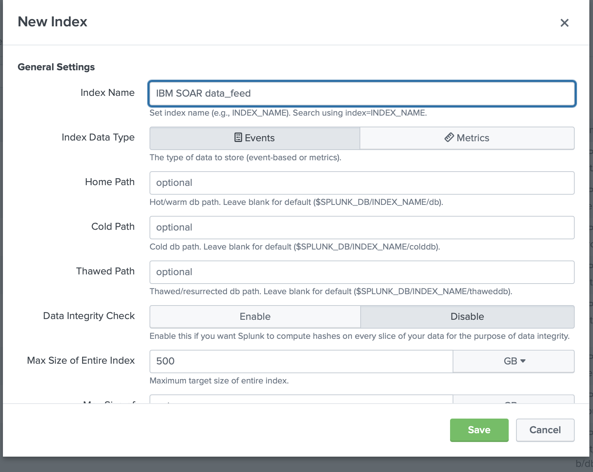
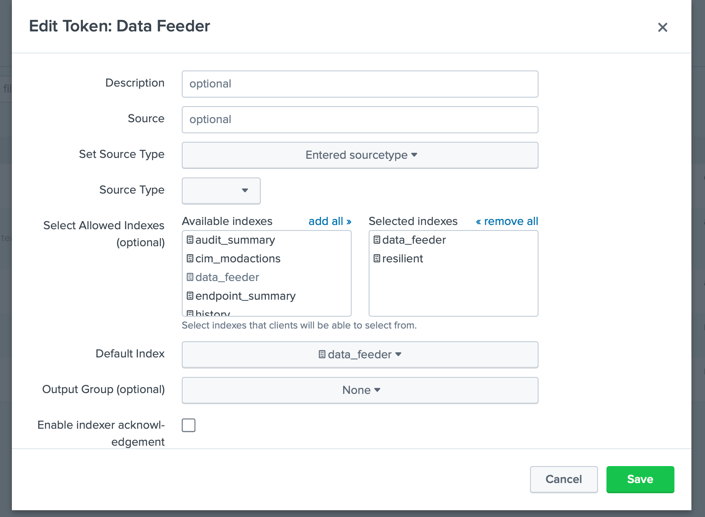
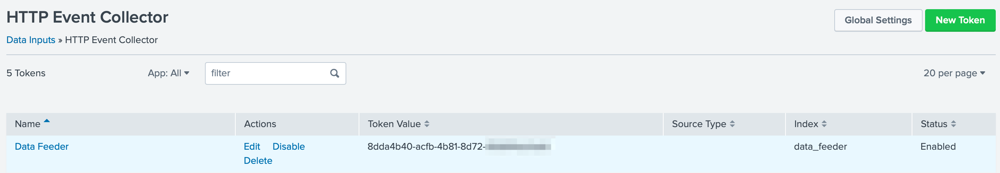

# Data Feed plugin for Splunk

## Introduction
This package contains the SplunkFeed Plugin to the Data Feed extension. This Data Feed extension allows one to maintain "replica" data for IBM SOAR incidents, artifacts, tasks, notes, etc via a HTTP Event Collector in Splunk. The updates are performed in near real-time.

This plugin allows this replica data to be maintained in Splunk.

Refer to the documentation on the Data Feed extension for uses cases support and configuration options. Also refer to the other Data Feed plugins which can be used in combination.

## License

Unless otherwise specified, contents of this repository are published under the MIT open-source
[LICENSE](LICENSE).

## Release Notes

| Version | Date | Notes |
| ------- | ---- | ----- |
| 1.2.0   | 04/2024 | Updated base rc_data_feed to 3.1.0. Added parallel execution. Added ability to exclude selective incident fields. |
| 1.1.2   | 01/2024 | Updated base rc_data_feed to 3.0.0 |
| 1.1.1   | 10/2022 | Fix to handle rare corrupt event.message |
| 1.1.0   | 5/2022 | Replaced base component, adding attachment content, workspace separation, more control over auto data reload. |
| 1.0.3   | 9/2020 | App Host and Proxy Support |

### 1.1.0 Changes

This release modified the base portion of the Data Feeder which is controlled by the `[feed]` section within the app.config file. New parameters have been added which you need to manually add if upgrading from a previous version:

| Parameter | Value(s) | Capability |
| --------- | -------- | ---------- |
| reload_types | incident,task,note,artifact,attachment,<data_table_api_name> | use reload_types to limit the types of objects when reload=true. Leave empty to include all data. |
| workspaces | "Default Workspace": ["sqlserver_feed"], "workspace A": ["kafka_feed", "resilient_feed"] | This setting allows for the partitioning of Data Feeder execution among different workspaces. The format is to specify the workspace name with the data feeder components to associated with it: "workspace": ["app.config section_name"]. If unused, data from all workspaces is accessed. |
| include_attachment_data | true/false | set to true if attachment data should be part of the sent payload. When 'true', the attachment's byte data is saved in base64 format. |

### 1.2.0 Changes
This release modified the base portion of the Data Feeder which is controlled by the `[feed]` section within the app.config file. New parameters have been added which you need to manually add if upgrading from a previous version.
Version 1.2.0 also introduces the ability to exclude incident fields from the created `incident` database table.  Wildcards can be used to remove fields following a pattern. Ex. gdpr*.
To use this capability, add the following app.config setting, exclude_incident_fields_file, to the particular database configuration section. 

| Parameter | Value(s) | Capability |
| --------- | -------- | ---------- |
| parallel_execution | True, False | parallel execution for faster ingestion to Splunk |
| exclude_incident_fields_file | /path/to/exclusion_file.txt | Specify incident fields, one per line, to exclude from the incident data sent to Splunk. Use wildcards such as '*' (multiple characters) or '?' (single character) to exclude patterns of fields. Ex. gdpr_*, custom_field_int |

## Compatibility
SOAR: 45.0 or higher

CP4S: 1.10 or higher

## Installation
The data feeder app for Splunk contains Python components that are called by the IBM SOAR platform. It can either by installed directly in the app for management and execution through the App Host, or installed on your own Integration server, running our integration framework: resilient-circuits. It is preferred that an enterprise use App Host, as all the component installation and dependencies are already packaged.

### App Host
Simply install the .zip file into the app. It includes:
* Rules to automatically share incident data with Splunk. Review the rules which start with 'Data Feeder:' if you wish to reduce the types of information shared. To share datatable data, create a new rule specifying the datatable and assign it to 'data_feed' destination. See the [app.config file](#app.config-file) section for more information on how to configure your data feed environment.

### Integration Server
#### Install the Python components
  Complete the following steps to install the Python components:
* Ensure that the environment is up-to-date, as follows:
```
  sudo pip install --upgrade pip
  sudo pip install --upgrade setuptools
  sudo pip install --upgrade resilient-circuits
```
* Run the following commands to install the package:
```
  unzip rc_data_feed-<version>.zip (must be at least version 2.1.0)
  [sudo] pip install --upgrade rc_data_feed-<version>.tar.gz
  unzip rc_data_feed-plugin-splunkfeed-<version>.zip
  [sudo] pip install --upgrade rc_data_feed-plugin-splunkfeed-<version>.tar.gz
```
* Configure Resilient-circuits

  The Resilient Circuits process runs as an unprivileged user, typically named integration. If you do not already have an integration user configured on your appliance, create it now.
  Complete the following steps to configure and run the integration:
* Using sudo, switch to the integration user, as follows:

`  sudo su - integration`
* Use one of the following commands to create or update the resilient-circuits configuration file. Use –c for new environments or –u for existing environments.
```
  resilient-circuits config -c
  or
  resilient-circuits config –u [-l rc-data-feed-plugin-splunkfeed]
```

### app.config file
* Edit the app.config configuration file, as follows:

     - In the [resilient] section, ensure that you provide all the information required to connect to the IBM SOAR platform.
     - In the [splunk_hec_feed] section, configure the settings for your splunkfeed environment.
     - In the [feeds] section, define the feed(s) you intend to use and create separate sections for each feed. For example:
```
[feeds]
# comma separated section names. ex. sqlserver_feed,file_feed
feed_names=splunk_hec_feed
reload=False
# use reload_types to limit the types of objects when reload=true.
# Ex: incident,task,note,artifact,attachment,<data_table_api_name>
reload_types=
# set to true if ElasticSearch errors occur during reload=true
reload_query_api_method=false

# feed_data is the default message destination that will be listened to
queue=feed_data

# set to true if attachment data should be part of payload send to plugins
include_attachment_data=false
# if necessary, specify the supported workspace (by label, case sensitive) and the list of feeds associated with it
# ex: 'Default Workspace': ['sqlserver_feed'], 'workspace A': ['kafka_feed', 'resilient_feed']
workspaces=
# parallel execution disabled for splunkfeed.
parallel_execution = False

[splunk_hec_feed]
class=SplunkHECFeed
token=<token>
host=<host>
port=8088
index=data_feeder
# only use event_source_type if using one type. otherwise, the resilient object type (incident, note, artifact, etc.) is used
#event_source_type=txt
event_host=<resilient host>
event_source=resilient
use_ssl=true
# Optional settings for accessing Splunk via a proxy.
#http_proxy=http://proxy:8088
#https_proxy=http://proxy:8088
# these settings are only needed for the unit tests
#user=
#password=
# new in v1.2.0 exclude incident fields. Specify fields to exclude one per line. Wildcards such as * and ? may be used. 
exclude_incident_fields_file = /path/to/exclusion_file.txt
```

## SplunkHECFeed Class
The SplunkHECFeed class utilizes the Splunk HTTP Event Collector for data import. This is convenient as the data from IBM SOAR is readily converted to JSON which can be natively consumed by Splunk.

| Key | Values | Description |
| :-- | :----- | :---------- |
| class | SplunkHECFeed | Indicates that the section is for Splunk ES. |
| token | Ex. 81e2d4bb-c008-49ac-a7a7-c0bf408c999 | API token defined for the HEC data input. |
| host | Ex. splunk.yourorg.com |
port | Ex. 8088 | The default is 8088 |
| index | Ex data_feeder | The name of the index already defined. |
| event_host | Ex. myorg.com | Optional host name to record as the source of the events. |
| event_source | Ex. resilient | Optional source name of the events. Specifying a value improves searching
| event_source_type |  | Optional source_type if one value is used for all events. If unspecified, each object type (incident, task, note, etc.) is used as the source_type
| use_ssl | True | False | Indicate if connections to the HEC uses encryption (https) |
| exclude_incident_fields_file | /path/to/exclusion_file.txt | Specify incident fields, one per line, to exclude from the incident send to Splunk. Use wildcards such as '*' (multiple characters) or '?' (single character) to exclude patterns of incident fields. |


### Considerations
* Enable the HTTP Event Collector within Splunk ES before using this data feed.
* Splunk events are immutable. IBM SOAR object changes are represented as new events. No event deletion is possible.
* Be aware that when using `reload=True`, all IBM SOAR records will be duplicated in Splunk each time resilient-circuits is re-started. Use the app.config setting `reload_types` to specify the data sent if you want to either limit the object types or to also include datatables.

## Splunk Configuration
Follow these steps to create an HTTP Event Collector:

1. Go to Settings and select Indexes.
2. Create an index for data feeder. Your requirements will guide you to the correct settings. We have tested with Index Data Type `Events` and App `Search and Reporting`.

3. Go to Settings and select Data Inputs.
4. For HTTP Event Collector, click the `Add new` Action.
5. Enter information about your collector, specifically, the index(es) to enable and the Default Index. No other settings are necessary (such as Source Type) but can be added for further identification.

6. Once created, copy the Token Value for use in the app.config `token` setting.


## Additional Data Feed Documentation
For more information on the setup and use of the data feeder, including the use of the Data Sync Incident function, refer to the [Data Feeder Documentation](https://github.com/ibmresilient/resilient-community-apps/blob/main/rc_data_feed/doc/IBM_SOAR_Data_Feed_App_Guide.docx).
