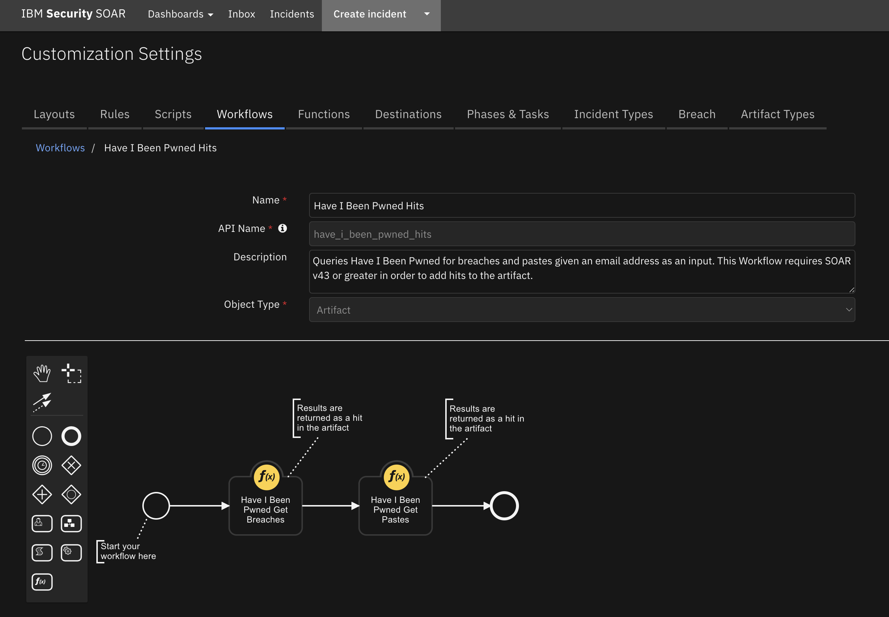

# SOAR Content Package for Have I Been Pwned

## Description

This content package contains a single resource file with the following rule and workflow:

1. Have I Been Pwned Hits (Rule)
- Automatic rule invoked by an artifact of type Email Recipient or Email Sender 
- Associated with the Have I Been Pwned Hits Workflow
2. Have I Been Pwned Hits (Workflow)
- Queries Have I Been Pwned for Breaches and Pastes given an email address.
- Uses the Functions Have I Been Pwned Get Breaches and Have I Been Pwned Get Pastes

## Package Dependences
The workflows in this package depend on the following
- SOAR Version 43
- fn_hibp Version 2.0.2

## Import
Ensure that the above packages have been installed.
Download the res_hibp package and unzip it. 
In SOAR server, go to Administrator Settings->Organization->Migrate Settings->Import->Import Settings 
and select the < hibp.res > file downloaded above.

## Usage
Once the resource file is successfully imported, the workflows included in the file are ready for use.

### Example of Have I Been Pwned Workflow with Hits
This workflow invokes two functions from the fn_hibp integration packages.

## Uninstall
Manually delete the followings:
1. Rules
- "Have I Been Pwned Hits"
2. Workflows
- Have I Been Pwned Hits

