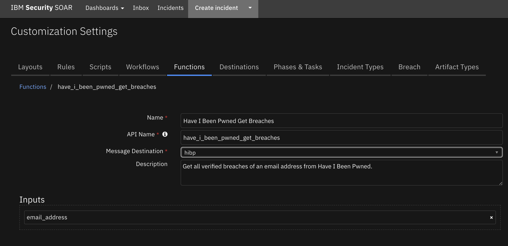
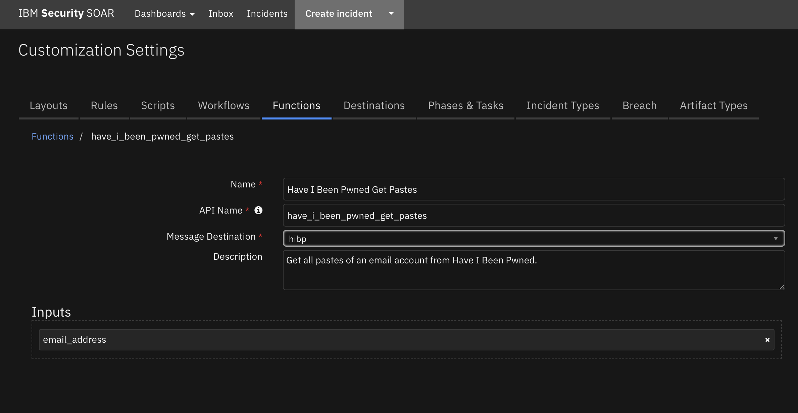

# SOAR Content Package for Have I Been Pwned

## Description

This content package contains a single resource file with the following rule and workflow:

1. Have I Been Pwned Hits (Rule)
- Automatic rule invoked by an artifact of type Email Recipient or Email Sender 
- Associated with the Have I Been Pwned Hits Workflow
2. Have I Been Pwned Hits (Workflow)
- Queries Have I Been Pwned for Breaches and Pastes given an email address.
- Uses the Functions Have I Been Pwned Get Breaches and Have I Been Pwned Get Pastes


## Package Dependences
The workflows in this package depend on the following
- SOAR Version 43
- fn_hibp Version 2.0.2


## Import
Ensure that the above packages have been installed.
Download the res_hibp package and unzip it. 
In SOAR server, go to Administrator Settings->Organization->Migrate Settings->Import->Import Settings 
and select the `hibp.res` file downloaded above.

## Usage
Once the resource file is successfully imported, the workflows included in the file are ready for use.


### Example of Have I Been Pwned Workflow with Hits
This workflow invokes two functions from the fn_hibp integration packages.


## Function - Have I Been Pwned Get Breaches
Get all verified breaches of an email address from Have I Been Pwned.

 

<details><summary>Inputs:</summary>
<p>

| Name | Type | Required | Example | Tooltip |
| ---- | :--: | :------: | ------- | ------- |
| `email_address` | `text` | No | `test@example.com` | - |

</p>
</details>

<details><summary>Outputs:</summary>
<p>

> **NOTE:** This example might be in JSON format, but `results` is a Python Dictionary on the SOAR platform.

```python
results = {
  "content": {
    "Breaches": [
      {
        "AddedDate": "2015-10-26T23:35:45Z",
        "BreachDate": "2015-03-01",
        "DataClasses": [
          "Email addresses",
          "IP addresses",
          "Names",
          "Passwords"
        ],
        "Description": "In approximately March 2015, the free web hosting provider \u003ca href=\"http://www.troyhunt.com/2015/10/breaches-traders-plain-text-passwords.html\" target=\"_blank\" rel=\"noopener\"\u003e000webhost suffered a major data breach\u003c/a\u003e that exposed almost 15 million customer records. The data was sold and traded before 000webhost was alerted in October. The breach included names, email addresses and plain text passwords.",
        "Domain": "000webhost.com",
        "IsFabricated": false,
        "IsMalware": false,
        "IsRetired": false,
        "IsSensitive": false,
        "IsSpamList": false,
        "IsVerified": true,
        "LogoPath": "https://haveibeenpwned.com/Content/Images/PwnedLogos/000webhost.png",
        "ModifiedDate": "2017-12-10T21:44:27Z",
        "Name": "000webhost",
        "PwnCount": 14936670,
        "Title": "000webhost"
      },
      {
        "AddedDate": "2018-02-26T10:06:02Z",
        "BreachDate": "2018-02-19",
        "DataClasses": [
          "Email addresses",
          "Passwords"
        ],
        "Description": "In February 2018, \u003ca href=\"https://www.troyhunt.com/ive-just-added-2844-new-data-breaches-with-80m-records-to-have-i-been-pwned/\" target=\"_blank\" rel=\"noopener\"\u003ea massive collection of almost 3,000 alleged data breaches was found online\u003c/a\u003e. Whilst some of the data had previously been seen in Have I Been Pwned, 2,844 of the files consisting of more than 80 million unique email addresses had not previously been seen. Each file contained both an email address and plain text password and were consequently loaded as a single \u0026quot;unverified\u0026quot; data breach.",
        "Domain": "",
        "IsFabricated": false,
        "IsMalware": false,
        "IsRetired": false,
        "IsSensitive": false,
        "IsSpamList": false,
        "IsVerified": false,
        "LogoPath": "https://haveibeenpwned.com/Content/Images/PwnedLogos/List.png",
        "ModifiedDate": "2018-02-26T10:06:02Z",
        "Name": "2844Breaches",
        "PwnCount": 80115532,
        "Title": "2,844 Separate Data Breaches"
      },
      {
        "AddedDate": "2019-03-21T18:50:00Z",
        "BreachDate": "2018-07-01",
        "DataClasses": [
          "Email addresses",
          "Genders",
          "Geographic locations",
          "IP addresses",
          "Names",
          "Passwords"
        ],
        "Description": "In July 2018, the health and fitness service \u003ca href=\"https://8fit.zendesk.com/hc/en-us/articles/360017746394-Notice\" target=\"_blank\" rel=\"noopener\"\u003e8fit suffered a data breach\u003c/a\u003e. The data subsequently appeared for sale on a dark web marketplace in February 2019 and included over 15M unique email addresses alongside names, genders, IP addresses and passwords stored as bcrypt hashes. The data was provided to HIBP by \u003ca href=\"https://dehashed.com/\" target=\"_blank\" rel=\"noopener\"\u003edehashed.com\u003c/a\u003e.",
        "Domain": "8fit.com",
        "IsFabricated": false,
        "IsMalware": false,
        "IsRetired": false,
        "IsSensitive": false,
        "IsSpamList": false,
        "IsVerified": true,
        "LogoPath": "https://haveibeenpwned.com/Content/Images/PwnedLogos/8fit.png",
        "ModifiedDate": "2019-03-21T18:50:00Z",
        "Name": "8fit",
        "PwnCount": 15025407,
        "Title": "8fit"
      },
      {
        "AddedDate": "2018-02-16T07:09:30Z",
        "BreachDate": "2017-06-27",
        "DataClasses": [
          "Email addresses",
          "Passwords"
        ],
        "Description": "In June 2017, the online playlists service known as \u003ca href=\"https://blog.8tracks.com/2017/06/27/password-security-alert/\" target=\"_blank\" rel=\"noopener\"\u003e8Tracks suffered a data breach\u003c/a\u003e which impacted 18 million accounts. In their disclosure, 8Tracks advised that \u0026quot;the vector for the attack was an employee\u2019s GitHub account, which was not secured using two-factor authentication\u0026quot;. Salted SHA-1 password hashes for users who \u003cem\u003edidn\u0027t\u003c/em\u003e sign up with either Google or Facebook authentication were also included. The data was provided to HIBP by whitehat security researcher and data analyst Adam Davies and contained almost 8 million unique email addresses. The complete set of 18M records was later provided by JimScott.Sec@protonmail.com and updated in HIBP accordingly.",
        "Domain": "8tracks.com",
        "IsFabricated": false,
        "IsMalware": false,
        "IsRetired": false,
        "IsSensitive": false,
        "IsSpamList": false,
        "IsVerified": true,
        "LogoPath": "https://haveibeenpwned.com/Content/Images/PwnedLogos/8tracks.png",
        "ModifiedDate": "2019-08-25T08:52:21Z",
        "Name": "8tracks",
        "PwnCount": 17979961,
        "Title": "8tracks"
      }
  },
  "inputs": {
    "email_address": "test@email.com"
  },
  "metrics": {
    "execution_time_ms": 302,
    "host": "My Host",
    "package": "unknown",
    "package_version": "unknown",
    "timestamp": "2022-04-27 16:43:44",
    "version": "1.0"
  },
  "raw": "",
  "reason": null,
  "success": true,
  "version": "1.0"
}
```

</p>
</details>

<details><summary>Example Pre-Process Script:</summary>
<p>

```python
inputs.email_address = artifact.value
```

</p>
</details>

<details><summary>Example Post-Process Script:</summary>
<p>

```python
if results.success:
  if results.content:
    hit = []
    resp_data = results.content
    resp_dict = resp_data["Breaches"]
    dict_string = ""
    for breach in resp_dict:
        for dict_key, dict_value in breach.items():
          temp = ""
          aKey = str(dict_key)
          aValue = str(dict_value)
          temp = u"{}: {}".format(aKey, aValue)
          dict_string += temp
          dict_string += " || "
    hit = [
      {
        "name": "Number of Breached Sites", 
        "type": "number",
        "value": "{}".format(len(resp_data))
      },
      {
        "name": "Breached Sites", 
        "type": "string",
        "value": dict_string
      }
    ]
    artifact.addHit("HIBP Function hits added", hit)
else:
  incident.addNote("Have I Been Pwned has failed: {}".format(results.reason))

```

</p>
</details>

---
## Function - Have I Been Pwned Get Pastes
Get all pastes of an email account from Have I Been Pwned.

 

<details><summary>Inputs:</summary>
<p>

| Name | Type | Required | Example | Tooltip |
| ---- | :--: | :------: | ------- | ------- |
| `email_address` | `text` | No | `test@example.com` | - |

</p>
</details>

<details><summary>Outputs:</summary>
<p>

> **NOTE:** This example might be in JSON format, but `results` is a Python Dictionary on the SOAR platform.

```python
results = {
  "content": {
    "Pastes": [
      {
        "Date": null,
        "EmailCount": 9893,
        "Id": "http://siph0n.in/exploits.php?id=3670",
        "Source": "AdHocUrl",
        "Title": "siph0n.in"
      },
      {
        "Date": null,
        "EmailCount": 12002,
        "Id": "http://siph0n.in/exploits.php?id=3892",
        "Source": "AdHocUrl",
        "Title": "siph0n.in"
      },
      {
        "Date": null,
        "EmailCount": 99791,
        "Id": "http://siph0n.in/exploits.php?id=4680",
        "Source": "AdHocUrl",
        "Title": "remotestaff.com.au"
      },
      {
        "Date": null,
        "EmailCount": 104720,
        "Id": "https://a.pomf.cat/dioeav.txt",
        "Source": "AdHocUrl",
        "Title": "a.pomf.cat"
      }
    ]
  },
  "inputs": {
    "email_address": "test@email.com"
  },
  "metrics": {
    "execution_time_ms": 669,
    "host": "My Host",
    "package": "unknown",
    "package_version": "unknown",
    "timestamp": "2022-04-27 16:43:48",
    "version": "1.0"
  },
  "raw": "",
  "reason": null,
  "success": true,
  "version": "1.0"
}
```

</p>
</details>

<details><summary>Example Pre-Process Script:</summary>
<p>

```python
inputs.email_address = artifact.value
```

</p>
</details>

<details><summary>Example Post-Process Script:</summary>
<p>

```python
if results.success:
  if results.content:
    hit = []
    resp_data = results.content
    resp_dict = resp_data["Pastes"]
    dict_string = ""
    for paste in resp_dict:
      for dict_key, dict_value in paste.items():
        temp = ""
        aKey = str(dict_key)
        aValue = str(dict_value)
        temp = u"{}: {} ; ".format(aKey, aValue)
        dict_string += temp
      dict_string += " || "
    hit = [
      {
        "name": "Pastes", 
        "type": "string",
        "value": dict_string,
      }
    ]
    artifact.addHit("HIBP Function hits added", hit)
else:
  incident.addNote(u"Have I Been Pwned has failed: {}".format(results.reason))

    
```

</p>
</details>

---


## Uninstall
Manually delete the followings:
1. Rules
- "Have I Been Pwned Hits"
2. Workflows
- Have I Been Pwned Hits


