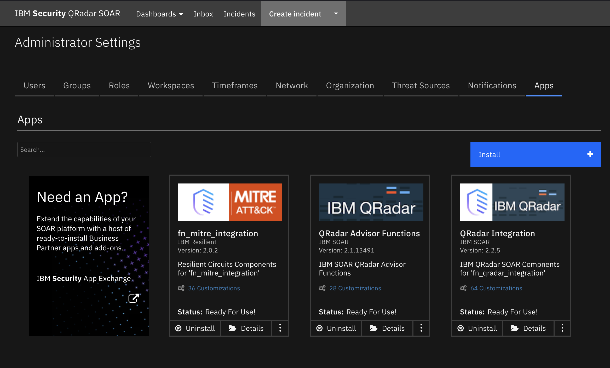

# QRadar SOAR Content Package for QRadar Advisor and MITRE ATT&CK<sup>TM</sup>

## Description

This content package contains a single resource file with the following workflows:

1. Example of QRadar Advisor Offense Analysis with MITRE
- Retrieve analysis and insights from QRadar Advisor, together with MITRE ATT&CK tactic
- Retrieve MITRE ATT&CK techniques related to the tactic above
2. Example of mapping QRadar rule to tactic
- Retrieve mapping of a QRadar rule to MITRE ATT&CK tactic(s) from QRadar Advisor
- Retrieve MITRE ATT&CK techniques related to the tactic above


## Package Dependences
The workflows in this package depend on the following integration packages
- QRadar Advisor integration 2.1.0
- QRadar integration 2.2.5
- MITRE integration 2.0.2



## Import
First ensure that the three above integration packages have been installed.
Download the res_qraw_mitre package. Unzip it if necessary(tar -xvf res_qraw_mitre.tar). 
In the QRadar SOAR UI, go to Administrator Settings->Organization->Migrate Settings->Import->Import Settings 
and select the qraw_mitre.res file downloaded above.


## Usage
Once the resource file is successfully imported, the workflows included in the file are ready for use.


### Example of QRadar Advisor Offense Analysis with MITRE
This workflow invokes two functions from two integration packages.


<details><summary>Inputs Qradar Advisor Offense Analysis:</summary>
<p>

| Name | Type | Required | Example | Tooltip |
| ---- | :--: | :------: | ------- | ------- |
| `qradar_offense_id` | `text` | Yes | `-` | QRadar Offense ID |
| `qradar_advisor_result_stage` | `select` | No | `-` | stage1(Local), stage2(Watson enriched), stage3(Expanded local context) |
| `qradar_analysis_restart_if_existed` | `boolean` | No | `-` | restart the analysis if there is an existing result |

</p>
</details>

<details><summary>Outputs Qradar Advisor Offense Analysis:</summary>

**NOTE:** This example might be in JSON format, but `results` is a Python Dictionary on the SOAR platform.

```python
results = {
  "insights": {
    "high_value_assets": [],
    "high_value_users": [],
    "insights": "Watson has analyzed this offense and a total of three observables.  The reasoning process has not found any additional indicators that are related to this offense.  No data points were found to be linked with the offense.  One indicator was related to suspicious activity, and all indicators were active.  In particular, one IP address has been found, which is known to be suspicious or malicious.",
    "is_stage3_pending": false,
    "malware_families": [],
    "related_investigations": [
      {
        "analysis_time": null,
        "concern_score": null,
        "id": 1,
        "is_search": true,
        "priority": null,
        "source": null,
        "type": "Investigations"
      }
    ],
    "risky_users": [],
    "stage3_insights": "",
    "start_time": 1659629011957,
    "stop_time": 1659636230480,
    "tactics": [
      {
        "confidence": 60,
        "data_sources": [
          "xfe"
        ],
        "event_count": 206,
        "flow_count": 0,
        "id": "TA0011",
        "nodes": [
          {
            "is_internal": false,
            "label": "89.223.26.52",
            "type": "IpAddress"
          }
        ],
        "rules": [],
        "tactic_id": "Command and Control",
        "techniques": []
      }
    ],
    "threat_actors": [],
    "watched_users": []
  },
  "note": "\u003cul\u003e\u003cli\u003e\u003cimg src=\"https://raw.githubusercontent.com/freetaxii/stix2-graphics/master/icons/png/stix2-meta-icons-png/identity-square-dark-300-dpi.png\" alt=\"identity\" style=\"width:20px; height:20px\"/\u003e userD\u003c/li\u003e\u003cul style=\"list-style-type:none\"\u003e\u003cli\u003e\u003cimg src=\"https://raw.githubusercontent.com/freetaxii/stix2-graphics/master/icons/png/stix2-sco-network-address-icons-png/ipv4-addr-square-dark-300-dpi.png\" alt=\"ipv4-addr\" style=\"width:20px; height:20px\"/\u003e 192.168.0.17\u003c/li\u003e\u003c/ul\u003e\u003c/ul\u003e\u003cul\u003e\u003cli\u003e\u003cimg src=\"https://raw.githubusercontent.com/freetaxii/stix2-graphics/master/icons/png/stix2-sco-network-address-icons-png/ipv4-addr-square-dark-300-dpi.png\" alt=\"ipv4-addr\" style=\"width:20px; height:20px\"/\u003e 89.223.26.52\u003c/li\u003e\u003cul style=\"list-style-type:none\"\u003e\u003cli\u003e\u003cimg src=\"https://raw.githubusercontent.com/freetaxii/stix2-graphics/master/icons/png/stix2-sco-network-address-icons-png/ipv4-addr-square-dark-300-dpi.png\" alt=\"ipv4-addr\" style=\"width:20px; height:20px\"/\u003e 192.168.0.17\u003cimg src=\"https://image.flaticon.com/icons/svg/282/282100.svg\" alt=\"link\" style=\"width:15px; height:15px\"/\u003e\u003c/li\u003e\u003cli\u003ex-mitre-tactic Command and Control\u003c/li\u003e\u003c/ul\u003e\u003c/ul\u003e\u003cul\u003e\u003cli\u003e\u003cimg src=\"https://raw.githubusercontent.com/freetaxii/stix2-graphics/master/icons/png/stix2-sco-network-address-icons-png/ipv4-addr-square-dark-300-dpi.png\" alt=\"ipv4-addr\" style=\"width:20px; height:20px\"/\u003e 193.184.16.214\u003c/li\u003e\u003cul style=\"list-style-type:none\"\u003e\u003cli\u003e\u003cimg src=\"https://raw.githubusercontent.com/freetaxii/stix2-graphics/master/icons/png/stix2-sco-network-address-icons-png/ipv4-addr-square-dark-300-dpi.png\" alt=\"ipv4-addr\" style=\"width:20px; height:20px\"/\u003e 192.168.0.17\u003cimg src=\"https://image.flaticon.com/icons/svg/282/282100.svg\" alt=\"link\" style=\"width:15px; height:15px\"/\u003e\u003c/li\u003e\u003c/ul\u003e\u003c/ul\u003e\u003cp\u003eThere are 5 objects and 2 links.\u003c/p\u003e",
  "observables": [
    {
      "description": "userD",
      "relevance": "very-high",
      "toxicity": "very-low",
      "type": "identity"
    },
    {
      "description": "89.223.26.52",
      "relevance": "medium",
      "toxicity": "high",
      "type": "ipv4-addr"
    },
    {
      "description": "192.168.0.17",
      "relevance": "medium",
      "toxicity": "very-low",
      "type": "ipv4-addr"
    },
    {
      "description": "193.184.16.214",
      "relevance": "medium",
      "toxicity": "very-low",
      "type": "ipv4-addr"
    },
    {
      "description": "Command and Control",
      "relevance": "",
      "toxicity": "",
      "type": "x-mitre-tactic"
    }
  ],
  "stix": {
    "id": "bundle--9813614d-e715-4ad4-a4bd-7cf204190449",
    "objects": [
      {
        "created": "2022-08-04T17:08:32.000Z",
        "id": "identity--2f4ac158-751e-42de-bf88-2a02fe6a5840",
        "identity_class": "individual",
        "modified": "2022-08-04T17:08:32.000Z",
        "name": "userD",
        "type": "identity",
        "x_ibm_security_relevance": "very-high",
        "x_ibm_security_toxicity": "very-low"
      }
    ],
    "spec_version": "2.0",
    "type": "bundle"
  }
}
```
</p>
</details>

<details><summary>Example Qradar Advisor Offense Analysis Pre-Process Script:</summary>
<p>

```python
#
# This sample workflow uses the custom field (qradar_id) to perform 
# an offense analysis in QRadar Advisor
#
inputs.qradar_offense_id = incident.properties.qradar_id
```

</details>

<details><summary>Example Qradar Advisor Offense Analysis Post-Process Script:</summary>
</p>
<p>

```python
```
</details>
<p>
<details><summary>Inputs MITRE Tactic Information:</summary>
<p>

| Name | Type | Required | Example | Tooltip |
| ---- | :--: | :------: | ------- | ------- |
| `mitre_tactic_name` | `text` | No | `Initial Access` | MITRE Tactic Name |
| `mitre_tactic_id` | `text` | No | `TA0001` | MITRE Tacic Id |


</p>
</details>

<details><summary>Outputs MITRE Tactic Information:</summary>
<p>

**NOTE:** This example might be in JSON format, but `results` is a Python Dictionary on the SOAR platform.

```python
results = {
 'version': '1.0', 
 'success': True, 
 'reason': None, 
 'content': {
     "mitre_tactics": [
        {
      
        "name": String,
        "id": String,
        "ref": "String",
        "collection": "String", 
        "mitre_techniques": [
            {
            "name": "String", 
            "description": "String",
            "external_references": [{"url": "String"}],
            "x_mitre_detection": "String",
            "id": "String",
            "collection": "String"
            }
        ]
        }
    ]
    },
  'inputs': {'mitre_tactic_id': None, 
            'mitre_tactic_name': 'Initial Access, Execution,       Credential Access'}, 
  'metrics': {'version': '1.0', 
              'package': 'fn-mitre-integration', 'package_version': '2.0.2', 
              'host': 'MacBook-Pro.local', 
              'execution_time_ms': 114275, 
              'timestamp': '2022-09-26 12:56:58'
              }
}
```
</p>
</details>


<details><summary>Example MITRE Tactic Information Pre-Process Script:</summary>
**NOTE:** this example may be in JSON format, yet on the SOAR Platform `results` will be a Python Dictionary

```python
insights = workflow.properties.qraw_offense_insights.insights

tactics = insights["tactics"]

mitre_tactic_names = []
if tactics is not None:
  for tactic in tactics:
    #
    # Note, even though QRAW calls it tactic_id, it is more a tactic name
    #
    mitre_tactic_names.append(tactic["tactic_id"])
#
# QRadar Advisor might return more than one tactics for a given offense. Include them inputs
# a comma separated string
#
inputs.mitre_tactic_name = ", ".join(mitre_tactic_names)
```

</p>
</details>

<details><summary>Example MITRE Tactic Information Post-Process Script:</summary>
<p>

```python
""" Example of data returned in ResultPayload's content
{
  "mitre_tactics": [
    {
      
      "name": String,
      "id": String,
      "ref": "String",
      "collection": "String", 
      "mitre_techniques": [
        {
          "name": "String", 
          "description": "String",
          "external_references": [{"url": "String"}],
          "x_mitre_detection": "String",
          "id": "String",
          "collection": "String"
        }
      ]
    }
  ]
}
"""
# Read result from QRAW to get confidence information
insights = workflow.properties.qraw_offense_insights.insights
mitre_tactics = insights["tactics"]

tactic_confidence = {}
if mitre_tactics is not None:
  for tactic in mitre_tactics:
    tactic_confidence[tactic["tactic_id"]] = tactic["confidence"]
    
tactics = results.content["mitre_tactics"]

for tactic in tactics:
  #
  # MITRE ATTACK of Incident Datatable
  #
  tactic_row = incident.addRow("mitre_attack_of_incident")
  tactic_row["collection"] = tactic["collection"]
  tactic_row["attack_tactic"] = tactic["name"]
  tactic_row["tactic_code"] = tactic["id"]
  url_html = '<a href="' + tactic["ref"] + '">' + tactic["ref"] + '</a><br>'
  tactic_row["reference"] = helper.createRichText(url_html)
  tactic_row["confidence"] = str(tactic_confidence.get(tactic["name"], ""))
  #
  # MITRE ATT&CK techniques Datatable
  #
  techs = tactic["mitre_techniques"]
  for att_tech in techs:
    tech_row = incident.addRow("mitre_attack_techniques")
    tech_row["collection"] = tactic["collection"]
    tech_row["tactic"] = tactic["name"]

    tech_row["technique_name"] = att_tech["name"]
    tech_row["technique_description"] = helper.createRichText(att_tech["description"])
    refs = att_tech["external_references"]
    ref_html = ""
    for ref in refs:
      url = ref["url"]
      
      https_str = "https://"
      http_str = "http://"

      start_pos = url.find(https_str)

      if start_pos != -1:
        start_pos = start_pos + len(https_str)
      else:
        # try http://
        start_pos = url.find(http_str)
        if start_pos != -1:
          start_pos = start_pos + len(http_str)
        else:
          start_pos = 0 

      end_pos = url.find('/', start_pos)
      if end_pos == 0:
        # We don't know how to extract
        display_str = url
      elif end_pos == -1:
        display_str = url[start_pos:]
      else:
        display_str = url[start_pos:end_pos]
      
      ref_html = ref_html + '<a href="' + ref["url"] + '">' + display_str + '</a><br>'
    tech_row["references"] = helper.createRichText(ref_html)
    tech_row["detection"] = helper.createRichText(att_tech["x_mitre_detection"])
    tech_row["technique_id"] = att_tech["id"]
```

</p>
</details>

___

<p>

"QRadar Advisor Offense Analysis" is a function from the QRadar Advisor integration, 
and "MITRE Tactic Information"
is a function from the MITRE integration. The data flow is shown below

Here, a user starts from an incident with a QRadar offense id. In the following example, 
the incident is escalated from QRadar offense 3. 

Note for convenience, a tab was created to hold all the related information here. To do analysis for the related offense, select the incident rule from the Actions->"QRadar Advisor Offense Analysis with MITRE" menu, to start this workflow. The first function, "QRadar 
Advisor Offense Analysis", is called to get 
the analysis and insights of the offense from QRadar Advisor. The insights contains MITRE ATT&CK 
tactic information, shown in the "MITRE ATT&CK Tactics" data table. In this example, 
QRadar Advisor returns a tactics called "Initial Access" and "Command and Control" together with a confidence value 
of 44 (out of 100). 

With this information, the second function "MITRE Tactic Information" is called. This function 
retrieves the following information from the MITRE STIX TAXII server: 
- Tactic ID
- Reference link to tactic
- Techniques related to this tactic
The information is populated into the "MITRE ATT&CK Techniques" data table.
 
Note that from the "MITRE ATT&CK Techniques" data table, the user can easily create a task for 
a selected technique, by clicking a data table menu item.

A new task is created with description, detection, and mitigation for the selected technique.


---


### Example of mapping QRadar rule to tactic 
This workflow also contains two functions.


<details><summary>Inputs Qradar Advisor Map Rule:</summary>
<p>

| Name | Type | Required | Example | Tooltip |
| ---- | :--: | :------: | ------- | ------- |
| `qradar_rule_name` | `text` | Yes | `EC: Personal Data Transferred to Third Countries/Regions` | Name of QRadar rule |

</p>
</details>

<details><summary>Outputs QRadar Advisor Map Rule:</summary>
<p>

> **NOTE:** This example might be in JSON format, but `results` is a Python Dictionary on the SOAR platform.

```python
results = {
  "tactics": {
    "has_ibm_default": true,
    "id": "c0dfacf7-235e-416c-9b2b-c250ef8f3919",
    "last_updated": 1607611408002,
    "mapping": {
      "Initial Access": {
        "confidence": "high",
        "enabled": true,
        "ibm_default": true,
        "id": "TA0001",
        "techniques": {
          "Valid Accounts": {
            "confidence": "high",
            "enabled": true,
            "id": "T1078"
          }
        },
        "user_override": false
      }
    },
    "min-mitre-version": 7
  }
}
```

</p>
</details>

<details><summary>Example Qradar Advisor Map Rule Pre-Process Script:</summary>
<p>

```python
inputs.qradar_rule_name = row.source
```
</p>
</details>

<details><summary>Example Qradar Advisor Map Rule Post-Process Script:</summary>
<p>

```python

```
</p>
</details>
<p>
<details><summary>Inputs MITRE Tactics Information:</summary>
<p>

| Name | Type | Required | Example | Tooltip |
| ---- | :--: | :------: | ------- | ------- |
| `mitre_tactid_id` | `text` | No | `TA0001` | MITRE Tactic ID |
| `mitre_tactid_name` | `text` | No | `Initial Access` | MITRE Tactic Name |
</p>
</details>

<details><summary>Outputs MITRE Tactics Information:</summary>
<p>

```python
```
</p>
</details>

<details><summary>Example MITRE Tactic Information Pre-Process Script:</summary>
<p>

```python
"""
Sample data from QRaw:
  {
    u'id': u'SYSTEM-1458', 
    u'has_ibm_default': True, 
    u'mapping': {
                  u'Privilege Escalation': {
                                              u'user_override': False, 
                                              u'confidence': u'high', 
                                              u'ibm_default': True, 
                                              u'enabled': True, 
                                              u'techniques': {}
                  }, 
                  u'Execution': {
                                  u'user_override': False, 
                                  u'confidence': u'high', 
                                  u'ibm_default': True, 
                                  u'enabled': True, 
                                  u'techniques': {}
                  }, 
                  u'Initial Access': {
                                  u'user_override': False, 
                                  u'confidence': u'high', 
                                  u'ibm_default': True, 
                                  u'enabled': True, 
                                  u'techniques': {}
                  }
    }
  }
"""
tactics = workflow.properties.qraw_rule_map.tactics

mapping = tactics["mapping"]

att_tactics = ", ".join(mapping.keys())
inputs.mitre_tactic_name = att_tactics
```
</p>
</details>

<details><summary>Example MITRE Tactic Information Post-Process Script:</summary>
<p>

```python
""" Example of data returned in ResultPayload's content
{
  "mitre_tactics": [
    {
      
      "name": String,
      "id": String,
      "ref": "String",
      "collection": "String", 
      "mitre_techniques": [
        {
          "name": "String", 
          "description": "String",
          "external_references": [{"url": "String"}],
          "x_mitre_detection": "String",
          "id": "String",
          "collection": "String"
        }
      ]
    }
  ]
}
"""
# Read result from QRAW to get confidence information
mapping = workflow.properties.qraw_rule_map.tactics["mapping"]
tactic_names = mapping.keys()

tactic_confidence = {}
if tactic_names is not None:
  for t_name in tactic_names:
    tactic_confidence[t_name] = mapping[t_name]["confidence"]
    
tactics = results.content["mitre_tactics"]

for tactic in tactics:
  #
  # MITRE ATTACK of Incident Datatable
  #
  tactic_row = incident.addRow("mitre_attack_of_incident")
  tactic_row["collection"] = tactic["collection"]
  tactic_row["attack_tactic"] = tactic["name"]
  tactic_row["tactic_code"] = tactic["id"]
  url_html = '<a href="' + tactic["ref"] + '">' + tactic["ref"] + '</a><br>'
  tactic_row["reference"] = helper.createRichText(url_html)
  tactic_row["confidence"] = str(tactic_confidence.get(tactic["name"], ""))
  #
  # MITRE ATT&CK techniques Datatable
  #
  techs = tactic["mitre_techniques"]
  for att_tech in techs:
    tech_row = incident.addRow("mitre_attack_techniques")
    tech_row["collection"] = tactic["collection"]
    tech_row["tactic"] = tactic["name"]

    tech_row["technique_name"] = att_tech["name"]
    tech_row["technique_description"] = helper.createRichText(att_tech["description"])
    refs = att_tech["external_references"]
    ref_html = ""
    for ref in refs:
      url = ref["url"]
      
      https_str = "https://"
      http_str = "http://"

      start_pos = url.find(https_str)

      if start_pos != -1:
        start_pos = start_pos + len(https_str)
      else:
        # try http://
        start_pos = url.find(http_str)
        if start_pos != -1:
          start_pos = start_pos + len(http_str)
        else:
          start_pos = 0 

      end_pos = url.find('/', start_pos)
      if end_pos == 0:
        # We don't know how to extract
        display_str = url
      elif end_pos == -1:
        display_str = url[start_pos:]
      else:
        display_str = url[start_pos:end_pos]
      
      ref_html = ref_html + '<a href="' + ref["url"] + '">' + display_str + '</a><br>'
    tech_row["references"] = helper.createRichText(ref_html)
    tech_row["detection"] = helper.createRichText(att_tech["x_mitre_detection"])
    tech_row["technique_id"] = att_tech["id"]

```
</p>
</details>

___

"QRadar Advisor Map Rule" is a function from the QRadar Advisor integration, and "MITRE Tactic Information" is a function from the MITRE integration.

This workflow can be used together with the "Example of finding all QRadar reference sets for artifact" 
workflow from the QRadar integration 2.0. These two workflows can make a complete use case.

This use case starts with an artifact. The dataflow is shown below. 


In this example, an IP address (193.184.16.214) was added to an incident as an
artifact. The user can then select the rule, "Find All QRadar Reference Sets". 
It is a rule included in QRadar integration 2.0.

The result is shown in the "QRadar Reference Set" data table. Note that the "Source" column (if not empty) shows
the QRadar rule that added this IP into the reference set. In this example, a rule called "EC: Personal Data Transferred to Third Countries/Regions"
monitors source IPs that contact external malicious sites, and logs the source IPs into a Reference Set called 
"EC Compromised Hosts". This IP address (193.184.16.214) is in that Reference Set.

Once the "QRadar Reference Set" data table is populated with data, user can select 
"Map rule to MITRE tactic".

This manual item invokes the "Example of mapping QRadar rule to tactic" workflow of this package.

The workflow first call "QRadar Advisor Map Rule" function to map the rule to MITRE ATT&CK tactic. 

In this example, QRadar Advisor maps the rule "EC: Personal Data Transferred to Third Countries/Regions" into a MITRE ATT&CK
tactic called "Initial Access".

With this tactic information, the workflow makes a second call to the MITRE integration function,
"MITRE Tactic Information" to get all the MITRE ATT&CK techniques related to this tactic. Similar to the first workflow, technique
information is shown in the "MITRE ATT&CK Techniques" data table. From here, the user can create 
tasks for selected techniques.

## Uninstall
Manually delete the following:
1. Rules
- "Map rule to MITRE tactic"
- "QRadar Advisor Offense Analysis with MITRE"
2. Workflows
- Example of QRadar Advisor Offense Analysis with MITRE
- Example of mapping QRadar rule to tactic 


