# Resilient Content Package for QRadar Advisor and MITRE ATT&CKTM

## Description

This content package contains a single resource file with the following workflows:

1. Example of QRadar Advisor Offense Analysis with MITRE
- Retrieve analysis and insights from QRadar Advisor, together with MITRE ATT&CK tactic
- Retrieve MITRE ATT&CK techniques related to the tactic above
2. Example of mapping QRadar rule to tactic
- Retrieve mapping of a QRadar rule to MITRE ATT&CK tactic(s) from QRadar Advisor
- Retrieve MITRE ATT&CK techniques related to the tactic above

## Package Dependences
The workflows in this package depend on the following integration packages
- QRadar Advisor integration 2.0
- QRadar integration 2.0 (optional)
- MITRE integration 1.0

## Import
First of all, ensure that the above integration packages have been installed.
Download the res_qraw_mitre package. Unzip it if necessary(tar -xvf res_qraw_mitre.tar). 
In Resilient server, go to Administrator Settings->Organization->Import->Import Settings 
and select the qraw_mitres.res file downloaded above.
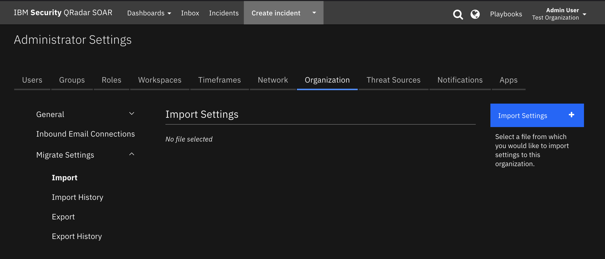

## Usage
Once the resource file is successfully imported, the workflows included in the file are ready for use.

### Example of QRadar Advisor Offense Analysis with MITRE
This workflow invokes two functions from two integration packages.
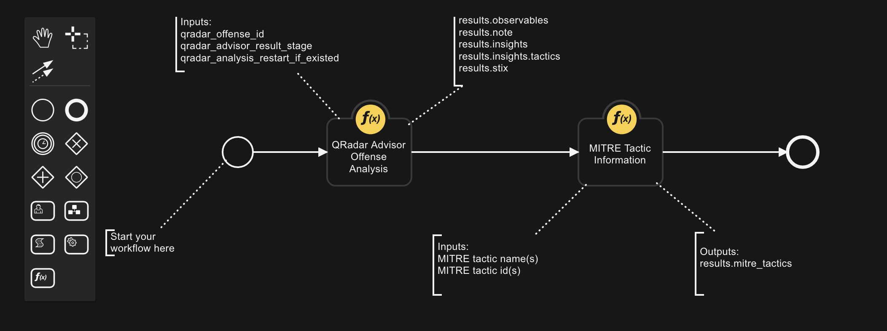
The "QRadar Advisor Offense Analysis" is a function from the QRadar Advisor integration, 
and "MITRE Tactic Information"
is a function from the MITRE integration. The data flow is shown below
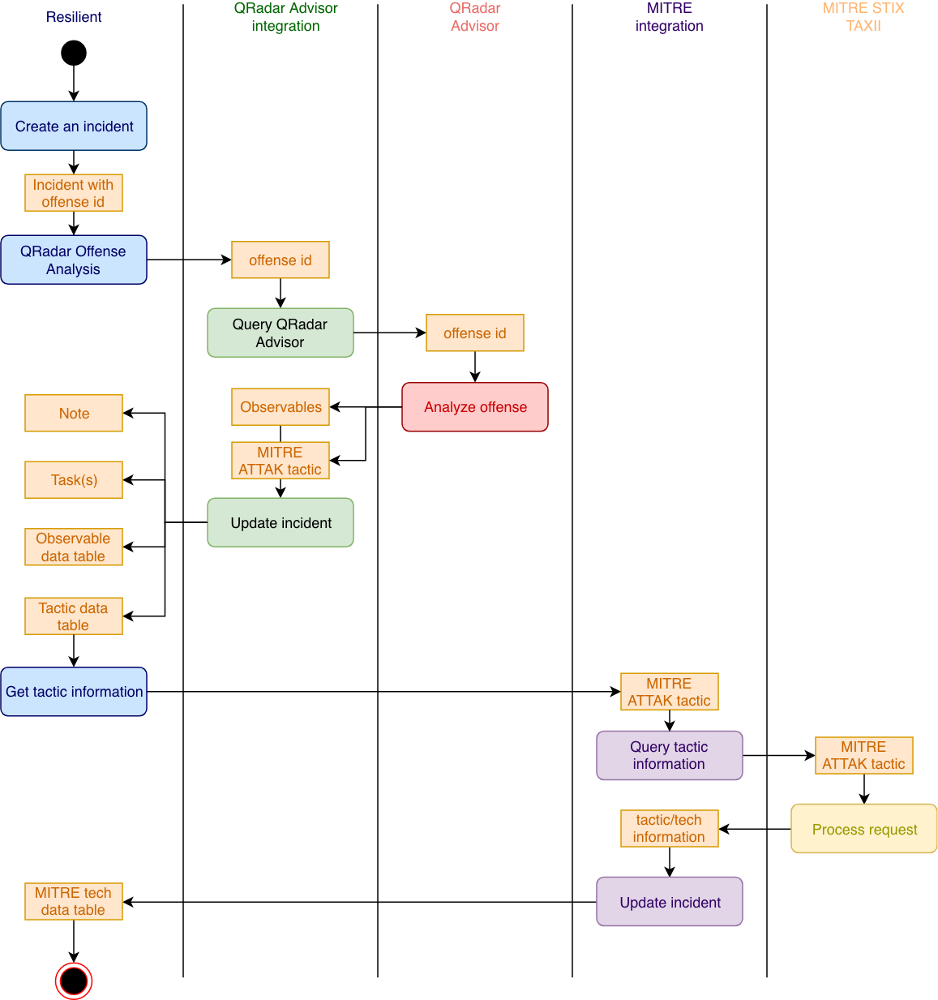
Here, a user starts from an incident with a QRadar offense id. In the following example, 
the incident is escalated from QRadar offense 23. 
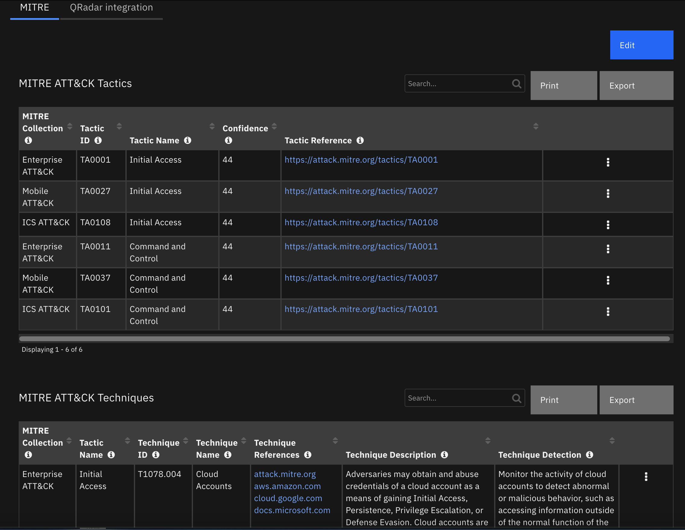
Note for convenience, a tab was created to hold all the related information here. To do analysis for the related offense, select 
Actions->"QRadar Advisor Offense Analysis with MITRE", to start this workflow. The first function, "QRadar 
Advisor Offense Analysis", is called to get 
the analysis and insights of the offense from QRadar Advisor. The insights contains MITRE ATT&CK 
tactic information, shown in the "MITRE ATT&CK of Incident" data table. In this example, 
QRadar Advisor returns a tactic called "Command and Control", together with a confidence value 
of 60 (over 100). 

With this information, the second function "MITRE Tactic Information" is called. This function 
retrieves the following information from the MITRE STIX TAXII server: 
- Tactic ID
- Reference link to tactic
- Techniques related to this tactic
The information is populated into the "MITRE ATT&CK Techniques" data table.
 
Note that from the "MITRE ATT&CK Techniques" data table, the user can easily create a task for 
a selected technique, by clicking a data table menu item.
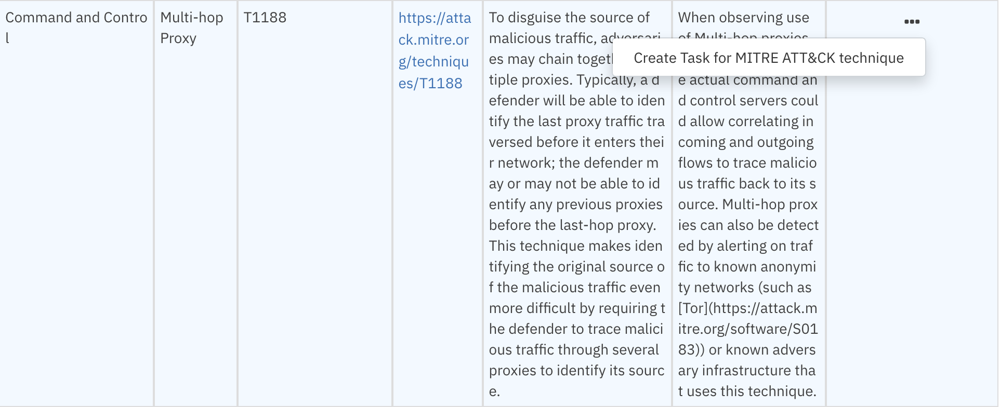
A new task is created with description, detection, and mitigation for the selected technique.
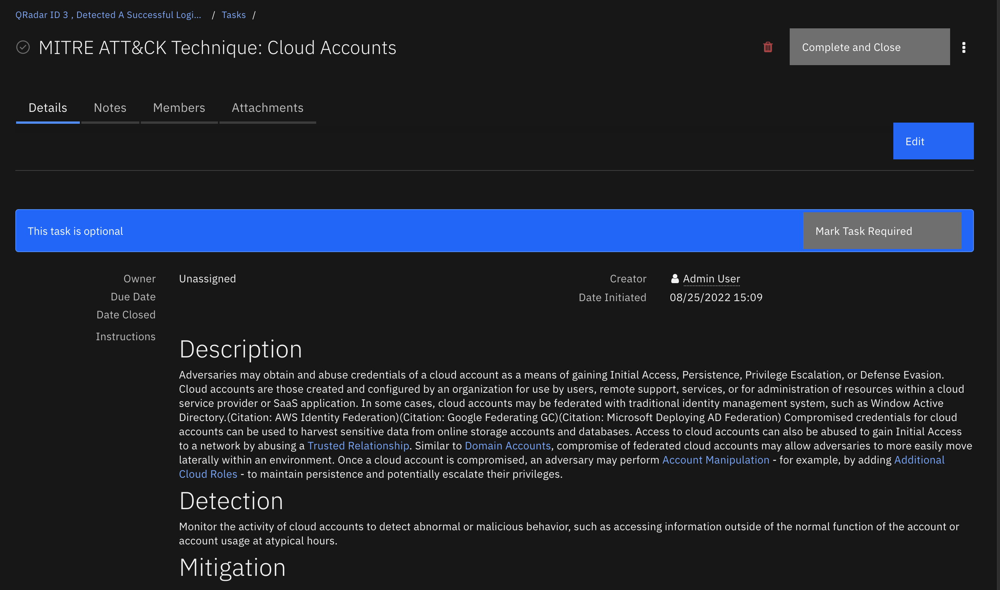

### Example of mapping QRadar rule to tactic 
This workflow also contains two functions.
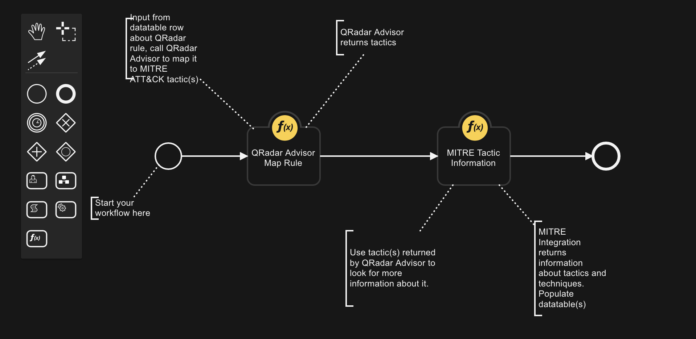
The "QRadar Advisor Map Rule" is a function from the QRadar Advisor integration, and the 
"MITRE Tactic Information" is a function from the MITRE integration.

This workflow can be used together with the "Example of finding all QRadar reference sets for artifact" 
workflow from the QRadar integration 2.0. These two workflows can make a complete use case.

This use case starts with an artifact. The dataflow is shown below. 
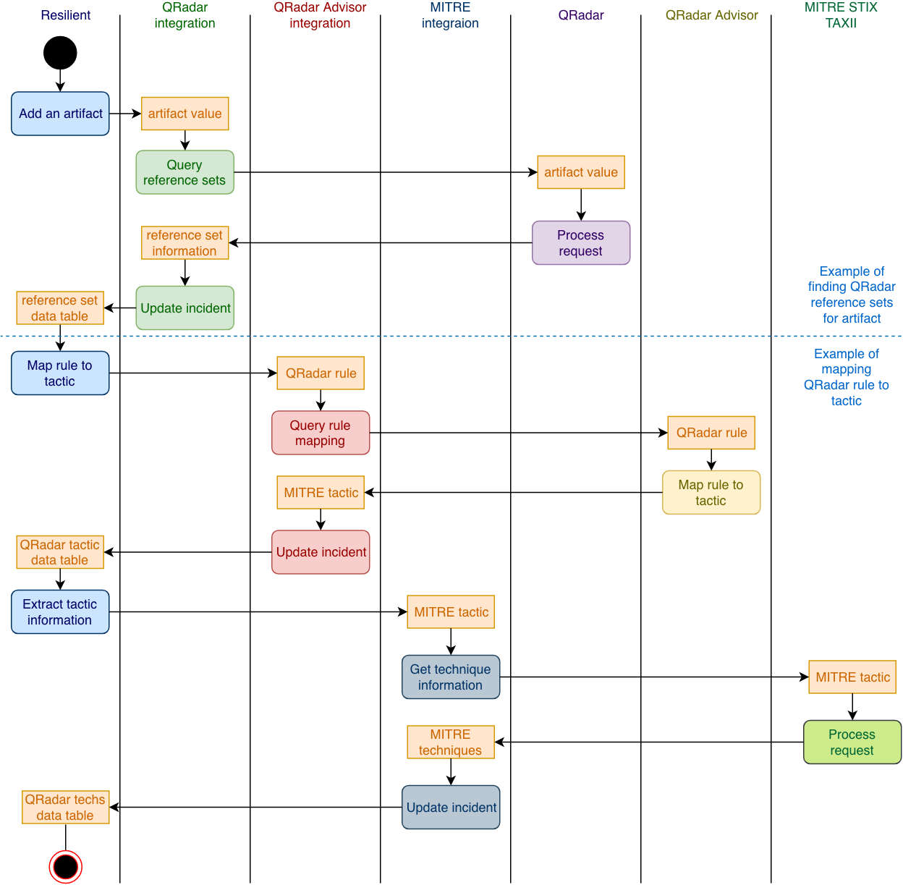

In this example, an IP address (192.168.0.155) was added to an incident as an
artifact. The user can then select the rule, "Find All QRadar Reference Sets". 
It is a rule included in QRadar integration 2.0.
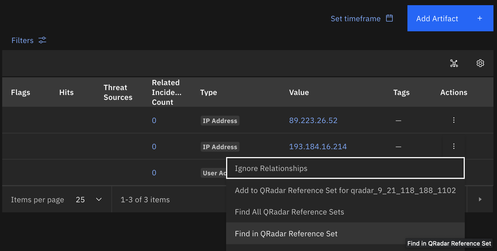
The result is shown in the "QRadar Reference Set" data table. Note that the "Source" column (if not empty)shows
the QRadar rule that added this IP into the reference set. In this example, a rule called "RF Risklist Source Log"
monitors source IPs that contact external malicious sites, and log the source IPs into a Reference Set called 
"RF Risklist Source". This IP address (192.168.0.155) is in that Reference Set.

Once the "QRadar Reference Set" data table is populated with data, user can select 
"Map rule to MITRE tactic".
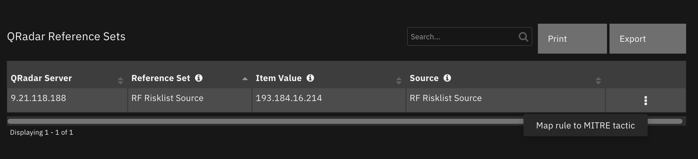
This manual item invokes the "Example of mapping QRadar rule to tactic" workflow of this package.

The workflow first call "QRadar Advisor Map Rule" function to map the rule to MITRE ATT&CK tactic. 
The result is shown in the "MITRE ATT&CK of Artifact" data table.
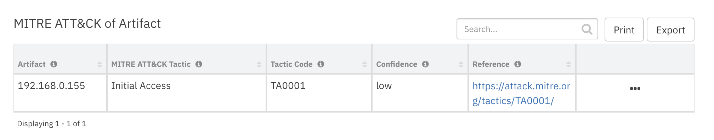
In this example, QRadar Advisor maps the rule "RF Risklist Source Log" into a MITRE ATT&CK
tactic called "Initial Access".

With this tactic information, the workflow makes a second call to the MITRE integration function,
"MITRE Tactic Information" to get all the MITRE ATT&CK techniques related to this tactic. Similar to the first workflow, technique
information is shown in the "MITRE ATT&CK Techniques" data table. From here, the user can create 
tasks for selected techniques.

## Uninstall
Manually delete the followings:
1. Rules
- "Map rule to MITRE tactic"
- "QRadar Advisor Offense Analysis with MITRE"
2. Data tables
- MITRE ATT&CK of Artifact
3. Workflows
- Example of QRadar Advisor Offense Analysis with MITRE
- Example of mapping QRadar rule to tactic 

