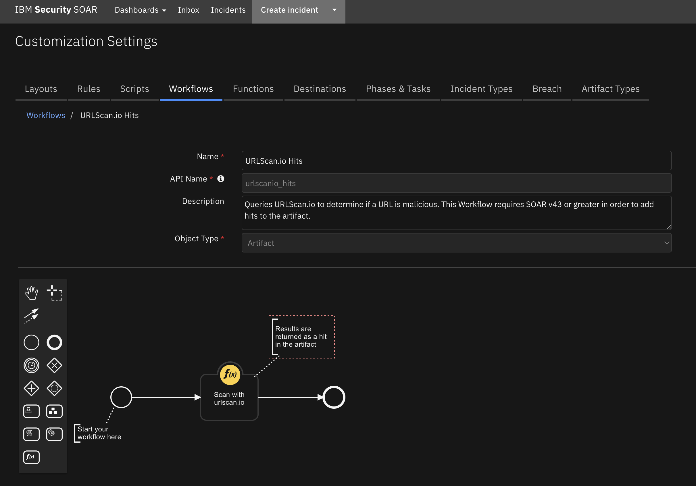
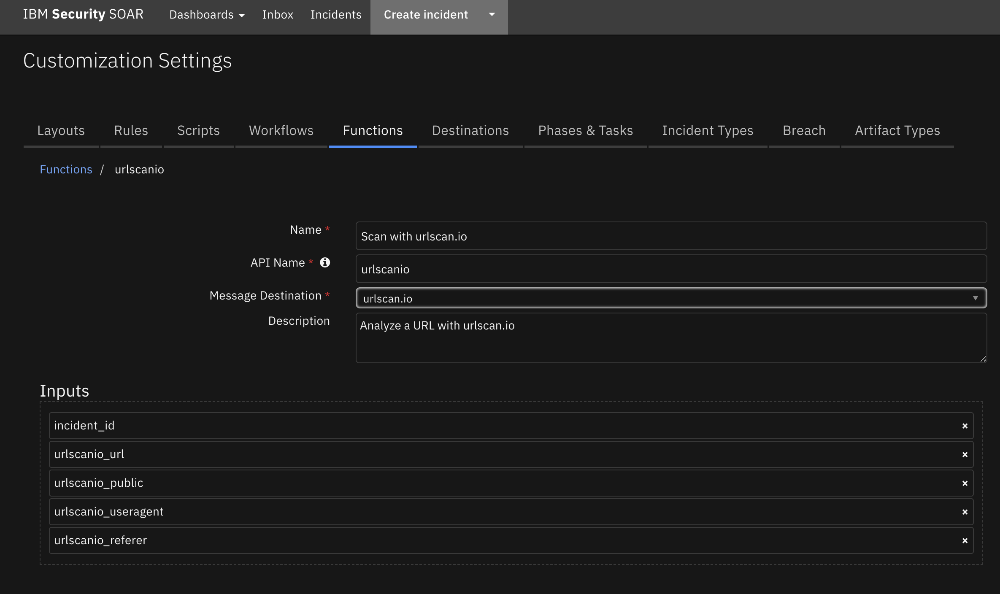

# SOAR Content Package for URLScan.io

## Description

This content package contains a single resource file with the following rule and workflow:

1. URLScan.io Hits (Rule)
- Automatic rule invoked by an artifact of type URL or URL Referer 
- Associated with the URLScan.io Workflow
2. URLScan.io Hits (Workflow)
- Queries URLScan.io to determine if a URL is malicious
- Uses the Function Scan with urlscan.io


## Package Dependences
The workflows in this package depend on the following
- SOAR Version 43
- fn_urlscan.io Version 1.1.5


## Import
Ensure that the above packages have been installed.
Download the res_urlscanio package and unzip it. 
In SOAR server, go to Administrator Settings->Organization->Migrate Settings->Import->Import Settings 
and select the `urlscanio.res` file downloaded above.

## Usage
Once the resource file is successfully imported, the workflows included in the file are ready for use.


### Example of URLScan.io Workflow with Hits
This workflow invokes the funciton from the fn_urlscanio integration packages.



## Function - Scan with urlscan.io
Analyze a URL with urlscan.io
 

<details><summary>Inputs:</summary>
<p>

| Name | Type | Required | Example | Tooltip |
| ---- | :--: | :------: | ------- | ------- |
| `incident_id` | `number` | Yes | - | the id of the incident |
| `urlscanio_url` | `text` | No | - | - |
| `urlscanio_public` | `boolean` | No | - | Should the scan be posted as public? |
| `urlscanio_useragent` | `text` | No | - | Override User-Agent for this scan |
| `urlscanio_referer` | `text` | No | - | Custom referer URL for this scan |


</p>
</details>

<details><summary>Outputs:</summary>
<p>

> **NOTE:** This example might be in JSON format, but `results` is a Python Dictionary on the SOAR platform.
```python
Result: {
  'png_base64content': "b'iVBORw0KGgoAAAANSUhEUgAABkAAAASwCAMAAACU33alAAAABGdBTUEAALGPC/xhBQAAAAFzUkdCAK7OHOkAAAMAUExURUNDQ2qoT+/v7/Pz82+o3EqG6AAAAP///+7u7v8AAE5OTktLS0hISFZWVnZ2dlhYWO3t7fHx8f/+/vz8/Pf390ZGRvT09EREREVFRVlZWfDw8Pv7+5+fn+vr683NzZSUlE1NTeLi4urq6vPy8pkAAImJif3+/icnJ3l5eWtra5KRkgoKClNTU3Kr3snJyW6n3GlqaSsrK5ycnPPt7fn6+RISEsLCwmFhYfj4+Q4ODouLi6KiomdnZ0lJSdXV1YMQEODg4Jqamt7e3s/PzgcHB1tbW/Pw8AMDA4CAgOzs7KysrF1dXVBQULW0tY+Pj3Nzc29vb66ursDAwPb29uXl5YODg42Njbi4uKqqqh4eHmNjY09PT2ml235+faXG59HR0V9fX8vLyxcXF25tbuTk5HFxcqWlpYFDQiIiIujo6Nzc3JeXl7e3t6ioqDU1NdfX13t7e1pYWIZBQfsCAtTU1ERBQTIyMjc3N4eHh8XFxS8vL7m5udbW1hsbG2mmT7Ozs1gyMkqE5P8EBMwAAGIqKrEAAI0ICLu7u80AAOUAAJUCAv4AAOQAAD8/P2usT1dhddra2tjY2FxnWDk5OXd3eObm5rq6usfHx7CwsGSlRzw8PL6+vrGxsWCjQfTp6Zs1Nf4QEP8dHYSEhEmI76+vr/8lJUCB6HGs4ftmZucPDaampmVlZWinTPfMzPtTU6wtKvjd3by8vP4vL/mamv1JSfxbW/mKivqoqExxpT1Wd9vo9vi6uvbV1Ts7O4y44vfDw1+g2VqDSa7OopO+gftubqTIlvmSkv0/P/13d5exwPmVlWmfznWx6P/29oK1bWGTwNrp1XWvXfyiol9rWlafMjF75+Df3Ory5lRvf/b59PuDg6fB81qMsUZkiu3z/ZGy8HWh7brVr2OaTEZ1wviwsDNMZPD27c/iyOPu31uQ6iI0RFhvTkaI8lFzQsXcvcXW97fN9dHf+ebt+2lOTUxhdmCNTLGup8skHm0iIp6akubl5pIFBbu3sNXT1rOxrYwJCWYP364AACAASURBVHja7J3tTxPLHseJJDNG5CoBKhw4YiXuapcQS1hwFUyBmgKicDg+UIhBViTFYuWFttBjc1/6ikQChBPxlbmv4JV/...",
  'png_url': 'https://urlscan.io/screenshots/799d84f0-3265-4b7e-b34e-4216409aca4c.png',
  'report_url': 'https://urlscan.io/api/v1/result/799d84f0-3265-4b7e-b34e-4216409aca4c/',
  'report': {
    'data': {
      'requests': [
        {
          'request': {
            'requestId': 'E0F67B258A2C9D926FC8282F5C2A8C39',
            'loaderId': 'E0F67B258A2C9D926FC8282F5C2A8C39',
            'documentURL': 'https://testsafebrowsing.appspot.com/s/phishing.html',
            'request': {
              'url': 'https://testsafebrowsing.appspot.com/s/phishing.html',
              'method': 'GET',
              'headers': {
                'Upgrade-Insecure-Requests': '1',
                'User-Agent': 'Mozilla/5.0 (Windows NT 10.0; Win64; x64) AppleWebKit/537.36 (KHTML, like Gecko) Chrome/101.0.4951.41 Safari/537.36',
                'accept-language': 'de-DE,de;q=0.9'
              },
              'mixedContentType': 'none',
              'initialPriority': 'VeryHigh',
              'referrerPolicy': 'strict-origin-when-cross-origin',
              'isSameSite': True
            },
            'timestamp': 1070258.97583,
            'wallTime': 1651691640.447689,
            'initiator': {
              'type': 'other'
            },
            'redirectHasExtraInfo': False,
            'type': 'Document',
            'frameId': '302FBEA868FDEFA5C8C1DA79B3F98E32',
            'hasUserGesture': False,
            'primaryRequest': True
          },
          'response': {
            'encodedDataLength': 785,
            'dataLength': 950,
            'requestId': 'E0F67B258A2C9D926FC8282F5C2A8C39',
            'type': 'Document',
            'response': {
              'url': 'https://testsafebrowsing.appspot.com/s/phishing.html',
              'status': 200,
              'statusText': '',
              'headers': {
                'age': '237',
                'alt-svc': 'h3=":443"; ma=2592000,h3-29=":443"; ma=2592000,h3-Q050=":443"; ma=2592000,h3-Q046=":443"; ma=2592000,h3-Q043=":443"; ma=2592000,quic=":443"; ma=2592000; v="46,43"',
                'cache-control': 'public, max-age=600',
                'content-encoding': 'gzip',
                'content-length': '474',
                'content-type': 'text/html',
                'date': 'Wed, 04 May 2022 19:10:03 GMT',
                'etag': '"8cmb0Q"',
                'expires': 'Wed, 04 May 2022 19:20:03 GMT',
                'server': 'Google Frontend',
                'x-cloud-trace-context': 'e9a5b16c2c36044270784bef3bf89a13'
              },
              'mimeType': 'text/html',
              'remoteIPAddress': '[2a00:1450:4001:809::2014]',
              'remotePort': 443,
              'encodedDataLength': 302,
              'timing': {
                'requestTime': 1070258.97645,
                'proxyStart': -1,
                'proxyEnd': -1,
                'dnsStart': 0.225,
                'dnsEnd': 22.015,
                'connectStart': 22.015,
                'connectEnd': 43.717,
                'sslStart': 27.921,
                'sslEnd': 43.712,
                'workerStart': -1,
                'workerReady': -1,
                'workerFetchStart': -1,
                'workerRespondWithSettled': -1,
                'sendStart': 43.804,
                'sendEnd': 43.858,
                'pushStart': 0,
                'pushEnd': 0,
                'receiveHeadersEnd': 52.069
              },
              'responseTime': 1651691640500.288,
              'protocol': 'h2',
              'securityState': 'secure',
              'securityDetails': {
                'protocol': 'TLS 1.3',
                'keyExchange': '',
                'keyExchangeGroup': 'X25519',
                'cipher': 'AES_128_GCM',
                'certificateId': 0,
                'subjectName': '*.appspot.com',
                'sanList': [
                  '*.appspot.com',
                  'appspot.com',
                  '*.de.r.appspot.com',
                  '*.df.r.appspot.com',
                  '*.an.r.appspot.com',
                  '*.dt.r.appspot.com',
                  '*.du.r.appspot.com',
                  '*.el.r.appspot.com',
                  '*.as.r.appspot.com',
                  '*.et.r.appspot.com',
                  '*.ts.r.appspot.com',
                  '*.lz.r.appspot.com',
                  '*.ew.r.appspot.com',
                  '*.nw.r.appspot.com',
                  '*.ey.r.appspot.com',
                  '*.ez.r.appspot.com',
                  '*.nz.r.appspot.com',
                  '*.oa.r.appspot.com',
                  '*.nn.r.appspot.com',
                  '*.rj.r.appspot.com',
                  '*.uc.r.appspot.com',
                  '*.tz.r.appspot.com',
                  '*.ue.r.appspot.com',
                  '*.uk.r.appspot.com',
                  '*.uw.r.appspot.com',
                  '*.wl.r.appspot.com',
                  '*.wm.r.appspot.com',
                  '*.wn.r.appspot.com',
                  '*.lm.r.appspot.com',
                  '*.em.r.appspot.com',
                  '*.km.r.appspot.com',
                  '*.pd.r.appspot.com',
                  '*.ui.r.appspot.com',
                  'thinkwithgoogle.com',
                  '*.thinkwithgoogle.com',
                  'thinkwithgoogle.goog',
                  '*.thinkwithgoogle.goog',
                  'withgoogle.com',
                  '*.withgoogle.com',
                  'api.projectshield.withgoogle.com',
                  'withyoutube.com',
                  '*.withyoutube.com',
                  'app.google',
                  '*.app.google'
                ],
                'issuer': 'GTS CA 1C3',
                'validFrom': 1649664993,
                'validTo': 1656922592,
                'signedCertificateTimestampList': [
                  
                ],
                'certificateTransparencyCompliance': 'unknown'
              }
            },
            'hasExtraInfo': True,
            'hash': '41b42b9c2dc99253ea8de9509413cc634de748bae8e5b2ad3080db58991d0971',
            'size': 950,
            'asn': {
              'ip': '2a00:1450:4001:809::2014',
              'asn': '15169',
              'country': 'US',
              'registrar': 'arin',
              'date': '2000-03-30',
              'description': 'GOOGLE, US',
              'route': '2a00:1450:4001::/48',
              'name': 'GOOGLE'
            },
            'geoip': {
              'country': 'DE',
              'region': 'HE',
              'timezone': 'Europe/Berlin',
              'city': 'Frankfurt am Main',
              'll': [
                50.1188,
                8.6843
              ],
              'country_name': 'Germany',
              'metro': 0
            }
          }
        },
        {
          'request': {
            'requestId': '3340.2',
            'loaderId': 'E0F67B258A2C9D926FC8282F5C2A8C39',
            'documentURL': 'https://testsafebrowsing.appspot.com/s/phishing.html',
            'request': {
              'url': 'https://testsafebrowsing.appspot.com/s/social-engineering-ad1.png?&/adservices.',
              'method': 'GET',
              'headers': {
                'accept-language': 'de-DE,de;q=0.9',
                'Referer': 'https://testsafebrowsing.appspot.com/s/phishing.html',
                'User-Agent': 'Mozilla/5.0 (Windows NT 10.0; Win64; x64) AppleWebKit/537.36 (KHTML, like Gecko) Chrome/101.0.4951.41 Safari/537.36'
              },
              'mixedContentType': 'none',
              'initialPriority': 'Low',
              'referrerPolicy': 'strict-origin-when-cross-origin',
              'isSameSite': True
            },
            'timestamp': 1070259.046258,
            'wallTime': 1651691640.518149,
            'initiator': {
              'type': 'parser',
              'url': 'https://testsafebrowsing.appspot.com/s/phishing.html',
              'lineNumber': 9,
              'columnNumber': 56
            },
            'redirectHasExtraInfo': False,
            'type': 'Image',
            'frameId': '302FBEA868FDEFA5C8C1DA79B3F98E32',
            'hasUserGesture': False
          },
          'response': {
            'encodedDataLength': 20888,
            'dataLength': 20761,
            'requestId': '3340.2',
            'type': 'Image',
            'response': {
              'url': 'https://testsafebrowsing.appspot.com/s/social-engineering-ad1.png?&/adservices.',
              'status': 200,
              'statusText': '',
              'headers': {
                'date': 'Wed, 04 May 2022 19:05:50 GMT',
                'server': 'Google Frontend',
                'age': '490',
                'etag': '"8cmb0Q"',
                'content-type': 'image/png',
                'x-cloud-trace-context': 'c57b14f911e20ef253dd822c05443f52',
                'cache-control': 'public, max-age=600',
                'alt-svc': 'h3=":443"; ma=2592000,h3-29=":443"; ma=2592000,h3-Q050=":443"; ma=2592000,h3-Q046=":443"; ma=2592000,h3-Q043=":443"; ma=2592000,quic=":443"; ma=2592000; v="46,43"',
                'content-length': '20761',
                'expires': 'Wed, 04 May 2022 19:15:50 GMT'
              },
              'mimeType': 'image/png',
              'remoteIPAddress': '[2a00:1450:4001:809::2014]',
              'remotePort': 443,
              'encodedDataLength': 109,
              'timing': {
                'requestTime': 1070259.046557,
                'proxyStart': -1,
                'proxyEnd': -1,
                'dnsStart': -1,
                'dnsEnd': -1,
                'connectStart': -1,
                'connectEnd': -1,
                'sslStart': -1,
                'sslEnd': -1,
                'workerStart': -1,
                'workerReady': -1,
                'workerFetchStart': -1,
                'workerRespondWithSettled': -1,
                'sendStart': 0.648,
                'sendEnd': 0.912,
                'pushStart': 0,
                'pushEnd': 0,
                'receiveHeadersEnd': 8.506
              },
              'responseTime': 1651691640526.833,
              'protocol': 'h2',
              'securityState': 'secure',
              'securityDetails': {
                'protocol': 'TLS 1.3',
                'keyExchange': '',
                'keyExchangeGroup': 'X25519',
                'cipher': 'AES_128_GCM',
                'certificateId': 0,
                'subjectName': '*.appspot.com',
                'sanList': [
                  '*.appspot.com',
                  'appspot.com',
                  '*.de.r.appspot.com',
                  '*.df.r.appspot.com',
                  '*.an.r.appspot.com',
                  '*.dt.r.appspot.com',
                  '*.du.r.appspot.com',
                  '*.el.r.appspot.com',
                  '*.as.r.appspot.com',
                  '*.et.r.appspot.com',
                  '*.ts.r.appspot.com',
                  '*.lz.r.appspot.com',
                  '*.ew.r.appspot.com',
                  '*.nw.r.appspot.com',
                  '*.ey.r.appspot.com',
                  '*.ez.r.appspot.com',
                  '*.nz.r.appspot.com',
                  '*.oa.r.appspot.com',
                  '*.nn.r.appspot.com',
                  '*.rj.r.appspot.com',
                  '*.uc.r.appspot.com',
                  '*.tz.r.appspot.com',
                  '*.ue.r.appspot.com',
                  '*.uk.r.appspot.com',
                  '*.uw.r.appspot.com',
                  '*.wl.r.appspot.com',
                  '*.wm.r.appspot.com',
                  '*.wn.r.appspot.com',
                  '*.lm.r.appspot.com',
                  '*.em.r.appspot.com',
                  '*.km.r.appspot.com',
                  '*.pd.r.appspot.com',
                  '*.ui.r.appspot.com',
                  'thinkwithgoogle.com',
                  '*.thinkwithgoogle.com',
                  'thinkwithgoogle.goog',
                  '*.thinkwithgoogle.goog',
                  'withgoogle.com',
                  '*.withgoogle.com',
                  'api.projectshield.withgoogle.com',
                  'withyoutube.com',
                  '*.withyoutube.com',
                  'app.google',
                  '*.app.google'
                ],
                'issuer': 'GTS CA 1C3',
                'validFrom': 1649664993,
                'validTo': 1656922592,
                'signedCertificateTimestampList': [
                  
                ],
                'certificateTransparencyCompliance': 'unknown'
              }
            },
            'hasExtraInfo': True,
            'hash': 'f70c369a77320d54c042f0c632ee29c69c1f11899c4d5fe20b4cfaeda89d21ac',
            'size': 27684,
            'asn': {
              'ip': '2a00:1450:4001:809::2014',
              'asn': '15169',
              'country': 'US',
              'registrar': 'arin',
              'date': '2000-03-30',
              'description': 'GOOGLE, US',
              'route': '2a00:1450:4001::/48',
              'name': 'GOOGLE'
            },
            'geoip': {
              'country': 'DE',
              'region': 'HE',
              'timezone': 'Europe/Berlin',
              'city': 'Frankfurt am Main',
              'll': [
                50.1188,
                8.6843
              ],
              'country_name': 'Germany',
              'metro': 0
            }
          },
          'initiatorInfo': {
            'url': 'https://testsafebrowsing.appspot.com/s/phishing.html',
            'host': 'testsafebrowsing.appspot.com',
            'type': 'parser'
          }
        },
        {
          'request': {
            'requestId': '3340.3',
            'loaderId': 'E0F67B258A2C9D926FC8282F5C2A8C39',
            'documentURL': 'https://testsafebrowsing.appspot.com/s/phishing.html',
            'request': {
              'url': 'https://testsafebrowsing.appspot.com/s/social-engineering-ad2.png?&/adservices.',
              'method': 'GET',
              'headers': {
                'accept-language': 'de-DE,de;q=0.9',
                'Referer': 'https://testsafebrowsing.appspot.com/s/phishing.html',
                'User-Agent': 'Mozilla/5.0 (Windows NT 10.0; Win64; x64) AppleWebKit/537.36 (KHTML, like Gecko) Chrome/101.0.4951.41 Safari/537.36'
              },
              'mixedContentType': 'none',
              'initialPriority': 'Low',
              'referrerPolicy': 'strict-origin-when-cross-origin',
              'isSameSite': True
            },
            'timestamp': 1070259.046452,
            'wallTime': 1651691640.518317,
            'initiator': {
              'type': 'parser',
              'url': 'https://testsafebrowsing.appspot.com/s/phishing.html',
              'lineNumber': 11,
              'columnNumber': 56
            },
            'redirectHasExtraInfo': False,
            'type': 'Image',
            'frameId': '302FBEA868FDEFA5C8C1DA79B3F98E32',
            'hasUserGesture': False
          },
          'response': {
            'encodedDataLength': 50246,
            'dataLength': 50136,
            'requestId': '3340.3',
            'type': 'Image',
            'response': {
              'url': 'https://testsafebrowsing.appspot.com/s/social-engineering-ad2.png?&/adservices.',
              'status': 200,
              'statusText': '',
              'headers': {
                'date': 'Wed, 04 May 2022 19:05:50 GMT',
                'server': 'Google Frontend',
                'age': '490',
                'etag': '"8cmb0Q"',
                'content-type': 'image/png',
                'x-cloud-trace-context': 'ef8a52755cab287bdc95ade169daffb3',
                'cache-control': 'public, max-age=600',
                'alt-svc': 'h3=":443"; ma=2592000,h3-29=":443"; ma=2592000,h3-Q050=":443"; ma=2592000,h3-Q046=":443"; ma=2592000,h3-Q043=":443"; ma=2592000,quic=":443"; ma=2592000; v="46,43"',
                'content-length': '50136',
                'expires': 'Wed, 04 May 2022 19:15:50 GMT'
              },
              'mimeType': 'image/png',
              'remoteIPAddress': '[2a00:1450:4001:809::2014]',
              'remotePort': 443,
              'encodedDataLength': 74,
              'timing': {
                'requestTime': 1070259.047135,
                'proxyStart': -1,
                'proxyEnd': -1,
                'dnsStart': -1,
                'dnsEnd': -1,
                'connectStart': -1,
                'connectEnd': -1,
                'sslStart': -1,
                'sslEnd': -1,
                'workerStart': -1,
                'workerReady': -1,
                'workerFetchStart': -1,
                'workerRespondWithSettled': -1,
                'sendStart': 0.29,
                'sendEnd': 0.382,
                'pushStart': 0,
                'pushEnd': 0,
                'receiveHeadersEnd': 10.663
              },
              'responseTime': 1651691640529.581,
              'protocol': 'h2',
              'securityState': 'secure',
              'securityDetails': {
                'protocol': 'TLS 1.3',
                'keyExchange': '',
                'keyExchangeGroup': 'X25519',
                'cipher': 'AES_128_GCM',
                'certificateId': 0,
                'subjectName': '*.appspot.com',
                'sanList': [
                  '*.appspot.com',
                  'appspot.com',
                  '*.de.r.appspot.com',
                  '*.df.r.appspot.com',
                  '*.an.r.appspot.com',
                  '*.dt.r.appspot.com',
                  '*.du.r.appspot.com',
                  '*.el.r.appspot.com',
                  '*.as.r.appspot.com',
                  '*.et.r.appspot.com',
                  '*.ts.r.appspot.com',
                  '*.lz.r.appspot.com',
                  '*.ew.r.appspot.com',
                  '*.nw.r.appspot.com',
                  '*.ey.r.appspot.com',
                  '*.ez.r.appspot.com',
                  '*.nz.r.appspot.com',
                  '*.oa.r.appspot.com',
                  '*.nn.r.appspot.com',
                  '*.rj.r.appspot.com',
                  '*.uc.r.appspot.com',
                  '*.tz.r.appspot.com',
                  '*.ue.r.appspot.com',
                  '*.uk.r.appspot.com',
                  '*.uw.r.appspot.com',
                  '*.wl.r.appspot.com',
                  '*.wm.r.appspot.com',
                  '*.wn.r.appspot.com',
                  '*.lm.r.appspot.com',
                  '*.em.r.appspot.com',
                  '*.km.r.appspot.com',
                  '*.pd.r.appspot.com',
                  '*.ui.r.appspot.com',
                  'thinkwithgoogle.com',
                  '*.thinkwithgoogle.com',
                  'thinkwithgoogle.goog',
                  '*.thinkwithgoogle.goog',
                  'withgoogle.com',
                  '*.withgoogle.com',
                  'api.projectshield.withgoogle.com',
                  'withyoutube.com',
                  '*.withyoutube.com',
                  'app.google',
                  '*.app.google'
                ],
                'issuer': 'GTS CA 1C3',
                'validFrom': 1649664993,
                'validTo': 1656922592,
                'signedCertificateTimestampList': [
                  
                ],
                'certificateTransparencyCompliance': 'unknown'
              }
            },
            'hasExtraInfo': True,
            'hash': '825c234b510213d77f2a0b84b690ec541ea7e30178b28274f2231880d21e7fef',
            'size': 66848,
            'asn': {
              'ip': '2a00:1450:4001:809::2014',
              'asn': '15169',
              'country': 'US',
              'registrar': 'arin',
              'date': '2000-03-30',
              'description': 'GOOGLE, US',
              'route': '2a00:1450:4001::/48',
              'name': 'GOOGLE'
            },
            'geoip': {
              'country': 'DE',
              'region': 'HE',
              'timezone': 'Europe/Berlin',
              'city': 'Frankfurt am Main',
              'll': [
                50.1188,
                8.6843
              ],
              'country_name': 'Germany',
              'metro': 0
            }
          },
          'initiatorInfo': {
            'url': 'https://testsafebrowsing.appspot.com/s/phishing.html',
            'host': 'testsafebrowsing.appspot.com',
            'type': 'parser'
          }
        },
        {
          'request': {
            'requestId': '3340.4',
            'loaderId': 'E0F67B258A2C9D926FC8282F5C2A8C39',
            'documentURL': 'https://testsafebrowsing.appspot.com/s/phishing.html',
            'request': {
              'url': 'https://testsafebrowsing.appspot.com/s/social-engineering-ad3.png?&/adservices.',
              'method': 'GET',
              'headers': {
                'accept-language': 'de-DE,de;q=0.9',
                'Referer': 'https://testsafebrowsing.appspot.com/s/phishing.html',
                'User-Agent': 'Mozilla/5.0 (Windows NT 10.0; Win64; x64) AppleWebKit/537.36 (KHTML, like Gecko) Chrome/101.0.4951.41 Safari/537.36'
              },
              'mixedContentType': 'none',
              'initialPriority': 'Low',
              'referrerPolicy': 'strict-origin-when-cross-origin',
              'isSameSite': True
            },
            'timestamp': 1070259.046564,
            'wallTime': 1651691640.51843,
            'initiator': {
              'type': 'parser',
              'url': 'https://testsafebrowsing.appspot.com/s/phishing.html',
              'lineNumber': 13,
              'columnNumber': 56
            },
            'redirectHasExtraInfo': False,
            'type': 'Image',
            'frameId': '302FBEA868FDEFA5C8C1DA79B3F98E32',
            'hasUserGesture': False
          },
          'response': {
            'encodedDataLength': 6776,
            'dataLength': 6719,
            'requestId': '3340.4',
            'type': 'Image',
            'response': {
              'url': 'https://testsafebrowsing.appspot.com/s/social-engineering-ad3.png?&/adservices.',
              'status': 200,
              'statusText': '',
              'headers': {
                'date': 'Wed, 04 May 2022 19:05:50 GMT',
                'server': 'Google Frontend',
                'age': '490',
                'etag': '"8cmb0Q"',
                'content-type': 'image/png',
                'x-cloud-trace-context': 'c57b14f911e20ef253dd822c05443f52',
                'cache-control': 'public, max-age=600',
                'alt-svc': 'h3=":443"; ma=2592000,h3-29=":443"; ma=2592000,h3-Q050=":443"; ma=2592000,h3-Q046=":443"; ma=2592000,h3-Q043=":443"; ma=2592000,quic=":443"; ma=2592000; v="46,43"',
                'content-length': '6719',
                'expires': 'Wed, 04 May 2022 19:15:50 GMT'
              },
              'mimeType': 'image/png',
              'remoteIPAddress': '[2a00:1450:4001:809::2014]',
              'remotePort': 443,
              'encodedDataLength': 48,
              'timing': {
                'requestTime': 1070259.047342,
                'proxyStart': -1,
                'proxyEnd': -1,
                'dnsStart': -1,
                'dnsEnd': -1,
                'connectStart': -1,
                'connectEnd': -1,
                'sslStart': -1,
                'sslEnd': -1,
                'workerStart': -1,
                'workerReady': -1,
                'workerFetchStart': -1,
                'workerRespondWithSettled': -1,
                'sendStart': 0.157,
                'sendEnd': 0.191,
                'pushStart': 0,
                'pushEnd': 0,
                'receiveHeadersEnd': 17.052
              },
              'responseTime': 1651691640536.175,
              'protocol': 'h2',
              'securityState': 'secure',
              'securityDetails': {
                'protocol': 'TLS 1.3',
                'keyExchange': '',
                'keyExchangeGroup': 'X25519',
                'cipher': 'AES_128_GCM',
                'certificateId': 0,
                'subjectName': '*.appspot.com',
                'sanList': [
                  '*.appspot.com',
                  'appspot.com',
                  '*.de.r.appspot.com',
                  '*.df.r.appspot.com',
                  '*.an.r.appspot.com',
                  '*.dt.r.appspot.com',
                  '*.du.r.appspot.com',
                  '*.el.r.appspot.com',
                  '*.as.r.appspot.com',
                  '*.et.r.appspot.com',
                  '*.ts.r.appspot.com',
                  '*.lz.r.appspot.com',
                  '*.ew.r.appspot.com',
                  '*.nw.r.appspot.com',
                  '*.ey.r.appspot.com',
                  '*.ez.r.appspot.com',
                  '*.nz.r.appspot.com',
                  '*.oa.r.appspot.com',
                  '*.nn.r.appspot.com',
                  '*.rj.r.appspot.com',
                  '*.uc.r.appspot.com',
                  '*.tz.r.appspot.com',
                  '*.ue.r.appspot.com',
                  '*.uk.r.appspot.com',
                  '*.uw.r.appspot.com',
                  '*.wl.r.appspot.com',
                  '*.wm.r.appspot.com',
                  '*.wn.r.appspot.com',
                  '*.lm.r.appspot.com',
                  '*.em.r.appspot.com',
                  '*.km.r.appspot.com',
                  '*.pd.r.appspot.com',
                  '*.ui.r.appspot.com',
                  'thinkwithgoogle.com',
                  '*.thinkwithgoogle.com',
                  'thinkwithgoogle.goog',
                  '*.thinkwithgoogle.goog',
                  'withgoogle.com',
                  '*.withgoogle.com',
                  'api.projectshield.withgoogle.com',
                  'withyoutube.com',
                  '*.withyoutube.com',
                  'app.google',
                  '*.app.google'
                ],
                'issuer': 'GTS CA 1C3',
                'validFrom': 1649664993,
                'validTo': 1656922592,
                'signedCertificateTimestampList': [
                  
                ],
                'certificateTransparencyCompliance': 'unknown'
              }
            },
            'hasExtraInfo': True,
            'hash': '01f490cbdc7f84ccd0fc6ade0a645910152e8053d67a49402fd789c9146ca2a2',
            'size': 8960,
            'asn': {
              'ip': '2a00:1450:4001:809::2014',
              'asn': '15169',
              'country': 'US',
              'registrar': 'arin',
              'date': '2000-03-30',
              'description': 'GOOGLE, US',
              'route': '2a00:1450:4001::/48',
              'name': 'GOOGLE'
            },
            'geoip': {
              'country': 'DE',
              'region': 'HE',
              'timezone': 'Europe/Berlin',
              'city': 'Frankfurt am Main',
              'll': [
                50.1188,
                8.6843
              ],
              'country_name': 'Germany',
              'metro': 0
            }
          },
          'initiatorInfo': {
            'url': 'https://testsafebrowsing.appspot.com/s/phishing.html',
            'host': 'testsafebrowsing.appspot.com',
            'type': 'parser'
          }
        }
      ],
      'cookies': [
        
      ],
      'console': [
        
      ],
      'links': [
        
      ],
      'timing': {
        'beginNavigation': '2022-05-04T19:14:00.445Z',
        'frameStartedLoading': '2022-05-04T19:14:00.502Z',
        'frameNavigated': '2022-05-04T19:14:00.517Z',
        'domContentEventFired': '2022-05-04T19:14:00.521Z',
        'frameStoppedLoading': '2022-05-04T19:14:00.539Z'
      },
      'globals': [
        {
          'prop': 'oncontextlost',
          'type': 'object'
        },
        {
          'prop': 'oncontextrestored',
          'type': 'object'
        },
        {
          'prop': 'structuredClone',
          'type': 'function'
        },
        {
          'prop': 'getScreenDetails',
          'type': 'function'
        }
      ]
    },
    'stats': {
      'resourceStats': [
        {
          'count': 3,
          'size': 77616,
          'encodedSize': 77910,
          'latency': 0,
          'countries': [
            'DE'
          ],
          'ips': [
            '[2a00:1450:4001:809::2014]'
          ],
          'type': 'Image',
          'compression': '1.0',
          'percentage': 75
        },
        {
          'count': 1,
          'size': 950,
          'encodedSize': 785,
          'latency': 0,
          'countries': [
            'DE'
          ],
          'ips': [
            '[2a00:1450:4001:809::2014]'
          ],
          'type': 'Document',
          'compression': '1.2',
          'percentage': 25
        }
      ],
      'protocolStats': [
        {
          'count': 4,
          'size': 78566,
          'encodedSize': 78695,
          'ips': [
            '[2a00:1450:4001:809::2014]'
          ],
          'countries': [
            'DE'
          ],
          'securityState': {
            
          },
          'protocol': 'h2'
        }
      ],
      'tlsStats': [
        {
          'count': 4,
          'size': 78566,
          'encodedSize': 78695,
          'ips': [
            '[2a00:1450:4001:809::2014]'
          ],
          'countries': [
            'DE'
          ],
          'protocols': {
            'TLS 1.3 /  / AES_128_GCM': 4
          },
          'securityState': 'secure'
        }
      ],
      'serverStats': [
        {
          'count': 4,
          'size': 78566,
          'encodedSize': 78695,
          'ips': [
            '[2a00:1450:4001:809::2014]'
          ],
          'countries': [
            'DE'
          ],
          'server': 'Google Frontend'
        }
      ],
      'domainStats': [
        {
          'count': 4,
          'ips': [
            '2a00:1450:4001:809::2014',
            '[2a00:1450:4001:809::2014]'
          ],
          'domain': 'testsafebrowsing.appspot.com',
          'size': 78566,
          'encodedSize': 78695,
          'countries': [
            'DE'
          ],
          'index': 0,
          'initiators': [
            'testsafebrowsing.appspot.com'
          ],
          'redirects': 0
        }
      ],
      'regDomainStats': [
        {
          'count': 4,
          'ips': [
            '2a00:1450:4001:809::2014',
            '[2a00:1450:4001:809::2014]'
          ],
          'regDomain': 'testsafebrowsing.appspot.com',
          'size': 78566,
          'encodedSize': 78695,
          'countries': [
            
          ],
          'index': 0,
          'subDomains': [
            {
              'domain': '',
              'country': 'DE'
            }
          ],
          'redirects': 0
        }
      ],
      'secureRequests': 4,
      'securePercentage': 100,
      'IPv6Percentage': 100,
      'uniqCountries': 1,
      'totalLinks': 0,
      'malicious': 0,
      'adBlocked': 0,
      'ipStats': [
        {
          'requests': 4,
          'domains': [
            'testsafebrowsing.appspot.com'
          ],
          'ip': '2a00:1450:4001:809::2014',
          'asn': {
            'ip': '2a00:1450:4001:809::2014',
            'asn': '15169',
            'country': 'US',
            'registrar': 'arin',
            'date': '2000-03-30',
            'description': 'GOOGLE, US',
            'route': '2a00:1450:4001::/48',
            'name': 'GOOGLE'
          },
          'dns': {
            
          },
          'geoip': {
            'country': 'DE',
            'region': 'HE',
            'timezone': 'Europe/Berlin',
            'city': 'Frankfurt am Main',
            'll': [
              50.1188,
              8.6843
            ],
            'country_name': 'Germany',
            'metro': 0
          },
          'size': 78566,
          'encodedSize': 78695,
          'countries': [
            'DE'
          ],
          'index': 0,
          'ipv6': True,
          'redirects': 0,
          'count': None
        }
      ]
    },
    'meta': {
      'processors': {
        'umbrella': {
          'data': [
            {
              'hostname': 'testsafebrowsing.appspot.com',
              'rank': 560569
            }
          ]
        },
        'geoip': {
          'data': [
            {
              'ip': '2a00:1450:4001:809::2014',
              'geoip': {
                'country': 'DE',
                'region': 'HE',
                'timezone': 'Europe/Berlin',
                'city': 'Frankfurt am Main',
                'll': [
                  50.1188,
                  8.6843
                ],
                'country_name': 'Germany',
                'metro': 0
              }
            }
          ]
        },
        'rdns': {
          'data': [
            
          ]
        },
        'asn': {
          'data': [
            {
              'ip': '2a00:1450:4001:809::2014',
              'asn': '15169',
              'country': 'US',
              'registrar': 'arin',
              'date': '2000-03-30',
              'description': 'GOOGLE, US',
              'route': '2a00:1450:4001::/48',
              'name': 'GOOGLE'
            }
          ]
        },
        'wappa': {
          'data': [
            
          ]
        }
      }
    },
    'task': {
      'uuid': '799d84f0-3265-4b7e-b34e-4216409aca4c',
      'time': '2022-05-04T19:14:00.367Z',
      'url': 'https://testsafebrowsing.appspot.com/s/phishing.html',
      'visibility': 'private',
      'method': 'api',
      'source': 'd2b788a6',
      'tags': [
        
      ],
      'reportURL': 'https://urlscan.io/result/799d84f0-3265-4b7e-b34e-4216409aca4c/',
      'screenshotURL': 'https://urlscan.io/screenshots/799d84f0-3265-4b7e-b34e-4216409aca4c.png',
      'domURL': 'https://urlscan.io/dom/799d84f0-3265-4b7e-b34e-4216409aca4c/'
    },
    'page': {
      'url': 'https://testsafebrowsing.appspot.com/s/phishing.html',
      'domain': 'testsafebrowsing.appspot.com',
      'country': 'DE',
      'city': 'Frankfurt am Main',
      'server': 'Google Frontend',
      'ip': '2a00:1450:4001:809::2014',
      'asn': 'AS15169',
      'asnname': 'GOOGLE, US'
    },
    'lists': {
      'ips': [
        '2a00:1450:4001:809::2014'
      ],
      'countries': [
        'DE'
      ],
      'asns': [
        '15169'
      ],
      'domains': [
        'testsafebrowsing.appspot.com'
      ],
      'servers': [
        'Google Frontend'
      ],
      'urls': [
        'https://testsafebrowsing.appspot.com/s/phishing.html',
        'https://testsafebrowsing.appspot.com/s/social-engineering-ad1.png?&/adservices.',
        'https://testsafebrowsing.appspot.com/s/social-engineering-ad2.png?&/adservices.',
        'https://testsafebrowsing.appspot.com/s/social-engineering-ad3.png?&/adservices.'
      ],
      'linkDomains': [
        
      ],
      'certificates': [
        {
          'subjectName': '*.appspot.com',
          'issuer': 'GTS CA 1C3',
          'validFrom': 1649664993,
          'validTo': 1656922592
        }
      ],
      'hashes': [
        '41b42b9c2dc99253ea8de9509413cc634de748bae8e5b2ad3080db58991d0971',
        'f70c369a77320d54c042f0c632ee29c69c1f11899c4d5fe20b4cfaeda89d21ac',
        '825c234b510213d77f2a0b84b690ec541ea7e30178b28274f2231880d21e7fef',
        '01f490cbdc7f84ccd0fc6ade0a645910152e8053d67a49402fd789c9146ca2a2'
      ]
    },
    'verdicts': {
      'overall': {
        'score': 100,
        'categories': [
          'phishing'
        ],
        'brands': [
          'testbrand'
        ],
        'tags': [
          'phishing'
        ],
        'malicious': True,
        'hasVerdicts': True
      },
      'urlscan': {
        'score': 100,
        'categories': [
          'phishing'
        ],
        'brands': [
          {
            'key': 'testbrand',
            'name': 'Test Brand',
            'country': [
              'us'
            ],
            'vertical': [
              'Online'
            ]
          }
        ],
        'tags': [
          'phishing'
        ],
        'malicious': True,
        'hasVerdicts': True
      },
      'engines': {
        'score': 0,
        'categories': [
          
        ],
        'enginesTotal': 0,
        'maliciousTotal': 0,
        'benignTotal': 0,
        'maliciousVerdicts': [
          
        ],
        'benignVerdicts': [
          
        ],
        'malicious': False,
        'hasVerdicts': False
      },
      'community': {
        'score': 0,
        'categories': [
          
        ],
        'brands': [
          
        ],
        'votesTotal': 0,
        'votesMalicious': 0,
        'votesBenign': 0,
        'malicious': False,
        'hasVerdicts': False
      }
    },
    'submitter': {
      'country': 'US'
    }
  }
}
```
</p>
</details>
<details><summary>Example Pre-Process Script:</summary>
<p>
```python
# This is an artifact workflow; 
# The URL to scan is the artifact value
inputs.urlscanio_url = artifact.value
# Set the incident id
inputs.incident_id = incident.id
```
</p>
</details>
<details><summary>Example Post-Process Script:</summary>
<p>
```python
def verify_for_scan_failed_flag(result_content):
      """ Verify if scan failed """

      result_data = result_content.get('data', None)
      if not result_data:
          return True

      result_data_requests_list = result_data.get('requests', None)
      if not result_data_requests_list:
          return True

      # get first element from the list
      requests_first_el = result_data_requests_list[0]
      if not requests_first_el:
          return True

      response = requests_first_el.get('response', None)
      if not response or 'failed' in response:
          return True

      return False

def prepare_city_country(*argv):
        """
        Prepare a list of non None value or blank "Falsy" parameters.
        :param *argv - city, country
        :return: list
        """
        city_country_list = [el for el in argv if el]
        return city_country_list

if results.png_url is not None:
  result_content = results.report

  stats = result_content.get('stats', None)
  if stats:
      verdicts = result_content.get('verdicts', None)
      urlscan = verdicts.get('urlscan', None)
      malicious_flag = urlscan.get('malicious', None)

      if malicious_flag == 1:

          # Some malicious scans show as failed, do not include those
          if not verify_for_scan_failed_flag(result_content):
            task = result_content.get('task', None)
            page = result_content.get('page', None)
  
            png_url = task.get('screenshotURL', None) if task else None
            scan_time = task.get('time', None) if task else None
            report_url = task.get('reportURL', None) if task else None
            uniq_countries_int = stats.get('uniqCountries', None)
            city_country_list = prepare_city_country(page.get('city', None),
                                                          page.get('country', None)) if page else None
            city_country = ",".join(city_country_list) if city_country_list else None
            server = page.get('server', None) if page else None
            asn = page.get('asnname', None) if page else None
            
            hit = [
                {
                  "name": "Time Last Scanner",
                  "type": "string",
                  "value": "{}".format(scan_time)
                }, 
                {
                  "name": "Number of Countries",
                  "type": "number",
                  "value": "{}".format(uniq_countries_int)
                }, 
                {
                  "name": "City and Country",
                  "type": "string",
                  "value": "{}".format(city_country)
                },
                {
                  "name": "Server",
                  "type": "string",
                  "value": "{}".format(server)
                },
                {
                  "name": "ASN Name",
                  "type": "string",
                  "value": "{}".format(asn)
                },
                {
                  "name": "Report Link",
                  "type": "uri",
                  "value": "{}".format(report_url)
                },
                {
                  "name": "Screenshot Link",
                  "type": "uri",
                  "value": "{}".format(png_url)
                }
                ]
            artifact.addHit("URLScan.io Function hits added", hit)
else:
  LOG.info("No Result information found on URL: {0}".format(result_url))

```
</p>
</details>
---
</p>
</details>
---

## Uninstall
Manually delete the followings:
1. Rules
- "URLScan.io Hits"
2. Workflows
- URLScan.io Hits