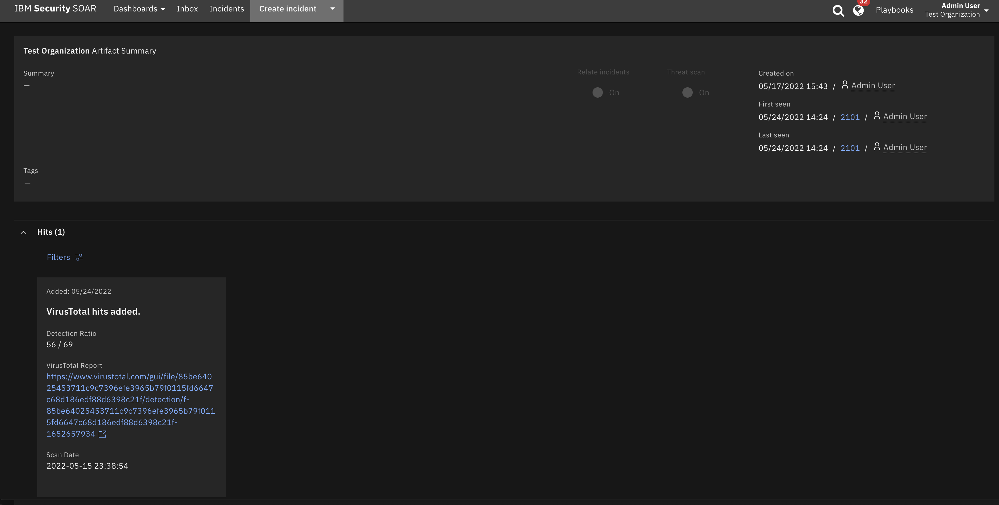
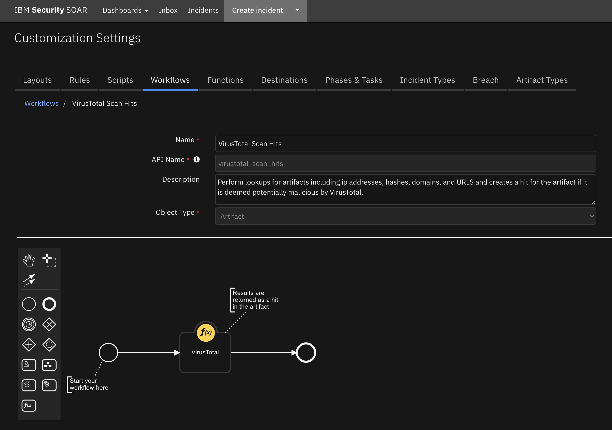
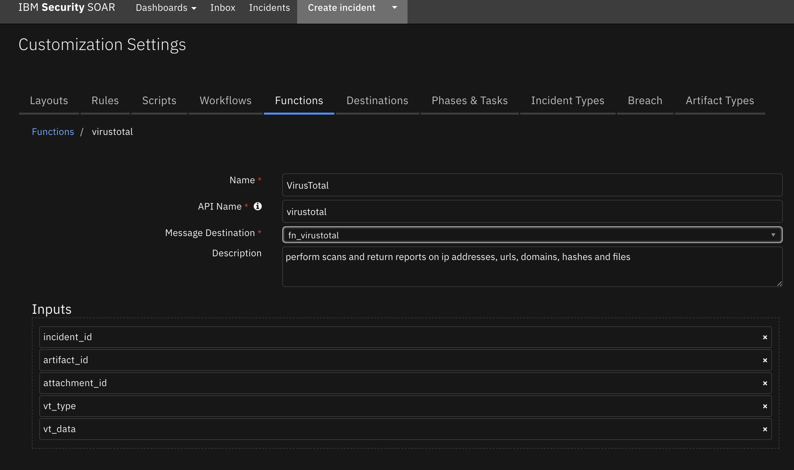

# SOAR Content Package for VirusTotal

## Description

This content package contains a single resource file with the following rule and workflow:

1. VirusTotal Scan (Rule)
- Automatic rule invoked by an artifact that is a Domain, IP address, Hash, or URL.
- Associated with the VirusTotal Scan Hits Workflow
2. VirusTotal Scan Hits (Workflow)
- Perform lookups for artifacts including ip addresses, hashes, domains, and URLS and creates a hit for the artifact if it is deemed potentially malicious by VirusTotal.
- Uses the Function VirusTotal 



## Package Dependences
The workflows in this package depend on the following
- SOAR Version 43
- fn_virustotal Version 1.0.7


## Prerequisite
This package requires the VirusTotal integration to be downloaded from the [app exchange](https://exchange.xforce.ibmcloud.com/hub/extension/9b9e32c2159332df425006e6d38effb0) and installed.

### Install
* To install or uninstall an App or Integration on the _SOAR platform_, see the documentation at [ibm.biz/soar-docs](https://ibm.biz/soar-docs).
* To install or uninstall an App on _IBM Cloud Pak for Security_, see the documentation at [ibm.biz/cp4s-docs](https://ibm.biz/cp4s-docs) and follow the instructions above to navigate to Orchestration and Automation.


## Import
Ensure that the above package has been installed.
Download the VirusTotal Component package and unzip it. 
In SOAR server, go to Administrator Settings->Organization->Migrate Settings->Import->Import Settings 
and select the `virustotal.res` file downloaded above.

## Usage
Once the resource file is successfully imported, the workflow included in the file is ready for use.


### Example of VirusTotal Workflow with Hits
This workflow invokes a functions from the fn_virustotal integration package.



## Function - VirusTotal Scan Hits
Get all verified breaches of an email address from VirusTotal.

 

<details><summary>Inputs:</summary>
<p>

| Name | Type | Required | Example | Tooltip |
| ---- | :--: | :------: | ------- | ------- |
| `incident_id` | `number` | Yes | `--` | - |
| `artifact_id` | `number` | No | `--` | - |
| `attachment_id` | `number` | No | `--` | - |
| `vt_type` | `text` | No | `hash` | descriptor for the type of virusTotal lookup to perform |
| `vt_data` | `text` | No | `0.0.0.0` | data field for virusTotal lookup |


</p>
</details>

<details><summary>Outputs:</summary>
<p>

> **NOTE:** This example might be in JSON format, but `results` is a Python Dictionary on the SOAR platform.

```python
results = {
    {
  'scan': {
    'asn': 15169,
    'undetected_urls': [
      [
        'https://ipv6.teredo.nanopool.org/',
        'f0649495639273c69edb2cc1280f7e067b0544dfbcb0eb85c80dd1c2f327b8e4',
        0,
        92,
        '2022-05-23 13:34:02'
      ],
      [
        'https://ndash.nanopool.org/',
        '2f4bb7ee6c440394485d7729797c9cca09e37113fa89e69e664651b5596d7629',
        0,
        92,
        '2022-05-23 13:23:57'
      ],
      [
        'https://market.nanopool.org/',
        '5e4a14764b06e33f9de18e121555302a185f336eea962fe0fa2cc7478cb40cfc',
        0,
        92,
        '2022-05-15 18:10:25'
      ]
    ],
    'undetected_downloaded_samples': [
      {
        'date': '2021-06-26 10:22:03',
        'positives': 0,
        'total': 74,
        'sha256': '068cd274c04db69dcaf1d0b946e9127be6a79473c4544bd1a802995f7719b0a0'
      },
      {
        'date': '2021-07-03 23:54:32',
        'positives': 0,
        'total': 74,
        'sha256': 'f8ce6ec58a2b8ab5d8784e24eca5ff48fa3458ad164eda00028c987945763268'
      },
      {
        'date': '2013-05-30 18:04:48',
        'positives': 0,
        'total': 45,
        'sha256': '9f97a9eac83ab8fdaadee58b5902448c6ec23a018ebb7949c0bec8fa1cb87398'
      }
    ],
    'detected_downloaded_samples': [
      {
        'date': '2017-09-28 14:00:34',
        'positives': 1,
        'total': 57,
        'sha256': '2b977b6342a624097b669fd2347ffbcbdc8a814369b5f431835793dbaa2251c8'
      },
      {
        'date': '2017-07-12 11:06:59',
        'positives': 34,
        'total': 58,
        'sha256': 'dec204c394b4cef3c2f57360c3b560dbafeaf4872a97cb56b8e596527f0fa50a'
      },
      {
        'date': '2013-05-24 01:14:48',
        'positives': 6,
        'total': 47,
        'sha256': 'd586ea1372a5d7ec755fed3243c74df161c3caacec4475541a644a908455f143'
      }
    ],
    'response_code': 1,
    'as_owner': 'GOOGLE',
    'detected_referrer_samples': [
      {
        'date': '2018-02-14 12:35:57',
        'positives': 25,
        'total': 70,
        'sha256': '6c16bbddc9dcbf447c44afb11387115ac657852fcdf30cf068cf6e11e8786212'
      },
      {
        'date': '2018-02-14 12:35:56',
        'positives': 35,
        'total': 70,
        'sha256': '74775f05c7ba7003317d4a8af1f15357c1752dc7a58934ec1c99739aee68a808'
      },
      {
        'positives': 33,
        'total': 66,
        'sha256': '86893d70251c7fef5253b8bddb1bdcd1129c02f2e24aba597548d50ff085821a'
      },
      {
        'positives': 14,
        'total': 66,
        'sha256': '7fc506395c05b531897ae694598ed55d00466a35e5a91736d9d680509de65669'
      }
    ],
    'verbose_msg': 'IP address in dataset',
    'country': 'US',
    'undetected_referrer_samples': [
      {
        'positives': 0,
        'total': 55,
        'sha256': '01e110d94eec3ec8abed7c9bb34fd7bcc3bd06c397ec83676431fc193be3b68e'
      },
      {
        'positives': 0,
        'total': 54,
        'sha256': '83d7b46d2045cc4e3e0443d8673ff747ea03c92e9b82905e1dce579f10a6cc9d'
      },
      {
        'url': 'http://codorasys.com/',
        'positives': 4,
        'total': 92,
        'scan_date': '2022-05-19 16:19:22'
      }
    ],
    'detected_communicating_samples': [
      {
        'date': '2022-05-23 12:16:06',
        'positives': 38,
        'total': 73,
        'sha256': '2cd71dddd0570d5f9c06fdb3b5baa8aa34327956a0e933d990117075253fbc45'
      },
      {
        'date': '2022-05-23 11:42:55',
        'positives': 2,
        'total': 71,
        'sha256': '6469e6397a56a4cdcc97f4fea16a1843dfb83682d83cfa99f8a429e33f096dc1'
      },
      {
        'date': '2022-05-22 22:21:12',
        'positives': 0,
        'total': 72,
        'sha256': '722664b0410187d326c9d7c8a808f749f0de32f479647cfa8817f1b6c96db18d'
      }
    ],
    'resolutions': [
      {
        'last_resolved': '2015-12-10 00:00:00',
        'hostname': '*.o365answers.com'
      },
      {
        'last_resolved': '2015-11-13 00:00:00',
        'hostname': '*.skvatboy.dk'
      },
      {
        'last_resolved': '2021-10-03 04:09:46',
        'hostname': '0.0.0.0rca.nanopool.org'
      }
    ]
  }
}
}
```

</p>
</details>

<details><summary>Example Pre-Process Script:</summary>
<p>

```python
typeLookup = { 'Email Attachment': 'file', 'Malware Sample': 'file', 'Malware MD5 Hash': 'hash', 'Malware SHA-1 Hash': 'hash', 'Malware SHA-256 Hash': 'hash', 'Other File': 'file', 'RCF 822 Email Message Fife': 'file', 'File Name': 'filename',
 'URL': 'url', 'IP Address': 'ip', 'DNS Name':'domain'}
if artifact.type in typeLookup:
  inputs.vt_type = typeLookup.get(artifact.type, artifact.type)
else:
  inputs.vt_type = artifact.type

inputs.incident_id = incident.id
inputs.artifact_id = artifact.id
inputs.vt_data = artifact.value
```

</p>
</details>

<details><summary>Example Post-Process Script:</summary>
<p>

```python
scan = results.get('scan')

if scan.get('positives') is not None:
  hit = [
  {
    'name': 'Detection Ratio',
    'type': 'number',
    'value': '{} / {}'.format(scan.get('positives'), scan.get('total'))
  },
  {
    'name': 'VirusTotal Report',
    'type': 'uri',
    'value': '{}'.format(scan.get('permalink'))
  },
  {
    "name": "Scan Date",
    "type": "string",
    "value": "{}".format(scan.get('scan_date'))
  }
]
elif artifact.type == 'DNS Name' or 'IP Address':
  test_for_positive = scan.get('detected_urls')
  if test_for_positive is not None:
    sample = test_for_positive[0]
    if sample.get('positives', -1) > 0:
      if artifact.type == 'DNS Name':
        hit = [
                {
                  'name': 'Detected URL\'s Detection Ratio',
                  'type': 'number',
                  'value': '{} / {}'.format(sample.get('positives'), sample.get('total'))
                },
                {
                  'name': 'VirusTotal Report',
                  'type': 'uri',
                  'value': 'https://www.virustotal.com/domain/{}/information/'.format(artifact.value)
                },
                {
                  "name": "Detected URL\'s Scan Date",
                  "type": "string",
                  "value": "{}".format(sample.get('scan_date'))
                }
              ]
      else:
        hit = [
                {
                  'name': 'Detection Ratio',
                  'type': 'number',
                  'value': '{} / {}'.format(sample.get('positives'), sample.get('total'))
                },
                {
                  'name': 'VirusTotal Report',
                  'type': 'uri',
                  'value': 'https://www.virustotal.com/ip-address/{}/information/'.format(artifact.value)
                },
                {
                  "name": "Scan Date",
                  "type": "string",
                  "value": "{}".format(sample.get('scan_date'))
                }
              ]
else:
  hit = [
          {
            "name": "Artifact Value",
            "type": "string",
            "value": "{}".format(artifact.value)
          },
          {
            "name": "Verbose Message",
            "type": "string",
            "value": "{}".format(scan['verbose_msg'])
          },
          {
            'name': 'VirusTotal Report',
            'type': 'uri',
            'value': '{}'.format(scan.get('permalink'))
          }
        ]
artifact.addHit("VirusTotal hits added.", hit)

if results.scan.get('md5') is not None:
  incident.addArtifact('Malware MD5 Hash', scan.get('md5'), None)

if results.scan.get('sha1') is not None:
  incident.addArtifact('Malware SHA-1 Hash', scan.get('sha1'), None)
  
if results.scan.get('sha256') is not None:
  incident.addArtifact('Malware SHA-256 Hash', scan.get('sha256'), None)
```

</p>
</details>

---


## Uninstall
Manually delete the followings:
1. Rules
- "VirusTotal Scan"
2. Workflows
- VirusTotal Scan Hits