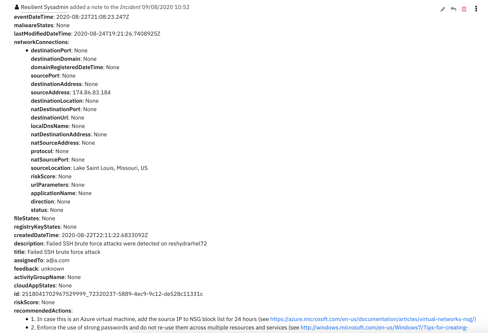

[//]: # (resilient-sdk extract --script "Convert JSON to rich text v1.1" --export /pathto/export-resilient-20200918150300.resz)

# Resilient Convert JSON to Rich Text Script
This package consists of the **convert_json_to_rich_text.res** export file. 

The package contains a script to convert a json data structure into a hierarchical display of rich text, 
and adds the rich text to either an incident's rich text (custom) field or an incident note.
A workflow property is used to define the json to convert and identify parameters used on how to perform the conversion.
Typically, a function will create the workflow property and this script will run after that function to perform the conversion.

## Features:
  * Display the hierarchical nature of json, presenting the json keys as bold labels
  * Provide links to found URLs
  * Create either an incident note or add results to an incident (custom) rich text field.

## Installation instructions

Before installing, verify that your environment meets the following prerequisites:
* Resilient platform version 35 or later. 
* You have a Resilient account to use for the installation. This can be any account that has the permission to view and modify administrator and customization settings, and read and update incidents. You need to know the account username and password.

### Steps

**Important:** Repeatedly importing the **.res** files will overwrite any changes you have made to the script.

1. Log on to the Resilient platform using a suitable account.
1. Navigate to **Administrator Settings**.
1. Select the **Organization** tab.
1. Select the **Import** link.
1. Select the **+ Import settings** button.
1. Select the **convert_json_to_rich_text.res** file from the installation bundle.
1. Select **Open**.
1. Select **Proceed**.

### Result
After installing from **convert_json_to_rich_text.res**, the Resilient platform will have a new Python script called "Convert JSON to rich text v1.1". 
 
## Usage 
In order to use this script, define a workflow property called: `convert_json_to_rich_text`, to define the json data and parameters to use for the conversion.
Workflow properties can be added using a command similar to this:
```
  workflow.addProperty('convert_json_to_rich_text', { 
    "version": 1.1,
    "header": "Artifact scan results for {}".format(artifact.value),
    "padding": 10,
    "separator": u"<br />",
    "sort": True,
    "json": results.content,
    "json_omit_list": ["omit"],
    "incident_field": None
  })
```
  
  Format of workflow.property.convert_json_to_rich_text:
```
  { 
    "version": 1.1, [this is for future compatibility]
    "header": str, [header line to add to converted json produced or None. Ex: Results from scanning artifact: xxx. The header may contain rich text tags]
    "padding": 10, [padding for nested json elements, or defaults to 10]
    "separator": u"<br />"|list such as ['<div>','</div>'], [any html separator between json keys and lists or defaults to html break: '<br />'. 
                                                             If a list, then the data is brackets by the pair specified]
    "sort": True|False, [sort the json keys at each level when displayed]
    "json": json, [required json to convert]
    "json_omit_list": [list of json keys to exclude or None]
    "incident_field": "<incident_field>" [indicates a builtin rich text incident field, such as 'description' 
                                          or a custom rich text field in the format: 'properties.<field>'. default: create an incident note]
  }
```


## Formatted Output Example
