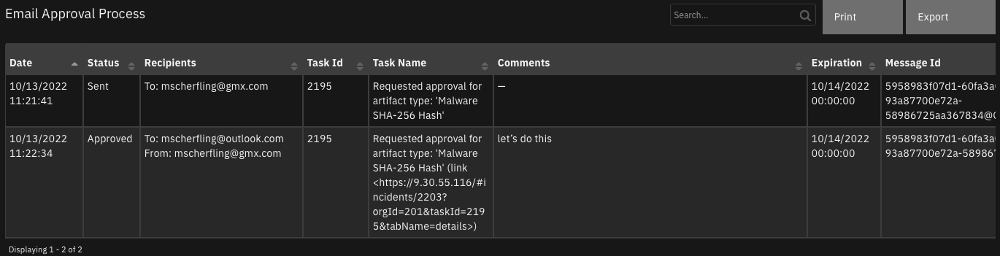
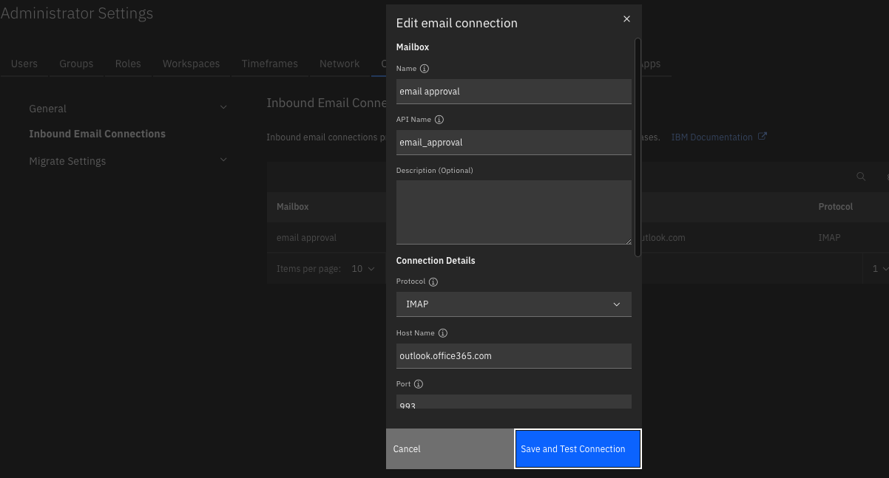
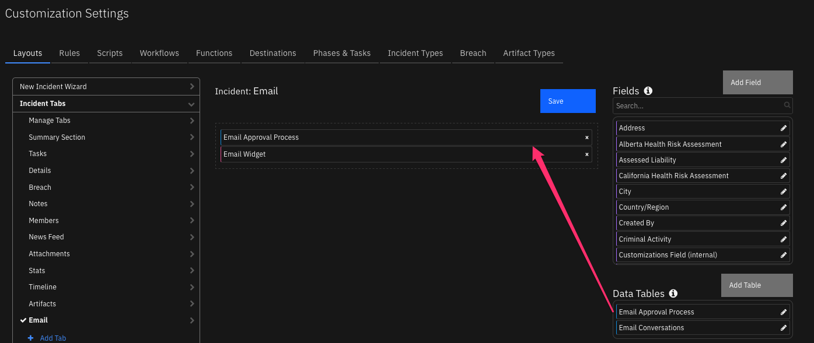
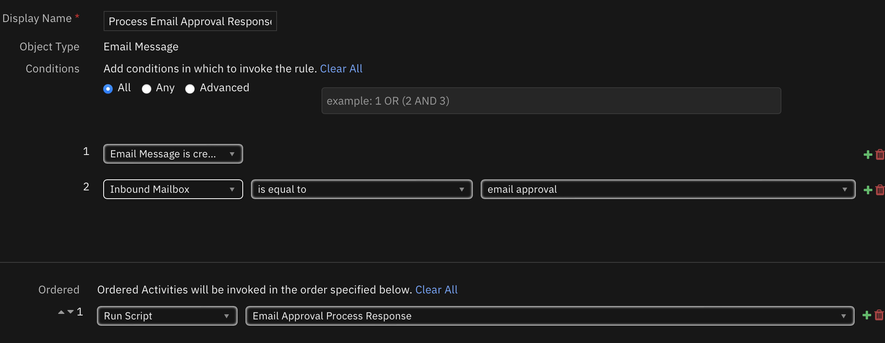
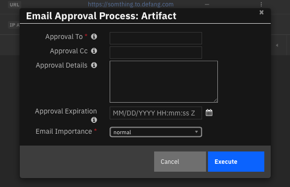
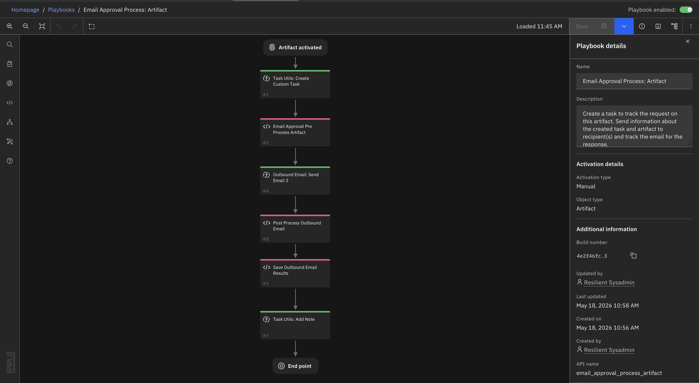
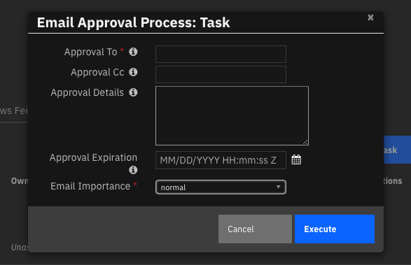
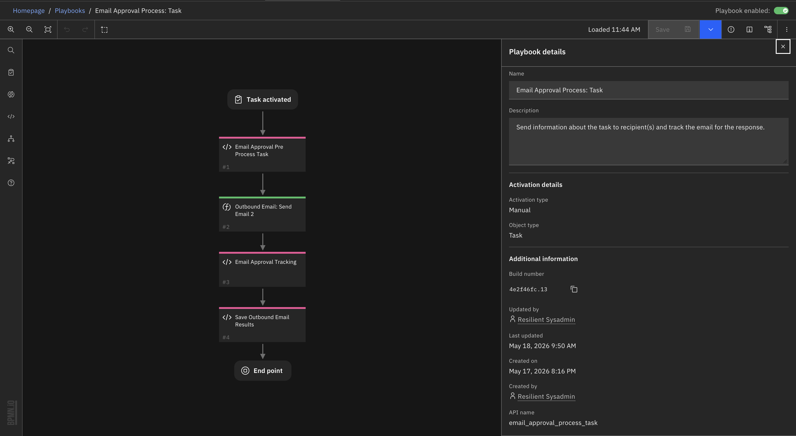
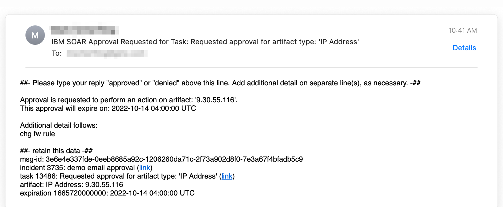
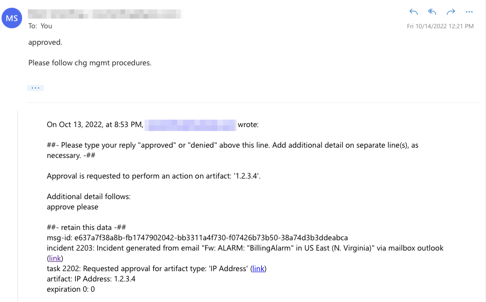

# IBM SOAR Email Approval Process Content Pack
This content package consists of rules, playbooks, scripts and a datatable for an out-of-the-box email approval process. For customers who require a manual approval process before taking remediation actions, this content pack will support outbound emails sent to recipients with a request for action approval. The reply is then parsed to update the associated case task with the response.



## History
| Version | Date | Comments |
| ------: | ---: | -------: |
| 1.0.2 | 05/2026 | Migrated workflows to playbooks, added support for multi-recipient email approval functionality, added Gmail client compatibility (handles quoted text and split msg-id lines), bug resolutions |
| 1.0.1 | 02/2023  | fixes for v47 |
| 1.0.0 | 10/2022 | Initial release |

## Requirements
This content package relies on two apps which need to be installed and configured prior to importing the associated EmailApprovalContactPack.res file:

* IBM SOAR Task Helper Functions (https://exchange.xforce.ibmcloud.com/hub?q=task&br=Resilient)
* Outbound Email for SOAR (version 2.0 or greater) (https://exchange.xforce.ibmcloud.com/hub/extension/caafba4e4f6d130e7db30ed4d5e53504)

In addition to the above SOAR apps, the SOAR inbound email capability needs to be configured with an appropriate email user account and folder used specifically for email approval. Use the same email address configured in Outbound Email for the inbound email connection so that all replies are processed for email approvals.




## Key Features
* Out-of-the-box experience blending outbound and inbound email capabilities.
* Secure email through embedded one-way hash.
* Optional time-based expiration.
* History of approvals and replies retained in a datatable.
* Flexible template for email message body.
* Flexibility for use in other business processes using playbooks.

## Script - Email Approval Pre Process Artifact
Collect and format data used by the Email Approval Process. Uses the 'email_approval' workspace property.

This script relies on the 'create custom task' function from fn_task_utils to precede it

**Object:** artifact

<details><summary>Script Text:</summary>
<p>

```python
# (c) Copyright IBM Corp. 2010, 2026. All Rights Reserved.
import hashlib
import re
import time

# get the task_creation property. This script requires the 'create custom task' function to previously run
try:
  dialog_inputs = rule.properties
  task_info = workflow.properties.task_creation
except:
  dialog_inputs = None
  task_info = None
  
if not dialog_inputs or not dialog_inputs.get('email_approval_to'):
  try:
    dialog_inputs = playbook.inputs
    task_info = playbook.functions.results.task_creation
  except:
    pass

task_id = task_info['content'].get('task', {}).get('id')
task_name = task_info['inputs'].get('task_name')

MESSAGE_ID_DOMAIN = "QRADARSOAR.IBM.COM"
SUBJECT_PREFIX = "IBM SOAR Approval Requested"
# check for any combination of upper/lowercase http/https/news/telnet/file. Characters repeated for readability
DEFANG_PATTERN = re.compile(r"(https|http|ftps|ftp|mailto|news|file|mailto):", re.IGNORECASE)

current_time = int(time.time()*1000)

# generate a message-id
def generate_msg_hash(expiration, incident_id, incident_create_date, task_id):
    m = hashlib.sha256()
    m.update(str(expiration).encode())
    m.update(str(incident_id).encode())
    m.update(str(incident_create_date).encode())
    m.update(str(task_id).encode())

    uuid_hash = m.hexdigest()
    return "{}-{}-{}-{}-{}".format(uuid_hash[0:12], uuid_hash[12:24], uuid_hash[24:36], uuid_hash[36:48], uuid_hash[48:])

def create_msg_id(msg_hash, domain=MESSAGE_ID_DOMAIN):
  return "{}@{}".format(msg_hash, domain)

msg_content = dialog_inputs.email_approval_details.content.replace('\n', '<br>') if dialog_inputs.email_approval_details and  dialog_inputs.email_approval_details.content else None

expiration_ts = dialog_inputs.email_approval_expiration if dialog_inputs.get('email_approval_expiration') else 0
# confirm dates in the future
if expiration_ts and expiration_ts < current_time:
    helper.fail("Expiration date is in the past")

expiration = time.strftime('%Y-%m-%d %H:%M:%S %Z', time.localtime(expiration_ts/1000)) if expiration_ts else 0

msg_hash = generate_msg_hash(expiration_ts,
                             incident.id,
                             incident.create_date,
                             task_id
                             )
msg_id = create_msg_id(msg_hash)
# defang the artifact if needed
artifact_value = DEFANG_PATTERN.sub(r"x_\1_x:", artifact.value)
body = []
body.append(f"""
##- Please type your reply "approved" or "denied" above this line. Add additional detail on separate line(s), as necessary.  -##
<br><br>
Approval is requested to perform an action on artifact: '{artifact_value}'.
""")
if expiration_ts > 0:
    body.append(f"This approval will expire on: {expiration}")


body.append(f"""<br>
Additional detail follows:
<br>
{msg_content}
<br><br>
##- retain this data -##
<br>
msg-id: {msg_hash}<br>
incident {incident.id}: {incident.name} (<a target='_blank' href='{{{{ template_helper.generate_incident_url({incident.id}) }}}}'>link</a>)
<br>
task {task_id}: {task_name} (<a target='_blank' href='{{{{ template_helper.generate_task_url({incident.id},{task_id}) }}}}'>link</a>)
<br>
artifact: {artifact.type}: {artifact_value}
<br>
expiration {expiration_ts}: {expiration}
""")

# have the approval details
details = {
  "ts": current_time,
  "expiration": expiration,
  "expiration_ts": expiration_ts,
  "msg_hash": msg_hash,
  "msg_id": msg_id,
  "to": dialog_inputs.email_approval_to.content,
  "from": None, # change as necessary
  "cc": dialog_inputs.get('email_approval_cc', {}).get("content", None),
  "bcc": None, # change as necessary
  "subject": f"{SUBJECT_PREFIX} for Task: {task_name}",
  "body": "<br>".join(body),
  "importance": dialog_inputs.get('email_approval_importance'),
  "task_id": task_id,
  "task_name": task_name
}

# add to property for function processing
try:
  workflow.addProperty("email_approval", details)
except:
  pass

try:
  playbook.addProperty("email_approval", details)
except:
  pass

```

</p>
</details>

---
## Script - Email Approval Pre Process Task
Collect and format data used by the Email Approval Process. Uses the 'email_approval' workspace property.

**Object:** task

<details><summary>Script Text:</summary>
<p>

```python
# (c) Copyright IBM Corp. 2010, 2026. All Rights Reserved.
import hashlib
import time

try:
  dialog_inputs = rule.properties
except:
  dialog_inputs = None

if not dialog_inputs or not dialog_inputs.get('email_approval_to'):
  try:
    dialog_inputs = playbook.inputs
  except:
    pass
  

MESSAGE_ID_DOMAIN = "QRADARSOAR.IBM.COM"
SUBJECT_PREFIX = "IBM SOAR Approval Requested"

current_time = int(time.time()*1000)

# generate a message-id
def generate_msg_hash(expiration, incident_id, incident_create_date, task_id):
    m = hashlib.sha256()
    m.update(str(expiration).encode())
    m.update(str(incident_id).encode())
    m.update(str(incident_create_date).encode())
    m.update(str(task_id).encode())

    uuid_hash = m.hexdigest()
    return "{}-{}-{}-{}-{}".format(uuid_hash[0:12], uuid_hash[12:24], uuid_hash[24:36], uuid_hash[36:48], uuid_hash[48:])

def create_msg_id(msg_hash, domain=MESSAGE_ID_DOMAIN):
  return "{}@{}".format(msg_hash, domain)

msg_content = dialog_inputs.email_approval_details.content.replace('\n', '<br>') if dialog_inputs.email_approval_details and  dialog_inputs.email_approval_details.content else None

expiration_ts = dialog_inputs.email_approval_expiration if dialog_inputs.get('email_approval_expiration') else 0
# confirm dates in the future
if expiration_ts and expiration_ts < current_time:
    helper.fail("Expiration date is in the past")

expiration = time.strftime('%Y-%m-%d %H:%M:%S %Z', time.localtime(expiration_ts/1000)) if expiration_ts else 0

msg_hash = generate_msg_hash(expiration_ts,
                             incident.id,
                             incident.create_date,
                             task.id
                             )
msg_id = create_msg_id(msg_hash)

body = []
body.append("""
##- Please type your reply "approved" or "denied" above this line. Add additional detail on separate line(s), as necessary.  -##
<br><br>
Approval is requested to perform this activity.
""")
if expiration_ts > 0:
    body.append(f"This approval will expire on: {expiration}")
    
body.append(f"""<br>
Additional detail follows:
<br>
{msg_content}
<br><br>
##- retain this data -##
<br>
msg-id: {msg_hash}
<br>
incident {incident.id}: {incident.name} (<a target='_blank' href='{{{{ template_helper.generate_incident_url({incident.id}) }}}}'>link</a>)
<br>
task {task.id}: {task.name} (<a target='_blank' href='{{{{ template_helper.generate_task_url({incident.id},{task.id}) }}}}'>link</a>)
<br>
expiration {expiration_ts}: {expiration}
""")

# have the approval details
details = {
  "ts": current_time,
  "expiration": expiration,
  "expiration_ts": expiration_ts,
  "msg_hash": msg_hash,
  "msg_id": msg_id,
  "to": dialog_inputs.email_approval_to.content,
  "from": None, # change as necessary
  "cc": dialog_inputs.get("email_approval_cc", {}).get("content", None),
  "bcc": None, # change as necessary
  "subject": f"{SUBJECT_PREFIX} for Task: {task.name}",
  "body": "<br>".join(body),
  "importance": dialog_inputs.get('email_approval_importance', 'normal')
}

# add to property for function processing
try:
  workflow.addProperty("email_approval", details)
except:
  pass

try:
  playbook.addProperty("email_approval", details)
except:
  pass

# updates to task
task.due_date = expiration_ts if expiration_ts else task.due_date
task.owner_id = principal.name if not task.owner_id else None
```

</p>
</details>

---
## Script - Email Approval Process Response
Parse email approval emails and make updates to cooresponding incidents and tasks

**Object:** emailmessage

<details><summary>Script Text:</summary>
<p>

```python
# (c) Copyright IBM Corp. 2010, 2022. All Rights Reserved.
import datetime
import hashlib
import re
import time
from email.utils import parsedate_to_datetime

SUBJECT_PREFIX = "IBM SOAR Approval Requested"
# pattern used to find and extract the email message-id
MESSAGE_PATTERN = re.compile(r"([^<>]+)")

ID_PATTERN_LIST = {
  'msg-id': re.compile(r"msg-id: ([a-zA-z0-9-]*)"),
  'inc-id': re.compile(r"incident (\d*):"),
  'task-id': re.compile(r"task (\d*):"),
  'task-name': re.compile(r"task \d*: (.*)$"),
  'expiration-ts': re.compile(r"expiration (\d*):")
}

APPROVE_LIST = ['yes', 'ok', 'okay', 'approve', 'approved', 'allow', 'proceed', 'continue', 'accept']
DENY_LIST = ['no', 'disapprove', 'reject', 'rejected', 'deny', 'denied', 'stop', 'pause', 'defer', 'deferred']
STRIP_RESPONSE = re.compile(r'(\w*)') # pattern to strip white space and special characters like '.'

# delimeter for sections within the approval message
RETAIN_COMMENTS = "##- retain"
ORIGINAL_EMAIL = [re.compile(r"^> "), 
                  re.compile(r"^On "), 
                  re.compile(r"wrote:", 
                  re.IGNORECASE), 
                  re.compile(r"From:", re.IGNORECASE),
                  re.compile(r"^____")
                 ] # characters associated with the start of the original message

# F U N C T I O N S
def generate_msg_hash(expiration_ts, incident_id, incident_create_date, task_id):
    m = hashlib.sha256()
    m.update(str(expiration_ts).encode())
    m.update(str(incident_id).encode())
    m.update(str(incident_create_date).encode())
    m.update(str(task_id).encode())

    uuid_hash = m.hexdigest()
    return "{}-{}-{}-{}-{}".format(uuid_hash[0:12], uuid_hash[12:24], uuid_hash[24:36], uuid_hash[36:48], uuid_hash[48:])
    
def handle_list(value):
  # convert a list to comma separate list, if neccessary
  if value and isinstance(value, list):
    return ", ".join(value)

  return value

def get_content():
  # return all content found in the email messagew
  """
  approved
  msg1
  msg2
  ##- Please type your reply "approved" or "denied" above this line. Add additional detail on separate line(s), as necessary.  -##
  
  Approval is requested to perform this activity. Additional detail follows:
  checkpoint fw
  ip ban
  
  ##- retain this data -##
  msg-id: d9ef3d54103f-03cb756ce84b-805eab0bff8c-8030b0796977-a47d83a5f0c391d4
  incident 2142: Incident generated from email "Approval Requested for Task: Remote wipe/lock" via mailbox outlook (<a target='_blank' href='https://9.30.55.116:443/#incidents/2142?orgId=201'>link</a>)
  task 1066: Interview key individuals (<a target='_blank' href='https://9.30.55.116:443/#incidents/2142?orgId=201&amp;taskId=1066&amp;tabName=details'>link</a>)
  expiration 123456789: 2022-08-29 12:00:00 IST
  """

  if (emailmessage.body.content is not None):
    return emailmessage.body.content

  log.error("Email message has no content!")

def get_response(content):
  # parse the message body to collect:
  #  - the response
  #  - any comments
  #  - msg-id, incident-id, task-id
  
  id_list_response = {}
  comments = []
  response = None

  # sections are separators between user response and information about the incident
  retain_section = False
  original_msg = False
  incomplete_msg_id = False
  for line in content.split('\n'):
    # find the section where all the incident data is retained
    if RETAIN_COMMENTS in line.strip():
      retain_section = True
      continue
      
    if retain_section:
      # Strip Gmail quote prefix (>) if present
      cleaned_line = line.strip()
      if cleaned_line.startswith("> "):
        cleaned_line = cleaned_line[2:]  # Remove "> " prefix
      elif cleaned_line.startswith(">"):
        cleaned_line = cleaned_line[1:]  # Remove ">" prefix
      
      # Check for incomplete msg-id line
      if cleaned_line == "msg-id:":
        incomplete_msg_id = True
        continue
      if incomplete_msg_id:
        cleaned_line = f"msg-id: {cleaned_line}"
        incomplete_msg_id = False
      
      # Process with regex patterns
      for key, ptrn in ID_PATTERN_LIST.items():
        match = ptrn.search(cleaned_line)
        if match:
          id_list_response[key] = match.group(1)
      continue
    # parse the approval response and comments
    if not retain_section and response is not None and line.strip():
      if "<br>" not in line and not original_msg:
        # make sure we haven't started looking through the original email
        for matcher in ORIGINAL_EMAIL:
            if matcher.search(line):
                original_msg = True
                break
            
        if not original_msg:
          comments.append(line)
    elif not retain_section and response is None:
      match = STRIP_RESPONSE.search(line.strip().lower())
      reply = match.group(0) if match else line.strip().lower()

      # find approval response
      if bool(reply in APPROVE_LIST):
        response = True
      elif bool(reply in DENY_LIST):
        response = False
      else:
        log.info(f"extraneous: {line}")

  log.info(f"response {response} id_list_response {id_list_response} comments {comments}")
  return response, id_list_response, comments

def find_incident(inc_id):
  # find the cooresponding incident
  query_builder.equals(fields.incident.id, int(inc_id))
  query_builder.equals(fields.incident.plan_status, "Active")
  query = query_builder.build()
  incidents = helper.findIncidents(query)

  if len(incidents) == 0:
    return None

  return incidents[0]

def is_valid_msg_id(incident, id_list_response):
  # confirm if the msg-id matches the incident
  confirm_msg_id = generate_msg_hash(id_list_response['expiration-ts'],
                                     id_list_response['inc-id'],
                                     incident.create_date,
                                     id_list_response['task-id']
                                     )

  return bool(id_list_response['msg-id'] == confirm_msg_id)

def get_attachments(attachments):
  return [attachment.suggested_filename for attachment in attachments]

def get_msg_sent_date(msg_date):
  # Date: Sat, 27 Aug 2022 20:30:30 +0000 (UTC)
  dt = parsedate_to_datetime(msg_date[0].replace("Date: ", ""))
  return int(dt.timestamp()*1000)
  
def get_expiration_ts(expiration):
    if expiration != '0':
        dt = datetime.strptime(expiration, '%Y-%m-%d %H:%M:%S %Z')
        if dt:
            return dt.timestamp()*1000
        
    return 0
  

# S T A R T
# bail if subject doesn't match
if SUBJECT_PREFIX in emailmessage.subject:

  # loop through the message, starting at the 2nd comment section
  content = get_content()
  
  # collect all the data
  response, id_list_response, comments = get_response(content)
  
  if response is None:
    log.error("No response was recognized")
  
  # do not continue if all ids are not found
  if id_list_response.keys() != ID_PATTERN_LIST.keys():
    log.warn("This does not appear to be an approval email")
    log.warn(emailmessage.body.content)
    for k,v in id_list_response.items():
        log.warn(f"{k}:{v}")
  else:
    # get the expiration timeframe in millisec
    #id_list_response['expiration-ts'] = get_expiration_ts(id_list_response['expiration'])
    log.info(f"Finding incident {id_list_response.get('inc-id')}")
    # find the cooresponding incident
    found_incident = find_incident(id_list_response.get('inc-id'))
    if not found_incident:
      helper.fail(f"Unable to locate incident: {id_list_response.get('inc-id')}")

    # this populates the incident object
    log.info(f"Associating approval with incident: {id_list_response.get('inc-id')}")
    emailmessage.associateWithIncident(found_incident)
    
    # determine if msg id is the same
    if not is_valid_msg_id(incident, id_list_response):
      helper.fail(f"msg-id mismatch for incident: {id_list_response.get('inc-id')} {id_list_response}")
      
    # store the email in the email approval table
    row = incident.addRow('email_approval_process')
    row['date'] = int(emailmessage.sent_date)
     # determine if the expiration value has expired
    if int(id_list_response.get('expiration-ts')) != 0 and int(id_list_response.get('expiration-ts')) < int(time.time()*1000):
      row['status'] = 'Expired'
    elif response:
      row['status'] = 'Approved'
    elif response is None:
      row['status'] = 'Unknown'
    else:
      row['status'] = 'Denied'

    row['recipients'] = f"To: {emailmessage.to[0].get('address')}\nFrom: {emailmessage.sender.get('address')}"
    row['comments'] = "\n".join(comments)
    row['message_id'] = id_list_response.get('msg-id')
    row['expiration'] = int(id_list_response.get('expiration-ts'))
    row['task_id'] = int(id_list_response.get('task-id'))
    row['task_name'] = id_list_response.get('task-name')

```

</p>
</details>

---
## Script - Save Outbound Email Results
Save outbound email results in the Email Conversations datatable

**Object:** incident

<details><summary>Script Text:</summary>
<p>

```python
import time

try:
    e_results = workflow.properties.outbound_email_results
except:
    e_results = None

if e_results is None:
    try:  
        e_results = playbook.functions.results.outbound_email_results
    except:  
        helper.fail("unable to read outbound_email_results property from Workflow or Playbook")

if e_results is None:
    helper.fail("outbound_email_results was found but contains no data (None)")


if e_results:
  row = incident.addRow('email_conversations')
  row['status'] = "success" if e_results.get('success') else "failure: {}".format(e_results.get('reason'))
  
  row['date_sent'] = int(time.time()*1000)
  row['source'] = "outbound"
  row['recipients'] = helper.createRichText("To: {}<br>Cc: {}<br>Bcc: {}".format(e_results.get('inputs', {}).get('mail_to'), e_results.get('inputs', {}).get('mail_cc', ''), e_results.get('inputs', {}).get('mail_bcc', '')))
  row['from'] = e_results.get('content', {}).get('mail_from') if e_results.get('content', {}).get('mail_from') else e_results.get('inputs', {}).get('mail_from')
  row['subject'] = e_results.get('inputs', {}).get('mail_subject')
  row['body'] = e_results.get('content', {}).get('mail_body')
  row['attachments'] = e_results.get('inputs', {}).get('mail_attachments')
  row['importance'] = e_results.get('inputs', {}).get('mail_importance')
  row['in_reply_to'] = e_results.get('inputs', {}).get('mail_in_reply_to')
  row['message_id'] = e_results.get('inputs', {}).get('mail_message_id')
else:
  incident.addNote("workflow/playbook properties 'outbound_email_results' not found")
  
```

</p>
</details>

---

## Playbooks
| Playbook Name | Description | Activation Type | Object | Status | Condition  | 
| ------------- | ----------- | --------------- | ------ | ------ | ---------  | 
| Complete Email Approval Process | Process an incoming approval email associated with a given task. | Automatic | email_approval_process | `enabled` | `email_approval_process.status in ['Approved', 'Denied', 'Expired', 'Unknown']` | 
| Email Approval Process: Artifact | Create a task to track the request on this artifact. Send information about the created task and artifact to recipient(s) and track the email for the response. | Manual | artifact | `enabled` | `-` | 
| Email Approval Process: Task | Send information about the task to recipient(s) and track the email for the response. | Manual | task | `enabled` | `-` | 

---


## Data Table - Email Approval Process

  <!-- ::CHANGE_ME:: -->

#### API Name:
email_approval_process

#### Columns:
| Column Name | API Access Name | Type | Tooltip |
| ----------- | --------------- | ---- | ------- |
| Comments | `comments` | `textarea` | - |
| Date | `date` | `datetimepicker` | - |
| Expiration | `expiration` | `datetimepicker` | - |
| Message Id | `message_id` | `text` | - |
| Recipients | `recipients` | `textarea` | - |
| Status | `status` | `select` | - |
| Task Id | `task_id` | `number` | - |
| Task Name | `task_name` | `text` | - |

---


## Rules
| Rule Name | Object | Script Triggered | Condition |
| --------- | ------ | ------------------ | ---------- |
| Process Email Approval Response | emailmessage | Email Approval Process Response | `object_added` |

---


## Custom Layouts
* Import the Data Tables and Custom Fields like the screenshot below:
  It may be useful to place the `Email Approval Process` datatable within a tab, such as the existing `Email` tab. This table serves as an audit of the email approval process and shows the sequence of communication. 

  


---

## Installation

Before installing, verify that your environment meets the following prerequisites:
* IBM SOAR platform is version 51.0.7.0.20620 or later, or Cloud Pak for Security (CP4S) 1.10 or later.
* You have a IBM SOAR account to use for the installation. This can be any account that has the permission to view and modify administrator and customization settings.

**Important:** Repeatedly importing the **EmailApprovalContentPack.res** file will overwrite any changes you have made to the associated scripts, playbooks and rules. To avoid this issue, make new scripts, playbooks, rules, etc. with copied data.

1. Log on to the IBM SOAR platform using a suitable account.
2. Navigate to **Administrator Settings**. For CP4S, navigate to Application Settings, Case Management, **Permissions and access**.
3. Select the **Organization** tab.
4. Select the **Import** link.
5. Select the **+ Import settings** button.
6. If you are upgrading from a previous version of this package, select the **EmailApprovalContactPack.res** file from the installation bundle.
7. Select **Open**.
8. Select **Proceed**.

**Note**: The rule `Process Email Approval Response` is disabled by default. To enable:

1. Navigate to **Customization Settings**. For CP4S, navigate to Application Settings, Case Management, **Customization**.
2. Select the "Rules" tab.
3. Enable the rule `Process Email Approval Response`.

If you have multiple inbound email connections, add a condition to the Rule to specify which Inbound Email connection is used for your email approval process.



## Operation

The email approval content package incorporates two processes which are similar. Additional processes can be composed from these components.

### Artifact Process
* Email settings for the approval process are entered by the SOAR operator.
* A custom task is created to track the approval process in the Respond phase.
* The email message is composed with data to track the response.
* The email is sent.
* The email message is copied to the Email Conversations and Email Approval Process datatables.
* The email response is parsed and captured in the Email Approval Process datatable and as a note to the newly created task.




### Task Process
* Email settings for the approval process are entered by the SOAR operator.
* The email message is composed with data to track the response.
* The email is sent.
* The email message is copied to the Email Conversations and Email Approval datatables.
* The email response is parsed and captured in the Email Approval Process datatable and as a note to the corresponding task.




### Email Message
The email message body is composed via an in-script template and is composed of two sections. The first section contains information about the scope of the request (task or artifact) and any additional information about the request. Some emails can include an expiration date when the approval request is no longer valid.

The second section contains references back to the SOAR case and the task used when the email is replied to. This information is secured by a one-way hash which ensures the case information cannot be altered. 

Replied to emails require SOAR Inbound Email to be configured with an account and folder dedicated to this process and the `Process Email Approval Response` rule enabled to process the reply.



## Configuration

### Email Template
An email template used is contained in the `Email Approval Pre Process Artifact` and `Email Approval Pre Process Task` scripts. The scripts uses both inline data substitution and data substitution performed on the back-end using a Python Jinja-style template. This template can be changed as long as the data sections are preserved (using the '##-' separators). The logic to parse the email and these separators is contained in the `Email Approval Process Response` script.

### Approval Adjectives
A list of synonyms exists in the `Email Approval Process Response` script are used to determine if the request is approved or rejected. If your language or process is different, edit these lists as needed.

```
APPROVE_LIST = ['yes', 'ok', 'okay', 'approve', 'approved', 'allow', 'proceed', 'continue', 'accept']
DENY_LIST = ['no', 'disapprove', 'reject', 'rejected', 'deny', 'denied', 'stop', 'pause', 'defer', 'deferred']
```
## Troubleshooting
The majority of issues encountered are associated with the parsing the reply message and identifying it with the originating SOAR case and task. The parsing logic identifies the response, 'approved' or 'denied' or any configured synonym, and the SOAR identifiers which refer back to the SOAR case and task. Below is a sample email response.

All message details are needed to accept the response email: msg-id, incident, task, and expiration are found in the `##- retain this data -##` section.



Script failures can be found within the SOAR platform at `/var/log/resilient-scripting/resilient-scripting.log`.
### For Support
This is a IBM Community provided app. Please search the Community [ibm.biz/soarcommunity](https://ibm.biz/soarcommunity) for assistance.
