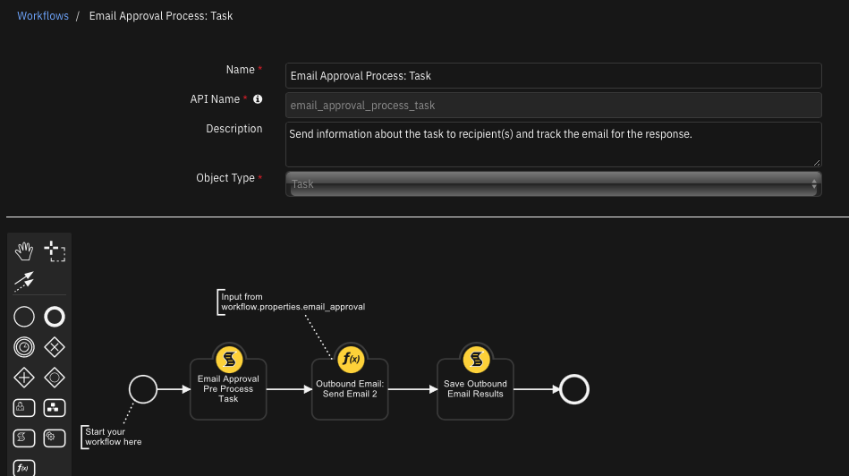

# IBM SOAR Email Approval Process Content Pack
This content package consists of rules, workflows, scripts and a datatable for an out-of-the-box email approval process. For customers who require a manual approval process before taking remediation actions, this content pack will support outbound emails sent to recipients with a request for action approval. The reply is then parsed to update the associated case task with the response.


## History
| Version | Date | Comments |
| ------: | ---: | -------: |
| 1.0.1 | 2/2023  | fixes for v47 |
| 1.0.0 | 10/2022 | Initial release |

## Key Features
* Out-of-the-box experience blending outbound and inbound email capabilities.
* Secure email through embedded one-way hash.
* Optional time-based expiration.
* History of approvals and replies retained in a datatable.
* Flexible template for email message body.
* Flexibility for use in other business processes using playbooks.

## What's Included
This package consists of the following components:

| Type | Name | Description |
| :--- | :--- | :---------- |
| Script | Email Approval Pre Process Artifact | Collect and format data used by the Email Approval Process. It uses the `email_approval` workspace or playbook property. This script relies on the 'create custom task' function from `IBM SOAR Task Utils` to precede it. |
| Script | Email Approval Pre Process Task | Collect and format data used by the Email Approval Process. Uses the `email_approval` workflow or playbook property. |
| Script | Email Approval Process Response | Parse email approval emails and make updates to the cooresponding incident and task. |
| Rule | Email Approval Process: Artifact | Create an email approval for actions on an artifact. |
| Rule | Email Approval Process: Task | Create an email approval for actions on a task. |
| Rule | Process Email Approval Response | See script: Email Approval Process Response. |
| Rule | Complete Email Approval Process | Process an incoming approval email associated with a given task. |
| Workflow | Email Approval Process: Artifact | See rule: Email Approval Process: Artifact. |
| Workflow | Email Approval Process: Artifact | See rule: Email Approval Process: Task.|
| Datatable | Email Approval Process | Retention of approval emails with the status of the response. |


## Requirements
This content package relies on two apps which need to be installed and configured prior to importing the associated EmailApprovalContactPack.res file:

* IBM SOAR Task Helper Functions (https://exchange.xforce.ibmcloud.com/hub?q=task&br=Resilient)
* Outbound Email for SOAR (version 2.0 or greater) (https://exchange.xforce.ibmcloud.com/hub/extension/caafba4e4f6d130e7db30ed4d5e53504)

In addition to the above SOAR apps, the SOAR inbound email capability needs to be configured with an appropriate email user account and folder used specifically for email approval.


## Installation and Configuration
It may be useful to place the `Email Approval Process` datatable within a tab, such as the existing `Email` tab. This table serves as an audit of the email approval process and shows the sequence of communication. 


## Installation

Before installing, verify that your environment meets the following prerequisites:
* IBM SOAR platform is version 43.1 or later, or Cloud Pak for Security (CP4S) 1.8 or later.
* You have a IBM SOAR account to use for the installation. This can be any account that has the permission to view and modify administrator and customization settings.

**Important:** Repeatedly importing the **EmailApprovalContentPack.res** file will overwrite any changes you have made to the associated scripts, workflows and rules. To avoid this issue, make new scripts, workflows, rules, etc. with copied data.

1. Log on to the IBM SOAR platform using a suitable account.
2. Navigate to **Administrator Settings**. For CP4S, navigate to Application Settings, Case Management, **Permissions and access**.
3. Select the **Organization** tab.
4. Select the **Import** link.
5. Select the **+ Import settings** button.
6. If you are upgrading from a previous version of this package, select the **EmailApprovalContactPack.res** file from the installation bundle.
7. Select **Open**.
8. Select **Proceed**.

**Note**: The rule `Process Email Approval Response` is disabled by default. To enable:

1. Navigate to **Customization Settings**. For CP4S, navigate to Application Settings, Case Management, **Customization**.
2. Select the "Rules" tab.
3. Enable the rule `Process Email Approval Response`.

If you have multiple inbound email connections, add a condition to the Rule to specify which Inbound Email connection is used for your email approval process.


## Operation

The email approval content package incorporates two processes which are similar. Additional processes can be composed from these components.

### Artifact Process
* Email settings for the approval process are entered by the SOAR operator.
* A custom task is created to track the approval process in the Respond phase.
* The email message is composed with data to track the response.
* The email is sent.
* The email message is copied to the Email Conversations and Email Approval Process datatables.
* The email response is parsed and captured in the Email Approval Process datatable and as a note to the newly created task.


### Task Process
* Email settings for the approval process are entered by the SOAR operator.
* The email message is composed with data to track the response.
* The email is sent.
* The email message is copied to the Email Conversations and Email Approval datatables.
* The email response is parsed and captured in the Email Approval Process datatable and as a note to the corresponding task.




### Email Message
The email message body is composed via an in-script template and is composed of two sections. The first section contains information about the scope of the request (task or artifact) and any additional information about the request. Some emails can include an expiration date when the approval request is no longer valid.

The second section contains references back to the SOAR case and the task used when the email is replied to. This information is secured by a one-way hash which ensures the case information cannot be altered. 

Replied to emails require SOAR Inbound Email to be configured with an account and folder dedicated to this process and the `Process Email Approval Response` rule enabled to process the reply.


## Configuration

### Email Template
An email template used is contained in the `Email Approval Pre Process Artifact` and `Email Approval Pre Process Task` scripts. The scripts uses both inline data substitution and data substitution performed on the back-end using a Python Jinja-style template. This template can be changed as long as the data sections are preserved (using the '##-' separators). The logic to parse the email and these separators is contained in the `Email Approval Process Response` script.

### Approval Adjectives
A list of synonyms exists in the `Email Approval Process Response` script are used to determine if the request is approved or rejected. If your language or process is different, edit these lists as needed.

```
APPROVE_LIST = ['yes', 'ok', 'okay', 'approve', 'approved', 'allow', 'proceed', 'continue', 'accept']
DENY_LIST = ['no', 'disapprove', 'reject', 'rejected', 'deny', 'denied', 'stop', 'pause', 'defer', 'deferred']
```


## Playbooks
`Email Approval Pre Process Artifact` and `Email Approval Pre Process Task` scripts can be reused in your own workflows and playbooks. Each rely on activity fields (or Playbook Activation form fields) in place as follows:

| Field | Type | Addl. Information |
| :---- | :--- | :---------- |
| email_approval_to | Text | Recipient To |
| email_approval_cc | Text | Receipient Cc list |
| email_approval_details | Text Area | Any additional approval text |
| email_approval_expiration | Date Time Picker | Must be in the future |
| email_approval_importance | Select | 'low', 'normal', 'high' |

The following playbook shows a recreation of the same logic used in the `Email Approval Pre Process Task` rule. It also shows the playbook properties used.


## Troubleshooting
The majority of issues encountered are associated with the parsing the reply message and identifying it with the originating SOAR case and task. The parsing logic identifies the response, 'approved' or 'denied' or any configured synonym, and the SOAR identifiers which refer back to the SOAR case and task. Below is a sample email response.

All message details are needed to accept the response email: msg-id, incident, task, and expiration are found in the `##- retain this data -##` section.


Script failures can be found within the SOAR platform at `/var/log/resilient-scripting/resilient-scripting.log`.