---

# Technical Workshop Guide: *resilient-circuits*
*This guide was originally supplied with its own OVA that was setup with all the prerequisites. Use this as a reference only*

## Prerequisites
1. **Setup a Resilient OVA running in VirtualBox**
2. **Register your RHEL account**:
    > *For IBM Internal Users:*
    > **Subscribe RHEL device using subscription-manager**
    >* Go to [https://ftp3.linux.ibm.com/files/redhat/](https://ftp3.linux.ibm.com/files/redhat/)
    >* Login with IBM Intranet Credentials
    >* Open `ibm-rhsm.sh` file
    >* **SSH** into RHEL device
    >* **Copy contents** of `ibm-rhsm.sh` to clipboard and save to RHEL device using **vim**
    >* Give script **permissions**
    >  ```
    >  $ chmod u=rwx ibm-rhsm.sh
    >  ```
    >* **Run** script
    >  ```
    >  $ ./ibm-rhsm.sh
    >  ```
    >* You will be asked to enter a `username` and `password`
    >  * To get these details you must register with the **LTC Infrastructure Site**
    >  * [See here](https://ftp3.linux.ibm.com/myaccount/access.php)
    >
3. **Install Docker** 
    ```
    sudo yum install -y yum-utils device-mapper-persistent-data lvm2 
    sudo subscription-manager repos --enable=rhel-7-server-extras-rpms
    sudo yum install -y container-selinux
    sudo yum-config-manager \
        --add-repo https://download.docker.com/linux/centos/docker-ce.repo
    sudo yum install -y docker-ce
    sudo systemctl start docker
    sudo usermod -aG docker resadmin
    sudo docker ps -a
    ```
    * You must logout and login to use docker without sudo
4. **Configure PSQL**
    * Open the PSQL connection 
      ```
      sudo -u postgres -i psql postgres
      ```

    * Paste the following command then hit enter

      ```
      CREATE TABLE systems (
      name text,
      sys_ipaddr text,
      sys_type text,
      sys_os text,
      sys_os_version text,
      sys_owner_email text
      );
      ```

    * Paste the following command then hit enter

      ```
      INSERT INTO systems (name, sys_ipaddr, sys_type, sys_os, sys_os_version, sys_owner_email)
      VALUES
      ('win1234', '10.10.10.10', 'laptop', 'windows', '10', 'fry@planetexpress.com'),
      ('win2345', '10.10.10.11', 'server', 'windows server', '2016', 'professor@planetexpress.com');
      ```

    * Test success with:
      ```
      select * from systems;
      ```
5. **Install LDAP:**
    ```
    sudo yum install -y openldap-clients
    docker run \
        --restart always \
        --privileged -d \
        -p 389:389 \
        rroemhild/test-openldap
    ```
6. **Install GRR**
    ```
    mkdir ~/grr-docker
    sudo docker run \
      --name grr-server -v /home/resadmin/grr-docker/db:/var/grr-datastore \
      -v ~/grr-docker/logs:/var/log \
      -e EXTERNAL_HOSTNAME="localhost" \
      -e ADMIN_PASSWORD="resilient" \
      --ulimit nofile=1048576:1048576 \
      -p 0.0.0.0:8000:8000 -p 0.0.0.0:8080:8080 \
      -d grrdocker/grr:v3.2.3.2 grr
    ```
7. **Test Docker**
    ```
    docker ps -a
    ```
# Reference
* Docs: https://developer.ibm.com/security/resilient/start/
* App Exchange: https://exchange.xforce.ibmcloud.com/hub/Resilient
---
## Step 1: *Check which Python Version is installed*
* Open **Terminal**
* Check Python version:
  ```
  $ python --version
  ```
* Output should be:
  ```
  Python 2.7.15
  ```
---
## Step 2: *Make sure Resilient License is Valid*
* Open **Terminal**
* Check valid license is configured:
  ```
  $ sudo resutil license
  ```
  >**NOTE:** your sudo password is `resilient`
* If it **does not exist** or is **expired**, source a valid license and run:
  ```
  $ sudo license-import
  ```
* **Paste** your valid license and hit **Enter**:
  ```
  -----BEGIN LICENSE-----
  xxx
  -----END LICENSE-----
  ```
* **Restart** the Resilient Service:
  ```
  $ sudo service resilient restart
  ```
---
## Step 3: *Install Resilient Circuits*
* Open **Terminal**
  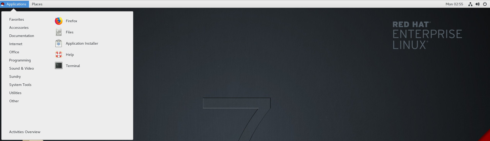
* Install resilient-circuits using **pip**:
  ```
  $ pip install resilient-circuits
  ```
  > **NOTE:** you will need a connection to the Internet to install.  We have pre-downloaded all necessary packages for this tutorial:
  > To install **without an Internet Connection:**
  > ```
  > $ pip install --no-index --find-links=/home/resadmin/Desktop/local_pip resilient-circuits
  > ```

  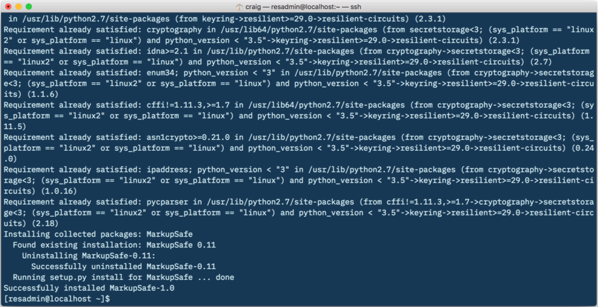
---
## Step 4: *Configure Resilient Circuits*
#### *Resilient Circuits configurations are maintained in the app.config file*
* Open terminal
* Auto generate the **app.config file**:
  ```
  $ resilient-circuits config -c
  ```
* This creates `/home/resadmin/.resilient/app.config`
* Open this file in **VS Code:**
  ```
  $ code /home/resadmin/.resilient/app.config
  ```
* Replace the contents with these configuration settings:
  ```
  [resilient]
  host=localhost
  port=443
  email=integrations@example.com
  password=ResDemo123
  org=Dev
  componentsdir=/home/resadmin/.resilient/components
  logdir=/home/resadmin/.resilient
  logfile=app.log
  loglevel=INFO
  cafile=false
  ```
* **Save** by pressing **CTRL+S**
* Open Terminal
* Create the **components directory:**
  ```
  $ mkdir /home/resadmin/.resilient/components
  ```
---
## Step 5: *Create User Accounts*
* Open **Terminal**
* Create two users:
  * An **Admin User**:
    ```
    $ sudo resutil newuser -createorg -org "Dev" -email "resadmin@example.com" -first "Res" -last "Admin" -password "ResDemo123"
    ```
    >**NOTE:** your sudo password is `resilient`
  * An **Integrations Engine User**:
    ```
    $ sudo resutil newuser -org "Dev" -email "integrations@example.com" -first "Orchestration" -last "Engine" -password "ResDemo123"
    ```
---
## Step 6: *Run Resilient Circuits*
* Open **Terminal**
* Run resilient-circuits: 
  ```
  $ resilient-circuits run
  ```
* You should get this output if `resilient-circuits` is running successfully:
  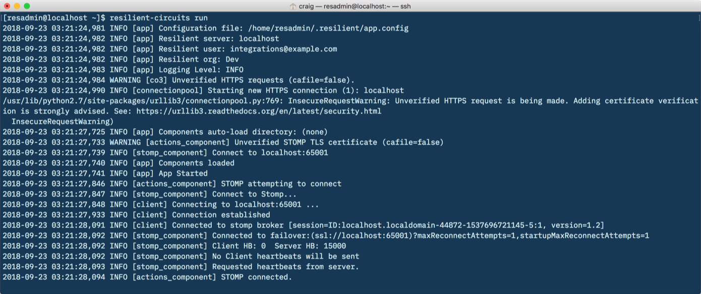
---
## Step 7: *Install FN Utilities*
* **Stop** `resilient-circuits` by pressing **CTRL+C**
* **Download** the package from [https://exchange.xforce.ibmcloud.com/hub/extension/2b6699ac8a3976b67dfbddee26dbe3a5](https://exchange.xforce.ibmcloud.com/hub/extension/2b6699ac8a3976b67dfbddee26dbe3a5)
  * *You may need to register for an **X-Force Exchange Account***
* Open **Terminal**
* Change to your **Downloads** folder:
  ```
  $ cd /home/resadmin/Downloads/
  ```
  > **NOTE:** you will need a connection to the Internet to download and install. We have pre-downloaded all necessary packages for this tutorial:
  > To install **without an Internet Connection:**
  > ```
  > $ pip install --no-index --find-links=/home/resadmin/Desktop/local_pip /home/resadmin/Desktop/local_appx/fn_utilities-1.0.3.tar.gz 
  > ```
  > * Skip to **importing the configurations**
* **Unzip** the package:
  ```
  $ unzip fn_utilities-x.x.x.zip
  ```
* **Install** FN Utilities using pip:
  ```
  $ pip install fn_utilities-x.x.x.tar.gz
  ```
  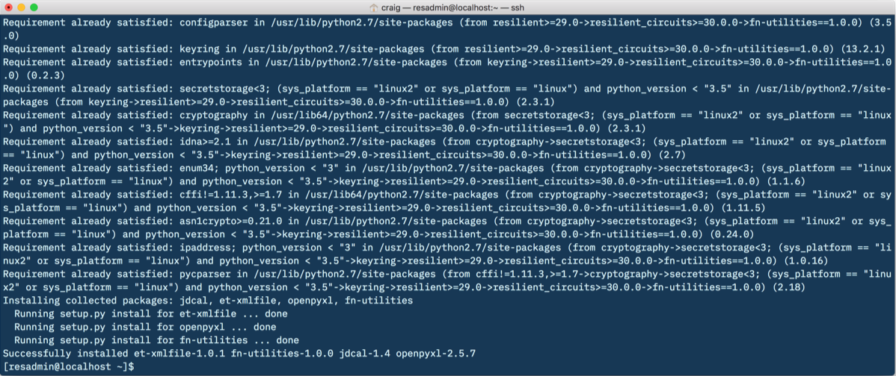
* Import **configurations**:
  ```
  $ resilient-circuits config -u
  ```
  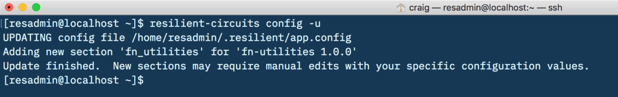
* Import **customizations**:
  ```
  $ resilient-circuits customize -y
  ```
  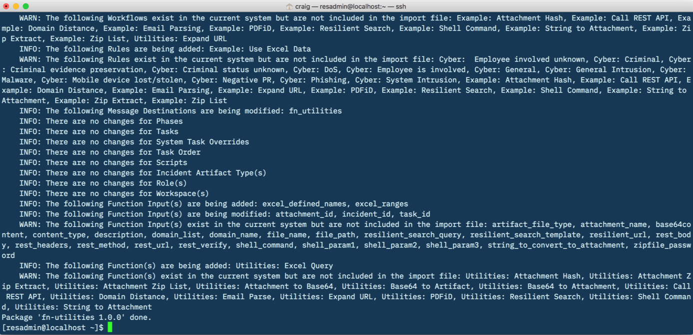
* **Start** Resilient Circuits:
  ```
  $ resilient-circuits run
  ```
  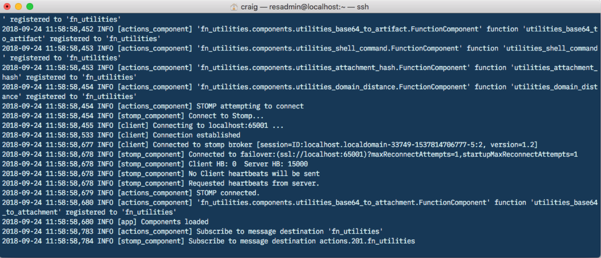
---
## Step 8: *Testing FN Utilities*
* Go to **Resilient UI**
  * Go to your Desktop and open **FireFox**
  * Go to: `https://localhost`
* Login:
  * Email: `resadmin@example.com`
  * Password: `ResDemo123`
* Create an **Incident**
  * Name: `Integrations Demo`
* Add an **Artifact** to that Incident
  * Type: `DNS Name`
  * Value: `resilientsystems.com`
* Click the **Take Action Button** and run the **Example: Shell Command** Workflow on that Artifact:
  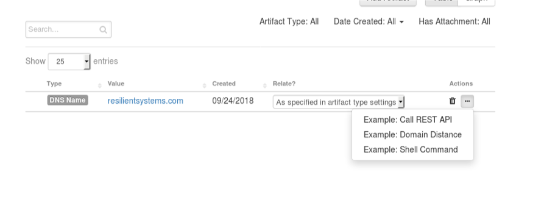
* Check your **terminal:**
  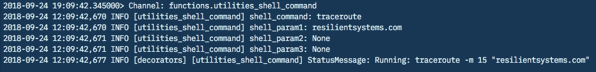
* See the results in the **Notes Tab** of your Resilient Incident:
  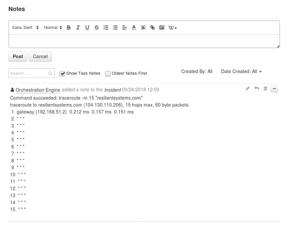
* Can also see **DEBUG Information** in the **Action Status** which is located just under the navigation bar on the right-hand side:
  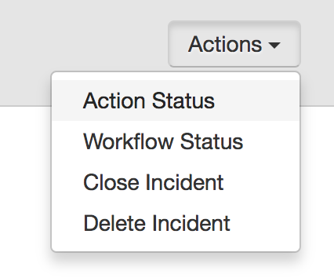
  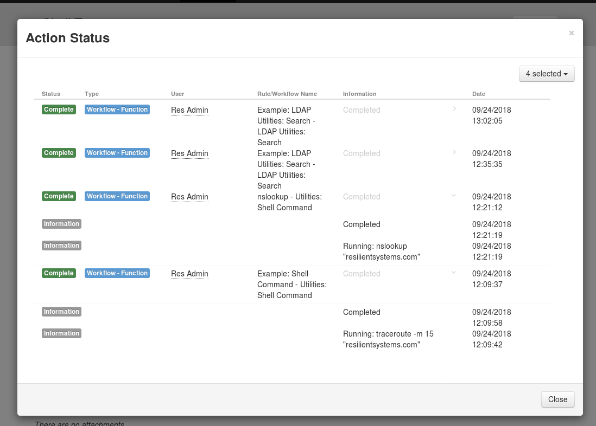
* You may find that `traceroute` is not installed on your VM. Ctrl+C quit resilient-circuits and then install with:
  ```
  $ sudo yum install -y traceroute
  ```
  * Restart `resilient-circuits run` after
  
---
## Step 9: *Create new Custom Workflow that uses our Shell Command Function*
* In the Resilient UI, go to **Customization Settings,** under your username on the right-hand side of the navigation bar
* Click the **Workflows Tab**
* **Create** a new Workflow
  * Name: **nslookup**
  * Object Type: **Artifact**
  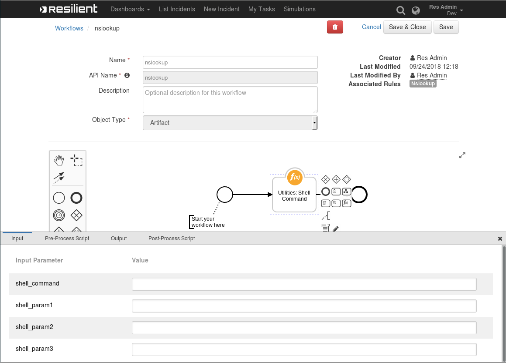
* Add an **End Event** *(the dark black circle icon)* to the canvas
* Add the function **Utilities: Shell Command** to the Workflow Canvas by clicking on the function icon and selecting **Utilities: Shell Command** from the dropdown menu
* Edit the **Pre-Process Script:**
  ```
  inputs.shell_command = "nslookup"
  inputs.shell_remote = False
  inputs.shell_param1 = artifact.value
  ```
  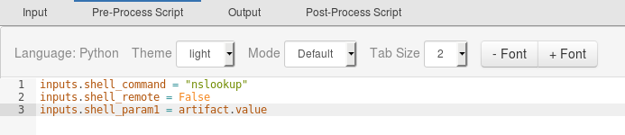
* Edit the **Post-Process Script:**
  ```
  note_text = u"Command succeeded: {}\n{}".format(results.commandline, results.stdout)

  incident.addNote(helper.createPlainText(note_text))
  ```
  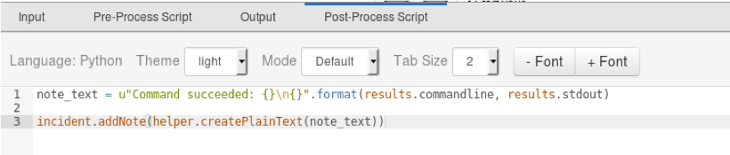
* Close the **Function Editor** and drag/scroll the function into view on the canvas
* Using the **connectors** *(the black arrow icon)*, join the start event to the function and then the function to the end event
  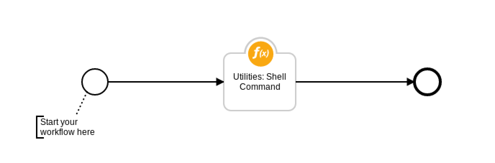

* Click **Save & Close**
---
## Step 10: *Create new Custom Rule that runs our Workflow*
* Click the **Rules Tab**
* Create a new **Menu Item Rule:**
  * Display Name: **Nslookup**
  * Object Type: **Artifact**
  * Workflows: **nslookup**
  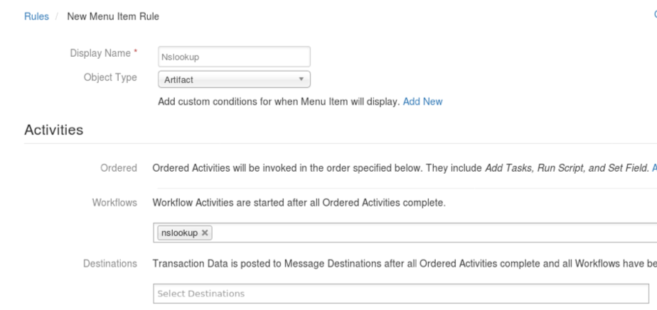
* Click **Save & Close**
---
## Step 11: *Run our Custom Workflow*
* Go to your **Incident**
* Click the **Artifacts Tab**
* Run `nslookup` workflow on the `resilientsystems.com` Artifact
  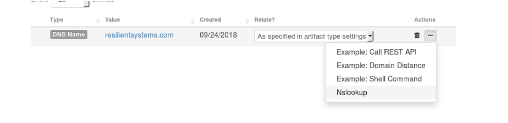
* See the **logs in the terminal** and results in the **Notes Tab**
  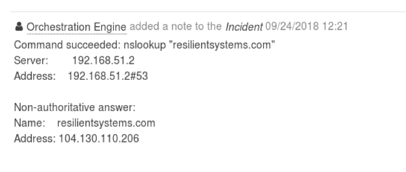
---
## Step 12: *Start Docker*
* Open **Terminal**
* **Stop** `resilient-circuits` by pressing **CTRL+C**
* **Start** docker:
  ```
  $ sudo systemctl start docker
  ```
* Check **docker** is running:
  ```
  $ docker ps -a
  ```
  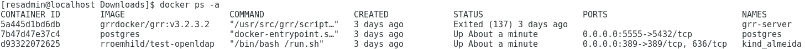
---
## Step 13: *Ensure OpenLDAP is Configured and Running*
* Run:
  ```
  $ ldapwhoami -vvv -h localhost -p 389 -D "cn=Philip J. Fry,ou=people,dc=planetexpress,dc=com" -x -w "fry"
  ```
  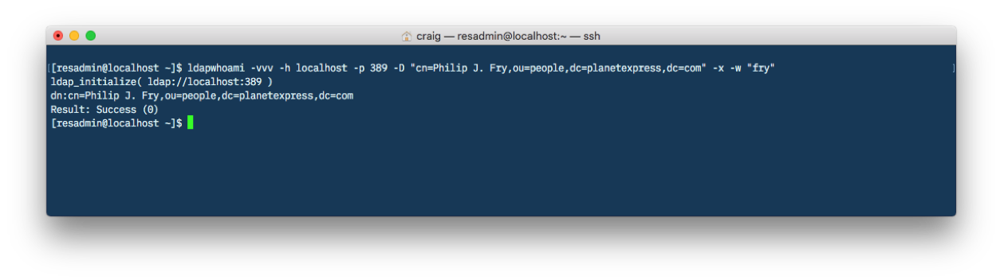
---
## Step 14: *Install the LDAP Utilities Function*
* This is very similar to install the previous `fn_utilities` function
* **Download** the package from [https://exchange.xforce.ibmcloud.com/hub/extension/72b8204066d3b290b68bae2eeb1942cd](https://exchange.xforce.ibmcloud.com/hub/extension/72b8204066d3b290b68bae2eeb1942cd)
* Open **Terminal**
* Change to your **Downloads** folder:
  ```
  $ cd /home/resadmin/Downloads/
  ```
  > **NOTE:** you will need a connection to the Internet to download and install. We have pre-downloaded all necessary packages for this tutorial:
  > To install **without an Internet Connection:**
  > ```
  > $ pip install --no-index --find-links=/home/resadmin/Desktop/local_pip /home/resadmin/Desktop/local_appx/fn_ldap_utilities-1.0.0.tar.gz 
  > ```
  > * Skip to **importing the configurations**
* **Unzip** the package:
  ```
  $ unzip fn_ldap_utilities-x.x.x.zip
  ```
* **Install** FN LDAP Utilities using pip:
  ```
  $ pip install fn_ldap_utilities-x.x.x.tar.gz
  ```
* Import **configurations**:
  ```
  $ resilient-circuits config -u
  ```
* Import **customizations**:
  ```
  $ resilient-circuits customize
  ```
  > **NOTE:** Only type **Y** to the `fn_ldap_utilities` prompts

  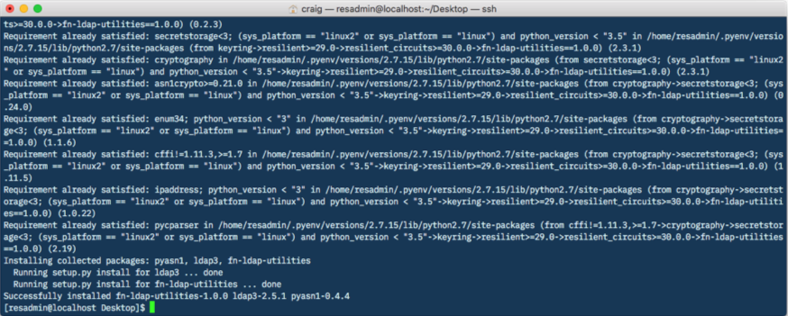
* **Start** resilient-circuits:
  ```
  $ resilient-circuits run
  ```
---
## Step 15: *Configure LDAP Utilities*
* Open `/home/resadmin/.resilient/app.config` in **VS Code**:
  ```
  $ code /home/resadmin/.resilient/app.config
  ```
* Update the settings under `[fn_ldap_utilities]`:
  ```
  [fn_ldap_utilities]
  ldap_server=127.0.0.1 
  ldap_port=389 
  ldap_use_ssl=False 
  ldap_auth=SIMPLE 
  ldap_user_dn=cn=admin,dc=planetexpress,dc=com 
  ldap_password=GoodNewsEveryone 
  ldap_is_active_directory=False 
  ldap_connect_timeout=10
  ```
  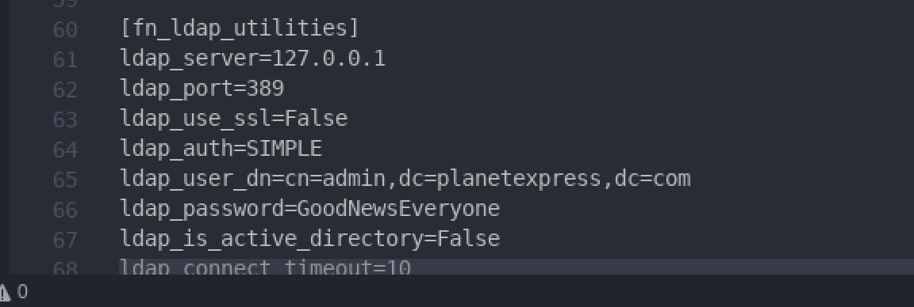
 * Update **Search Base** in LDAP Search Function:
      * Customization Settings > Workflows > **Example: LDAP Utilities: Search**
      * Click Search Function
      * Edit ldap_search_base in the **Pre-Processing Script**
        ```python
        inputs.ldap_search_base = "dc=planetexpress,dc=com"
        inputs.ldap_search_filter = "(&(mail=%ldap_param%))"
        inputs.ldap_search_param =  artifact.value
        ```
        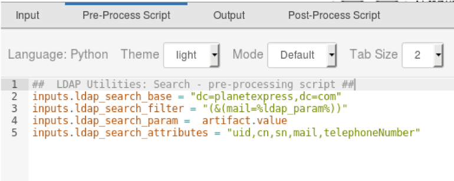
* Click **Save & Close**
---
## Step 16: *Run LDAP Search Function*
* Go to your Incident
* Add an **Artifact** to that Incident
  * Type: `Email Sender`
  * Value: `fry@planetexpress.com`
* Click the **Take Action Button** and run the **Example: LDAP Utilities: Search**
  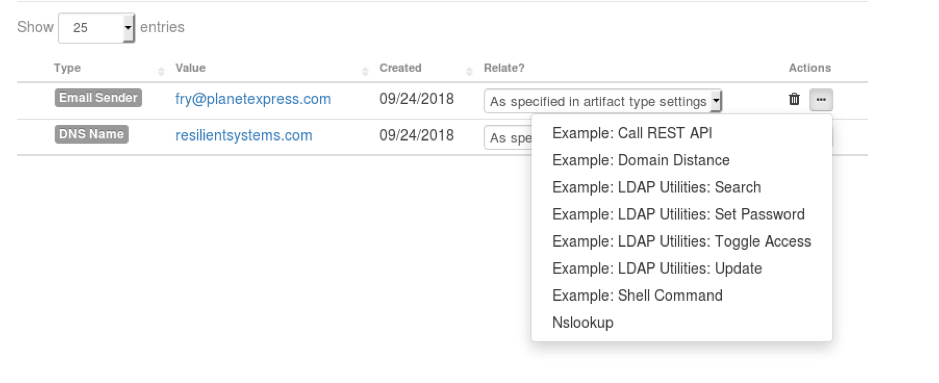
* Check your **Terminal Output**
  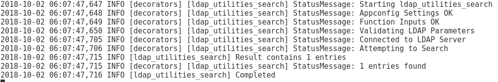
---
## Step 17: *View LDAP Search Results in Resilient UI*
* Go to Customization Settings -> Layouts -> Manage Tabs
* Add a **New Tab:**
  * Incident Tabs > Manage Tabs > + Add Tab
  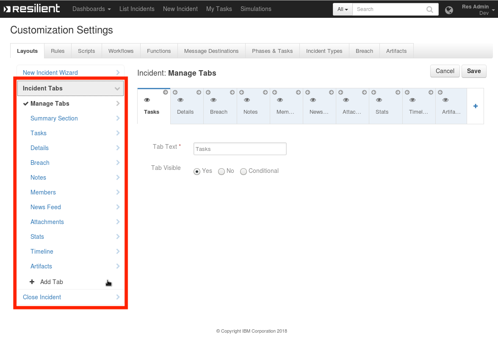
  * Tab Text: **Users & Systems**
  * Tab Visible: **Yes**
  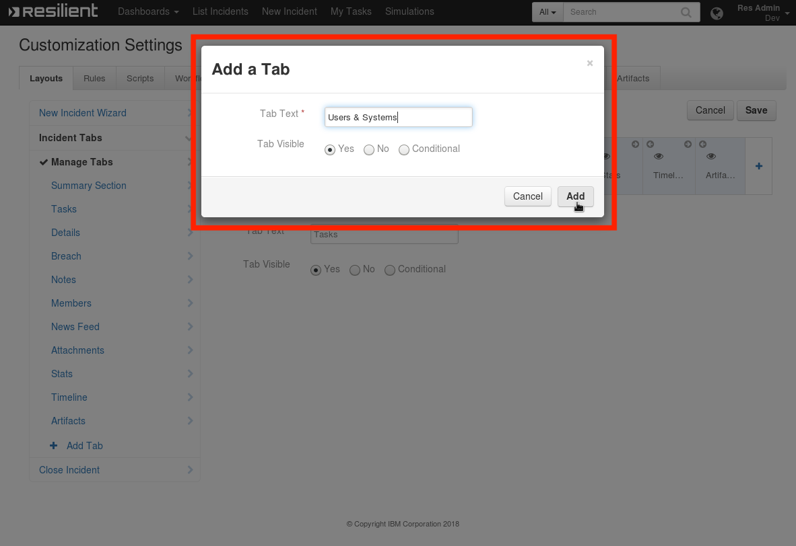
  * Click **Add**
* Now **drag** the **LDAP Query results** Datatable into the Users & Systems Tab:
  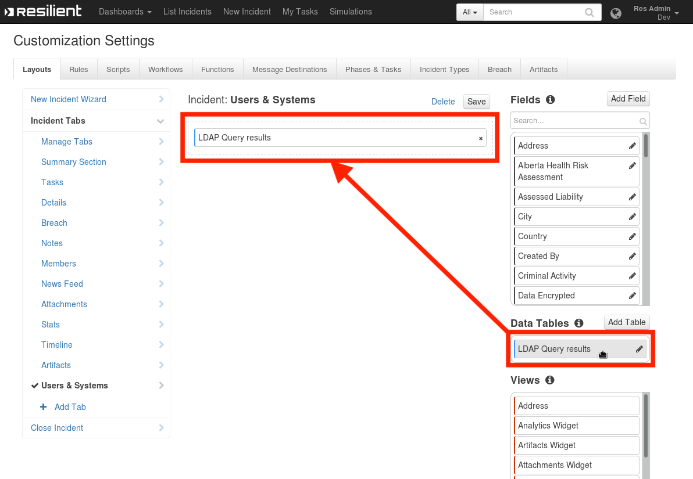
* **Save** the layout and go back to your incident
* Go to the new **Users & Systems** tab, you will see the LDAP lookup result:
  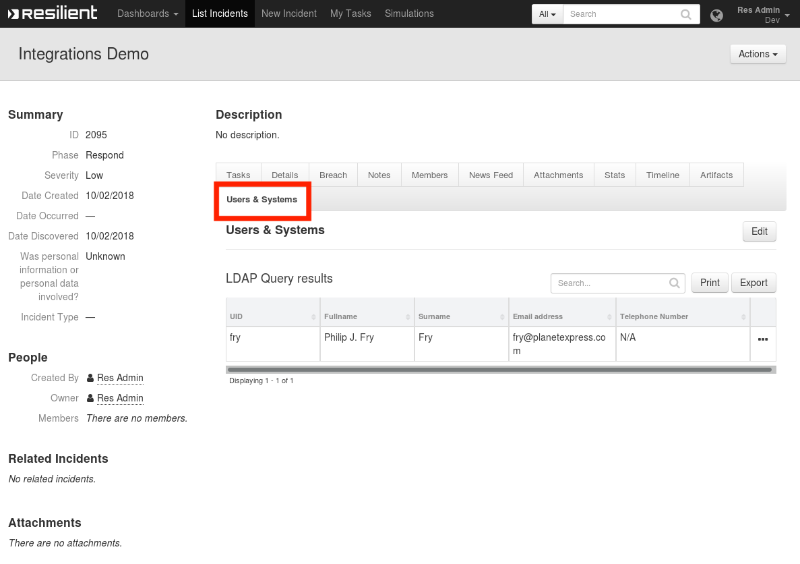
* **Add a new Email Sender Artifact** of `professor@planetexpress.com`
* Run the LDAP Search Function again
* Check the result
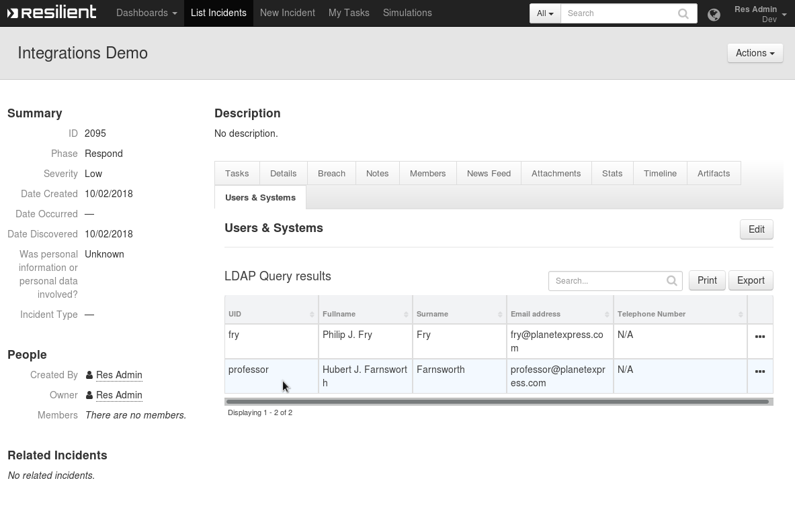
---
## Step 18: *Install & Configure the CMDB Function*
* **Stop** `resilient-circuits` by pressing **CTRL+C**
* **Download** the package from [https://exchange.xforce.ibmcloud.com/hub/extension/a51eb932122b9f71062e9ed8705f35f0](https://exchange.xforce.ibmcloud.com/hub/extension/a51eb932122b9f71062e9ed8705f35f0)
* Open **Terminal**
* Change to your **Downloads** folder:
  ```
  $ cd /home/resadmin/Downloads/
  ```
  > **NOTE:** you will need a connection to the Internet to download and install. We have pre-downloaded all necessary packages for this tutorial:
  > To install **without an Internet Connection:**
  > ```
  > $ pip install --no-index --find-links=/home/resadmin/Desktop/local_pip /home/resadmin/Desktop/local_appx/fn_odbc_query-1.0.0.tar.gz 
  > ```
  > * Skip to **importing the configurations**
* **Unzip** the package:
  ```
  $ unzip fn_odbc_query-x.x.x.zip
  ```
* **Install** FN ODBC using pip:
  ```
  $ pip install fn_odbc_query-x.x.x.tar.gz
  ```
* Import **configurations**:
  ```
  $ resilient-circuits config -u
  ```
* Import **customizations**:
  ```
  $ resilient-circuits customize
  ```
  > **NOTE:** Only type **Y** to the `fn_odbc_query` prompts

* Open the `app.config` file in **VS Code**
* **Replace** the `sql_connection_string` value with below:
  ```
  [fn_odbc_query]
  sql_connection_string=Driver={PostgreSQL};Server=localhost;Port=5555;Database=postgres;Uid=postgres;Pwd=resilient;
  ```
* **Test** that our PSQL Database is working:
  ```
  psql -h localhost -p 5555 -U postgres -W postgres -c "select * from systems;"
  ```
  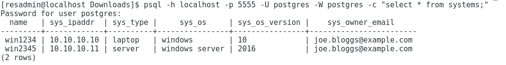
* **Start** resilient-circuits:
  ```
  $ resilient-circuits run
  ```
  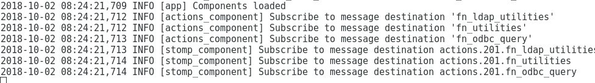
* In the Resilient UI, **add a new Workflow**
  * Name: `CMDB Query`
  * Object Type: `Artifact`
* Insert the `fn_odbc_query` function in to the canvas, add an **End Event** and connect the workflow all together using the **connectors**
* Click the function's **edit icon** and update the function input: `sql_query` with the following query:
  ```
  select name as sql_column_1, sys_ipaddr as sql_column_2, sys_type as sql_column_3, sys_os_version as sql_column_4, sys_owner_email as sql_column_5 from systems where name = ?
  ```
  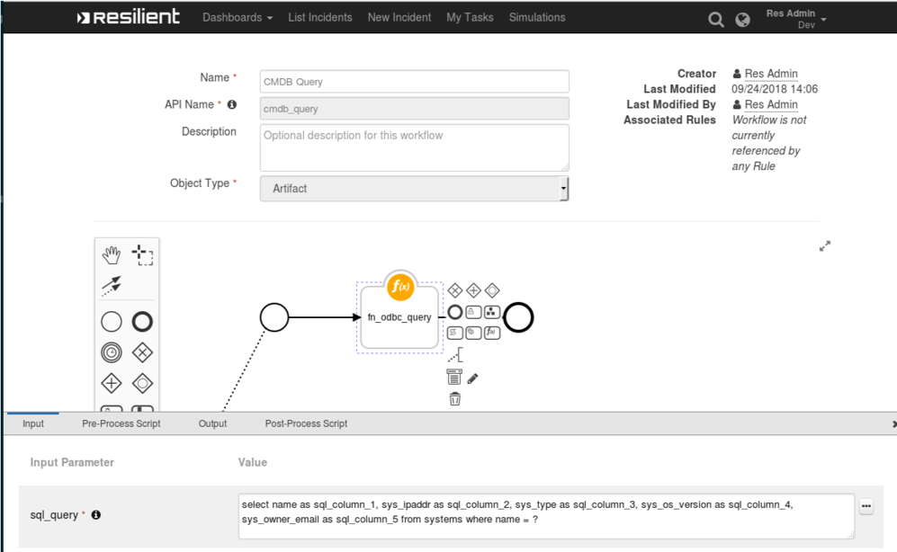
* Update **Pre-Processing Script**:
  ```python
  inputs.sql_condition_value1 = artifact.value
  ```
* Update **Post-Processing Script**:
  ```python
  #  Globals

  # This list contains Resilient data table api field names.
  # Exclude fist two columns 'sql_artifact_value' and 'sql_timestamp' from this list.
  # Modify this list acording to your Resilent data table fields.
  RESILENT_DATATABLE_COLUMN_NAMES_LIST = [
    "sql_column_1",
    "sql_column_2",
    "sql_column_3",
    "sql_column_4",
    "sql_column_5"]
    
  # Processing
  from java.util import Date

  if results.entries is not None:
    for entry in results.entries:
      row = incident.addRow("sql_query_results_dt")
    
      row.sql_artifact_value = artifact.value
      row.sql_timestamp = Date()
    
      for item in RESILENT_DATATABLE_COLUMN_NAMES_LIST:
        if entry[item] is not None:
          try:
            row[item] = entry[item]
          except IndexError:
            row[item] = ""
  ```
* Click **Save & Close**
* Click the **Rules tab** and create a new **Menu Item Rule:**
  * Name: `CMDB Lookup`
  * Object Type: `Artifact`
  * Workflows: `CMDB Query`
  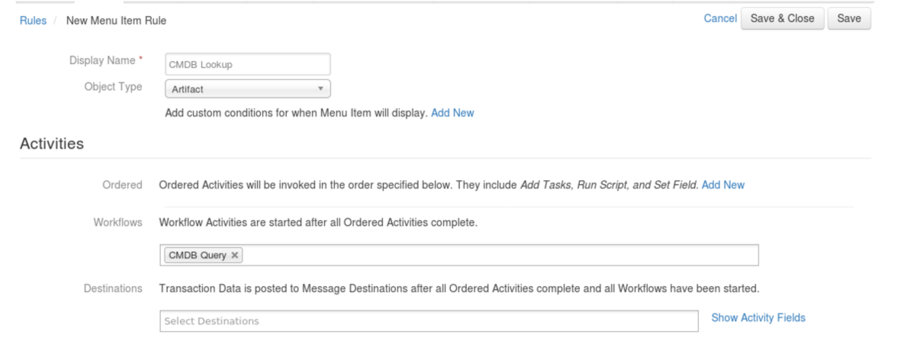
* Click **Save & Close**
* Go to your Incident and add a new **Artifact:**
  * Type: `System Name`
  * Value: `win1234`
  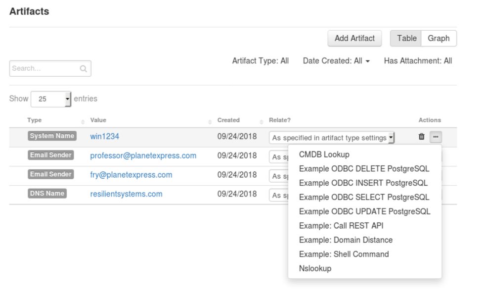
* **Take Action** with the CMDB Lookup Workflow on the Artifact and check the **terminal output**
* Once again you will need **add the SQL Results Table** to your *Users and Systems* Tab 
  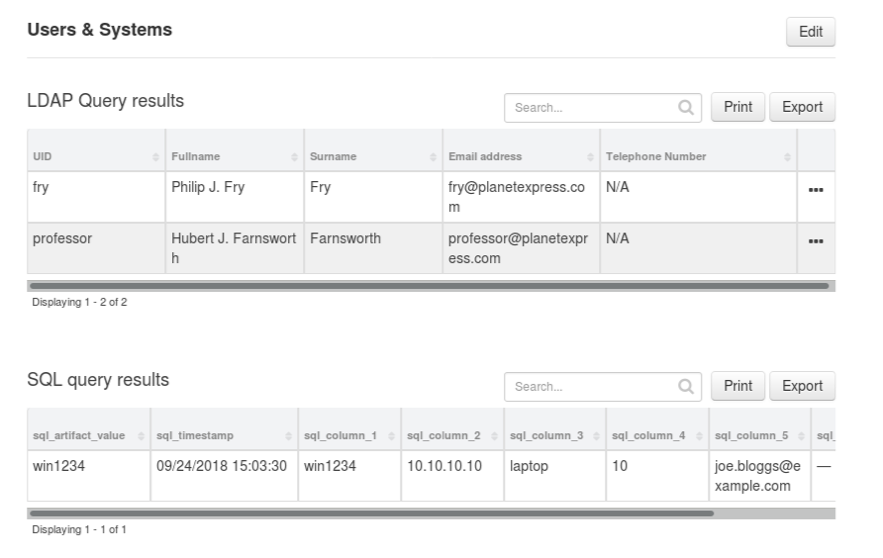
---
## Step 19: *Setup GRR*
* **Restart** the GRR **Docker Container**
  ```
  $ docker ps -a
  $ docker restart <CONTAINER-ID>
  ```
  
* First we need to link your GRR server to your RHEL Desktop
* Open and new tab in **FireFox**
* Go to: `localhost:8000`
* Enter username and password:
  * Username: `admin`
  * Password: `resilient` 
* Click **Manage Binaries**
* Download `linux/installers / grr_3.2.3.2_i386.rpm` and save to your **Downloads**
  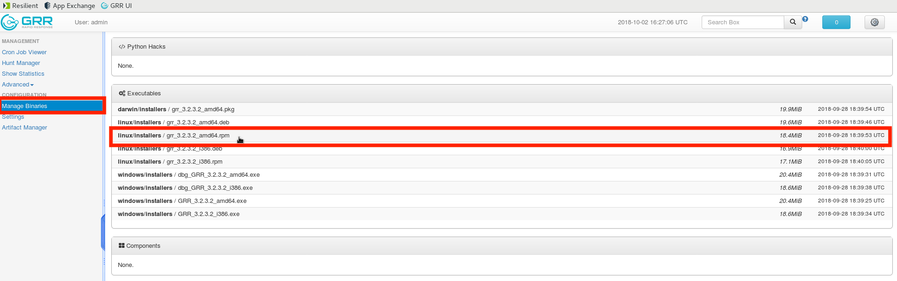
* Open **Terminal**
* Change to your **Downloads** folder:
  ```
  $ cd /home/resadmin/Downloads/
  ```
* **Install** the package:
  ```
  $ sudo rpm -ivh grr_3.2.3.2_amd64.rpm
  ```
* In GRR, click the **magnifying glass on the search box**
* You will see **your agent is running**
  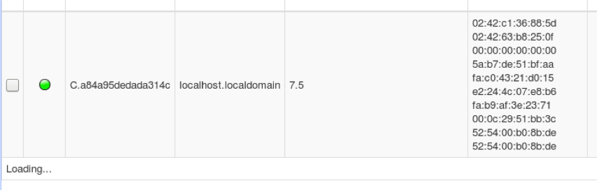
>**NOTE:** If the light is yellow, the GRR Client is not running. To **restart the GRR Client** use:
> ```
> $ sudo systemctl restart grr
> ```
---
## Step 20: *Add GRR Message Destination in Resilient UI*
* Open **Resilient UI**
* Customization Settings > **Message Destination Tab**
* Add a new **Message Destination**
  * Type: `Queue`
  * Name: `fn_grr`
  * Programmatic Name: `fn_grr`
  * Expect Acknowledgement: `Yes`
  * Users: `Orchestration Engine (integrations@example.com)`
  
* Click **Create**
---
## Step 20: *Add New GRR Function in Resilient UI*
* Go to the **Functions Tab**
* Create a **New Function:**
  * Name: `GRR Search`
  * API Name: `grr_search`
  * Message Destination: `fn_grr`
  * Description: `A function to search for GRR Agent`
  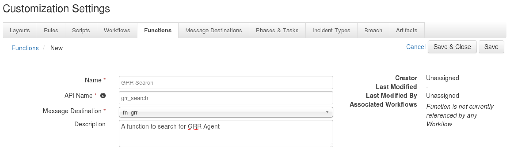
* Create two **Inputs Fields:**
  * Click **Add Field:**
    * Type: `Text`
    * API Access Name: `grr_search_value`
    * Requirement: `Always`
    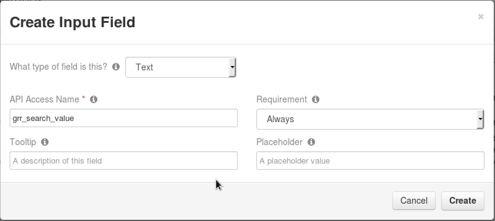
  * Click **Create**
  * Add another field by clicking **Add Field**
    * Type: `Select`
    * API Access Name: `grr_search_type`
    * Requirement: `Always`
    * Add/Edit Values: `ip user host`
    * Blank Option: `No`
  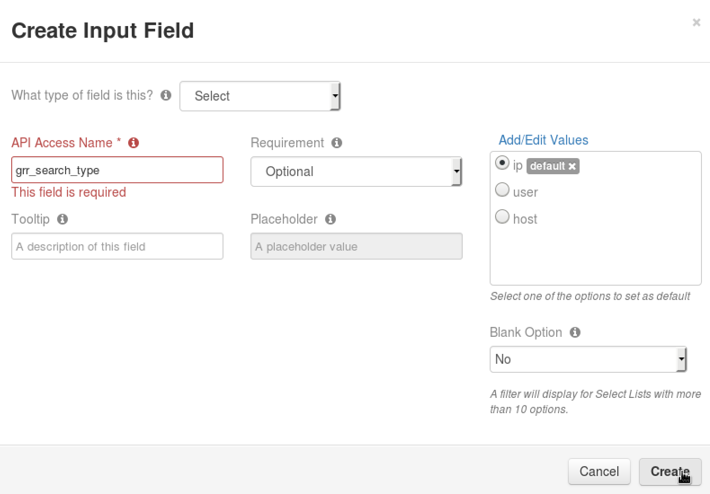
  * Click **Create**
* Drag the two inputs from the right panel into the **Inputs** panel
  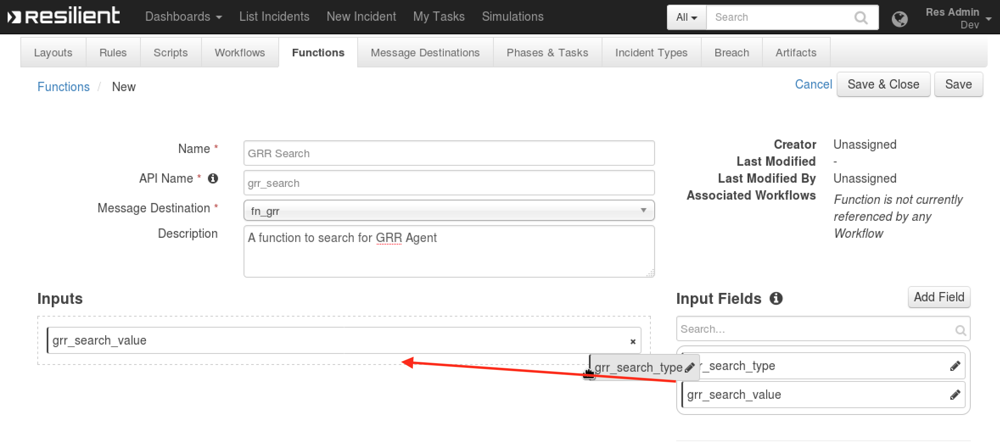
* Click **Save & Close**
---
## Step 21: *Add New GRR Workflow in Resilient UI*
* Go to the **Workflows Tab**
* Click **New Workflow**
  * Name: `Example: GRR Search by IP`
  * API Name: `example_grr_search_by_ip`
  * Description: `An example Workflow using the GRR Search Function to get a GRR Agents information using their IP Address`
  * Type: `Artifact`
  
* Add the **GRR Search Function** to the **Workflow Canvas** and join to **Start and End Events:**
  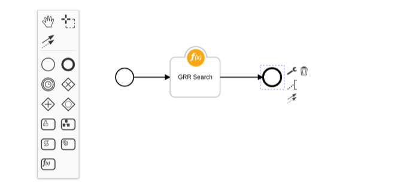
* Make sure the input `grr_search_type` is set to **ip** in the **Function Inputs Tab,** under the Workflow Canvas
* Edit the **Pre-Process Script:**
  ```python
  inputs.grr_search_value = artifact.value
  ```
* Edit the **Post-Process Script:**
  ```python
  if results.success:
    for entry in results["agent_data"]:

      note_text = """<b>system_product_name:</b> {0}
                </br><b>system_uuid:</b> {1}
                </br><b>system_manufacturer:</b> {2}
                </br><b>release:</b> {3}
                </br><b>machine:</b> {4}
                </br><b>version:</b> {5}""".format(entry["hardware_info"]["system_product_name"],
                                              entry["hardware_info"]["system_uuid"],
                                              entry["hardware_info"]["system_manufacturer"],
                                              entry["os_info"]["release"],
                                              entry["os_info"]["machine"],
                                              entry["os_info"]["version"])
      incident.addNote(helper.createRichText(note_text))
  else:
    note_text = "{} system not found in GRR".format(search_value)
    incident.addNote(helper.createPlainText(note_text))
  ```
* Click **Save & Close**
---
## Step 22: *Add New GRR Rule in Resilient UI*
* Go to the **Rules Tab**
* Click **New Rule** and create a new **Menu Item Rule:**
  * Display Name: `GRR Search by IP`
  * Object Type: `Artifact`
  * Workflows: `Example: GRR Search by IP`
  > **NOTE:** This could be an `Automatic Rule` too, however for testing we will use a `Menu Item Rule`

  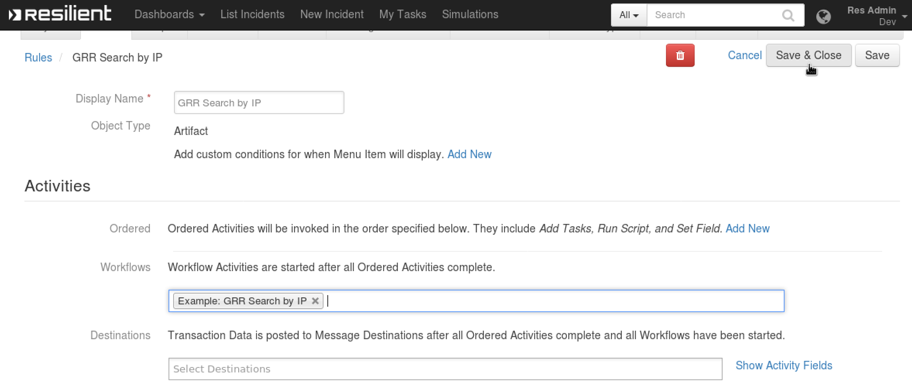
---
## Step 23: *Add Python Code for GRR Function*
* Firstly we need to export our **Resilient UI Customizations** we just created
* In the **Resilient UI** go to Administrator Settings > Organization > Export and click **Export**
  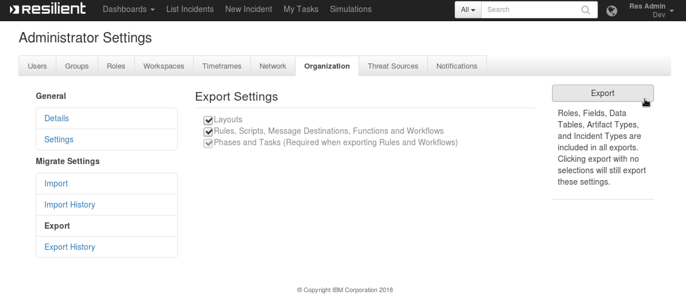

* Save the file to your **Downloads Directory**
* Open **Terminal**
* Change directory to your **components directory**
  ```
  $ cd /home/resadmin/.resilient/components
  ```
* Generate the resilient code:
  ```
  $ resilient-circuits codegen -f grr_search
  ```
  > **NOTE:** if you see this error:
  > 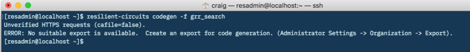
  > You forgot to **Export** from the Resilient UI. You will need to Export and then run the `codegen` command again.
* Open the file in **VS Code:**
  ```
  $ code grr_search.py
  ```
  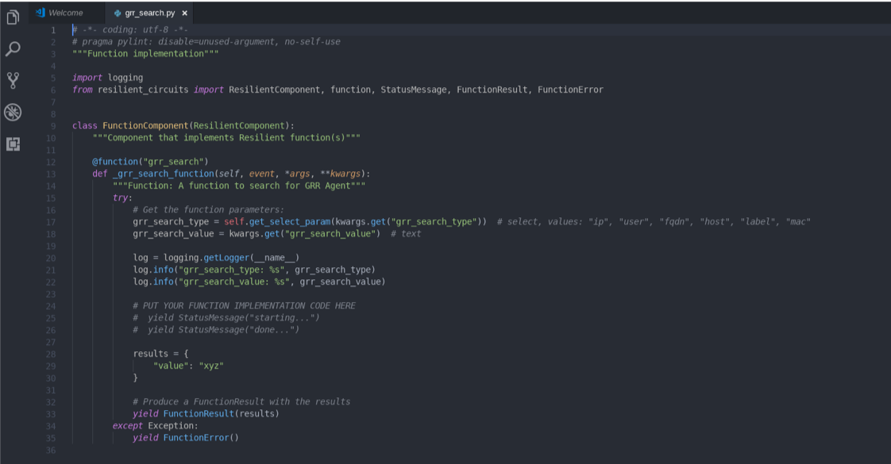
---
## Step 24: *Develop GRR Script*
* Whilst we can develop a function in place, its often **easier to develop as a Python Script** then integrate that script into a **Resilient Function**. This means testing is quicker and if we already have an example script its quicker to get started. 
* Look at the **documentation** for GRR
  * There is a Python API Client: https://github.com/google/grr/tree/master/api_client/python
* Follow the installation instructions to **install the API Client**:
  ```
  $ pip install grr-api-client 
  $ pip install future
  ```
* Create a new file in the VSCode. Call it **grr_test.py** and save it in the home directory
  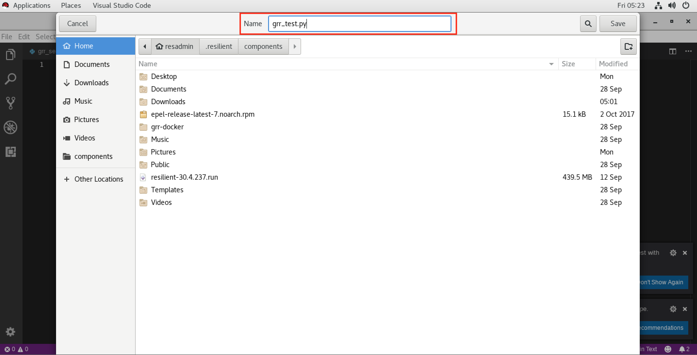
* First we need to **import the GRR Library**, then need to **define our connection params**. Then using the docs we can see we need to **create a `grrapi object`**:
  ```python
  from grr_api_client import api

  grr_server="http://localhost:8000"
  grr_user="admin"
  grr_pwd="resilient"
  verify_cert=False

  grrapi = api.InitHttp(api_endpoint=grr_server,
                        auth=(grr_user, grr_pwd),verify=verify_cert)
  ```
* Again, using the documentation, **create a search:**
  * The format is `SearchClients(ip:10.10.10.10)`
  ```python
  grr_search_value = "127.0.0.1"
  grr_search_type = "ip"
  search_result = grrapi.SearchClients("{}:{}".format(grr_search_type,grr_search_value))
  ```
* Now add in a **for loop** to print the results:
  ```python
  for client in search_result:
    print (client.client_id)
  ```
* Code should look like:
  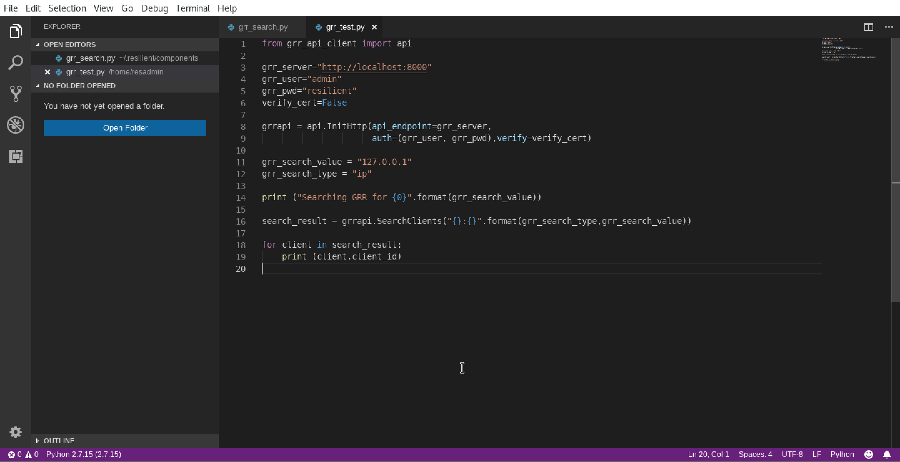
* Now run the script. You can do this within **VS Code**
  * Right-Click the file and click **run python file in terminal:**
  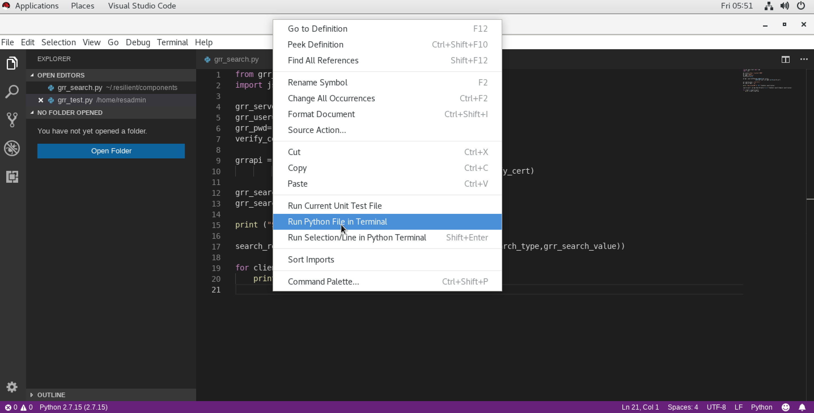
* Check the output. If you see a print out of the **client_id** then the script ran successfully:
  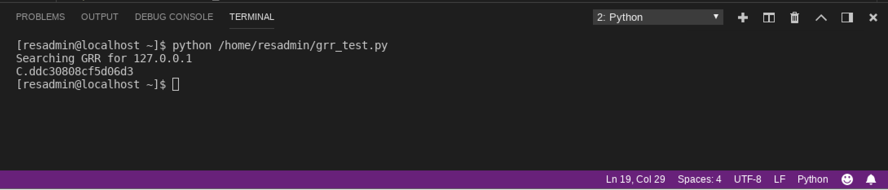
* The **test script** is complete
---
## Step 25: *Convert the Test Script into a Resilient Function*
* **Highlight and copy** all of your test script 
* Open **grr_search.py** and paste the test script overwriting the `# PUT YOUR FUNCTION IMPLEMENTATION CODE HERE` on **line 24**
  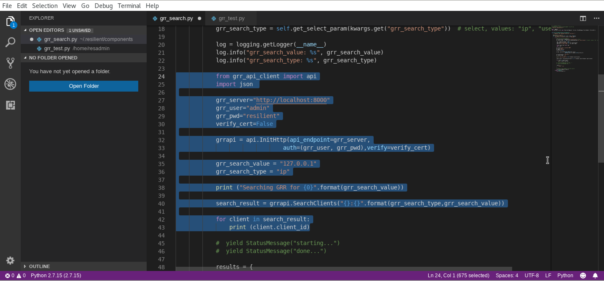
* Ensure the code's **indentation is correct** using tab
* We need to tidy some things up:
  1. Move the import to the top of the file 
  2. Remove the **grr_search_value** and **search_type** as these are already declared at the top as inputs to the function 
  3. Use **StatusMessage** instead of print statements
    * StatusMessages inform the user in the Resilient UI
  4. Create the **results** dictionary by looping the **search_results** and generating the data to return to the appliance
* Here is all the code:
  ```
  # -*- coding: utf-8 -*-
  # pragma pylint: disable=unused-argument, no-self-use
  """Function implementation"""

  import logging
  from resilient_circuits import ResilientComponent, function, StatusMessage, FunctionResult, FunctionError
  from grr_api_client import api

  class FunctionComponent(ResilientComponent):
      """Component that implements Resilient function(s)"""

      def __init__(self, opts):
          """constructor provides access to the configuration options"""
          super(FunctionComponent, self).__init__(opts)
          self.options = opts.get("fn_grr", {})

      @function("grr_search")
      def _grr_search_function(self, event, *args, **kwargs):
          """Function: A function to search for GRR Agent"""
          try:
              # Get the function parameters:
              grr_search_type = self.get_select_param(kwargs.get("grr_search_type"))  # select, values: "ip", "user", "host"
              grr_search_value = kwargs.get("grr_search_value")  # text

              log = logging.getLogger(__name__)
              log.info("grr_search_type: %s", grr_search_type)
              log.info("grr_search_value: %s", grr_search_value)

              # Set the connection parameters
              grr_server="http://localhost:8000"
              grr_user="admin"
              grr_pwd="resilient"
              verify_cert=False

              # Setup the connection
              grrapi = api.InitHttp(api_endpoint=grr_server,
                                  auth=(grr_user, grr_pwd),verify=verify_cert)

              # Inform the user
              yield StatusMessage("Starting search for {}".format(grr_search_value))

              # Search the clients
              # Search Format: "ip:127.0.0.1"
              search_result = grrapi.SearchClients("{}:{}".format(grr_search_type,grr_search_value))

              agent_data = []
              success = True

              # Set success to False if no agents found
              if search_result == None:
                  success = False
            
            # Loop the results and append some info the the agent_data list
              else:
                  for agent in search_result:

                      hardware_info = {
                          "system_manufacturer": str(agent.data.hardware_info.system_manufacturer),
                          "system_product_name": str(agent.data.hardware_info.system_product_name),
                          "system_uuid": str(agent.data.hardware_info.system_uuid)
                      }

                      os_info = {
                          "release": str(agent.data.os_info.release),
                          "version": str(agent.data.os_info.version),
                          "machine": str(agent.data.os_info.machine)
                      }

                      entry = {
                          "agent_id": str(agent.client_id),
                          "hardware_info": hardware_info,
                          "os_info": os_info
                      }
                      agent_data.append(entry)

              # Create the results dictionary
              results = {
                  "success": success,
                  "grr_search_value": grr_search_value,
                  "grr_search_type": grr_search_type,
                  "agent_data": agent_data
              }

              # Some logging
              log.info("Sending results to Resilient Appliance")
              log.info(results)
              yield StatusMessage("Complete")

              # Send the results to the appliance
              yield FunctionResult(results)
          except Exception:
              yield FunctionError()
  ```
* **Save** the file
* Open **Terminal**
* Start **resilient-circuits**
  ```
  $ resilient-circuits run
  ```
  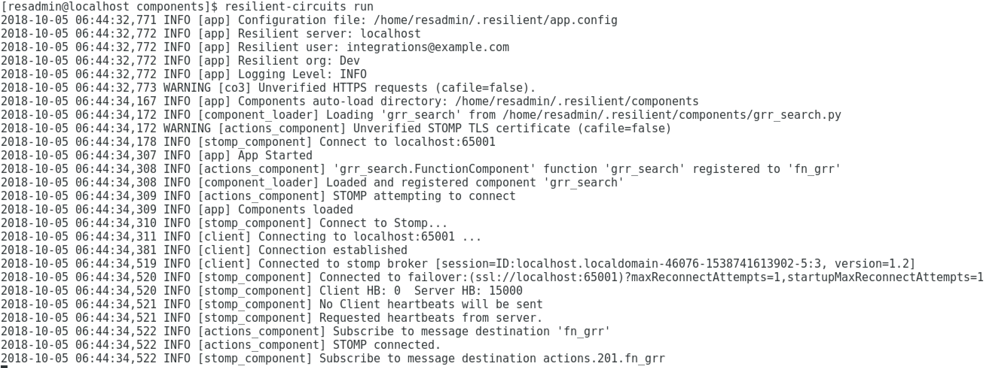
---
## Step 26: *Run our new Custom Workflow*
* Add an **Artifact** to you test Incident
  * Type: `IP Address`
  * Value: `127.0.0.1`
* Click the **Take Action Button** and run the **GRR Search by IP** Workflow on that Artifact:
  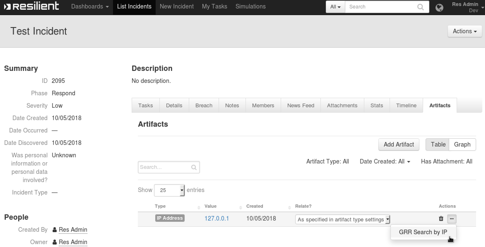
* Check the **Notes Tab** to see the results:
  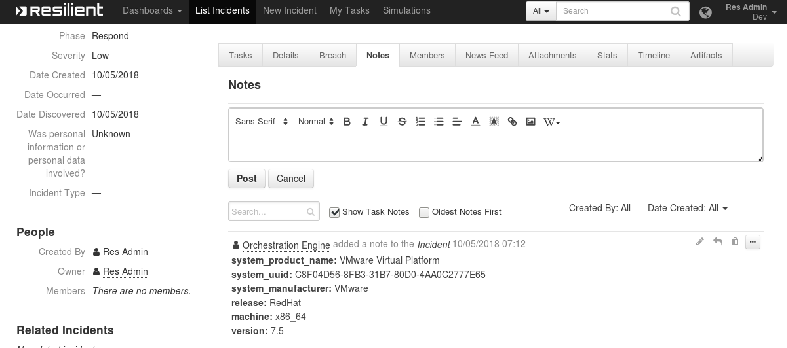
---
## Step 27: *Store Credentials in app.config file*
* Open `/home/resadmin/.resilient/app.config` in **VS Code**
* Append these settings to the end of the file:
  ```
  [fn_grr]
  grr_server=http://localhost:8000
  grr_user=admin
  grr_pwd=resilient
  verify_cert=False
  ```
* Update the function code to read from the `app.config` file:
  ```python
  # Set the connection parameters
  grr_server=self.options["grr_server"]
  grr_user=self.options["grr_user"]
  grr_pwd=self.options["grr_pwd"]
  verify_cert=self.options["verify_cert"]
  ```
* **Stop** `resilient-circuits` by pressing **CTRL+C**
* **Start** resilient-circuits:
  ```
  $ resilient-circuits run
  ```
* **Run & Test** the Workflow again
---
## Step 28: *Package your Message Destination, Function, Workflow and Rule*
* In the **Resilient UI** go to Administrator Settings > Organization > Export and click **Export**
  
* Save the file to your **Downloads Directory**
* Open **Terminal**
* **Stop** `resilient-circuits` by pressing **CTRL+C**
* Change Directory to your **Desktop**
  ```
  $ cd /home/resadmin/Desktop
  ```
* Generate the **Resilient Function Package:**
  ```
  $ resilient-circuits codegen -p fn_grr -m fn_grr --rule "GRR Search by IP"
  ```
* Open the `fn_grr` directory in **VS Code:**
  ```
  $ code fn_grr/
  ```
* Replace the generated function code with our previously created function:
  * Open `~/.resilient/components/grr_search.py` in **VS Code**
  * Select all and **copy**
  * Open `~/Desktop/fn_grr/components/grr_search.py`
  * Select all and **paste**
  * **Save** the file
* Add **package dependencies** to `fn_grr/setup.py`:
  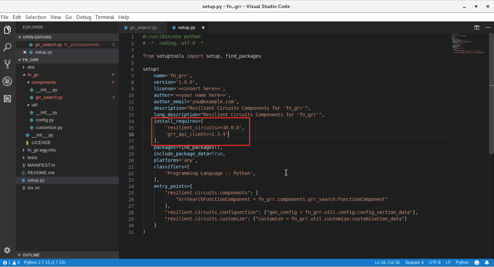
* Also update your **name**, **email** and **license type** in the `setup.py` file:
  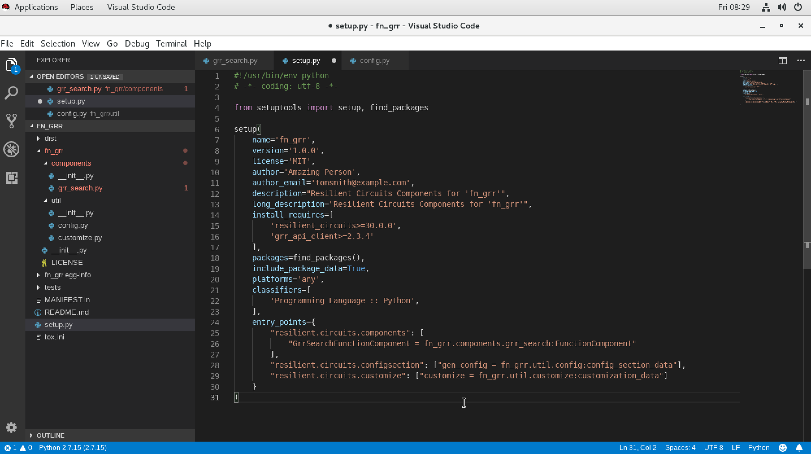
* Add **default app.config settings** to `fn_grr/util/config.py`:
  ```
  # -*- coding: utf-8 -*-

  """Generate a default configuration-file section for fn_grr"""

  from __future__ import print_function


  def config_section_data():
      """Produce the default configuration section for app.config,
        when called by `resilient-circuits config [-c|-u]`
      """
      config_data = u"""[fn_grr]
  grr_server=127.0.0.1
  grr_user=user
  grr_pwd=password
  #Can be True/False
  verify_cert=False
  """
      return config_data
  ```
  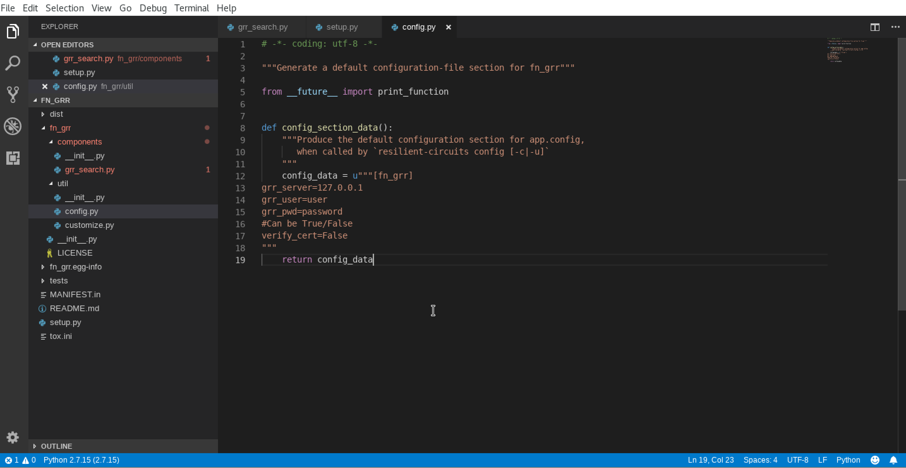
* **Comment out (#)** the `componentsdir` in your `app.config` file and **Save** it
  ```
  #componentsdir=/home/resadmin/.resilient/components
  ```
  >**NOTE:** We do this so any functions in that directory do not get loaded anymore
* Open **Terminal**
* Change Directory into the **fn_grr** directory:
  ```
  $ cd /home/resadmin/Desktop/fn_grr
  ```
* **Package** the Resilient Function:
  ```
   $ python setup.py sdist
  ```
* **Install** the package:
  ```
  $ pip install dist/fn_grr-1.0.0.tar.gz 
  ```
  > **NOTE:** We can check the package was installed by running:
  > ```
  > $ resilient-circuits list
  > ```
* **Start** resilient-circuits:
  ```
  $ resilient-circuits run
  ```
* **Run the Workflow** again on the Artifact and test all works ok
---
## [Optional] Step 29: *Share Packages amongst Organizations/Resilient Instances*
#### *This is useful for developing and testing your Workflows in one org/instance, then transferring it to another/production instance*
* Create another user in a new organization
  ```
  $ sudo resutil newuser -createorg -org "New Org" -email "testuser@example.com" -first "Test" -last "User" -password "ResDemo123"
  ```
* **Login** to Resilient UI using that user
* Go to Customization Settings > Workflows
* Note it is **blank**
* Open your `app.config` file
* Change **email** to: `testuser@example.com` and **org** to `New Org`:
  ```
  [resilient]
  host=localhost
  port=443
  email=testuser@example.com
  password=ResDemo123
  org=New Org
  #componentsdir=/home/resadmin/.resilient/components
  logdir=/home/resadmin/.resilient
  logfile=app.log
  loglevel=INFO
  cafile=false
  ```
* Open **Terminal**
* Ensure the GRR Function is installed:
  ```
  $ resilient-circuits list
  ```
* **Import the customizations** into this New Org:
  ```
  $ resilient-circuits customize
  ```
* Press **Y** twice to agree to import the customizations
* **Start** Resilient Circuits:
  ```
  $ resilient-circuits run
  ```
* Go back into the **Resilient UI** and refresh the **Workflows Tab**. You will see the GRR Workflow
* Now test it. Create an **Incident** with an **Artifact**:
  * Type: `IP Address`
  * Value: `127.0.0.1`
## [Optional] Step 30: *Setup VS Code to Debug Resilient Functions*
* **Stop** `resilient-circuits` by pressing **CTRL+C**
* You need to find the location of where **resilient-circuits** is installed:
  ```
  $ pip show resilient-circuits
  ```
  
* **Copy** the location and open **VS Code**
* On the left-hand side, click the **Debug** icon:
  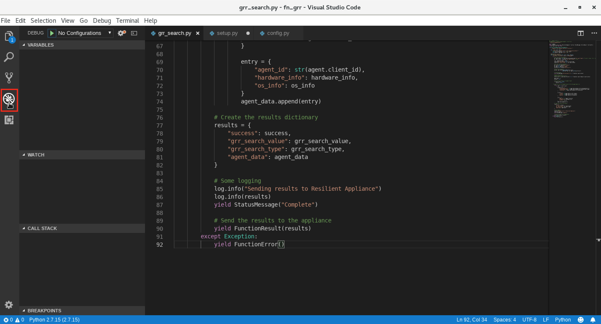
* Click the dropdown and click **Add Configuration:**
  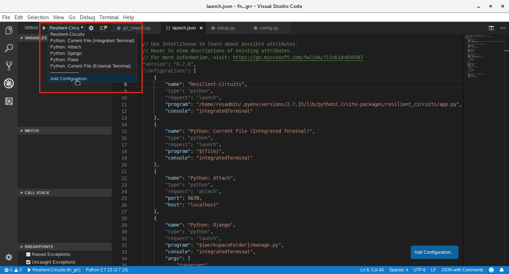
* The `launch.json` file opens
* Duplicate the first configuration and rename it to: **Resilient-Circuits**
* Set the program variable to the **location of resilient-circuits** on your machine
  > **Note:** you should append **resilient_circuits/app.py** to the result you got from `pip show resilient-circuits` above

  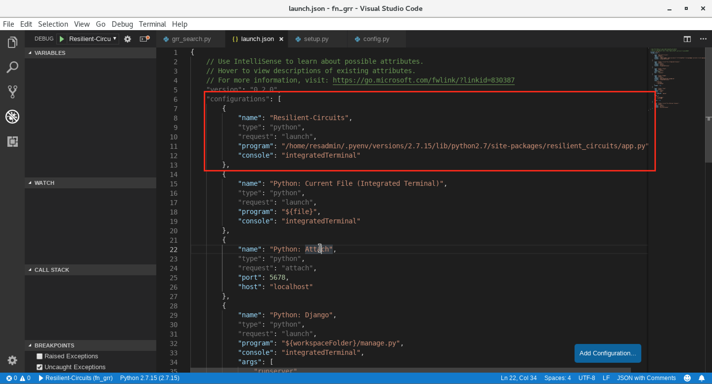
* Open `grr_search.py` in **VS Code** and add a **breakpoint** to line 87: `yield StatusMessage("Complete")`:
  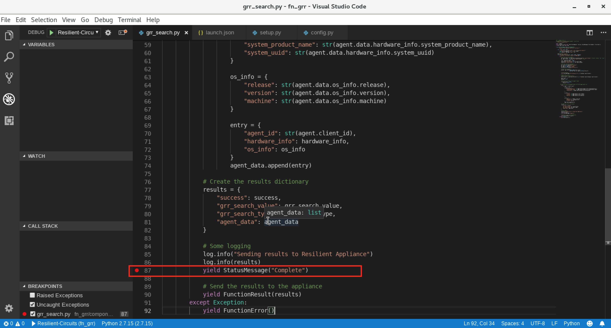
  > **Note:** to add a **breakpoint** click the space to the left of the line number
* Run resilient-circuits by pressing the **green play button**:
  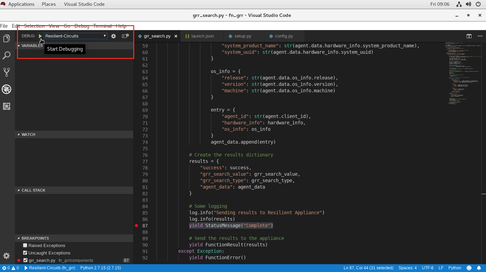
* You will see resilient-circuits start in your Terminal within VS Code:
  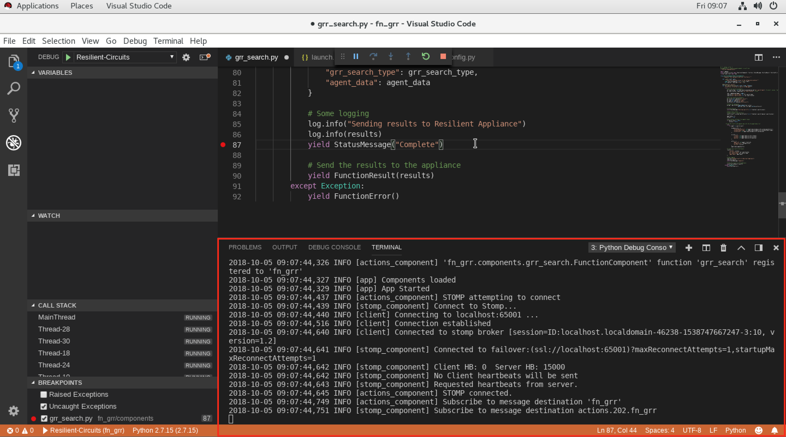
* Now, back to the **Resilient UI** and run the Workflow again
* Wait for the **debugger to stop at the breakpoint**
